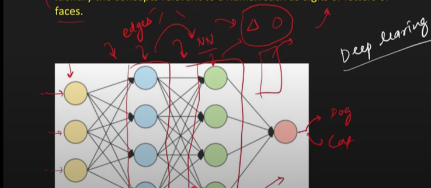
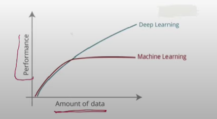
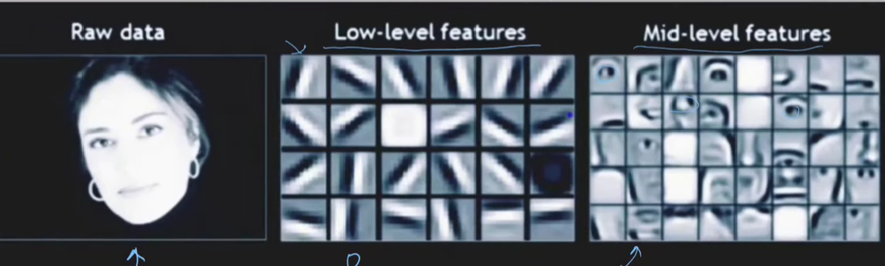
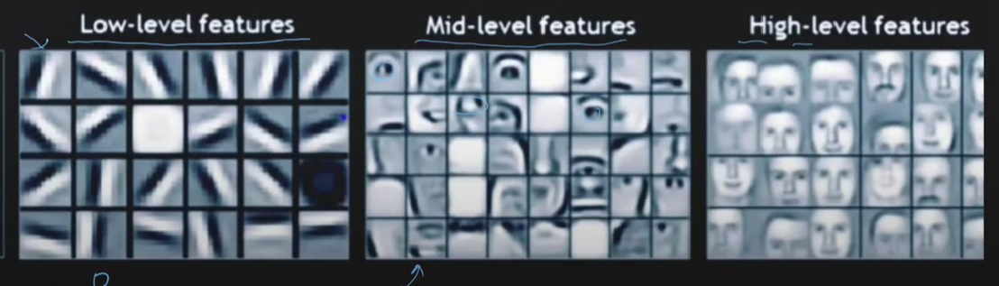

* **Introduction to Deep Learning:**
    * The material introduces **Deep Learning (DL)** as a significant and "beginner-friendly" course, starting from the very basics.
    * The initial focus is on understanding what Deep Learning is, its origins, how it differs from **Machine Learning (ML)**, and the reasons behind its current widespread popularity. The goal is to provide a complete perspective on the DL landscape in 2022.

* **What is Deep Learning?**
    * Two main types of definitions are generally found: a simple version and a more technical one.
    * **Simple Definition:**
        * **Deep Learning** is presented as a subfield of **Artificial Intelligence (AI)** and **Machine Learning (ML)**.
        * It's **inspired by the structure of the human brain**. The core idea is that DL algorithms attempt to draw conclusions similar to how humans do by analyzing data through a logical structure called a **Neural Network**.
        * **Visual Aid:** The material describes a Venn diagram illustrating AI as the largest umbrella, with ML as a subset, and DL as a further subset within ML.
            * **AI:** The overarching goal of creating intelligent machines.
            * **ML:** A subfield of AI where systems **learn from data** to identify relationships between inputs and outputs, often relying on **statistical techniques**.
            * **DL:** A subfield of ML that uses **Neural Networks** (logical structures inspired by the human brain) instead of purely statistical methods to find these input-output relationships.
        * **Neural Networks:**
            * Described as logical structures inspired by the human brain.
            * **Example Visual:** A simple **Artificial Neural Network (ANN)** is shown with:
                * **Perceptrons (Nodes/Circles):** Fundamental units.
                * **Connections (Arrows/Weights):** Link perceptrons and represent the strength of connections.
                * **Layers:** Groups of perceptrons (Input Layer, Hidden Layers, Output Layer).
                * **Input Layer:** Receives data.
                * **Output Layer:** Produces the result.
                * **Hidden Layers:** Layers between input and output. The "deep" in Deep Learning comes from having multiple hidden layers.
            * **Significance:** Neural networks are the core of DL, allowing models to learn complex patterns from data. The multi-layered structure (deep architecture) enables the learning of hierarchical features.
            * **Types of Neural Networks Mentioned:**
                * **ANN (Artificial Neural Network):** The simplest form.
                * **CNN (Convolutional Neural Network):** Excellent for image data.
                * **RNN (Recurrent Neural Network):** Effective for speech and textual (sequential) data.
                * **GANs (Generative Adversarial Networks):** Capable of generating new data like text or images.
                * **Intuition:** Different neural network architectures are like specialized tools, each designed to handle specific types of data and tasks effectively.
    * **Technical Definition:**
        * **Deep Learning** is part of a broader family of machine learning methods based on **artificial neural networks** with **Representation Learning**.
        * **Representation Learning (Feature Learning):**
            * This is a crucial concept. It means the system **automatically discovers the necessary features (representations) from raw data** for detection or classification.
            * This contrasts with traditional ML where **manual feature engineering** (humans defining and creating features) is often required.
            * **Example:** For a dog vs. cat image classifier:
                * In ML, you might manually define features like size, color, ear shape.
                * In DL, you provide the images, and the algorithm learns relevant features on its own.
            * **Significance:** Automating feature extraction saves significant effort and can lead to the discovery of features humans might overlook, often resulting in better performance.
        * **Hierarchical Feature Extraction:**
            * DL algorithms use **multiple layers to progressively extract higher-level features** from the raw input.
            * **Example (Image Processing):**
                * Lower layers might identify simple features like **edges**.
                * Intermediate layers might identify more complex features like **shapes (e.g., eyes, nose)** by combining edges.
                * Higher layers might identify even more abstract concepts or objects (e.g., **faces**) by combining shapes.
            * **Visual Aid:** The material describes a conceptual diagram showing an image input, with initial layers detecting edges, middle layers detecting parts like eyes or noses, and final layers recognizing a complete face. *A flowchart clearly illustrating this hierarchical process for a specific example (like face detection) would be very beneficial here.*
            * **Significance:** This hierarchical approach allows DL models to learn intricate patterns and build a rich understanding of the data, moving from simple to complex representations.

* **Why is Deep Learning So Famous/Successful?**
    * The material attributes DL's fame to two primary reasons:
        1.  **Applicability:**
            * DL algorithms are applicable across a vast range of domains, including: **Computer Vision, Speech Recognition, Natural Language Processing (NLP), Machine Translation, Bioinformatics, Drug Design, Medical Imaging, Climate Science, Material Inspection, Board Games (e.g., Go), and more.**
            * **Significance:** This versatility makes DL a powerful tool for solving diverse real-world problems.
        2.  **Performance:**
            * DL has achieved **state-of-the-art (SOTA) results** in many of these fields.
            * In some cases, DL models have even **surpassed human expert performance**.
            * **Example:** AlphaGo (a DL program) defeating the world champion in the game of Go.
            * **Significance:** The ability to achieve high accuracy and break performance barriers is a major driver of DL adoption. Examples include self-driving cars and advancements in medical science.

* **Deep Learning vs. Machine Learning: Key Differences**
    * The material outlines several practical distinctions:
        1.  **Data Requirement:**
            * **DL models generally require a very large amount of data** to perform well. They are "data-hungry."
            * ML models can often work effectively with smaller datasets.
            * **Visual Aid:** A graph is described showing "Amount of Data" on the x-axis and "Performance" on the y-axis.
                * For small amounts of data, traditional ML algorithms might outperform DL.
                * As data increases, DL models' performance tends to improve significantly (almost linearly), while ML models' performance may plateau.
                * *A clear line graph illustrating this relationship for both ML and DL would effectively convey this point.*
            * **Significance:** The need for big data is a critical consideration when choosing between ML and DL.
        2.  **Hardware:**
            * **DL models often require powerful hardware, especially GPUs (Graphical Processing Units)**, due to complex matrix multiplications. Training on CPUs can be very slow.
            * ML models can often be trained on standard CPUs.
            * **Significance:** The hardware cost and infrastructure can be higher for DL projects.
        3.  **Training Time:**
            * **DL model training time can be very high**, sometimes taking weeks or even months for large datasets and complex models.
            * ML model training is generally much faster (minutes or hours).
            * **Prediction Time:** While training DL is slow, **prediction (inference) with a trained DL model is often very fast.** Some ML algorithms (e.g., k-NN) can have slow prediction times.
            * **Significance:** Long training times necessitate careful planning and resource allocation for DL.
        4.  **Feature Selection/Engineering:**

            * As discussed under "Representation Learning," **DL models perform automatic feature extraction.**
            * In ML, **manual feature engineering is typically required**, which can be time-consuming and requires domain expertise.
            * **Example:** A project to predict student placement based on resumes.
                * ML approach: Manually extract features like 10th/12th marks, number of achievements, college quality. This might require domain experts (e.g., HR professionals, teachers).
                * DL approach: Feed the raw resume content (in the correct format) to the model, and it learns relevant features automatically.
            * **Significance:** DL simplifies the preprocessing pipeline by automating a complex and often challenging step.
        5.  **Interpretability:**
            * **DL models are often considered "black boxes."** It can be difficult to understand exactly *why* a model made a particular decision or what specific features it relied on.
            * Many ML models (e.g., Decision Trees, Linear Regression) are more **interpretable**, allowing users to understand the decision-making process.
            * **Example:** If a DL model denies a user access based on comments, it's hard to explain the exact reason. An ML model like a decision tree could show the specific rules that led to the decision.
            * **Significance:** Lack of interpretability can be a major drawback in critical applications where explanations are necessary (e.g., finance, healthcare, legal domains).

    * **Key Takeaway:** DL does not replace ML. They are tools suited for different situations. The choice ("needle vs. sword") depends on the problem, data availability, resources, and the need for interpretability.

* **Reasons for Deep Learning's Recent Surge in Popularity (Post-2010s)**
    * While DL concepts have existed since the 1960s, its widespread adoption is more recent. The material identifies five key driving forces:
        1.  **Data Availability (Big Data):**
            * The "data-hungry" nature of DL means it thrives on vast datasets.
            * **Revolutionary Factors:**
                * **Smartphone Revolution:** Billions of people generating data.
                * **Internet Pricing Revolution (Affordable High-Speed Internet):** Enabled widespread use of data-intensive apps (e.g., TikTok, Snapchat, social media).
            * This has led to an **exponential increase in data generation**.
            * **Public Datasets:** Crucially, large companies (Microsoft, Google, Facebook) invested in labeling massive datasets and making them publicly available (e.g., **COCO** for image detection, **YouTube 8M** for videos, **SQuAD** for text/question-answering from Wikipedia, **Google AudioSet**).
            * **Significance:** The availability of massive, labeled datasets has been a cornerstone for training and advancing DL models.
        2.  **Hardware Advancements:**
            * **Moore's Law:** The observation that the number of transistors on a microchip doubles approximately every two years, while the cost halves. This has led to increasingly powerful and cheaper electronics.
            * **GPUs (Graphical Processing Units):** Initially for graphics, GPUs were found to be highly effective for the parallel processing required in DL (matrix operations), speeding up training by 10-20x compared to CPUs. **NVIDIA's CUDA** (a parallel computing platform and programming model) was a key enabler.
            * **Specialized Hardware:**
                * **FPGAs (Field-Programmable Gate Arrays):** Fast, low-power, reprogrammable, but expensive (e.g., Xilinx). Used by Microsoft Bing.
                * **ASICs (Application-Specific Integrated Circuits):** Custom-made chips.
                    * **TPUs (Tensor Processing Units):** Developed by Google specifically for DL model training (available on Google Colab).
                    * **Edge TPUs:** For running DL models on edge devices (drones, smartwatches, smart glasses).
                    * **NPUs (Neural Processing Units):** Integrated into smartphones to accelerate AI operations.
            * **Significance:** Advances in hardware have made it feasible to train complex DL models on massive datasets in a reasonable timeframe. *A timeline graphic showing the co-evolution of DL algorithms and specialized hardware could be illustrative.*
        3.  **Frameworks and Libraries:**
            * Coding DL models from scratch is complex. Libraries and frameworks simplify this.
            * **TensorFlow (Google, 2015):** Initially powerful but difficult to use.
            * **Keras:** A higher-level API that worked on top of TensorFlow, making it much more user-friendly. TensorFlow 2.0 integrated Keras.
            * **PyTorch (Facebook, 2016):** Gained popularity, especially among researchers, for its flexibility.
            * **Caffe2 (Facebook, 2018):** Focused on deploying PyTorch models to servers. Later merged with PyTorch.
            * **AutoML Tools:** GUI-based applications (e.g., Google's AutoML, Microsoft's Custom Vision AI, Apple's Create ML) that allow building models with minimal coding, and can export code in TensorFlow or PyTorch.
            * **Significance:** These tools have democratized DL development, making it accessible to a broader range of developers and researchers.
        4.  **Advancements in Model Architectures:**
            * **Neural Network Architecture:** Refers to the specific arrangement of nodes (neurons) and connections (weights) in a network. Finding the best architecture often requires experimentation.
            * **Pre-trained Models & Transfer Learning:** Researchers have developed and trained highly effective architectures on large datasets. These pre-trained models can be downloaded and adapted (fine-tuned) for new, related problems. This is known as **Transfer Learning**.
            * **Examples of State-of-the-Art Architectures:**
                * Image Classification: **ResNet**
                * Text Classification/NLP: **BERT, Transformers**
                * Image Segmentation: **U-Net**
                * Image Translation: **pix2pix**
                * Object Detection: **YOLO (You Only Look Once)**
                * Speech Generation: **WaveNet**
            * **Significance:** Transfer learning and the availability of SOTA pre-trained models have drastically reduced the effort and data needed to achieve good results on many tasks, accelerating adoption.
        5.  **Community and People:**
            * The passion and dedication of researchers, engineers, educators, students, and platforms like Kaggle have collectively driven the field forward.
            * The belief in DL's potential to change the world is a strong motivator.
            * **Significance:** A vibrant and collaborative community is essential for innovation, knowledge sharing, and pushing the boundaries of any technology.

* **Concluding Remarks from the Material:**
    * The presenter acknowledges the video might be lengthy but aimed for thoroughness.
    * Encourages likes on the video to help YouTube promote the content and for others preparing for DL to find it.

**Stimulating Learning Prompts for Deeper Reflection:**

1.  The material highlights the "black box" nature of many Deep Learning models as a challenge for interpretability. In what kinds of real-world applications might this lack of transparency be particularly problematic or even dangerous, and what steps could be taken to mitigate these risks?
2.  Considering the rapid advancements in hardware (GPUs, TPUs, NPUs) and the increasing availability of pre-trained models, how do you foresee the role of a "Deep Learning Engineer" evolving in the next 5-10 years? What skills will be most crucial?

 