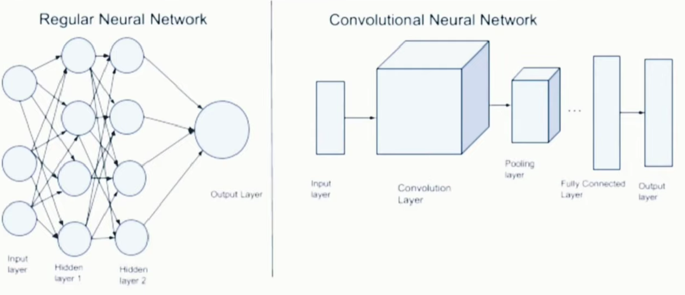
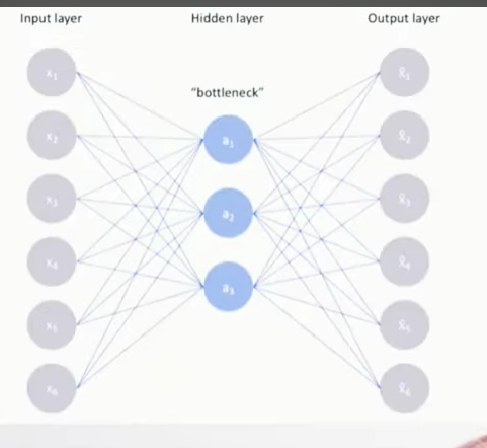
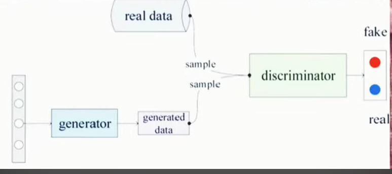

### Core Concepts & Insights from the Material

**I. A Glimpse into the "Zoo" of Neural Networks: Types and Their Significance**

The material introduces several foundational types of **Artificial Neural Networks (ANNs)**, each designed to tackle different kinds of problems. Understanding these architectures is key to appreciating the versatility of deep learning.

* **Multi-Layer Perceptron (MLP):**
    * **Concept:** The **MLP** is described as a fundamental **feedforward neural network**, characterized by an input layer, one or more **hidden layers**, and an output layer. Information flows in one direction, from input to output.
    * **Significance:** MLPs are the workhorses for many **supervised learning** tasks, such as **regression** and **classification**. Their ability to model **non-linear relationships** makes them powerful tools when simple linear models fall short.
    * *Visual Aid Suggestion:* A simple diagram showing interconnected nodes in layers (input, hidden, output) would clarify the structure of an MLP.

* **Convolutional Neural Network (CNN or ConvNet):**
    * **Concept:** **CNNs** are specialized networks, particularly effective for processing data with a grid-like topology, such as images. They employ a mathematical operation called **convolution**, using **filters (or kernels)** to detect features like edges, textures, and patterns. Key layers include convolutional layers, pooling layers, and fully connected layers.
    * **Significance:** CNNs have revolutionized **computer vision**. They are the backbone of applications like **image processing, video analysis, self-driving car perception systems** (e.g., identifying pedestrians and other vehicles), and **medical image analysis** (e.g., detecting cancer in scans). The material mentions Yann LeCun as a pivotal figure in their development.
    * *Visual Aid Suggestion:* An illustration depicting how filters slide across an image to create feature maps would be highly beneficial for understanding the convolution operation.

* **Recurrent Neural Network (RNN):**
    * **Concept:** Unlike feedforward networks, **RNNs** are designed to handle **sequential data** by incorporating loops, allowing information to persist—essentially giving them a "memory." This enables them to use prior information in a sequence to influence later outputs.
    * **Significance:** RNNs are crucial for tasks involving sequences, such as **Natural Language Processing (NLP)** (e.g., language modeling, machine translation as seen in Google Translate, and powering virtual assistants like Siri and Alexa), speech recognition, and time series analysis. A popular and effective type of RNN highlighted is the **Long Short-Term Memory (LSTM)** network, which is adept at learning long-range dependencies.
    * *Visual Aid Suggestion:* A diagram showing a neuron or layer with a recurrent connection (an arrow looping back to itself) would illustrate the core idea of information persistence in RNNs.

* **Autoencoders:**
    * **Concept:** **Autoencoders** are **unsupervised learning** networks that aim to learn a compressed representation (encoding) of the input data and then reconstruct (decode) the original input from this compressed form. They typically feature a bottleneck layer that is smaller than the input and output layers.
    * **Significance:** They are valuable for **dimensionality reduction, feature learning, data compression** (e.g., reducing file size while aiming to preserve quality), and **noise reduction** in data.
    * *Visual Aid Suggestion:* A diagram showing the symmetrical "hourglass" structure of an autoencoder (input layer, encoding layers, bottleneck layer, decoding layers, output layer) would be helpful.

* **Generative Adversarial Networks (GANs):**
    * **Concept:** Introduced by Ian Goodfellow, **GANs** are a fascinating class of models where two neural networks, the **Generator** and the **Discriminator**, are trained simultaneously in a competitive setting. The Generator creates synthetic data (e.g., images), while the Discriminator tries to distinguish this fake data from real data.
    * **Significance:** GANs have unlocked powerful capabilities in **data generation**, such as creating hyper-realistic images of non-existent people, image-to-image translation (e.g., turning a sketch into a photo), and data augmentation to improve the performance of other machine learning models.
    * *Visual Aid Suggestion:* A conceptual diagram illustrating the two-network architecture (Generator and Discriminator) and their adversarial training process (Generator trying to fool the Discriminator, Discriminator trying to catch fakes) would clarify their operation.

**II. The Rollercoaster Journey: A History of Deep Learning**

The material paints a vivid picture of deep learning's evolution, marked by periods of intense excitement, frustrating setbacks ("AI winters"), and ultimately, a triumphant resurgence.

* **Early Seeds (1950s):**
    * The journey began with Frank Rosenblatt's **Perceptron** in 1958, an early algorithm for supervised learning of binary classifiers. It was initially met with great enthusiasm, with Rosenblatt himself making bold claims about its potential to "think."
    * **Significance:** The Perceptron was a foundational step, demonstrating that machines could learn from data, albeit in a limited way.

* **The First "AI Winter" (late 1960s - 1970s):**
    * In 1969, Marvin Minsky and Seymour Papert's book "Perceptrons" highlighted critical limitations, notably the inability of a single perceptron to solve non-linearly separable problems like the **XOR problem**.
    * **Significance:** This critique led to a significant downturn in AI research funding and interest, demonstrating the impact of theoretical limitations on practical progress.

* **The Re-Awakening – Backpropagation (1980s):**
    * A breakthrough came in 1986 with the popularization of the **backpropagation algorithm** by Rumelhart, Hinton, and Williams. This algorithm provided an efficient way to train **Multi-Layer Perceptrons (MLPs)**.
    * **Significance:** Backpropagation enabled neural networks with multiple layers to learn complex patterns and overcome the limitations of single perceptrons, including solving the XOR problem. This was a crucial development, supported by the **Universal Approximation Theorem**, which suggests MLPs can approximate a wide range of functions.
    * Yann LeCun's work in the late 1980s/early 1990s on **LeNet**, a CNN for handwritten digit recognition (used for reading zip codes), showcased practical applications.

* **Challenges and a Second Slowdown (1990s - early 2000s):**
    * Despite progress, challenges remained: training very deep networks was difficult (e.g., the **vanishing gradient problem**), computational power was still relatively limited, and large datasets were scarce. Other machine learning techniques like Support Vector Machines (SVMs) gained prominence.
    * **Significance:** This period underscored that algorithmic breakthroughs alone weren't sufficient without adequate data and computational resources.

* **The Deep Learning Renaissance (2006 onwards):**
    * Around 2006, Geoffrey Hinton and his colleagues introduced techniques like **unsupervised pre-training** for **Deep Belief Networks**, which helped in initializing weights for deep architectures. The term "**Deep Learning**" gained traction.
    * **Significance:** These techniques provided a path to effectively train deeper networks, reigniting interest.
    * The true turning point, as highlighted in the material, was in 2012. **AlexNet**, a deep CNN developed by Hinton's team (including Alex Krizhevsky and Ilya Sutskever), won the ImageNet Large Scale Visual Recognition Challenge (ILSVRC) by a significant margin. This was achieved by leveraging large datasets (ImageNet) and training on **Graphics Processing Units (GPUs)**.
    * **Significance:** AlexNet's success was a landmark event, demonstrating the superior performance of deep learning on complex tasks and catalyzing the current boom.

* **Modern Era (Post-2012):**
    * The field has exploded with advancements:
        * Major tech companies (Google, Facebook, etc.) heavily invested in research and development.
        * **Ian Goodfellow** introduced **GANs** in 2014, opening new frontiers in generative modeling.
        * In 2016, DeepMind's **AlphaGo** (using deep reinforcement learning) defeated the world Go champion, Lee Sedol, showcasing AI's prowess in highly complex strategic games.
    * **Key Enablers for this explosion:**
        * **Big Data:** The availability of vast amounts of labeled data (much of it user-generated).
        * **Hardware:** The parallel processing power of **GPUs**.
        * **Algorithmic Innovations:** New network architectures, activation functions, and optimization methods.
        * **Open-Source Frameworks:** Tools like TensorFlow, PyTorch, and Keras democratized access and accelerated research.
    * *Visual Aid Suggestion:* A timeline graphic illustrating these key milestones, breakthroughs, and "AI winter" periods would effectively summarize the historical progression.

**III. Deep Learning in Action: A Spectrum of Applications**

The material emphasizes how deep learning has permeated numerous industries and aspects of daily life, driving innovation and transforming capabilities.

* **Autonomous Systems:**
    * **Self-Driving Cars:** Deep learning is critical for perception (object detection, lane finding) and decision-making in autonomous vehicles. The material points to companies actively developing these, processing sensor data (from cameras, LiDAR) to navigate roads.
    * *Example:* Cars being tested that can navigate traffic autonomously.

* **Advanced Game Playing:**
    * AI agents like DeepMind's **AlphaGo** (defeating Go champions) and **OpenAI Five** (competing in complex video games like Dota 2) demonstrate deep learning's ability to master intricate strategies.
    * **Significance:** These are not just about games; they showcase the potential for solving complex real-world problems requiring strategic reasoning.

* **Conversational AI & Chatbots:**
    * Deep learning models (RNNs, LSTMs, Transformers) have dramatically improved the naturalness and contextual understanding of chatbots and virtual assistants.
    * *Example:* The enhanced conversational abilities of customer service bots and personal assistants.

* **Creative & Generative Applications:**
    * **Image Colorization:** Automatically adding realistic color to black-and-white images and videos.
    * **Image Caption Generation:** AI systems that can look at an image and generate a relevant textual description.
    * **Face Generation (via GANs):** Creating highly realistic images of human faces that are entirely synthetic.
    * **Music and Handwriting Generation:** AI composing original music or generating human-like handwriting.
    * **Story Writing:** AI models attempting to write coherent narratives.
    * **Automatic Audio Generation from Video:** Creating relevant soundscapes or effects for video content.

* **Language & Vision Integration:**
    * **Machine Translation:** Services like Google Translate use deep learning (Neural Machine Translation) for significantly improved real-time translation between languages.
    * **Object Detection and Recognition:** Systems like Google Photos use deep learning to identify objects, people, and scenes within images, enabling powerful search and organization features.
    * *Example (Object Detection):* Google Photos automatically creating albums for specific people or pets based on recognizing them in photos.

* **Image Enhancement & Restoration:**
    * Improving the quality of images, such as **super-resolution** (creating high-resolution images from low-resolution ones) or restoring old, damaged photos.

* **Healthcare & Scientific Research:**
    * **Medical Image Analysis:** Assisting in the detection of diseases like cancer from X-rays, CT scans, and MRIs.
    * **Drug Discovery:** Accelerating the process of identifying and developing new medicines.
    * The material mentions research in areas like predicting customer churn, fraud detection, and personalized education.

The overarching message is that deep learning is not just an academic pursuit but a powerful, versatile technology that is actively reshaping industries and creating new possibilities. The confluence of **abundant data, powerful hardware (especially GPUs), and sophisticated algorithms** has fueled its current impact.

### Stimulating Learning Prompts:

1.  Considering the rapid advancements in generative models like GANs, what ethical considerations and potential societal impacts should be prioritized as these technologies become more powerful and accessible?
2.  The "AI winters" were periods of reduced funding and interest. What lessons can be learned from these historical setbacks to ensure sustained progress in AI research and development today, even when facing new challenges or limitations?
 