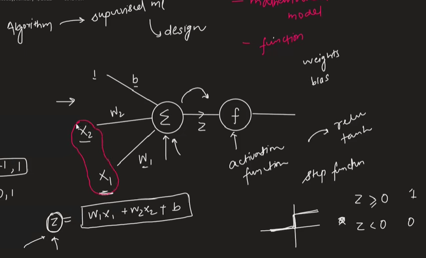
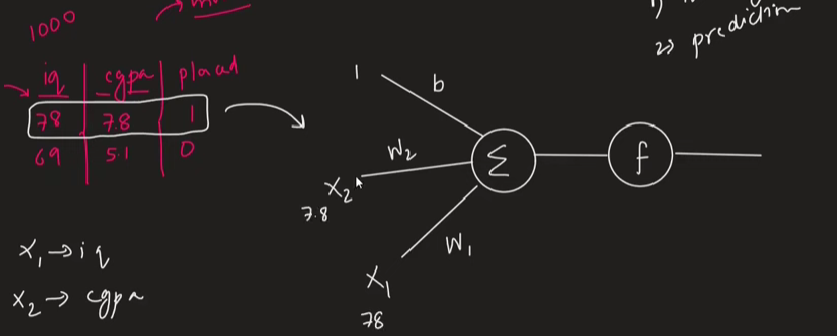
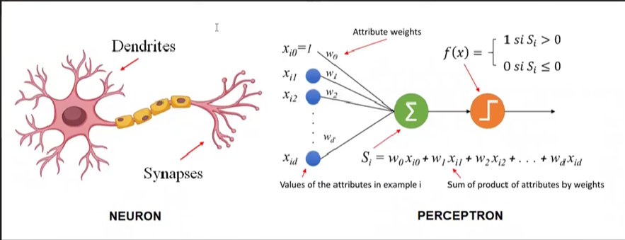
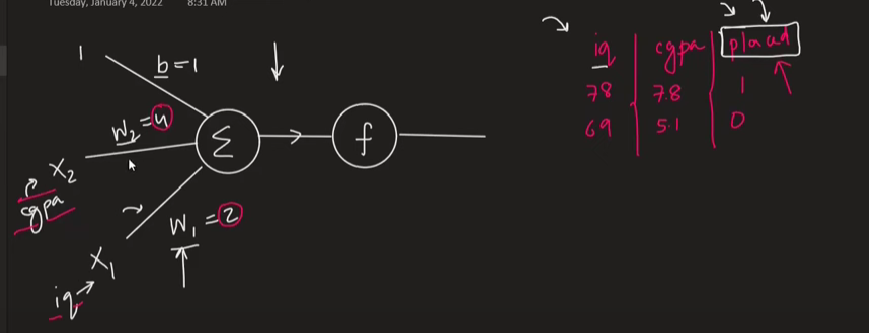
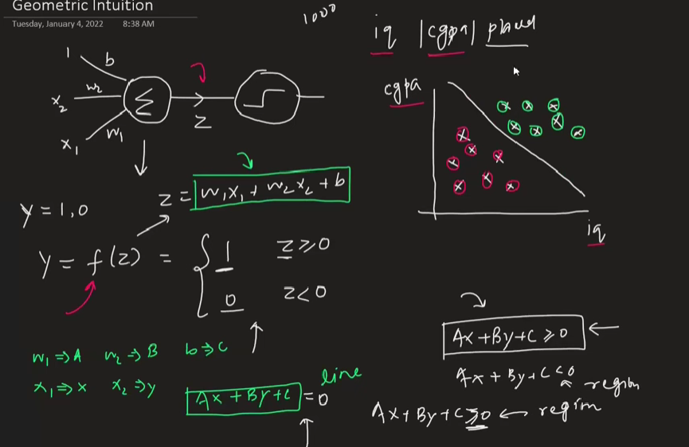
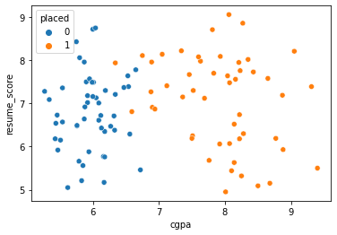
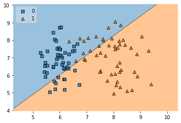

## Perceptron: The Foundation of Neural Networks

The material introduces the **Perceptron** as a fundamental **algorithm** in machine learning, specifically for **supervised learning tasks**. It's highlighted as the essential building block of **Artificial Neural Networks (ANNs)**, making it a crucial starting point for understanding deep learning. The presenter plans to cover the Perceptron's introduction, its geometric intuition, training process, limitations, and then transition to Multi-Layer Perceptrons (MLPs). The importance of understanding a single Perceptron before moving to MLPs is emphasized for a better learning framework.

---

### What is a Perceptron?

- **Algorithm & Mathematical Model**: The Perceptron is described as both an algorithm (like Linear Regression, Logistic Regression, SVM) and a **mathematical model** or **function**.
- **Purpose**: It's used for supervised machine learning and forms the basis of deep learning due to its design.

#### The Design of a Perceptron

The material presents a visual diagram of a Perceptron.

- **Inputs ($x_1, x_2, \dots, x_n$)**: These are the features fed into the model. The example uses two inputs, $x_1$ and $x_2$.
- **Weights ($w_1, w_2, \dots, w_n$)**: Each input $x_i$ is associated with a weight $w_i$. These weights signify the importance of each input.
- **Bias (b)**: Represented as an additional input of '1' multiplied by a weight 'b' (the bias term). The material shows this as a connection from a '1' input.
- **Summation Unit ($\Sigma$)**: This unit calculates the weighted sum of the inputs plus the bias. The operation is a **dot product**:
  $Z = (w_1 \cdot x_1) + (w_2 \cdot x_2) + \dots + (w_n \cdot x_n) + b$
  The video uses the notation $Z = w_1x_1 + w_2x_2 + b$ for a two-input example.
- **Activation Function (f)**: The sum $Z$ is then passed through an **activation function**.
  - **Purpose**: To transform the sum $Z$ into a desired output range (e.g., 0 to 1, -1 to 1).
  - **Example given**: A **Step Function**.
    - If $Z > 0$, output is 1.
    - If $Z \le 0$ (or $Z < 0$ as mentioned for less than zero), output is 0.
    - The material mentions a visual graph for the step function: a horizontal line at $y=0$ for $x<0$ and a jump to a horizontal line at $y=1$ for $x \ge 0$.
  - Other activation functions like ReLU and Tanh are mentioned as topics for future discussion.
- **Output (Y)**: The final result after the activation function is applied. For the step function, this is typically 0 or 1, representing a class label.

> _Visual Aid Suggestion_: A clear diagram of a single perceptron, labeling inputs, weights, bias, summation unit, activation function, and output would be highly beneficial here. The source material likely contains such a diagram.

---

### How a Perceptron Works: Training and Prediction

The material explains the Perceptron's operation using a student placement prediction example:

- **Problem**: Predict if a student gets placed (1) or not (0) based on their **IQ ($x_1$)** and **college CGPA ($x_2$)**.
- **Dataset**: 1000 students with IQ, CGPA, and Placement status (1 or 0).

#### Two Stages:

1.  **Training**:

    - The goal of training is to find the optimal values for the **weights ($w_1, w_2$)** and the **bias (b)**.
    - This is done by feeding the training data (IQ, CGPA, and known Placement status) into the Perceptron.
    - The process of how these values are learned (the "training process") is mentioned as a topic for a future, more detailed discussion.

2.  **Prediction**:
    - Once $w_1, w_2$, and $b$ are learned (e.g., $w_1=1, w_2=2, b=3$ from the example), the Perceptron can predict outcomes for new students.
    - **Example Calculation**:
      - New student: IQ = 100 ($x_1$), CGPA = 5.1 ($x_2$).
      - $Z = (w_1 \cdot x_1) + (w_2 \cdot x_2) + b = (1 \cdot 100) + (2 \cdot 5.1) + 3 = 100 + 10.2 + 3 = 113.2$.
      - This $Z$ value (113.2) is passed to the activation function (step function). Since $113.2 > 0$, the output is 1 (student gets placed). If $Z$ were negative, the output would be 0.

- **Handling More Inputs**: If there are more input features (e.g., student's state), you simply add more inputs ($x_3, x_4, \dots$) and corresponding weights ($w_3, w_4, \dots$) to the model. The summation equation expands accordingly: $Z = w_1x_1 + w_2x_2 + w_3x_3 + b$.

---

### Perceptron vs. Biological Neuron

The material draws a comparison between the artificial Perceptron and a **biological neuron**, noting that deep learning is heavily inspired by the human nervous system.

- **Biological Neuron Components**:

  - **Dendrites**: Receive input signals.
  - **Nucleus (Cell Body)**: Processes information.
  - **Axon**: Transmits output signals.

- **Similarities (Weak Inspiration)**:

  - The Perceptron's inputs can be roughly compared to **dendrites**.
  - The summation and activation function can be roughly compared to the **nucleus/cell body's processing**.
  - The Perceptron's output can be roughly compared to the **axon**.
  - Multiple Perceptrons can be connected to form a neural network, similar to how neurons connect to form the nervous system.

- **Key Differences**:

  1.  **Complexity**: Biological neurons are vastly more **complex** than Perceptrons. A Perceptron is a very simplified mathematical model.
  2.  **Internal Calculations**: What happens inside a neuron's nucleus is a complex **electrochemical reaction**, much of which is still not fully understood by scientists. In contrast, a Perceptron uses simple mathematical operations (summation and a defined activation function).
  3.  **Neuroplasticity**: Biological neurons exhibit **neuroplasticity**, meaning connections (synapses) can strengthen, weaken, form, or disappear over time as learning occurs (dendrite/axon connections can change thickness or new ones can form). The Perceptron model described has fixed connections, though the _weights_ on these connections change during training. The structure itself (which inputs connect to the summation unit) doesn't change in the basic model.

- **Conclusion**: The Perceptron is **weakly inspired** by the biological neuron in its design elements but is not a direct or true copy. It's a much simpler abstraction.

---

### Interpretation of Weights

- **Feature Importance**: The **weights** ($w_1, w_2$, etc.) in a Perceptron model provide an interpretation of the **strength** or **importance** of their corresponding input features.
- **Example**: If, after training the student placement model, $w_1$ (for IQ) = 2 and $w_2$ (for CGPA) = 4, it suggests that **CGPA is a more important factor** (twice as important in this hypothetical case) than IQ in determining placement, according to the model.
- The bias term's role is mentioned as a topic for future discussion.

---

### Geometric Intuition of a Perceptron

This section aims to visualize how a Perceptron works.

- The Perceptron's output $Y$ is a function of $Z$, where $Z = w_1x_1 + w_2x_2 + b$.
- Using a step function, $Y=1$ if $Z \ge 0$, and $Y=0$ if $Z < 0$.
- Consider the equation $w_1x_1 + w_2x_2 + b = 0$.
  - If we let $w_1 = A$, $w_2 = B$, $b = C$, $x_1 = x$, and $x_2 = y$, the equation becomes $Ax + By + C = 0$. This is the **equation of a line** in a 2D plane (where $x_1$ is on the x-axis and $x_2$ is on the y-axis).
- **Decision Boundary**: The Perceptron essentially learns this **line**.
  - Points on one side of the line (e.g., where $w_1x_1 + w_2x_2 + b > 0$) are classified as one class (e.g., placement = 1).
  - Points on the other side (where $w_1x_1 + w_2x_2 + b < 0$) are classified as the other class (e.g., placement = 0).
- **Regions**: The line divides the input space into **two regions**, corresponding to the two output classes. This is why a Perceptron is a **binary classifier**.

> _Visual Aid Suggestion_: A 2D scatter plot showing two classes of data points (e.g., green for placed, red for not placed) with a line (the decision boundary) separating them would be very effective. The source material shows such a plot.

#### Dimensionality:

- **2D Inputs (e.g., IQ, CGPA)**: The decision boundary is a **line**.
- **3D Inputs (e.g., IQ, CGPA, 12th marks)**: The equation becomes $w_1x_1 + w_2x_2 + w_3x_3 + b = 0$, which is the equation of a **plane**. The Perceptron model acts as a plane separating the 3D space into two regions.
- **4D or Higher Inputs**: The decision boundary is a **hyperplane**.

#### Limitation of Perceptron: Linear Separability

- A crucial takeaway is that a single Perceptron can only classify data that is **linearly separable** (or "sort of" linearly separable, meaning a few misclassifications are acceptable).
- This means the classes must be separable by a straight line (in 2D), a flat plane (in 3D), or a hyperplane (in higher dimensions).
- **Failure Case**: If the data is **non-linearly separable** (e.g., one class of points forming a circle inside another class of points), a single Perceptron will fail to find an adequate decision boundary and will have very low accuracy.
  - The material shows an example of a non-linear dataset (concentric circles or an 'XOR' like pattern) where a line cannot separate the classes.
- This limitation is why Perceptrons, in their basic form, are not powerful enough for many real-world problems and led to the development of multi-layer perceptrons.

---

- **Dataset**: A student dataset with **CGPA**, **Resume Score**, and **Placement** status (0 or 1). Both CGPA and Resume Score range from 0 to 10.
- **Visualization**: A scatter plot shows that the data is largely linearly separable (blue points for not placed, orange for placed).
- **Goal**: The Perceptron will try to draw a line to separate these two classes. In doing so, it will calculate $w_1$ (for CGPA), $w_2$ (for Resume Score), and $b$ (bias).
- **Steps in Code**:
  1.  Import libraries (pandas, scikit-learn's `Perceptron`, `mlx_extend` for plotting decision regions).
  2.  Load data.
  3.  Separate features (X: CGPA, Resume Score) and target (y: Placement).
  4.  Create a `Perceptron` object: `p = Perceptron()`.
  5.  Train the model: `p.fit(X, y)`.
  6.  Access learned parameters:
      - Weights: `p.coef_` (returns an array, e.g., `[[40.something, -36.something]]` where $w_1=40.\dots, w_2=-36.\dots$).
      - Bias: `p.intercept_` (e.g., `[-25]`).
  7.  Plot decision boundary using `plot_decision_regions` from `mlx_extend`. The output shows the data points and the line drawn by the Perceptron.
- **Observation**: The resulting line might not be perfect, attributed to default configurations, minimal effort in tuning, and small dataset size. The goal of the demo was to show the practical application matching the theory.

> _Visual Aid Suggestion_: The code snippet for training the Perceptron and the resulting plot of the decision boundary are key visuals from this section.

### Practical Example: Perceptron in Code

The presenter demonstrates applying the Perceptron algorithm using Python's **scikit-learn** library.

```python
import numpy as np
import pandas as pd
import seaborn as sns
import matplotlib.pyplot as plt
from sklearn.linear_model import Perceptron
from mlxtend.plotting import plot_decision_regions

# Load the dataset (placement.csv should be in the same directory)
df = pd.read_csv('placement.csv')
print(df.shape)
df.head()

# Visualize the data
sns.scatterplot(df['cgpa'], df['resume_score'], hue=df['placed'])
plt.xlabel('CGPA')
plt.ylabel('Resume Score')
plt.title('Placement Data Distribution')
plt.show()

# Prepare features and target
X = df.iloc[:, 0:2]
y = df.iloc[:, -1]

# Train Perceptron model
p = Perceptron()
p.fit(X, y)

# Model parameters
print('Weights:', p.coef_)
print('Bias:', p.intercept_)

# Plot decision boundary
plot_decision_regions(X.values, y.values, clf=p, legend=2)
plt.xlabel('CGPA')
plt.ylabel('Resume Score')
plt.title('Perceptron Decision Boundary')
plt.show()
```


---

### Stimulating Learning Prompts

1.  How might the choice of activation function (beyond the simple step function) impact the Perceptron's capabilities or its training process?
2.  Given the Perceptron's limitation to linear separability, what kind of modifications or extensions (leading towards multi-layer perceptrons) would be necessary to handle more complex, non-linear data patterns?
