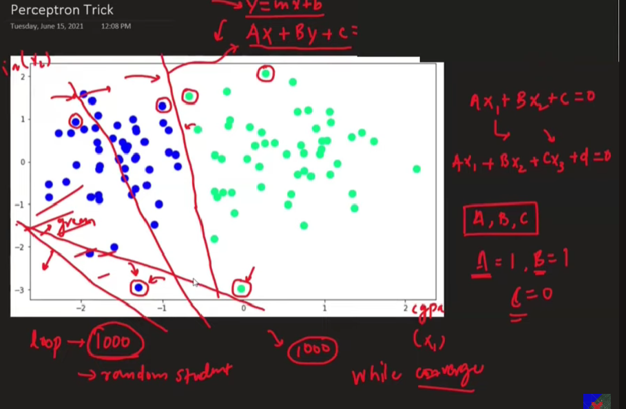
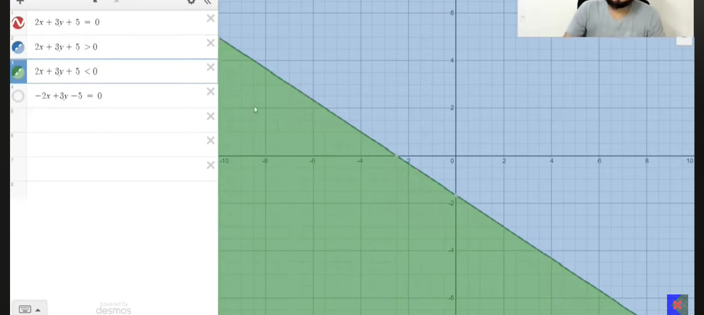
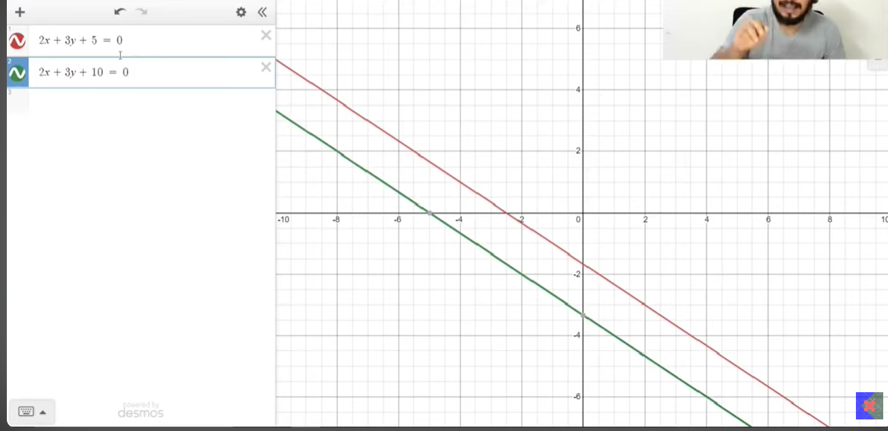
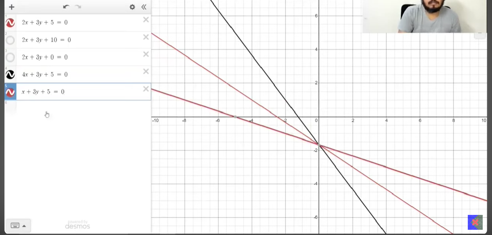
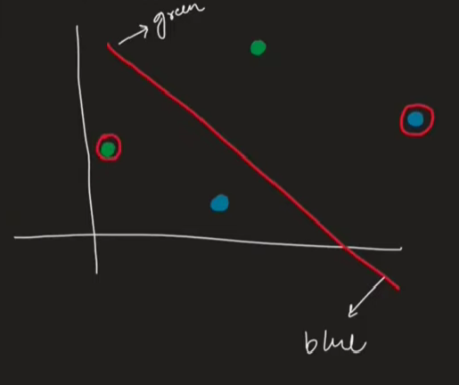
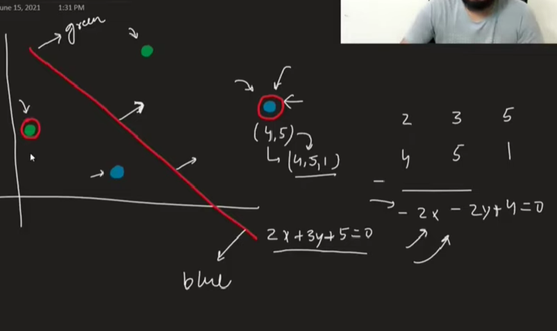
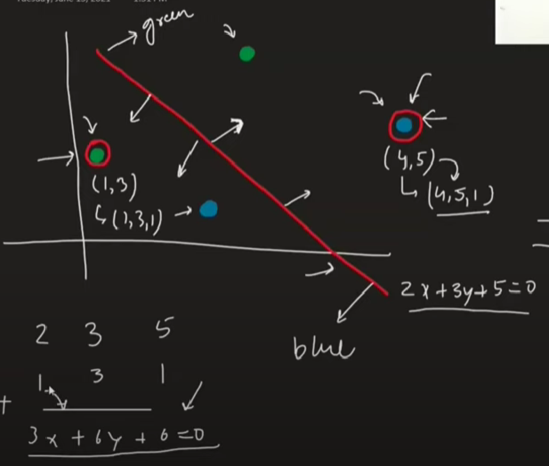

 
## Training a Perceptron: Finding the Right Line

The core challenge in using a **perceptron** is to find the optimal values for its **weights (w1, w2, ...)** and **bias (w0 or c)**. These parameters define the **decision boundary** (a line in 2D, a plane in 3D, or a hyperplane in higher dimensions) that the perceptron uses to classify data. The goal of training is to adjust these weights and bias iteratively so that the perceptron can correctly distinguish between different classes, assuming the data is **linearly separable**.

* **Linear Separability is Key:** The perceptron training algorithm is guaranteed to find a solution *if* the data can indeed be separated by a straight line (or hyperplane). Imagine you have two sets of points on a graph; if you can draw one straight line to divide them perfectly, the data is linearly separable.

---

### The Iterative Learning Process: Nudging the Line

Training a perceptron isn't a one-shot calculation; it's an iterative process of refinement:

* **Start Somewhere:** Begin with an initial random guess for the weights and bias. This initial line will likely misclassify many data points.
* **Pick a Point, Check the Classification:**
    * Select a data point from your training set.
    * Feed its features into the current perceptron (i.e., calculate $w_0 \cdot 1 + w_1x_1 + w_2x_2$).
    * If the output of this calculation (often called the **activation** or **weighted sum**) is greater than zero, the perceptron predicts one class (e.g., "positive" or class 1). If it's less than or equal to zero, it predicts the other class (e.g., "negative" or class 0).
* **If Misclassified, Adjust:** This is the crucial learning step.
    * If the perceptron's prediction for the chosen point is wrong, the weights and bias need to be updated. The goal is to "nudge" the decision boundary line to better classify that specific point (and hopefully others like it).
    * The material describes an intuition: the misclassified point "pulls" the line towards it (if it should be on the other side) or "pushes" it away.
* **Repeat Many Times (Epochs):** This process of picking a point, checking, and adjusting is repeated for all points in the training dataset, multiple times. Each full pass through the dataset is called an **epoch**.
* **Convergence:** If the data is linearly separable, this iterative process will eventually lead to a set of weights and bias that correctly classifies all training points, and the line will stop changing significantly.

---

### Understanding the Line and Its Regions

A line with the equation $Ax + By + C = 0$ (or in perceptron terms, $w_1x_1 + w_2x_2 + w_0 = 0$) divides a 2D plane into two regions:

* **Positive Region:** For all points $(x_1, x_2)$ on one side of the line, the expression $w_1x_1 + w_2x_2 + w_0$ will be greater than 0. This is often designated as the region for class 1.
* **Negative Region:** For all points on the other side, the expression will be less than 0. This is often designated as the region for class 0.
    * The material mentions using a tool like Desmos to visualize this. By inputting an inequality like $2x + 3y + 5 > 0$, one can see the shaded positive region. This is a great way to build intuition.
    * *Visual Suggestion:* A diagram showing a line with its equation, and the two regions clearly labeled as "Positive Region ($w_1x_1 + w_2x_2 + w_0 > 0$)" and "Negative Region ($w_1x_1 + w_2x_2 + w_0 < 0$)" would be beneficial.

---

### How Coefficient Changes Affect the Line

The weights ($w_1, w_2$) and the bias ($w_0$) directly control the position and orientation of the decision boundary line:

* **Changing the Bias ($w_0$ or $C$):**
    * Increasing $w_0$ shifts the line parallelly in one direction (e.g., downwards if $w_2$ is positive).
    * Decreasing $w_0$ shifts it parallelly in the opposite direction (e.g., upwards).
    * The material notes that if the equation is $Ax + By + C = 0$, increasing C shifts the line down, and decreasing C shifts it up (assuming B is positive).
* **Changing Weights ($w_1$ or $A$, $w_2$ or $B$):**
    * Altering $w_1$ (coefficient of $x_1$) or $w_2$ (coefficient of $x_2$) typically causes the line to **rotate**.
    * The combined effect of changing all three ($w_0, w_1, w_2$) allows the line to move and rotate freely to find the best separating position.
 [desmos link](https://www.desmos.com/calculator)
---

### The Perceptron Update Rule (The "Trick")

This is the mathematical core of how the perceptron learns from a misclassified point. The material presents a specific way to adjust the coefficients (weights and bias):

Let the line be $w_1x_1 + w_2x_2 + w_0 = 0$. The weights can be represented as a vector $W = [w_0, w_1, w_2]$ and an input point $P=(x_{p1}, x_{p2})$ is augmented with a 1 for the bias term, so $X_p = [1, x_{p1}, x_{p2}]$.

1.  **Identify Misclassification:**
    * **Case 1: A "negative" point (true class 0) is in the "positive" region.** (The perceptron wrongly predicts 1). The line needs to move so this point falls into the negative region.
    * **Case 2: A "positive" point (true class 1) is in the "negative" region.** (The perceptron wrongly predicts 0). The line needs to move so this point falls into the positive region.

2.  **The Update Mechanism:**
    * The material explains that to move the line towards a misclassified point $P=(x_{p1}, x_{p2})$ to correct its classification:
        * If $P$ is a **negative point wrongly in the positive region**: You want to "push" the line towards $P$ so $P$ becomes negative. The update involves *subtracting* the point's coordinates (scaled by a **learning rate**) from the line's coefficients.
            $W_{new} = W_{old} - \eta \cdot X_p$
            (where $W_{old} = [w_0, w_1, w_2]$ and $X_p = [1, x_{p1}, x_{p2}]$ for the point P).
            
        * If $P$ is a **positive point wrongly in the negative region**: You want to "pull" the line towards $P$ so $P$ becomes positive. The update involves *adding* the point's coordinates (scaled by a learning rate) to the line's coefficients.
            $W_{new} = W_{old} + \eta \cdot X_p$

    * **Learning Rate ($\eta$):** This is a small positive number (e.g., 0.1, 0.01) that controls the magnitude of the update. It prevents the algorithm from making drastic changes based on a single point, leading to smoother convergence. The material emphasizes multiplying the coordinates by the learning rate *before* adding/subtracting.
        * *Significance:* The learning rate is a crucial **hyperparameter**. A too-large value can cause the algorithm to overshoot the optimal solution and oscillate. A too-small value can make training excessively slow.
    * *Visual Suggestion:* A before-and-after diagram showing a misclassified point, the old decision boundary, and the new decision boundary after the update rule is applied (with an arrow indicating the shift) would be very helpful.

---

### The Perceptron Algorithm (Simplified Form)

The material condenses the update logic into a single, elegant rule often used in implementations, especially when target labels $y$ are {0, 1} and predictions $\hat{y}$ are also {0, 1}:

**For each training example ($X_i, y_i$):**

1.  **Calculate Prediction ($\hat{y}_i$):**
    * Compute the weighted sum: $z = W \cdot X_i = w_0 \cdot 1 + w_1 x_{i1} + w_2 x_{i2} + ...$
    * Apply a step function: If $z > 0$, $\hat{y}_i = 1$. Else, $\hat{y}_i = 0$.

2.  **Update Weights:**
    $W_{new} = W_{old} + \eta \cdot (y_i - \hat{y}_i) \cdot X_i$

    * **Intuition for the $(y_i - \hat{y}_i)$ term:**
        * If **correctly classified** ($y_i = \hat{y}_i$): Then $(y_i - \hat{y}_i) = 0$, so $W_{new} = W_{old}$. No change is made, which is what we want!
        * If **positive point (1) misclassified as negative (0)**: $y_i - \hat{y}_i = 1 - 0 = 1$. So, $W_{new} = W_{old} + \eta \cdot X_i$. This adds the input vector, "pulling" the boundary towards the point.
        * If **negative point (0) misclassified as positive (1)**: $y_i - \hat{y}_i = 0 - 1 = -1$. So, $W_{new} = W_{old} - \eta \cdot X_i$. This subtracts the input vector, "pushing" the boundary away from the point.

**Overall Algorithm Loop:**

```
Initialize W (weights and bias, e.g., to small random values or zeros)
Set learning_rate (eta)
Set number_of_epochs

For each epoch:
  For each training sample (X_i, y_i) in the dataset (often shuffled):
    prediction = predict(W, X_i)  // (e.g., 1 if W.X_i > 0 else 0)
    error = y_i - prediction
    W = W + eta * error * X_i
```

* The **input features ($X_i$)** must include a component for the bias term (typically a constant value of 1). So if the original features are $(x_{i1}, x_{i2})$, $X_i$ becomes $(1, x_{i1}, x_{i2})$. Correspondingly, $W$ is $(w_0, w_1, w_2)$.
* The **dot product** ($W \cdot X_i$) is the core calculation for the activation.

---

### Implementation and Demonstration Insights

The material discusses a coding example and a visual animation:

* **Data Representation:** Input features (X) are typically a matrix where rows are samples and columns are features. The target variable (y) is a vector of labels (0 or 1).
* **Weight Initialization:** Weights are often initialized to small random numbers or zeros. The bias term $w_0$ is part of this weight vector.
* **Random Selection:** Inside an epoch, points can be selected randomly from the dataset to process for updates.
* **Code Structure:**
    * A function `perceptron(X, y)` would take the data and return the learned weights (W_intercept, W_coefficients).
    * The `intercept` is $w_0$, and `coefficients` are $w_1, w_2, ...$.
    * The code iterates for a set number of `epochs`.
    * Inside the loop, it randomly selects a sample, calculates the dot product of current weights and the sample's features (including the '1' for bias).
    * A **step function** converts this dot product into a prediction (0 or 1).
    * The weight update rule $W = W - \text{learning\_rate} * (\text{prediction} - \text{actual}) * X_i$ is applied (note the video uses `prediction - actual` which flips the sign if `actual - prediction` was intended for the earlier rule; consistency in derivation is key. The $(y_i - \hat{y}_i)$ form is generally standard). The version in the video's code `weights = weights + learning_rate * (y[random_int] - y_hat) * X[random_int]` where `X[random_int]` already has the bias term concatenated, is correct for the $(y - \hat{y})$ formulation.
* **Visualization:**
    * The learned weights can be used to plot the decision boundary line. The slope $m = -w_1/w_2$ and intercept $c = -w_0/w_2$ (for $w_1x_1 + w_2x_2 + w_0 = 0$ solved for $x_2$).
    * An **animation** showing the line adjusting its position step-by-step as it processes misclassified points is a powerful way to understand the algorithm's dynamics. The material mentions such an animation where the line moves towards misclassified points.
CODE - [code](CODE\05-perceptron-code.ipynb)

### Stimulating Learning Prompts

* What are the potential consequences if the **learning rate ($\eta$)** is set too high or too low during the perceptron training process?
* How might the perceptron algorithm behave if the provided training data is **not linearly separable**? Would it ever converge?

 