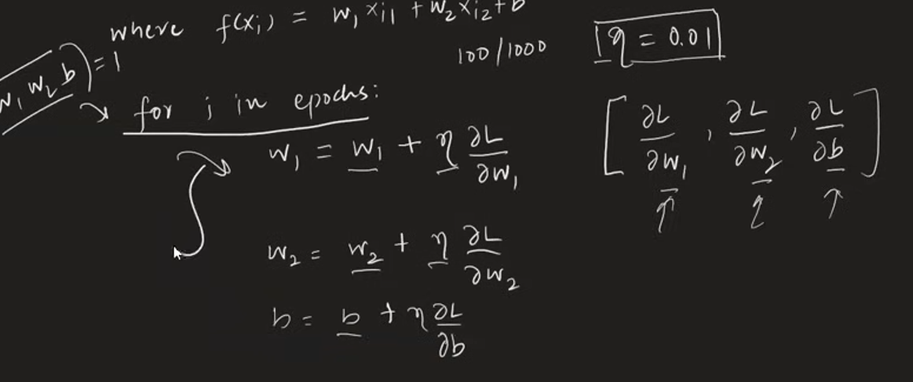
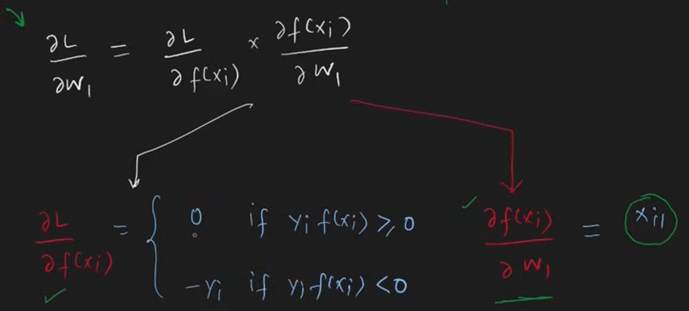
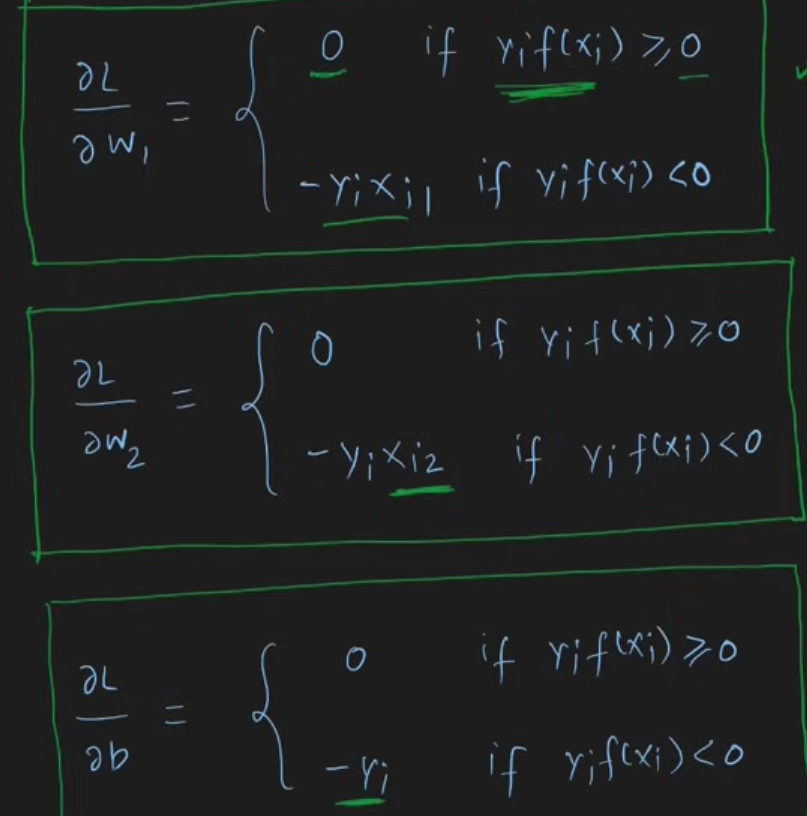
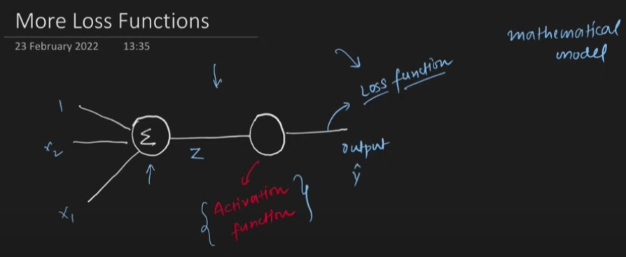

# Perceptron Loss Function

### Holistic Deep Dive Summary: Perceptron and the Need for Loss Functions

The material explains the transition from a rudimentary Perceptron training method (the "Perceptron Trick") to a more robust and mathematically sound approach using **Loss Functions**. It details why the Perceptron Trick is insufficient, introduces the concept of loss functions, formulates a specific loss function for Perceptrons, and then shows how this enables systematic training using **Gradient Descent**. Crucially, it highlights the Perceptron model's flexibility, demonstrating how modifications to its **activation function** and **loss function** can transform it into other fundamental machine learning algorithms like Logistic Regression, Softmax Regression, and even Linear Regression. This foundational understanding is vital for grasping more complex neural network architectures.

### Core Concepts and Interconnected Ideas:

- **1. Recap of the Perceptron Model:**

  - **Definition:** The Perceptron is a mathematical model inspired by a biological neuron, designed for **binary classification**.
    - _Visual_: A diagram showing inputs (e.g., **X1**: CGPA, **X2**: IQ), weights (**W1**, **W2**), a bias (**B**), a summation unit, and an activation function would be helpful.
  - **Operation:**
    1.  **Weighted Sum (Z):** It calculates a linear combination of inputs and weights, plus a bias: `Z = W1*X1 + W2*X2 + B`. This is essentially a **dot product** between the weight vector `W` and input vector `X`, plus bias `B`.
    2.  **Activation Function (Step Function):** The sum `Z` is passed through a **step function**.
        - If `Z >= 0`, output `y_hat = 1` (or positive class).
        - If `Z < 0`, output `y_hat = 0` (or -1, negative class, depending on convention).
  - **Geometric Intuition:** In a 2D feature space, a Perceptron represents a **line** that separates the data points into two classes. In 3D, it's a plane; in higher dimensions, a **hyperplane**.
    - _Visual_: A 2D scatter plot with two classes of points separated by a line clearly illustrates this.
  - **Phases:**
    1.  **Prediction:** Using a trained Perceptron (known W and B) to classify new data.
    2.  **Training:** The process of finding the optimal values for weights (W) and bias (B).
  - **Perceptron Rule/Trick (Previous Method):** An iterative training approach where:
    - Start with a random line (random W, B).
    - Pick a data point.
    - If misclassified, adjust the line by "pulling" it towards the point.
    - If correctly classified, do nothing.
    - Repeat for many iterations or points.

- **2. Problems with the Perceptron Trick:**

  - **No Guarantee of Optimality:** It might find _a_ separating line, but not necessarily the **best** one. If points are correctly classified, the line doesn't improve further, even if a better separating margin is possible.
  - **Lack of Quantification:** It doesn't provide a measure of _how good_ the resulting line is. It's difficult to compare different lines obtained from different runs.
    - _Significance:_ Without a quantitative measure, we can't be sure if our model is performing well or if it has converged to a good solution.
  - **Potential Convergence Issues:** In some scenarios (e.g., data is not perfectly linearly separable, or due to the random point selection), it might struggle to converge or might oscillate.
  - **"Jugaad" (Makeshift Solution):** While it often works for simple cases, it's not a principled approach for finding optimal parameters.

- **3. Introduction to Loss Functions:**

  - **Definition:** A **Loss Function** (or cost function/error function) quantifies how poorly a machine learning model is performing on the given data. It outputs a single number representing the "loss" or "error."
    - _Importance:_ Loss functions provide a concrete, mathematical target for optimization.
  - **Role in Training:** The goal of training becomes finding the model parameters (W and B for Perceptron) that **minimize** this loss function.
  - **Properties:** For a Perceptron, the loss function `L` would be a function of `W1, W2, B`. Changes in these parameters would change the loss value.
  - _Analogy:_ Think of navigating a hilly terrain in the dark (the loss landscape). You want to reach the lowest point (minimum loss). The loss function tells you your current altitude.
  - **Examples from other ML algorithms:**
    - **Mean Squared Error (MSE):** Used in Linear Regression.
    - **Log Loss (Binary Cross-Entropy):** Used in Logistic Regression.
    - **Hinge Loss:** Used in Support Vector Machines (SVMs).

- **4. Developing a Loss Function for Perceptron:**

  - **Attempt 1: Number of Misclassified Points.**
    - _Drawback:_ Treats all errors equally. A point misclassified by a large margin is a bigger error than one close to the decision boundary.
      
  - **Attempt 2: Sum of Distances of Misclassified Points from the Line.**
    - _Improvement:_ Accounts for the magnitude of error.
    - _Drawback:_ Calculating perpendicular distances can be computationally intensive.
      
  - **The Perceptron's Hinge-like Loss (as presented in the material, similar to scikit-learn's SGDClassifier with `loss='perceptron'`):**
    - It uses a value proportional to the distance for misclassified points, which is computationally simpler.
      
    - The core idea revolves around the term `y_i * f(x_i)`, where `y_i` is the true label (+1 or -1) and `f(x_i) = W \cdot X_i + B` (the output before the step function).
    - **Loss for a single point `x_i`:** `L_i = max(0, -y_i * f(x_i))`
    - **Total Loss `L`:** Average or sum of `L_i` over all data points: `L = (1/N) * Σ max(0, -y_i * f(x_i))` (ignoring regularization for now).
    - **Explanation of `max(0, -y_i * f(x_i))`:**
      - If `y_i * f(x_i) >= 0`: The point is correctly classified (or on the boundary, and `f(x_i)` has the same sign as `y_i`). Then `-y_i * f(x_i) <= 0`. So, `max(0, non_positive_value) = 0`. **Zero loss for correctly classified points.**
      - If `y_i * f(x_i) < 0`: The point is misclassified (`f(x_i)` has the opposite sign of `y_i`). Then `-y_i * f(x_i) > 0`. So, `max(0, positive_value) = positive_value`. **Positive loss for misclassified points**, proportional to how "wrong" the prediction is (i.e., the magnitude of `-y_i * f(x_i)`).
    - _Visual_: A graph of `max(0, x)` (ReLU function) can help understand the `max(0, ...)` part. Then, a graph showing `y*f(x)` vs. `-y*f(x)` and how the `max` function selects the loss.

- **5. Geometric Intuition of this Loss Function:**

  - Consider a data point `(X_i, y_i)`. `y_i` is +1 (e.g., "placed") or -1 (e.g., "not placed"). The line is `f(X) = W \cdot X + B = 0`.
    
  - **Correctly Classified Point:**
    - If `y_i = +1` and point is on positive side (`f(X_i) > 0`), then `y_i * f(X_i) > 0`. Loss contribution = 0.
    - If `y_i = -1` and point is on negative side (`f(X_i) < 0`), then `y_i * f(X_i) > 0`. Loss contribution = 0.
  - **Misclassified Point:**
    - If `y_i = +1` but point is on negative side (`f(X_i) < 0`), then `y_i * f(X_i) < 0`. Loss contribution = `-y_i * f(X_i)`, which is positive.
    - If `y_i = -1` but point is on positive side (`f(X_i) > 0`), then `y_i * f(X_i) < 0`. Loss contribution = `-y_i * f(X_i)`, which is positive.
  - _Key Takeaway:_ The loss function only penalizes misclassified points. The penalty increases as `f(X_i)` moves further away from zero on the "wrong" side.

- **6. Optimizing the Loss Function with Gradient Descent:**
  - **Goal:** Find `W` and `B` that minimize `L`. This is an **argmin** problem: `argmin_{W,B} L(W,B)`.
  - **Gradient Descent Algorithm:** An iterative optimization algorithm that takes steps in the direction opposite to the gradient of the loss function.
    - _Visual_: A 2D contour plot of a loss function with arrows showing the gradient descent path towards the minimum.
  - **Update Rules:** For each parameter (e.g., `W1`), the update is:
    `W1_new = W1_old + learning_rate * (dL/dW1)`
    (where `learning_rate` is a small positive value controlling step size). 
  - **Calculating Partial Derivatives (`dL/dW1`, `dL/dW2`, `dL/dB`):**  
    - Using the chain rule for `L_i = max(0, -y_i * f(x_i))`.
    - If `y_i * f(x_i) >= 0` (correctly classified), `L_i = 0`, so `dL_i/dW_k = 0`.
    - If `y_i * f(x_i) < 0` (misclassified), `L_i = -y_i * f(x_i) = -y_i * (W \cdot X_i + B)`.
      - `dL_i/dW_k = -y_i * X_{ik}` (where `X_{ik}` is the k-th feature of `X_i`).
      - `dL_i/dB = -y_i * 1`.
  - **Resulting Update Rule for a Misclassified Point `X_i`:**
    - `W_k_new = W_k_old - learning_rate * (-y_i * X_{ik})`
    - `W_k_new = W_k_old + learning_rate * y_i * X_{ik}`
    - `B_new = B_old + learning_rate * y_i`
    - _Significance:_ This derived update rule is precisely the **Perceptron Learning Algorithm update rule** (for labels +1/-1). The loss function provides a formal justification for this rule through gradient descent. The material includes Python code demonstrating this process.

```python
from sklearn.datasets import make_classification
import numpy as np
import matplotlib.pyplot as plt

# Generate data
X, y = make_classification(
    n_samples=100, n_features=2, n_informative=1, n_redundant=0,
    n_classes=2, n_clusters_per_class=1, random_state=41, hypercube=False, class_sep=15
)

plt.figure(figsize=(10,6))
plt.scatter(X[:,0], X[:,1], c=y, cmap='winter', s=100)
plt.show()

def perceptron(X, y):
    w1 = w2 = b = 1
    lr = 0.1
    for j in range(1000):
        for i in range(X.shape[0]):
            z = w1 * X[i][0] + w2 * X[i][1] + b
            if z * y[i] < 0:
                w1 = w1 + lr * y[i] * X[i][0]
                w2 = w2 + lr * y[i] * X[i][1]
                b = b + lr * y[i]
    return w1, w2, b

# Convert y to {-1, 1} if needed
if set(np.unique(y)) == {0, 1}:
    y_mod = np.where(y == 0, -1, 1)
else:
    y_mod = y

w1, w2, b = perceptron(X, y_mod)
m = -(w1 / w2)
c = -(b / w2)

print("Slope:", m, "Intercept:", c)

x_input = np.linspace(-3, 3, 100)
y_input = m * x_input + c

plt.figure(figsize=(10,6))
plt.plot(x_input, y_input, color='red', linewidth=3)
plt.scatter(X[:,0], X[:,1], c=y, cmap='winter', s=100)
plt.ylim(-3, 2)
plt.show()
```

- **7. The Flexibility of the Perceptron Model: A Gateway to Neural Networks:**
  - The Perceptron is a foundational **mathematical model** whose behavior can be drastically altered by changing two key components: its  **Activation Function** and its **Loss Function**. This adaptability is a core concept in deep learning.
  - **Different Combinations Lead to Different Algorithms:**
    - **Perceptron (Binary Classification):**
      - Activation: **Step Function**
      - Loss: **Hinge-like Loss** (e.g., `max(0, -y*f(x))`)
      - Output: Discrete class labels (e.g., +1/-1 or 0/1).
    - **Logistic Regression (Probabilistic Binary Classification):**
      - Activation: **Sigmoid Function** (outputs values between 0 and 1, interpreted as probabilities).
        - `σ(Z) = 1 / (1 + e^-Z)`
      - Loss: **Log Loss / Binary Cross-Entropy**.
      - Output: Probability of belonging to the positive class.
    - **Softmax Regression (Probabilistic Multi-class Classification):**
      - Activation: **Softmax Function** (outputs a probability distribution over multiple classes).
        - `softmax(Z_j) = e^(Z_j) / Σ_k e^(Z_k)`
      - Loss: **Categorical Cross-Entropy**.
      - Output: Probabilities for each of the K classes.
    - **Linear Regression (Regression):**
      - Activation: **Linear / Identity Function** (or no activation, `output = Z`).
      - Loss: **Mean Squared Error (MSE)**.
      - Output: Continuous numerical value.
  - _Visual Suggestion:_ A table summarizing these combinations (Algorithm, Activation Function, Loss Function, Output Type) would be highly beneficial for clarity.
  
 
| **Loss function**                              | **Typical activation**    | **Model / output range**                                                                     | **When you use it**                                                                                                                                                                          |
| ---------------------------------------------- | ------------------------- | -------------------------------------------------------------------------------------------- | -------------------------------------------------------------------------------------------------------------------------------------------------------------------------------------------- |
| **Hinge loss**                                 | **Step (hard threshold)** | **Perceptron** → outputs **−1 or +1**                                                        | Classic perceptron learning; the hinge margin pushes mis-classified points away from the decision boundary. Widely replaced by soft-margin SVM (uses the same loss but with regularisation). |
| **Log-loss** (a.k.a. **Binary cross-entropy**) | **Sigmoid**               | **Logistic regression** → probabilities in **\[0, 1]**                                       | The go-to pair for binary classification when you want calibrated probabilities. Minimising log-loss is equivalent to maximising the likelihood of Bernoulli labels.                         |
| **Categorical cross-entropy**                  | **Softmax**               | **Softmax regression / multinomial logistic regression** → probability vector that sums to 1 | Multiclass problems (one label per sample). Each class’s probability is exponentiated, then normalised; the loss penalises the full probability distribution.                                |

### Intuition for the pairings

1. **Activation decides the output range**

   * Step: discrete class labels (no probabilities).
   * Sigmoid: squashes to a single probability for the “positive” class.
   * Softmax: generalises sigmoid—one probability per class, all add to 1.

2. **Loss function measures “how wrong” in that range**

   * Hinge cares about *margin* rather than probability.
   * Log-loss punishes confident wrong predictions heavily, encouraging well-calibrated probabilities.
   * Categorical cross-entropy does the same for multiple classes.

3. **Why you keep them together**
   Training is stable when the loss’s gradient matches the activation’s gradient behaviour. Mixing, say, a step activation with log-loss would break gradient-based optimisation (step has zero gradient almost everywhere).

 
  - _Importance:_ This demonstrates that a simple neuron-like structure, when combined with appropriate mathematical tools (activation and loss functions, optimized by gradient descent), can solve a variety of machine learning problems. This is the building block for more complex neural networks.

### Stimulating Learning Prompts:

1.  The material mentions that the Perceptron loss `max(0, -y_i * f(x_i))` is similar to Hinge Loss. How does this specific Perceptron loss differ from the standard SVM Hinge Loss `max(0, 1 - y_i * f(x_i))`, and what might be the implication of this difference in terms of the margin?
2.  Given the flexibility of the Perceptron model structure, if you were faced with a new type of problem (e.g., predicting count data, like the number of shares a post will get), how might you think about designing an appropriate activation function and loss function?
