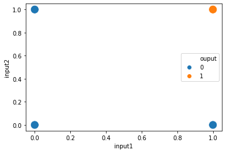
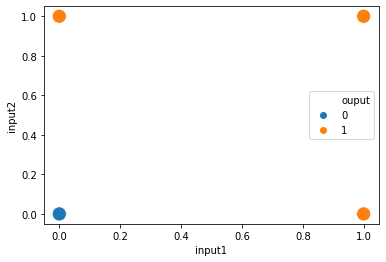
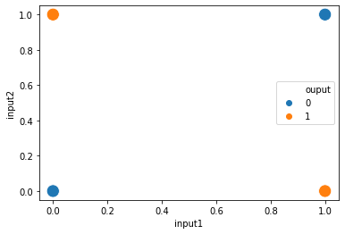
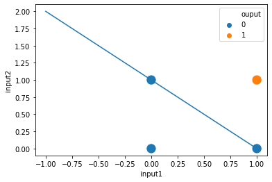
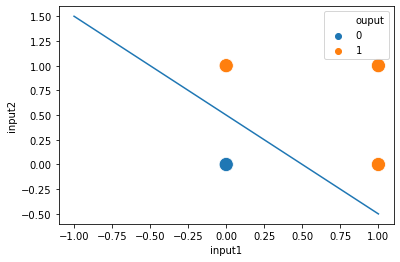
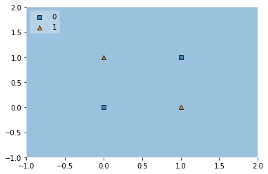

 

* The material revisits the concept of the **Perceptron**, noting that while its definition and training methods (Perceptron trick, loss optimization) have been covered, its fame in deep learning was limited due to a significant drawback.
* **Core Limitation of Perceptrons**: The central theme emphasized is that **Perceptrons** can only effectively work with **linearly separable data**. They fail when applied to **non-linear data**. This is because a perceptron, at its core, represents a **linear model**.
    * **Significance**: Understanding this limitation is crucial as it explains why perceptrons, in their basic form, are insufficient for many real-world problems which often involve non-linear relationships. This directly leads to the necessity for more complex models like multi-layer perceptrons.

### Practical Demonstration with Code Examples

The content describes a practical coding exercise using Python's `pandas` for data manipulation, `matplotlib` and `seaborn` for plotting, and `scikit-learn` for the Perceptron model. This exercise is designed to illustrate the limitation.

Three datasets were created: **AND**, **OR**, and **XOR**.

1.  **Data Preparation**

    The following code sets up the necessary libraries and creates the datasets:
    ```python
    import numpy as np
    import pandas as pd
    import matplotlib.pyplot as plt
    import seaborn as sns
    from sklearn.linear_model import Perceptron
    # For plot_decision_regions, you might need: from mlxtend.plotting import plot_decision_regions

    # Initialize dataframes
    or_data = pd.DataFrame()
    and_data = pd.DataFrame()
    xor_data = pd.DataFrame()

    # Define OR data
    or_data['input1'] = [1, 1, 0, 0]
    or_data['input2'] = [1, 0, 1, 0]
    or_data['output'] = [1, 1, 1, 0] 

    # Define AND data
    and_data['input1'] = [1, 1, 0, 0]
    and_data['input2'] = [1, 0, 1, 0]
    and_data['output'] = [1, 0, 0, 0] 

    # Define XOR data
    xor_data['input1'] = [1, 1, 0, 0]
    xor_data['input2'] = [1, 0, 1, 0]
    xor_data['output'] = [0, 1, 1, 0] 
    ```

2.  **Visualizing the Datasets**

    * **AND dataset**: Defined by the rule that output is 1 only if both inputs are 1. This is linearly separable.
        ```python
        print("AND Data:")
        print(and_data)
        plt.figure(figsize=(6,4))
        sns.scatterplot(x=and_data['input1'], y=and_data['input2'], hue=and_data['output'], s=200)
        plt.title("AND Gate Data")
        plt.show()
        ```
        
        * *Visual Aid*: The plot generated by this code would show two distinct classes that can be separated by a single straight line.
    * **OR dataset**: Defined by the rule that output is 1 if at least one input is 1. This is also linearly separable.
        ```python
        print("\nOR Data:")
        print(or_data)
        plt.figure(figsize=(6,4))
        sns.scatterplot(x=or_data['input1'], y=or_data['input2'], hue=or_data['output'], s=200)
        plt.title("OR Gate Data")
        plt.show()
        ```
        
        * *Visual Aid*: Similar to the AND data, a plot would show clear linear separability.
    * **XOR dataset** (Exclusive OR): Defined by the rule that output is 1 if inputs are different, and 0 if they are the same. This dataset is **non-linearly separable**.
        ```python
        print("\nXOR Data:")
        print(xor_data)
        plt.figure(figsize=(6,4))
        sns.scatterplot(x=xor_data['input1'], y=xor_data['input2'], hue=xor_data['output'], s=200)
        plt.title("XOR Gate Data")
        plt.show()
        ```
        
        * **Significance of XOR**: The XOR problem is a classic example used to highlight the limitations of single-layer perceptrons. No single straight line can separate the (0,0), (1,1) class from the (0,1), (1,0) class.
        * *Visual Aid Integration*: The plot generated visually confirms that a single line cannot separate the two classes in the XOR data.

3.  **Training Perceptrons and Observing Performance**

    Perceptron models are trained on each dataset:
    ```python
    # Initialize Perceptron classifiers
    clf1 = Perceptron()
    clf2 = Perceptron()
    clf3 = Perceptron()

    # Train Perceptrons
    # .iloc[:,0:2] selects the first two columns (inputs)
    # .iloc[:,-1] selects the last column (output)
    # .values converts the pandas DataFrame slices to NumPy arrays
    clf1.fit(and_data.iloc[:,0:2].values, and_data.iloc[:,-1].values)
    clf2.fit(or_data.iloc[:,0:2].values, or_data.iloc[:,-1].values)
    clf3.fit(xor_data.iloc[:,0:2].values, xor_data.iloc[:,-1].values)
    ```

    * **Performance on AND Data**: The Perceptron successfully finds a linear boundary.
        ```python
        print("\nAND Data Perceptron Coefficients:", clf1.coef_)
        print("AND Data Perceptron Intercept:", clf1.intercept_)

        # Code to plot decision boundary for AND data
        # (Original code for plotting line: y = -x + 1, can be derived from coefficients)
        # For a more general approach using learned coefficients:
        w_and = clf1.coef_[0]
        b_and = clf1.intercept_[0]
        x_vals_and = np.array(plt.gca().get_xlim())
        y_vals_and = -(w_and[0] * x_vals_and + b_and) / w_and[1]

        plt.figure(figsize=(6,4))
        sns.scatterplot(x=and_data['input1'], y=and_data['input2'], hue=and_data['output'], s=200)
        plt.plot(x_vals_and, y_vals_and, color='green', linestyle='--', label='Decision Boundary')
        plt.title("AND Gate Data with Perceptron Decision Boundary")
        plt.ylim(-0.5, 1.5) # Adjust limits for better visualization
        plt.legend()
        plt.show()
        ```
        
        The plot shows the learned decision boundary separating the classes.
    * **Performance on OR Data**: Similarly, the Perceptron finds a linear boundary.
        ```python
        print("\nOR Data Perceptron Coefficients:", clf2.coef_)
        print("OR Data Perceptron Intercept:", clf2.intercept_)

        # Code to plot decision boundary for OR data
        # (Original code for plotting line: y1 = -x + 0.5, can be derived from coefficients)
        w_or = clf2.coef_[0]
        b_or = clf2.intercept_[0]
        x_vals_or = np.array(plt.gca().get_xlim())
        y_vals_or = -(w_or[0] * x_vals_or + b_or) / w_or[1]

        plt.figure(figsize=(6,4))
        sns.scatterplot(x=or_data['input1'], y=or_data['input2'], hue=or_data['output'], s=200)
        plt.plot(x_vals_or, y_vals_or, color='purple', linestyle='--', label='Decision Boundary')
        plt.title("OR Gate Data with Perceptron Decision Boundary")
        plt.ylim(-0.5, 1.5) # Adjust limits for better visualization
        plt.legend()
        plt.show()
        ```
        
        The plot shows the learned decision boundary.
    * **Performance on XOR Data**: The Perceptron **fails** to find a single linear boundary to correctly classify the data.
        ```python
        print("\nXOR Data Perceptron Coefficients:", clf3.coef_)
        print("XOR Data Perceptron Intercept:", clf3.intercept_)

        # To visualize the decision region for XOR, mlxtend.plotting.plot_decision_regions is very useful
        # Ensure mlxtend is installed: pip install mlxtend
        from mlxtend.plotting import plot_decision_regions

        plt.figure(figsize=(6,4))
        plot_decision_regions(xor_data.iloc[:,0:2].values, xor_data.iloc[:,-1].values, clf=clf3, legend=2)
        plt.title("XOR Gate Data with Perceptron Decision Boundary")
        plt.xlabel("Input 1")
        plt.ylabel("Input 2")
        plt.show()
        ```
        
        The `plot_decision_regions` function would illustrate that a single linear boundary cannot correctly separate the XOR classes. The Perceptron attempts to fit a line, but it will misclassify some points because the data is not linearly separable.

### TensorFlow Playground Demonstration (as described in the original material)

* The original material also introduced **TensorFlow Playground** as a tool to visually experiment with neural networks without writing code.
* A **Perceptron** (a neural network with no hidden layers) was simulated.
* With a **linearly separable dataset**, the perceptron quickly found a separating line.
    * *Visual Aid Integration*: The TensorFlow Playground interface itself is a dynamic visual aid, showing the data points, the decision boundary, and the network structure. LINK: [TensorFlow Playground](https://playground.tensorflow.org/#activation=sigmoid&batchSize=10&dataset=gauss&regDataset=reg-plane&learningRate=0.01&regularizationRate=0&noise=10&networkShape=&seed=0.58147&showTestData=false&discretize=false&percTrainData=50&x=true&y=true&xTimesY=false&xSquared=false&ySquared=false&cosX=false&sinX=false&cosY=false&sinY=false&collectStats=false&problem=classification&initZero=false&hideText=false).
* When the dataset was changed to a **non-linear one (similar to XOR)**, the perceptron, even after many epochs, **failed to separate the classes**.
    * **Significance**: This interactive demonstration visually reinforces the core message: a single perceptron is inherently incapable of solving non-linear classification problems.
LINK: [TensorFlow Playground](https://playground.tensorflow.org/#activation=sigmoid&batchSize=10&dataset=xor&regDataset=reg-plane&learningRate=0.01&regularizationRate=0&noise=10&networkShape=&seed=0.93686&showTestData=false&discretize=false&percTrainData=50&x=true&y=true&xTimesY=false&xSquared=false&ySquared=false&cosX=false&sinX=false&cosY=false&sinY=false&collectStats=false&problem=classification&initZero=false&hideText=false).
### Conclusion and Next Steps

* The video and the code demonstrations conclude by reiterating that these practical examples serve to firmly establish the understanding of why perceptrons have this critical limitation.
* This limitation is the primary motivation for the development and necessity of **Multi-Layer Perceptrons (MLPs)**, which, by introducing hidden layers, can learn non-linear decision boundaries.

**Stimulating Learning Prompt**:

1.  Given that a single perceptron can only create a linear decision boundary (a straight line in 2D, a plane in 3D, or a hyperplane in higher dimensions), how do you think adding more layers (as in a Multi-Layer Perceptron) allows a network to learn non-linear patterns like the one in the XOR dataset?
2.  The Perceptron algorithm is guaranteed to converge if the data is linearly separable. What happens, or what might the algorithm do, if the data is *not* linearly separable, as seen with the XOR data?
 