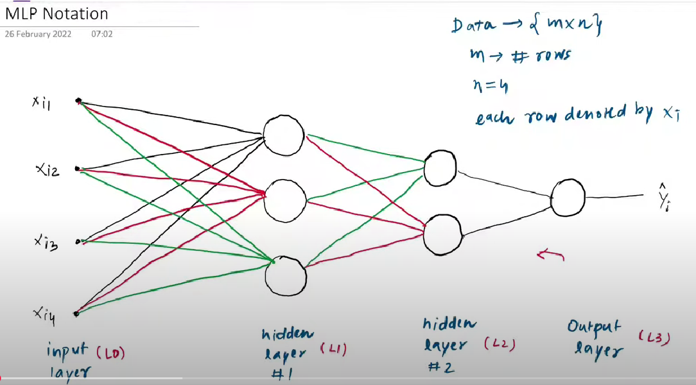
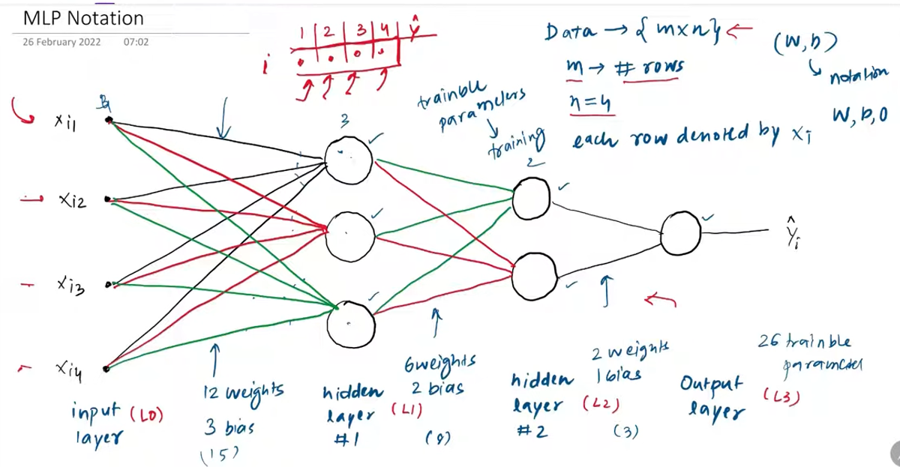
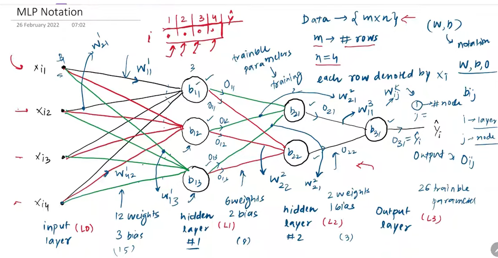

### Holistic Deep Dive Summary: Understanding MLP Architecture and Notation

The material emphasizes a foundational aspect of **Multi-Layer Perceptrons (MLPs)**: grasping the notation for its components and how to quantify its **trainable parameters**. This understanding is presented as crucial groundwork before tackling more complex topics like the **backpropagation algorithm**, which is notoriously challenging if the basics of network structure aren't clear. The core idea is that a clear notational system for **weights** and **biases** prevents confusion when analyzing how an MLP learns. The content walks through a specific neural network architecture to illustrate two main goals:
1.  Calculating the total number of **trainable parameters** (weights and biases) that the learning algorithm needs to optimize.
2.  Learning a standard **notation** for identifying individual weights, biases, and neuron outputs (or activations) within the network. This systematic naming is vital for dissecting and implementing algorithms like backpropagation.

### Key Element Spotlight & Intuition Building

* **Trainable Parameters:**
    * **Definition:** These are the **weights** and **biases** in the neural network that are adjusted during the training process. The goal of training is to find the optimal values for these parameters.
    * **Significance:** The number of trainable parameters gives an indication of the model's complexity and its capacity to learn from data. More parameters can mean a more flexible model, but also a higher risk of overfitting and increased computational cost.
    * **Visual Aid Suggestion:** A diagram highlighting each weight and bias in a simple network, with a counter updating as each is identified, would effectively illustrate what constitutes a trainable parameter.

* **Neural Network Architecture (Example from the material):**
    * **Structure:** The source describes a 4-layer network:
        * **Input Layer (Layer 0):** 4 input features (e.g., columns in a dataset).
            * *Visual in material:* Depicted as four distinct input points.
        * **Hidden Layer 1 (Layer 1):** 3 neurons.
        * **Hidden Layer 2 (Layer 2):** 2 neurons.
        * **Output Layer (Layer 3):** 1 neuron.
    * **Significance:** This specific architecture serves as a concrete example to demonstrate parameter calculation and notation. The principles apply to any network architecture.
    * **Calculating Trainable Parameters (Example):**
        * **Between Input Layer (4 neurons) and Hidden Layer 1 (3 neurons):**
            * Weights: Each of the 3 neurons in Hidden Layer 1 receives an input from all 4 neurons in the Input Layer. So, $4 \times 3 = 12$ weights.
            * Biases: Each of the 3 neurons in Hidden Layer 1 has 1 bias. So, $3$ biases.
            * Total for Layer 1 connections: $12 + 3 = 15$ parameters.
        * **Between Hidden Layer 1 (3 neurons) and Hidden Layer 2 (2 neurons):**
            * Weights: $3 \times 2 = 6$ weights.
            * Biases: $2$ biases.
            * Total for Layer 2 connections: $6 + 2 = 8$ parameters.
        * **Between Hidden Layer 2 (2 neurons) and Output Layer (1 neuron):**
            * Weights: $2 \times 1 = 2$ weights.
            * Biases: $1$ bias.
            * Total for Output Layer connections: $2 + 1 = 3$ parameters.
        * **Total Trainable Parameters in the example network:** $15 + 8 + 3 = 26$ parameters.
    * **Color Coding for Weights (Visual in material):** The material mentions that weights leading to the *same neuron* in a layer are shown in the same color (e.g., all weights feeding into the first neuron of Layer 1 are black). This helps visually group connections.

* **Notation Conventions:**
    * **Layers:** Typically numbered starting from 0 for the input layer, 1 for the first hidden layer, and so on. The material refers to the input layer as "Layer 0" and subsequent layers as Layer 1, Layer 2, and Layer 3 (output).

    * **Biases (B):**
        * Notation: $B^l_j$ or $b^l_j$
            * '$l$': Represents the **layer number** where the neuron (and its bias) resides.
            * '$j$': Represents the **neuron index** within that layer.
        * Example from material (adapted to common superscript for layer): $B^1_1$ is the bias of the 1st neuron in Layer 1. $B^2_1$ is the bias of the 2nd neuron in Layer 1.
        * **Significance:** Biases allow neurons to have a non-zero output even when all inputs are zero, providing more flexibility to the model.

    * **Neuron Outputs/Activations (O or a):**
        * Notation: $O^l_j$ or $a^l_j$
            * '$l$': Represents the **layer number**.
            * '$j$': Represents the **neuron index** within that layer whose output is being denoted.
        * Example from material (adapted): $O^1_1$ is the output of the 1st neuron in Layer 1. $O^2_1$ is the output of the 2nd neuron in Layer 1.
        * **Significance:** The output of a neuron in one layer becomes the input to neurons in the next layer. Tracking these values is fundamental to understanding the forward pass and backpropagation.

    * **Weights (W):**
        * Notation: $W^l_{ji}$
            * '$l$': Represents the **layer number of the neuron *receiving* the input** (i.e., the layer these weights connect *to*).
            * '$j$': Represents the **index of the neuron in layer '$l$'** (the receiving neuron).
            * '$i$': Represents the **index of the neuron in the *previous* layer (layer '$l-1$')** (the sending neuron).
        * Intuition: Think of it as "Weight *to* neuron $j$ in layer $l$, *from* neuron $i$ in layer $l-1$."
        * Examples from material:
            * $W^1_{11}$: Weight connecting neuron 1 of the input layer (Layer 0) to neuron 1 of Hidden Layer 1. (Layer it's going *into* is 1, *to* neuron 1, *from* neuron 1 of previous layer).
            * $W^1_{24}$: Weight connecting neuron 4 of the input layer (Layer 0) to neuron 2 of Hidden Layer 1. (Layer it's going *into* is 1, *to* neuron 2, *from* neuron 4 of previous layer).
            * $W^2_{12}$: Weight connecting neuron 2 of Hidden Layer 1 to neuron 1 of Hidden Layer 2. (Layer it's going *into* is 2, *to* neuron 1, *from* neuron 2 of previous layer).
        * **Significance:** Weights determine the strength of the connection between neurons. Learning involves finding the optimal values for these weights.
        * **Visual Aid Suggestion:** A diagram showing two connected layers with a few neurons each. Clearly label one specific weight with the $W^l_{ji}$ notation, pointing arrows to indicate layer $l$, neuron $j$, and neuron $i$.

### Insightful Clarity, Conciseness, and Example Integration

The material effectively argues that mastering these notations is not just an academic exercise but a practical necessity for anyone wanting to understand or implement neural network training algorithms. The provided example network serves as a consistent reference point, making the abstract notations more concrete. The logic for calculating trainable parameters is clearly demonstrated: sum the weights (connections between neurons of adjacent layers) and biases (one per neuron in hidden/output layers).

### Evidence-Based & Argument-Aware Notes

The core argument is that a systematic approach to notation demystifies the structure of an MLP, which is a prerequisite for understanding its training (e.g., backpropagation). All explanations of parameter counting and notation are directly derived from the example neural network architecture presented.

### Stimulating Learning Prompts for Deeper Reflection

1.  If you were to add another hidden layer with 5 neurons between the current Hidden Layer 2 and the Output Layer in the example, how many *new* trainable parameters would be introduced? How would the notation for these new weights and biases look?
2.  The material mentions color-coding weights based on the receiving neuron. How might this visualization be helpful when trying to understand the *impact* of a single neuron's output on the next layer?
 