 

### Holistic Deep Dive Summary: Understanding Multi-Layer Perceptrons

The material explains the limitations of a single **Perceptron** and introduces the **Multi-Layer Perceptron (MLP)** as a powerful solution for handling **non-linear data**. A single perceptron can only create linear decision boundaries, which is insufficient for many real-world problems. The core idea presented is that by combining multiple perceptrons in a layered architecture, an MLP can learn and represent complex, **non-linear decision boundaries**. This capability allows MLPs to function as **universal function approximators**. The source walks through the intuition and basic mathematical underpinnings of how these individual perceptrons, when working together, can achieve this complex task, highlighting the flow from simple linear separations to sophisticated non-linear ones.

* **The Problem with Single Perceptrons:**
    * A single **Perceptron** fundamentally draws a straight line (or a hyperplane in higher dimensions) to separate data points into classes.
    * This is a significant limitation when the data is **non-linearly separable**, meaning a single straight line cannot adequately distinguish between the classes. The source uses an example of a dataset with two classes (green and red) that require a curved boundary for separation, which a single perceptron cannot create.

* **The Solution: Multi-Layer Perceptron (MLP):**
    * An MLP involves connecting multiple perceptrons, organized in layers: an **input layer**, one or more **hidden layers**, and an **output layer**.
    * The material emphasizes that the perceptrons discussed utilize a **Sigmoid activation function** (outputting probabilities between 0 and 1) and **log loss** (akin to logistic regression units), rather than a simple step function.
    * The intuition is that individual perceptrons in the hidden layer learn different simple linear boundaries. The subsequent layers then combine these simple boundaries in a sophisticated way to form a more complex, non-linear decision boundary.

* **How MLPs Create Non-Linear Boundaries (Intuition & Mechanics):**
    1.  **Individual Perceptron Output (Probabilistic):** Each perceptron in a hidden layer takes inputs (either from the original data or a previous layer) and, using its weights, bias, and the **Sigmoid function**, calculates an output. This output is a probability (e.g., the probability of belonging to a particular class).
        * The source explains this with a CGPA and IQ example for predicting student placement. The equation $Z = w_1 \cdot \text{CGPA} + w_2 \cdot \text{IQ} + b$ is calculated, and $\text{Sigmoid}(Z)$ gives the placement probability.
        * A visual was described where the decision line of a sigmoid perceptron represents a probability of 0.5, with probabilities changing as one moves away from this line, creating a "gradient of probabilities."
        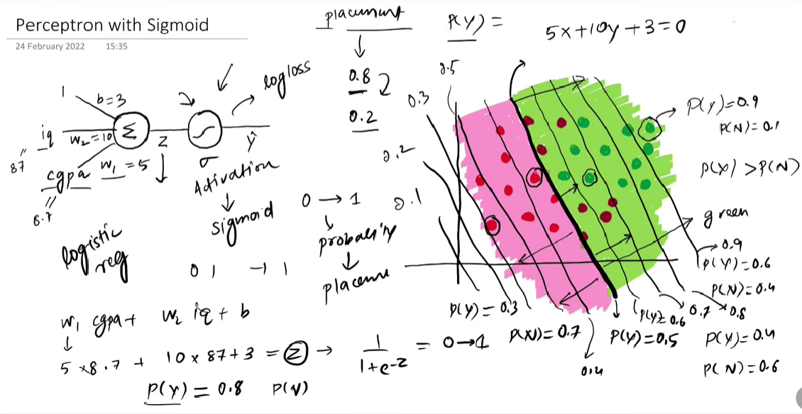

    2.  **Combining Perceptron Outputs:** The initial idea explored is to take the outputs (probabilities) from multiple perceptrons (e.g., P1 from Perceptron 1, P2 from Perceptron 2) and combine them.
        * A simple sum (P1 + P2) is problematic as probabilities can exceed 1.
        * The solution is to feed this sum into another **Sigmoid function**: $\text{New Probability} = \text{Sigmoid}(P1 + P2)$. The material refers to this as achieving "superimposition" and "smoothing" of the initial linear boundaries.

    3.  **Weighted Combination (The Output Perceptron):** To add more flexibility and control over how the initial perceptron outputs are combined, a weighted sum is introduced: $Z_{\text{combined}} = w_{\text{out1}} \cdot P1 + w_{\text{out2}} \cdot P2 + b_{\text{out}}$.
        * This $Z_{\text{combined}}$ is then passed through a **Sigmoid function** to get the final output probability.
        * Crucially, this combining mechanism (weighted sum + bias + sigmoid) is, in itself, another perceptron. The outputs of the hidden layer perceptrons become the inputs to this output layer perceptron. 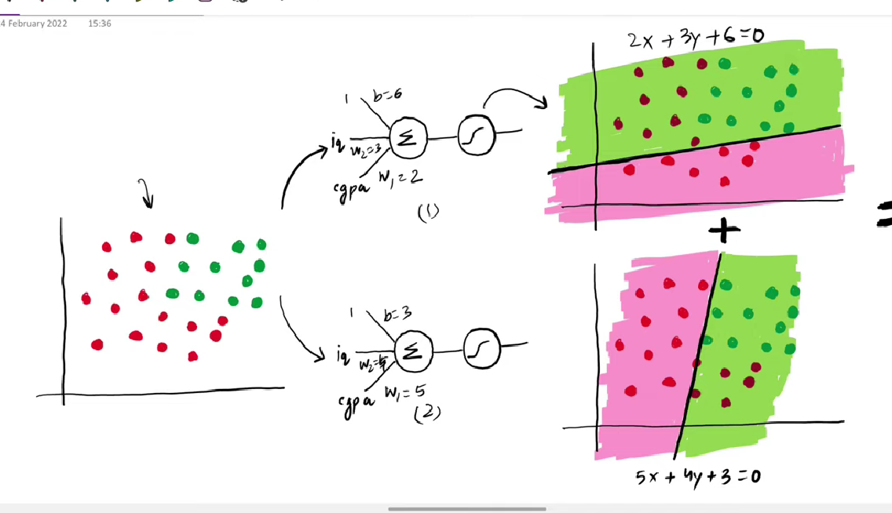 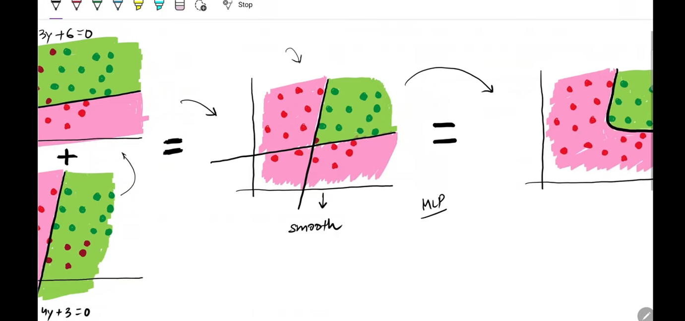
        * The material describes a visual representation of this: Perceptron 1 and Perceptron 2 feeding their outputs into a Perceptron 3, which then produces the final result. This structure forms the basis of an MLP. 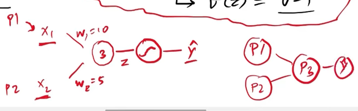
        * *Visual Aid Suggestion:* A diagram showing two initial perceptrons, their individual linear decision boundaries on a 2D plane, and then a combined, non-linear boundary resulting from their weighted outputs being processed by a third perceptron would be very helpful here.
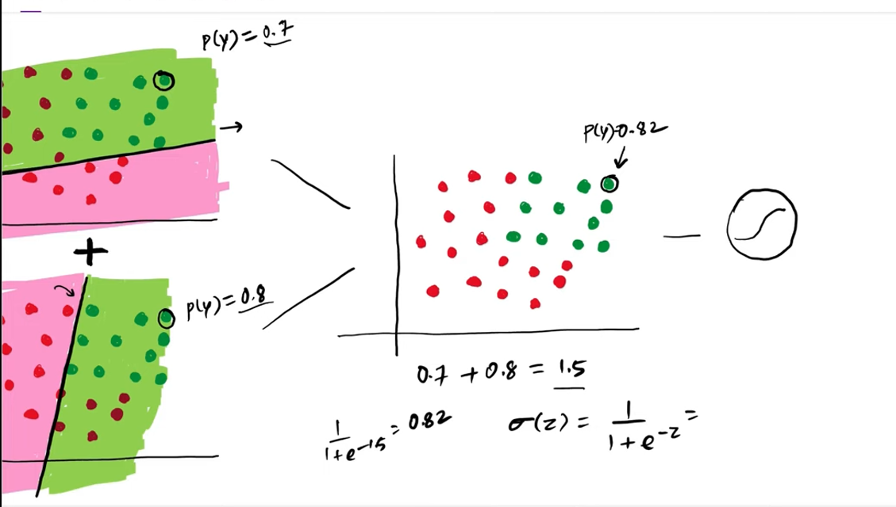 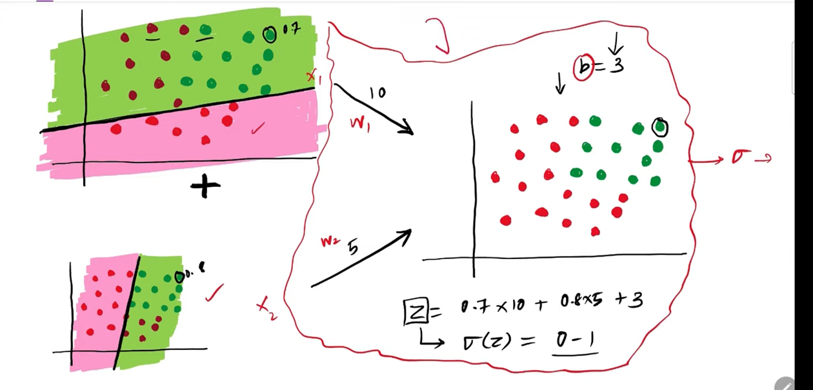 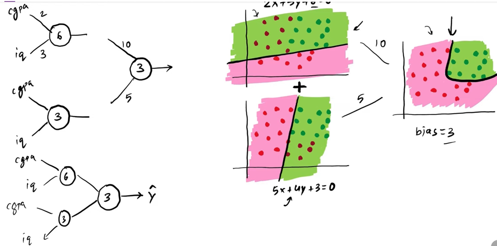 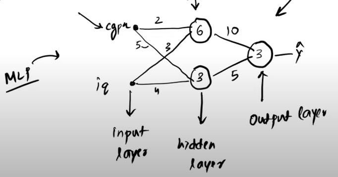
* **Neural Network Architecture & Flexibility:**
    * **Neural Network Architecture** refers to how the nodes (perceptrons) and their connections (weights) are arranged. 
    * The material outlines four key ways to modify the architecture for increased flexibility and capability:
        1.  **Increase Nodes in a Hidden Layer:** Adding more perceptrons to a hidden layer allows the network to learn more diverse linear components, which can then be combined to form even more complex decision boundaries. The source shows an example where three perceptrons in the hidden layer create a more intricate boundary than two.
            * The source describes a diagram illustrating this: three separate linear decision boundaries from three perceptrons, which are then linearly combined by an output perceptron to yield a more complex, non-linear boundary.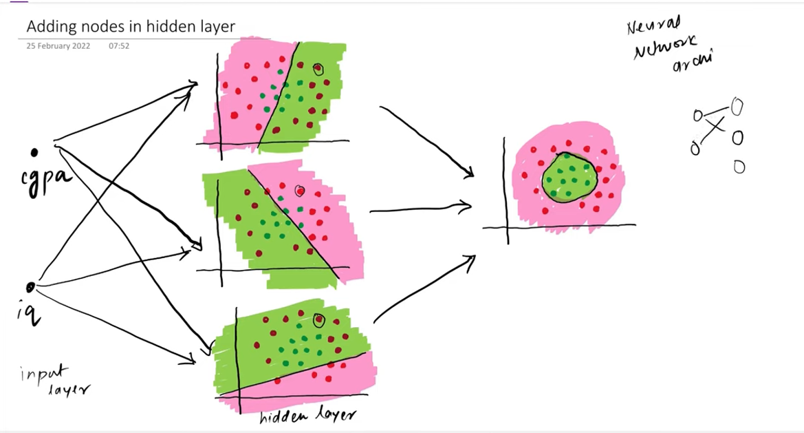
        2.  **Increase Nodes in the Input Layer:** This is done when the number of input features in the data increases (e.g., adding "12th marks" to CGPA and IQ). If there are 3 input features, each perceptron in the first hidden layer will be trying to find a separating *plane* in 3D space. The combination logic remains the same.
            * The source mentions a visual of two such planes in 3D, which are then combined. 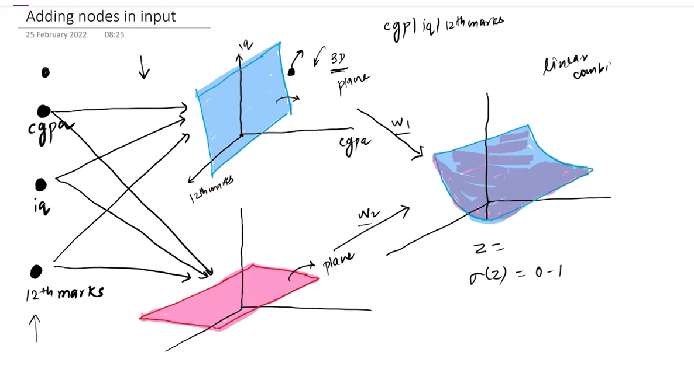
        3.  **Increase Nodes in the Output Layer:** This is typical for **multi-class classification** problems (e.g., classifying an images/09/image as a "Dog," "Cat," or "Human"). Each node in the output layer corresponds to one class, outputting the probability for that class.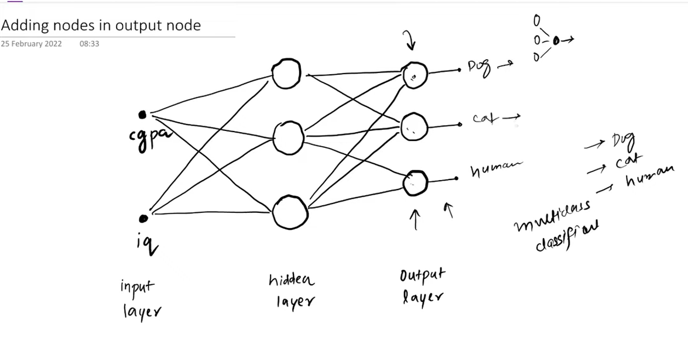
        4.  **Increase the Number of Hidden Layers (Deep Learning):** Adding more hidden layers allows the network to learn hierarchical features. Early layers might learn simple features/boundaries, and subsequent layers combine these to learn more abstract and complex features/boundaries. This depth is what enables **Deep Neural Networks** to tackle very complex patterns and act as **Universal Function Approximators**.
            * The source highlights that deeper networks can capture progressively more complex relationships, with initial layers creating linear boundaries and subsequent layers forming more intricate non-linear ones.
            * *Visual Aid Suggestion:* A conceptual diagram showing a simple linear boundary from Layer 1, then a more complex boundary formed by combining outputs in Layer 2, and an even more refined boundary from Layer 3 would effectively illustrate this hierarchical feature learning.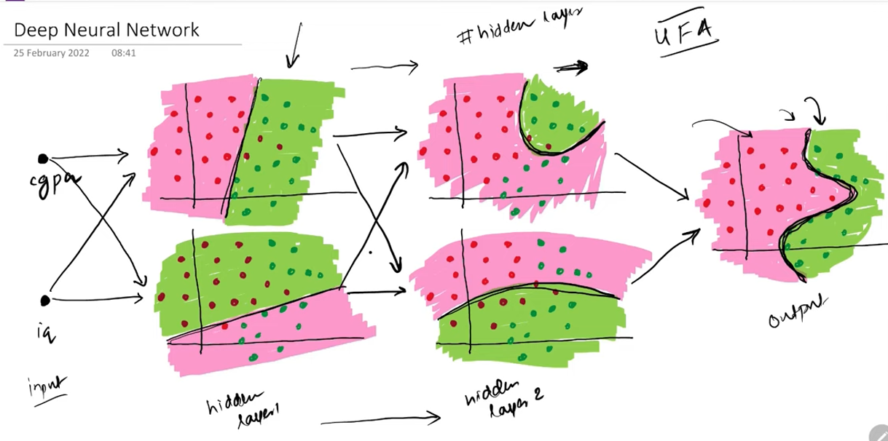

* **TensorFlow Playground Demonstration:** [LINK TO PLAYGROUND](https://playground.tensorflow.org/#activation=relu&batchSize=10&dataset=spiral&regDataset=reg-plane&learningRate=0.03&regularizationRate=0&noise=0&networkShape=8,8,8,8,8,8&seed=0.87581&showTestData=false&discretize=false&percTrainData=50&x=true&y=true&xTimesY=false&xSquared=false&ySquared=false&cosX=false&sinX=false&cosY=false&sinY=false&collectStats=false&problem=classification&initZero=false&hideText=false)
    * The material describes a practical demonstration using TensorFlow Playground.
    * **XOR Data:** A single perceptron fails, but an MLP (e.g., 2 inputs, 1 hidden layer with 4 nodes, 1 output) successfully learns the non-linear XOR pattern.
    * **Concentric Circles Data:** A similar MLP architecture handles this non-linear dataset effectively.
    * **Spiral Data (Very Complex):**
        * A shallow MLP struggles.
        * Increasing complexity by adding more hidden layers (e.g., two hidden layers, each with multiple nodes) and changing the **activation function** to **ReLU (Rectified Linear Unit)** showed significant improvement in capturing the intricate spiral pattern.
        * The demo visually shows how decision boundaries learned by neurons in earlier layers are simpler, while neurons in deeper layers learn more complex combined boundaries.
    * **Key Takeaway from Demo:** MLPs can capture non-linearity. The complexity of the MLP (number of nodes, layers) and the choice of **activation function** are critical for handling different datasets. The visuals in TensorFlow Playground clearly depicted the evolving decision boundaries within the network.

### Key Element Spotlight & Intuition Building:

* **Perceptron:** The fundamental building block of a neural network. In this context, it takes multiple inputs, computes a weighted sum, adds a bias, and then passes the result through an **activation function** (here, Sigmoid) to produce an output. *Significance:* Individual perceptrons learn linear separations; their power comes from being combined in layers.
* **Non-linear Decision Boundaries:** Boundaries between classes in a dataset that are not straight lines (e.g., curves, circles, complex shapes). *Significance:* Many real-world datasets require non-linear boundaries for accurate classification, which single perceptrons cannot create but MLPs can.
* **Multi-Layer Perceptron (MLP):** A type of feedforward artificial neural network that consists of at least three layers of nodes: an input layer, one or more hidden layers, and an output layer. Each node (except for input nodes) is a perceptron. *Significance:* MLPs can learn complex, non-linear relationships in data, making them far more powerful than single perceptrons.
* **Activation Function:** A function applied to the output of a neuron (or perceptron) that determines its activation or "firing" strength.
    * **Sigmoid Function:** An activation function that squashes its input into a range between 0 and 1. Output can be interpreted as a probability. Formula: $1 / (1 + e^{-z})$. *Significance:* Enables probabilistic outputs and introduces non-linearity into the network, which is crucial for learning complex patterns. The material highlights its use throughout the initial explanation of MLP.
    * **ReLU (Rectified Linear Unit):** An activation function that outputs the input directly if it is positive, and zero otherwise ($f(x) = \max(0, x)$). *Significance:* Widely used in modern deep learning, often leading to faster training and better performance for deep networks, as shown in the TensorFlow Playground demo for complex data.
* **Log Loss:** A loss function used for classification problems, particularly when outputs are probabilities. It measures the performance of a classification model whose output is a probability value between 0 and 1. *Significance:* Guides the learning process by penalizing the model more heavily for confident incorrect predictions.
* **Linear Combination:** A sum of terms, each of which is a variable (or output from a perceptron) multiplied by a constant (weight). $Z = w_1 x_1 + w_2 x_2 + ... + b$. *Significance:* This is the core calculation within a perceptron before the activation function. MLPs essentially learn to make linear combinations of the outputs of previous layers in a hierarchical fashion.
* **Input Layer:** The first layer in an MLP that receives the raw input data (features). *Significance:* Represents the entry point of information into the network.
* **Hidden Layer:** Layer(s) between the input and output layers in an MLP. *Significance:* These layers are where the network learns complex representations and transformations of the input data. The "hidden" aspect means their outputs are not directly observed as final results but are intermediate computations. The power of MLPs largely comes from the computations in these hidden layers.
* **Output Layer:** The final layer in an MLP that produces the network's prediction or output (e.g., class probabilities). *Significance:* Delivers the result of the network's processing.
* **Neural Network Architecture:** The specific arrangement of layers, nodes (perceptrons) per layer, and the connections (including weights and biases) between them. *Significance:* The architecture dictates the network's capacity to learn and the complexity of functions it can approximate. The material stresses that modifying the architecture (e.g., adding nodes/layers) enhances flexibility.
* **Universal Function Approximator:** A property of MLPs (with sufficient hidden units and appropriate activation functions) meaning they can approximate any continuous function to an arbitrary degree of accuracy. *Significance:* This theoretical capability underscores the immense power and versatility of neural networks for solving a wide range of problems.

### Stimulating Learning Prompts:

1.  The material mentions that increasing hidden layers allows the network to capture more "complex relationships." How might the types of features learned by an early hidden layer differ from those learned by a later hidden layer in a deep MLP?
2.  The switch from Sigmoid to ReLU activation function in the TensorFlow Playground demo significantly improved performance on the spiral dataset. What characteristics of ReLU might contribute to this better performance in deeper networks compared to Sigmoid?
 