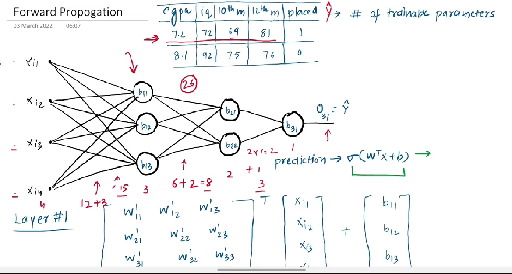
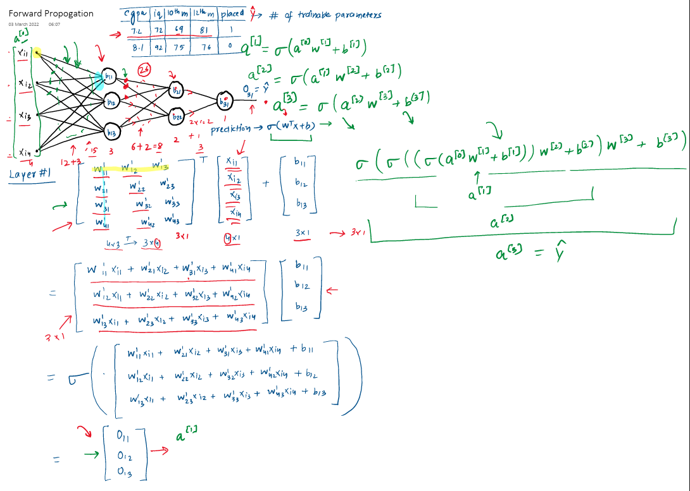
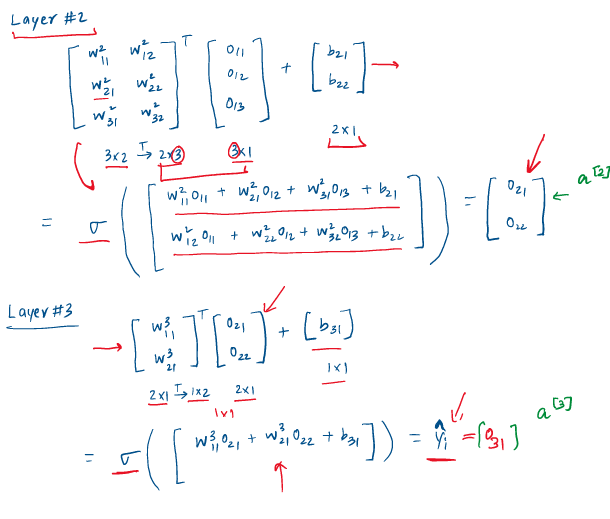

 

### Holistic Deep Dive Summaries: Understanding Predictions in Neural Networks

The material explains **Forward Propagation**, which is the fundamental process by which a neural network takes an input and computes an output, essentially making a prediction. This understanding is presented as a crucial stepping stone before tackling the more complex topic of **Backpropagation** (the network's learning mechanism). The core idea is that data flows *forward* through the network's layers, from input to output, undergoing mathematical transformations at each step.

* **The "Why" Before the "How":** The information emphasizes that comprehending how a network *uses* its existing parameters (**weights** and **biases**) to make predictions (Forward Propagation) is essential for understanding how it *learns* or *updates* those parameters (Backpropagation).
* **The Power of Linear Algebra:** A key takeaway is that despite the potentially complex appearance of neural network architectures (many layers, many neurons), the underlying calculations for forward propagation are elegantly handled by **linear algebra**, primarily involving **matrix multiplications** and additions. This allows for efficient computation.
* **Structured Learning Path:** The source outlines a plan:
    1.  First, grasp Forward Propagation (covered in this material).
    2.  Then, explore practical examples using libraries like **Keras** with real-world datasets to see networks in action.
    3.  Finally, delve into the mechanics of Backpropagation.
    This approach aims to build intuition by showing the "what" and "how" of predictions before diving into the "how" of training.

### Key Element Spotlight & Intuition Building

* **Neural Network Architecture:**
    * The example network consists of:
        * An **Input Layer**: Receives the initial data (e.g., 4 features like CGPA, IQ, 10th marks, 12th marks).
            * *(Visual Description: The source shows 4 input nodes.)*
        * **Hidden Layers**: Intermediate layers that perform computations and feature extraction. The example uses two hidden layers (the first with 3 neurons, the second with 2 neurons).
            * *(Visual Description: The diagram shows these layers connected sequentially.)*
        * An **Output Layer**: Produces the final prediction (e.g., 1 neuron for placement status: yes/no).
    * **Significance:** The architecture defines the network's capacity to learn complex patterns. The number of layers and neurons are crucial hyperparameters.

* **Trainable Parameters (Weights and Biases):**
    * **Weights (W):** These are values associated with each connection between neurons in adjacent layers. They determine the strength or importance of an input signal.
    * **Biases (B):** These are additional values added at each neuron, allowing the activation function to be shifted left or right, which can be critical for successful learning.
    * **Calculation Example:** For the given architecture (4 inputs -> 3 H1 neurons -> 2 H2 neurons -> 1 output neuron):
        * Input to Hidden Layer 1: (4 inputs × 3 neurons) weights + 3 biases = 12 + 3 = **15 parameters**.
        * Hidden Layer 1 to Hidden Layer 2: (3 inputs × 2 neurons) weights + 2 biases = 6 + 2 = **8 parameters**.
        * Hidden Layer 2 to Output Layer: (2 inputs × 1 neuron) weights + 1 bias = 2 + 1 = **3 parameters**.
        * Total: 15 + 8 + 3 = **26 trainable parameters**.
    * **Significance:** These are the values that the network "learns" during the training process (via backpropagation) to minimize prediction errors. Initially, they are often set to random values.
        * *(Visual Aid Suggestion: A table explicitly listing each set of weights and biases with their dimensions for each layer transition would be helpful for clarity.)*

* **Forward Propagation - The Calculation Flow:**
    The process involves moving layer by layer, calculating the output of each neuron. For any given layer `l` (starting from `l=1` for the first hidden layer):
    1.  **Weighted Sum (Z):** The inputs from the previous layer (`A^[l-1]`, where `A^[0]` is the initial input `X`) are multiplied by the **weights** (`W^[l]`) connecting them to the current layer's neurons. The **bias** (`B^[l]`) for each neuron in the current layer is then added. This is a matrix operation.
        * The material details this as: `Z^[l] = (W^[l])^T * A^[l-1] + B^[l]`
        * **Notation used in source for `W^[l]`:** A matrix where rows correspond to neurons in the *previous* layer (or input features) and columns correspond to neurons in the *current* layer. For example, `W^[1]` (weights from input to hidden layer 1) would have dimensions `(number_of_input_features x number_of_neurons_in_H1)`.
        * **Transpose `(W^[l])^T`:** The weight matrix `W^[l]` is transposed to align dimensions for matrix multiplication with the column vector `A^[l-1]`.
            * *(Visual Description: The source provides detailed matrix representations for `W`, `X` (or `A^[l-1]`), and `B` at each step, showing their dimensions and how they are multiplied and added.)*
    2.  **Activation Function (σ):** The result of the weighted sum (`Z^[l]`) is then passed through an **activation function** (the material uses the **sigmoid function**, `σ(z) = 1 / (1 + e^-z)`). This introduces non-linearity, allowing the network to learn complex relationships.
        * `A^[l] = σ(Z^[l])`
        * The output `A^[l]` then becomes the input for the next layer (`A^[(l+1)-1]`).
    * **Process for the example network:**
        * **Input (`A^[0]` or `X`):** A vector of 4 features.
        * **Hidden Layer 1 Output (`A^[1]`):**
            * `Z^[1] = (W^[1])^T * A^[0] + B^[1]`
            * `A^[1] = σ(Z^[1])` (This will be a vector with 3 values, `O11, O12, O13` as per the source's notation for outputs of the first hidden layer.)
        * **Hidden Layer 2 Output (`A^[2]`):**
            * `Z^[2] = (W^[2])^T * A^[1] + B^[2]`
            * `A^[2] = σ(Z^[2])` (This will be a vector with 2 values.)
        * **Output Layer Prediction (`A^[3]` or `Y_hat`):**
            * `Z^[3] = (W^[3])^T * A^[2] + B^[3]`
            * `A^[3] = σ(Z^[3])` (This will be a single scalar value, the final prediction.)
    * **Intuition:** Each neuron combines its inputs in a weighted way, adds a bias, and then "decides" its output level through the activation function. This process cascades through the network.
    * **Nested Representation:** The entire forward pass can be seen as a large, nested function:
        `Y_hat = A^[3] = σ( (W^[3])^T * σ( (W^[2])^T * σ( (W^[1])^T * A^[0] + B^[1] ) + B^[2] ) + B^[3] )`
    * **Significance:** This step-by-step matrix-based calculation is computationally efficient and forms the basis of how predictions are made. The choice of activation function is also critical.

* **Activation Function (Sigmoid):**
    * **Definition:** A function that squashes its input value into a range typically between 0 and 1 (or -1 and 1 for some activations). The source uses sigmoid, `σ(z) = 1 / (1 + e^-z)`.
    * **Significance:** Introduces non-linearity, which is crucial for the network to model complex (non-linear) relationships in the data. Without non-linear activation functions, a deep neural network would behave like a single linear layer.
        * *(Visual Aid Suggestion: A graph of the sigmoid function would be useful here to illustrate its S-shape and output range.)*

### Insightful Clarity, Conciseness, and Example Integration

* The material effectively demonstrates that even a multi-layer neural network's prediction mechanism is a series of well-defined linear algebra operations (dot products and additions) followed by an element-wise activation.
* **Example Integration:** The use of a concrete example (4 input features, 2 hidden layers, 1 output) and the step-by-step calculation of outputs for each layer using sample matrix dimensions (e.g., `W^(1)` as 4x3, transposed to 3x4, multiplied by a 4x1 input vector) makes the process tangible. The variables `O11, O12, O13` representing the outputs of the first hidden layer neurons are passed as inputs to the next.
* The core formula `output = sigmoid(W^T * input_vector + Bias_vector)` is repeatedly applied at each layer, showcasing a modular and scalable computation.

### Evidence-Based & Argument-Aware Notes

* The notes are strictly based on the process described in the provided material for forward propagation.
* The argument is that understanding this computational graph from input to output is a prerequisite for understanding how the network learns (backpropagation).

### Stimulating Learning Prompts for Deeper Reflection

1.  How might the complexity of the forward propagation calculations change if the network had significantly more layers (e.g., 100) or many more neurons in each layer (e.g., 1000s)? What computational considerations would become important?
2.  The sigmoid activation function outputs values between 0 and 1. If this network is used for a classification task (e.g., placement "yes" or "no"), how might this output be interpreted as a probability?
 