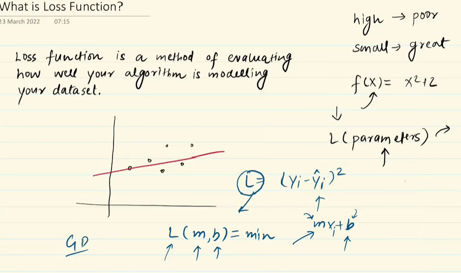
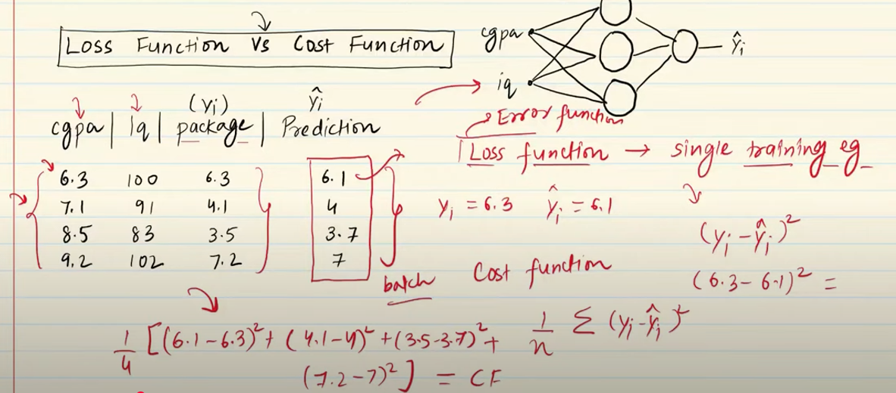
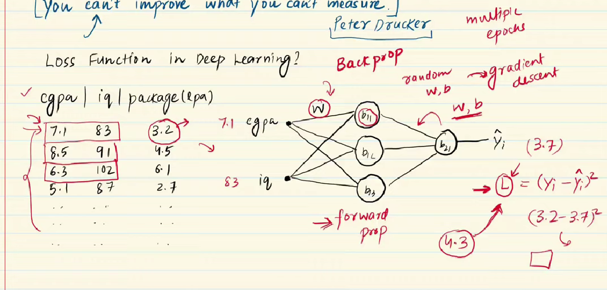
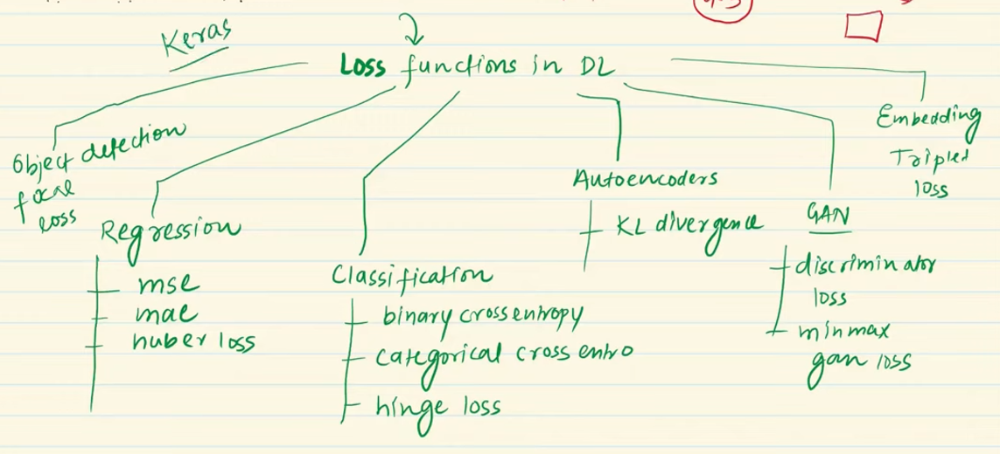
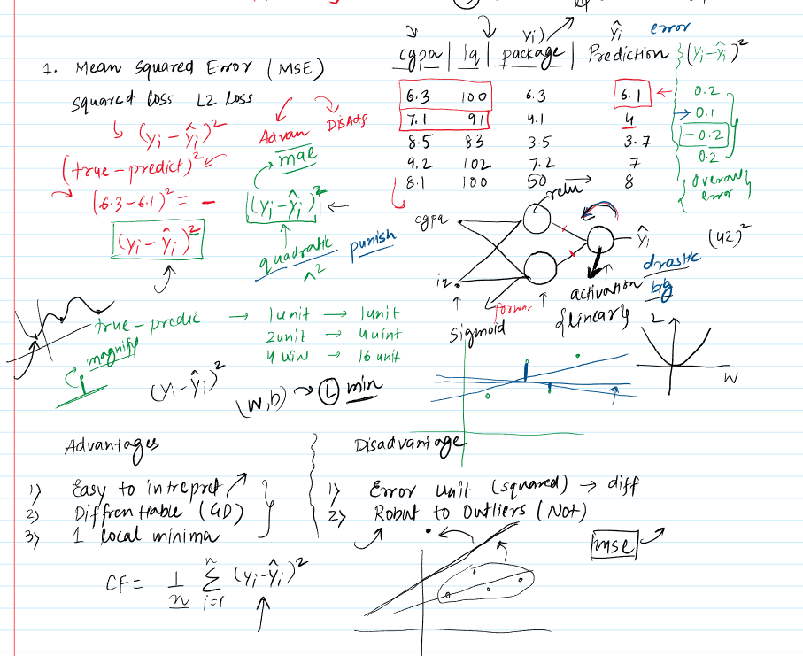
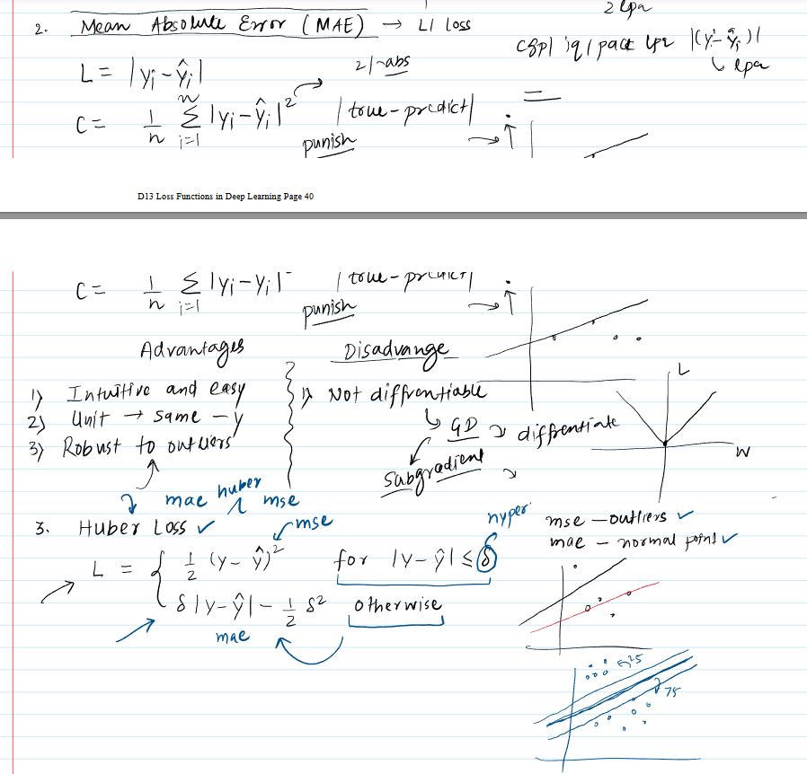
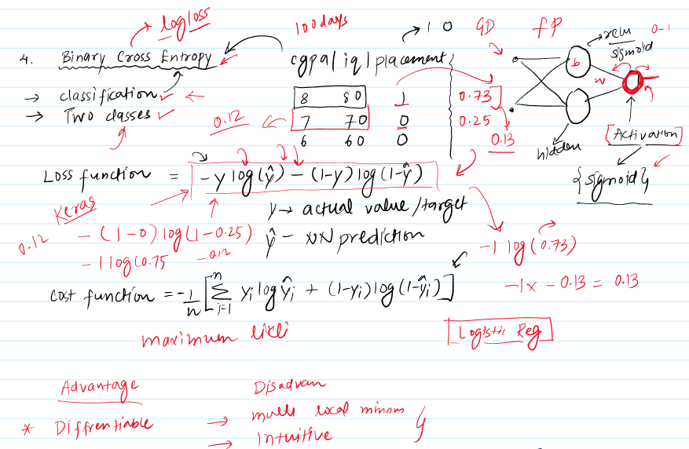
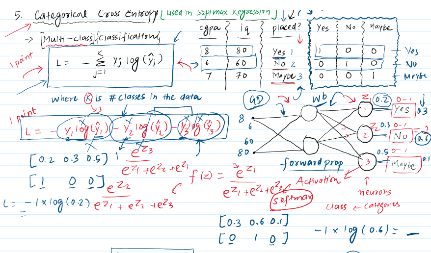
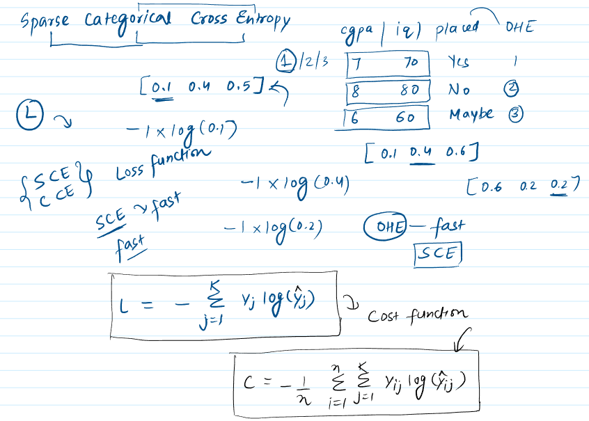

 

## Understanding Loss Functions in Deep Learning

The material explains that **loss functions** are a critical component in both machine learning and deep learning. They serve as a method to **evaluate how well an algorithm models the dataset**.

* **Core Idea**: A loss function quantifies the difference between the **predicted output** of a model and the **actual target value**.
    * A **high loss value** indicates that the model is performing poorly.
    * A **low loss value** suggests the model is performing well.
* **Mathematical Nature**: A loss function is essentially a **mathematical function** whose value depends on the model's **parameters** (weights and biases). By adjusting these parameters, the loss value changes. The goal of training is to find parameters that **minimize** this loss.
    * *Example (Linear Regression)*: For a simple linear regression model ($y = mx + b$), the **Mean Squared Error (MSE)** can be the loss function. The loss is a function of parameters 'm' and 'b'. Adjusting 'm' and 'b' changes the line's fit and thus the loss.
* **Importance**: The material emphasizes Peter Drucker's quote: "**You can't improve what you can't measure.**" Loss functions provide this crucial measure of error, guiding the learning process.
    * They act like the "**eyes**" of the algorithm, telling it how far off its predictions are and in which direction to adjust its parameters to improve.
    * The training process typically starts with random parameter values, calculates the loss, and then iteratively adjusts the parameters (e.g., using **gradient descent**) to reduce the loss.

---

## Loss Functions vs. Cost Functions

The material draws an important distinction:

* **Loss Function**: Calculated for a **single training example**. It measures the error for one specific input-output pair.
* **Cost Function**: Typically refers to the **average loss** over the **entire training dataset** or a **batch of training examples**.
    * *Example*: If MSE is used, the loss for one student's package prediction is the "loss function." The average MSE over all students in the training set is the "cost function."

---

## Role in Deep Learning Model Training (Backpropagation)

Loss functions are central to training deep learning models via **backpropagation**.

1.  **Forward Propagation**: An input (e.g., a student's CGPA and IQ) is fed through the neural network. The network, with its current weights and biases, produces an output (e.g., predicted package).
    * *Visual Suggestion*: A diagram of a simple neural network showing input, hidden, and output layers with data flowing forward would be helpful here.
2.  **Loss Calculation**: The chosen loss function calculates the error between the predicted output and the actual target value for that input.
3.  **Backward Propagation (via Gradient Descent)**: The calculated loss is then used to compute gradients (derivatives of the loss with respect to the model's weights and biases). These gradients indicate how much each weight and bias contributed to the error.
4.  **Parameter Update**: The weights and biases are adjusted in the direction opposite to their gradients to minimize the loss.
5.  **Iteration**: This process (forward pass, loss calculation, backward pass, parameter update) is repeated for many examples or batches of examples over multiple **epochs** (passes through the entire dataset) until the loss is minimized to a satisfactory level.

---

## Types of Loss Functions

The material highlights various loss functions depending on the type of problem:

### For Regression Problems:

These are used when predicting continuous values.

1.  **Mean Squared Error (MSE) / L2 Loss / Squared Loss** 

    * **Formula (single sample loss)**: $(y - \hat{y})^2$
    * **Formula (cost function)**: $\frac{1}{N} \sum_{i=1}^{N} (y_i - \hat{y}_i)^2$
        * Where $y$ is the true value and $\hat{y}$ is the predicted value.
    * **Significance**:
        * It **squares the difference**, which means larger errors are penalized more heavily than smaller errors. This is due to its quadratic nature.
        * The squaring also ensures the loss is always positive and makes the function differentiable.
        * *Visual Description*: The material implies a graph of MSE vs. model parameters would be a convex curve (like a parabola), having a single global minimum, which is good for optimization.
    * **Advantages**:
        * **Differentiable everywhere**, making it easy to use with gradient descent.
        * Has a **single global minimum** (it's a convex function), which simplifies optimization.
    * **Disadvantages**:
        * The **unit of the loss is the square** of the unit of the target variable (e.g., if predicting package in LPA, loss is in LPA squared), which can be less intuitive.
        * **Highly sensitive to outliers**. A large error from an outlier, when squared, can dominate the total loss and disproportionately influence the model parameters, potentially leading to a suboptimal model for the majority of the data.
    * **Deep Learning Context**: When using MSE, the **output layer neuron(s) should typically have a linear activation function**.

2.  **Mean Absolute Error (MAE) / L1 Loss**

    * **Formula (single sample loss)**: $|y - \hat{y}|$
    * **Formula (cost function)**: $\frac{1}{N} \sum_{i=1}^{N} |y_i - \hat{y}_i|$
    * **Significance**:
        * It takes the **absolute difference**, meaning errors are weighted linearly. It doesn't penalize large errors as harshly as MSE.
    * **Advantages**:
        * The **unit of the loss is the same** as the unit of the target variable, making it more interpretable.
        * **More robust to outliers** compared to MSE because it doesn't square the errors.
    * **Disadvantages**:
        * The derivative is undefined at zero (where $y = \hat{y}$). However, **sub-gradient methods** can be used, though this can sometimes lead to slower convergence or require more complex optimization adjustments.
        * *Visual Description*: The material implies a graph of MAE vs. model parameters would look like a V-shape, which is convex but has a non-differentiable point at the minimum.

3.  **Huber Loss**
    * **Significance**: A **combination of MSE and MAE**. It behaves like MSE for small errors and like MAE for large errors.
    * **Formula Concept**:
        * If $|y - \hat{y}| \leq \delta$: $\frac{1}{2}(y - \hat{y})^2$ (quadratic, like MSE)
        * If $|y - \hat{y}| > \delta$: $\delta |y - \hat{y}| - \frac{1}{2}\delta^2$ (linear, like MAE, but shifted)
        * **$\delta$ (delta)** is a hyperparameter that defines the threshold between small and large errors.
    * **Advantages**: It tries to get the best of both worlds: less sensitivity to outliers (like MAE) while still being differentiable around the minimum (like MSE for small errors). Useful when the dataset contains a fair number of outliers.

### For Classification Problems:

These are used when predicting discrete class labels.

1.  **Binary Cross-Entropy (Log Loss)**

    * **Use Case**: For **binary classification** problems (two output classes, e.g., Yes/No, 0/1).
    * **Formula (single sample loss)**: $-(y \log(\hat{y}) + (1-y) \log(1-\hat{y}))$
        * $y$ is the true label (0 or 1).
        * $\hat{y}$ is the predicted probability of the positive class (output of the sigmoid function, between 0 and 1).
    * **Significance**: It penalizes predictions that are confident and wrong more heavily.
    * **Deep Learning Context**: The **output layer neuron must use a sigmoid activation function**.
    * **Advantages**: Differentiable.
    * **Disadvantages**: Can be less intuitive to understand initially. May have multiple local minima.

2.  **Categorical Cross-Entropy**

    * **Use Case**: For **multi-class classification** problems (more than two output classes).
    * **Formula (single sample loss)**: $-\sum_{j=1}^{K} y_j \log(\hat{y}_j)$
        * $K$ is the number of classes.
        * $y_j$ is 1 if the sample belongs to class $j$, and 0 otherwise (i.e., true labels are **one-hot encoded**).
        * $\hat{y}_j$ is the predicted probability of the sample belonging to class $j$ (output from the softmax function).
    * **Significance**: It measures the dissimilarity between the true distribution (one-hot encoded vector) and the predicted probability distribution over classes.
    * **Deep Learning Context**:
        * The **output layer must have K neurons** (one for each class).
        * The **output layer must use a softmax activation function**, which converts raw scores into a probability distribution where probabilities sum to 1.
        * The target labels (actual classes) need to be **one-hot encoded**.

3.  **Sparse Categorical Cross-Entropy**

    * **Use Case**: Same as categorical cross-entropy (multi-class classification), but used when the true labels are provided as **integers** (e.g., 0, 1, 2, ..., K-1) instead of one-hot encoded vectors.
    * **Significance**: It's computationally more efficient, especially when dealing with a large number of classes, as it avoids the explicit one-hot encoding step for the target variable and simplifies some internal calculations.
    * **Deep Learning Context**: Output layer setup (K neurons, softmax activation) is the same as for categorical cross-entropy. The difference is only in the format of the true labels.

The material also briefly mentions other specialized loss functions like **Hinge Loss** (used in SVMs, can be applied to classification), **KL Divergence** (for autoencoders), **Discriminator Loss** (for GANs), **Focal Loss** (for object detection), and **Triplet Loss** (for learning embeddings). It also notes the possibility of creating **custom loss functions**.

---

## Summary of Common Choices:

* **Regression**:
    * If data has few outliers: **MSE**.
    * If data has significant outliers: **MAE**.
    * If a mix or unsure: **Huber Loss** can be a good compromise.
* **Binary Classification**: **Binary Cross-Entropy**.
* **Multi-Class Classification**:
    * If target labels are one-hot encoded: **Categorical Cross-Entropy**.
    * If target labels are integers: **Sparse Categorical Cross-Entropy** (often preferred for efficiency if many classes).

---

## Stimulating Learning Prompts:

1.  How might the choice of optimizer (e.g., Adam, SGD) interact with the characteristics of different loss functions (like the non-differentiability of MAE at zero)?
2.  When designing a system for a critical application where misclassifying a specific class has very severe consequences (e.g., medical diagnosis), how might you adapt or weight a standard loss function to reflect this?
 