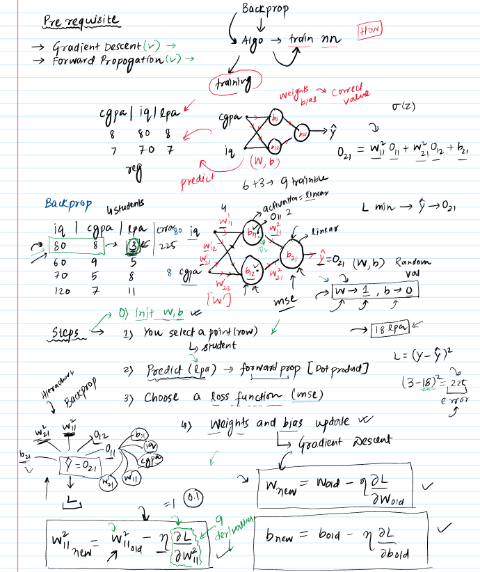
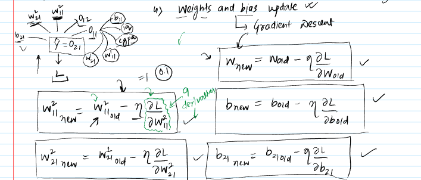
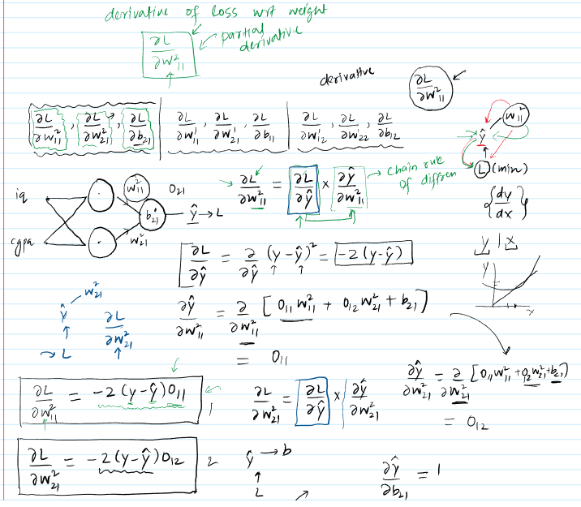
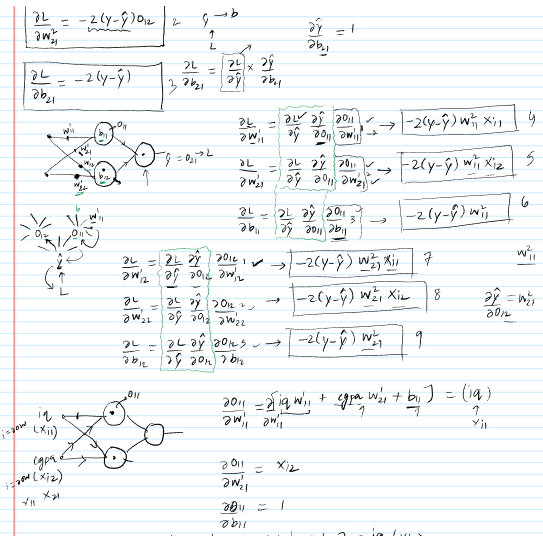
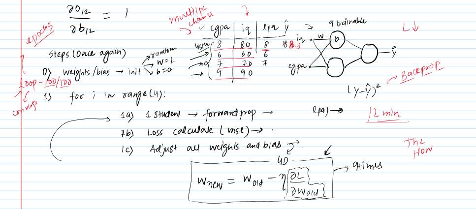

 

### Understanding Backpropagation: The Core "What"

The information presented aims to demystify **Backpropagation**, a cornerstone algorithm in training **Artificial Neural Networks (ANNs)**. This first part of a planned three-part series focuses on "The What" – explaining the fundamental concept and mechanics of Backpropagation.

* **Core Idea Simplified:**
    * **Backpropagation**, at its heart, is an **algorithm used to train neural networks**.
    * Its primary goal is to efficiently adjust the **weights** and **biases** within the network to minimize the difference between the network's predictions and the actual target values. This process is iterative and aims to find the most **optimal values** for these parameters for a given dataset.
    * The name "Backpropagation" comes from "backward propagation of errors," signifying how the error calculated at the output is used to adjust parameters by moving backward through the network.

* **Why is Training Neural Networks/Backpropagation Needed?**
    * Neural networks make predictions based on their internal **weights** (strength of connections between neurons) and **biases** (thresholds for neuron activation).
    * To make accurate predictions, these weights and biases need to be "tuned" correctly. This tuning process is called **training**.
    * **Example:** A neural network designed to predict a student's salary package (LPA - Lakhs Per Annum) based on their CGPA and IQ. The network has input neurons for CGPA and IQ, and an output neuron for the predicted LPA. The connections between these neurons have weights, and neurons themselves can have biases.
        * *Visual Aid Suggestion:* A simple diagram of this neural network (2 input neurons, possibly a hidden layer, 1 output neuron) would be helpful to visualize the weights and biases.
    * Backpropagation provides a systematic way to find the optimal set of weights and biases that allow the network to learn the underlying patterns in the data (e.g., how CGPA and IQ map to LPA).

* **Prerequisites for Deeper Understanding:**
    * **Gradient Descent:** An **optimization algorithm** used to find the minimum of a function. In backpropagation, it's used to minimize the **loss function** (error) by iteratively adjusting weights and biases in the direction opposite to the gradient.
    * **Forward Propagation:** The process by which a neural network takes input data, passes it through its layers (applying weights, biases, and activation functions), and produces an output or prediction. This is how the network "makes a guess" before the error is calculated.

### The Backpropagation Process: "The What" Unveiled

The material outlines a series of steps to understand how backpropagation works to adjust weights and biases:

1.  **Initialization (Step 0):**
    * The process begins by initializing all **weights** and **biases** in the network.
    * Common strategies include:
        * Assigning random values.
        * Setting weights to 1 and biases to 0 (as used in the material for simplicity in initial examples).
    * The choice of initialization can affect the training efficiency.
    * The material also specifies using **linear activation functions** in the neurons for this introductory explanation to keep the math simpler. This means the output of a neuron is a simple weighted sum of its inputs plus a bias.

2.  **Forward Propagation (Making a Prediction):**
    * Select a single data point (e.g., one student's CGPA and IQ) from the training set.
    * Feed these input values through the network.
    * At each neuron, the inputs are multiplied by their corresponding weights, summed up, and the bias is added (followed by an activation function, which is linear here).
    * This generates a prediction at the output layer (e.g., predicted LPA, denoted as `Y_hat`).
    * **Example:** For a student with CGPA 8, IQ 80, actual LPA 3. With initial (non-optimal) weights and biases, the network might predict an LPA of 18. This discrepancy highlights the error.

3.  **Calculate Loss/Error (Step 3 in material):**
    * The difference between the network's prediction (`Y_hat`) and the actual target value (`Y`) is quantified using a **Loss Function**.
    * For regression problems (like predicting LPA), **Mean Squared Error (MSE)** is a common loss function: $L = (Y - Y_{hat})^2$.
    * **Example:** Using the above values, Loss = $(3 - 18)^2 = (-15)^2 = 225$. This large error value signals that the network's parameters (weights and biases) are far from optimal.

4.  **The Core Idea: Adjusting Weights and Biases Based on Error:**
    * The goal is to reduce the calculated loss. Since the actual value `Y` is fixed (it's from the data), the loss can only be reduced by changing `Y_hat`.
    * `Y_hat` is a direct result of the network's weights and biases, and the outputs of preceding neurons (activations).
    * This creates a **dependency chain**:
        * The **Loss ($L$)** depends on the prediction **$Y_{hat}$** (output of the final layer, say $O_{out}$).
        * **$Y_{hat}$ (or $O_{out}$)** depends on the **weights ($W_{out}$)** and **biases ($B_{out}$)** leading into the output layer, and the **activations ($O_{hidden}$)** from the previous (hidden) layer.
        * The **activations from the hidden layer ($O_{hidden}$)**, in turn, depend on the **weights ($W_{hidden}$)** and **biases ($B_{hidden}$)** of the hidden layer, and the initial inputs or activations from even earlier layers.
    * *Visual Aid Suggestion:* A dependency graph or flowchart illustrating how Loss depends on $Y_{hat}$, which depends on weights/biases and previous layer outputs, would clarify this chain.
    * To minimize loss, we need to understand how a small change in each weight and bias affects the total loss. This is where derivatives come in.

5.  **Updating Parameters using Gradient Descent (Step 4 in material):**
    * **Gradient Descent** is used to update each weight and bias. The update rule is:
        * $W_{new} = W_{old} - \eta \cdot \frac{\partial L}{\partial W_{old}}$
        * $B_{new} = B_{old} - \eta \cdot \frac{\partial L}{\partial B_{old}}$
    * Where:
        * **$W_{new}$ / $B_{new}$**: The updated value of the weight/bias.
        * **$W_{old}$ / $B_{old}$**: The current value of the weight/bias.
        * **$\eta$ (eta)**: The **Learning Rate**, a small positive value that controls the step size of the updates. A typical value mentioned is 0.1.
        * **$\frac{\partial L}{\partial W_{old}}$** (and $\frac{\partial L}{\partial B_{old}}$): The **partial derivative (gradient)** of the loss function with respect to that specific weight or bias. This term indicates how much the loss changes for a small change in the weight/bias, and in what direction. This is the crucial quantity that Backpropagation calculates.

6.  **Calculating Derivatives (Gradients) via the Chain Rule:**
    * The challenge is that a specific weight (especially in earlier layers) doesn't directly influence the loss. Its influence is indirect, through several intermediate calculations (activations of subsequent neurons, final prediction).
    * The **Chain Rule of Differentiation** is essential here. It allows us to calculate the derivative of the loss with respect to a weight, even if the relationship is indirect.
    * **Intuition for a derivative $\frac{dy}{dx}$**: It measures how much `y` changes for a small change in `x`.
    * To find $\frac{\partial L}{\partial W}$ (how loss `L` changes with a change in weight `W`):
        * If `L` depends on $Y_{hat}$, and $Y_{hat}$ depends on `W`, then:
            $\frac{\partial L}{\partial W} = \frac{\partial L}{\partial Y_{hat}} \cdot \frac{\partial Y_{hat}}{\partial W}$
    * **Example Derivative Calculation (Output Layer):**
        * Consider a weight $W_{21}$ connecting the output of a hidden neuron $O_1$ to the output neuron (predicting $Y_{hat}$).
        * $L = (Y - Y_{hat})^2$. So, $\frac{\partial L}{\partial Y_{hat}} = -2(Y - Y_{hat})$.
        * $Y_{hat} = O_1 \cdot W_{21} + O_2 \cdot W_{22} + B_2$ (assuming two hidden neurons $O_1, O_2$ and output bias $B_2$).
        * So, $\frac{\partial Y_{hat}}{\partial W_{21}} = O_1$.
        * Therefore, $\frac{\partial L}{\partial W_{21}} = -2(Y - Y_{hat}) \cdot O_1$.
        * All values on the right-hand side ($Y$, $Y_{hat}$, $O_1$) are known after forward propagation for the current data point.
    * **Example Derivative Calculation (Hidden Layer):**
        * Consider a weight $W_{11}$ in an earlier layer connecting an input $X_1$ to a hidden neuron whose output is $O_1$.
        * The loss `L` depends on $Y_{hat}$, $Y_{hat}$ depends on $O_1$ (among other things), and $O_1$ depends on $W_{11}$.
        * The chain rule extends: $\frac{\partial L}{\partial W_{11}} = \frac{\partial L}{\partial Y_{hat}} \cdot \frac{\partial Y_{hat}}{\partial O_1} \cdot \frac{\partial O_1}{\partial W_{11}}$.
        * $\frac{\partial L}{\partial Y_{hat}} = -2(Y - Y_{hat})$ (calculated before).
        * $\frac{\partial Y_{hat}}{\partial O_1} = W_{21}$ (from the equation for $Y_{hat}$).
        * If $O_1 = X_1 \cdot W_{11} + X_2 \cdot W_{12} + B_1$, then $\frac{\partial O_1}{\partial W_{11}} = X_1$.
        * So, $\frac{\partial L}{\partial W_{11}} = -2(Y - Y_{hat}) \cdot W_{21} \cdot X_1$.
        * This shows how the error is "propagated backward" using the weights of the subsequent layers (like $W_{21}$).
    * The material details calculating these derivatives for all 9 tunable parameters (6 weights and 3 biases) in its example network (2 inputs, 2 neurons in first layer, 1 output neuron). *A diagram of this specific 2-2-1 network with labeled weights ($W_{11}, W_{12}$ for inputs to first neuron in hidden layer, $W_{21}, W_{22}$ for inputs to second neuron in hidden layer; and weights from hidden to output, e.g., $W_{out1}, W_{out2}$ or as labeled in video $w21, w221$ etc.) would be very useful here.* The video seems to use $w_{111}, w_{121}$ for layer 1 neuron 1 and $w_{112}, w_{122}$ for layer 1 neuron 2, then $w_{211}, w_{221}$ for the output neuron. The exact notation needs careful handling if reproducing equations fully. The key is the principle.

7.  **Iterative Process: Looping Through Data and Epochs:**
    * The steps (Forward Pass -> Calculate Loss -> Backward Pass to calculate gradients -> Update Weights & Biases) are repeated for each student (data point) in the dataset.
    * Each pass through the entire dataset is called an **Epoch**.
    * This entire process (all epochs) is repeated multiple times (e.g., hundreds or thousands of epochs).
    * With each iteration and each epoch, the weights and biases are gradually adjusted, and the network's predictions should become more accurate, thereby reducing the overall loss.
    * The training stops when the loss converges (stops decreasing significantly) or a predefined number of epochs is reached.
    * *Visual Aid Suggestion:* A high-level flowchart depicting the overall training loop (epochs -> data points -> forward prop -> loss calc -> backward prop -> weight update) would effectively summarize this iterative nature.

### Key Takeaways from "The What" of Backpropagation

* Backpropagation is an algorithm to train neural networks by iteratively adjusting weights and biases.
* It uses **Gradient Descent** to minimize a **Loss Function**.
* The core mathematical tool is the **Chain Rule of Differentiation**, used to calculate the gradient of the loss function with respect to each weight and bias, even those in early layers of the network.
* The process involves a **forward propagation** step (to make predictions and calculate error) and a **backward propagation** step (to calculate gradients and update parameters).
* Training is an iterative process over many **epochs** and data points.

### Looking Ahead

The material presented is the first of three parts.
* **Part 1 (This material):** Focuses on **WHAT** Backpropagation is.
* **Part 2 ("The How"):** Will demonstrate the detailed mathematical calculations from scratch for regression and classification datasets, and convert this math into code.
* **Part 3 ("The Why"):** Will address deeper questions about why certain choices are made or why the algorithm works the way it does.

***

### Stimulating Learning Prompts:

1.  The material simplifies by using linear activation functions. How might the introduction of non-linear activation functions (like Sigmoid or ReLU) change the derivative calculations in the backward pass?
2.  The learning rate $\eta$ is a crucial hyperparameter. What could be the consequences of setting it too high or too low during training?
 