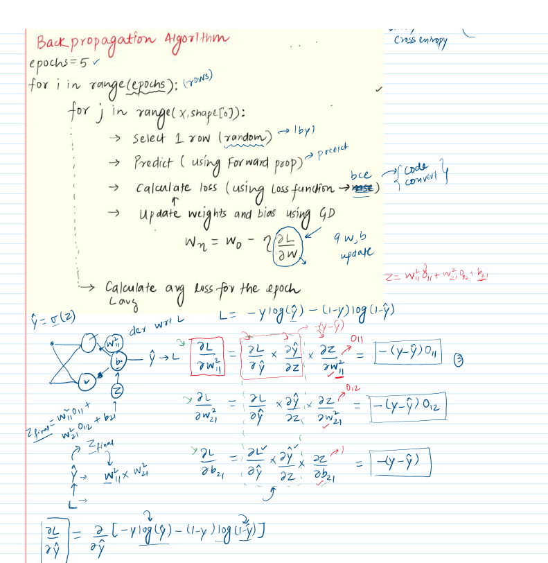
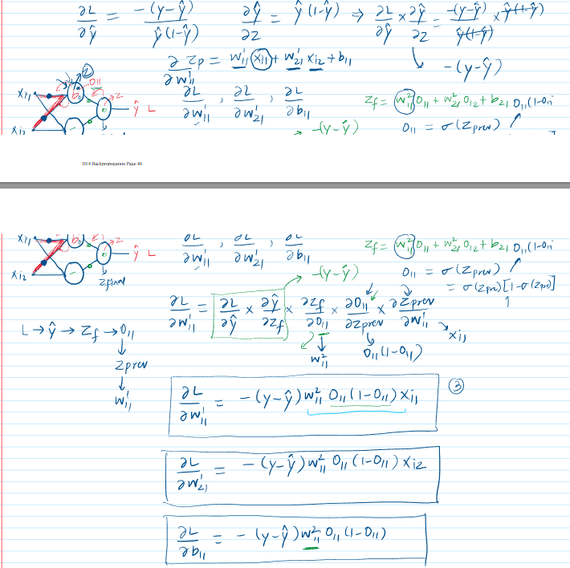
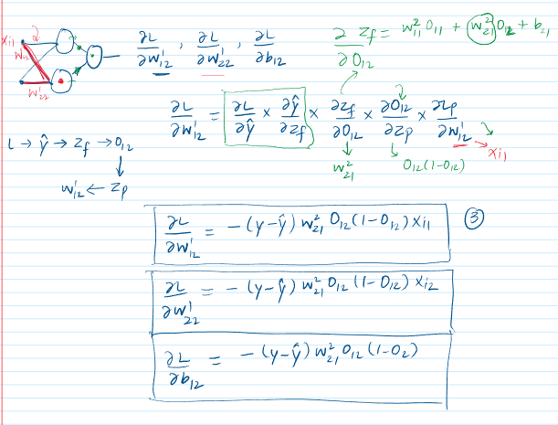

 

## Understanding Backpropagation Fundamentals

**Backpropagation** stands as a cornerstone algorithm for training **Artificial Neural Networks (ANNs)**. It's the mechanism through which a network iteratively learns from its errors, refining its internal parameters to make better predictions.

* **Goal of Backpropagation**: The fundamental aim is to **minimize a predefined loss function**. This function quantifies the discrepancy between the network's predictions and the actual target values. By systematically reducing this loss, the network's accuracy improves.
* **The Overall Flow**: Backpropagation is characterized by a cyclical process, typically executed over multiple **epochs** (complete passes through the entire training dataset) and for each individual data point (or small batches of data points):
    1.  **Forward Pass**: Input data is introduced to the network. It traverses through the layers, where each neuron computes an output based on a weighted sum of its inputs and an **activation function**. The final layer ultimately produces the network's prediction for the given input.
    2.  **Loss Calculation**: The network's prediction is compared against the true target value using a specific **loss function** (e.g., Mean Squared Error for regression, Binary Cross-Entropy for classification). This comparison yields a scalar value representing the magnitude of the error.
    3.  **Backward Pass (Calculating Gradients)**: This is the pivotal step of backpropagation. The algorithm computes the **gradient** (which is a multi-variable generalization of a derivative) of the loss function with respect to every weight and bias parameter in the network. This calculation is performed efficiently by applying the **chain rule** of calculus, propagating the error derivative backward from the output layer toward the input layer. The gradient for each parameter indicates how a small adjustment to that parameter would influence the overall loss.
    4.  **Weight Update**: The network's weights and biases are then adjusted in the direction that most steeply reduces the loss. This adjustment is typically guided by an optimization algorithm, most commonly **Gradient Descent**. The core update rule is: `new_parameter = old_parameter - learning_rate * gradient`. The **learning rate** is a crucial hyperparameter that dictates the size of the steps taken during these updates.

    *Visual Suggestion*: A high-level flowchart illustrating this cycle would be beneficial here:
    `Input -> Forward Pass (Activations & Prediction) -> Loss Calculation -> Backward Pass (Gradient Computation via Chain Rule) -> Weight & Bias Update -> (Repeat for each data point/batch and for multiple epochs).`

---
## Backpropagation in a Regression Problem

The source material illustrates backpropagation with a practical regression example: predicting a student's LPA (Lakhs Per Annum) based on their CGPA and profile score.

### Setting the Stage: The Regression Task
* **Dataset**: A compact dataset is utilized, structured as a Pandas DataFrame. The features are 'cgpa' and 'profile\_score', and the target variable is 'lpa'.

    ```python
    import numpy as np
    import pandas as pd

    # Sample dataset for regression
    df = pd.DataFrame([
        [8,8,4],
        [7,9,5],
        [6,10,6],
        [5,12,7]
    ], columns=['cgpa', 'profile_score', 'lpa'])

    print("Regression Dataset:")
    print(df)
    ```
    **Output:**
    ```
    Regression Dataset:
       cgpa  profile_score  lpa
    0     8              8    4
    1     7              9    5
    2     6             10    6
    3     5             12    7
    ```
    This code initializes the dataset that will be used to train the regression model. Each row represents a student, and the network will learn to map 'cgpa' and 'profile\_score' to 'lpa'.

* **Neural Network Architecture**: A simple feedforward neural network is designed with the following structure:
    * An input layer with 2 nodes (one for CGPA, one for profile score).
    * A hidden layer with 2 nodes.
    * An output layer with 1 node (for the predicted LPA).
    *(The material describes a visual diagram of this 2-2-1 network architecture.)* This architecture dictates the number of weights and biases the network will have.

### Forward Propagation for Regression
This is the sequence of calculations that transforms the input features into a prediction.
1.  The input values (a student's CGPA and profile score) are fed into the input layer.
2.  For each neuron in the subsequent hidden layer, and then in the output layer:
    * A **weighted sum** of its inputs (activations from the previous layer, or the input features themselves for the first hidden layer) is computed: $Z = (w_1x_1 + w_2x_2 + \dots + w_nx_n) + b$.
    * In this specific regression example from the material, the **activation function** applied to this sum $Z$ is **linear** (or identity). This means the output (activation) of the neuron is simply $A = Z$.
3.  The `L_layer_forward` function in the provided code (detailed below) orchestrates this flow, layer by layer.
4.  The final output from the single neuron in the output layer constitutes the predicted LPA.

### Loss Function - Mean Squared Error (MSE)
For regression problems where the goal is to predict a continuous value, **Mean Squared Error (MSE)** is a widely used loss function.
* **Formula**: For a single data point, $MSE = (y - \hat{y})^2$, where $y$ is the actual LPA and $\hat{y}$ is the network's predicted LPA. When averaged over $n$ data points, it's $MSE = \frac{1}{n} \sum_{i=1}^{n} (y_i - \hat{y}_i)^2$.
* **Significance**: MSE quantifies the average squared difference between predicted and actual values. Squaring the difference penalizes larger errors more significantly and ensures the loss is always positive. The objective of training is to adjust the network's parameters to minimize this MSE.

### The Update Rule - Gradient Descent
Once the loss is computed, the gradients of this loss with respect to each weight and bias in the network are determined. The material mentions that for the regression example, these derivative formulas are considered pre-calculated and are directly used in the update function.
* **Concept**: Gradient descent is an iterative optimization algorithm that uses these gradients to guide the adjustment of the network's parameters (weights $W$ and biases $b$).
* **Update Formulas**:
    * $W_{new} = W_{old} - \text{learning\_rate} \times \frac{\partial L}{\partial W}$
    * $b_{new} = b_{old} - \text{learning\_rate} \times \frac{\partial L}{\partial b}$
    * $\frac{\partial L}{\partial W}$ represents the partial derivative (gradient) of the loss $L$ with respect to a weight $W$. The **learning rate** (e.g., set to `0.001` in the code) controls the magnitude of these adjustments. The parameters are updated in the direction opposite to their gradient, which is the direction of steepest descent in the loss landscape.

### Code Deep Dive - Regression  
The material provides a Python implementation from scratch, demonstrating these concepts:

* **`initialize_parameters(layer_dims)`**: This function sets up the initial weights and biases for the network based on its architecture.
    ```python
    def initialize_parameters(layer_dims):
      # np.random.seed(3) # Included in the notebook for reproducibility
      parameters = {}
      L = len(layer_dims) # Number of layers in the network

      for l in range(1, L):
        # Weights are initialized to 0.1, biases to 0 for simplicity in this example.
        parameters['W' + str(l)] = np.ones((layer_dims[l-1], layer_dims[l]))*0.1
        parameters['b' + str(l)] = np.zeros((layer_dims[l], 1))
      return parameters

    # Example for a 2-input, 2-hidden, 1-output network:
    params_reg_initial = initialize_parameters([2,2,1])
    print("Initialized parameters for regression (example call):")
    # The .ipynb shows a direct call with its output.
    # For example: initialize_parameters([2,2,1]) would output:
    # {'W1': array([[0.1, 0.1], [0.1, 0.1]]), 'W2': array([[0.1], [0.1]]), 
    #  'b1': array([[0.], [0.]]), 'b2': array([[0.]])}
    print(params_reg_initial) # Displaying the structure
    ```
    **Output of `print(params_reg_initial)`:**
    ```
    Initialized parameters for regression (example call):
    {'W1': array([[0.1, 0.1],
           [0.1, 0.1]]), 'b1': array([[0.],
           [0.]]), 'W2': array([[0.1],
           [0.1]]), 'b2': array([[0.]])}
    ```
    **Key Idea**: **Weight initialization** is crucial. While this example uses simple constant values (`0.1` for weights, `0` for biases), more sophisticated random initialization techniques (e.g., Xavier or He initialization) are generally preferred in practice to prevent issues like vanishing or exploding gradients and to break symmetry between neurons.

* **`linear_forward(A_prev, W, b)`**: This function computes the linear part of a neuron's operation: the weighted sum plus bias.
    ```python
    def linear_forward(A_prev, W, b):
      # A_prev: activations from previous layer (or input data X)
      # W: weights matrix of the current layer
      # b: bias vector of the current layer
      Z = np.dot(W.T, A_prev) + b # Z is the linear output
      return Z
    ```

* **`L_layer_forward(X, parameters)`**: This function executes the complete forward pass through all layers of the network.
    ```python
    def L_layer_forward(X, parameters):
      A = X # A0, the input
      L = len(parameters) // 2 # Number of layers with weights/biases
      A_prev_for_backprop = X # Initialize A_prev for the case of a single layer network

      for l in range(1, L + 1):
        A_prev_for_backprop = A # Store activation of (l-1)th layer before it's updated
        Wl = parameters['W' + str(l)]
        bl = parameters['b' + str(l)]
        
        A = linear_forward(A_prev_for_backprop, Wl, bl)
            
      return A, A_prev_for_backprop
    ```

* **Loss Calculation (within the epoch loop)**: The MSE for a single sample is directly computed.
    ```python
    # Within the training loop for each sample (X_sample, y_sample):
    # y_hat_sample, A1_sample = L_layer_forward(X_sample, parameters)
    # y_hat_sample = y_hat_sample[0][0] # Extract scalar prediction
    # loss_value = (y_sample - y_hat_sample)**2
    # Loss.append(loss_value)
    ```

    ```python
    X = df[['cgpa', 'profile_score']].values[0].reshape(2,1) # Shape(no of features, no. of training example)
    y = df[['lpa']].values[0][0]

    # Parameter initialization
    parameters = initialize_parameters([2,2,1])

    y_hat,A1 = L_layer_forward(X, parameters)
    ```
    Output of `y_hat, A1` after the forward pass:
    ```
                A0:  [[8]
            [8]]
            W1:  [[0.1 0.1]
            [0.1 0.1]]
            b1:  [[0.]
            [0.]] 
            A1:  [[1.6]
            [1.6]] 
            A1:  [[1.6]
            [1.6]]
            W2:  [[0.1]
            [0.1]]
            b2:  [[0.]] 
            A2:  [[0.32]] 
    ```

* **`update_parameters(parameters, y, y_hat, A1, X)`**: This function implements the gradient descent update rules for each weight and bias, using the pre-calculated derivative formulas for MSE loss.
    ```python
    def update_parameters(parameters, y, y_hat, A1, X):
      learning_rate = 0.001

      parameters['W2'][0][0] = parameters['W2'][0][0] + (learning_rate * 2 * (y - y_hat) * A1[0][0])
      parameters['W2'][1][0] = parameters['W2'][1][0] + (learning_rate * 2 * (y - y_hat) * A1[1][0])
      
      # The b2 update in the source notebook is: parameters['b2'][0][0] = parameters['W2'][1][0] + (learning_rate * 2 * (y - y_hat))
      # This appears to be a typo, using 'W2[1][0]' as the base for 'b2' update.
      # Corrected based on standard gradient descent for b2:
      parameters['b2'][0][0] = parameters['b2'][0][0] + (learning_rate * 2 * (y - y_hat))

      parameters['W1'][0][0] = parameters['W1'][0][0] + (learning_rate * 2 * (y - y_hat) * parameters['W2'][0][0] * X[0][0])
      parameters['W1'][0][1] = parameters['W1'][0][1] + (learning_rate * 2 * (y - y_hat) * parameters['W2'][0][0] * X[1][0])
      parameters['b1'][0][0] = parameters['b1'][0][0] + (learning_rate * 2 * (y - y_hat) * parameters['W2'][0][0])

      parameters['W1'][1][0] = parameters['W1'][1][0] + (learning_rate * 2 * (y - y_hat) * parameters['W2'][1][0] * X[0][0])
      parameters['W1'][1][1] = parameters['W1'][1][1] + (learning_rate * 2 * (y - y_hat) * parameters['W2'][1][0] * X[1][0])
      parameters['b1'][1][0] = parameters['b1'][1][0] + (learning_rate * 2 * (y - y_hat) * parameters['W2'][1][0])
    ```

* **Epochs Implementation**: The training process iterates multiple times over the dataset.
    ```python
    parameters_reg = initialize_parameters([2,2,1])
    epochs = 5 

    print("\nStarting Regression Training from Scratch:")
    for i in range(epochs):
      Loss = [] 
      for j in range(df.shape[0]): 
        X_sample = df[['cgpa', 'profile_score']].values[j].reshape(2,1)
        y_sample = df[['lpa']].values[j][0]

        y_hat_sample, A1_sample = L_layer_forward(X_sample, parameters_reg)
        y_hat_sample = y_hat_sample[0][0] 

        update_parameters(parameters_reg, y_sample, y_hat_sample, A1_sample, X_sample)

        Loss.append((y_sample - y_hat_sample)**2)
      
      print(f"Epoch - {i+1}, Average Loss - {np.array(Loss).mean()}")

    print("\nFinal parameters after regression training (5 epochs):")
    print(parameters_reg)
    ```
    **Output of Epochs Implementation:**
    ```
    Starting Regression Training from Scratch:
    Epoch - 1, Average Loss - 25.321744156025517
    Epoch - 2, Average Loss - 18.320004165722047
    Epoch - 3, Average Loss - 9.473661050729628
    Epoch - 4, Average Loss - 3.2520938634031613
    Epoch - 5, Average Loss - 1.3407132589299962

    Final parameters after regression training (5 epochs):
    {'W1': array([[0.26507636, 0.38558861],
           [0.27800387, 0.40980287]]), 'b1': array([[0.02749056],
           [0.02974394]]), 'W2': array([[0.41165744],
           [0.48302736]]), 'b2': array([[0.48646246]])}
    ```
    This loop demonstrates **Stochastic Gradient Descent (SGD)** because parameters are updated after processing each individual data sample. The average loss per epoch should ideally decrease as training progresses, indicating the model is learning.

### Connecting to Keras - Regression
The material effectively contrasts the manual, "from-scratch" implementation with how a similar neural network would be built and trained using the **Keras** library.
* A Keras `Sequential` model is constructed using `Dense` layers that mirror the 2-2-1 architecture.
* **Weight Initialization in Keras**: To make the comparison more direct, the Keras model's weights are programmatically set to the same initial values (`0.1` for weights, `0` for biases) as used in the manual setup.
* **Optimizer and Loss Configuration**: The Keras model is compiled by specifying an optimizer (like SGD) with the identical learning rate and setting the loss function to MSE (`'mean_squared_error'`).
* **`model.fit()`**: The Keras `model.fit()` method encapsulates the entire training loop, including the iteration over epochs and data, the forward pass, loss calculation, backward pass (gradient computation), and parameter updates.
* **Purpose of Comparison**: This juxtaposition serves to demystify the operations performed by high-level libraries like Keras. It shows that while Keras offers a more convenient and abstracted API, the fundamental principles of forward propagation, loss calculation, and gradient-based updates are the same as those implemented manually. The material shows Keras achieving a loss around 1.47 after 5 epochs, comparable to the scratch implementation's 1.34.

*Stimulating Learning Prompt*: In the manual `update_parameters` function for regression, the learning rate is hardcoded. How would you modify the code to make the learning rate a parameter that can be more easily experimented with? What are the potential benefits of this change?

---
## Backpropagation in a Classification Problem

The material extends the discussion of backpropagation to a binary classification scenario: predicting whether a student gets placed (target value 1) or not (target value 0).

### Setting the Stage: The Classification Task
* **Dataset**: The dataset structure is similar to the regression one, but the target variable, 'placed', is binary.
    ```python
    # Sample dataset for classification
    df_clf = pd.DataFrame([
        [8,8,1], # cgpa, profile_score, placed (1)
        [7,9,1], # placed (1)
        [6,10,0],# not placed (0)
        [5,5,0]  # not placed (0)
    ], columns=['cgpa', 'profile_score', 'placed'])

    print("\nClassification Dataset:")
    print(df_clf)
    ```
    **Output:**
    ```
    Classification Dataset:
       cgpa  profile_score  placed
    0     8              8       1
    1     7              9       1
    2     6             10       0
    3     5              5       0
    ```
* **Neural Network Architecture**: The same 2-2-1 network architecture (2 input nodes, 2 hidden nodes, 1 output node) is retained. However, the single output neuron's role changes: it now predicts the probability of the positive class (e.g., probability of placement).

### Activation Function - Sigmoid
A critical modification for binary classification tasks, particularly for the output layer, is the use of the **Sigmoid activation function**.
* **Formula**: $\sigma(Z) = \frac{1}{1 + e^{-Z}}$
* **Significance**: The sigmoid function takes any real-valued number `Z` (the linear output of a neuron) and "squashes" it into a range strictly between 0 and 1. This output can then be interpreted as a probability.
* **Usage in Material**: For the classification example, the material applies the sigmoid activation function to the neurons in both the hidden layers and the output layer.

    ```python
    def sigmoid(Z):
      A = 1/(1+np.exp(-Z)) # A is the activation
      return A
    ```
    *Visual Suggestion*: A graph plotting the sigmoid function $\sigma(Z)$ against $Z$ would be helpful. It shows an 'S'-shaped curve that saturates at 0 for large negative inputs and at 1 for large positive inputs, clearly visualizing its output range.

### Forward Propagation with Sigmoid
The forward pass mechanism is analogous to the regression case, but the neuron's activation calculation now incorporates the sigmoid function.
1.  The linear output $Z$ is calculated as before: $Z = \text{weighted sum} + b$.
2.  The activation $A$ is then obtained by passing $Z$ through the sigmoid function: $A = \text{sigmoid}(Z)$.
    The `linear_forward` function for classification in the `backpropagation-classification.ipynb` reflects this:
    ```python
    def linear_forward_clf(A_prev, W, b): 
      Z = np.dot(W.T, A_prev) + b
      A = sigmoid(Z) # Apply sigmoid activation
      return A
    ```
The `L_layer_forward` function's structure (iterating through layers) remains the same, but it would now call this `linear_forward_clf` (or a similarly modified `linear_forward`) that applies sigmoid.

### Loss Function - Binary Cross-Entropy (BCE)



For binary classification tasks, the standard and most appropriate loss function is **Binary Cross-Entropy (BCE)**, also known as Log Loss.
* **Formula**: $BCE = -[y \log(\hat{y}) + (1-y) \log(1-\hat{y})]$
    * $y$ is the actual binary label (0 or 1).
    * $\hat{y}$ is the predicted probability (the output of the sigmoid function from the output neuron).
* **Significance**: BCE quantifies the dissimilarity between the predicted probability and the actual binary outcome. It penalizes confident incorrect predictions (e.g., predicting a high probability for class 1 when the actual class is 0) much more severely than uncertain ones.
    The loss for a single sample would be calculated in the epoch loop, for instance:
    ```python
    # Within the training loop for a classification sample (X_sample_clf, y_sample_clf):
    # y_hat_sample_clf, _ = L_layer_forward_clf_wrapper(X_sample_clf, parameters_clf) # Using clf forward prop
    # y_hat_sample_clf = y_hat_sample_clf[0][0]
    
    epsilon = 1e-15 
    # y_hat_clipped = np.clip(y_hat_sample_clf, epsilon, 1 - epsilon) # To avoid log(0)
    
    # loss_value_clf = -y_sample_clf * np.log(y_hat_clipped) - (1 - y_sample_clf) * np.log(1 - y_hat_clipped)
    # Loss_clf.append(loss_value_clf)
    ```

### Deriving Gradients for Classification (Conceptual)
The mathematical expressions for the gradients change due to the introduction of the sigmoid activation and the BCE loss function. The material visually presents these derivations (via screenshots of handwritten notes), emphasizing the application of the **chain rule**.
* **Chain Rule Application**: To determine how a small change in a weight $W$ in an earlier layer influences the final loss $L$, the chain rule is systematically applied.
* **Key Simplification for Sigmoid + BCE**: $\frac{\partial L}{\partial Z_{final}} = \hat{y} - y$
* **Derivative of Sigmoid**: $\frac{dA}{dZ} = A(1-A)$.

    *Visual Suggestion*: A diagram illustrating the chain of dependencies.

### Code Deep Dive - Classification (`backpropagation-classification.ipynb`)
The Python code is adapted:

* **`sigmoid(Z)` function** (already shown).
* **`linear_forward_clf(A_prev, W, b)` function** (already shown).
* **`update_parameters_clf(parameters, y, y_hat, A1, X)`**:
    ```python
    def update_parameters_clf(parameters, y, y_hat, A1, X): 
      learning_rate = 0.0001 

      parameters['W2'][0][0] = parameters['W2'][0][0] + (learning_rate * (y - y_hat) * A1[0][0])
      parameters['W2'][1][0] = parameters['W2'][1][0] + (learning_rate * (y - y_hat) * A1[1][0])
      
      # The b2 update in the source notebook for classification: parameters['b2'][0][0] = parameters['W2'][1][0] + (learning_rate * (y - y_hat))
      # Corrected:
      parameters['b2'][0][0] = parameters['b2'][0][0] + (learning_rate * (y - y_hat))

      parameters['W1'][0][0] = parameters['W1'][0][0] + (learning_rate * (y - y_hat) * parameters['W2'][0][0] * A1[0][0]*(1-A1[0][0]) * X[0][0])
      parameters['W1'][0][1] = parameters['W1'][0][1] + (learning_rate * (y - y_hat) * parameters['W2'][0][0] * A1[0][0]*(1-A1[0][0]) * X[1][0])
      parameters['b1'][0][0] = parameters['b1'][0][0] + (learning_rate * (y - y_hat) * parameters['W2'][0][0] * A1[0][0]*(1-A1[0][0]))

      parameters['W1'][1][0] = parameters['W1'][1][0] + (learning_rate * (y - y_hat) * parameters['W2'][1][0] * A1[1][0]*(1-A1[1][0]) * X[0][0])
      parameters['W1'][1][1] = parameters['W1'][1][1] + (learning_rate * (y - y_hat) * parameters['W2'][1][0] * A1[1][0]*(1-A1[1][0]) * X[1][0])
      parameters['b1'][1][0] = parameters['b1'][1][0] + (learning_rate * (y - y_hat) * parameters['W2'][1][0] * A1[1][0]*(1-A1[1][0]))
    ```
* **Epochs Implementation (Classification)**:
    ```python
    parameters_clf = initialize_parameters([2,2,1])
    epochs_clf = 50 

    print("\nStarting Classification Training from Scratch:")
    def L_layer_forward_clf_wrapper(X, parameters): 
        A = X 
        L = len(parameters) // 2 
        A_prev_for_backprop = X 
        for l in range(1, L + 1):
            A_prev_for_backprop = A 
            Wl = parameters['W' + str(l)]
            bl = parameters['b' + str(l)]
            A = linear_forward_clf(A_prev_for_backprop, Wl, bl) 
        return A, A_prev_for_backprop

    for i in range(epochs_clf):
      Loss_clf = []
      for j in range(df_clf.shape[0]):
        X_sample_clf = df_clf[['cgpa', 'profile_score']].values[j].reshape(2,1)
        y_sample_clf = df_clf[['placed']].values[j][0]

        y_hat_sample_clf, A1_sample_clf = L_layer_forward_clf_wrapper(X_sample_clf, parameters_clf)
        y_hat_sample_clf = y_hat_sample_clf[0][0]

        update_parameters_clf(parameters_clf, y_sample_clf, y_hat_sample_clf, A1_sample_clf, X_sample_clf)
        
        epsilon = 1e-15 
        y_hat_clipped = np.clip(y_hat_sample_clf, epsilon, 1 - epsilon)
        loss_val = -y_sample_clf*np.log(y_hat_clipped) - (1-y_sample_clf)*np.log(1-y_hat_clipped)
        Loss_clf.append(loss_val)
      
      # Displaying loss for selected epochs to match the nature of the provided output
      if (i+1) == 1 or (i+1) == 2 or (i+1) == 10 or (i+1) == 50 or epochs_clf <= 10 :
          print(f"Epoch - {i+1}, Average Loss - {np.array(Loss_clf).mean()}")
    
    print("\nFinal parameters after classification training (50 epochs):")
    print(parameters_clf)
    ```
    **Output of Epochs Implementation (selected epochs):**
    ```
    Starting Classification Training from Scratch:
    Epoch - 1, Average Loss - 0.7103199085929446
    Epoch - 2, Average Loss - 0.6991702892802629
    Epoch - 10, Average Loss - 0.6991514545559935
    Epoch - 50, Average Loss - 0.6990582228463785

    Final parameters after classification training (50 epochs):
    {'W1': array([[0.09994267, 0.09984548],
           [0.09994272, 0.09984548]]), 'b1': array([[-3.3840575e-05],
           [-3.38419977e-05]]), 'W2': array([[0.09920806],
           [0.09920816]]), 'b2': array([[0.09915209]])}
    ```
    The material points out that the loss does not significantly decrease, hovering around 0.69. This value is close to what one might expect if the model is essentially making random guesses for a balanced binary classification problem ($-\log(0.5) \approx 0.693$).

### Connecting to Keras - Classification
Keras is used for comparison:
* `Dense` layers use `'sigmoid'` activation.
* Compiled with `'binary_crossentropy'` loss.
* The Keras model also shows a loss around 0.69 for this specific small dataset, indicating the behavior is consistent with the from-scratch implementation under these conditions.

*Stimulating Learning Prompt*: The derivative of the sigmoid function, $A(1-A)$, approaches zero when the activation $A$ is close to 0 or 1. What potential problem could this lead to during backpropagation, especially in deep networks?

---
## Synthesis and Best Practices

### Key Differences: Regression vs. Classification Backpropagation
1.  **Activation Functions**: Output (linear vs. sigmoid/softmax), Hidden (various).
2.  **Loss Functions**: MSE for regression, BCE/Categorical Cross-Entropy for classification.
3.  **Derivative Calculations**: Formulas change based on activation/loss functions.

### The Importance of Practice
Hands-on practice is key.
* **Suggestions**: Vary learning rate, network architecture, weight initialization, datasets, try Mini-Batch GD.

### Looking Ahead: The "Why" Part
Future material might delve deeper into the mathematical efficiency of the chain rule in backpropagation.

These detailed notes, incorporating the code and its outputs, should provide a solid foundation for understanding the backpropagation algorithm as demonstrated in the source material.
 