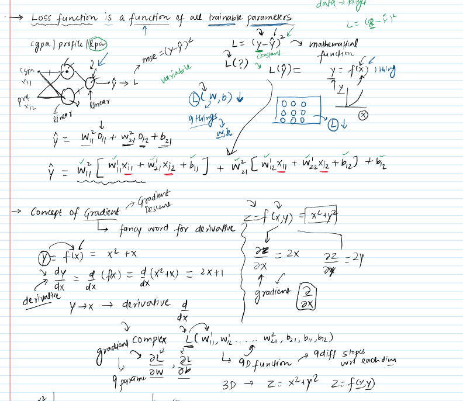
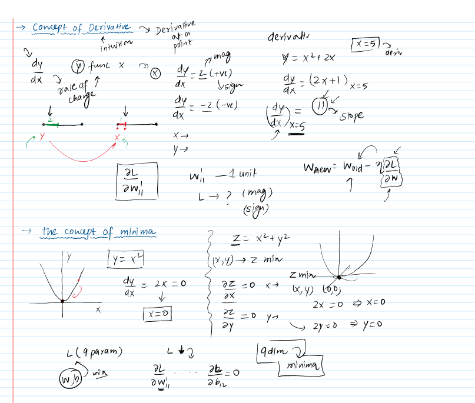
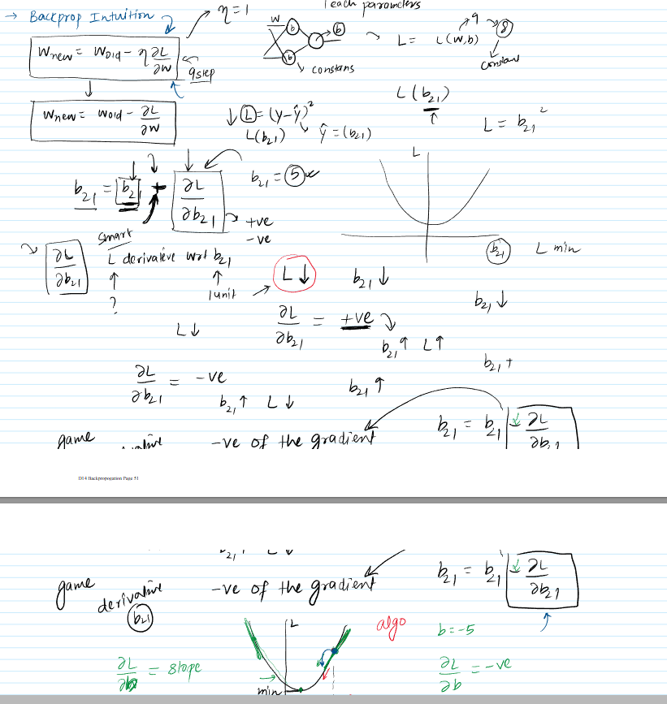
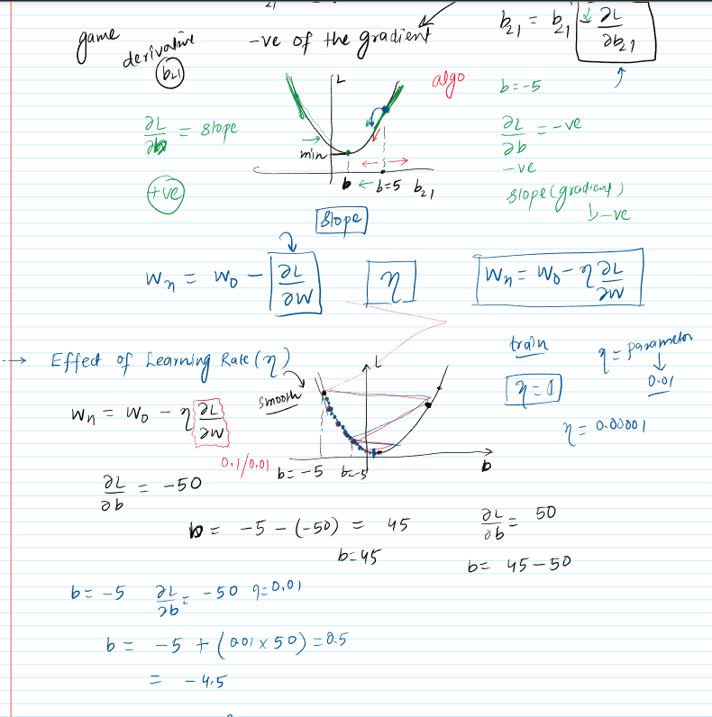
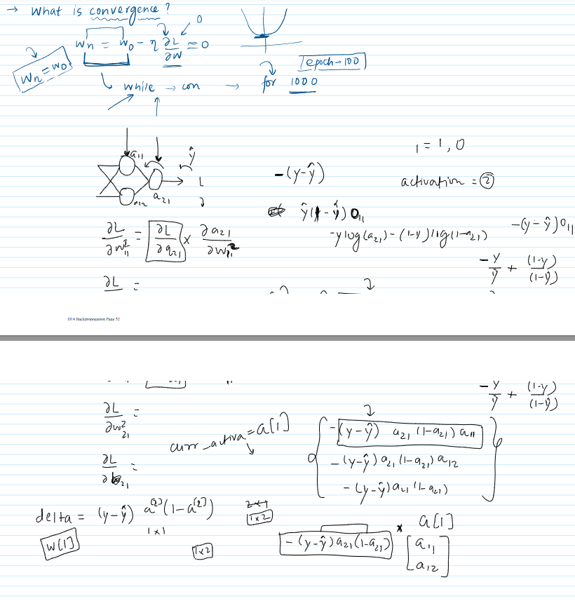

## Deep Dive into Backpropagation: Understanding How Neural Networks Learn

These notes explore the intuition and core mechanics of the **Backpropagation algorithm**, a fundamental process enabling neural networks to learn from data. We'll break down its components, from the overall iterative process to the mathematical concepts that drive it.

---

### 1. The Backpropagation Algorithm: An Overview

The material introduces backpropagation as an algorithm that helps neural networks learn by adjusting their internal parameters.

- **Core Idea**: The algorithm works by:
  1.  Making a **prediction** (forward pass).
  2.  Calculating the **error** (loss) of that prediction.
  3.  Figuring out how much each **weight** and **bias** in the network contributed to this error.
  4.  **Updating** these weights and biases to reduce the error in future predictions. This update step is the "magic" of backpropagation.
- **Iterative Process**:
  - **Epochs**: The learning process happens over multiple **epochs**. An epoch represents one full pass of the algorithm through the entire training dataset. The material notes `epochs = 5` as an example.
  - **Row-by-Row Processing**: Within each epoch, the algorithm often processes the data row by row (or in small batches). For each row:
    - A **random row** (data point) is selected.
    - A **prediction** ($\hat{y}$) is made using the current network weights (Forward Propagation).
    - The **loss** is calculated by comparing the prediction ($\hat{y}$) with the actual target value ($y$). The material mentions **Mean Squared Error (MSE)** for regression (`loss function -> mse`) and **Binary Cross-Entropy (BCE)** for classification (`-> bce`).
    - Weights and biases are **updated** using Gradient Descent (GD). The core rule highlighted is: $W_{new} = W_{old} - \eta \frac{\partial L}{\partial W}$ (where $\eta$ is the learning rate, $L$ is the loss, and $W$ represents a weight).
  - The **average loss** for the epoch is then calculated.
- **Why it's important**: This iterative adjustment is how the network "learns" to make accurate predictions. The update rule is central to minimizing the error.
  - _Visual Aid Suggestion_: A flowchart illustrating the cycle of forward pass, loss calculation, backward pass (gradient calculation), and weight update for a single data point and across an epoch would be beneficial.

---

### 2. The Loss Function: Quantifying Errors

The **Loss Function ($L$)** is crucial as it measures how far off the network's predictions are from the actual values.

- **A Function of All Trainable Parameters**:
  - The loss isn't just a simple number; it's a **mathematical function** that depends on all the **trainable parameters** of the network (all the **weights** and **biases**).
  - The material uses an analogy: imagine the neural network as a box with many **knobs** (the weights and biases). Adjusting any of these knobs changes the output, and therefore, changes the loss. The goal is to turn these knobs to the positions that result in the minimum possible loss.
  - For instance, if a network has weights $w_{11}, w_{12}, \dots$ and biases $b_1, b_2, \dots$, then $L = f(w_{11}, w_{12}, \dots, b_1, b_2, \dots)$.
- **Example: CGPA/Profile Score for Package Prediction**:
  - The material describes a neural network predicting a package (salary) based on CGPA and profile score.
  - The output prediction ($\hat{y}$) is calculated through layers of computations involving input features, weights, and biases. For example, $\hat{y} = w_{11}x_{11} + w_{12}'x_{12} + b_1' + \dots$ (this is a simplified representation of the complex equation shown in the notes, which details how $\hat{y}$ is a composite function of inputs and many weights/biases like $w_{11}^1, w_{12}^1, b_{11}, w_{21}^1, w_{22}^1, b_{12}$, etc.).
  - If using **MSE**, $L = (y - \hat{y})^2$. Since $y$ (the actual package) is a constant from the data, and $\hat{y}$ depends on the weights and biases, $L$ ultimately depends on these weights and biases. The example given suggests a network with potentially 9 trainable parameters, making $L$ a function of these 9 "things."
- **Significance**: Understanding that loss is a function of parameters is key because the goal of training is to find the set of parameters that **minimizes** this loss function.

---

### 3. Understanding Derivatives and Gradients: The Direction of Change

Derivatives and gradients tell us how the loss function changes as we tweak the network's parameters.

- **Derivative ($dy/dx$)**:
  - A **derivative** is described as a "gradients is fancy word for derivative" but also as representing the **rate of change**.
  - If $y = f(x)$ (e.g., $y = x^2 + x$), then $\frac{dy}{dx}$ (e.g., $2x + 1$) tells us how much $y$ changes for a small change in $x$.
  - **Magnitude and Sign**:
    - The **magnitude** indicates how much $y$ changes.
    - The **sign** indicates the direction:
      - Positive $\frac{dy}{dx}$: $y$ increases as $x$ increases.
      - Negative $\frac{dy}{dx}$: $y$ decreases as $x$ increases.
  - **Derivative at a Point**: Calculating the derivative at a specific point (e.g., $\frac{dy}{dx}$ at $x=5$ gives $11$ in the example) gives the **slope** of the function at that point. This tells us the instantaneous rate of change.
- **Gradient ($\nabla L$)**:
  - When a function depends on **multiple variables** (like the loss function $L$ depending on many weights $w_i$ and biases $b_j$), we use **partial derivatives**.
  - Example: If $z = f(x, y) = x^2 + y^2$, then $\frac{\partial z}{\partial x} = 2x$ (treating $y$ as a constant) and $\frac{\partial z}{\partial y} = 2y$ (treating $x$ as a constant).
  - The **gradient** is a vector of all these partial derivatives. For the loss function $L$, the gradient would be $(\frac{\partial L}{\partial w_1}, \frac{\partial L}{\partial w_2}, \dots, \frac{\partial L}{\partial b_1}, \dots)$.
  - The material states our loss function might depend on "9 things" (parameters), so we'd be calculating 9 partial derivatives (slopes with respect to each dimension/parameter).
  - Essentially, the gradient points in the direction of the **steepest increase** of the function.
- **Significance**: In backpropagation, we calculate the gradient of the loss function with respect to each weight and bias ($\frac{\partial L}{\partial W}$). This tells us how a small change in that specific weight will affect the overall loss. This information is then used to update the weight in a direction that _decreases_ the loss.
  - The provided notes show graphs: a 2D parabola for $y=f(x)$ and an attempt to sketch a 3D surface for $z=f(x,y)$, illustrating that derivatives/gradients represent slopes.

---

### 4. The Concept of Minima: Finding the "Best" Parameters

The ultimate goal is to find the parameter values where the loss function is at its **minimum**.

- **Finding Minima**:
  - **1D Case**: For a function $y=f(x)$ (like $y=x^2$), the minimum can often be found by taking the derivative $\frac{dy}{dx}$, setting it to zero ($\frac{dy}{dx}=0$), and solving for $x$. For $y=x^2$, $\frac{dy}{dx} = 2x$. Setting $2x=0$ gives $x=0$, which is the minimum. The provided images/17/image shows a parabola $y=x^2$ with its minimum at $x=0$.
  - **Higher Dimensions**: For a function with multiple variables like $L(w_1, \dots, w_n, b_1, \dots, b_m)$, we find the minimum by calculating all **partial derivatives** and setting them all to zero:
    - $\frac{\partial L}{\partial w_1} = 0, \frac{\partial L}{\partial w_2} = 0, \dots, \frac{\partial L}{\partial b_1} = 0, \dots$
    - Solving this system of equations gives the parameter values at the minimum. The example $z = x^2 + y^2$ has its minimum where $\frac{\partial z}{\partial x} = 2x = 0 \Rightarrow x=0$ and $\frac{\partial z}{\partial y} = 2y = 0 \Rightarrow y=0$.
- **Relevance to Neural Networks**: We want to find the weights and biases that minimize the loss function. Backpropagation uses gradient descent, an iterative approach, to move towards this minimum because directly solving $\frac{\partial L}{\partial W} = 0$ is often intractable for complex networks.
  - The material emphasizes that for a loss function with 9 parameters, we'd need to find 9 derivatives and set them to zero to locate the "9-dimensional minima."

---

### 5. Intuition Behind the Update Rule: $W_{new} = W_{old} - \eta \frac{\partial L}{\partial W}$

This section connects the concepts of derivatives, minima, and the update rule.

- **The Goal**: To reach a point where the loss $L$ is minimized.
- **Simplification for Intuition**:
  - Assume learning rate $\eta=1$. The rule becomes $W_{new} = W_{old} - \frac{\partial L}{\partial W}$.
  - Consider the loss $L$ as a function of a single bias parameter, $b_{21}$ (assuming all other weights and biases are constant for this intuitive explanation). The graph of $L$ vs. $b_{21}$ is typically U-shaped, with a minimum point.
- **Role of the Derivative $\frac{\partial L}{\partial b_{21}}$**:
  - This derivative tells us the **slope** of the loss curve at the current value of $b_{21}$.
  - It indicates how $L$ changes if $b_{21}$ is increased by one unit.
- **Why Subtract the Gradient? The "Smart" Negative Sign**:
  1.  **Case 1: $\frac{\partial L}{\partial b_{21}}$ is positive**:
      - This means increasing $b_{21}$ _increases_ the loss $L$.
      - To decrease $L$ (our goal), we must _decrease_ $b_{21}$.
      - The update rule $b_{21,new} = b_{21,old} - (\text{positive value})$ achieves this decrease.
      - Graphically, if we are on the right side of the minimum (positive slope), we need to move left (decrease $b_{21}$).
  2.  **Case 2: $\frac{\partial L}{\partial b_{21}}$ is negative**:
      - This means increasing $b_{21}$ _decreases_ the loss $L$.
      - To decrease $L$ (our goal), we must _increase_ $b_{21}$.
      - The update rule $b_{21,new} = b_{21,old} - (\text{negative value})$ becomes $b_{21,old} + (\text{positive value})$, achieving this increase.
      - Graphically, if we are on the left side of the minimum (negative slope), we need to move right (increase $b_{21}$).
- **Moving in the Opposite Direction of the Gradient**: The algorithm always adjusts the parameter in the direction **opposite** to the gradient. This is why it's called **Gradient Descent** – we are "descending" the loss curve.
  - The material states: "you always go in the negative direction of the gradient." The graphical explanation involves starting at a point (e.g., $b=5$ or $b=-5$ on the loss curve) and moving towards the minimum by taking steps against the slope.
- **Magnitude of Update**: The magnitude of $\frac{\partial L}{\partial W}$ also influences the step size. A steeper slope (larger derivative) leads to a larger initial adjustment.
  - _Visual Aid_: The provided images/17/images show a U-shaped curve for Loss vs. $b_{21}$. Arrows indicate that if the slope is positive, $b_{21}$ is decreased, and if the slope is negative, $b_{21}$ is (effectively) increased, always moving towards the minimum.

---

### 6. The Role of Learning Rate ($\eta$): Controlling the Step Size

The **learning rate ($\eta$)** is a crucial **hyperparameter** that controls how much the weights and biases are adjusted during each update.

- **Purpose**: It determines the **step size** taken towards the minimum of the loss function.
  - The update rule is $W_{new} = W_{old} - \eta \frac{\partial L}{\partial W}$. The learning rate scales the gradient.
- **Impact of Learning Rate Value**:
  - **Too Large**: If $\eta$ is too large, the algorithm might **overshoot** the minimum and fail to converge, possibly causing the loss to oscillate or even increase. The material describes this as "jumping" around or even "outside the curve."
  - **Too Small**: If $\eta$ is too small, the algorithm will take very tiny steps, making the training process **very slow**. It will take a long time to reach the minimum.
  - **Just Right**: An appropriate learning rate helps the algorithm converge to the minimum efficiently and smoothly. The material mentions values like `0.1` or `0.01` or even `0.00001` and describes the goal as making "smooth steps."
- **Visualizing Effects**:
  - The notes describe an example: if $b_{old}=-5$ and $\frac{\partial L}{\partial b} = -50$.
    - Without $\eta$ (or $\eta=1$): $b_{new} = -5 - (-50) = 45$. This is a large jump.
    - With $\eta=0.01$: $b_{new} = -5 - (0.01 \times -50) = -5 + 0.5 = -4.5$. This is a much smaller, smoother step.
  - The material refers to a "Google tool" that visually demonstrates how different learning rates affect the path to the minimum on a curve. Small steps for small $\eta$, larger steps for appropriate $\eta$, and overshooting for large $\eta$.
- **Significance**: Choosing a good learning rate is critical for effective training. It's often found through experimentation.

---

### 7. Convergence: Knowing When the Network Has Learned

**Convergence** refers to the state where the algorithm has found an optimal (or near-optimal) set of parameters, and further training doesn't significantly improve the model.

- **What is Convergence?**:
  - It occurs when the updates to weights and biases become very small, meaning $W_{new} \approx W_{old}$.
  - This implies that the term $\eta \frac{\partial L}{\partial W}$ is close to zero.
  - If $\eta$ is not zero, then $\frac{\partial L}{\partial W}$ (the slope/gradient) must be close to zero. This condition (gradient near zero) indicates that we are at or near a **minimum** of the loss function.
- **Practical Approach vs. Theoretical Condition**:
  - Theoretically, the loop for updating weights should continue "while convergence" (i.e., until the change in weights or loss falls below a threshold).
  - In practice, it's common to run the algorithm for a **fixed number of epochs** (e.g., 100 or 1000 iterations). The assumption is that within this number of epochs, the model will have sufficiently converged. The material calls this a "sarkari style" (colloquial for a standard, often fixed, approach).
- **Importance**: Understanding convergence helps determine when to stop training, preventing wasted computational resources and potential overfitting if training continues unnecessarily.

---

### 8. Visualizing Backpropagation

The material mentions the value of tools that can help visualize the entire backpropagation process.
[LINK](https://developers-dot-devsite-v2-prod.appspot.com/machine-learning/crash-course/backprop-scroll)

- **Referenced Tool**: A "Google tool" (likely TensorFlow Playground or similar) is mentioned that provides an animation of:
  - The neural network architecture.
  - Forward propagation.
  - Error calculation.
  - Derivative calculation.
  - Backward pass (backpropagation of error).
  - Weight updates.
- **Benefit**: Such visualizations can provide a much better intuition for how these interconnected concepts work together dynamically. The presenter suggests that creating such a visualization project would be a good learning experience.

---

### Stimulating Learning Prompts:

1.  The material simplifies the intuition by considering the loss as a function of a single parameter ($b_{21}$) while others are constant. How does the complexity of finding the minimum change when all parameters are interdependent and updated simultaneously in a high-dimensional space?
2.  If the learning rate ($\eta$) is a fixed value throughout training, how might this be suboptimal compared to an adaptive learning rate that changes during the training process?
