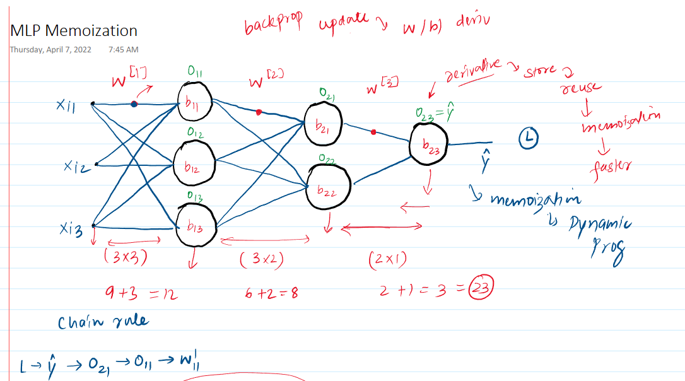
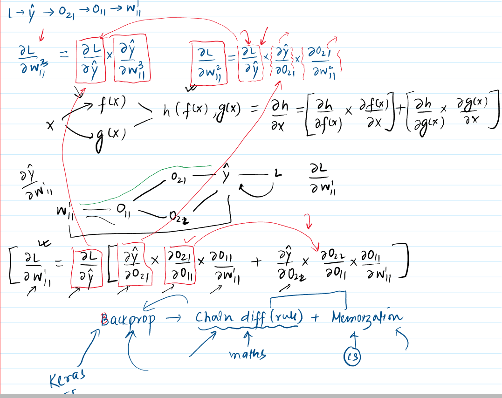

 

The material explains **memoization**, a computer science technique, and its crucial role in optimizing the **backpropagation** algorithm used in training **neural networks**.

* **Understanding Memoization**
    * **Core Idea**: Memoization is an optimization strategy used to speed up computer programs by **storing the results of expensive function calls** and returning the cached result when the same inputs occur again. This avoids redundant computations.
        * **Significance**: It's particularly useful when a function is called repeatedly with the same inputs, or when subproblems overlap significantly.
        * The information presented likens this to a trade-off: using extra **space** (to store results) to save **time** (by avoiding re-computation).
    * **Connection to Dynamic Programming**: Memoization is a key technique in **dynamic programming**, an algorithmic paradigm that solves complex problems by breaking them down into simpler, overlapping subproblems.
    * **Illustrative Example: Fibonacci Sequence**
        * A standard recursive Fibonacci function (e.g., `fib(n) = fib(n-1) + fib(n-2)`) is computationally inefficient because it recalculates Fibonacci numbers for the same `n` multiple times. The material highlights this with an example (e.g., calculating `fib(5)` involves calculating `fib(3)` twice).
            * **Visualizing Inefficiency**: A call tree for `fib(5)` would show many repeated branches (e.g., `fib(2)` being computed multiple times). This leads to an exponential time complexity (around $O(2^n)$).
            * The source demonstrates this inefficiency with Python code, showing significantly increased computation time for larger inputs (e.g., `fib(36)`, `fib(38)`).
        * **Memoized Solution**: By using a dictionary (or a similar data structure) to store the result of `fib(n)` the first time it's computed, subsequent calls for the same `n` can retrieve the value instantly.
            * **Visualizing Efficiency**: The call tree becomes much smaller as repeated branches are pruned. This dramatically reduces the time complexity (to closer to $O(n)$).
            * The source shows a Python implementation with a dictionary, resulting in near-instantaneous computation even for larger inputs.
    * **Why it matters**: This principle of storing and reusing intermediate results is central to understanding its application in more complex algorithms like backpropagation.

* **Backpropagation and the Challenge of Deep Neural Networks**

    * **Context**: Backpropagation is the algorithm used to train neural networks by calculating the **gradient** (derivatives) of the **loss function** with respect to each **weight** and **bias** in the network. These gradients are then used in an optimization algorithm like **gradient descent** to update the parameters.
    * **The Role of the Chain Rule**: The core mathematical tool for calculating these gradients is the **chain rule** of differentiation.
    * **Complexity in Multi-Layer Networks**:
        * The material explains that while calculating derivatives for weights in layers closer to the output is relatively straightforward, it becomes progressively more complex for weights in earlier (deeper) layers.
        * An example neural network with an input layer, two hidden layers, and an output layer is considered (similar to the one depicted in the first provided image, with layers of neurons $x \rightarrow o^{[1]} \rightarrow o^{[2]} \rightarrow \hat{y}$).
        * **Derivative for Output Layer Weights** (e.g., $\frac{\partial L}{\partial w^{[3]}}$): The chain rule path is direct. For instance, $\frac{\partial L}{\partial w_{ij}^{[3]}} = \frac{\partial L}{\partial \hat{y}} \cdot \frac{\partial \hat{y}}{\partial o_{k}^{[2]}} \cdot \frac{\partial o_{k}^{[2]}}{\partial w_{ij}^{[3]}}$. (Actual notation might vary slightly, but the principle is a direct chain).
        * **Derivative for Inner Hidden Layer Weights** (e.g., $\frac{\partial L}{\partial w^{[1]}}$): This is where the complexity significantly increases. A change in a weight in an early layer (e.g., $w_{ij}^{[1]}$) influences an output $o_j^{[1]}$. This $o_j^{[1]}$ then influences *all* neurons in the subsequent layer ($o_k^{[2]}$). Each of these, in turn, influences the final loss $L$.
            * Therefore, the derivative $\frac{\partial L}{\partial w_{ij}^{[1]}}$ must sum the contributions of all paths through which $w_{ij}^{[1]}$ affects $L$.
            * **Significance**: This "fan-out" effect means that calculating derivatives for earlier layers involves many terms and repeated sub-expressions if done naively. The source explicitly shows a formula (similar to the second provided image) like:
                $\frac{\partial L}{\partial w_{11}} = \frac{\partial L}{\partial \hat{y}} \left[ \left( \frac{\partial \hat{y}}{\partial o_{21}} \frac{\partial o_{21}}{\partial o_{11}} \right) + \left( \frac{\partial \hat{y}}{\partial o_{22}} \frac{\partial o_{22}}{\partial o_{11}} \right) + \dots \right] \frac{\partial o_{11}}{\partial w_{11}}$.
            * **Visual Aid Suggestion**: A computational graph segment showing how a single node's output in an earlier layer ($o_{11}$) branches out to influence multiple nodes in the next layer ($o_{21}, o_{22}$), which then converge towards the final loss, would be very helpful here. This is depicted in the second provided image.
        * The material emphasizes that with more hidden layers (e.g., 10 layers), the number of terms and potential for re-computation grows substantially, making naive calculation very slow.

* **Memoization to the Rescue in Backpropagation**
    * **The Insight**: During the backward pass of backpropagation (moving from the output layer towards the input layer), many of the intermediate derivative terms calculated for one layer's weights are needed again for preceding layers' weights.
        * For example, the term $\frac{\partial L}{\partial \hat{y}}$ is used in calculating derivatives for weights in all layers.
        * More complex terms like $\frac{\partial L}{\partial o_{21}}$ (the gradient of the loss with respect to the output of a neuron in the second hidden layer) will be calculated when updating weights in $W^{[3]}$ and then *reused* when calculating derivatives for weights in $W^{[2]}$ that feed into $o_{21}$.
    * **How it Works**: By **storing these intermediate derivative values** (e.g., $\frac{\partial L}{\partial o_{k}^{[l]}}$ for each neuron $k$ in layer $l$) as they are computed during the backward pass, they can be readily accessed and reused when calculating gradients for earlier layers. This avoids recalculating them from scratch.
        * **Significance**: This dramatically speeds up the backpropagation process, making the training of deep neural networks feasible.
        * The first provided image explicitly notes this: "derivative -> store & reuse -> memoization -> faster".
    * **The Essence of Backpropagation**: The material concludes that **backpropagation is effectively the chain rule combined with the optimization technique of memoization**.
        * **Chain Rule**: Provides the mathematical framework (the "maths").
        * **Memoization**: Provides the computational efficiency (the "computer science" optimization, linked to dynamic programming).
        * This efficient combination is what powers deep learning libraries like **Keras** and **TensorFlow**, as noted in the second provided image.

* **Summary of Key Points**
    * Deep neural networks require complex derivative calculations for training.
    * Naive application of the chain rule leads to many redundant computations.
    * **Memoization** (storing and reusing intermediate derivative values computed during the backward pass) is crucial for making backpropagation computationally efficient.
    * This synergy between mathematical principles (chain rule) and computer science optimization (memoization) is fundamental to modern deep learning.

**Stimulating Learning Prompts:**

1.  Considering the trade-off between time and space in memoization, how might the memory requirements for memoization in backpropagation scale with the width (number of neurons per layer) and depth (number of layers) of a neural network?
2.  Beyond speed, are there any other potential benefits or drawbacks of using memoization within the backpropagation algorithm, perhaps related to numerical stability or implementation complexity?
 