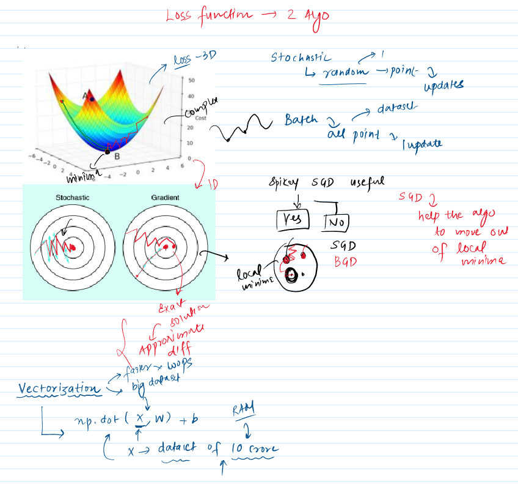

 

**1. Introduction: The Challenge of Training Deep Neural Networks**

Training deep neural networks effectively involves finding the right model parameters (weights and biases) that minimize a loss function. This process can be computationally intensive and present several challenges. Optimization algorithms are crucial tools that guide this search, and techniques to improve their efficiency are vital for practical deep learning.

---

**2. Gradient Descent: The Core Optimizer**

* **Definition and Goal:** **Gradient descent** is a fundamental iterative optimization algorithm used to find the minimum of an objective function, $J(\theta)$ (often a loss function in machine learning). It is one of the most popular algorithms for optimizing neural networks. The goal is to adjust the model's parameters, $\theta$, to minimize this function.
* **Mechanism:** It works by updating the parameters in the direction opposite to the **gradient** of the objective function with respect to those parameters ($\nabla_\theta J(\theta)$). Essentially, it follows the direction of the steepest descent, like walking downhill on the loss surface until a valley (a local minimum) is reached.
* **Learning Rate $(\eta)$:** The **learning rate** is a hyperparameter that determines the size of the steps taken towards the minimum during each update. A well-chosen learning rate is crucial for convergence.
* **Visualizing Gradient Descent:** The material describes gradient descent as moving down the slope of a surface created by the objective function until a valley is reached. Imagine a 3D contoured landscape representing the loss function; gradient descent would be like a ball rolling down this landscape, always seeking the lowest point. One diagram from the source material illustrates this as stepping down this 3D surface towards a minimum.
* **Variants of Gradient Descent:** There are three main variants, differing in the amount of data used to compute the gradient for parameter updates. This choice involves a trade-off between the accuracy of the update and the time it takes.
    * **Batch Gradient Descent (BGD) (or Vanilla Gradient Descent):**
        * It computes the gradient of the loss function using the **entire training dataset** for each parameter update.
        * Updates to weights and biases occur once per epoch (after processing all data points). A diagram in the source material depicts this by showing all 50 data points (represented as a block) being used to calculate the overall loss *before* a single update is applied to the weights (w) and bias (b).
        * **Significance:** Provides an accurate estimate of the gradient, leading to a stable convergence. However, it can be very slow and computationally expensive for large datasets because it processes all data for every single update.
    * **Stochastic Gradient Descent (SGD):**
        * It updates the parameters using the gradient computed from **a single training example (or one random point)** at a time.
        * The frequency of updates is very high (e.g., if there are 50 data points, there are 50 updates in one epoch). A diagram in the source material illustrates this with updates to w,b occurring sequentially after processing each individual data point (row by row).
        * **Significance:** SGD updates are much faster and less computationally intensive per update. The noisy updates can help the algorithm escape shallow local minima. However, the path to the minimum can be erratic and may not converge to the exact minimum, often oscillating around it.
    * **Mini-Batch Gradient Descent (MBGD):**
        * It updates parameters using a **small, randomly selected batch of training examples** (e.g., 32, 64 samples).
        * This approach is a compromise, combining the stability of BGD with the efficiency of SGD. It offers a more stable convergence than SGD and is more computationally efficient than BGD.
        * The number of updates per epoch is the number of data points divided by the batch size (e.g., for 320 rows and a batch size of 32, there would be 10 updates in an epoch).
        * **Batch Size:** Typically chosen as a power of 2 (e.g., 2, 4, 8, 32, 64, 128, 256). This is often done for hardware optimization, leading to more efficient use of RAM due to binary memory organization and how data is fetched and processed by CPUs/GPUs.
        * If the batch size doesn't evenly divide the number of rows, the last batch will simply contain the remaining samples (e.g., 400 rows with batch size 150 results in batches of 150, 150, and then a final batch of 100).
        * *Visual Suggestion: A helpful diagram would be a comparative plot showing the typical convergence paths (loss vs. iterations) for BGD, SGD, and MBGD. BGD's path would appear smooth but slow, SGD's path very noisy but fast (per iteration), and MBGD's path as a balance between the two, showing reasonably fast and stable convergence.*

---
 

**3. Backpropagation: Calculating Gradients Efficiently**

* **Backpropagation** is the cornerstone algorithm for training neural networks. It provides an efficient way to compute the gradients of the loss function with respect to all the weights and biases in the network.
* It relies fundamentally on the **Chain Rule** of differentiation from calculus. This rule allows the error (or loss) from the output layer to be "propagated" backward through the network, layer by layer, to calculate the contribution of each weight and bias to that error.
* **Complexity in Deep Networks:**
    * As neural networks become deeper (i.e., have more hidden layers), calculating the derivatives for weights in the earlier layers (those further from the output layer and closer to the input) becomes significantly more complex.
    * The reason for this complexity is that a change in an early-layer weight can influence the final loss through multiple paths in the network. The total derivative must account for all these paths, which often involves summing the contributions propagated through each distinct path.
    * The transcript details an example of a neural network with an input layer, two hidden layers ($h_1, h_2$), and an output layer. To calculate the derivative of the loss $L$ with respect to a weight $w_{11}$ in the first hidden layer (connecting an input to neuron $o_{11}$ in $h_1$), one must consider how $o_{11}$ influences neurons in $h_2$ (say $o_{21}$ and $o_{22}$), which in turn influence the final output $\hat{y}$ and thus the loss $L$. The derivative $\frac{\partial L}{\partial w_{11}}$ would involve terms related to both the path through $o_{21}$ and the path through $o_{22}$.
    * *Visual Aid Integration: A computational graph for the described 4-layer network would be highly beneficial. Such a graph would visually represent neurons as nodes and weights/operations as connections. It could then trace the dependencies from an early weight like $w_{11}$ through intermediate neuron outputs ($o_{11}$, $o_{21}$, $o_{22}$) to the final loss $L$. Arrows would clearly demarcate the different paths through which the gradient information flows backward during backpropagation. This would greatly aid in understanding the additive nature of gradients when a neuron's output affects multiple subsequent neurons.*

---

**4. Memoization: Speeding up Backpropagation**

* **Definition:** **Memoization** is an optimization technique primarily used to speed up computer programs by storing the results of expensive function calls and returning the cached result when the same inputs occur again. This avoids redundant computations, trading increased memory usage for reduced execution time. The transcript refers to Wikipedia's definition for this.
* **Illustrative Example: Fibonacci Sequence (from transcript)**
    * Calculating Fibonacci numbers recursively without memoization is a classic example of inefficiency. For instance, to compute `fib(5)`, `fib(3)` would be computed twice, `fib(2)` three times, and so on, leading to many redundant calculations. The time complexity for this naive recursive approach is exponential (approximately $O(2^n)$).
    * When memoization is applied (e.g., using a dictionary to store computed values), if `fib(n)` is called, the function first checks if `fib(n)` has already been computed and stored. If so, it returns the stored value. Otherwise, it computes `fib(n)`, stores it, and then returns it. This drastically reduces the number of computations, making the process much faster. The transcript demonstrates how this reduces calculation time for `fib(38)` from seconds to almost instantaneous.
    * *Visual Aid Integration: A visual representation of the recursive call tree for `Fibonacci(5)` without memoization would clearly show repeated branches (e.g., multiple `Fibonacci(2)` calls appearing in different parts of the tree). A corresponding call tree for `Fibonacci(5)` with memoization would illustrate how, after the first computation of `Fibonacci(2)`, subsequent calls are retrieved directly, effectively pruning these redundant branches and visually highlighting the computational savings.*
* **Application in Backpropagation:**
    * During backpropagation, the chain rule involves calculating many partial derivatives. For example, the derivative of the loss with respect to the output of a neuron in a hidden layer (e.g., $\frac{\partial L}{\partial o_{jk}}$ where $o_{jk}$ is the output of neuron $k$ in layer $j$) might be needed to calculate the gradients for multiple weights in the preceding layer (layer $j-1$) that feed into neuron $o_{jk}$.
    * By **storing (memoizing) these intermediate derivative values** as they are computed, the backpropagation algorithm avoids recalculating them multiple times. For instance, once $\frac{\partial L}{\partial o_{21}}$ (using the earlier example) is computed, it can be reused when calculating derivatives for all weights that contributed to $o_{21}$.
    * The material emphasizes that **backpropagation, in practice, is essentially the chain rule combined with memoization**. This intelligent combination is what makes the training of even very deep neural networks computationally feasible.

---


To build a predictive model for customer purchase behavior using a neural network and to observe and compare the training characteristics (like loss reduction and accuracy improvement) when using different batch sizes for gradient descent optimization.

---
## Methodology & Key Steps

### Data Preparation

1.  **Import Libraries:**
    The process begins by importing necessary Python libraries: `numpy` for numerical operations, `pandas` for data manipulation, and `time` (though not explicitly used for performance comparison in the final outputs of the notebook, its import suggests an initial intention to measure execution times).
    ```python
    import numpy as np
    import pandas as pd
    import time
    ```

2.  **Load Dataset:**
    A dataset named `Social_Network_Ads.csv` is loaded into a pandas DataFrame. This dataset contains user information relevant to predicting purchase behavior.
    ```python
    df = pd.read_csv('/content/Social_Network_Ads.csv')
    ```

3.  **Inspect Data:**
    A preview of the dataset is displayed using `df.head()` to understand its structure and see the first few rows.
    ```python
    df.head()
    ```
    Output:
    ```
       User ID  Gender  Age  EstimatedSalary  Purchased
    0  15624510    Male   19            19000          0
    1  15810944    Male   35            20000          0
    2  15668575  Female   26            43000          0
    3  15603246  Female   27            57000          0
    4  15804002    Male   19            76000          0
    ```

4.  **Select Relevant Features and Target:**
    The DataFrame is then streamlined to include only the 'Age', 'EstimatedSalary', and 'Purchased' columns. 'Age' and 'EstimatedSalary' will serve as input features, while 'Purchased' is the target variable for the classification task.
    ```python
    df = df[['Age','EstimatedSalary','Purchased']]
    df.head()
    ```
    Output:
    ```
       Age  EstimatedSalary  Purchased
    0   19            19000          0
    1   35            20000          0
    2   26            43000          0
    3   27            57000          0
    4   19            76000          0
    ```

5.  **Separate Features (X) and Target (y):**
    The features (X) are separated from the target variable (y).
    ```python
    X = df.iloc[:,0:2]
    y = df.iloc[:,-1]
    ```
    A sample of X is displayed:
    ```python
    X
    ```
    Output:
    ```
         Age  EstimatedSalary
    0     19            19000
    1     35            20000
    2     26            43000
    3     27            57000
    4     19            76000
    ..   ...              ...
    395   46            41000
    396   51            23000
    397   50            20000
    398   36            33000
    399   49            36000

    [400 rows x 2 columns]
    ```

### Feature Scaling

1.  **Standardize Features:**
    `StandardScaler` from `sklearn.preprocessing` is used to scale the features in `X`. Feature scaling is a critical preprocessing step for many machine learning algorithms, especially neural networks. It standardizes features by removing the mean and scaling them to unit variance. This helps gradient descent converge more efficiently and prevents features with numerically larger values from disproportionately influencing the learning process.
    ```python
    from sklearn.preprocessing import StandardScaler
    scaler = StandardScaler()
    X_scaled = scaler.fit_transform(X)
    ```

2.  **Verify Scaled Data Shape:**
    The shape of the scaled features `X_scaled` is confirmed.
    ```python
    X_scaled.shape
    ```
    Output:
    ```
    (400, 2)
    ```
    This output confirms that there are 400 samples and 2 features after scaling, as expected.

3.  **Note on Data Splitting:**
    The notebook includes commented-out lines for splitting data into training and testing sets using `train_test_split`. While this specific split is not used in the subsequent model training steps (which instead use the `validation_split` argument within `model.fit()`), it's a standard and important practice in machine learning for evaluating a model's generalization ability on unseen data.
    ```python
    #from sklearn.model_selection import train_test_split
    #X_train,X_test,y_train,y_test = train_test_split(X,y,test_size=0.2,random_state=2)
    ```

### Neural Network Model Definition

1.  **Import Keras Libraries:**
    Libraries from `tensorflow` and `keras` are imported to build the neural network.
    ```python
    import tensorflow as tf
    from tensorflow import keras
    from keras import Sequential
    from keras.layers import Dense
    ```

2.  **Define Model Architecture:**
    A `Sequential` model is defined, which represents a linear stack of layers.
    * The first `Dense` layer acts as the input layer, with 10 units (neurons), using the `relu` (Rectified Linear Unit) activation function. `input_dim=2` specifies that it expects two input features ('Age' and 'EstimatedSalary').
    * The second `Dense` layer is a hidden layer, also with 10 units and `relu` activation.
    * The output `Dense` layer has 1 unit (for binary classification) and uses the `sigmoid` activation function. The sigmoid function outputs a value between 0 and 1, which can be interpreted as the probability of the positive class.
    ```python
    model = Sequential()
    model.add(Dense(10,activation='relu',input_dim=2))
    model.add(Dense(10,activation='relu'))
    model.add(Dense(1,activation='sigmoid'))
    ```

3.  **Model Summary:**
    `model.summary()` provides a textual summary of the model's architecture, detailing the layers, their output shapes, and the number of trainable parameters. This is useful for quickly verifying the model structure.
    ```python
    model.summary()
    ```
    Output:
    ```
    Model: "sequential_14"
    _________________________________________________________________
     Layer (type)                Output Shape              Param #   
    =================================================================
     dense_42 (Dense)            (None, 10)                30        
                                                                      
     dense_43 (Dense)            (None, 10)                110       
                                                                      
     dense_44 (Dense)            (None, 1)                 11        
                                                                      
    =================================================================
    Total params: 151
    Trainable params: 151
    Non-trainable params: 0
    _________________________________________________________________
    ```
    The model has a total of 151 parameters (weights and biases) that will be learned during the training process.

### Experiment 1: Training with Stochastic Gradient Descent (SGD) characteristics (`batch_size=1`)

1.  **Compile Model:**
    The model is compiled by specifying:
    * `loss='binary_crossentropy'`: This loss function is appropriate for binary classification problems where the output is a probability.
    * `metrics=['accuracy']`: Accuracy will be monitored and reported during training.
    ```python
    model.compile(loss='binary_crossentropy',metrics=['accuracy'])
    ```

2.  **Train Model:**
    The model is trained using the `model.fit()` method:
    * `X_scaled` and `y` are the scaled features and target variable, respectively.
    * `epochs=500`: The model will iterate over the entire training dataset 500 times.
    * `batch_size=1`: This is the key characteristic for mimicking **Stochastic Gradient Descent**. The model's weights are updated after processing each individual training sample. This can lead to noisy updates but helps the model potentially escape shallow local minima.
    * `validation_split=0.2`: 20% of the data (80 samples) is automatically set aside for validation to monitor the model's performance on data it hasn't seen during training. The remaining 320 samples are used for training.
    ```python
    #start = time.time() # Commented out time tracking
    history = model.fit(X_scaled,y,epochs=500,batch_size=1,validation_split=0.2)
    #print(time.time() - start) # Commented out time tracking
    ```
    The output of this cell shows the loss and accuracy for both the training data (`loss`, `accuracy`) and the validation data (`val_loss`, `val_accuracy`) for each of the 500 epochs.
    Example log lines:
    ```
    Epoch 1/500
    320/320 [==============================] - 2s 3ms/step - loss: 0.5813 - accuracy: 0.7688 - val_loss: 0.8103 - val_accuracy: 0.5875
    Epoch 2/500
    320/320 [==============================] - 1s 2ms/step - loss: 0.4220 - accuracy: 0.8469 - val_loss: 0.8065 - val_accuracy: 0.6000
    ...
    Epoch 500/500
    320/320 [==============================] - 1s 2ms/step - loss: 0.2696 - accuracy: 0.9156 - val_loss: 0.1856 - val_accuracy: 0.9375
    ```
    Observations from the logs:
    * Initially, the training loss is relatively high (e.g., 0.5813 at epoch 1), and validation accuracy can be moderate (e.g., 0.5875 at epoch 1).
    * As training progresses over 500 epochs, the training loss generally decreases, and training accuracy generally increases.
    * The `val_loss` and `val_accuracy` are crucial indicators of how well the model generalizes to unseen data. In this case, `val_accuracy` reaches 0.9375 by epoch 500.
    * The fluctuations in loss and accuracy from one epoch to the next are characteristic of SGD due to the high variance of updates based on individual samples.

3.  **Plot Training Loss:**
    The training loss (`history.history['loss']`) is plotted using `matplotlib.pyplot` to visualize the learning trend.
    ```python
    import matplotlib.pyplot as plt
    plt.plot(history.history['loss'])
    ```
    * **Visual Aid Description:** The plot generated by this code shows the training loss on the y-axis and the epoch number on the x-axis. For SGD (`batch_size=1`), this curve typically appears somewhat noisy or jagged but should exhibit a general downward trend, indicating that the model is learning.
    * **Suggestion for Visual Aid:** It would be highly beneficial to also plot `val_loss` (validation loss) on the same graph. This allows for a direct comparison between training and validation performance and helps in identifying potential overfitting (where training loss continues to decrease while validation loss starts to increase or stagnates). Similarly, plotting `accuracy` and `val_accuracy` would offer further insights into the learning process.

### Experiment 2: Training with Batch Gradient Descent characteristics (`batch_size=250`)

1.  **Re-initialize Model:**
    A new instance of the same `Sequential` model is defined. This is important to ensure that the second experiment starts with fresh, uninitialized weights, making the comparison fair.
    ```python
    model = Sequential() # Note: The notebook reuses the variable name 'model'. It's better practice to use a new name like 'model_batch'.
    model.add(Dense(10,activation='relu',input_dim=2))
    model.add(Dense(10,activation='relu'))
    model.add(Dense(1,activation='sigmoid'))
    ```

2.  **Compile Model:**
    The new model is compiled identically to the first experiment (binary cross-entropy loss and accuracy metric).
    ```python
    model.compile(loss='binary_crossentropy',metrics=['accuracy'])
    ```

3.  **Train Model:**
    The model is trained using `model.fit()` with different parameters:
    * `epochs=10`: Significantly fewer epochs are used here (10 vs. 500). This might be for a quicker demonstration or based on an assumption that batch gradient descent might converge in fewer epochs (though each epoch will take longer).
    * `batch_size=250`: This is a large batch size. Since `validation_split=0.2` results in 320 training samples (400 total * 0.8), a batch size of 250 means that most of the training data is used to compute the gradient for each weight update. Specifically, for 320 training samples, there will be $\lceil 320/250 \rceil = 2$ updates per epoch. This aligns with the characteristics of **Batch Gradient Descent** (or a very large mini-batch), where gradients are computed over a substantial portion (or all) of the training data before an update. This generally leads to smoother convergence but can be computationally more intensive per update for very large datasets and might be more prone to getting stuck in sharp local minima compared to SGD.
    ```python
    #start = time.time() # Commented out time tracking
    history = model.fit(X_scaled,y,epochs=10,batch_size=250,validation_split=0.2)
    #print(time.time() - start) # Commented out time tracking
    ```
    The output shows the training progress for these 10 epochs:
    Example log lines:
    ```
    Epoch 1/10
    2/2 [==============================] - 2s 305ms/step - loss: 0.6440 - accuracy: 0.7125 - val_loss: 0.7794 - val_accuracy: 0.3625
    Epoch 2/10
    2/2 [==============================] - 0s 45ms/step - loss: 0.6296 - accuracy: 0.7125 - val_loss: 0.7736 - val_accuracy: 0.3625
    ...
    Epoch 10/10
    2/2 [==============================] - 0s 43ms/step - loss: 0.5758 - accuracy: 0.7125 - val_loss: 0.7487 - val_accuracy: 0.3625
    ```
    Observations from the logs:
    * The loss decreases more smoothly per epoch compared to the SGD experiment.
    * The time per step (e.g., 305ms/step initially, then around 45ms/step) is higher than the per-step time in the SGD experiment (which was around 2-3ms/step). This is because more data is processed in each step.
    * However, fewer steps are needed per epoch (only 2 steps here).
    * The validation accuracy starts very low (0.3625) and remains at that level throughout these 10 epochs. This suggests that with this large batch size and very few epochs, the model is not learning effectively or requires significantly more training iterations or a different learning rate.

4.  **Plot Training Loss:**
    The training loss over epochs for this batch configuration is plotted.
    ```python
    plt.plot(history.history['loss'])
    ```
    * **Visual Aid Description:** This plot would show the training loss for the large-batch gradient descent approach. Compared to the SGD loss curve (from `batch_size=1`), this one is expected to be much smoother, with less fluctuation between epochs.
    * **Significance:** The smoothness reflects the more stable gradient estimates obtained by averaging the loss over a large batch of samples before making a weight update.

---
## Key Concepts Demonstrated

* **Gradient Descent:** An iterative optimization algorithm used to find the parameters that minimize a function (the loss function in this case) by moving in the direction opposite to the function's gradient.
* **Stochastic Gradient Descent (SGD):** A variant of gradient descent where the model's weights are updated after processing *each individual training sample* (achieved with `batch_size=1`).
    * **Pros:** Updates are frequent and computationally cheap per update; the inherent noise can help escape shallow local minima.
    * **Cons:** The path to the minimum can be very noisy (high variance in updates), potentially requiring more epochs to converge to a good solution, and it may not fully benefit from vectorized operations.
* **Batch Gradient Descent:** A variant of gradient descent where the model's weights are updated after processing the *entire training dataset* (or a very large batch, as approximated here with `batch_size=250` for a training set of 320 samples).
    * **Pros:** Updates are stable, and the convergence path is smooth (low variance in updates); makes efficient use of vectorized operations.
    * **Cons:** Computationally very expensive and slow per update for large datasets; may converge to sharp minima and get stuck.
* **(Implied) Mini-batch Gradient Descent:** While not explicitly named "Mini-batch GD" in the second experiment, using `batch_size=250` on a training set of 320 samples is effectively a very large mini-batch, bordering on full Batch GD. True Mini-batch GD typically uses smaller batch sizes (e.g., 32, 64, 128). It's a common compromise that balances the stability of Batch GD with the efficiency and noise benefits of SGD.
* **Neural Network:** A machine learning model inspired by the human brain, composed of interconnected layers of nodes (neurons), capable of learning complex patterns from data.
* **Sequential Model (Keras):** A linear stack of layers, a common way to build neural networks in Keras.
* **Dense Layer:** A fully connected neural network layer where each neuron in the layer is connected to every neuron in the previous layer.
* **Activation Functions (`relu`, `sigmoid`):** Functions that introduce non-linearity into the model, enabling it to learn more complex relationships in the data. `relu` is a common choice for hidden layers, while `sigmoid` is typically used for binary classification output layers to produce a probability.
* **Loss Function (`binary_crossentropy`):** A function that measures how well the model's predictions match the actual target values during training. `binary_crossentropy` is used for binary classification tasks.
* **Metrics (`accuracy`):** Used to evaluate the performance of the model. Accuracy measures the proportion of correctly classified samples.
* **Epochs:** One complete pass through the entire training dataset.
* **Batch Size:** The number of training examples processed before the model's weights are updated.
* **Feature Scaling (`StandardScaler`):** A preprocessing technique to standardize the range of input features. It's crucial for many machine learning algorithms, including neural networks, as it helps stabilize the learning process and allows the model to converge faster.
* **Validation Split:** A technique used during training where a portion of the training data is set aside and not used for updating model weights. Instead, it's used to evaluate the model's performance on unseen data at the end of each epoch, helping to monitor for overfitting and assess generalization.

---
## Overall Implications/Takeaways from the material

* The **choice of `batch_size`** is a critical hyperparameter that significantly impacts the training dynamics, convergence speed, and computational resource usage of a neural network.
* **SGD (`batch_size=1`)** exhibits a more volatile (noisier) loss curve due to frequent, sample-specific updates. However, this noise can be beneficial for navigating complex loss landscapes and potentially avoiding shallow local minima. In this specific notebook, the SGD approach trained for 500 epochs achieved a good validation accuracy (0.9375).
* **Batch GD characteristics (large `batch_size=250`)** show a smoother loss curve because updates are based on more comprehensive gradient information. However, the experiment with only 10 epochs showed poor performance (`val_accuracy` of 0.3625), indicating it likely needed significantly more epochs, a different learning rate, or further hyperparameter tuning to learn effectively. Each epoch with a large batch size also takes longer to compute if comparing step-by-step processing, but involves fewer updates overall.
* **Visualizing loss and accuracy curves** during training (for both training and validation sets) is essential for understanding the learning process, diagnosing issues like slow convergence or overfitting, and comparing different training configurations.
* The experiment highlights that a direct comparison of performance requires careful consideration of the number of epochs and other hyperparameters. The large batch size experiment was run for too few epochs to draw a definitive conclusion about its potential final performance relative to the SGD setup.

---
## Stimulating Learning Prompts

1.  How might the results differ if a typical **Mini-Batch Gradient Descent** approach (e.g., `batch_size=32`) was used and trained for around 50-100 epochs? What would you expect the loss curve and training time to look like compared to the `batch_size=1` and `batch_size=250` experiments?
2.  The notebook used the default learning rate provided by Keras. How could manually adjusting the **learning rate** (e.g., trying smaller or larger values, or using a learning rate schedule) potentially interact with different batch sizes to affect the model's convergence speed and final performance?
3.  Considering computational resources, what are the primary **trade-offs** (e.g., memory usage, time per epoch, total training time) between using very small batch sizes (like SGD) and very large batch sizes (like Batch GD), especially when dealing with datasets that might be too large to fit entirely in memory?
4.  If the validation loss for the `batch_size=1` experiment had started to increase significantly while the training loss continued to decrease after, say, 200 epochs, what would this indicate, and what steps could be taken to address it?

---
## Limitations/Future Directions (as suggested by the material or general practice)

* **Wall-Clock Time Comparison:** The material imports the `time` library but doesn't systematically compare the actual wall-clock training time taken by each approach to reach a comparable level of performance. This would be a valuable practical comparison.
* **Comprehensive Plotting:** Only the training loss (`history.history['loss']`) was plotted. Plotting validation loss (`val_loss`), training accuracy (`accuracy`), and validation accuracy (`val_accuracy`) together would provide a much more complete picture of the model's learning behavior and help identify overfitting more clearly.
* **Epoch Discrepancy:** The number of epochs used for the two experiments was vastly different (500 for `batch_size=1` vs. 10 for `batch_size=250`). For a fairer and more conclusive comparison of final performance, the large batch size experiment would need to be run for a comparable number of epochs or until convergence.
* **Learning Rate Tuning:** The impact of the learning rate, a critical hyperparameter, was not explored. Different batch sizes often work best with different learning rates.
* **Dataset Size and Complexity:** The insights are based on a relatively small dataset (400 samples). The differences between these optimization strategies can become even more pronounced on much larger and more complex datasets.
 
**7. Stimulating Learning Prompts**

* The material mentions batch size is often a power of 2 for RAM efficiency. How might the choice of batch size in Mini-Batch Gradient Descent specifically influence the learning process beyond just computational speed (e.g., quality of the final model, generalization)?
* Given that memoization trades space for time in backpropagation, how might the memory constraints of a system affect the design and training of extremely deep or wide neural networks?
 