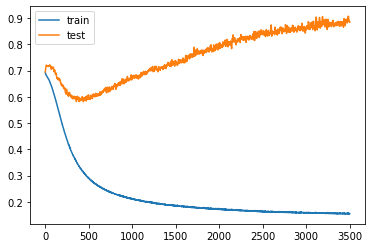
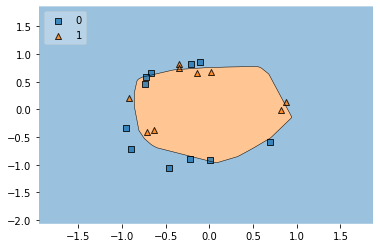

 
## Deep Dive into Early Stopping for Neural Network Training

These notes explore the concept of **Early Stopping**, a crucial technique for improving the training process of neural networks by preventing **overfitting** and saving computational resources.

---

### 1. The Challenge: Overfitting and Choosing the Right Number of Epochs

When training a **Neural Network**, a common question is: "How many **epochs** (passes through the entire training dataset) should I run?"
* Running too few epochs might lead to an **underfit** model that hasn't learned the patterns in the data sufficiently.
* Conversely, running too many epochs can lead to **overfitting**. This is a scenario where the model learns the **training data** *too well*, including its noise and specific quirks.
    * **Significance of Overfitting**: An overfit model will show excellent performance on the training data but will perform poorly on new, unseen data (like **validation data** or **test data**). This means it doesn't generalize well, which is usually the primary goal.
    * The material illustrates this by showing that with a high number of epochs, the **training loss** keeps decreasing, but the **validation loss** (loss on the test set) starts to increase after a certain point. This growing gap is a clear indicator of overfitting.

**Example: Visualizing Overfitting**

The source uses a synthetic dataset, `make_circles`, to demonstrate this.

* **Data Generation & Preparation**:
    ```python
    from sklearn.datasets import make_circles
    from sklearn.model_selection import train_test_split
    import seaborn as sns
    import matplotlib.pyplot as plt

    X, y = make_circles(n_samples=100, noise=0.1, random_state=1)
    # Visualizing the data: sns.scatterplot(X[:,0],X[:,1],hue=y)
    # This would show two intertwined circles of data points from two classes.
    X_train, X_test, y_train, y_test = train_test_split(X, y, test_size=0.20, random_state=2)
    ```
    This creates a dataset that's not linearly separable, suitable for a neural network. A visual would show two concentric circles, each representing a different class.

* **Model Definition**: A simple **Sequential Keras model** is used:
    ```python
    from tensorflow.keras.models import Sequential
    from tensorflow.keras.layers import Dense

    model = Sequential()
    model.add(Dense(256, input_dim=2, activation='relu')) # Hidden layer with 256 neurons, ReLU activation
    model.add(Dense(1, activation='sigmoid'))             # Output layer for binary classification, Sigmoid activation
    ```
    * **Dense Layer**: Each neuron in a dense layer receives input from all neurons in the previous layer.
    * **Activation Functions (`relu`, `sigmoid`)**: These introduce non-linearities, enabling the network to learn complex relationships. **ReLU** (Rectified Linear Unit) is common for hidden layers, while **Sigmoid** is often used for binary classification outputs to produce a probability.

* **Model Compilation**:
    ```python
    model.compile(loss='binary_crossentropy', optimizer='adam', metrics=['accuracy'])
    ```
    * **Loss Function (`binary_crossentropy`)**: Measures the difference between the predicted probabilities and the actual binary labels. The goal of training is to minimize this.
    * **Optimizer (`adam`)**: An efficient algorithm for updating the network's weights during training.
    * **Metrics (`accuracy`)**: Used to evaluate the model's performance.

* **Training for Many Epochs (e.g., 3500) Without Early Stopping**:
    ```python
    # history = model.fit(X_train, y_train, validation_data=(X_test, y_test), epochs=3500, verbose=0)
    ```
    The `verbose=0` argument suppresses epoch-by-epoch output during training in the notebook. The `validation_data` parameter is key, as it allows the model to be evaluated on the test set at the end of each epoch.

* **Loss Visualization (Overfitting)**:
    The material shows a plot of training loss vs. validation loss over epochs:
    ```python
    # plt.plot(history.history['loss'], label='train')
    # plt.plot(history.history['val_loss'], label='test')
    # plt.legend()
    # plt.show()
    
    ```
    
    *(Image Description: A line graph where the x-axis represents epochs and the y-axis represents loss. The training loss (e.g., blue line) steadily decreases. The validation loss (e.g., orange line) initially decreases along with the training loss but then starts to rise after a certain number of epochs, forming a U-shape or an upward trend, while the training loss continues to fall. The point where the validation loss starts to consistently rise indicates the onset of overfitting.)*
    This plot is crucial for identifying overfitting. The ideal point to stop training would be just before the validation loss starts to consistently increase.

* **Decision Boundary (Overfit Model)**: 

    A plot of the **decision boundary** on the test data for the overfit model would show how the model separates the classes. While it might look complex, it may have learned noise from the training data, leading to poorer generalization.
    *(Image Description: A scatter plot of the test data points, colored by class. A line or region is superimposed, representing the model's decision boundary. In an overfit model, this boundary might be overly complex or contorted to fit the training data points, potentially misclassifying some test points that deviate from the training set's noise.)*

---

### 2. The Solution: Early Stopping

**Early Stopping** is a regularization technique that monitors a specified performance metric (e.g., **`val_loss`**) on a validation set and stops the training process if the metric doesn't show improvement for a defined number of consecutive epochs (known as 'patience').

* **Why it's effective**: It prevents the model from continuing to train into the overfitting zone, effectively finding a good balance between underfitting and overfitting. It also saves training time and computational cost.
* In Keras, Early Stopping is implemented as a **Callback**. **Callbacks** are utilities that can be applied at various stages of the model training process (e.g., at the start/end of an epoch, or a batch).

**Implementing Early Stopping in Keras**

1.  **Define the Model and Compile (as before)**: The model architecture and compilation steps remain the same.
    ```python
    # model = Sequential()
    # model.add(Dense(256, input_dim=2, activation='relu'))
    # model.add(Dense(1, activation='sigmoid'))
    # model.compile(loss='binary_crossentropy', optimizer='adam', metrics=['accuracy'])
    ```

2.  **Create an `EarlyStopping` Callback Instance**:
    ```python
    from tensorflow.keras.callbacks import EarlyStopping

    callback = EarlyStopping(
        monitor="val_loss",       # The metric to monitor (e.g., 'val_loss', 'val_accuracy').
        min_delta=0.00001,      # Minimum change in the monitored quantity to qualify as an improvement.
        patience=20,            # Number of epochs with no improvement after which training will be stopped.
        verbose=1,              # Verbosity mode: 1 shows messages when stopping.
        mode="auto",            # 'auto', 'min', or 'max'. 'auto' infers direction (min for loss, max for accuracy).
        baseline=None,          # Baseline value for the monitored quantity.
        restore_best_weights=False # If True, restores model weights from the epoch with the best value of the monitored quantity.
                                  # The material sets this to False, meaning weights from the last epoch before stopping are used.
                                  # Setting to True is often beneficial.
    )
    ```
    * **monitor**: This is the most critical parameter. `val_loss` is common because lower validation loss generally means better generalization.
    * **patience**: This allows the model to continue training for a few more epochs even if there's no immediate improvement, in case the metric improves again after a small plateau or dip.
    * **verbose**: Setting to `1` provides a message when early stopping is triggered.
    * The material notes that `mode="auto"` is generally sufficient as Keras can infer whether to minimize (for loss) or maximize (for accuracy).

3.  **Train the Model with the Callback**:
    ```python
    # history = model.fit(X_train, y_train, validation_data=(X_test, y_test), epochs=3500, callbacks=[callback])
    ```
    The key change is passing the `callback` object to the `callbacks` list in the `model.fit()` method.

**Results with Early Stopping**

* **Reduced Training Time**: The training process will halt much earlier than the specified 3500 epochs. The source material mentions training stopped at **epoch 327** in its example.
    ```
    Epoch 326/3500
    ... - val_loss: 0.5691 - val_accuracy: 0.6500
    Epoch 327/3500
    ... - val_loss: 0.5691 - val_accuracy: 0.6500
    Epoch 327: early stopping
    ```
    This output clearly shows the training being halted by the callback.

* **Improved Generalization (Mitigated Overfitting)**:
    A plot of the training and validation loss with early stopping would show:
    ```python
    # plt.plot(history.history['loss'], label='train')
    # plt.plot(history.history['val_loss'], label='test')
    # plt.legend()
    # plt.show()
    ```
    *(Image Description: A line graph similar to the previous loss plot. However, with early stopping, the training halts much earlier. The validation loss curve (e.g., orange line) is stopped before it significantly increases or just as it might be starting to curve upwards. Both training and validation loss lines end at this earlier epoch.)*
    This visual demonstrates that the model stopped training at a point where validation loss was still low, preventing further overfitting.

* **Decision Boundary (Early Stopped Model)**:
    The decision boundary from the model trained with early stopping is generally expected to be "smoother" or less complex than the overfit one, leading to better performance on unseen data.
    *(Image Description: A scatter plot of the test data points with the decision boundary. Compared to the overfit model's boundary, this one might appear simpler or more generalized, reflecting that the model didn't learn the noise in the training data.)*
    The source suggests that the decision boundary obtained with early stopping is "बिल्कुल सही था और ठीक है रिजल्ट दे रहा था" (was absolutely correct and giving good results).

---

### 3. Key Parameters of `EarlyStopping`

The material highlights several parameters for customizing the `EarlyStopping` callback:

* **`monitor`**: (e.g., `"val_loss"`, `"val_accuracy"`) - The quantity to watch. Crucial for guiding the stopping decision.
* **`min_delta`**: The smallest change in the monitored quantity that counts as an improvement. This helps ignore trivial fluctuations.
* **`patience`**: Number of epochs to wait for improvement before stopping. A higher patience might find a better model if the loss plateaus before dropping further, but also risks overfitting if the plateau is followed by an increase.
* **`verbose`**: `0` for silent, `1` to print a message when stopping occurs.
* **`mode`**: (`"auto"`, `"min"`, `"max"`) - Determines whether training should stop when the monitored quantity stops decreasing (`"min"`) or stops increasing (`"max"`).
* **`baseline`**: Training will stop if the model doesn't show improvement over this baseline value for the monitored quantity.
* **`restore_best_weights`**:
    * If `True`, the model weights are reverted to those from the epoch with the "best" value of the monitored quantity (e.g., lowest `val_loss`). This is often desirable.
    * If `False` (as in the source's example code), the model will have the weights from the last epoch before stopping, which might be `patience` epochs after the best epoch.

---

### 4. Why Early Stopping is Important

* **Automatic Optimal Epoch Selection**: It automates the process of finding a near-optimal number of training epochs, removing guesswork.
* **Prevents Overfitting**: Leads to models that generalize better to new data.
* **Saves Resources**: Reduces unnecessary training time and computational power.
* The material emphasizes that for real-world datasets, you typically don't train for an arbitrarily long time; instead, you rely on mechanisms like early stopping to determine when to stop.

---

### 5. Stimulating Learning Prompts

1.  The `patience` parameter in early stopping allows the training to continue for a set number of epochs even if the monitored metric doesn't show immediate improvement. How might choosing a very small `patience` value versus a very large `patience` value impact both the final model's performance and the overall training efficiency?
2.  While `val_loss` is a common choice for the `monitor` argument, what are the potential benefits or drawbacks of using `val_accuracy` instead, especially in scenarios with imbalanced datasets?
 