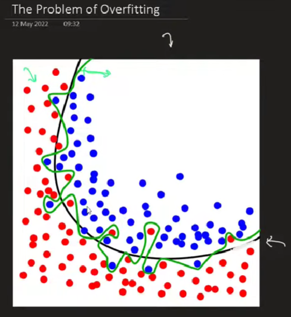
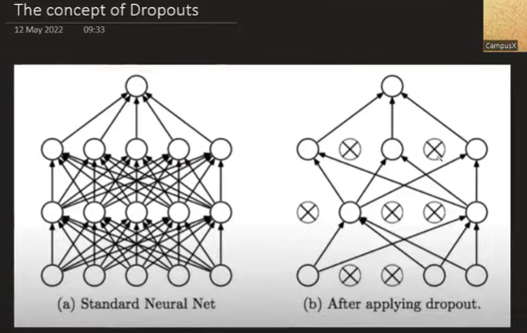
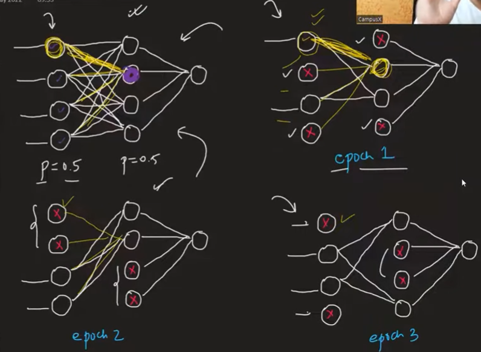

 

### Holistic Deep Dive Summary

The material presents **Dropout** as a crucial technique in the deep learning toolkit for improving a neural network's performance by tackling the pervasive problem of **overfitting**. The session is part of a larger series on deep learning, building upon previously discussed concepts like **Early Stopping** and **Input Normalization**.

The central theme is that neural networks, by virtue of their complex architectures (many layers, many nodes), have a strong tendency to **overfit**. This means they learn to "memorize" the training data, achieving high accuracy on it, but fail to generalize to new, unseen data. The source discusses several established methods for mitigating overfitting:

1.  **Add More Data:** A larger, more diverse dataset forces the model to learn general patterns rather than specific data points.
2.  **Reduce Network Complexity:** Manually simplifying the network by using fewer layers or nodes reduces its capacity to memorize.
3.  **Early Stopping:** Monitoring the model's performance on a validation set and stopping the training process as soon as performance begins to decline.
4.  **Regularization (L1 & L2):** Adding a penalty to the loss function for large weight values.
5.  **Dropout:** The focus of this session, a modern and powerful regularization technique.

**Dropout**, developed by Geoffrey Hinton and Nitish Srivastava, introduces a novel approach. During each training epoch, a random fraction of the network's neurons (in the input and hidden layers) are temporarily "dropped" or deactivated. This means that for every pass of the training data, the model is training a different, "thinned-out" version of the original network. This process forces the network to learn more robust and redundant representations, as it cannot rely on any single neuron to be present. The session concludes by noting that the practical implementation (coding examples) and usage tips will be covered in the next part.

### Key Element Spotlight & Intuition Building

* **Overfitting:** This is the primary problem **Dropout** aims to solve. It occurs when a model learns the training data's noise and details so well that it loses the ability to perform well on new data.
    * **Visual Analogy:** The source describes a classification problem with red and blue dots. An overfitted model creates a highly complex, squiggly boundary that perfectly separates every training dot. In contrast, a better, generalized model (the goal) creates a simpler, smoother boundary that captures the overall trend, even if it misclassifies a few training points.

* **Dropout Mechanism:** This is the core technique. For each training epoch, a predefined percentage of neurons are randomly chosen and ignored. Their output is set to zero for both the forward and backward pass.
    * **Significance & Intuition:** The primary goal is to prevent **co-adaptation** among neurons. In a standard network, a neuron might learn to fix the mistakes of another neuron, or a small group of neurons might become highly specialized for detecting a very specific feature. **Dropout** breaks these dependencies. Since any neuron can disappear at any moment, each neuron is forced to become more robust and learn features that are independently useful.
    * **The Company Analogy:** The material uses a fantastic analogy to build intuition. Consider a company that implements a new policy: every morning, 50% of the staff is randomly selected and told to stay home. In this scenario, an employee (a "neuron") cannot rely on a specific colleague being present. To keep the company functioning, every employee must become more versatile and less dependent on others. This chaos forces robustness and distributed responsibility, much like **Dropout** does in a neural network.

* **Dropout as Ensemble Learning (Analogy to Random Forest):** The source draws a powerful parallel between **Dropout** and the **Random Forest** algorithm.
    * **Random Forest:** Creates an "ensemble" of many different Decision Trees, where each tree is trained on a random subset of the data and/or features. The final prediction is an aggregation (e.g., voting) of all the individual trees' predictions.
    * **Dropout:** Similarly creates an "ensemble" of neural networks. Since a different set of neurons is dropped in each training step, you are effectively training thousands of different, smaller networks that share weights. The source notes that for a network with N neurons that can be dropped, there are `2^N` possible sub-networks.
    * **The Result:** This ensemble approach is a key reason for **Dropout's** success. Averaging the "opinions" of many different models is a proven way to reduce variance and prevent overfitting.

* **Training vs. Testing:** This is a crucial distinction. **Dropout is only active during the training phase.**
    * During the **testing (or inference) phase**, the entire, original network is used with all neurons active.
    * **Weight Scaling:** To ensure the neuron outputs are on the same scale during training and testing, a compensation is made. Since more neurons are active during testing, the output of each neuron would be larger. To counteract this, the weights of the network are scaled down. The source explains this with the formula: `W_test = W_train * (1 - p)`, where `p` is the dropout probability (the fraction of neurons dropped). For example, if the dropout rate `p` is 0.25 (25%), the weights are multiplied by 0.75 during testing. Deep learning frameworks like Keras and PyTorch handle this scaling automatically.

### Visual Aid Integration

* The source describes a diagram showing a fully connected network and then the same network after **Dropout** is applied, where several neurons and their connections are removed. This effectively illustrates the creation of a "thinned" sub-network for a single training step.
* **Suggested Visual:** A flowchart would be helpful to distinguish the process during the Training Phase vs. the Testing Phase.
    * **Training Flow:** Data Input -> Forward Pass (with random neuron dropout) -> Calculate Loss -> Backward Pass (update weights of active neurons) -> Repeat.
    * **Testing Flow:** Data Input -> Forward Pass (with all neurons active and scaled weights) -> Final Prediction.

### Insightful Clarity, Conciseness, and Example Integration

The material does an excellent job of simplifying a complex idea. The core takeaway is that by systematically and randomly "damaging" the network during training, we force it to become stronger and more resilient, much like a muscle grows stronger after being broken down during exercise. The analogies to the randomly absent employees and the Random Forest algorithm are particularly effective at making the concept intuitive.

### Future Topics Mentioned

The speaker explicitly states that the video has become too long and defers the following key topics to the next part of the series:
* **Practical Coding Examples:** Demonstrating how to implement **Dropout** layers for both **regression** and **classification** problems.
* **Practical Tips:** Guidance on when and how to use **Dropout** effectively, likely covering common practices for choosing dropout rates for different layers.

### Stimulating Learning Prompts for Deeper Reflection

1.  The source mentions that **Dropout** reduces the complexity of the network during each training step. How does this temporary reduction in complexity help in preventing the model from "memorizing" the training data?
2.  If **Dropout** forces the network to learn redundant representations (i.e., multiple neurons can detect similar features), could this be seen as inefficient? What is the trade-off here between redundancy and robustness?

[End of Notes]