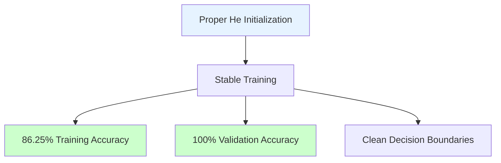
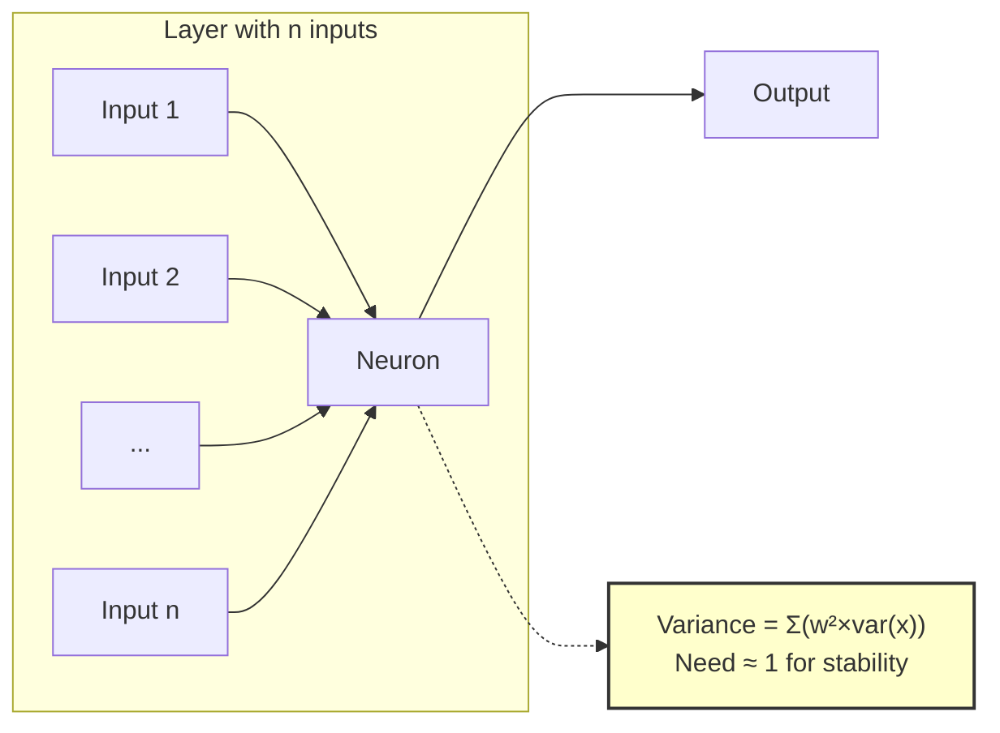

# Weight Initialization Techniques: Xavier and He Initialization

## Overview: The Critical Foundation of Neural Network Training

The material presents **weight initialization** as a fundamental prerequisite for successful neural network training. Poor initialization can completely prevent learning or cause severe training difficulties, while proper initialization enables efficient gradient flow and stable convergence.

## Understanding the Problem Space

### What NOT to Do: Four Common Initialization Mistakes

#### 1. **Zero Initialization** 
- **Problem**: Setting all weights to zero (W = 0)
- **Consequence**: Network fails to learn entirely
- **Why it fails**: 
  - All neurons compute identical outputs
  - Gradients become identical across all weights
  - Network effectively collapses to single neuron behavior
  - No symmetry breaking occurs

#### 2. **Constant Non-Zero Initialization**
- **Example**: Setting all weights to 0.5
- **Problem**: Multiple neurons update identically
- **Consequence**: 
  - Network loses capacity for non-linear learning
  - Acts as a linear model despite having multiple layers
  - 10 neurons in a layer behave as 1 neuron

#### 3. **Very Small Random Weights** (×0.01)
```python
# Example of too small initialization
weights = np.random.randn(250, 10) * 0.01
# Results in range: approximately [-0.03, 0.03]
```
- **Problem**: **Vanishing Gradient Problem**
- **Why it happens**:
  - Small inputs → Even smaller activations through layers
  - Gradients diminish exponentially during backpropagation
  - Extremely slow convergence
  - As shown in notebook: `(np.random.randn(10,10)*0.01).min()` = -0.0154

#### 4. **Very Large Random Weights**
```python
# Example of too large initialization  
weights = np.random.randn(250, 10)  # No scaling
# Results in range: approximately [-3, 3]
```
- **Problem**: **Exploding Gradient Problem**
- **Consequences**:
  - Activation saturation (tanh → ±1, sigmoid → 0 or 1)
  - Gradients become zero in saturated regions
  - No learning in saturated neurons

## The Mathematical Insight: Variance-Based Initialization

The key breakthrough is understanding that initialization must consider the **network architecture**, specifically the number of connections.

```mermaid
flowchart TD
    A[Input: X values in [-1,1] range] --> B[Layer 1: 250 inputs]
    B --> C{Weight Scaling?}
    C -->|Too Small ×0.01| D[Sum ≈ 0<br/>Vanishing Signal]
    C -->|Too Large ×1| E[Sum ≈ ±250<br/>Saturation]
    C -->|Just Right ×1/√n| F[Sum ≈ ±1<br/>Preserved Signal]
    
    style D fill:#ffcccc
    style E fill:#ffcccc
    style F fill:#ccffcc
```

### Core Principle: Maintain Variance Across Layers

Scientists discovered that weights should be initialized such that:
- **Variance of weights = 1/n** (where n = number of inputs to a neuron)
- This maintains signal strength through the network

## Xavier/Glorot Initialization

**Purpose**: Designed for **tanh** and **sigmoid** activation functions

### Mathematical Formulation

#### Xavier Normal
- Distribution: Normal/Gaussian
- **Standard deviation**: σ = √(1/n_in)
- Where n_in = number of inputs to the layer

#### Xavier Uniform  
- Distribution: Uniform
- **Range**: [-limit, +limit]
- Where **limit = √(6/(n_in + n_out))**

### Implementation in Code

```python
# Manual Xavier Normal initialization
# For a layer with 2 inputs
weights = np.random.randn(2, 10) * np.sqrt(1/2)

# For a layer with 10 inputs  
weights = np.random.randn(10, 10) * np.sqrt(1/10)
```

### Keras Implementation
```python
model.add(Dense(10, activation='tanh', kernel_initializer='glorot_normal'))
# or
model.add(Dense(10, activation='tanh', kernel_initializer='glorot_uniform'))
```

## He Initialization 

**Purpose**: Specifically designed for **ReLU** and its variants

### Why Different from Xavier?

ReLU's key characteristic: It zeros out negative values
- This effectively halves the variance of activations
- He initialization compensates with a factor of 2


### Mathematical Formulation

#### He Normal
- **Standard deviation**: σ = √(2/n_in)
- Doubles the variance compared to Xavier

#### He Uniform
- **Range**: [-limit, +limit]  
- Where **limit = √(6/n_in)**

## Practical Implementation and Results

### Dataset and Model Architecture

The notebook demonstrates these concepts using:
- **Dataset**: U-shaped binary classification problem
- **Architecture**: 4 hidden layers with 10 neurons each

```python
# Data visualization
plt.scatter(df['X'], df['Y'], c=df['class'])
```
*(The scatter plot shows a U-shaped pattern with two classes)*

### Model Definition with He Initialization

```python
model = Sequential()
model.add(Dense(10, activation='relu', input_dim=2, kernel_initializer='he_normal'))
model.add(Dense(10, activation='relu', kernel_initializer='he_normal'))
model.add(Dense(10, activation='relu', kernel_initializer='he_normal'))
model.add(Dense(10, activation='relu', kernel_initializer='he_normal'))
model.add(Dense(1, activation='sigmoid'))
```

**Model Summary Output:**
```
Total params: 371
Trainable params: 371
Non-trainable params: 0
```

### Weight Distribution After Initialization

The notebook shows initial weights after He initialization:
```python
# First layer weights (2 inputs → 10 neurons)
[[ 0.9634355 ,  2.008911  , -0.34264505, ...],
 [-0.16728629,  1.4618363 , -0.8058679 , ...]]
```
Note the larger range due to He initialization scaling.

### Manual Weight Initialization Example

```python
# Manual implementation of similar initialization
initial_weights[0] = np.random.randn(2,10) * np.sqrt(1/2)    # ~0.707 scaling
initial_weights[2] = np.random.randn(10,10) * np.sqrt(1/10)  # ~0.316 scaling
initial_weights[4] = np.random.randn(10,10) * np.sqrt(1/10)  # ~0.316 scaling
```

### Training Results

```python
history = model.fit(X, y, epochs=100, validation_split=0.2)
```

**Training Progress Highlights:**
- **Epoch 1**: loss: 1.7058, accuracy: 50.00%
- **Epoch 30**: loss: 0.6415, accuracy: 72.50%
- **Epoch 50**: loss: 0.4790, accuracy: 86.25%
- **Epoch 100**: loss: 0.3233, accuracy: 86.25%, val_accuracy: **100%**

### Visualization of Results

The decision boundary plot shows:
- Clean separation of the U-shaped classes
- No signs of overfitting or underfitting
- Smooth, well-defined decision boundaries



## Key Insights and Guidelines

### Activation Function → Initialization Mapping

| **Activation Function** | **Recommended Initialization** | **Scaling Factor** |
|------------------------|--------------------------------|-------------------|
| Tanh, Sigmoid          | Xavier/Glorot                  | √(1/n)           |
| ReLU, Leaky ReLU       | He                            | √(2/n)           |
| SELU                   | LeCun                         | √(1/n)           |

### Why These Methods Work

1. **Variance Preservation**: Maintains signal strength across layers
2. **Gradient Flow**: Prevents vanishing/exploding gradients
3. **Architecture Awareness**: Scales with network connectivity

### Default Keras Behavior

- **Important Note**: Keras uses **Glorot Uniform** by default
- This may not be optimal for ReLU networks
- Always explicitly specify initialization for ReLU

## Mathematical Intuition Visualized



For n inputs with unit variance:
- Each weight ~ N(0, 1/n)
- Sum of n such weighted inputs has variance ≈ 1
- Signal magnitude preserved through layers

## Experimental Validation

The notebook demonstrates that proper initialization leads to:

1. **Fast Initial Learning**: Loss drops from 1.70 to 0.64 in 30 epochs
2. **Stable Convergence**: Smooth decrease in loss throughout training
3. **Excellent Generalization**: 100% validation accuracy achieved
4. **No Gradient Issues**: Consistent learning rate throughout

## Reflection Questions

1. **Why does the factor of 2 in He initialization matter?** 
   - Consider: If ReLU zeros half the values, how does this affect the expected value and variance of the output?

2. **What happens in very deep networks (100+ layers)?**
   - How might residual connections change initialization requirements?

3. **Why not just use batch normalization everywhere?**
   - What are the trade-offs between good initialization and normalization layers?

## Summary

Weight initialization is not merely a technical detail but a **fundamental requirement** for deep learning success. The experiments clearly demonstrate:

- **Without proper initialization**: Networks may not train at all
- **With proper initialization**: Fast convergence and excellent performance
- **Key principle**: Match initialization to activation function
- **In practice**: Always explicitly set initialization, don't rely on defaults

The journey from problematic initialization (zero, constant, too small/large) to sophisticated methods (Xavier, He) represents a crucial advancement in making deep learning practical and reliable.

[End of Notes]