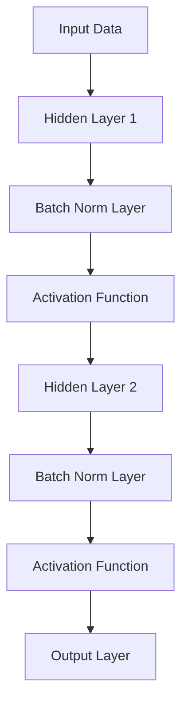
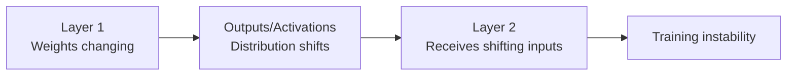
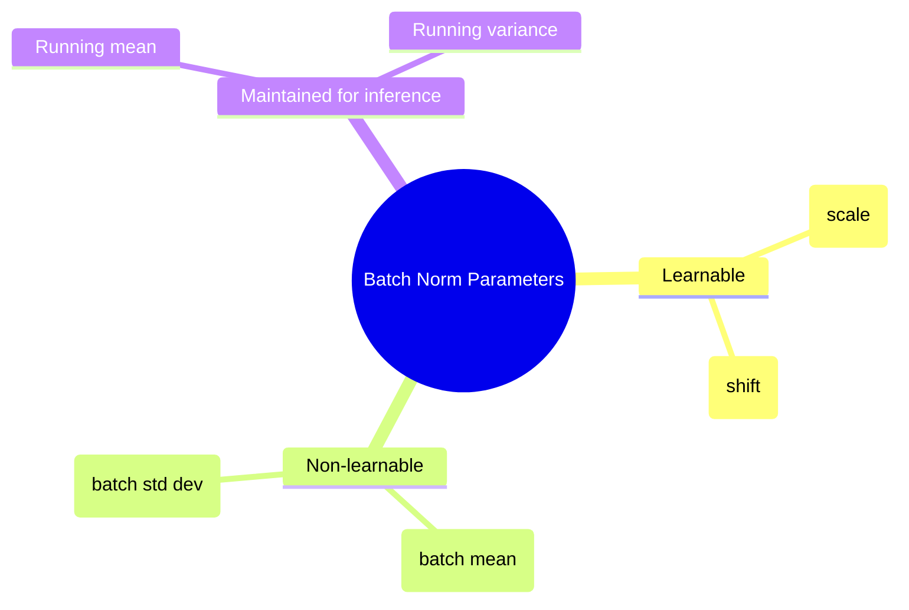

# Batch Normalization in Deep Learning

## Overview
Batch Normalization is a technique that significantly **speeds up neural network training** and makes it **more stable**. Introduced in 2015, it has become a crucial component in modern deep learning architectures by addressing the **internal covariate shift** problem.

## Core Concept & Definition

### What is Batch Normalization?
• **Batch Normalization (BN)** is an algorithmic method that normalizes the activation vectors from hidden layers using the mean and variance of the current batch
• The normalization step is applied either **right before** or **right after** the non-linear activation function
• It ensures that inputs to each layer have a **mean of 0** and **standard deviation of 1**, similar to how we normalize input data

### Visual Representation of the Process:



## Why Do We Need Batch Normalization?

### Reason 1: Input Normalization Analogy
• Just as normalizing input features helps with training stability, normalizing activations between layers provides similar benefits
• **Un-normalized data** creates elongated cost function contours, requiring lower learning rates
• **Normalized data** creates more uniform cost function contours, allowing higher learning rates and faster convergence

### Reason 2: Internal Covariate Shift

#### Understanding Covariate Shift
**Covariate shift** occurs when the distribution of input data changes between training and testing, even if the input-output relationship remains the same.

Example: Training a model to distinguish roses from other flowers using only red roses, but testing with roses of all colors.

#### Internal Covariate Shift
**Internal covariate shift** is the change in the distribution of network activations due to changing parameters during training.



Think of it like a game of "telephone" - as information passes through layers with constantly changing weights, the distribution of activations keeps shifting, making it difficult for later layers to learn effectively.

## How Batch Normalization Works

### Training Phase Steps:

1. **Calculate weighted sum (z)**: 
   ```
   z = Σ(wi * xi) + b
   ```

2. **Normalize using batch statistics**:
   ```
   μ = (1/m) * Σ(zi)  [Batch mean]
   σ² = (1/m) * Σ((zi - μ)²)  [Batch variance]
   ẑi = (zi - μ) / √(σ² + ε)  [Normalized value]
   ```
   Where ε is a small constant (e.g., 10^-8) to prevent division by zero

3. **Scale and shift**:
   ```
   yi = γ * ẑi + β
   ```
   Where **γ (gamma)** and **β (beta)** are learnable parameters

4. **Apply activation function**:
   ```
   ai = activation(yi)
   ```

### Detailed Example Walkthrough:

Consider a simple network with:
• Input: 2 features (CGPA, IQ)
• Hidden layer: 2 neurons
• Batch size: 4

**Step-by-step process for one neuron:**

1. **Forward pass for batch of 4 samples**:
   - Calculate z₁ for all 4 samples
   - Results in a 4×1 vector of pre-activations

2. **Compute batch statistics**:
   ```
   μ = (z₁¹ + z₁² + z₁³ + z₁⁴) / 4
   σ² = Σ((z₁ⁱ - μ)²) / 4
   ```

3. **Normalize each sample**:
   ```
   ẑ₁ⁱ = (z₁ⁱ - μ) / √(σ² + ε)
   ```

4. **Apply learnable transformation**:
   ```
   y₁ⁱ = γ₁ * ẑ₁ⁱ + β₁
   ```

**Important**: Each neuron has its own γ and β parameters!

### Key Implementation Details:

• **Batch-wise operation**: Works with mini-batch gradient descent
• **Layer-by-layer basis**: Applied independently to each layer
• **Per-neuron parameters**: Each neuron has its own γ and β parameters
• **Optional application**: Can be applied to some layers but not others
• **Backpropagation**: During backprop, gradients flow through BN layer and update γ and β just like weights

### Parameter Summary:



## Inference/Testing Phase

During inference, batch statistics aren't available (single sample prediction). Solution:
• Use **exponentially weighted moving averages** of mean and variance calculated during training
• These running statistics are updated during training and frozen during inference

### How Running Statistics Work:
1. During training, maintain running averages:
   - After batch 1: μ₁, σ₁²
   - After batch 2: μ₂, σ₂²
   - ...
   - After batch 25: μ₂₅, σ₂₅²

2. Update using exponential moving average:
   ```
   running_mean = momentum * running_mean + (1 - momentum) * batch_mean
   running_var = momentum * running_var + (1 - momentum) * batch_var
   ```

3. During inference, use the final running statistics for normalization

## Advantages of Batch Normalization

### 1. **More Stable Training**
• Allows wider range of hyperparameter values
• Less sensitive to weight initialization
• Can use higher learning rates

### 2. **Faster Training**
• Significantly reduces training time
• Achieves same accuracy in fewer epochs
• Example from the material: 60% accuracy achieved in ~20 epochs with BN vs ~80 epochs without

### 3. **Regularization Effect**
• Adds slight noise due to batch-wise calculations
• Helps reduce overfitting (though not as strong as dropout)
• Acts as a mild regularizer

### 4. **Reduces Importance of Weight Initialization**
• Makes the optimization landscape more uniform
• Less critical to have perfect initial weights

## Implementation in Keras

Implementing batch normalization in Keras is straightforward:

```python
from tensorflow.keras.layers import BatchNormalization, Dense
from tensorflow.keras.models import Sequential

# Without Batch Normalization
model_without_bn = Sequential([
    Dense(3, activation='relu', input_shape=(2,)),
    Dense(2, activation='relu'),
    Dense(1, activation='sigmoid')
])

# With Batch Normalization
model_with_bn = Sequential([
    Dense(3, activation='relu', input_shape=(2,)),
    BatchNormalization(),  # Add after Dense layer
    Dense(2, activation='relu'),
    BatchNormalization(),  # Add after Dense layer
    Dense(1, activation='sigmoid')  # No BN after output layer
])
```

### Parameter Count Example:
For a BatchNormalization layer after a Dense layer with n units:
• **Total parameters**: 4n
• **Trainable parameters**: 2n (γ and β)
• **Non-trainable parameters**: 2n (running mean and variance)

### Real Example from the Material:
• Dense layer with 3 units → BatchNorm adds 12 parameters (6 trainable, 6 non-trainable)
• Dense layer with 2 units → BatchNorm adds 8 parameters (4 trainable, 4 non-trainable)

## Key Insights & Best Practices

• **Flexibility through learnable parameters**: The γ and β parameters allow the network to learn whether normalization is beneficial for each specific case
• **Not always necessary**: The network can "undo" normalization if needed by learning appropriate γ and β values (if γ = σ and β = μ, the normalization is effectively cancelled)
• **Placement matters**: Typically applied before activation functions, though after activation is also used
• **Don't apply to output layer**: Usually not applied to the final output layer
• **Initial values**: γ is initialized to 1 and β to 0 in Keras

## Why Scale and Shift After Normalizing?

This seems counterintuitive - why normalize just to scale and shift again? The reason is **flexibility**:

• Sometimes the network needs normalized inputs (mean=0, std=1)
• Sometimes it performs better with a different distribution
• The learnable γ and β parameters let the network decide what's optimal
• If normalization isn't helpful, the network can learn to "undo" it

## Experimental Results

The material demonstrates significant improvements with batch normalization using the **Concentric Circles dataset** (a difficult classification problem):

• **Without BN**: ~80 epochs to reach 60% accuracy
• **With BN**: ~20 epochs to reach 60% accuracy
• Training loss converges faster and more smoothly with batch normalization

### Dataset Details:
• **Concentric Circles**: A challenging 2D classification dataset where classes are arranged in concentric circles
• Known to be difficult for neural networks due to the non-linear decision boundary
• Perfect test case for demonstrating BN's effectiveness on complex problems

## Common Misconceptions

1. **BN is not just for regularization**: While it has a mild regularizing effect, its primary purpose is to stabilize and speed up training
2. **BN doesn't replace other techniques**: You still need dropout and other regularization methods
3. **Batch size matters**: Very small batch sizes can make BN less effective since batch statistics become unreliable

## Thought-Provoking Questions

1. **When might batch normalization be harmful?** Consider cases with very small batch sizes or when the batch statistics don't represent the full data distribution well.

2. **How does batch normalization interact with other regularization techniques?** Should you reduce dropout when using batch normalization, given its mild regularizing effect?

3. **What happens during fine-tuning?** When fine-tuning a pre-trained model, should you update the batch normalization statistics or keep them frozen?

[End of Notes]