# Introduction to Optimizers in Deep Learning

## Overview
This material introduces **optimization algorithms** as the fourth crucial technique for speeding up neural network training, following weight initialization, batch normalization, and activation functions. **Optimizers** are essential for efficiently finding optimal parameters in neural networks, addressing fundamental limitations of basic gradient descent that can severely impact training speed and solution quality.

## The Role of Optimizers in Neural Networks

### Neural Network Parameter Optimization
Neural networks require finding optimal values for **weights (W)** and **biases (b)** that minimize the loss function. This optimization process involves:

• **Parameter space navigation**: Finding optimal values among potentially millions of parameters
• **Loss minimization**: Reducing the difference between predicted and actual outputs
• **Convergence to global minimum**: Reaching the best possible solution in the parameter space

### Mathematical Foundation
The core optimization objective can be expressed as:
```
minimize L(W, b) = Loss_function(y_predicted, y_actual)
```

Where the **standard gradient descent update rule** is:
```
W_new = W_old - α × ∇L/∇W
b_new = b_old - α × ∇L/∇b
```

### Visual Representation of the Optimization Landscape


This diagram illustrates the iterative process of parameter optimization, where we start from random values and gradually improve them until convergence.

## Types of Gradient Descent (Review)

### 1. **Batch Gradient Descent**
• Processes **entire dataset** before updating parameters
• **Stability**: More stable gradients but computationally expensive
• **Update frequency**: Once per epoch

### 2. **Stochastic Gradient Descent (SGD)**
• Processes **one sample** at a time
• **Speed**: Faster updates but noisier gradients
• **Update frequency**: After every sample

### 3. **Mini-batch Gradient Descent**
• Processes **small batches** of data (e.g., 32, 64, 128 samples)
• **Balance**: Compromise between stability and speed
• **Most common**: Widely used in practice


## Five Critical Problems with Basic Gradient Descent

### Problem 1: **Learning Rate Selection Challenge**

**Core Issue**: Determining the optimal learning rate (α) is extremely difficult and critical for performance.

**Consequences**:
• **Too small α**: Painfully slow convergence, may never reach optimum
• **Too large α**: Overshooting, unstable training, divergence
• **Fixed α**: Cannot adapt to different phases of training

**Interactive Example**: The material demonstrates this using Google's playground where:
- α = 0.01: Extremely slow progress with message "Gradient descent taking too long"
- α = 1.0: Overshooting and oscillation around minimum
- α = 0.1: Balanced approach reaching minimum efficiently

### Problem 2: **Learning Rate Scheduling Limitations**

**Attempted Solution**: **Learning rate scheduling** - automatically reducing learning rate during training

**Remaining Problems**:
• **Pre-defined schedules**: Must be set before training begins
• **Dataset independence**: Same schedule may not work across different datasets
• **Lack of adaptivity**: Cannot respond to actual training dynamics

### Problem 3: **Uniform Learning Rate Constraint**

**Critical Limitation**: All parameters share the same learning rate

```mermaid
flowchart LR
    A[Parameter W1] --> C[Same Learning Rate α]
    B[Parameter W2] --> C
    D[Parameter W3] --> C
    E[Parameter Wn] --> C
    
    C --> F[May not be optimal for all parameters]
```



**Why This Matters**:
• Different parameters may need different update magnitudes
• Some directions in parameter space may require faster/slower movement
• **Analogy**: Like forcing a hiker to take same-sized steps in all directions when descending a mountain

### Problem 4: **Local Minima Trapping**

**The Challenge**: Complex neural network loss landscapes contain multiple minima

```mermaid
graph LR
    A[Starting Point] --> B[Local Minimum 1]
    A --> C[Local Minimum 2]
    A --> D[Global Minimum ⭐]
    
    style D fill:#90EE90
    style B fill:#FFB6C1
    style C fill:#FFB6C1
```



**Consequences**:
• Algorithm gets **stuck in suboptimal solutions**
• **Gradient becomes zero** at local minima, stopping progress
• **Stochastic GD** has slightly better escape potential due to noise

### Problem 5: **Saddle Point Paralysis**

**Saddle Point Definition**: Points where slope increases in one direction and decreases in another

**Mathematical Characteristics**:
• **Gradient ≈ 0** in all directions
• **Not a minimum or maximum**
• Creates **flat regions** where training stagnates

**Impact on Training**:
• **Parameter updates become minimal** (since gradient ≈ 0)
• **Training appears to stop** without reaching optimum
• **More problematic** in high-dimensional spaces


## The Solution: Advanced Optimizers

### Next-Generation Optimization Algorithms

The material introduces five advanced optimizers that address these fundamental problems:

1. **Momentum** - Addresses oscillation and local minima issues
2. **AdaGrad** - Provides adaptive learning rates per parameter
3. **RMSProp** - Improves upon AdaGrad's limitations
4. **Adam** - Combines best features of multiple approaches (most popular)
5. **Exponentially Weighted Moving Averages** - Foundational concept for understanding advanced optimizers

### Why These Optimizers Work Better

**Key Innovations**:
• **Adaptive learning rates**: Different rates for different parameters
• **Momentum-based approaches**: Overcome local minima and saddle points
• **Historical gradient information**: Learn from past updates
• **Automatic parameter tuning**: Reduce hyperparameter sensitivity

## Foundational Research Papers

### **Adam Optimizer (2014)** 📄
**Authors**: Diederik P. Kingma & Jimmy Ba  
**Paper**: "Adam: A Method for Stochastic Optimization"  
**Venue**: ICLR 2015  
**ArXiv**: https://arxiv.org/abs/1412.6980

**Key Contributions**:
• Combines adaptive learning rates with momentum
• Computationally efficient with minimal memory requirements
• Robust across diverse problem types and datasets
• **Most widely used optimizer** in modern deep learning

### **AdaGrad (2011)** 📄
**Authors**: John Duchi, Elad Hazan, Yoram Singer  
**Paper**: "Adaptive Subgradient Methods for Online Learning and Stochastic Optimization"  
**Venue**: Journal of Machine Learning Research  

**Key Innovation**:
• First **per-parameter adaptive learning rate** method
• Accumulates squared gradients to adapt learning rates
• Particularly effective for sparse data

### **RMSProp (2012)** 📄
**Authors**: Tijmen Tieleman & Geoffrey Hinton  
**Source**: Coursera Neural Networks Course, Lecture 6.5  

**Key Improvement**:
• **Exponential decay** of squared gradient accumulation
• Prevents learning rate from decreasing too aggressively
• Inspired many subsequent optimizers

### **Momentum (1986)** 📄
**Historical Note**: Momentum was introduced in the 1980s as an early enhancement to SGD, helping overcome oscillations and local minima through velocity-based updates.

## Practical Implications

### Current Best Practices

**Adam as Default Choice**:
• **Recommended** as default optimizer for most applications
• **Robust performance** across various architectures and datasets
• **Fewer hyperparameters** to tune compared to alternatives
• **Faster convergence** than basic gradient descent

**When to Consider Alternatives**:
• **Very large datasets**: SGD with momentum might be preferred
• **Specific architectures**: Some models benefit from specialized optimizers
• **Resource constraints**: Simpler optimizers may be necessary

## Upcoming Learning Path

### **Prerequisites for Understanding Advanced Optimizers**
The material emphasizes that **Exponentially Weighted Moving Averages** must be understood first, as this concept is fundamental to:
• RMSProp implementation
• Adam optimizer mechanics
• AdaGrad's gradient accumulation
• Momentum calculations

### **Learning Sequence**
1. **Next Video**: Exponentially Weighted Moving Averages
2. **Following Videos**: Individual optimizer deep-dives
3. **Implementation**: Practical coding examples
4. **Comparison**: Performance analysis across different scenarios

## Key Insights & Connections

### **Why Standard Gradient Descent Fails**
The five problems identified aren't just theoretical limitations—they represent **fundamental barriers** to efficient deep learning:

• **Optimization is inherently high-dimensional**: Modern networks have millions of parameters
• **Loss landscapes are non-convex**: Multiple minima and saddle points are inevitable
• **One-size-fits-all approaches fail**: Different parameters need different treatment

### **The Evolution of Optimization**
Understanding this progression reveals how the field has evolved:
```
Basic GD → Learning Rate Scheduling → Adaptive Methods → Modern Optimizers
```

Each step addressed specific limitations while introducing new capabilities.

## Thought-Provoking Questions

1. **Generalization vs. Optimization**: If Adam converges faster to minima, does this always lead to better generalization on test data? What's the relationship between optimization speed and model generalization?

2. **Hyperparameter Sensitivity**: While advanced optimizers reduce sensitivity to learning rate selection, they introduce new hyperparameters (β₁, β₂ in Adam). Have we truly simplified the optimization process, or just shifted the complexity?

3. **Computational Trade-offs**: Advanced optimizers require additional memory to store moving averages and historical information. In resource-constrained environments, when might simpler optimizers be preferable despite their limitations?

[End of Notes]