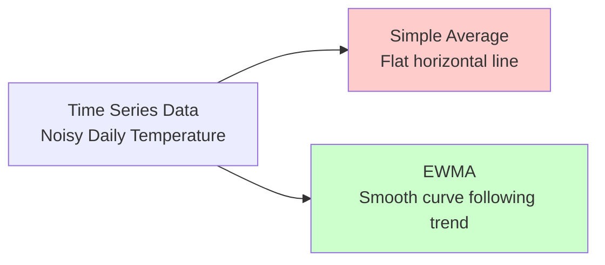
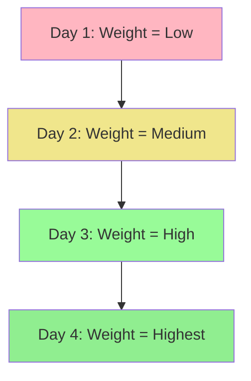
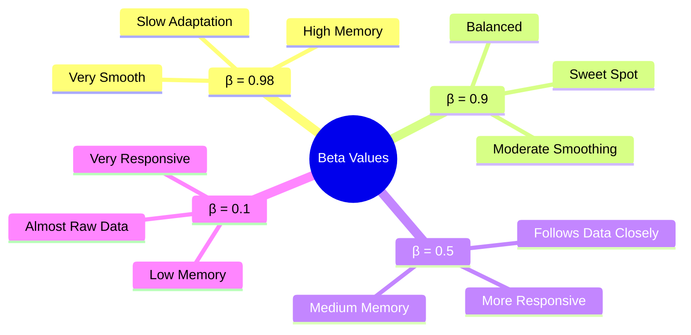
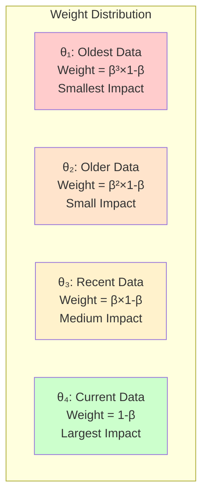
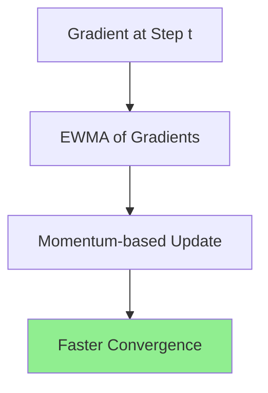

# Exponentially Weighted Moving Averages (EWMA)

## Overview
**Exponentially Weighted Moving Averages (EWMA)** is a fundamental statistical technique that serves as the mathematical foundation for advanced optimizers in deep learning. This method identifies trends in time series data by giving more weight to recent observations while gradually reducing the influence of older data points—a principle that proves crucial for momentum-based optimization algorithms.

## Core Concept & Definition

### What is EWMA?
**EWMA** is a technique used to find trends in time series-based data where:
• **Recent data points** receive higher weights than older ones
• **Weights decay exponentially** as data becomes older
• The result is a **smooth curve** that closely follows the underlying trend without getting lost in noise

### Visual Representation of EWMA vs Simple Average:



The material demonstrates this with temperature data where:
• **Gray line**: Simple mathematical average (flat)
• **Black line**: EWMA curve that adapts to the data trend

## Applications of EWMA

### Diverse Domain Usage
• **Time Series Forecasting**: Predicting future values based on historical trends
• **Financial Forecasting**: Stock price trend analysis and prediction
• **Signal Processing**: Noise reduction and signal smoothing
• **Deep Learning**: Foundation for advanced optimizers (Momentum, Adam, RMSProp)

### Connection to Deep Learning Optimizers
The material emphasizes that EWMA will be used in the next video on **Momentum optimization**, demonstrating how this statistical concept becomes the backbone of modern neural network training algorithms.

## Mathematical Foundation

### The EWMA Formula
```
v_t = β × v_{t-1} + (1 - β) × θ_t
```

Where:
• **v_t**: EWMA value at time t
• **β (beta)**: Smoothing parameter (0 < β < 1)
• **v_{t-1}**: Previous EWMA value
• **θ_t**: Current observation at time t

### Initial Condition
• **v_0 = 0** (commonly used initialization)
• Alternative: **v_0 = θ_0** (set to first observation)

## Two Fundamental Principles of EWMA

### Principle 1: **Recency Weighting**
**Recent observations receive higher weights than older ones**



### Principle 2: **Temporal Decay**
**Any point's weight decreases over time as new data arrives**

As new observations are added, the influence of older data points diminishes exponentially, ensuring the moving average stays responsive to recent changes.

## The Beta Parameter: Controlling Memory

### Mathematical Intuition
The material provides a crucial insight:
```
EWMA ≈ Average of last (1/(1-β)) observations
```

**Examples**:
• β = 0.9 → Averages approximately last **10 days** (1/(1-0.9) = 10)
• β = 0.5 → Averages approximately last **2 days** (1/(1-0.5) = 2)
• β = 0.98 → Averages approximately last **50 days** (1/(1-0.98) = 50)

### Visual Impact of Beta Values

The material demonstrates four different beta values on the same dataset:



### Behavioral Analogies
• **High β (0.98)**: A **conservative person** who considers long-term history before making decisions
• **Low β (0.1)**: A **moody person** who reacts immediately to current circumstances

## Mathematical Proof: Why Recent Data Gets More Weight

### Expanding the EWMA Formula

Starting from the basic formula, let's trace how weights are distributed:

**Step 1**: v₁ = (1-β) × θ₁

**Step 2**: v₂ = β × v₁ + (1-β) × θ₂
```
v₂ = β(1-β)θ₁ + (1-β)θ₂
```

**Step 3**: v₃ = β × v₂ + (1-β) × θ₃
```
v₃ = β²(1-β)θ₁ + β(1-β)θ₂ + (1-β)θ₃
```

**Step 4**: v₄ = β × v₃ + (1-β) × θ₄
```
v₄ = β³(1-β)θ₁ + β²(1-β)θ₂ + β(1-β)θ₃ + (1-β)θ₄
```

### Weight Distribution Pattern

The weights assigned to each observation in the EWMA calculation:

| Observation | Weight | Relative Size |
|------------|---------|---------------|
| θ₁ (oldest) | β³(1-β) | Smallest weight |
| θ₂ | β²(1-β) | Small weight |
| θ₃ | β(1-β) | Medium weight |
| θ₄ (newest) | (1-β) | Largest weight |



**Key Insight**: Since 0 < β < 1, we have β³ < β² < β < 1, proving that more recent observations (θ₄) receive exponentially higher weights than older ones (θ₁).

## Practical Implementation

### Python Implementation Example

The material demonstrates EWMA calculation using pandas:

```python
import pandas as pd
import matplotlib.pyplot as plt

# Load daily climate data
data = pd.read_csv('daily_climate_data.csv')
# Columns: Date, Mean_Temperature

# Calculate EWMA using pandas
alpha = 0.1  # α = 1 - β
data['EWMA'] = data['Mean_Temperature'].ewm(alpha=alpha).mean()

# Relationship between α and β
# α = 1 - β
# If α = 0.1, then β = 0.9
```

### Parameter Conversion
**Important**: Different libraries use different parameter conventions:
• **α (alpha)** in pandas = **1 - β**
• If β = 0.9, then α = 0.1
• Both represent the same EWMA behavior

## Deep Learning Connection

### Why EWMA Matters for Optimizers

**EWMA provides the mathematical foundation for**:

1. **Momentum**: Uses EWMA of gradients to accelerate convergence
2. **Adam**: Combines EWMA of gradients and squared gradients
3. **RMSProp**: Uses EWMA of squared gradients for adaptive learning rates

### The Optimization Analogy


Just as EWMA smooths noisy time series data, it helps optimizers:
• **Smooth out noisy gradients**
• **Maintain direction consistency**
• **Accelerate through flat regions**
• **Reduce oscillations around minima**

## Practical Considerations

### Choosing the Right Beta
• **β = 0.9**: Most common choice in deep learning optimizers
• **High β (0.95-0.99)**: For very noisy data requiring strong smoothing
• **Low β (0.1-0.5)**: For rapidly changing environments requiring quick adaptation

### Sweet Spot Analysis
The material emphasizes that **β = 0.9** represents a **sweet spot** because:
• Provides reasonable smoothing without excessive lag
• Maintains responsiveness to genuine trend changes
• Works well across diverse optimization scenarios

## Key Insights & Best Practices

### **Understanding the Trade-off**
EWMA represents a fundamental trade-off in sequential data analysis:
• **Higher β**: More stable but less responsive
• **Lower β**: More responsive but potentially noisy

### **Initialization Strategy**
• **v₀ = 0**: Simple and commonly used
• **v₀ = θ₀**: Can reduce initial bias
• In practice, the initialization effect diminishes quickly

### **Connection to Optimization Theory**
EWMA embodies a key principle in optimization: **leveraging historical information while staying adaptive to current conditions**—exactly what effective neural network training requires.

## Preparation for Advanced Optimizers

### What's Next
With EWMA understanding established, the upcoming videos will demonstrate how this concept enables:
• **Momentum optimization**: Using EWMA of gradients
• **Adaptive learning rates**: Using EWMA of squared gradients  
• **Second-moment estimation**: Combining multiple EWMA calculations

### Foundation for Understanding
Every advanced optimizer builds upon EWMA principles:
```
EWMA → Momentum → RMSProp → Adam
```

This progression shows how a simple statistical concept evolves into sophisticated optimization algorithms.

## Thought-Provoking Questions

1. **Bias vs. Variance Trade-off**: How does the choice of β affect the bias-variance trade-off in trend estimation? When might a higher bias (higher β) actually be preferable?

2. **Real-time vs. Batch Processing**: In streaming data scenarios, how might the computational efficiency of EWMA (O(1) per update) make it preferable to other smoothing techniques that require storing historical data?

3. **Optimization Landscape**: If EWMA helps smooth noisy gradients in optimization, could there be scenarios where some noise is actually beneficial for escaping local minima? How do we balance smoothing with exploration?

[End of Notes]