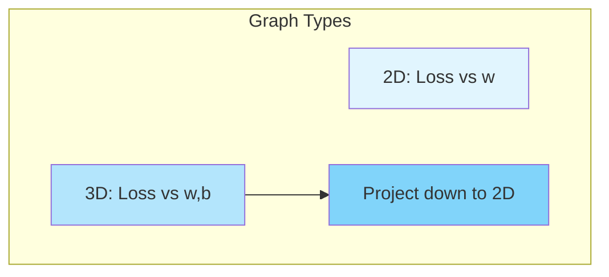
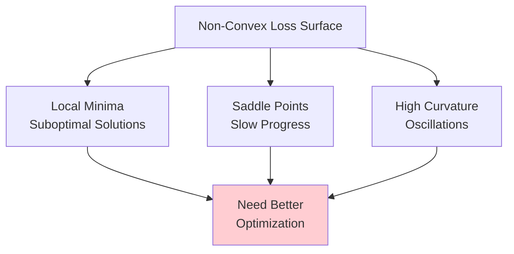
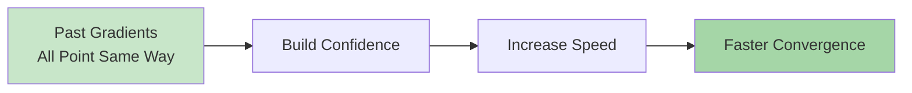
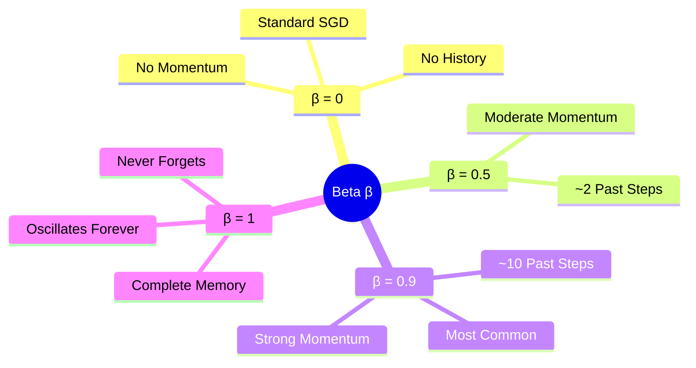
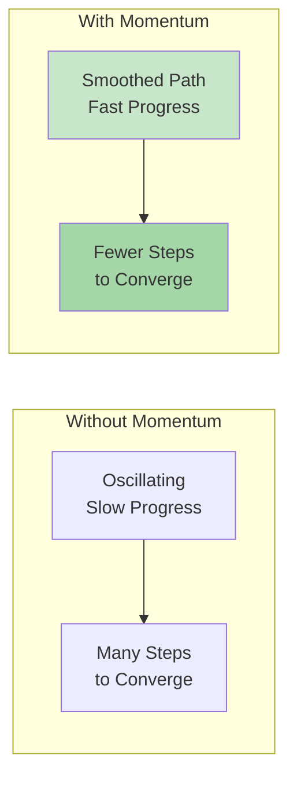
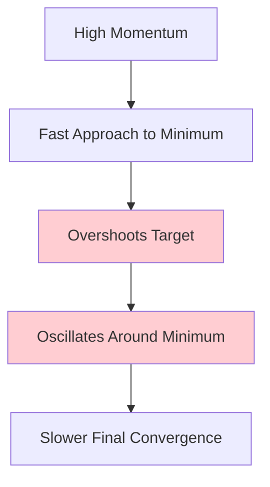

# Momentum Optimization in Deep Learning

## Overview
**Momentum optimization** is a crucial enhancement to standard gradient descent that significantly **speeds up neural network training** and improves convergence properties. By incorporating the concept of **physical momentum**, this technique helps navigate complex loss landscapes more effectively, overcoming limitations of vanilla gradient descent in non-convex optimization scenarios.

## Foundation: Understanding Graph Types in Optimization

### Three Types of Visualization

Before diving into momentum, it's essential to understand the three types of graphs used throughout optimization discussions:

1. **2D Loss vs Single Parameter**: Shows how loss changes with respect to one weight parameter
2. **3D Loss Surface**: Displays loss as a function of two parameters (w and b)
3. **Contour Plot**: Top-down view of the 3D surface, using color to represent height



### Color Conventions in Contour Plots

Understanding contour plots is crucial for visualizing optimization behavior. These plots represent **3D loss surfaces projected onto 2D**, where colors encode the third dimension (loss values).

#### Standard Color Schemes
• **Red/Warm Colors**: High loss values (regions to avoid)
• **Blue/Cool Colors**: Low loss values (target regions)  
• **Color Gradient**: Red → Orange → Yellow → Green → Blue (High → Low loss)

#### Contour Line Interpretation
• **Contour lines**: Connect points of **equal loss value**
• **Closely spaced contours**: **Steep gradients** (rapid loss change)
• **Widely spaced contours**: **Gentle slopes** (gradual loss change)
• **Contour density**: Indicates the **steepness** of the loss landscape


#### Reading Optimization Paths
• **Arrows on contours**: Show gradient descent trajectory
• **Step size variation**: Larger steps in steep regions, smaller steps in flat regions
• **Path direction**: Always perpendicular to contour lines (steepest descent)

#### Practical Insights from Contour Analysis
When analyzing momentum vs SGD on contour plots:

1. **Flat Red Regions** (High Loss):
   - SGD takes tiny, cautious steps
   - Momentum maintains velocity and crosses faster

2. **Steep Transitions** (Dense Contours):
   - SGD can overshoot and oscillate
   - Momentum builds appropriate speed

3. **Blue Valleys** (Low Loss):
   - SGD settles quickly but may get trapped
   - Momentum might overshoot but finds better minima

## Non-Convex Optimization: The Core Challenge

### Why Neural Networks are Difficult to Optimize

Deep neural networks present **non-convex optimization** problems, characterized by:

1. **Local Minima**: Multiple valleys where gradients become zero
2. **Saddle Points**: Regions that curve up in one direction and down in another
3. **High Curvature**: Sharp bends and narrow valleys in the loss landscape



### Problems Momentum Solves

1. **Consistent Gradients with Low Magnitude**: When slopes change slowly, standard gradient descent moves painfully slowly
2. **Noisy Gradients**: Oscillating gradients that cause zigzag behavior
3. **Escaping Local Minima**: Building up speed to overcome small wells

## The Core Principle of Momentum

### Intuitive Analogies

**Car Navigation Analogy**: 
Imagine driving from point A to B without knowing the route. If you ask four people for directions and all point the same way, you gain confidence and **accelerate** in that direction. This is exactly how momentum works—when past gradients agree on direction, we move faster.

**Physics Analogy**:
Like a ball rolling down a hill that **gains speed** as it descends, momentum accumulates velocity based on consistent gradient directions.



## Mathematical Formulation

### Standard Gradient Descent Update Rule
```
w_{t+1} = w_t - α × ∇L/∇w_t
```

### Momentum Update Rule
Instead of directly using gradients, momentum maintains a **velocity** term:

```
v_t = β × v_{t-1} + α × ∇L/∇w_t
w_{t+1} = w_t - v_t
```

Where:
• **v_t**: Velocity at time t
• **β**: Momentum coefficient (typically 0.9)
• **α**: Learning rate
• **∇L/∇w_t**: Current gradient

### Connection to EWMA
The velocity term is essentially an **exponentially weighted moving average** of past gradients:
• Recent gradients have more influence
• Older gradients decay exponentially
• Controlled by β parameter

## Understanding the Beta Parameter

### Beta's Role and Impact



### Mathematical Insight
The effective window of past gradients ≈ **1/(1-β)**:
• β = 0.9 → Averages last ~10 updates
• β = 0.5 → Averages last ~2 updates
• β = 0.99 → Averages last ~100 updates

### The Decay Factor
Beta acts as a **decay factor** for past velocities:
• High β: Slow decay, long memory
• Low β: Fast decay, short memory

## Visual Behavior of Momentum

### Key Visual Characteristics

1. **Acceleration in Consistent Directions**
   - Builds up speed when gradients point the same way
   - Slows down when gradients conflict

2. **Oscillation Dampening**
   - Reduces vertical oscillations in narrow valleys
   - Maintains horizontal momentum toward minimum



## Major Advantages of Momentum

### 1. **Faster Convergence**
The material demonstrates that momentum consistently reaches minima faster than standard SGD by:
• Building up speed in consistent gradient directions
• Taking larger effective steps when confidence is high

### 2. **Escaping Local Minima**
Like a ball with momentum rolling through a small dip:
• Standard SGD gets trapped in shallow local minima
• Momentum can "roll over" small hills to find better solutions

### 3. **Handling Flat Regions**
In regions with small gradients:
• SGD moves extremely slowly
• Momentum maintains velocity from previous updates

## The Critical Disadvantage: Overshooting

### The Momentum Paradox
**The greatest strength of momentum becomes its weakness**:



### Overshooting Behavior
When approaching the minimum:
1. Momentum causes the optimizer to **overshoot** the target
2. It then needs to **reverse direction** and come back
3. This creates **oscillations** around the optimal point
4. Eventually settles as old velocities decay

## Practical Demonstrations

### Comparing SGD vs Momentum

#### SGD Without Momentum - The Oscillation Problem


**Key Observation**: SGD **oscillates across the slopes** of a ravine while only making **hesitant progress** along the bottom towards the local optimum. This zigzag behavior significantly slows convergence.

#### SGD With Momentum - Smooth Acceleration


**Key Improvement**: Momentum **helps accelerate SGD** in the relevant direction and **dampens oscillations**. The path becomes much smoother and reaches the minimum faster.

### The Ball Rolling Metaphor in Action
These visualizations perfectly demonstrate the **"ball rolling down a hill"** metaphor:
- **Without momentum**: Like a cautious person taking small, careful steps
- **With momentum**: Like a ball that accumulates speed and maintains direction

### Multi-Algorithm Comparison


*Source: Interactive visualizations from optimization research*

Interactive visualizations comparing multiple optimizers show:

**Color Coding in Multi-Optimizer Comparisons**:
• **Cyan**: Standard Gradient Descent
• **Magenta**: Momentum
• **White**: AdaGrad  
• **Green**: RMSProp
• **Blue**: Adam

**Key Behavioral Observations**:
1. **Momentum initially faster**: Reaches vicinity of minimum quickly
2. **Oscillation phase**: Overshoots and oscillates before settling  
3. **Final convergence**: May take longer to fully stabilize than expected
4. **Escape ability**: Can escape local minima that trap vanilla SGD

#### Algorithm-Specific Behaviors on Loss Landscapes

From comprehensive optimization visualizations, we observe:

• **SGD (Cyan)**: Conservative, methodical, but easily trapped
• **Momentum (Magenta)**: Bold, fast, but overshoots target
• **AdaGrad (White)**: Adaptive step sizes, slows down over time
• **RMSProp (Green)**: Fixes AdaGrad's slowdown issue
• **Adam (Blue)**: Combines best of momentum and adaptive methods

### Surface Navigation Patterns

On complex surfaces with local and global minima:
• **SGD**: Takes safe, conservative steps, often gets trapped in local minima
• **Momentum**: Bold movements, can escape local minima but may overshoot the target

#### Visual Insight: Why Momentum Works
The side-by-side GIF comparison reveals three critical advantages of momentum:

1. **Reduced Oscillations**: 
   - SGD zigzags wildly across narrow valleys
   - Momentum smooths the path by maintaining directional consistency

2. **Faster Progress**: 
   - SGD makes hesitant, small steps
   - Momentum accumulates speed in the direction of consistent gradients

3. **Directional Confidence**:
   - SGD reacts to each gradient independently
   - Momentum builds confidence when multiple gradients agree on direction

These visualizations are from Sebastian Ruder's excellent optimization overview, demonstrating why momentum has become fundamental to modern deep learning optimization.

## Implementation Considerations

### Choosing Beta Values
• **β = 0.9**: Most common choice, good balance
• **β < 0.5**: Too little momentum, limited benefit
• **β > 0.95**: Risk of excessive oscillation
• **β = 1**: Never use! Creates perpetual motion

### When to Use Momentum
**Highly Beneficial**:
• Deep networks with many parameters
• Problems with consistent gradient directions
• Landscapes with many shallow local minima

**Less Beneficial**:
• Very noisy gradients
• Near the optimum (consider reducing β)

## Connection to Physics

### Momentum Equation Parallel
Physics: **Momentum = mass × velocity**

In optimization:
• We assume unit mass
• Focus entirely on velocity accumulation
• Friction is modeled by β < 1

This creates behavior analogous to a ball rolling on a surface with friction.

## Key Insights and Takeaways

### The Fundamental Trade-off
Momentum introduces a **speed vs precision trade-off**:
• **Faster initial progress** toward the minimum
• **Less precise final convergence** due to overshooting

### Why Momentum is Still Widely Used
Despite the overshooting issue:
1. **Overall faster convergence** in most cases
2. **Better final solutions** by escaping local minima
3. **Foundation for advanced optimizers** (Adam, RMSprop)

### The Single Most Important Benefit
When asked about momentum's primary advantage: **SPEED**
- 99% of the time, momentum is faster than vanilla SGD
- The acceleration in consistent gradient directions dramatically reduces training time

## Preparation for Advanced Optimizers

Momentum serves as the foundation for understanding:
• **Nesterov Momentum**: Look-ahead variant
• **Adam**: Combines momentum with adaptive learning rates
• **RMSprop**: Uses momentum on squared gradients

Understanding momentum's velocity accumulation is crucial for grasping these advanced techniques.

## Thought-Provoking Questions

1. **Adaptive Momentum**: Could we design an algorithm that automatically reduces β as we approach the minimum? What challenges would this present in detecting proximity to optima?

2. **Problem-Specific Tuning**: Given that different loss landscape topologies benefit from different momentum values, how might we characterize problems to choose optimal β values?

3. **Momentum in High Dimensions**: As neural networks have millions of parameters, how does momentum's behavior change in extremely high-dimensional spaces compared to our 2D/3D visualizations?

[End of Notes]