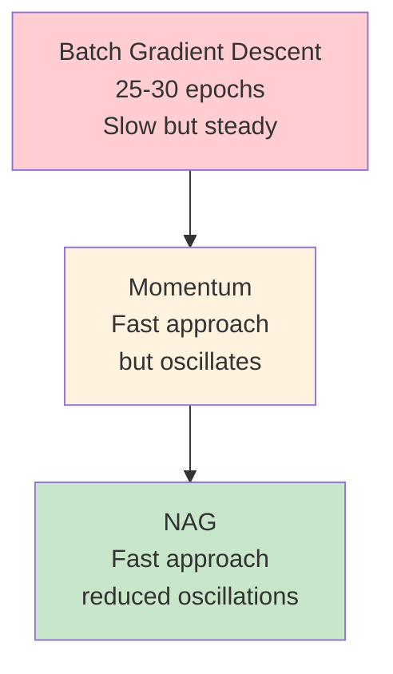
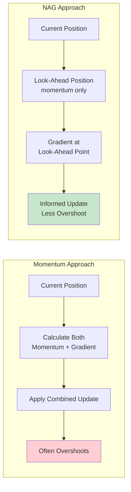
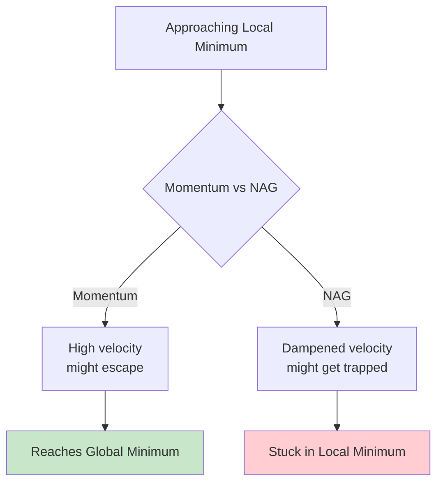

# Nesterov Accelerated Gradient (NAG)

## Overview
**Nesterov Accelerated Gradient (NAG)** is a sophisticated enhancement to momentum optimization that significantly **reduces oscillations** while maintaining fast convergence. By implementing a **"look-ahead"** mechanism, NAG makes more informed decisions about parameter updates, leading to smoother and often faster convergence than standard momentum.

## The Evolution: From SGD to NAG

### Animated Demonstration Results


The material provides compelling animated comparisons showing convergence behavior:

**Batch Gradient Descent**: ~25-30 epochs for convergence
**Momentum (β=0.9)**: ~50 epochs due to oscillations  
**Momentum (β=0.8)**: ~38-39 epochs with reduced oscillations
**NAG**: Faster convergence with minimal oscillations

This animated visualization demonstrates the key differences in optimization paths, clearly showing how NAG's look-ahead mechanism creates smoother convergence compared to standard momentum.



### The Oscillation Problem in Momentum

The material demonstrates that momentum's main weakness is **overshooting**, which creates oscillations around the minimum. NAG addresses this by making **predictive adjustments** before taking the full step.

## Mathematical Formulation

### Momentum Recap
Standard momentum uses this update rule:
```
v_t = β × v_{t-1} + α × ∇L/∇w_t
w_{t+1} = w_t - v_t
```

Expanding this:
```
w_{t+1} = w_t - β × v_{t-1} - α × ∇L/∇w_t
```

**Key insight**: Momentum updates weights using **two components**:
1. Previous velocity (momentum term)
2. Current gradient

### NAG's Crucial Modification

NAG introduces a **look-ahead mechanism**:

```
w_lookahead = w_t - β × v_{t-1}
v_t = β × v_{t-1} + α × ∇L/∇w_lookahead
w_{t+1} = w_t - v_t
```

**The fundamental difference**: NAG calculates the gradient at the **anticipated position** rather than the current position.

```mermaid
flowchart TD
    A[Current Position w_t] --> B[Calculate Look-ahead Point<br/>w_lookahead = w_t - β × v_{t-1}]
    B --> C[Evaluate Gradient at<br/>Look-ahead Point]
    C --> D[Compute Velocity<br/>v_t = β × v_{t-1} + α × ∇L/∇w_lookahead]
    D --> E[Update Position<br/>w_{t+1} = w_t - v_t]
    
    style B fill:#e1f5fe
    style C fill:#e8f5e8
```

## Geometric Intuition: The Look-Ahead Advantage

### Momentum's Blind Spot

In standard momentum:
1. Calculate momentum and gradient **at current position**
2. Apply both updates **simultaneously**
3. Often overshoots the target, causing oscillations

### NAG's Intelligent Prediction

NAG's strategy:
1. **First**: Apply momentum to get look-ahead position
2. **Then**: Calculate gradient at that anticipated position  
3. **Finally**: Use that gradient information for the actual update



### Visual Step-by-Step Example

Consider moving along a loss curve:

**Momentum Process**:
- At position w₁: Calculate momentum (pushes right) + gradient (pushes right) 
- Result: Large step that overshoots minimum
- At position w₂: Momentum still pushes right, gradient now pushes left
- Result: Oscillation begins

**NAG Process**:
- At position w₁: First calculate look-ahead position using only momentum
- At look-ahead position: Gradient points left (towards minimum)
- Back at w₁: Apply smaller rightward update, avoiding overshoot

### The "Corrective Vision" Analogy

NAG is like **looking ahead before stepping**:
- **Momentum**: Like running with eyes closed, following momentum blindly
- **NAG**: Like looking one step ahead and adjusting course accordingly

This preview allows NAG to **anticipate overshooting** and make corrective adjustments.

## Damping Oscillations: The Core Benefit

### Why NAG Reduces Oscillations

1. **Predictive Awareness**: Sees what's coming next
2. **Corrective Action**: Adjusts before committing to full step  
3. **Smoother Trajectory**: Less zigzag behavior around minima

The material demonstrates this with convergence paths showing:
- **Momentum**: Large oscillations requiring many corrections
- **NAG**: Smooth approach with minimal overshoot

### Mathematical Insight

When approaching a minimum:
- **Momentum**: Gradient at current position + momentum both push in same direction
- **NAG**: Gradient at look-ahead position provides "early warning" of upcoming direction change

This early warning allows NAG to **moderate its step size** appropriately.

## Potential Disadvantage: Local Minima Trapping

### The Trade-off

NAG's oscillation damping can become a **weakness** in certain scenarios:



**Scenario**: When a local minimum is surrounded by small barriers:
- **Momentum**: Might have enough "kinetic energy" to escape
- **NAG**: Dampened oscillations might not provide enough energy to escape

**Important note**: This is a **potential** disadvantage that depends on the specific loss landscape.

## Implementation in Keras

### Three Optimizer Configurations

Keras provides flexible SGD implementation supporting all variants:

```python
from tensorflow.keras.optimizers import SGD

# Standard SGD
optimizer_sgd = SGD(
    learning_rate=0.01,
    momentum=0.0,        # No momentum
    nesterov=False       # No NAG
)

# SGD with Momentum  
optimizer_momentum = SGD(
    learning_rate=0.01,
    momentum=0.9,        # Enable momentum (β parameter)
    nesterov=False       # Standard momentum
)

# Nesterov Accelerated Gradient
optimizer_nag = SGD(
    learning_rate=0.01,
    momentum=0.9,        # Same momentum value
    nesterov=True        # Enable look-ahead mechanism
)
```

### Parameter Guidelines

**Learning Rate**: Typically 0.01 to 0.1
**Momentum (β)**: Usually 0.9 (90% of previous velocity retained)
**Nesterov**: Boolean flag to enable/disable look-ahead

## Comparative Analysis

### Convergence Speed Ranking
1. **NAG**: Fastest convergence with smooth trajectory
2. **Momentum**: Fast initial approach but oscillations slow final convergence  
3. **SGD**: Steady but slow overall

### Oscillation Behavior
- **SGD**: No oscillations (but very slow)
- **Momentum**: Significant oscillations around minima
- **NAG**: Minimal oscillations due to predictive corrections

### Computational Overhead
- **SGD**: Minimal computation
- **Momentum**: One additional vector operation (velocity)
- **NAG**: Two gradient computations (current + look-ahead) but still efficient

## When to Use NAG

### Highly Recommended For:
• **Complex loss landscapes** with many narrow valleys
• **Problems where oscillations are costly** (real-time applications)
• **When momentum works well** but needs refinement

### Consider Alternatives When:
• **Many local minima** where escape velocity is crucial
• **Very noisy gradients** where look-ahead might be misleading
• **Computational budget is extremely tight**

## Key Insights and Connections

### The Predictive Principle
NAG embodies a fundamental optimization principle: **use available information to predict and prevent problems**. This concept appears in many advanced algorithms.

### Foundation for Advanced Methods
Understanding NAG's look-ahead mechanism prepares you for:
- **Adam**: Uses similar predictive concepts with adaptive learning rates
- **AdaGrad**: Anticipates gradient behavior through accumulation
- **Modern optimizers**: Many incorporate predictive elements

## Practical Considerations

### Hyperparameter Sensitivity
NAG is generally **less sensitive** to hyperparameter choices than momentum because the look-ahead mechanism provides automatic correction.

### Debug and Visualization
When visualizing optimization paths:
- Look for **smoother curves** as evidence NAG is working
- **Fewer oscillations** around minima indicate successful damping
- **Faster final convergence** compared to momentum

## Thought-Provoking Questions

1. **Adaptive Look-Ahead**: Could we dynamically adjust how far ahead NAG looks based on the local curvature of the loss landscape? What would be the computational trade-offs?

2. **Multi-Step Prediction**: NAG looks one step ahead - what if we looked multiple steps ahead? Would this provide better optimization, or would prediction errors compound?

3. **Stochastic Considerations**: In noisy optimization environments (like mini-batch training), how reliable is the look-ahead gradient? Could we develop confidence measures for the predictive step?

[End of Notes]