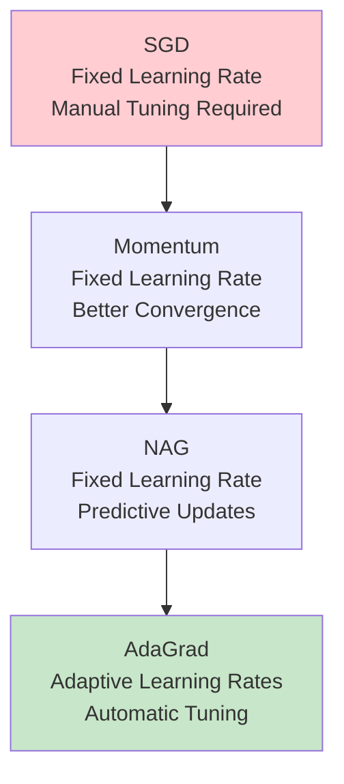
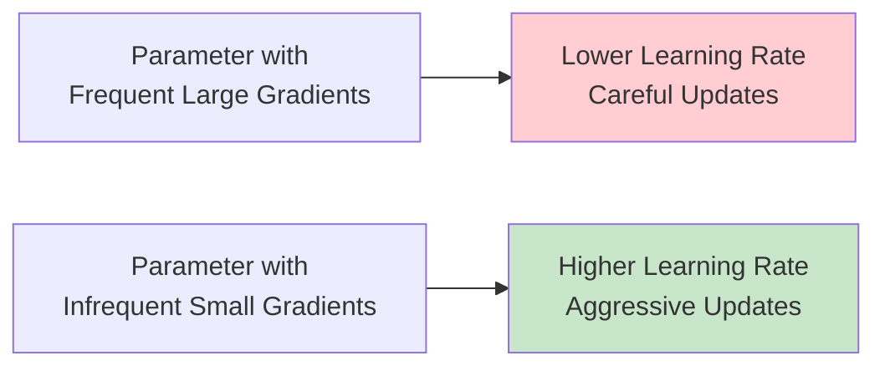
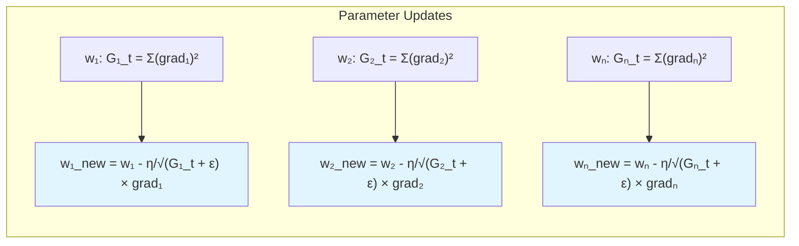
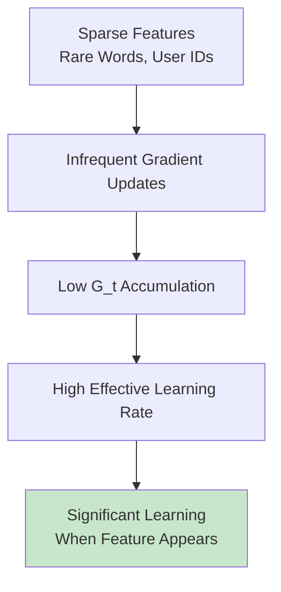
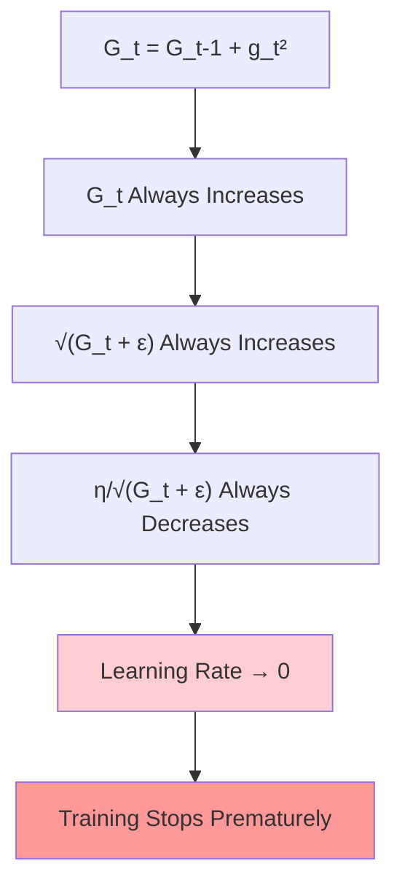
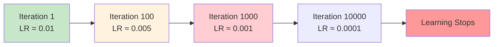
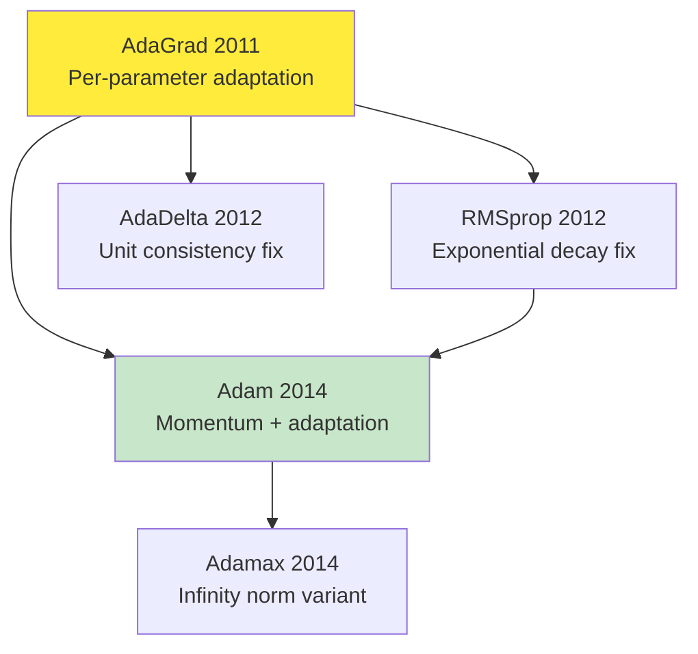

# AdaGrad (Adaptive Gradient) Optimization

## Overview
**AdaGrad (Adaptive Gradient)** represents a revolutionary breakthrough in optimization algorithms, introducing the concept of **per-parameter adaptive learning rates**. Published in 2011, AdaGrad addresses one of the most challenging aspects of neural network training: **automatically adjusting learning rates** for different parameters based on their gradient history. This innovation eliminates the need for manual learning rate tuning and provides exceptional performance on **sparse data problems**.

## The Evolution: From Fixed to Adaptive Learning Rates

### Why AdaGrad Was Revolutionary

The progression from momentum-based methods to AdaGrad represents a fundamental paradigm shift in optimization:



**Key Innovation**: AdaGrad was the **first optimizer** to automatically adapt learning rates based on parameter-specific gradient history, eliminating the need for manual hyperparameter tuning across different parameter groups.

## Core Principle: Gradient-Based Adaptation

### The Fundamental Insight

AdaGrad operates on a simple but powerful principle:
> **Parameters that receive large, frequent gradient updates should have their learning rates reduced to prevent overshooting. Parameters that receive small, infrequent updates should maintain higher learning rates to ensure adequate progress.**

### Intuitive Analogy

**The Investment Portfolio Metaphor**:
- **High-frequency trading stocks** (frequent large gradients) → **Lower learning rates** to avoid volatile swings
- **Stable long-term investments** (infrequent small gradients) → **Higher learning rates** to ensure meaningful progress
- AdaGrad acts like an **automatic portfolio manager**, adjusting "investment rates" based on historical volatility



## Mathematical Formulation

### The AdaGrad Algorithm

AdaGrad modifies the standard gradient descent update rule by introducing **gradient accumulation**:

**Standard SGD**:
```
θ_{t+1} = θ_t - η × g_t
```

**AdaGrad Algorithm**:
```
G_t = G_{t-1} + g_t²                    [Accumulate squared gradients]
θ_{t+1} = θ_t - (η/√(G_t + ε)) × g_t    [Adaptive update]
```

Where:
• **G_t**: Accumulated sum of squared gradients up to time t
• **η**: Initial learning rate (typically 0.01)
• **g_t**: Current gradient ∇L/∇θ_t
• **ε**: Small constant for numerical stability (typically 10^-8)

### Per-Parameter Adaptation

**Critical Feature**: Each parameter maintains its **own accumulator** G_t, enabling **per-parameter adaptive learning rates**:



This creates **thousands of different effective learning rates** in a typical neural network, with each parameter having its own adaptive learning rate automatically tuned based on that parameter's specific gradient history.

### Step-by-Step Example

Consider training with three parameters over four iterations:

| Iteration | Parameter | Gradient g_t | G_t = Σg² | Effective LR = η/√(G_t + ε) | Update |
|-----------|-----------|--------------|-----------|------------------------------|---------|
| 1 | w₁ | 0.8 | 0.64 | 0.01/√0.64 = 0.0125 | Large update |
| 2 | w₁ | 0.9 | 1.45 | 0.01/√1.45 = 0.0083 | Medium update |
| 3 | w₁ | 0.7 | 1.94 | 0.01/√1.94 = 0.0072 | Small update |
| 4 | w₁ | 0.6 | 2.30 | 0.01/√2.30 = 0.0066 | Smaller update |

**Key Observation**: As G_t accumulates, the effective learning rate **monotonically decreases**.

## Major Advantages of AdaGrad

### 1. **Automatic Learning Rate Adaptation**

**No Manual Tuning Required**:
- Eliminates the need to set different learning rates for different parameter groups
- Automatically handles parameters with vastly different scales
- Self-regulating based on gradient history

**Example**: In a neural network with both word embeddings (sparse, infrequent updates) and dense layers (frequent updates), AdaGrad automatically provides:
- Higher learning rates for rarely-updated word embeddings
- Lower learning rates for frequently-updated dense weights

### 2. **Exceptional Performance on Sparse Data**

**The Sparse Feature Advantage**:


**Real-world Applications**:
- **Natural Language Processing**: Rare words receive appropriate learning rates
- **Recommender Systems**: Infrequent user-item interactions get boosted learning
- **Click-through Rate Prediction**: Low-frequency features aren't neglected

### 3. **Scale Invariance**

AdaGrad provides **automatic normalization** for parameters with different scales:
- Features measured in meters vs. millimeters
- Different input ranges across feature dimensions
- Varying parameter magnitudes across layers

### 4. **Theoretical Guarantees**

**Regret Bounds**: AdaGrad provides **sublinear regret** guarantees for convex functions, meaning it theoretically converges to optimal solutions in convex settings.

## The Critical Disadvantage: Aggressive Learning Rate Decay

### The Monotonic Decay Problem

**Fundamental Issue**: AdaGrad's greatest strength becomes its fatal weakness:



**Mathematical Analysis**:
Since g_t² ≥ 0 for all t, we have G_t ≥ G_{t-1}, which means:
```
lim(t→∞) η/√(G_t + ε) = 0
```

### The Vanishing Learning Rate Phenomenon

**Typical Training Behavior**:
1. **Early Phase** (iterations 1-100): Large effective learning rates, rapid progress
2. **Middle Phase** (iterations 100-1000): Gradual slowdown as learning rates decay
3. **Late Phase** (iterations 1000+): Minimal progress, effective learning rate ≈ 0

**Visual Representation**:


### Impact on Different Training Scenarios

**Short Training Sessions**: AdaGrad often performs excellently
**Long Training Sessions**: Premature learning stoppage becomes problematic
**Complex Models**: Deep networks may require extended training that AdaGrad cannot provide

## Comparison with Previous Optimizers

### AdaGrad vs. Standard SGD

| Aspect | SGD | AdaGrad |
|--------|-----|---------|
| Learning Rate | Fixed, requires tuning | Adaptive, automatic |
| Sparse Data | Poor performance | Excellent performance |
| Dense Data | Good with proper LR | Good initially, degrades |
| Long Training | Consistent performance | Learning rate decay issue |
| Hyperparameter Sensitivity | High | Low (initially) |

### AdaGrad vs. Momentum

| Feature | Momentum | AdaGrad |
|---------|----------|---------|
| **Oscillation Handling** | ✅ Excellent | ❌ Limited |
| **Sparse Features** | ❌ Poor | ✅ Excellent |
| **Learning Rate Adaptation** | ❌ Fixed | ✅ Automatic |
| **Long Training** | ✅ Consistent | ❌ Decay problem |
| **Escape Local Minima** | ✅ Good momentum | ❌ Decreasing capability |

### AdaGrad vs. Nesterov (NAG)

**Complementary Approaches**:
- **NAG**: Predictive updates with fixed learning rate
- **AdaGrad**: Reactive adaptation with decaying learning rate
- **Missing Link**: Combining both approaches (leads to Adam optimizer)

## Implementation Details

### Keras/TensorFlow Implementation

```python
import tensorflow as tf
from tensorflow.keras.optimizers import Adagrad

# Basic AdaGrad optimizer
optimizer = Adagrad(
    learning_rate=0.01,                    # Initial learning rate
    initial_accumulator_value=0.1,         # Initial value for G_0
    epsilon=1e-7                           # Numerical stability constant
)

# Example model compilation
model = tf.keras.Sequential([
    tf.keras.layers.Dense(128, activation='relu'),
    tf.keras.layers.Dense(64, activation='relu'),
    tf.keras.layers.Dense(10, activation='softmax')
])

model.compile(
    optimizer=optimizer,
    loss='categorical_crossentropy',
    metrics=['accuracy']
)

# Training with AdaGrad
history = model.fit(
    x_train, y_train,
    batch_size=32,
    epochs=100,
    validation_data=(x_val, y_val),
    verbose=1
)
```

### PyTorch Implementation

```python
import torch
import torch.optim as optim

# Define model
model = torch.nn.Sequential(
    torch.nn.Linear(784, 128),
    torch.nn.ReLU(),
    torch.nn.Linear(128, 64),
    torch.nn.ReLU(),
    torch.nn.Linear(64, 10)
)

# AdaGrad optimizer
optimizer = optim.Adagrad(
    model.parameters(),
    lr=0.01,                              # Initial learning rate
    lr_decay=0,                           # Additional learning rate decay
    weight_decay=0,                       # L2 regularization
    initial_accumulator_value=0,          # Initial G_0 value
    eps=1e-10                            # Numerical stability
)

# Training loop
for epoch in range(num_epochs):
    for batch_idx, (data, targets) in enumerate(train_loader):
        optimizer.zero_grad()
        outputs = model(data)
        loss = criterion(outputs, targets)
        loss.backward()
        optimizer.step()
        
        # Monitor effective learning rates
        if batch_idx % 100 == 0:
            for group in optimizer.param_groups:
                for p in group['params']:
                    state = optimizer.state[p]
                    if len(state) > 0:
                        acc = state['sum']
                        effective_lr = group['lr'] / (acc.sqrt() + group['eps'])
                        print(f"Effective LR: {effective_lr.mean().item():.6f}")
```

### Custom Implementation for Understanding

```python
import numpy as np

class AdaGrad:
    def __init__(self, learning_rate=0.01, epsilon=1e-8):
        self.learning_rate = learning_rate
        self.epsilon = epsilon
        self.accumulated_gradients = {}
    
    def update(self, params, gradients):
        if not self.accumulated_gradients:
            # Initialize accumulators
            for key in params:
                self.accumulated_gradients[key] = np.zeros_like(params[key])
        
        # Update each parameter
        for key in params:
            # Accumulate squared gradients
            self.accumulated_gradients[key] += gradients[key] ** 2
            
            # Calculate adaptive learning rate
            adaptive_lr = self.learning_rate / (
                np.sqrt(self.accumulated_gradients[key]) + self.epsilon
            )
            
            # Update parameter
            params[key] -= adaptive_lr * gradients[key]
        
        return params
```

## When to Use AdaGrad

### Highly Recommended Scenarios

**1. Natural Language Processing**:
- Text classification with sparse word features
- Machine translation with large vocabularies
- Sentiment analysis with infrequent words

**2. Recommender Systems**:
- Collaborative filtering with sparse user-item interactions
- Content-based filtering with categorical features
- Cold-start problems with new users/items

**3. Click-Through Rate Prediction**:
- Online advertising with sparse categorical features
- Feature combinations with varying frequencies
- Real-time learning scenarios (short training sessions)

**4. Computer Vision with Sparse Features**:
- Bag-of-words visual models
- Sparse coding applications
- Feature learning with selective activation

### Avoid AdaGrad When

**1. Long Training Requirements**:
- Deep neural networks requiring hundreds of epochs
- Iterative refinement scenarios
- Continuous learning systems

**2. Dense Gradient Scenarios**:
- Fully connected networks with dense activations
- Convolutional networks with consistent feature activation
- Problems where all parameters receive frequent updates

**3. Real-time Applications**:
- Systems requiring consistent performance over time
- Online learning with indefinite training periods
- Streaming data scenarios

## Historical Context and Impact

### Foundational Research Paper

**"Adaptive Subgradient Methods for Online Learning and Stochastic Optimization"**
- **Authors**: John Duchi, Elad Hazan, Yoram Singer
- **Published**: Journal of Machine Learning Research, 2011
- **Volume**: 12, Pages: 2121-2159
- **Impact**: 40,000+ citations, foundational work in adaptive optimization

### Revolutionary Contributions

**1. Per-Parameter Adaptive Learning Rates**:
- First algorithm to automatically adapt learning rates individually for each parameter
- Each parameter gets its own learning rate based on its gradient history
- Eliminated need for manual learning rate scheduling across different parameter groups
- Inspired entire family of adaptive optimizers

**2. Sparse Data Optimization**:
- Solved long-standing problem of learning from sparse features
- Enabled effective training on high-dimensional, sparse datasets
- Critical for NLP and recommender system breakthroughs

**3. Theoretical Foundations**:
- Provided regret bounds for online learning
- Connected optimization theory with practical machine learning
- Established framework for analyzing adaptive methods

### Legacy and Influence

AdaGrad directly inspired the development of:
- **RMSprop (2012)**: Fixed learning rate decay problem
- **Adam (2014)**: Combined AdaGrad adaptation with momentum
- **AdaDelta (2012)**: Alternative solution to learning rate decay
- **Adamax (2014)**: Infinity-norm variant of Adam



## Advanced Considerations

### Numerical Stability Issues

**The Epsilon Parameter**:
```python
# Too small epsilon: numerical instability
optimizer = Adagrad(epsilon=1e-15)  # Dangerous!

# Too large epsilon: reduces adaptation
optimizer = Adagrad(epsilon=1e-3)   # Ineffective!

# Recommended range
optimizer = Adagrad(epsilon=1e-8)   # Good balance
```

**Initial Accumulator Values**:
- **Zero initialization**: Standard approach, clean mathematical interpretation
- **Small positive values**: Can improve stability in some scenarios
- **Problem-specific**: Some domains benefit from non-zero initialization

### Monitoring AdaGrad Training

**Key Metrics to Track**:
1. **Effective Learning Rates**: Monitor η/√(G_t + ε) for each parameter group
2. **Gradient Accumulation**: Track G_t growth rates
3. **Parameter Update Magnitudes**: Ensure updates don't become too small
4. **Learning Progress**: Watch for premature training stagnation

**Diagnostic Code**:
```python
def monitor_adagrad(optimizer, epoch):
    for group in optimizer.param_groups:
        total_params = 0
        avg_effective_lr = 0
        
        for p in group['params']:
            if p.grad is not None:
                state = optimizer.state[p]
                if len(state) > 0:
                    acc = state['sum']
                    effective_lr = group['lr'] / (acc.sqrt().mean() + group['eps'])
                    avg_effective_lr += effective_lr * p.numel()
                    total_params += p.numel()
        
        if total_params > 0:
            avg_effective_lr /= total_params
            print(f"Epoch {epoch}: Average effective LR = {avg_effective_lr:.8f}")
            
            # Warning for very small learning rates
            if avg_effective_lr < 1e-6:
                print("WARNING: Learning rate becoming very small!")
```

## Practical Guidelines and Best Practices

### Hyperparameter Recommendations

**Learning Rate (η)**:
- **Default**: 0.01 (less critical than other optimizers)
- **Large datasets**: 0.1 to 1.0
- **Small datasets**: 0.001 to 0.01
- **Fine-tuning**: 0.001 to 0.005

**Epsilon (ε)**:
- **Default**: 1e-8 (TensorFlow) or 1e-10 (PyTorch)
- **Stable training**: 1e-7 to 1e-8
- **Aggressive adaptation**: 1e-10 to 1e-12

### Early Stopping Strategies

Since AdaGrad learning rates decay, implement early stopping based on:
1. **Effective learning rate threshold**: Stop when average LR < threshold
2. **Gradient magnitude monitoring**: Stop when gradients become negligible
3. **Validation performance plateau**: Traditional early stopping remains important

### Combining AdaGrad with Other Techniques

**Learning Rate Scheduling**:
```python
# Step decay with AdaGrad
initial_lr = 0.1
scheduler = tf.keras.callbacks.ReduceLROnPlateau(
    monitor='val_loss',
    factor=0.5,
    patience=5,
    min_lr=0.001
)
```

**Regularization**:
- **Weight decay**: Works well with AdaGrad's adaptive nature
- **Dropout**: Helps prevent overfitting when learning rates are high initially
- **Batch normalization**: Can interact complexly with adaptive learning rates

## Transition to Modern Optimizers

### Why AdaGrad Led to RMSprop

**The Core Problem**: Monotonic learning rate decay
**The Solution**: Exponential moving average instead of cumulative sum

**AdaGrad**: G_t = G_{t-1} + g_t²
**RMSprop**: G_t = β × G_{t-1} + (1-β) × g_t²

This modification allows learning rates to recover, solving AdaGrad's fundamental limitation.

### Why AdaGrad Led to Adam

**Missing Component**: AdaGrad lacks momentum's direction consistency
**The Solution**: Combine adaptive learning rates with momentum

**Adam Formula**:
```
m_t = β₁ × m_{t-1} + (1-β₁) × g_t        [Momentum term]
v_t = β₂ × v_{t-1} + (1-β₂) × g_t²       [AdaGrad-style term]
```

## Key Insights and Takeaways

### The Fundamental Trade-off

AdaGrad embodies a crucial trade-off in optimization:
- **Automatic adaptation** vs. **Learning rate decay**
- **Sparse data excellence** vs. **Dense data limitations**
- **Initial robustness** vs. **Long-term performance**

### Why AdaGrad Remains Important

Despite its limitations, AdaGrad remains valuable because:

1. **Educational Foundation**: Understanding AdaGrad is essential for grasping modern optimizers
2. **Specific Use Cases**: Still optimal for certain sparse, short-training scenarios
3. **Theoretical Insights**: Provides important lessons about adaptive optimization
4. **Historical Significance**: Pioneered the entire field of adaptive learning rates

### Connection to Optimization Theory

AdaGrad bridges **theoretical optimization** and **practical machine learning**:
- Provides provable convergence guarantees for convex functions
- Demonstrates automatic hyperparameter adaptation
- Shows how second-order information (via gradients) can improve first-order methods

## Thought-Provoking Questions

1. **Accumulation vs. Forgetting**: AdaGrad never "forgets" past gradients. In dynamic environments where data distribution changes, could this long memory become harmful? How might we design optimizers that balance memory with adaptability?

2. **Sparse vs. Dense Trade-offs**: AdaGrad excels on sparse data but struggles with dense gradients. Could we develop hybrid approaches that automatically detect gradient sparsity and switch between different accumulation strategies?

3. **Learning Rate Resurrection**: Given that AdaGrad's learning rates inevitably decay to zero, could we design mechanisms to "resurrect" learning rates based on validation performance or gradient characteristics while maintaining the benefits of adaptation?

4. **Multi-timescale Learning**: Different aspects of a model might benefit from different learning timescales. Could we extend AdaGrad's per-parameter adaptation to per-timescale adaptation, where some parameters learn quickly (short memory) while others learn slowly (long memory)?

[End of Notes]