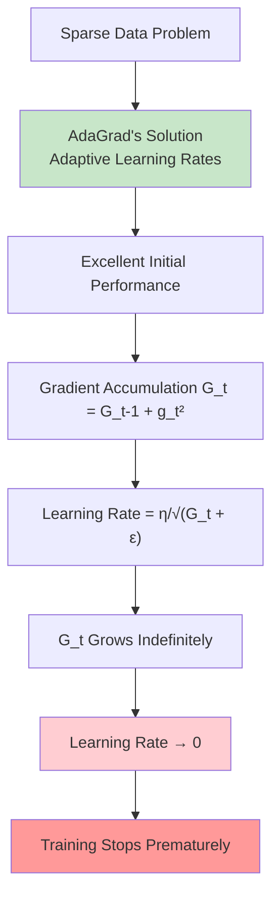
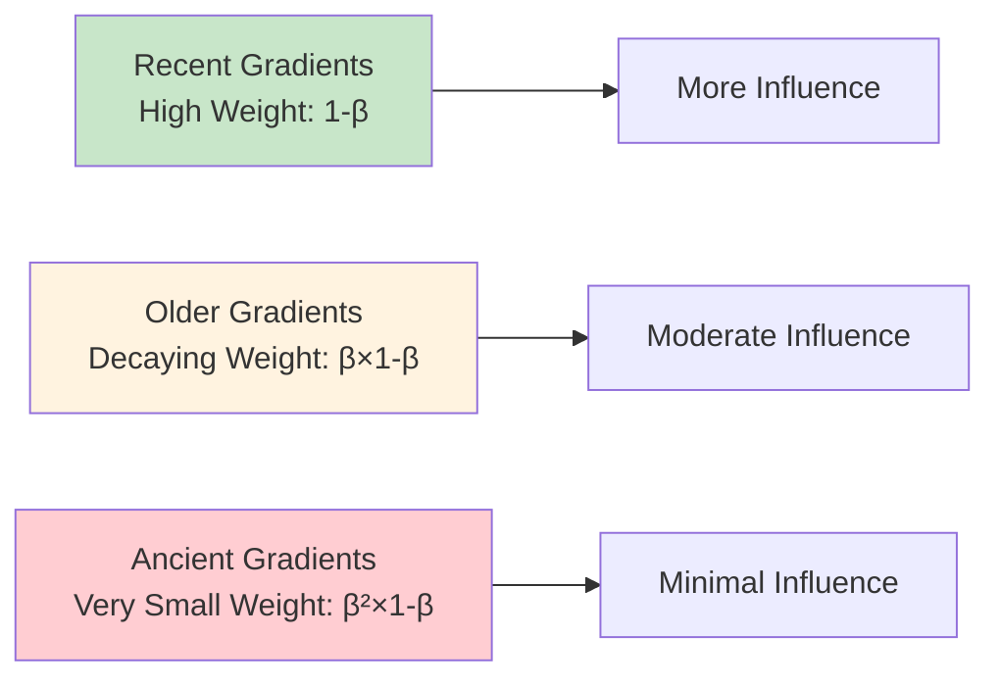
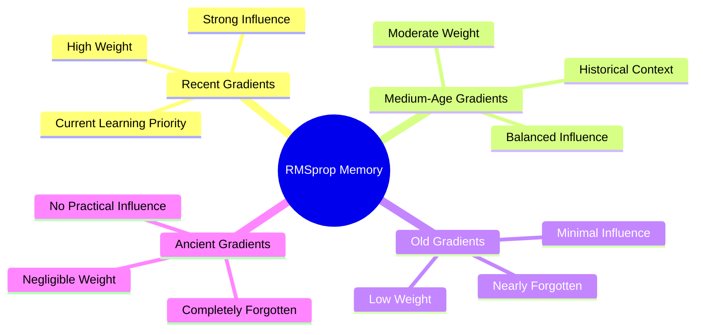
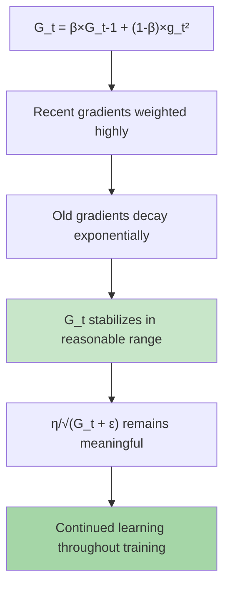
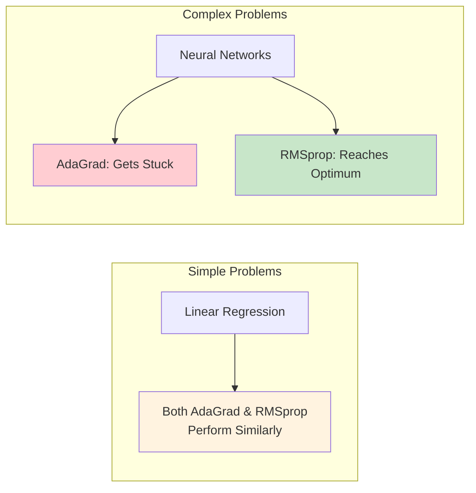
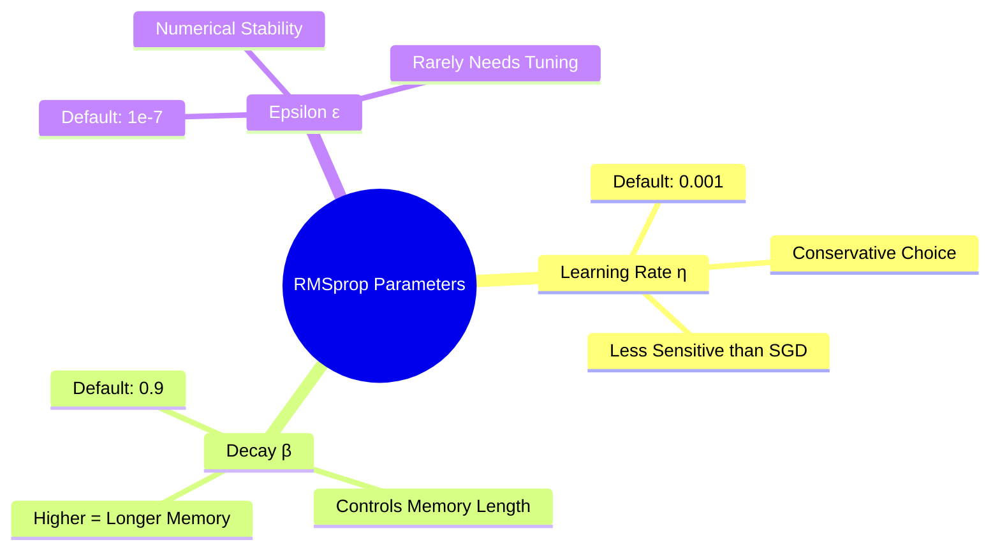
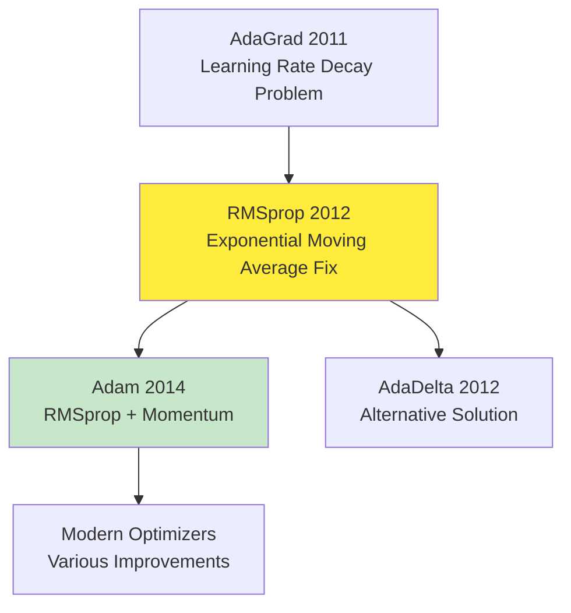

# RMSprop (Root Mean Square Propagation)

## Overview
**RMSprop (Root Mean Square Propagation)** represents a crucial breakthrough in adaptive optimization, directly addressing AdaGrad's fundamental limitation of **aggressive learning rate decay**. Developed by Geoffrey Hinton in 2012, RMSprop introduces **exponentially weighted moving averages** to prevent learning rates from vanishing, enabling sustained learning throughout training. This innovation makes RMSprop exceptionally effective for both **convex and non-convex optimization problems**, establishing it as one of the most reliable optimizers in deep learning.

## The Critical Problem RMSprop Solves

### AdaGrad's Fatal Flaw Revisited

The material begins by revisiting the core issue that motivated RMSprop's development:



**The Fundamental Issue**: AdaGrad accumulates **all historical gradients**, causing the denominator G_t to grow indefinitely, which makes the effective learning rate approach zero over time.

### Visual Understanding of the Problem

The material illustrates this with sparse data scenarios:
- **One column with all 1s** (sparse features)
- **Another column with diverse X values** (dense features) 
- **Corresponding output Y values**

In such cases:
1. **Initial phase**: Fast movement in one direction (handling sparse features)
2. **Later phase**: Movement in perpendicular direction (fine-tuning dense features)
3. **Problem**: AdaGrad gets stuck at local minimum because learning rate becomes too small

**Mathematical Explanation**:
```
After many iterations: G_t = g₁² + g₂² + g₃² + ... + gₙ²
As t increases: G_t becomes very large
Therefore: η/√(G_t + ε) becomes very small
Result: Parameter updates ≈ 0, learning stops
```

## RMSprop's Elegant Solution

### The Core Innovation: Exponentially Weighted Moving Average

RMSprop introduces a **simple but powerful modification** to AdaGrad's accumulation formula:

**AdaGrad Formula**:
```
G_t = G_{t-1} + g_t²                    [Cumulative sum - grows forever]
θ_{t+1} = θ_t - (η/√(G_t + ε)) × g_t
```

**RMSprop Formula**:
```
G_t = β × G_{t-1} + (1-β) × g_t²        [Exponential moving average]
θ_{t+1} = θ_t - (η/√(G_t + ε)) × g_t
```

Where:
• **β**: Decay parameter (typically 0.9 or 0.95)
• **G_t**: Exponentially weighted moving average of squared gradients
• **η**: Learning rate (typically 0.001)
• **g_t**: Current gradient
• **ε**: Numerical stability constant (typically 10^-8)

### Mathematical Proof of the Fix

The material provides a step-by-step mathematical expansion showing how recent gradients receive higher weights:

**Step 1**: G₁ = β × 0 + (1-β) × g₁² = (1-β) × g₁²

**Step 2**: G₂ = β × G₁ + (1-β) × g₂²
```
G₂ = β(1-β)g₁² + (1-β)g₂²
```

**Step 3**: G₃ = β × G₂ + (1-β) × g₃²
```
G₃ = β²(1-β)g₁² + β(1-β)g₂² + (1-β)g₃²
```

**Weight Distribution Analysis**:

| Gradient | Weight Coefficient | Relative Importance |
|----------|-------------------|---------------------|
| g₁ (oldest) | β²(1-β) | Smallest weight |
| g₂ (older) | β(1-β) | Medium weight |
| g₃ (recent) | (1-β) | **Largest weight** |



**Key Insight**: Since 0 < β < 1, we have β² < β < 1, ensuring that recent gradients dominate while older gradients are "forgotten" exponentially.

## The Forgetting Mechanism

### Why Exponential Decay Works

**The Fundamental Principle**: Instead of accumulating all gradient history like AdaGrad, RMSprop implements **selective memory**:



**Mathematical Advantage**:
- **AdaGrad**: G_t grows without bound → Learning rate → 0
- **RMSprop**: G_t converges to a stable range → Learning rate remains meaningful

### Preventing Learning Rate Collapse

**The Core Benefit**: By using exponential decay, G_t doesn't grow indefinitely:



**Practical Result**: The optimizer can continue making progress even after thousands of iterations, solving AdaGrad's premature stopping problem.

## Comparative Analysis: RMSprop vs. AdaGrad

### Performance on Different Problem Types

The material emphasizes that differences become apparent based on problem complexity:

**Convex Optimization (Linear Regression)**:
- **AdaGrad**: Works perfectly, reaches global minimum
- **RMSprop**: Also works perfectly, similar trajectory
- **Conclusion**: Both perform similarly on simple problems

**Non-Convex Optimization (Neural Networks)**:
- **AdaGrad**: Gets stuck at local minima due to vanishing learning rates
- **RMSprop**: Successfully navigates to global minimum
- **Conclusion**: RMSprop's advantage emerges in complex scenarios

### Visual Comparison


*RMSprop (green) vs AdaGrad (white). The first run shows the optimization paths; the second run shows the sum of gradient squared represented by the squares, illustrating how RMSprop's exponential moving average prevents the excessive accumulation that causes AdaGrad's learning rate decay.*



**Animation Insights**: The GIF visualization clearly demonstrates RMSprop's advantage, showing how the green trajectory (RMSprop) maintains consistent progress while the white trajectory (AdaGrad) may struggle with convergence. The squares representing accumulated gradient sums visually illustrate why RMSprop's exponential decay prevents the learning rate collapse that affects AdaGrad.

## RMSprop's Advantages

### 1. **Sustained Learning Capability**
- **No learning rate decay problem**: Maintains effective learning rates throughout training
- **Continued optimization**: Can train for extended periods without stagnation
- **Adaptive memory**: Balances recent information with historical context

### 2. **Versatile Problem Handling**
- **Convex optimization**: Performs as well as AdaGrad
- **Non-convex optimization**: Significantly outperforms AdaGrad
- **Complex neural networks**: Reliable convergence where other methods fail

### 3. **Robust Performance**
- **Proven effectiveness**: Widely used before Adam's introduction
- **Minimal hyperparameter tuning**: Works well with default settings
- **Stable across diverse problems**: Consistent performance across different architectures

### 4. **No Major Disadvantages**
The material explicitly states that RMSprop has **no significant disadvantages**, making it a reliable choice for optimization.

## Implementation Details

### Standard RMSprop Implementation

```python
import tensorflow as tf
from tensorflow.keras.optimizers import RMSprop

# Basic RMSprop optimizer
optimizer = RMSprop(
    learning_rate=0.001,                  # Learning rate η
    rho=0.9,                             # Decay parameter β
    momentum=0.0,                        # Optional momentum term
    epsilon=1e-7,                        # Numerical stability
    centered=False                       # Whether to center gradients
)

# Example model compilation
model = tf.keras.Sequential([
    tf.keras.layers.Dense(128, activation='relu'),
    tf.keras.layers.Dense(64, activation='relu'),
    tf.keras.layers.Dense(10, activation='softmax')
])

model.compile(
    optimizer=optimizer,
    loss='categorical_crossentropy',
    metrics=['accuracy']
)
```

### PyTorch Implementation

```python
import torch
import torch.optim as optim

# Define model
model = torch.nn.Sequential(
    torch.nn.Linear(784, 128),
    torch.nn.ReLU(),
    torch.nn.Linear(128, 64),
    torch.nn.ReLU(),
    torch.nn.Linear(64, 10)
)

# RMSprop optimizer
optimizer = optim.RMSprop(
    model.parameters(),
    lr=0.001,                            # Learning rate
    alpha=0.9,                          # Decay parameter (β)
    eps=1e-8,                           # Numerical stability
    weight_decay=0,                      # L2 regularization
    momentum=0                           # Momentum term
)

# Training loop
for epoch in range(num_epochs):
    for batch_idx, (data, targets) in enumerate(train_loader):
        optimizer.zero_grad()
        outputs = model(data)
        loss = criterion(outputs, targets)
        loss.backward()
        optimizer.step()
```

### Custom Implementation for Understanding

```python
import numpy as np

class RMSprop:
    def __init__(self, learning_rate=0.001, beta=0.9, epsilon=1e-8):
        self.learning_rate = learning_rate
        self.beta = beta
        self.epsilon = epsilon
        self.accumulated_gradients = {}
    
    def update(self, params, gradients):
        if not self.accumulated_gradients:
            # Initialize accumulators
            for key in params:
                self.accumulated_gradients[key] = np.zeros_like(params[key])
        
        # Update each parameter
        for key in params:
            # Exponentially weighted moving average of squared gradients
            self.accumulated_gradients[key] = (
                self.beta * self.accumulated_gradients[key] + 
                (1 - self.beta) * gradients[key] ** 2
            )
            
            # Calculate adaptive learning rate
            adaptive_lr = self.learning_rate / (
                np.sqrt(self.accumulated_gradients[key]) + self.epsilon
            )
            
            # Update parameter
            params[key] -= adaptive_lr * gradients[key]
        
        return params
```

## Hyperparameter Guidelines

### Key Parameters and Recommendations

**Learning Rate (η)**:
- **Default**: 0.001 (more conservative than AdaGrad)
- **Range**: 0.0001 to 0.01
- **Tuning**: Start with 0.001 and adjust based on convergence behavior

**Decay Parameter (β/rho)**:
- **Default**: 0.9 (90% retention of previous information)
- **Alternative**: 0.95 for longer memory
- **Range**: 0.8 to 0.99

**Epsilon (ε)**:
- **Default**: 1e-7 to 1e-8
- **Purpose**: Numerical stability, prevents division by zero
- **Generally**: Doesn't require tuning



## When to Use RMSprop

### Highly Recommended Scenarios

**1. Complex Neural Networks**:
- Deep feedforward networks
- Convolutional neural networks
- Recurrent neural networks
- When AdaGrad fails to converge

**2. Non-Convex Optimization**:
- Multi-layer perceptrons
- Problems with many local minima
- When gradient landscapes are complex

**3. Extended Training Periods**:
- When training requires many epochs
- Continuous learning scenarios
- When learning rate decay would be problematic

**4. As Adam Alternative**:
- When Adam doesn't perform well
- For problems requiring more stable convergence
- When simpler optimizers are preferred

### Consider Alternatives When

**1. Simple Linear Problems**:
- Linear regression (where AdaGrad works fine)
- Convex optimization with known solutions
- When simplest approach is preferred

**2. Very Large-Scale Problems**:
- When Adam's additional momentum benefits are needed
- Problems requiring fastest possible convergence
- Modern architectures with specific optimizer requirements

## Historical Context and Impact

### Development and Introduction

**Creator**: Geoffrey Hinton (University of Toronto)
**Year**: 2012
**Context**: Coursera Neural Networks Course, Lecture 6.5
**Motivation**: Direct response to AdaGrad's learning rate decay problem

### Revolutionary Impact

**Before RMSprop**:
- AdaGrad was state-of-the-art for adaptive learning rates
- Learning rate decay problem limited training duration
- Complex neural networks struggled with convergence

**After RMSprop**:
- Enabled sustained training for complex networks
- Became the de facto standard optimizer
- Paved the way for modern deep learning breakthroughs

### Legacy and Influence

RMSprop directly influenced:
- **Adam (2014)**: Combined RMSprop with momentum
- **AdaDelta (2012)**: Alternative solution to learning rate decay
- **Modern adaptive optimizers**: Foundation for current methods



## Theoretical Foundation

### Convergence Properties

**Convergence Guarantees**:
- **Convex functions**: Guaranteed convergence to global optimum
- **Non-convex functions**: Convergence to critical points
- **Practical performance**: Excellent empirical results across diverse problems

**Regret Bounds**:
- Maintains sublinear regret guarantees similar to AdaGrad
- Improved practical performance due to sustained learning rates
- Better anytime performance (good results at any stopping point)

### Mathematical Insights

**Why Exponential Moving Average Works**:
1. **Maintains adaptivity**: Recent gradients still dominate learning rate adjustment
2. **Prevents accumulation**: Old information doesn't overwhelm recent information  
3. **Enables forgetting**: Outdated gradient information is naturally discarded
4. **Balances stability**: Provides stable learning rates without premature decay

## RMSprop in Modern Context

### Current Status and Usage

**Contemporary Relevance**:
- Still competitive with Adam in many scenarios
- Preferred choice when Adam doesn't work well
- Reliable fallback optimizer for difficult problems
- Used in production systems requiring stable performance

**Performance Comparison with Adam**:
- **Similar convergence speed** in most cases
- **More stable** in some scenarios
- **Fewer hyperparameters** to tune
- **Less memory overhead** (no momentum terms)

### Best Practices for Modern Usage

**Model Development**:
1. **Start with Adam** (current default choice)
2. **Try RMSprop** if Adam doesn't converge well
3. **Compare both** on validation set
4. **Use RMSprop** for baseline comparisons

**Production Deployment**:
- RMSprop for stable, predictable performance
- Well-understood behavior across different architectures
- Proven track record in deployed systems

## Key Insights and Takeaways

### The Fundamental Innovation

RMSprop's **core insight** is elegantly simple: **use recent information while forgetting the distant past**. This solves the central paradox of adaptive optimization—how to maintain per-parameter learning rates without allowing them to vanish.

### Why RMSprop Remains Relevant

Despite newer optimizers like Adam:

1. **Simplicity**: Fewer hyperparameters and moving parts
2. **Reliability**: Predictable behavior across diverse problems  
3. **Stability**: Less prone to hyperparameter sensitivity
4. **Understanding**: Well-understood theoretical properties

### Connection to Optimization Principles

RMSprop demonstrates key optimization principles:
- **Adaptive learning**: Different parameters need different treatment
- **Temporal relevance**: Recent information is more valuable than old information
- **Stability vs. adaptation**: Balance between responsiveness and stability
- **Practical solutions**: Sometimes simple modifications solve complex problems

## Advanced Considerations

### Centered RMSprop Variant

Some implementations offer **centered RMSprop** which subtracts the mean of gradients:

```python
# Centered RMSprop (available in TensorFlow)
optimizer = RMSprop(
    learning_rate=0.001,
    rho=0.9,
    epsilon=1e-7,
    centered=True  # Subtract gradient mean
)
```

**Benefits**:
- Can improve convergence in some scenarios
- Reduces bias in gradient estimates
- More stable in certain problem types

### Momentum Integration

RMSprop can be combined with momentum for additional benefits:

```python
# RMSprop with momentum
optimizer = RMSprop(
    learning_rate=0.001,
    rho=0.9,
    momentum=0.1,  # Add momentum term
    epsilon=1e-7
)
```

This combination anticipates the later development of Adam optimizer.

### Diagnostic and Monitoring

**Key Metrics to Track**:
1. **Effective learning rates**: Monitor η/√(G_t + ε) for different parameters
2. **Gradient accumulation**: Track G_t values to ensure stability
3. **Parameter update magnitudes**: Verify meaningful updates throughout training
4. **Loss convergence**: Ensure sustained progress unlike AdaGrad's stagnation

## Thought-Provoking Questions

1. **Memory vs. Adaptation Trade-off**: RMSprop uses exponential decay to balance recent and historical gradient information. Could we develop adaptive memory mechanisms that automatically adjust the decay parameter β based on the optimization landscape or convergence behavior?

2. **Problem-Specific Forgetting**: Different types of neural networks might benefit from different "forgetting rates." How might we design optimizers that automatically tune their memory characteristics based on the specific architecture or problem domain?

3. **Gradient Information Quality**: RMSprop treats all gradients equally within its exponential averaging scheme. Could we develop methods to weight gradients not just by recency, but also by their "quality" or informativeness about the true optimization direction?

4. **Dynamic Learning Rate Bounds**: While RMSprop prevents learning rates from going to zero, they can still become very small. Could we design mechanisms to maintain learning rates within optimal bounds while preserving the adaptive benefits of per-parameter scaling?

[End of Notes]