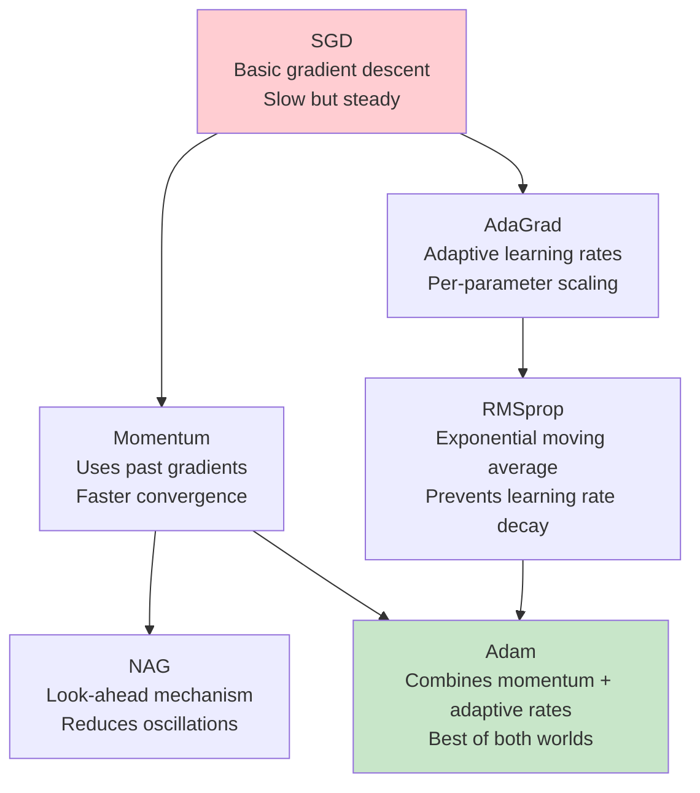
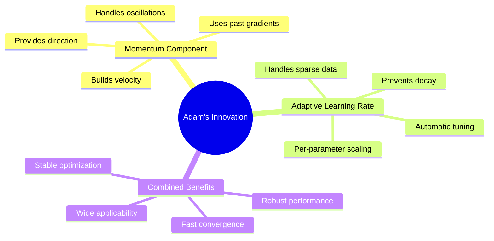
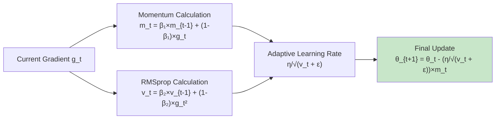
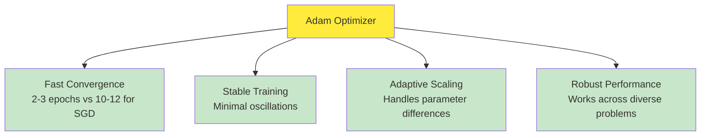
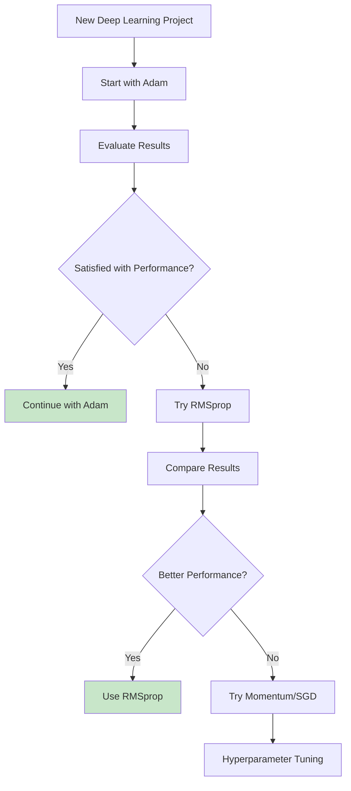

# Adam (Adaptive Moment Estimation)

## Overview
**Adam (Adaptive Moment Estimation)** represents the pinnacle of modern optimization algorithms, combining the best features of **momentum** and **adaptive learning rates** into a single, powerful technique. Introduced in 2014, Adam has become the **most widely used optimizer** in deep learning, serving as the default choice for training neural networks across diverse architectures including ANNs, CNNs, and RNNs. This material presents Adam as the culmination of optimization algorithm evolution, demonstrating how it elegantly merges concepts from previous optimizers to achieve superior performance.

## The Journey to Adam: A Historical Synthesis

### Building Upon Previous Innovations

The material emphasizes that understanding Adam requires knowledge of previous optimization techniques, as Adam **borrows concepts** from earlier algorithms:



**Core Insight**: The material reveals that optimization algorithms evolved along **two main directions**:
1. **Momentum-based approaches** (Momentum, NAG) - handling direction and oscillations
2. **Learning rate adaptation** (AdaGrad, RMSprop) - handling parameter-specific scaling

Adam represents the **synthesis** of these two approaches.

### Quick Review of Predecessor Algorithms

The material provides a rapid-fire summary of how each optimizer behaves on the classic optimization landscape:

**Batch Gradient Descent**:
- **Behavior**: Slowly descends the valley step by step
- **Problem**: Very slow speed, takes 10-12 epochs
- **Characteristic**: Cautious, methodical approach

**Momentum**:
- **Behavior**: Fast approach using velocity from past gradients
- **Advantage**: Reaches minimum in just 2-3 epochs
- **Problem**: Oscillations - crosses over, comes back, crosses again, gradually settles

**Nesterov Accelerated Gradient (NAG)**:
- **Behavior**: Dampens the oscillations from momentum
- **Visual**: Smaller oscillation circles compared to momentum's larger circles
- **Improvement**: Look-ahead mechanism reduces overshoot

**AdaGrad**:
- **Behavior**: Directly descends for sparse data problems
- **Advantage**: Handles different parameter scales automatically
- **Problem**: Learning rate decay causes premature stopping, missing the minimum

**RMSprop**:
- **Behavior**: Perfect convergence, reaches the minimum exactly
- **Solution**: Solves AdaGrad's learning rate decay through exponential moving averages

## Adam's Revolutionary Combination

### The Fundamental Principle

The material presents Adam's core innovation:
> **"If we combine momentum (handling oscillations) with learning rate decay (adaptive scaling), we might generate an even better approach. This is the principle behind Adam."**



### Mathematical Formulation: The Complete Picture

The material presents Adam's mathematical foundation, showing how it elegantly combines both concepts:

**Adam Algorithm**:
```
Step 1: m_t = β₁ × m_{t-1} + (1-β₁) × g_t        [Momentum component]
Step 2: v_t = β₂ × v_{t-1} + (1-β₂) × g_t²       [RMSprop component]
Step 3: θ_{t+1} = θ_t - (η/√(v_t + ε)) × m_t     [Combined update]
```

**With Bias Correction**:
```
m̂_t = m_t / (1 - β₁ᵗ)                            [Corrected momentum]
v̂_t = v_t / (1 - β₂ᵗ)                            [Corrected variance]
θ_{t+1} = θ_t - (η/√(v̂_t + ε)) × m̂_t             [Final update]
```

Where:
• **m_t**: First moment estimate (momentum term)
• **v_t**: Second moment estimate (adaptive learning rate term)
• **β₁**: Momentum decay parameter (typically 0.9)
• **β₂**: Learning rate decay parameter (typically 0.99)
• **η**: Learning rate (adaptive tuning often not needed)
• **g_t**: Current gradient
• **ε**: Numerical stability constant (typically 10^-8)

### Deconstructing the Formula: Two Algorithms in One

The material helps identify the familiar components:

**Momentum Recognition**:
```
m_t = β₁ × m_{t-1} + (1-β₁) × g_t
```
This is **exactly** the momentum formula with β₁ = 0.9

**RMSprop Recognition**:
```
v_t = β₂ × v_{t-1} + (1-β₂) × g_t²
```
This is **exactly** the RMSprop formula with β₂ = 0.99

**Combined Application**:
```
θ_{t+1} = θ_t - (η/√(v_t + ε)) × m_t
```
Uses **RMSprop's adaptive learning rate** applied to **momentum's velocity**



## The Bias Correction Mechanism

### Why Bias Correction is Necessary

The material explains the technical detail of **bias correction**:

**Problem**: Initial values start at zero
- m₀ = 0 (momentum starts from zero)
- v₀ = 0 (variance accumulation starts from zero)

**Consequence**: Creates bias toward zero in early iterations
- Early updates are unfairly small
- Optimization starts slowly due to this initialization bias

**Solution**: Bias correction factors
```
Corrected momentum: m̂_t = m_t / (1 - β₁ᵗ)
Corrected variance: v̂_t = v_t / (1 - β₂ᵗ)
```

**Mathematical Insight**: 
- As t increases, (1 - β₁ᵗ) approaches 1
- Bias correction effect diminishes over time
- Only affects early iterations significantly

## Visual Demonstration: Adam in Action

### Animated Comparison on Sparse Data

The material presents animation comparing optimizers on a sparse data scenario:


*Animation showing optimization behavior on noisy moons dataset, demonstrating the smoothing effects of momentum-based techniques*

**Key Observations from Animation**:

**Momentum Behavior**:
- Approaches from one side of the contour
- Shows characteristic oscillatory path
- Takes several iterations to settle

**Adam Behavior**:
- **Approaches from center**: More direct path to minimum
- **Optimized trajectory**: Combines momentum's speed with adaptive scaling
- **Faster convergence**: Reaches minimum in fewer epochs
- **Both components visible**: Shows momentum (directional movement) and learning rate adaptation (parameter scaling)

### Saddle Point Navigation


*Behavior around saddle points showing how adaptive methods like Adam quickly head down the negative slope*

The visualization demonstrates Adam's superiority in **non-convex optimization** scenarios typical of deep neural networks, where saddle points and complex loss landscapes are common.

## Practical Implementation

### TensorFlow/Keras Implementation

```python
import tensorflow as tf
from tensorflow.keras.optimizers import Adam

# Standard Adam optimizer
optimizer = Adam(
    learning_rate=0.001,                    # Default learning rate
    beta_1=0.9,                            # First moment decay rate
    beta_2=0.999,                          # Second moment decay rate  
    epsilon=1e-7,                          # Numerical stability
    amsgrad=False,                         # AMSGrad variant
    name='Adam'
)

# Example model compilation
model = tf.keras.Sequential([
    tf.keras.layers.Dense(128, activation='relu', input_shape=(784,)),
    tf.keras.layers.Dropout(0.2),
    tf.keras.layers.Dense(64, activation='relu'),
    tf.keras.layers.Dropout(0.2),
    tf.keras.layers.Dense(10, activation='softmax')
])

model.compile(
    optimizer=optimizer,
    loss='categorical_crossentropy',
    metrics=['accuracy']
)

# Training
history = model.fit(
    x_train, y_train,
    batch_size=32,
    epochs=100,
    validation_data=(x_val, y_val),
    verbose=1
)
```

### PyTorch Implementation

```python
import torch
import torch.optim as optim

# Define model
model = torch.nn.Sequential(
    torch.nn.Linear(784, 128),
    torch.nn.ReLU(),
    torch.nn.Dropout(0.2),
    torch.nn.Linear(128, 64),
    torch.nn.ReLU(),
    torch.nn.Dropout(0.2),
    torch.nn.Linear(64, 10),
    torch.nn.Softmax(dim=1)
)

# Adam optimizer
optimizer = optim.Adam(
    model.parameters(),
    lr=0.001,                              # Learning rate
    betas=(0.9, 0.999),                    # (β₁, β₂) coefficients
    eps=1e-8,                              # Numerical stability
    weight_decay=0,                        # L2 regularization
    amsgrad=False                          # AMSGrad variant
)

# Training loop
for epoch in range(num_epochs):
    for batch_idx, (data, targets) in enumerate(train_loader):
        optimizer.zero_grad()
        outputs = model(data)
        loss = criterion(outputs, targets)
        loss.backward()
        optimizer.step()
```

### Custom Implementation for Understanding

```python
import numpy as np

class Adam:
    def __init__(self, learning_rate=0.001, beta1=0.9, beta2=0.999, epsilon=1e-8):
        self.learning_rate = learning_rate
        self.beta1 = beta1
        self.beta2 = beta2
        self.epsilon = epsilon
        self.m = {}  # First moment estimates
        self.v = {}  # Second moment estimates
        self.t = 0   # Time step
    
    def update(self, params, gradients):
        self.t += 1
        
        for key in params:
            if key not in self.m:
                # Initialize moments
                self.m[key] = np.zeros_like(params[key])
                self.v[key] = np.zeros_like(params[key])
            
            # Update biased first moment estimate (momentum)
            self.m[key] = self.beta1 * self.m[key] + (1 - self.beta1) * gradients[key]
            
            # Update biased second moment estimate (RMSprop)
            self.v[key] = self.beta2 * self.v[key] + (1 - self.beta2) * gradients[key]**2
            
            # Compute bias-corrected first moment estimate
            m_corrected = self.m[key] / (1 - self.beta1**self.t)
            
            # Compute bias-corrected second moment estimate
            v_corrected = self.v[key] / (1 - self.beta2**self.t)
            
            # Update parameters
            params[key] -= self.learning_rate * m_corrected / (np.sqrt(v_corrected) + self.epsilon)
        
        return params
```

## Adam's Advantages and Why It Dominates

### Key Benefits Highlighted in the Material

**1. Automatic Learning Rate Management**:
- **Minimal tuning required**: Learning rate adjusts automatically
- **Parameter-specific scaling**: Each parameter gets appropriate learning rate
- **Robust across problems**: Works well with default settings

**2. Combined Best Features**:
- **Momentum's speed**: Fast convergence from velocity accumulation
- **RMSprop's adaptivity**: Handles different parameter scales
- **Oscillation control**: Reduces zigzag behavior
- **Sparse data handling**: Effective on high-dimensional, sparse problems

**3. Universal Applicability**:
- **ANNs, CNNs, RNNs**: Works across all architectures
- **Default choice**: Most frameworks use Adam as default
- **Production ready**: Reliable performance in deployed systems

### Performance Characteristics



## When and How to Use Adam: Practical Recommendations

### The Material's Strategic Advice

**Primary Recommendation**: 
> **"Start with Adam. In most cases, if you're working in deep learning, Adam is a good starting point."**

**Decision Framework**:


**Alternative Exploration Strategy**:
1. **First choice**: Adam (default starting point)
2. **Second choice**: RMSprop (if Adam doesn't satisfy)
3. **Third choice**: Momentum (sometimes performs surprisingly well)
4. **Final approach**: Hyperparameter tuning across all options

### Why Adam Became the Standard

**Historical Context** (Past 3-4 years):
- **Consistent performance**: Better results across different kinds of problems
- **Reduced experimentation**: Less need to try multiple optimizers
- **Framework adoption**: Default in TensorFlow, PyTorch, etc.
- **Research validation**: Extensive empirical evidence

**Practical Benefits**:
- **Time saving**: Reduces optimizer selection time
- **Reliable baseline**: Provides good starting performance
- **Easy adoption**: Minimal hyperparameter tuning required
- **Broad applicability**: Works across diverse architectures and domains

## Advanced Considerations and Variants

### Understanding the Hyperparameters

**Learning Rate (η = 0.001)**:
- Usually requires less tuning than other optimizers
- Can be increased for faster convergence
- Less sensitive to initial choice

**Beta Parameters**:
- **β₁ = 0.9**: Controls momentum decay (can range 0.8-0.95)
- **β₂ = 0.999**: Controls learning rate adaptation (usually 0.99-0.999)
- Generally don't require tuning

**Epsilon (ε = 10^-8)**:
- Numerical stability parameter
- Rarely needs adjustment
- Very small values can cause instability

### AMSGrad Variant

Some implementations offer **AMSGrad**, which addresses potential convergence issues:
```python
optimizer = Adam(amsgrad=True)  # Uses maximum of past second moments
```

### Monitoring Adam Training

**Key Metrics to Track**:
1. **Learning curves**: Should show smooth, fast convergence
2. **Gradient norms**: Monitor for gradient explosion/vanishing
3. **Parameter updates**: Ensure meaningful parameter changes
4. **Effective learning rates**: Different per parameter group

## Comparative Analysis: Adam vs. Alternatives

### Performance Characteristics

| Optimizer | Convergence Speed | Oscillations | Sparse Data | Dense Data | Tuning Required |
|-----------|------------------|---------------|-------------|------------|----------------|
| **SGD** | Slow | Minimal | Poor | Good | High |
| **Momentum** | Fast | High | Poor | Good | Medium |
| **NAG** | Fast | Medium | Poor | Good | Medium |
| **AdaGrad** | Medium | Low | Excellent | Poor (long training) | Low |
| **RMSprop** | Fast | Low | Excellent | Good | Low |
| **Adam** | **Very Fast** | **Low** | **Excellent** | **Excellent** | **Minimal** |

### When Adam Might Not Be Optimal

**Potential Scenarios**:
1. **Simple convex problems**: SGD might be sufficient
2. **Very large scale**: Memory overhead of maintaining moments
3. **Generalization concerns**: Some evidence SGD finds flatter minima
4. **Specific architectural requirements**: Some models benefit from custom optimizers

## Key Insights and Takeaways

### The Evolution of Optimization

Adam represents the **culmination** of optimization algorithm development:
- **Incremental innovation**: Each algorithm solved specific problems
- **Synthesis approach**: Adam combines proven techniques rather than inventing new concepts
- **Practical focus**: Designed for real-world deep learning applications

### Why Combination Works

**Synergistic Effects**:
- **Momentum provides direction**: Helps navigate ravines and valleys
- **Adaptive learning rates provide scaling**: Handles parameter heterogeneity
- **Together they provide robustness**: Works across diverse optimization landscapes

### Modern Deep Learning Impact

**Enabling Factor**: Adam's reliability has **accelerated deep learning adoption**:
- **Reduced experimentation**: Less time spent on optimizer selection
- **Faster prototyping**: Quick convergence enables rapid iteration
- **Democratized optimization**: Non-experts can achieve good results
- **Stable training**: Reduces training failures and instabilities

## Thought-Provoking Questions

1. **Generalization vs. Optimization Trade-off**: While Adam converges faster to minima, some research suggests that SGD with momentum finds "flatter" minima that generalize better. How might we design optimizers that balance fast convergence with good generalization properties?

2. **Problem-Adaptive Optimization**: Adam uses fixed decay parameters (β₁, β₂) throughout training. Could we develop optimizers that automatically adjust these parameters based on the optimization landscape or training progress? What would be the computational trade-offs?

3. **Memory vs. Performance**: Adam maintains first and second moment estimates for every parameter, doubling memory requirements compared to SGD. In resource-constrained environments or extremely large models, how might we achieve Adam-like performance with reduced memory overhead?

4. **Beyond Adam**: Given that Adam combines momentum and adaptive learning rates, what might be the next breakthrough in optimization? Could techniques from other fields (like meta-learning, reinforcement learning, or neuroscience) inform the design of future optimizers?

[End of Notes]