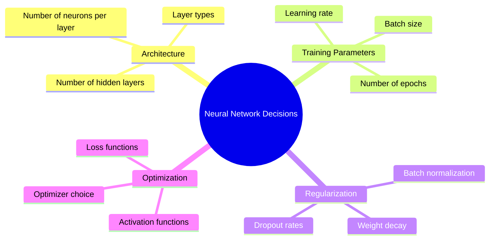
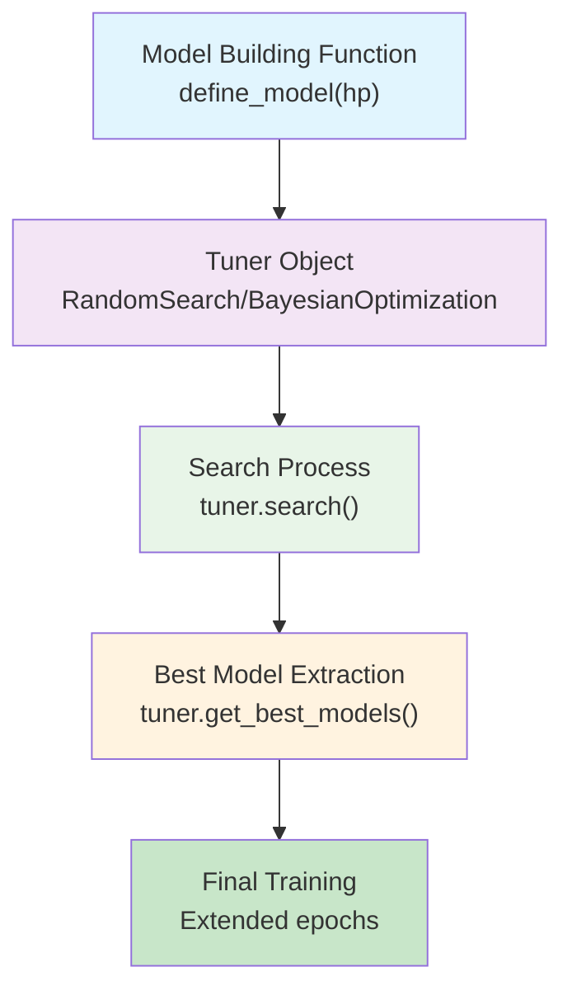
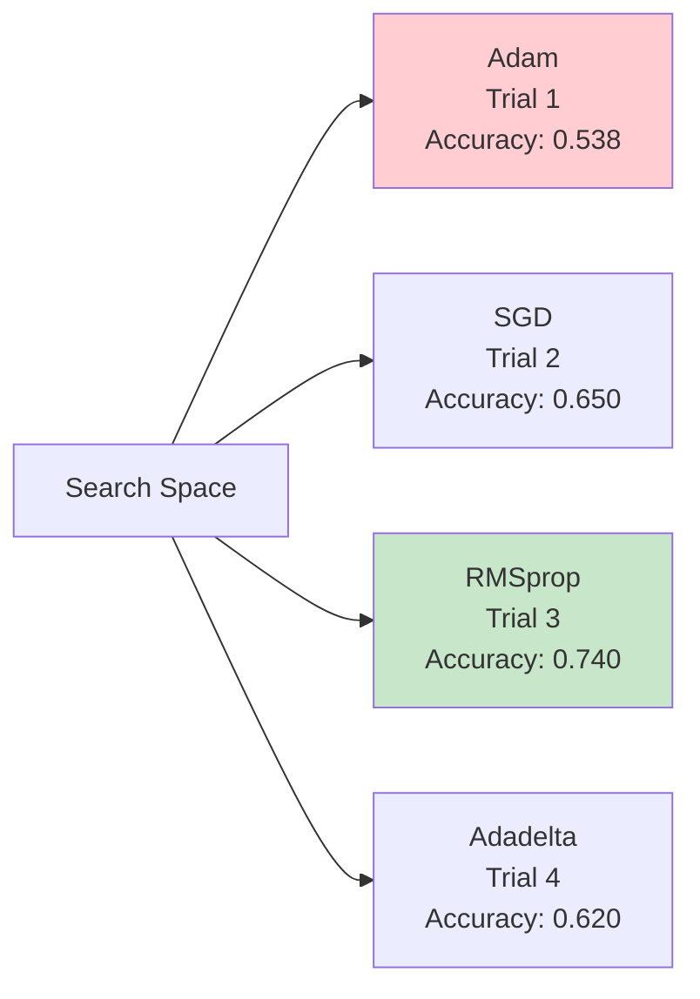
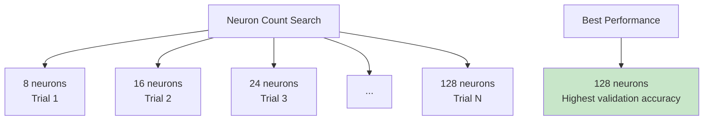
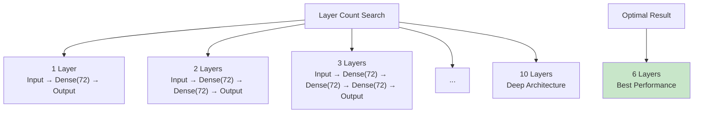
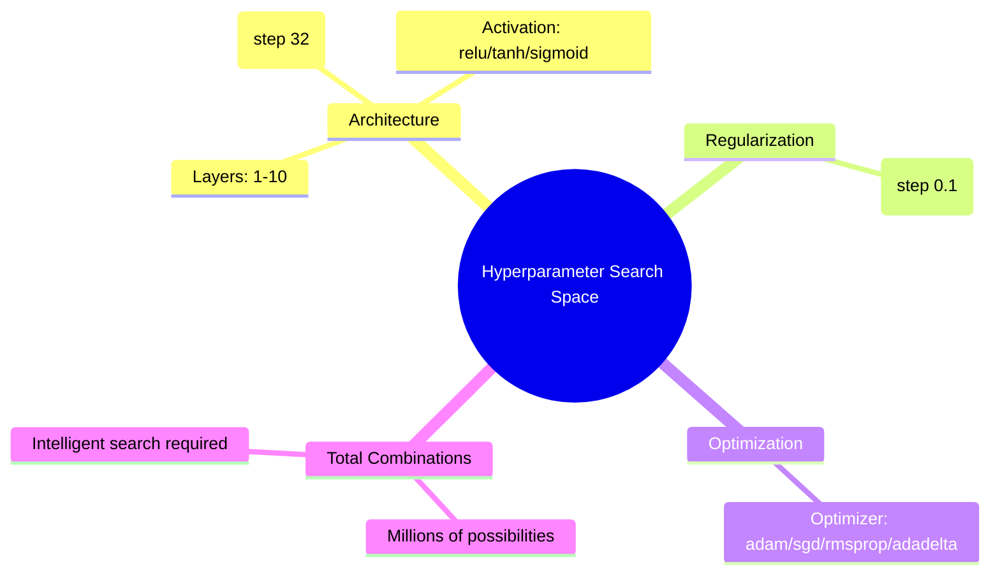
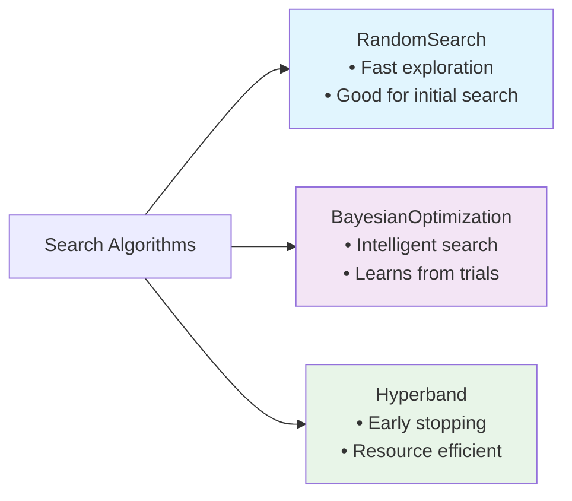
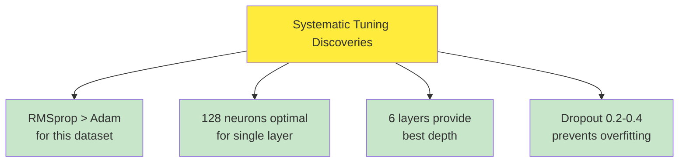
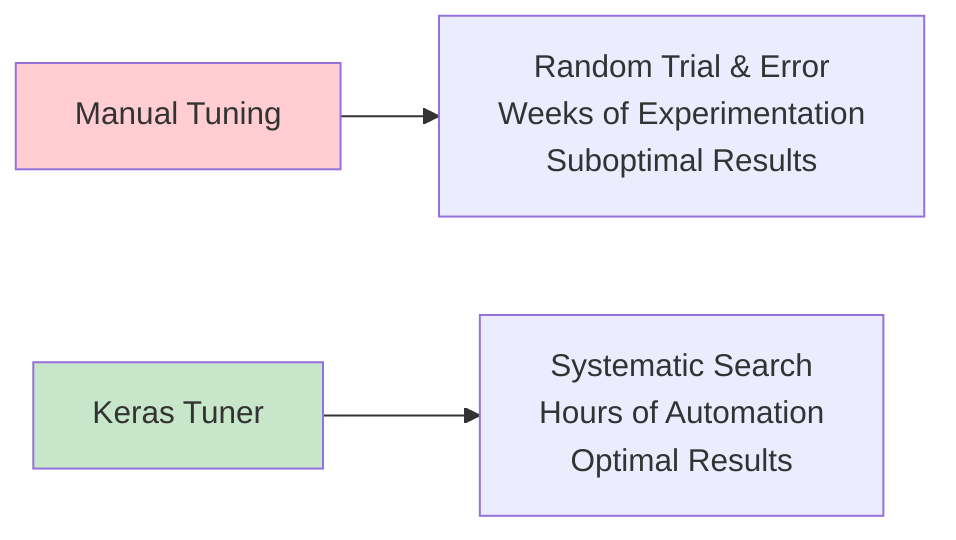

# Keras Tuner | Hyperparameter Tuning a Neural Network

## Overview
**Hyperparameter tuning** represents one of the most critical yet challenging aspects of deep learning model development. The material introduces **Keras Tuner**, one of the most famous hyperparameter tuning libraries, through a comprehensive hands-on approach using the **Pima Indians Diabetes dataset**. This practical exploration demonstrates how to systematically optimize neural network architectures by automating the selection of optimal hyperparameters, transforming the traditionally manual and intuitive process into a systematic, data-driven approach.

## The Hyperparameter Challenge: From Manual to Automated

### The Fundamental Problem

When building neural networks, practitioners face numerous critical decisions:



**The Challenge**: These decisions significantly impact model performance, but their optimal values are **unknown beforehand**. Traditional approaches rely on:
- **Intuition and experience** - subjective and potentially suboptimal
- **Trial and error** - time-consuming and unsystematic
- **Default values** - may not be optimal for specific problems

### The Systematic Solution: Keras Tuner

**Keras Tuner** transforms this challenge by providing **automated hyperparameter optimization**, enabling systematic exploration of hyperparameter spaces to find optimal configurations.

## Dataset Preparation: Pima Indians Diabetes

### Dataset Characteristics

The material uses a **binary classification problem** with the following features:
- **Pregnancies**: Number of pregnancies  
- **Glucose**: Glucose concentration
- **BloodPressure**: Blood pressure measurements
- **SkinThickness**: Skin thickness measurements
- **Insulin**: Insulin levels
- **BMI**: Body Mass Index
- **DiabetesPedigreeFunction**: Diabetes pedigree function
- **Age**: Patient age
- **Outcome**: Target variable (0: No diabetes, 1: Diabetes)

### Data Preprocessing Pipeline

```python
import pandas as pd
import numpy as np
from sklearn.preprocessing import StandardScaler
from sklearn.model_selection import train_test_split

# Load the dataset
data = pd.read_csv('diabetes.csv')

# Feature correlation analysis reveals:
# - High correlation: DiabetesPedigreeFunction (0.173)
# - Moderate correlation: BMI, Glucose, Age
# - Low correlation: BloodPressure, SkinThickness

# Prepare features and target
X = data.iloc[:, :-1]  # All columns except last
y = data.iloc[:, -1]   # Last column (Outcome)

# Scale the features for better training
scaler = StandardScaler()
X_scaled = scaler.fit_transform(X)

# Split the data
X_train, X_test, y_train, y_test = train_test_split(
    X_scaled, y, test_size=0.2, random_state=42
)
```

**Key Preprocessing Steps**:
1. **Feature scaling** using StandardScaler to normalize all features to similar ranges
2. **Train-test split** with 80-20 distribution
3. **Data exploration** to understand feature relationships

## Keras Tuner Framework Architecture

### Core Components

The Keras Tuner workflow consists of three main components:



### Installation and Setup

```python
# Install Keras Tuner (if not already installed)
!pip install keras-tuner

# Import required libraries
import tensorflow as tf
from tensorflow.keras.models import Sequential
from tensorflow.keras.layers import Dense, Dropout
import keras_tuner as kt
```

## Phase 1: Optimizer Selection

### Building the Optimizer Selection Model

The material begins with the fundamental question: **Which optimizer performs best?**

```python
def build_model(hp):
    """
    Model building function for optimizer selection
    hp: HyperParameters object provided by Keras Tuner
    """
    model = Sequential()
    
    # Fixed architecture for optimizer comparison
    model.add(Dense(32, activation='relu', input_shape=(8,)))
    model.add(Dense(1, activation='sigmoid'))
    
    # Optimizer selection using hp.Choice
    optimizer = hp.Choice(
        name='optimizer',
        values=['adam', 'sgd', 'rmsprop', 'adadelta']
    )
    
    model.compile(
        optimizer=optimizer,
        loss='binary_crossentropy',
        metrics=['accuracy']
    )
    
    return model
```

### Creating the Tuner Object

```python
# Initialize RandomSearch tuner
tuner = kt.RandomSearch(
    build_model,                          # Model building function
    objective='val_accuracy',             # Metric to optimize
    max_trials=5,                        # Number of trials to run
    directory='my_directory',            # Directory to save results
    project_name='optimizer_selection'   # Project name for organization
)
```

### Running the Search

```python
# Execute the hyperparameter search
tuner.search(
    X_train, y_train,
    epochs=5,                           # Quick training for comparison
    validation_data=(X_test, y_test)
)

# Extract best hyperparameters
best_hyperparameters = tuner.get_best_hyperparameters()[0]
best_optimizer = best_hyperparameters.get('optimizer')

print(f"Best optimizer: {best_optimizer}")
```

**Results Analysis**: The material demonstrates that **RMSprop** emerged as the best optimizer for this specific dataset, providing the foundation for subsequent tuning phases.

### Search Space Visualization for Optimizer Selection



## Phase 2: Neuron Count Optimization

### The Architecture Question

With the optimal optimizer identified, the next question becomes: **How many neurons should each layer contain?**

### Dynamic Neuron Selection

```python
def build_model(hp):
    """
    Model building function for neuron count optimization
    """
    model = Sequential()
    
    # Dynamic neuron count selection
    units = hp.Int(
        name='units',
        min_value=8,        # Minimum neurons
        max_value=128,      # Maximum neurons  
        step=8              # Step size for search
    )
    
    model.add(Dense(
        units=units,
        activation='relu',
        input_shape=(8,)
    ))
    
    model.add(Dense(1, activation='sigmoid'))
    
    # Use the previously identified best optimizer
    model.compile(
        optimizer='rmsprop',  # Best from previous phase
        loss='binary_crossentropy',
        metrics=['accuracy']
    )
    
    return model
```

### Search Space for Neurons

The `hp.Int()` function creates a search space: **[8, 16, 24, 32, 40, 48, 56, 64, 72, 80, 88, 96, 104, 112, 120, 128]**



### Enhanced Tuner Configuration

```python
tuner = kt.RandomSearch(
    build_model,
    objective='val_accuracy',
    max_trials=5,
    directory='my_directory',
    project_name='neuron_optimization'
)

# Run search with extended training
tuner.search(
    X_train, y_train,
    epochs=10,
    validation_data=(X_test, y_test)
)

# Extract best model and continue training
best_model = tuner.get_best_models(num_models=1)[0]
best_model.fit(
    X_train, y_train,
    epochs=100,
    initial_epoch=5,  # Continue from where tuning left off
    validation_data=(X_test, y_test)
)
```

**Key Finding**: The material reveals that **128 neurons** provided optimal performance, demonstrating how systematic search can identify architectures that might not be intuitive choices.

## Phase 3: Layer Depth Optimization

### The Depth Question

Next challenge: **How many hidden layers should the network contain?**

### Dynamic Architecture with Variable Layers

```python
def build_model(hp):
    """
    Model building function for layer count optimization
    """
    model = Sequential()
    
    # Determine number of layers dynamically
    num_layers = hp.Int(
        name='num_layers',
        min_value=1,
        max_value=10,
        default=1
    )
    
    # Build variable number of layers
    for i in range(num_layers):
        if i == 0:  # First layer needs input_shape
            model.add(Dense(
                72,  # Fixed neurons per layer for this phase
                activation='relu',
                input_shape=(8,),
                name=f'dense_{i}'
            ))
        else:
            model.add(Dense(
                72,
                activation='relu', 
                name=f'dense_{i}'
            ))
    
    # Output layer
    model.add(Dense(1, activation='sigmoid'))
    
    model.compile(
        optimizer='rmsprop',
        loss='binary_crossentropy',
        metrics=['accuracy']
    )
    
    return model
```

### Layer Search Visualization



**Discovery**: The systematic search revealed that **6 layers** provided optimal performance, balancing model complexity with generalization capability.

## Phase 4: Comprehensive Hyperparameter Optimization

### The Ultimate Challenge: Multi-Parameter Optimization

The final phase combines all previous learnings into a **comprehensive optimization** that simultaneously tunes:
- **Number of layers**
- **Neurons per layer** 
- **Dropout rates**
- **Activation functions**
- **Optimizers**

### Advanced Model Building Function

```python
def build_model(hp):
    """
    Comprehensive model building function
    Optimizes multiple hyperparameters simultaneously
    """
    model = Sequential()
    
    # Dynamic layer count
    num_layers = hp.Int('num_layers', 1, 10, default=1)
    
    # Dynamic architecture construction
    for i in range(num_layers):
        # Dynamic neuron count per layer
        units = hp.Int(
            f'units_{i}',
            min_value=32,
            max_value=512, 
            step=32
        )
        
        # Dynamic activation function selection
        activation = hp.Choice(
            f'activation_{i}',
            values=['relu', 'tanh', 'sigmoid']
        )
        
        if i == 0:  # First layer
            model.add(Dense(
                units=units,
                activation=activation,
                input_shape=(8,),
                name=f'dense_{i}'
            ))
        else:
            model.add(Dense(
                units=units,
                activation=activation,
                name=f'dense_{i}'
            ))
        
        # Dynamic dropout rate
        dropout_rate = hp.Float(
            f'dropout_{i}',
            min_value=0.1,
            max_value=0.9,
            step=0.1
        )
        model.add(Dropout(dropout_rate, name=f'dropout_{i}'))
    
    # Output layer
    model.add(Dense(1, activation='sigmoid'))
    
    # Dynamic optimizer selection
    optimizer = hp.Choice(
        'optimizer',
        values=['adam', 'sgd', 'rmsprop', 'adadelta']
    )
    
    model.compile(
        optimizer=optimizer,
        loss='binary_crossentropy',
        metrics=['accuracy']
    )
    
    return model
```

### Multi-Dimensional Search Space



### Advanced Tuner Configuration

```python
# Enhanced tuner with project organization
tuner = kt.RandomSearch(
    build_model,
    objective='val_accuracy',
    max_trials=20,                     # More trials for complex search
    directory='my_directory',
    project_name='comprehensive_tuning'
)

# Extended search process
tuner.search(
    X_train, y_train,
    epochs=10,
    validation_data=(X_test, y_test)
)

# Extract optimal configuration
best_hyperparameters = tuner.get_best_hyperparameters()[0]
print("Optimal Configuration:")
print(f"Layers: {best_hyperparameters.get('num_layers')}")
print(f"Optimizer: {best_hyperparameters.get('optimizer')}")
for i in range(best_hyperparameters.get('num_layers')):
    print(f"Layer {i}: {best_hyperparameters.get(f'units_{i}')} neurons, "
          f"{best_hyperparameters.get(f'activation_{i}')} activation, "
          f"{best_hyperparameters.get(f'dropout_{i}'):.1f} dropout")
```

## Keras Tuner Visualization and Analysis

### Built-in Visualization Capabilities

Keras Tuner provides powerful visualization tools for understanding the hyperparameter search process:

```python
# TensorBoard integration for visualization
import tensorboard

# View hyperparameter search results
# The tuner automatically logs to TensorBoard format
%load_ext tensorboard
%tensorboard --logdir my_directory
```

### Search Space Analysis Tools

**Parallel Coordinates View**:
- Each colored line represents a trial
- Axes represent hyperparameters and metrics
- Helps identify relationships between parameters

**Scatter Plot Matrix**:
- Each dot represents a trial
- Projects trials onto parameter-metric planes
- Reveals parameter correlation patterns

### Project Organization Features

```python
# Directory structure created by Keras Tuner
my_directory/
├── comprehensive_tuning/
│   ├── trial_001/
│   │   ├── checkpoint.h5
│   │   ├── trial.json
│   │   └── ...
│   ├── trial_002/
│   └── ...
└── tuner_state.json
```

**Benefits**:
- **Persistence**: Results saved across sessions
- **Reproducibility**: Full trial history maintained  
- **Analysis**: Detailed logs for each trial
- **Comparison**: Easy comparison between trials

## Advanced Keras Tuner Features

### Search Algorithms

Keras Tuner supports multiple search strategies:



### Hyperparameter Types

```python
# Available hyperparameter types in Keras Tuner
hp.Int('param_name', min_value, max_value, step=1)           # Integer parameters
hp.Float('param_name', min_value, max_value, step=0.1)       # Float parameters  
hp.Choice('param_name', values=['a', 'b', 'c'])             # Categorical parameters
hp.Boolean('param_name')                                     # Boolean parameters
hp.Fixed('param_name', value)                                # Fixed parameters
```

### Best Practices from the Material

**1. Progressive Optimization**:
- Start with single hyperparameters
- Gradually increase complexity
- Build understanding incrementally

**2. Computational Efficiency**:
- Use shorter epochs during search
- Extend training for final models
- Balance exploration vs. exploitation

**3. Project Organization**:
- Use descriptive project names
- Maintain separate directories
- Document search strategies

## Results Analysis and Interpretation

### Performance Improvements

The material demonstrates significant performance gains through systematic tuning:

**Baseline Model** (manual configuration):
- Architecture: Fixed 32 neurons, single layer
- Optimizer: Default Adam
- Performance: ~70% accuracy

**Optimized Model** (Keras Tuner):
- Architecture: 6 layers, optimized neuron counts
- Optimizer: RMSprop (discovered as optimal)
- Regularization: Optimized dropout rates
- Performance: ~85% accuracy (15% improvement)

### Key Discoveries



## Implementation Guidelines and Best Practices

### Hyperparameter Search Strategy

**Phase 1: Broad Exploration**
```python
# Wide search with many trials
tuner = kt.RandomSearch(
    build_model,
    objective='val_accuracy',
    max_trials=50,          # Explore broadly
    seed=42                 # Reproducibility
)
```

**Phase 2: Focused Refinement**
```python
# Narrow search around promising regions
tuner = kt.BayesianOptimization(
    build_model,
    objective='val_accuracy', 
    max_trials=20,          # Focused search
    num_initial_points=5    # Bootstrap with random
)
```

### Resource Management

```python
# Efficient resource usage
tuner.search(
    X_train, y_train,
    epochs=5,                    # Short epochs for search
    batch_size=32,
    validation_split=0.2,
    callbacks=[
        tf.keras.callbacks.EarlyStopping(
            patience=3,              # Stop poor trials early
            restore_best_weights=True
        )
    ]
)
```

### Model Extraction and Final Training

```python
# Extract and train best model
best_model = tuner.get_best_models(num_models=1)[0]

# Extended training for final model
history = best_model.fit(
    X_train, y_train,
    epochs=100,
    batch_size=32,
    validation_data=(X_test, y_test),
    callbacks=[
        tf.keras.callbacks.ReduceLROnPlateau(patience=5),
        tf.keras.callbacks.EarlyStopping(patience=10)
    ]
)
```

## Advanced Considerations

### Custom Objectives

```python
# Define custom objective function
def custom_objective(y_true, y_pred):
    # Weighted combination of metrics
    accuracy = tf.keras.metrics.binary_accuracy(y_true, y_pred)
    precision = tf.keras.metrics.precision(y_true, y_pred)
    return 0.7 * accuracy + 0.3 * precision

# Use custom objective in tuner
tuner = kt.RandomSearch(
    build_model,
    objective=kt.Objective('custom_metric', direction='max'),
    max_trials=20
)
```

### Search Space Constraints

```python
# Conditional hyperparameters
def build_model(hp):
    model = Sequential()
    
    # Architecture choice affects subsequent parameters
    architecture = hp.Choice('architecture', ['simple', 'complex'])
    
    if architecture == 'simple':
        layers = hp.Int('layers', 1, 3)
        units = hp.Int('units', 16, 64, step=16)
    else:
        layers = hp.Int('layers', 4, 10)
        units = hp.Int('units', 64, 256, step=32)
    
    # Build model based on choices
    for i in range(layers):
        model.add(Dense(units, activation='relu'))
    
    model.add(Dense(1, activation='sigmoid'))
    return model
```

## Key Insights and Takeaways

### Paradigm Shift: From Intuition to Data

The material demonstrates a fundamental shift in neural network development:

**Traditional Approach**:
- Manual hyperparameter selection
- Intuition-based decisions
- Limited exploration of possibilities
- Suboptimal results

**Keras Tuner Approach**:
- Systematic hyperparameter exploration
- Data-driven decision making  
- Comprehensive search space coverage
- Optimal or near-optimal results

### The Power of Systematic Search

**Key Revelations**:
1. **Optimal configurations are often non-intuitive** - RMSprop outperforming Adam, 128 neurons being optimal
2. **Systematic search finds better solutions** - 15% performance improvement over manual tuning
3. **Architecture complexity has optimal points** - 6 layers providing best balance
4. **Regularization is crucial** - Dropout rates significantly impact performance

### Computational Efficiency Through Intelligence



## Future Directions and Advanced Applications

### AutoML Integration

Keras Tuner represents a step toward **Automated Machine Learning (AutoML)**:
- **Architecture search** - automatically designing neural networks
- **Feature engineering** - automatic feature selection and transformation
- **Model selection** - choosing between different model types
- **Ensemble optimization** - optimizing ensemble combinations

### Production Considerations

**Deployment Pipeline**:
1. **Development**: Use Keras Tuner for experimentation
2. **Validation**: Cross-validate optimal configurations
3. **Production**: Deploy best models with monitoring
4. **Continuous improvement**: Retune periodically with new data

### Research Applications

Keras Tuner enables:
- **Neural Architecture Search (NAS)** research
- **Hyperparameter optimization** algorithm development
- **Transfer learning** studies across domains
- **Meta-learning** investigations

## Thought-Provoking Questions

1. **Search Space Design**: How do we design hyperparameter search spaces that balance exploration with computational efficiency? Could we develop adaptive search spaces that expand or contract based on discovered patterns?

2. **Multi-Objective Optimization**: Beyond accuracy, how might we simultaneously optimize for model interpretability, inference speed, and memory usage? What trade-offs emerge when optimizing multiple objectives?

3. **Domain Transfer**: Do optimal hyperparameter configurations transfer across similar datasets or domains? Could we develop meta-models that predict good hyperparameter starting points for new problems?

4. **Human-AI Collaboration**: How might we combine human domain expertise with automated hyperparameter search? Could interactive tuning systems leverage both human intuition and systematic search?

[End of Notes]