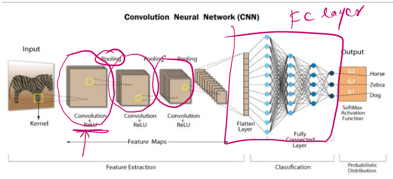
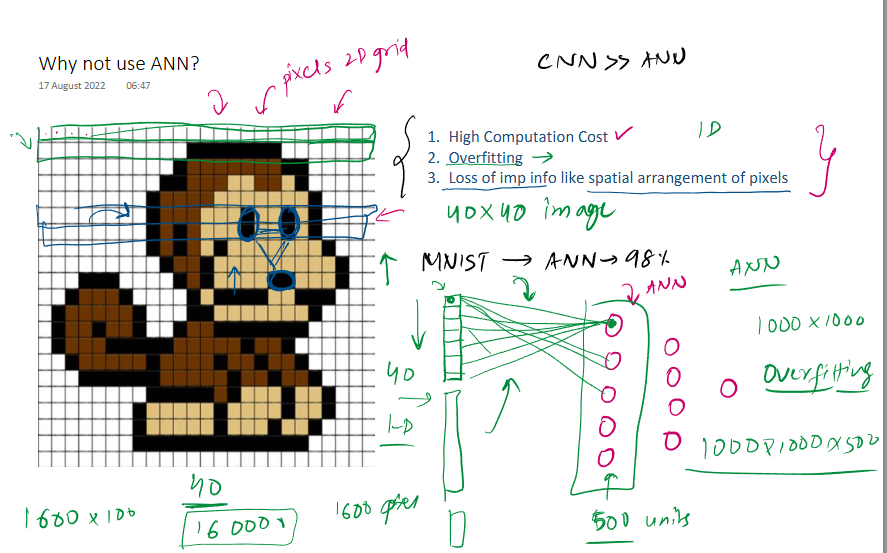
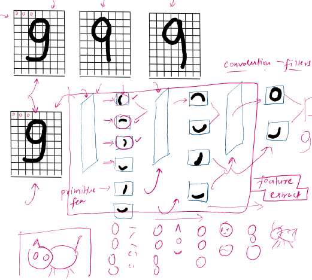

 

### **Holistic Deep Dive Summaries: Understanding Convolutional Neural Networks (CNNs)**

The material provides a comprehensive introduction to **Convolutional Neural Networks (CNNs)**, a crucial topic in Deep Learning, especially for processing image-based data. It marks a transition from foundational Artificial Neural Networks (ANNs) to more specialized architectures.

* **Core Idea & Importance:**
    * CNNs, also known as **ConvNets**, are a special type of neural network designed primarily for processing data with a known **grid-like topology**. This makes them exceptionally effective for tasks involving:
        * 1D data like **time series**.
        * 2D data like **images** (where pixels are arranged in a grid).
    * The source emphasizes that CNNs are incredibly important and widely used in numerous real-world applications today, from simple image recognition to complex systems like self-driving cars.

* **What Distinguishes a CNN?**
 
    * The defining feature of a CNN is the presence of at least one **convolution layer**.
    * Unlike traditional ANNs that rely heavily on matrix multiplication, CNNs employ a special mathematical operation called **convolution** within these layers.
    * A diagram in the source material illustrates a typical CNN architecture. It depicts a flow: Input -> Convolution Layer (with Kernel/Filter) -> Pooling Layer -> Convolution Layer -> Pooling Layer -> Flatten Layer -> Fully Connected Layer -> SoftMax Activation Function -> Output (Probabilistic Distribution, e.g., classifying an image as "Horse," "Zebra," or "Dog"). This process is broadly divided into two stages: **Feature Extraction** (performed by convolution and pooling layers) and **Classification** (performed by fully connected layers).
    * A typical CNN architecture comprises three main types of layers as identified in the source:
        1.  **Convolution Layer:** The core building block responsible for feature extraction.
        2.  **Pooling Layer:** Used to reduce dimensionality and create invariance.
        3.  **Fully Connected Layer (FC layer):** Similar to layers in ANNs, often used towards the end for classification based on extracted features.

* **Biological Inspiration & Historical Context:**
    * The design of CNNs is deeply inspired by the **human visual cortex**, the part of the brain responsible for processing visual information.
        * The provided material includes diagrams of the human brain, illustrating the visual pathway from the eyes via the **optic nerve** to the **Lateral Geniculate Nucleus (LGN)** of the **thalamus**, and then to the **visual cortex** located in the **occipital lobe** (showing areas like V1, V2, V3, V4, etc.). This pathway is crucial for how humans perceive and interpret visual scenes.
        * Groundbreaking experiments by **David Hubel and Torsten Wiesel** in the 1950s and 1960s provided key insights. The material depicts their experimental setup: an anesthetized cat was shown light bar stimuli of varying orientations projected onto a screen, while recordings were taken from neurons in its visual cortex.
        * These experiments revealed that specific neurons in the visual cortex are selectively responsive to particular orientations of edges and bars. This hierarchical processing of visual information is a cornerstone of CNN inspiration.
        * The findings, summarized in the material, describe:
            * **Simple cells**, which respond to stimuli like edges at specific orientations within a small **receptive field**. They act as feature detectors for basic elements.
            * **Complex cells**, which have larger receptive fields and also respond to oriented edges but are less sensitive to their exact position. They can be thought of as detecting more abstract or "higher-level" features by pooling information from simple cells.
        * This biological hierarchy—simple features being combined to form more complex features—is a direct analogue to the layered feature extraction process in CNNs.
    * **Historical Milestones:**
        * A key historical milestone was in **1998** when **Yann LeCun** and his team at AT&T Labs developed one of the first successful CNNs (often referred to as LeNet) for **handwriting recognition** (e.g., reading checks).
        * Following this, companies like **Microsoft** furthered the development of Optical Character Recognition (OCR) and handwriting recognition tools using CNN principles.
        * The source also notes the use of CNNs in facial detection and self-driving cars.

* **Why CNNs are Preferred Over ANNs for Image Data:**
    * While ANNs *can* process image data (e.g., the **MNIST dataset** for handwritten digit classification, where ANNs can achieve high accuracy, cited as 98% in the material), they face significant limitations, making CNNs a superior choice.
        * An image is fundamentally a 2D grid of pixels.
    * **Problems with using ANNs for images:**
        1.  **High Computational Cost:**
        
            * ANNs require flattening a 2D image into a 1D vector. The material provides an example: a 40x40 pixel image becomes a 1600-pixel vector. If this connects to a hidden layer with 100 neurons, it results in 1600 * 100 = 160,000 weights for just that first connection. For larger images (e.g., 1000x1000 pixels) and 500 hidden units, this number explodes (1000 * 1000 * 500 weights), leading to prohibitive computational demands and training times.
            * *A visual representation of flattening a 2D image grid into a 1D vector for an ANN, highlighting the numerous connections, is present in the source material.*
        2.  **Overfitting:**
            * The vast number of parameters (weights) in ANNs when applied to images makes them prone to **overfitting**. The model might learn the training data too well, including noise and minute details, leading to poor performance on unseen (test) data.
        3.  **Loss of Spatial Information:**
            * Flattening an image into a 1D vector destroys the **spatial arrangement of pixels**. Important features related to how pixels are structured in 2D are lost. CNNs, by their design, preserve and leverage this spatial information.

* **Intuition: How CNNs "See" and Learn from Images:**
    * The core intuition behind CNNs is hierarchical feature learning, mirroring how humans might recognize objects.
    * The challenge of recognizing a digit like '9' is that it can be written in many variations (illustrated in the source material on page 3 of the PDF, which shows several hand-drawn '9's).
    * CNNs address this by:
        1.  **Feature Extraction with Filters:** CNNs use **filters** (also called kernels) in their convolution layers. These filters are small matrices designed to detect specific **primitive features**. The material shows the digit '9' being broken down into such primitive features (like curves 'c', 'o', and lines '(', ')', '|'). Filters slide over the input image to detect these patterns.
        

        2.  **Hierarchical Feature Learning:**
            * Early convolution layers extract simple, low-level features (e.g., edges, basic shapes).
            * Subsequent layers take these initial features as input and combine them to learn more **complex features**. This is analogous to how simple cells feed into complex cells in the visual cortex.
    * The mathematical details of the **convolution operation**, **padding**, **stride**, and **pooling** are essential for a full understanding and are part of the planned learning path.

* **Diverse Applications of CNNs:**
    (The previous response detailed applications like Image Classification, Object Localization, Object Detection, Facial Detection/Recognition, Image Segmentation, Super-Resolution, Image Colorization, and Pose Estimation, which are generally known applications of CNNs and align with the type of content discussed, though page 4 of the PDF is only a title slide.)

* **Planned Learning Path for CNNs (as per the source):**
    The material outlines a structured plan to cover CNNs comprehensively:
    1.  **CNN Basics:**
        * **Biological connections** of CNNs.
        * Detailed explanation of the **Convolution** operation.
        * Concepts of **Padding and Stride**.
        * The **Pooling layer**.
        * Overall **CNN Architecture**.
    2.  Practical comparison: **CNN vs ANN**.
    3.  Hands-on project: Building a **Dog vs. Cat classifier**.
    4.  **Data Augmentation** techniques.
    5.  Study of popular and influential CNN Architectures:
        * **LeNet**
        * **AlexNet**
        * **VGGNet**
        * **ResNet**
        * **Inception**
    6.  **Transfer Learning**.

### **Key Element Spotlight & Intuition Building**

* **Convolutional Neural Network (CNN or ConvNet):** A specialized type of neural network highly effective for grid-like data (e.g., images). Its power comes from automatically learning spatial hierarchies of features.
* **Convolution Layer:** The primary building block of a CNN, applying **convolution operations** using **filters** to input data to create feature maps.
* **Filter (or Kernel):** A small matrix of weights learned by the convolution layer, specialized to detect specific features.
* **Pooling Layer:** Reduces the spatial dimensions of the input, aiding in computational efficiency and providing some translation invariance.
* **Fully Connected Layer (FC Layer):** Typically found at the end of a CNN, performs classification based on high-level features extracted by earlier layers.
* **Yann LeCun:** Pioneer in CNNs, developed LeNet for handwriting recognition around 1998.
* **Spatial Arrangement/Information:** The 2D (or 3D) organization of pixels, crucial for image understanding, which ANNs lose by flattening but CNNs preserve.
* **Hierarchical Feature Learning:** The process in CNNs where simple features (edges) are combined in deeper layers to form more complex features (shapes, object parts), mirroring biological vision.
* **Human Visual Cortex:** The part of the brain responsible for processing visual information, whose hierarchical structure and processing inspire CNN design. Includes the **Occipital Lobe** and pathways through the **Lateral Geniculate Nucleus (LGN)** of the **Thalamus**.
* **Hubel and Wiesel:** Neurophysiologists whose experiments on cats revealed how neurons in the visual cortex detect features like oriented edges.
* **Simple Cells:** Neurons in the visual cortex that respond to specific oriented stimuli within a small **receptive field**.
* **Complex Cells:** Neurons in the visual cortex that respond to oriented stimuli over a larger receptive field, showing more abstract feature detection.
* **Receptive Field:** The specific region of the sensory space (e.g., the visual field) in which a stimulus will trigger the firing of a neuron.
* **MNIST Dataset:** A standard dataset of handwritten digits used for training and testing image processing models.
* **Padding and Stride:** Parameters in convolutional operations that affect the output size and how the filter moves across the input.
* **Data Augmentation:** Techniques to artificially increase the diversity of the training set to improve model robustness.
* **Transfer Learning:** Reusing a pre-trained model on a new, related task, often leading to better performance with less data.
* **LeNet, AlexNet, VGGNet, ResNet, Inception:** Influential CNN architectures.

### **Visual Aid Integration for Enhanced Clarity**

* The source material contains a clear diagram of a CNN architecture, showing the progression from input image through convolution and pooling layers (Feature Extraction) to fully connected layers and softmax output (Classification).
* The diagram illustrating why ANNs are not ideal for images effectively shows the flattening of a 2D image to a 1D vector and highlights the resulting high number of parameters.
* The various handwritten examples of the digit "9" (Page 3 of PDF) visually demonstrate the variability that image recognition systems must handle.
* The breakdown of the digit "9" into primitive features like curves and lines offers a good visual analogy for how filters in CNNs might start by detecting basic components.
* The diagrams of the human visual pathway, including the Lateral Geniculate Nucleus, Thalamus, and Occipital Lobe with areas V1, V2, etc., help contextualize the biological inspiration for CNNs.
* The depiction of Hubel and Wiesel's experimental setup (cat observing light bars with neural recording) vividly explains how the orientation-selective properties of visual neurons were discovered.
* The conceptual summary of simple and complex cells responding to edges and features provides a direct link between neuroscience findings and CNN mechanisms.

### **Stimulating Learning Prompts for Deeper Reflection**

1.  Given the detailed insights from Hubel and Wiesel's experiments on how the visual cortex processes information hierarchically (simple cells for edges, complex cells for more abstract patterns), how can current CNN designs be further evolved to more closely mimic other sophisticated aspects of biological vision?
2.  The concept of "receptive fields" is crucial in both biological vision and CNNs. How might varying the sizes and strides of filters (which define receptive fields in CNNs) at different layers impact a CNN's ability to learn features at multiple scales, and what are the trade-offs?
 