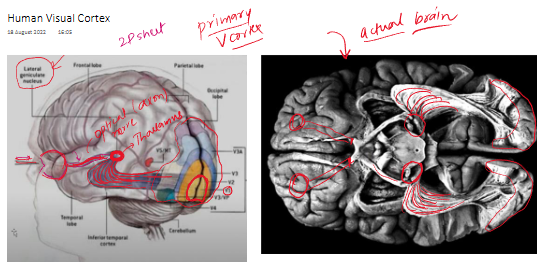
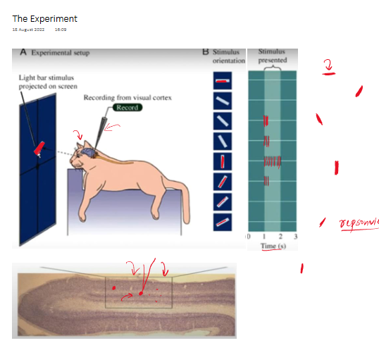
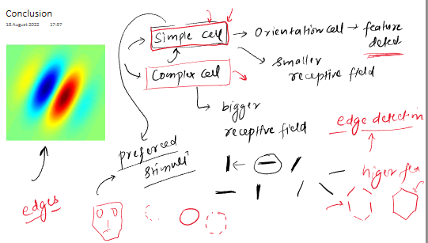
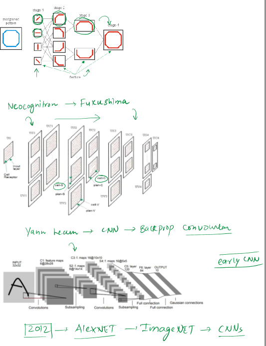

 
### Notes on the Biological Connection of Convolutional Neural Networks

The material explains that the architecture of **Convolutional Neural Networks (CNNs)** is not arbitrary but is deeply inspired by the workings of the **human visual cortex**, the part of our brain responsible for processing visual information. Understanding this biological connection provides insight into why CNNs are structured the way they are and why they are so effective for tasks involving visual data.

The content is structured into three main parts:
1.  The functioning of the human visual cortex.
2.  A landmark experiment that unveiled key mechanisms of visual processing.
3.  The findings from this experiment and their influence on the development of CNNs.

---

#### Part 1: The Human Visual Processing Pathway

* **Core Idea:** The journey of visual information from the eyes to the brain follows a specific, hierarchical pathway.
    * Light enters the eyes and strikes the **retina**, which the material describes as a "2D sheet" that captures light.
    * The retina converts this light into electro-chemical signals.
    * These signals travel via the **optic nerve** (a bundle of nerve fibers or "axons") to a crucial relay station in the brain called the **thalamus**.
        * Specifically, the information goes to the **Lateral Geniculate Nucleus (LGN)**, a part of the thalamus. The material notes its full name: "lateral geniculate nucleus."
    * In the thalamus (LGN), some initial **pre-processing** of the visual signals occurs.
    * From the thalamus, these electro-chemical signals (via axons, described as a "white color mass" in the actual brain image) are projected to the **visual cortex** located at the back of the brain.
    * The first area in the visual cortex to receive this information is called **V1**, also known as the **Primary Visual Cortex**.
        * **Importance:** V1 is the entry point for visual information into the cortex and begins the process of more complex analysis.
* **Visual Aid Integration (from source - Image 1: Human Visual Cortex):**
    * The first image provided illustrates this pathway.
        * The diagram on the left shows the eye, the optic nerve, the thalamus (with the LGN circled), and the optic radiations (axons) leading to the different areas of the visual cortex (V1, V2, V3, V4, V5/MT) in the occipital lobe. Key labels from the user's annotations like "optic axon," "Thalamus," "Lateral geniculate nucleus," and "primary V. cortex" point to these structures.
        * The image on the right shows an actual human brain's inferior view (looking from below). The user's annotation "actual brain" is noted. It highlights the path from where the optic nerve would enter (though cut in this specimen), to the thalamus, and then the connections fanning out towards the visual cortex areas. This visual helps solidify the physical reality of the described pathway.
    * **Purpose:** These visuals demonstrate the anatomical route visual information takes, making the abstract process more concrete.

#### Part 2: The Landmark Experiment by Hubel and Wiesel

* **Background:** Around the 1960s, two scientists, **David Hubel** and **Torsten Wiesel**, conducted a series of groundbreaking experiments on cats and monkeys to understand how cells in the visual cortex process information. This experiment is described as a "landmark experiment" because its findings were crucial for the development of CNNs.
* **Experimental Setup (as described and shown in Image 2: The Experiment):**
    * A cat was lightly anesthetized—it could see, and its brain was active, but its body wouldn't respond.
    * An **electrode** was inserted into the cat's visual cortex to record the electrical activity (firing) of individual neurons.
    * The cat was shown a screen where simple visual stimuli, like **light bars or edges**, were projected at different orientations.
    * The responses of the neurons to these stimuli were recorded.
    * **Visual Aid Integration (from source - Image 2: The Experiment):**
        * Image 2, section A ("Experimental setup"), shows the cat facing a screen, with an electrode recording from its visual cortex. A "Light bar stimulus" is projected. User annotations point to the recording electrode and the stimulus.
        * Section B ("Stimulus orientation" and "Stimulus presented") illustrates the core finding:
            * Different orientations of a bar stimulus are shown on the left.
            * The graph on the right shows the neuronal response (spikes) over time. User annotations highlight the increasing "responsive" nature of the neuron as the bar orientation changes.
        * The bottom part of Image 2 shows a microscopic view of brain tissue, likely representing the area where the electrode is recording ("Recording from visual cortex"). User annotations point to cells within this tissue.
    * **Purpose of Visuals:** To clearly depict the methodology of Hubel and Wiesel's experiment and graphically represent the selective response of neurons.
* **Key Observation:**
    * Individual neurons in the visual cortex did not respond to all stimuli equally.
    * Instead, specific neurons fired vigorously only when presented with lines or edges of a **particular orientation**.
        * **Example:** One cell might respond strongly to a vertical bar, moderately to a slightly tilted bar, and not at all to a horizontal bar. Another cell in a different location might show the opposite preference, responding maximally to a horizontal bar.
    * The material emphasizes this by stating, "this particular cell is good at detecting this type of edge."
* **Intuition Building:** This discovery was profound because it suggested that the visual system breaks down complex scenes into simpler components, like edges at different angles, at the very early stages of processing.

#### Part 3: Experimental Findings and their Influence on CNNs

* **Two Key Types of Cells in the Visual Cortex:** Hubel and Wiesel's experiments led to the identification of different types of cells involved in visual processing:
    1.  **Simple Cells:**
        * Also referred to as **orientation cells** or **feature detectors**.
        * They have a **smaller receptive field**, meaning they respond to stimuli in a small, specific region of the visual field.
        * They operate on the principle of **preferred stimulus**: each simple cell is tuned to detect a specific type of edge (e.g., vertical, horizontal, or a particular diagonal).
        * **Primary function:** **Edge detection**. The material notes, "Nature's way of processing visual information is that... simple cells detect all the edges." This is crucial because "any image you pick up is ultimately made of edges."
    2.  **Complex Cells:**
        * They have a **larger receptive field** than simple cells, allowing them to process information from a wider area of the visual field.
        * They receive input from multiple simple cells.
        * **Primary function:** To detect more **higher-level or complex features/patterns** by combining the simpler edge information from simple cells.
            * **Example:** If simple cells detect various oriented edges, a complex cell might combine these to recognize a corner, a curve, or a more intricate shape like a hexagon.
* **Hierarchical Processing:** The findings revealed a **hierarchical processing model** in the visual cortex: simple features (like edges) are detected first, and then these are combined to form more complex features. This is a foundational concept directly mirrored in CNNs.

* **From Biology to Artificial Neural Networks:**

    * This understanding of hierarchical feature detection in the brain directly inspired early attempts to build artificial vision systems.
    * **Neocognitron:**
        * Developed by **Dr. Kunihiko Fukushima**, a Japanese scientist.
        * Designed for Japanese character pattern recognition.
        * It featured layers of **S-cells** (Simple cells) and **C-cells** (Complex cells), mimicking the biological hierarchy. S-cells detected simple features, and C-cells combined them into more complex patterns.
        * **Limitation:** While a pioneering model, the material states it "wasn't that robust and didn't work that well."
    * **Yann LeCun's CNN Architecture (1990s):**
        * A significant advancement built upon these ideas.
        * **Dr. Yann LeCun** (a key figure in deep learning) introduced an architecture that used:
            * **Convolutional layers:** These act like the simple cells, applying filters to detect features (like edges) across an image. This concept of a "small receptive field" that scans the image is central.
            * **Pooling layers (subsampling layers):** These help in making the feature detection robust to variations in location and also reduce dimensionality, somewhat analogous to how complex cells integrate information over larger receptive fields and achieve some degree of spatial invariance.
            * **Backpropagation:** Crucially, LeCun's model used backpropagation for training, allowing the network to learn the optimal feature-detecting filters automatically from data.
        * **Application:** Initially used for recognizing handwritten digits on bank checks ("scan check"), and it "performed really well."
        * **Significance:** This architecture laid the groundwork for modern CNNs and "marked the beginning of serious research into CNNs."
    * **AlexNet (2012):**
        * A deep CNN model that won the **ImageNet competition** (a large-scale visual recognition challenge).
        * **Significance:** This event is often cited as a watershed moment that dramatically demonstrated the power of deep CNNs and led to the explosion of research and applications in the field. The material mentions that after AlexNet, "many more CNNs started appearing."
* **Visual Aid Suggestion:** A flowchart illustrating the progression from biological discovery (Hubel & Wiesel's findings on simple/complex cells) to early AI models (Neocognitron) and then to modern CNNs (LeCun's architecture, AlexNet) would be beneficial here. This would visually map the historical and conceptual lineage.

---

#### Stimulating Learning Prompts:

1.  The human visual system processes information hierarchically, from simple edges to complex objects. How might this hierarchical approach contribute to the robustness and efficiency of our vision compared to a system that tries to recognize whole objects directly without intermediate steps?
2.  The Neocognitron, despite being directly inspired by simple and complex cells, wasn't as successful as later CNNs that incorporated backpropagation. What does this suggest about the importance of learning mechanisms versus architectural mimicry in creating effective AI systems?
 