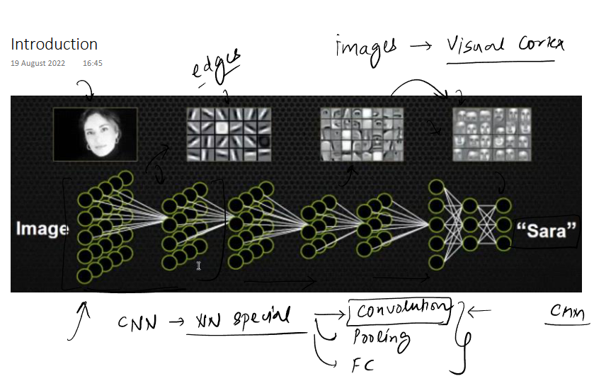
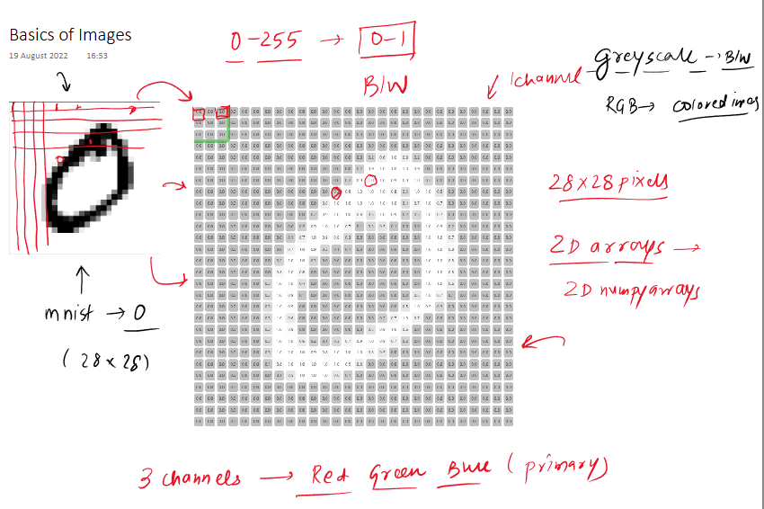
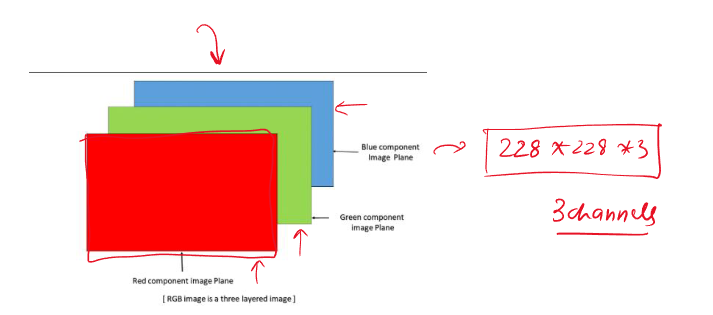
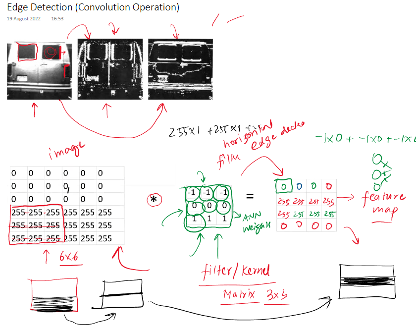
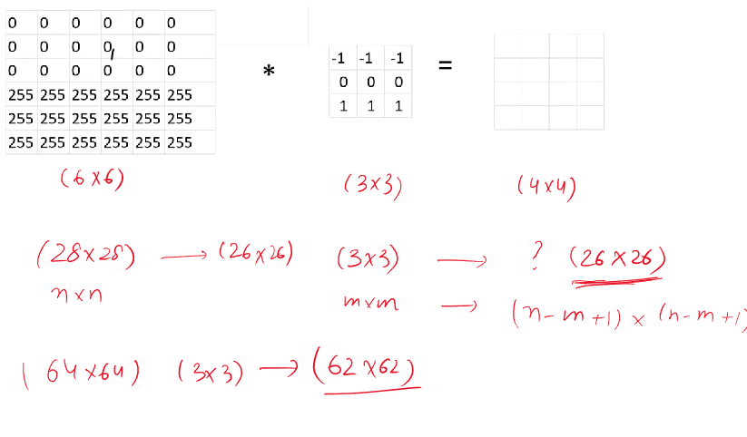

 
### Deep Dive into Convolutional Neural Networks & the Convolution Operation

The material introduces **Convolutional Neural Networks (CNNs)** as a special type of neural network, particularly effective for image-related tasks. Their architecture is inspired by the human **visual cortex**.

* **Core Idea of CNNs:**
    * CNNs learn to detect features in images in a hierarchical manner.
    * Early layers detect simple **primitive features** like **edges**.
    * Subsequent layers combine these simple features to identify more **complex patterns** (e.g., parts of an object like eyes or a nose from edges).
    * Finally, these complex patterns are used for tasks like classification (e.g., identifying a complete face).
    * This process is illustrated by an image showing an input face, then layers detecting edges, then more complex facial features, and finally identifying "Sara."

* **Key Components of CNNs:**
    * **Convolution Layer:** The primary building block, responsible for feature detection using filters. This is the main focus of the material.
    * **Pooling Layer:** Often follows convolution layers to reduce dimensionality.
    * **Fully Connected Layer (Dense Layer):** Typically used at the end of the network for classification based on the learned features.

* **Importance of Understanding Image Representation:**

    * To grasp CNNs, it's crucial to understand how images are stored in computer memory.
    * **Grayscale Images (Black & White):**
        * Represented as a 2D array (grid) of **pixels**.
        * Each pixel has a single intensity value, typically ranging from 0 (black) to 255 (white). This range can be normalized to 0-1.
        * The material uses an MNIST dataset image (a handwritten digit '0') of size 28x28 pixels as an example. A visual shows this digit and its corresponding pixel grid.
        * These are single-channel images.
        
    * **RGB Images (Color Images):**
        * Composed of three **channels**: Red, Green, and Blue (primary colors).
        * Each channel is like a separate grayscale image, representing the intensity of that color.
        * An RGB image is essentially three 2D arrays stacked together. For example, an image of size 228x228 would have dimensions 228x228x3.
        * A visual effectively shows this concept with three separate colored planes (Red, Green, Blue) combining to form the color image.

---

### The Convolution Operation: The Heart of CNNs

The **convolution operation** is fundamental for extracting features from an image. It's explained primarily through the example of **edge detection**.


* **What are Edges?**
    * Edges represent an abrupt change in pixel intensity. The material shows an image of a van and its versions after horizontal and vertical edge detection, highlighting these intensity changes.

* **How Convolution Works (for Edge Detection):**
    1.  **Filter (or Kernel):**
        * A small matrix of numbers (e.g., 3x3). This filter is designed (or learned) to detect a specific feature, like a horizontal or vertical edge.
        * The material provides an example of a 3x3 **horizontal edge detector filter**:
            ```
            -1 -1 -1
             0  0  0
             1  1  1
            ```
        * The significance of this filter is that it will produce a strong positive response (high value) when it encounters a change from dark pixels above to bright pixels below (a horizontal edge).
    2.  **The Convolution Process:**
        * The filter "slides" or "convolves" across the input image.
        * At each position, an **element-wise multiplication** is performed between the filter values and the overlapping pixel values in the image.
        * The results of these multiplications are then summed up to produce a single value.
        * This single value becomes a pixel in the **Feature Map (or Activation Map)**.
        * The material provides a detailed walkthrough:
            * An input image of 6x6 pixels (top half 0s - black, bottom half 255s - white) is shown.
            * The 3x3 horizontal edge detector filter is convolved over this image.
            * When the filter is over regions of uniform intensity (all black or all white), the output is 0.
            * When the filter is positioned over the horizontal edge (where 0s are above 255s in the image window), the calculation `(-1*0 + -1*0 + -1*0) + (0*0 + 0*0 + 0*0) + (1*255 + 1*255 + 1*255)` (or similar, depending on exact overlap) results in a high value (e.g., 765, though the example output shows 255, implying normalization or a specific setup). This high value in the feature map indicates the presence of the detected feature (a horizontal edge).
            * The resulting feature map is 4x4.
    3.  **Feature Map:**
        * The output of the convolution operation. It highlights the locations in the input image where the specific feature detected by the filter is present.
        * The example shows a feature map with high values (255) in the middle rows, corresponding to the detected horizontal edge in the 6x6 input.
        * *A visual illustrating the filter sliding across the input image, with callouts for element-wise multiplication and summation at one step, would be very helpful here to solidify understanding.*

[Link for the Interactive Demo](https://deeplizard.com/resource/pavq7noze2)
* **Calculating Output Size (Feature Map Dimensions):**
    * If an input image is $N \times N$ and the filter is $M \times M$, the output feature map will be $(N-M+1) \times (N-M+1)$.
    * **Example:** Input 6x6, Filter 3x3 -> Output (6-3+1)x(6-3+1) = 4x4.
    * **Question from material:** Input 28x28, Filter 3x3 -> Output (28-3+1)x(28-3+1) = 26x26.

* **Different Filters for Different Features:**
    * By changing the values in the filter matrix, different features can be detected.
    * A **vertical edge detector** is mentioned with values like:
        ```
        -1  0  1
        -1  0  1
        -1  0  1
        ```
    * The material emphasizes that in deep learning, these **filter values are not manually designed but are learned automatically** by the CNN during the training process through backpropagation, much like weights in a standard neural network. This is a key advantage, allowing the network to discover the most relevant features for the task at hand.

* **Interactive Demo (setosa.io):**
    * The material describes a valuable interactive demo (from `setosa.io/ev/image-kernels/`) that visualizes the convolution process.
    * It shows a filter sliding over an MNIST digit.
    * The demo output uses colors: **Red** for positive activations (feature detected, e.g., a left edge if using a left-edge filter) and **Blue** for negative activations (e.g., a right edge, if it's the opposite of what the filter seeks).
    * The importance of applying an activation function like **ReLU (Rectified Linear Unit)** after convolution is highlighted. ReLU (`max(0, x)`) would turn all negative (blue) values in the feature map to zero, keeping only the positive (red) activations, thus focusing on the presence of the desired feature.

---

### Convolution on Color (RGB) Images

* When dealing with color images (e.g., 3 channels: Red, Green, Blue), the **filter must also have the same number of channels (depth)**.
* If the input image is, say, $N \times N \times 3$, a $M \times M$ filter will actually be $M \times M \times 3$.
    * The material visualizes this as the input image being a cuboid and the filter also being a smaller cuboid with the same depth. A GIF is mentioned showing this 3D filter sliding across the 3D image.
* **Convolution Process for Multi-Channel Images:**
    * During convolution, the 3D filter is applied. This involves element-wise multiplication and summation across all three channels simultaneously (e.g., for a 3x3x3 filter, there are 27 multiplications and additions).
    * Crucially, the output of convolving a multi-channel image with a single multi-channel filter is a **single-channel (2D) feature map**.
    * **Example from material:** Input $6 \times 6 \times 3$, Filter $3 \times 3 \times 3$ -> Output Feature Map $4 \times 4 \times 1$.
    * The formula for output size remains $(N-M+1) \times (N-M+1)$ for the spatial dimensions, and the depth becomes 1.

---

### Using Multiple Filters

* In practice, CNNs apply **multiple filters** at each convolution layer. Each filter learns to detect a different feature.
* If you apply $K$ different filters to an input, you will get $K$ separate feature maps.
* These $K$ feature maps are then stacked together to form the output volume.
* **Example from material:**
    * Input: $6 \times 6 \times 3$ (assuming a color image, though the example image shown before this part was grayscale $6 \times 6$). Let's assume the input to this specific stage is $H \times W \times D_{in}$.
    * If we use $K$ filters, each of size $M \times M \times D_{in}$.
    * The output will be $(H-M+1) \times (W-M+1) \times K$.
    * The material uses an example: If a $6 \times 6$ (single channel) image is convolved with two different $3 \times 3$ filters, the output will be two $4 \times 4$ feature maps. These can be stacked to form a $4 \times 4 \times 2$ output volume. This output volume then serves as input to the next layer.
    * The number of channels in the output of a convolution layer is equal to the **number of filters used**.

---

### Key Takeaways & Next Steps from the Material

* The convolution operation is a powerful way to extract features by applying filters.
* Filter values are learned during training, making CNNs highly adaptable.
* The output of a convolution operation is a feature map, indicating the presence of specific features.
* For multi-channel images, filters also have multiple channels, but their convolution still results in a single-channel map per filter.
* Using multiple filters allows the network to learn a rich set of features. The number of filters determines the depth of the output volume.
* The material mentions that upcoming topics will include **Strides, Padding, and Pooling**, which are other important concepts in CNNs.

---

### Stimulating Learning Prompts:

1.  How does the size of the filter (e.g., 3x3 vs. 5x5) potentially impact the types of features detected and the resulting feature map size?
2.  Considering that filter values are learned, how might the network learn a filter to detect, for instance, a diagonal edge, and what might such a filter matrix look like?
3.  Why is it beneficial to produce a single-channel feature map from a multi-channel input when using one multi-channel filter, before stacking outputs from multiple such filters?

[End of Notes]