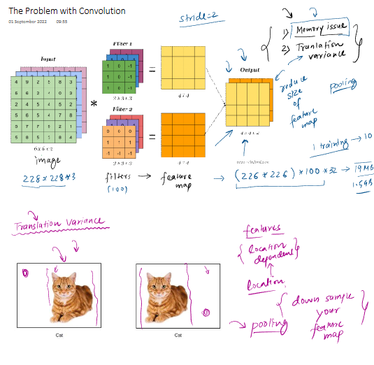
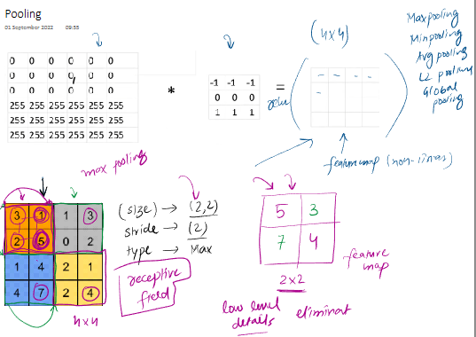
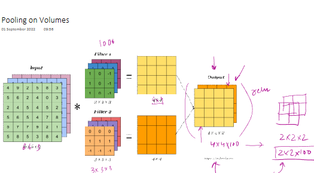
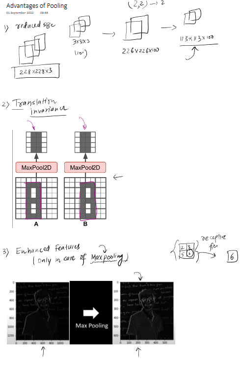
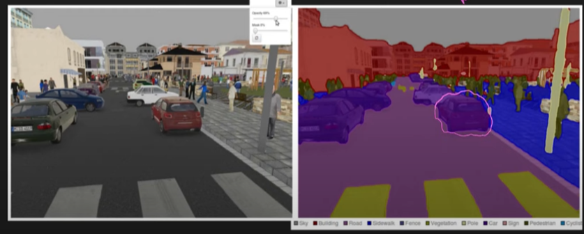

### Holistic Deep Dive Summaries with Enhanced Engagement

The material introduces **Pooling** as a crucial layer in **Convolutional Neural Networks (CNNs)**, typically added after a **convolution layer** and a non-linear activation function (like **ReLU**). Its primary purpose is to progressively reduce the spatial size of the representation (feature maps), which helps in managing computational complexity, controlling overfitting, and achieving a degree of translation invariance.

- **The Problem Addressed by Pooling:**

  - **Memory Issues:** Convolution operations, especially in deep networks, can generate very large **feature maps**. The source highlights an example where a 228x228x3 input image, processed by 100 3x3 filters, results in a feature map of 226x226x100. Storing this (especially with 32-bit floats) can take significant memory (~19MB for one image, ~1.5GB for a small batch), potentially crashing the program. Pooling helps by **reducing the size of the feature map**.
    

  - **Translation Variance:** Standard convolution layers are sensitive to the location of features. This means if an object (like a cat) shifts slightly in the image, the resulting feature map will also change significantly. For tasks like image classification, the exact location of a feature (e.g., a cat's ear) is less important than its presence. Convolution operations are **translation variant**. Pooling aims to introduce **Translation Invariance**, making the network more robust to the position of features. It achieves this by **downsampling** the feature map, which makes the subsequent layers less sensitive to the precise location of the features detected in earlier layers.

- **How Pooling Works:**
  
  [DeepLizard Resource](https://deeplizard.com/resource/pavq7noze3)

  - Pooling operates on a feature map by dividing it into a set of non-overlapping (or sometimes overlapping) regions, called **pooling windows** (defined by a **size**, e.g., 2x2 pixels), and then summarizing the features in each window with a single value.
  - The window slides across the feature map with a specified **stride** (e.g., a stride of 2 means the window moves 2 pixels at a time).
  - The summarization is done by an aggregation function. Common types include:
    - **Max Pooling:** Selects the maximum value from each window. This is the most common type.
    - **Average Pooling:** Calculates the average of the values in each window.
    - **Min Pooling:** Selects the minimum value (less common).
    - **Global Pooling:** Reduces the entire feature map (per channel) to a single value. For instance, **Global Max Pooling** takes the single maximum value from the entire feature map. This is often used at the end of a network to reduce dimensionality before a fully connected layer.
  - The material provides an example of **Max Pooling**: Given a 4x4 feature map and a 2x2 pooling window with a stride of 2, the operation would take the max value from each 2x2 quadrant, resulting in a 2x2 output feature map.
    - _Visual Reference:_ The image `image_078a0d.png` (second uploaded image) illustrates this with a 4x4 input, a 2x2 window, stride 2, and type 'Max', showing how values like (3,1,2,5) are pooled to 5.

- **Pooling on Volumes (e.g., RGB images with multiple channels):**
  
  _ If the input to the pooling layer is a volume (e.g., multiple feature maps from different filters), pooling is applied independently to each slice (channel) of the volume. For example, if an input has 100 feature maps (channels), pooling will produce an output with 100 pooled feature maps.
  _ _Visual Reference:_ The image `image_0789f1.png` (third uploaded image) depicts pooling on volumes, showing an input of 6x6x3, two filters producing 4x4 feature maps, and then pooling reducing them to 2x2, resulting in a 2x2x100 output if 100 filters were used.

### Key Element Spotlight & Intuition Building

- **Pooling:** A **downsampling operation** used in CNNs to reduce the spatial dimensions (width and height) of feature maps.
  - _Significance:_ Helps reduce computational load, memory usage, and introduces a degree of translation invariance. It does this by summarizing features in a local neighborhood.
- **Feature Map:** The output of a convolution layer, representing learned features at different spatial locations in the input.
  - _Significance:_ Pooling operates on these feature maps to condense the information.
- **Convolution Layer:** A layer that applies learnable filters to an input image or feature map to detect patterns like edges, textures, etc.
  - _Significance:_ Pooling layers are almost always used in conjunction with and following convolution layers.
- **Stride (for pooling):** The number of pixels by which the pooling window moves across the feature map.
  - _Significance:_ A stride equal to the window size results in non-overlapping windows. A stride of 2 with a 2x2 window effectively halves the dimensions of the feature map.
- **Size (pooling window):** The dimensions of the small region of the feature map from which a single value is extracted (e.g., 2x2).
  - _Significance:_ Determines the extent of downsampling.
- **Max Pooling:** A specific type of pooling where the maximum value within each pooling window is taken.
  - _Significance:_ It's the most popular pooling method. The intuition is that it captures the most prominent feature (highest activation) within a local region, discarding less important activations. This helps in retaining strong features while reducing dimensionality. The material suggests it can lead to **enhanced features** by focusing on dominant characteristics.
- **Average Pooling:** A type of pooling where the average of all values within each pooling window is taken.
  - _Significance:_ Provides a more smoothed-out downsampling compared to max pooling.
- **Global Pooling (Global Max Pooling, Global Average Pooling):** A pooling operation that reduces the entire feature map (for each channel) to a single value.
  - _Significance:_ Often used towards the end of a CNN to drastically reduce dimensions before a fully connected layer, acting as an alternative to flattening and potentially reducing overfitting. The material mentions it can replace the "flatten" step.
- **Translation Variance:** A property where the output changes if the input is translated (shifted). Convolutional layers are inherently translation variant.
  - _Significance:_ This is undesirable for tasks where the object's location shouldn't affect its classification.
- **Translation Invariance:** A desirable property where the output remains the same (or very similar) even if the input is translated.
  - _Significance:_ Pooling helps achieve this by making the network less sensitive to the exact locations of features. The material shows an example where a slightly shifted "A" character, after max pooling, results in an identical feature map.
- **Downsampling:** The process of reducing the spatial resolution of a feature map.
  - _Significance:_ Pooling is a primary method for downsampling in CNNs.
- **Receptive Field (in the context of pooling):** The local area in the input feature map that a pooling operation considers to compute a single output value.
  - _Significance:_ Max pooling, for example, picks the most dominant feature within this local receptive field.
- **ReLU (Rectified Linear Unit):** An activation function often applied after convolution and before pooling. It introduces non-linearity by outputting the input directly if it's positive, and zero otherwise.
  - _Significance:_ Pooling is typically applied to the output of such non-linear activations.
- **Keras Implementation (`MaxPooling2D`):** A class in the Keras library for adding a max pooling layer. It requires specifying `pool_size` and `strides`.
  - _Significance:_ Shows how pooling is practically implemented in deep learning frameworks. Notably, pooling layers have **no trainable parameters**.

### Visual Aid Integration for Enhanced Clarity

- **The Problem with Convolution (Memory and Translation Variance):** The first image (`image_078a2c.png`) visually explains these two problems.
  - _Memory Issue:_ It shows an input image (e.g., 228x228x3) being convolved by filters to produce feature maps. It then calculates the large memory footprint (e.g., 226x226x100 leading to 19MB for one training example, 1.5GB for a batch). This highlights the need to reduce feature map size.
  - _Translation Variance:_ It shows two images of a cat, one with the cat in the center and another with the cat shifted. It explains that features become location-dependent, which is an issue. Pooling is introduced as a solution to "down sample your feature map" to achieve location independence.
- **Pooling Operation Example:** The second image (`image_078a0d.png`) clearly illustrates **Max Pooling**.
  - It shows a 4x4 input feature map with numerical values. A 2x2 pooling window (receptive field) slides across this map with a stride of 2. For each window, the maximum value is selected to form a new 2x2 feature map. This visual effectively demonstrates the mechanics of max pooling and how it reduces dimensionality while picking dominant features. The text also mentions eliminating "low-level details."
- **Pooling on Volumes:** The third image (`image_0789f1.png`) shows how pooling is applied when you have multiple feature maps (a volume).
  - An input (e.g., 6x6x3) is convolved by multiple filters (e.g., 3x3x3) to produce multiple 4x4 feature maps. Pooling is then applied to each 4x4 feature map independently to get multiple 2x2 feature maps. If there are 100 filters, the output after pooling would be 2x2x100.
- **Advantages of Pooling:** The fourth image (`image_0789d2.png`) summarizes the advantages:
  
  _ **Reduced Size:** Visually shows how a stack of 228x228x3 feature maps, after convolution (e.g., by 3x3x3 filters resulting in 226x226x100), is reduced by pooling (2x2 window, stride 2) to 113x113x100.
  _ **Translation Invariance:** Shows two slightly different positioned "A" characters in input feature maps, and after `MaxPool2D`, the output feature maps are identical, demonstrating how pooling helps ignore small shifts. \* **Enhanced Features (Max Pooling):** Shows an image becoming sharper or having more pronounced edges after max pooling, illustrating how it might highlight dominant features. It mentions a "receptive field" and picking the max value (e.g., 6 from {2,1,5,6}).
- **Types of Pooling:** The sixth image (`image_078996.png`) lists **Max pooling**, **Avg Pooling**, and **Global Pooling** (Global max, Global avg).
  - It illustrates global pooling by showing how a 4x4x3 feature map could be reduced to a 1x1x3 (or a vector of length 3) by taking one value (e.g., the max or average) from each of the three 4x4 channels. It also mentions that global pooling is often used "in the end" to "flatten" before a "FC" (Fully Connected) layer.
- **Disadvantages of Pooling:** The seventh image (`image_07897b.png`) highlights a key disadvantage.
  - It shows an image from a semantic segmentation task (where precise location is important) and mentions that pooling can "lose a lot of information" (e.g., a 4x4 region with 16 values is reduced to a 2x2 region with 4 values, or even a single value). This information loss can be detrimental for tasks requiring detailed spatial awareness.
   
- _Suggestion for Visual Aid:_ A flowchart showing the typical sequence in a CNN block (Input -> Convolution -> ReLU -> Pooling -> Output to next block) would be helpful for understanding the placement and role of pooling within the broader architecture.

### Insightful Clarity, Conciseness, and Example Integration

- **Core Idea:** Pooling is a form of non-linear downsampling. It reduces the dimensionality of intermediate feature maps, which serves multiple purposes:
  1.  **Reduces computational load** for subsequent layers.
  2.  **Reduces memory requirements.** (Example: from 226x226x100 to 113x113x100 with 2x2 pooling, stride 2).
  3.  Provides basic **translation invariance** to the features learned by the convolutional layers. (Example: the shifted 'A' yielding the same pooled output).
- **Mechanism of Max Pooling:**
  - A window (e.g., 2x2) slides over the feature map.
  - A stride (e.g., 2) dictates the movement of this window.
  - From the values covered by the window, only the maximum value is passed to the output feature map. This is an **aggregate operation**.
  - This inherently discards information but retains the strongest signals in local regions.
- **No Trainable Parameters:** Pooling layers perform a fixed operation (e.g., find maximum). They do not have weights that are learned during the training process, unlike convolutional layers. This makes them computationally efficient and "faster."
- **Keras Example:** The material mentions `MaxPooling2D` in Keras, where `pool_size` (e.g., (2,2)) and `strides` (e.g., 2) are specified. The model summary shows the output dimension halving after a max pooling layer with these parameters and zero trainable parameters for this layer.

### Evidence-Based & Argument-Aware Notes

- **Advantages Stated:**
  1.  **Reduced Size** of feature maps (memory and computation saving).
  2.  **Translation Invariance** (robustness to feature location).
  3.  **Enhanced Features** (specifically for max pooling, by selecting dominant activations).
  4.  **No Need for Training** (fixed operation, faster).
- **Disadvantages Stated:**
  1.  **Loss of Information:** Significant reduction in data (e.g., 75% information loss with 2x2 pooling, stride 2, as 16 values become 4). This can be problematic for tasks like image segmentation where precise spatial information is critical. The material states, "you lose a lot of information."
  2.  **Not Universally Essential:** Some research indicates that deep CNNs can achieve good performance without pooling layers, relying solely on convolutional layers with strides to reduce dimensionality.
- **When to Use/Not Use:**
  - Beneficial for image classification where object location invariance is desired.
  - Less suitable for tasks like semantic segmentation where precise localization of features is crucial.

### Stimulating Learning Prompts for Deeper Reflection

1.  Given that max pooling discards a significant amount of information (e.g., ~75% in a 2x2 window with stride 2), why do you think it often leads to better generalization in image classification tasks rather than worse performance due to information loss?
2.  The material mentions that some architectures achieve good results without pooling, using strided convolutions instead. What might be the trade-offs between using a pooling layer versus a strided convolution for downsampling?
