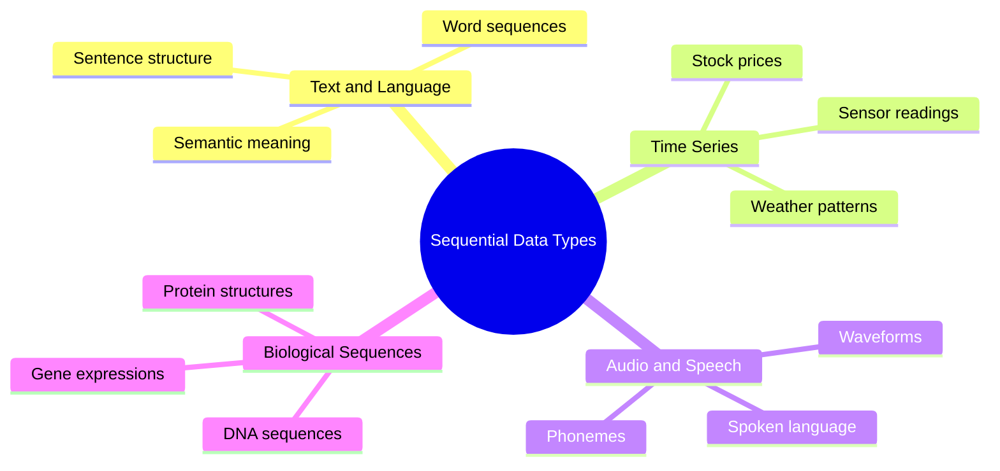
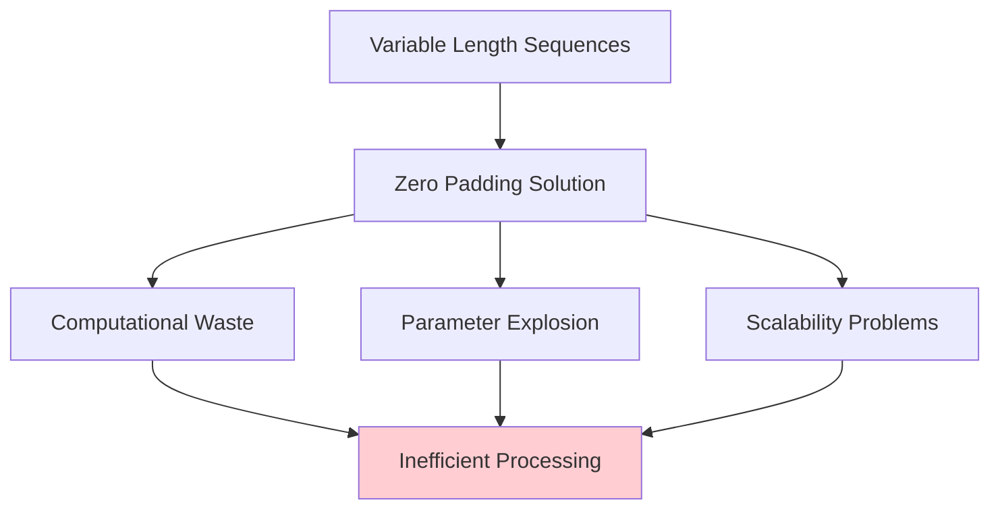
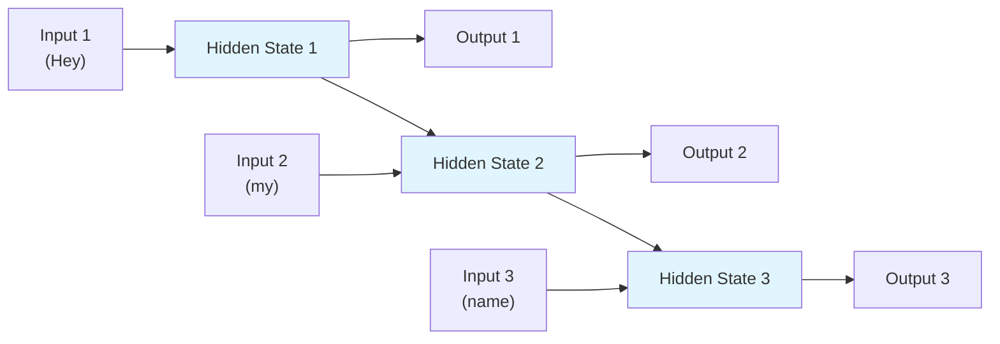

# Why RNNs are Needed | RNNs vs ANNs | Introduction to Recurrent Neural Networks

## Overview

**Recurrent Neural Networks (RNNs)** represent a fundamental paradigm shift in neural network architecture, specifically designed to address the limitations of traditional Artificial Neural Networks (ANNs) when processing **sequential data**. The material introduces RNNs as the third major type of neural network, following ANNs (for tabular data) and CNNs (for image/grid-like data), establishing them as specialized architectures for **sequence-based problems** where temporal dependencies and context are crucial for understanding and prediction.


*Visual representation showing how RNNs process sequential data with memory, contrasting with ANNs that process inputs independently*

## The Sequential Data Challenge

### Understanding Sequential vs Non-Sequential Data

The material establishes a critical distinction between data types through practical examples:

**Non-Sequential Data Example:**
```
Student Placement Prediction:
- Age: 22
- Marks: 85%  
- Gender: Male
→ Placement: Yes/No
```

In this scenario, the **order doesn't matter** - whether you input age first or marks first, the prediction remains the same. This represents **tabular data** suitable for traditional ANNs.

**Sequential Data Examples:**

1. **Text/Language**: "Hey my name is Nitish"
   - Words must appear in specific order
   - Meaning changes if sequence changes
   - Context builds word by word

2. **Time Series**: Stock prices over time (2001→2002→2003...)
   - Past values influence future predictions
   - Temporal dependencies are crucial

3. **Audio/Speech**: Waveforms representing spoken words
   - Sequential audio samples create meaning
   - Order determines comprehension



### The Fundamental Problem: Why ANNs Fail on Sequential Data

The material identifies **four critical problems** when attempting to use traditional ANNs for sequential data:

#### Problem 1: Variable Input Size Challenge

**The Issue**: Different sequences have different lengths, but ANNs require **fixed input dimensions**.

**Example Demonstration**:
```
Sentence 1: "Hey my name is Nitish" (5 words)
Sentence 2: "My name is" (3 words)  
Sentence 3: "Hello" (1 word)
```

Using **one-hot encoding** with vocabulary size 12:
- Sentence 1: 5 × 12 = 60 input dimensions
- Sentence 2: 3 × 12 = 36 input dimensions  
- Sentence 3: 1 × 12 = 12 input dimensions

**The Problem**: ANNs cannot handle varying input sizes - the network architecture is fixed at design time.

#### Problem 2: Zero Padding Inefficiency

**Attempted Solution**: Pad shorter sequences with zeros to match the longest sequence.

**New Problems Created**:
- **Unnecessary computation**: Processing meaningless zero values
- **Massive parameter explosion**: If longest sequence has 100 words with 10,000 vocabulary → 1 million input dimensions → 10 million+ parameters
- **Scalability issues**: What happens when a new sequence has 200 words?



#### Problem 3: Loss of Sequential Information

**The Critical Flaw**: ANNs process all inputs **simultaneously**, completely **disregarding sequence order**.

**What Happens**:
- All words in a sentence enter the network at the same time
- No concept of "what came first" vs "what came later"
- **Semantic meaning is lost** because context and order are ignored
- The network has **no memory** of previous inputs

**Impact**: Even if technical challenges are solved, the model cannot capture the **semantic relationships** that make sequential data meaningful.

#### Problem 4: Lack of Memory Architecture

**Fundamental Limitation**: ANNs are **stateless** - they cannot retain information from previous time steps.

**Why This Matters**:
- Human language understanding relies on **building context**
- Past words influence interpretation of current words
- **Temporal dependencies** are essential for prediction
- ANNs have **no architectural mechanism** for memory retention

## The RNN Solution: Architecture for Sequential Processing

### Core Innovation: Memory Through Recurrent Connections

**RNNs solve the sequential data problem** by introducing a fundamentally different architecture that includes **memory capabilities** and **sequential processing**.


*Animation showing how RNNs process sequential data through time, maintaining hidden states that act as memory*

### Key Architectural Features:

1. **Sequential Processing**: Inputs are processed **one at a time** rather than simultaneously
2. **Hidden State Memory**: Maintains information from previous time steps
3. **Recurrent Connections**: Output from previous step becomes input for current step
4. **Variable Length Handling**: Naturally accommodates sequences of any length



## Real-World Applications: The Power of RNNs

The material showcases several compelling applications that demonstrate RNN capabilities:

### 1. Sentiment Analysis

**Demonstration**: Movie review analysis using Race 3 IMDB review
- **Input**: "This movie was terrible and boring..."
- **Output**: Negative sentiment (-0.58 magnitude)
- **Application**: E-commerce platforms analyzing product reviews

**Business Impact**:
- Flipkart can automatically categorize customer feedback
- Identify percentage of positive vs negative reviews
- Automated customer satisfaction monitoring

### 2. Sentence Completion/Next Word Prediction

**Example**: Gmail's smart compose feature
- **Input**: "I hope..."
- **Prediction**: "you are doing well" / "to see you soon"

**Applications**:
- Gmail smart compose
- Mobile keyboard prediction
- Autocomplete systems

### 3. Image Captioning

**Capability**: Generate textual descriptions of images
- **Input**: Image of scene
- **Output**: "A group of people sitting around a table"

**Accessibility Impact**:
- Assistive technology for visually impaired users
- Real-time scene description through phone cameras
- Continuous environmental commentary for navigation

### 4. Machine Translation

**Example**: Google Translate functionality
- **Language Detection**: Automatically identifies input language
- **Translation**: Converts between languages while preserving meaning
- **Impact**: Breaking language barriers globally

### 5. Question Answering Systems

**Advanced Application**: Reading comprehension models
- **Input**: Text passage + question
- **Output**: Specific answer extracted from context
- **Example**: "Who is the largest shareholder of Tesla?" → "Elon Musk"

## RNN Learning Roadmap

The material outlines a comprehensive learning path for mastering RNNs:

### Phase 1: Foundations
1. **Simple RNN Architecture**
   - Basic RNN structure and components
   - Forward propagation mechanics
   - Coding implementation in Keras
   - Practical examples and exercises

### Phase 2: Training Mechanics  
2. **Backpropagation Through Time (BPTT)**
   - How gradients flow backward through time steps
   - Mathematical foundations of RNN training
   - Understanding temporal gradient computation

### Phase 3: Addressing Limitations
3. **RNN Problems and Solutions**
   - **Vanishing Gradient Problem**: Why RNNs struggle with long sequences
   - **Exploding Gradient Problem**: Gradient instability issues
   - **Solutions**: Gradient clipping and architectural improvements

### Phase 4: Advanced Architectures
4. **LSTM and GRU Networks**
   - **Long Short-Term Memory (LSTM)**: Advanced memory mechanisms
   - **Gated Recurrent Unit (GRU)**: Simplified gating approach
   - Comparative analysis and use cases

### Phase 5: Architectural Variations
5. **Types of RNN Architectures**
   - One-to-one, one-to-many, many-to-one, many-to-many
   - Sequence classification vs sequence generation
   - Encoder-decoder architectures

### Phase 6: Advanced Concepts
6. **Deep and Bidirectional RNNs**
   - **Deep RNNs**: Multiple stacked layers
   - **Bidirectional RNNs**: Processing sequences in both directions
   - Performance improvements and computational considerations

### Phase 7: Practical Implementation
7. **Projects and Applications**
   - Text classification projects
   - Time series forecasting
   - Language generation models
   - Real-world problem solving

## Key Insights and Conceptual Understanding

### The Paradigm Shift: From Static to Dynamic Processing

**Traditional ANNs**: 
- Static input → Process → Static output
- No temporal awareness
- Fixed computational graph

**RNNs**:
- Dynamic input stream → Sequential processing → Context-aware output
- Temporal memory integration
- Unfolded computational graph through time

### Memory as a Core Capability

RNNs introduce the concept of **artificial memory** in neural networks:
- **Short-term memory**: Hidden state carries information across time steps
- **Context accumulation**: Building understanding incrementally
- **Adaptive forgetting**: Older information can be overwritten

### Sequential Learning vs Batch Learning

**Fundamental Difference**:
- ANNs learn patterns across many examples simultaneously
- RNNs learn patterns across time within individual sequences
- This enables understanding of **temporal structure** and **sequential dependencies**

## Thought-Provoking Questions

1. **Memory Capacity Limitations**: While RNNs can maintain memory across time steps, how might the fixed size of hidden states limit their ability to remember very long sequences? What are the implications for processing book-length texts or very long time series?

2. **Computational vs Biological Memory**: How do the memory mechanisms in RNNs compare to human memory systems? Could insights from neuroscience about forgetting and attention help improve RNN architectures for handling sequential information more efficiently?

[End of Notes]