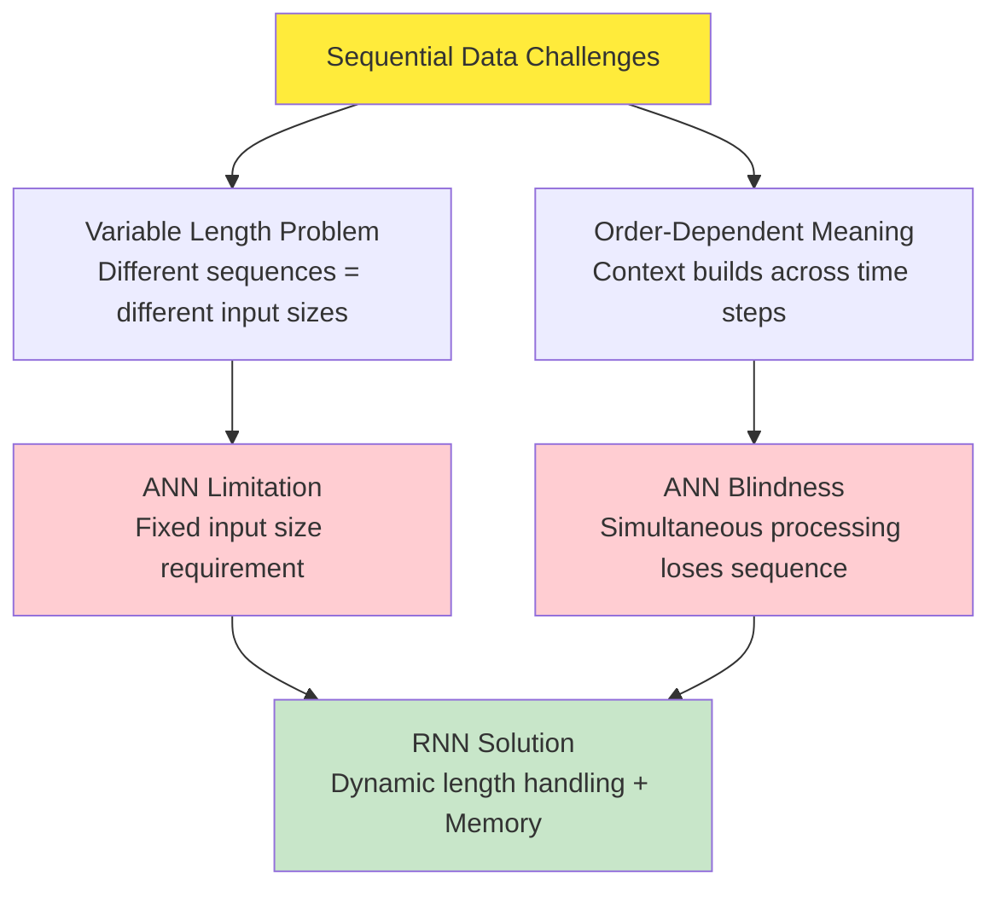
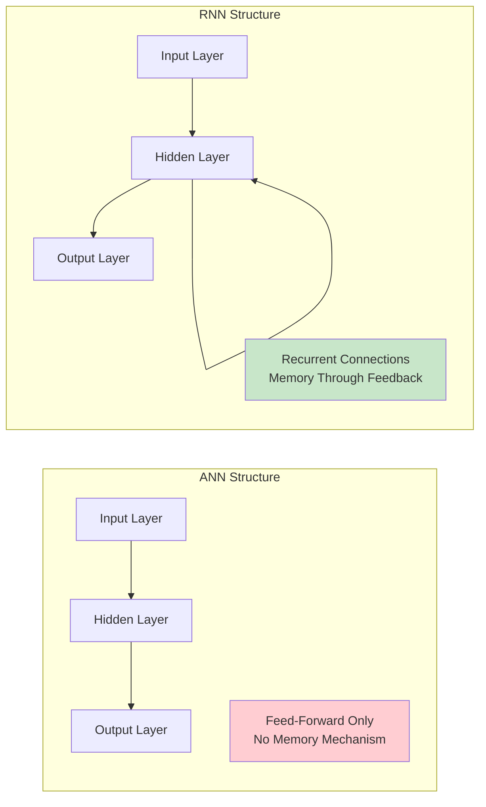
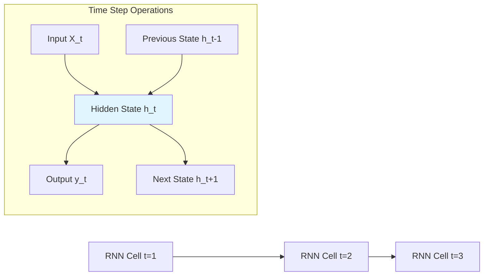
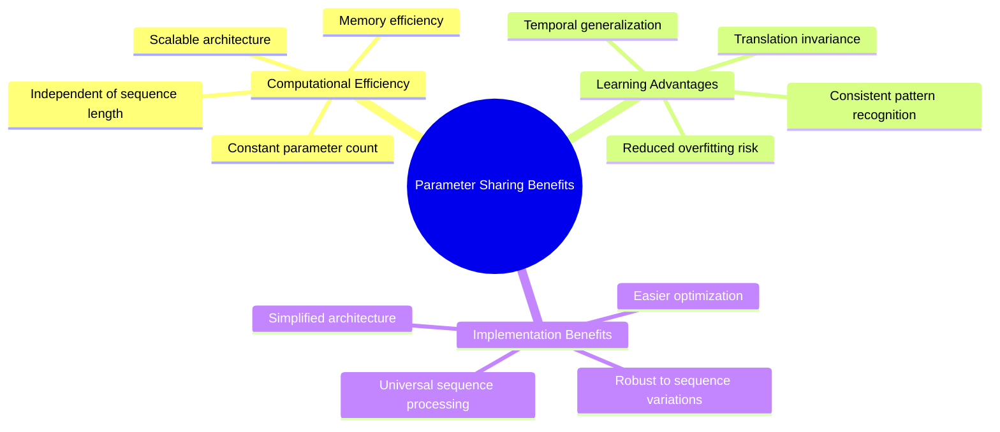
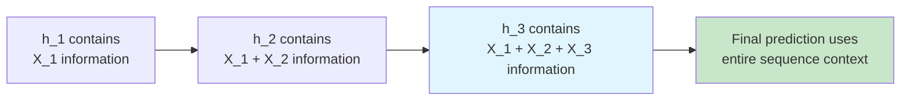
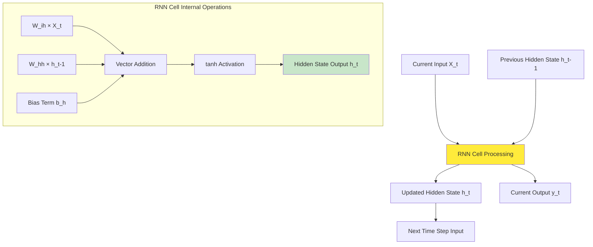
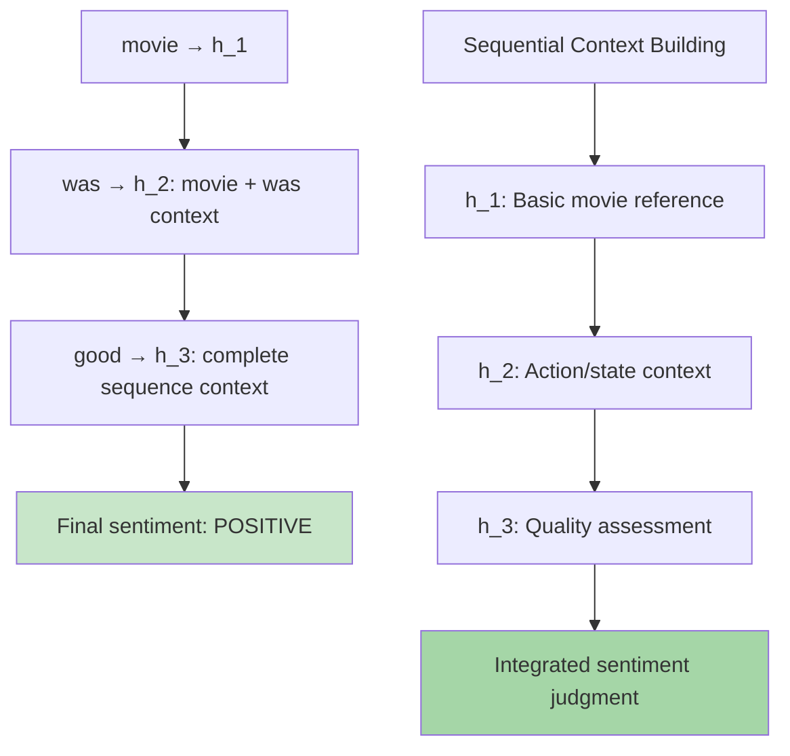

# Recurrent Neural Network | Forward Propagation | Architecture

## Overview

**Recurrent Neural Networks (RNNs)** represent a revolutionary advancement in neural network architecture, specifically engineered to process **sequential data** through their unique **memory mechanism**. The material provides a comprehensive exploration of RNN architecture and **forward propagation mechanics**, demonstrating how RNNs overcome the fundamental limitations of traditional Artificial Neural Networks (ANNs) when processing variable-length sequential inputs such as text, time series, and speech data. This deep dive into RNN internals reveals the elegant solution to capturing **temporal dependencies** and **sequential patterns** that are invisible to conventional neural networks.


*Visual representation of RNN architecture showing the recurrent connections that enable memory across time steps*

## Building Upon Sequential Data Foundations

### Reinforcing the Sequential Data Challenge

The material reinforces the core limitations that make RNNs essential for sequential data processing:



**Core Insight**: RNNs solve both the **technical challenge** (variable input dimensions) and the **semantic challenge** (capturing sequential dependencies) that render ANNs unsuitable for sequential data processing.

### The Two Critical Problems Solved

**Problem 1: Variable Length Sequences**
- Movie reviews contain different numbers of words
- No guarantee that reviews will have the same length
- ANNs require fixed input dimensions
- Zero-padding creates computational waste and scalability issues

**Problem 2: Sequential Information Loss**
- Sequential data contains hidden temporal information
- Order matters: "movie was good" ≠ "good was movie"
- ANNs process all inputs simultaneously, losing sequence context
- Human reading builds context word by word - machines need similar capability

## Data Representation for RNN Processing

### Standard RNN Input Format

RNN inputs follow a specific three-dimensional structure:

**Input Shape**: `(Time Steps, Input Features)`

For batch processing: `(Batch Size, Time Steps, Input Features)`

### Practical Example: Movie Review Sentiment Analysis

The material uses **sentiment analysis** to demonstrate data preparation and processing:

**Problem Definition**:
- **Input**: Movie reviews (English text)
- **Output**: Sentiment prediction (positive/negative binary classification)
- **Vocabulary**: Simplified to 5 words for demonstration

**Vocabulary Encoding with One-Hot Vectors**:
```
movie → [1, 0, 0, 0, 0]
was   → [0, 1, 0, 0, 0]  
good  → [0, 0, 1, 0, 0]
bad   → [0, 0, 0, 1, 0]
not   → [0, 0, 0, 0, 1]
```

**Example Review Processing**:
```
Review: "movie was good"
Sequential Representation:
- Time step 1: [1, 0, 0, 0, 0] (movie)
- Time step 2: [0, 1, 0, 0, 0] (was)  
- Time step 3: [0, 0, 1, 0, 0] (good)

Final input shape: (3, 5) → 3 time steps, 5 input features
```

### Mathematical Notation System

The material establishes clear notation for RNN operations:

**Input Notation**:
- **X_ij**: i-th review, j-th word in sequence
- **X_11**: First review, first word
- **X_12**: First review, second word  
- **X_13**: First review, third word

**Vector Representation**:
```
Review 1: "movie was good"
X_11 = [1, 0, 0, 0, 0] (movie)
X_12 = [0, 1, 0, 0, 0] (was)
X_13 = [0, 0, 1, 0, 0] (good)
```

This notation system enables precise tracking of how each word flows through the RNN architecture.

## RNN Architecture: Fundamental Design Principles

### Core Architectural Differences from ANNs

The material emphasizes **two revolutionary distinctions** that define RNN architecture:



**Key Architectural Innovations**:

1. **Sequential Processing**: RNNs process inputs **one time step at a time** rather than simultaneously
2. **Recurrent Connections**: Hidden layer output **feeds back as input** for the next time step, creating memory

### Detailed RNN Architecture Components

**Network Structure for Sentiment Analysis**:
- **Input Layer**: 5 nodes (vocabulary size)
- **Hidden Layer**: 3 nodes (configurable hyperparameter)
- **Output Layer**: 1 node (binary sentiment classification)
- **Recurrent Connections**: Hidden-to-hidden feedback loops

**Parameter Calculation**:
```
Input to Hidden weights (W_ih): 5 × 3 = 15 parameters
Hidden to Hidden weights (W_hh): 3 × 3 = 9 parameters  
Hidden layer biases: 3 parameters
Hidden to Output weights (W_ho): 3 × 1 = 3 parameters
Output bias: 1 parameter
Total Parameters: 15 + 9 + 3 + 3 + 1 = 31 parameters
```

This demonstrates how RNNs maintain **constant parameter count** regardless of sequence length.

### Activation Functions in RNN Layers

**Hidden Layer Activation**: 
- **Default**: Hyperbolic tangent (tanh)
- **Range**: (-1, 1)
- **Advantage**: Zero-centered, smooth gradients

**Output Layer Activation** (Problem-Dependent):
- **Binary Classification**: Sigmoid (sentiment analysis)
- **Multi-class Classification**: Softmax
- **Regression**: Linear (no activation)

## Forward Propagation: Unfolding Through Time

### The Core Concept: Unfolding Through Time

RNNs operate through **"unfolding through time"** - a process where the recurrent layer functions like a loop, processing one time step at a time while maintaining state information.


*Animation showing how RNN unfolds through time, processing sequential inputs while maintaining hidden state memory*



### Step-by-Step Forward Propagation Process

**Time Step 1 (t=1)**:
```
Input: X_11 = [1, 0, 0, 0, 0] (movie)
Previous hidden state: h_0 = [0, 0, 0] (zero initialization)

Mathematical Operations:
1. Input transformation: W_ih × X_11
2. Hidden state transformation: W_hh × h_0 (zero for first step)
3. Combined computation: h_1 = tanh(W_ih × X_11 + W_hh × h_0 + b_h)
4. Output calculation: y_1 = σ(W_ho × h_1 + b_o)
```

**Time Step 2 (t=2)**:
```
Input: X_12 = [0, 1, 0, 0, 0] (was)
Previous hidden state: h_1 (contains memory from step 1)

Mathematical Operations:
1. Input transformation: W_ih × X_12
2. Hidden state transformation: W_hh × h_1 (now contains previous information)
3. Combined computation: h_2 = tanh(W_ih × X_12 + W_hh × h_1 + b_h)
4. Output calculation: y_2 = σ(W_ho × h_2 + b_o)
```

**Time Step 3 (t=3)**:
```
Input: X_13 = [0, 0, 1, 0, 0] (good)
Previous hidden state: h_2 (contains accumulated memory from steps 1-2)

Mathematical Operations:
1. Input transformation: W_ih × X_13
2. Hidden state transformation: W_hh × h_2 (contains full sequence history)
3. Combined computation: h_3 = tanh(W_ih × X_13 + W_hh × h_2 + b_h)
4. Final prediction: y_3 = σ(W_ho × h_3 + b_o)
```

### Core Mathematical Operations

**Hidden State Update Equation**:
```
h_t = tanh(W_ih × X_t + W_hh × h_{t-1} + b_h)
```

**Output Generation Equation**:
```
y_t = σ(W_ho × h_t + b_o)
```

Where:
- **W_ih**: Input-to-hidden weight matrix (5×3)
- **W_hh**: Hidden-to-hidden weight matrix (3×3) 
- **W_ho**: Hidden-to-output weight matrix (3×1)
- **b_h**: Hidden layer bias vector (3×1)
- **b_o**: Output layer bias scalar (1×1)
- **tanh**: Hyperbolic tangent activation function
- **σ**: Sigmoid activation function

## The Revolutionary Concept of Parameter Sharing

### Weight Sharing Across Time Steps

**Critical Innovation**: RNNs use **identical weights at every time step**, implementing parameter sharing that provides multiple advantages:



**Weight Consistency Across Time**:
- **W_ih**: Same input-to-hidden transformation for all time steps
- **W_hh**: Same hidden-to-hidden recurrence for all time steps
- **W_ho**: Same hidden-to-output mapping for all time steps
- **Only variables**: Input X_t and hidden state h_t change over time

### Memory Mechanism Through Hidden State Evolution

**The Cumulative Memory Advantage**:

Each hidden state progressively accumulates information from all previous time steps:



**Information Flow Through Time**:
- **h_1**: Processes only first word ("movie")
- **h_2**: Integrates first and second words ("movie was")
- **h_3**: Synthesizes complete sequence ("movie was good")

This progressive information accumulation enables the network to understand that "movie was good" expresses positive sentiment based on the **complete sequential context** rather than individual words.

## Simplified RNN Conceptual Model

### Unified RNN Cell Representation

The material provides a conceptual simplification that captures the essence of RNN computation:



**Fundamental RNN Operation**:
```
h_t = tanh(W_ih × X_t + W_hh × h_{t-1} + b_h)
```

This single equation encapsulates the entire RNN computation:
1. **Current input processing**: W_ih × X_t
2. **Memory integration**: W_hh × h_{t-1}
3. **Bias incorporation**: + b_h
4. **Nonlinear transformation**: tanh(...)

## Complete Forward Pass Example: "movie was good"

### End-to-End Processing Demonstration

**Complete Forward Propagation**:

```
Initialization:
h_0 = [0, 0, 0] (zero vector for consistency)

Time Step 1 - Processing "movie":
Input: X_11 = [1, 0, 0, 0, 0]
h_1 = tanh(W_ih × [1,0,0,0,0] + W_hh × [0,0,0] + b_h)
y_1 = σ(W_ho × h_1 + b_o)

Time Step 2 - Processing "was":  
Input: X_12 = [0, 1, 0, 0, 0]
h_2 = tanh(W_ih × [0,1,0,0,0] + W_hh × h_1 + b_h)
y_2 = σ(W_ho × h_2 + b_o)

Time Step 3 - Processing "good":
Input: X_13 = [0, 0, 1, 0, 0]  
h_3 = tanh(W_ih × [0,0,1,0,0] + W_hh × h_2 + b_h)
Final Sentiment Prediction: y_3 = σ(W_ho × h_3 + b_o)
```

**Prediction Interpretation**:
- **y_3 > 0.5**: Positive sentiment detected
- **y_3 < 0.5**: Negative sentiment detected

### Information Accumulation Visualization



## Key Insights and Architectural Advantages

### Memory as the Revolutionary Feature

**Fundamental Innovation**: RNNs introduce **artificial memory** to neural networks through recurrent connections, enabling:

1. **Context Preservation**: Information from earlier time steps influences later predictions
2. **Dynamic Length Processing**: Natural adaptation to sequences of any length
3. **Sequential Pattern Recognition**: Ability to learn temporal dependencies and relationships
4. **Parameter Efficiency**: Fixed parameter count regardless of sequence length

### Comparison with Traditional Neural Network Approaches

**RNN Revolutionary Advantages**:
- **Dynamic Processing**: Automatically adapts to any sequence length
- **Memory Integration**: Maintains and builds context across time steps
- **Parameter Efficiency**: Constant parameter count through weight sharing
- **Sequential Understanding**: Captures order-dependent semantic relationships

**Traditional ANN Fundamental Limitations**:
- **Fixed Architecture**: Cannot handle variable-length sequences
- **Memory Absence**: Each input processed in complete isolation
- **Order Blindness**: Cannot capture sequential dependencies or temporal patterns
- **Computational Inefficiency**: Zero-padding creates unnecessary computation

## Implementation and Practical Considerations

### Zero Initialization Strategy

**Initial Hidden State Handling**:
- **Standard Approach**: h_0 = zero vector [0, 0, 0]
- **Purpose**: Maintains mathematical consistency
- **Alternative**: Small random initialization
- **Advanced**: Learnable initialization parameters

### Batch Processing Architecture

**Production Implementation**:
```
Batch processing multiple sequences:
1. Pad shorter sequences to match longest sequence in batch
2. Apply masking to ignore padded positions during computation
3. Process entire batch through RNN simultaneously
4. Extract final predictions only from actual sequence endpoints
```

### Computational Complexity Analysis

**Time Complexity**: O(T × H²) per sequence
- **T**: Number of time steps in sequence
- **H**: Hidden layer dimensionality
- **H²**: Quadratic due to hidden-to-hidden matrix multiplication

**Space Complexity**: O(T × H) for storing hidden states during forward pass

## Foundation for Advanced RNN Concepts

### Preparing for Backpropagation Through Time

The forward propagation process establishes the computational foundation for understanding **Backpropagation Through Time (BPTT)**:

- Forward pass creates unfolded computation graph through time
- Each time step contributes to final loss calculation
- Gradients must flow backward through all time steps
- Parameter sharing means gradients accumulate across temporal dependencies

### Extension to Advanced Architectures

Basic RNN forward propagation concepts directly extend to sophisticated architectures:
- **LSTM (Long Short-Term Memory)**: Adds complex gating mechanisms for better memory management
- **GRU (Gated Recurrent Unit)**: Provides simplified but effective gating approach
- **Bidirectional RNNs**: Process sequences in both forward and backward directions
- **Deep RNNs**: Stack multiple recurrent layers for increased representation capacity

## RNN Capabilities and Temporal Processing Power

### Sequential Memory Span

**Memory Capacity**: The material notes that a simple RNN can theoretically process and remember information from sequences of **10 time steps** or more, storing temporal information that influences final predictions.

**Information Propagation**:
- Each hidden state carries forward accumulated information
- Final output integrates entire sequence history
- Memory enables context-dependent decision making

### Real-World Processing Implications

**Why RNNs Excel at Sequential Tasks**:
- **Language Understanding**: Captures syntactic and semantic dependencies
- **Time Series Analysis**: Models temporal patterns and trends
- **Speech Recognition**: Processes audio sequences with temporal structure
- **Sentiment Analysis**: Integrates context across entire text sequences

## Thought-Provoking Questions

1. **Memory Decay and Information Retention**: While RNNs can theoretically remember information from many previous time steps, how might the effectiveness of this memory degrade over very long sequences? What are the implications for processing book-length texts or extended time series, and how do advanced architectures like LSTMs address these limitations?

2. **Parameter Sharing Trade-offs**: RNNs use identical weights across all time steps, which provides parameter efficiency but potentially limits the model's ability to learn position-specific or context-specific patterns. In what scenarios might this universal parameter sharing become a bottleneck, and how do attention mechanisms and transformer architectures address these limitations?

[End of Notes]