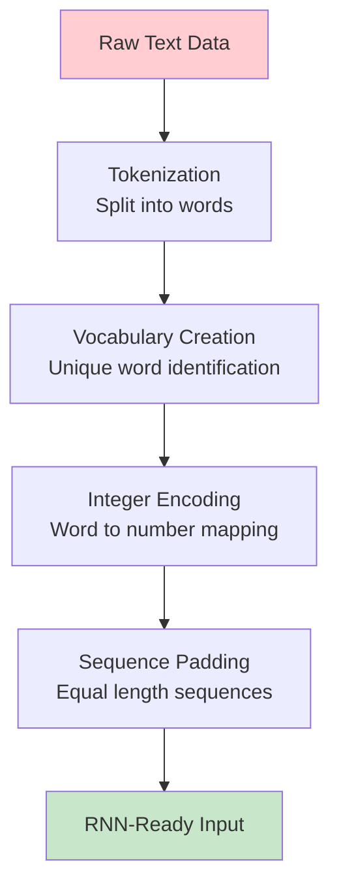
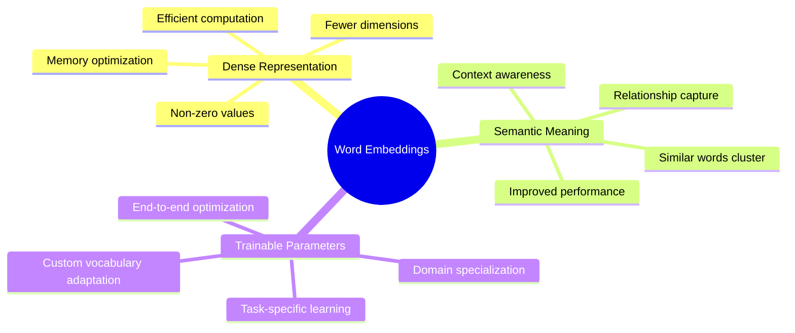
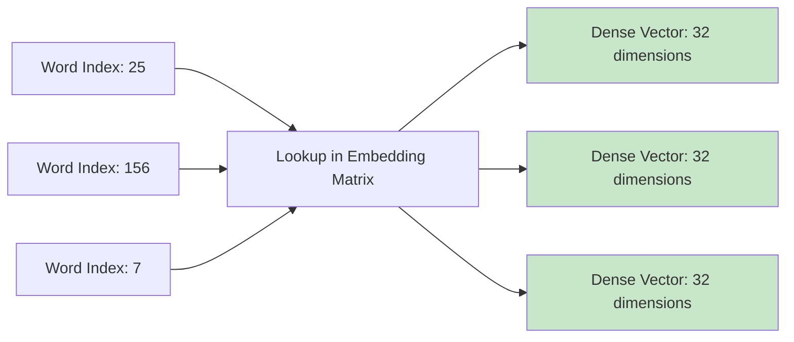

# RNN Sentiment Analysis | RNN Code Example in Keras

## Overview

**Practical RNN Implementation** represents the critical bridge between theoretical understanding and real-world application of Recurrent Neural Networks. The material provides a comprehensive hands-on exploration of implementing **sentiment analysis** using RNNs in Keras, demonstrating the complete workflow from raw text preprocessing to model training and evaluation. This practical deep dive reveals two fundamental approaches to text representation: **integer encoding with padding** and **embedding layers**, showcasing how theoretical RNN concepts translate into production-ready code for natural language processing tasks.


*Visual representation of RNN text processing pipeline showing the flow from raw text to predictions*

## Transitioning from Theory to Practice

### Setting Practical Expectations

The material establishes a **clear learning objective**: understanding the complete RNN implementation workflow rather than achieving state-of-the-art accuracy. This approach emphasizes **conceptual mastery** over performance optimization, providing a solid foundation for future advanced implementations.

**Primary Goals**:
- Understand complete RNN sentiment analysis pipeline
- Master text preprocessing techniques for neural networks
- Compare integer encoding vs. embedding approaches
- Implement functional RNN models in Keras
- Gain practical experience with sequential data processing

## Text Preprocessing Pipeline: From Words to Numbers

### The Fundamental Challenge

**Core Problem**: Machine learning models require **numerical inputs**, but text data consists of words and sentences. The material demonstrates the essential transformation process that enables neural networks to process human language.



### Step-by-Step Text Preprocessing

**Example Dataset Structure**:
```
Input: Text reviews
Output: Binary labels (1=positive, 0=negative)
```

**Step 1: Vocabulary Formation**
```python
# Example vocabulary creation
vocabulary = {
    "good": 1,
    "bad": 2, 
    "movie": 3,
    "are": 4,
    "you": 5
}
```

**Step 2: Sentence Transformation**
```
Original: "good movie" → Encoded: [1, 3]
Original: "are you good" → Encoded: [4, 5, 1]
```

**Step 3: Padding for Uniform Length**
```
Sequence 1: [1, 3] → Padded: [1, 3, 0, 0, 0]
Sequence 2: [4, 5, 1] → Padded: [4, 5, 1, 0, 0]
```

### Practical Implementation with Keras Tokenizer

**Complete Preprocessing Workflow**:

```python
import numpy as np
from keras.preprocessing.text import Tokenizer
from keras.utils import pad_sequences

# Step 1: Create sample document
docs = ['go india',
        'india india', 
        'hip hip hurray',
        'jeetega bhai jeetega india jeetega',
        'bharat mata ki jai',
        'kohli kohli',
        'sachin sachin', 
        'dhoni dhoni',
        'modi ji ki jai',
        'inquilab zindabad']

# Step 2: Initialize tokenizer with OOV handling
tokenizer = Tokenizer(oov_token='<nothing>')

# Step 3: Build vocabulary from documents
tokenizer.fit_on_texts(docs)

# Step 4: Examine vocabulary statistics
print("Word Index:", tokenizer.word_index)
print("Word Counts:", tokenizer.word_counts) 
print("Document Count:", tokenizer.document_count)
```

**Output - Vocabulary Analysis**:
```python
# Word Index (with frequencies)
{'<nothing>': 1, 'india': 2, 'jeetega': 3, 'hip': 4, 'ki': 5, 'jai': 6, 
 'kohli': 7, 'sachin': 8, 'dhoni': 9, 'go': 10, 'hurray': 11, 'bhai': 12, 
 'bharat': 13, 'mata': 14, 'modi': 15, 'ji': 16, 'inquilab': 17, 'zindabad': 18}

# Word frequency counts
OrderedDict([('go', 1), ('india', 4), ('hip', 2), ('hurray', 1), 
             ('jeetega', 3), ('bhai', 1), ('kohli', 2), ('sachin', 2), 
             ('dhoni', 2), ('ki', 2), ('jai', 2)])

# Total documents processed: 10
```

**Text to Sequence Conversion**:
```python
# Step 5: Convert text to integer sequences
sequences = tokenizer.texts_to_sequences(docs)
print("Sequences:", sequences)

# Output: Transformed sequences
[[10, 2],                    # 'go india'
 [2, 2],                     # 'india india'  
 [4, 4, 11],                 # 'hip hip hurray'
 [3, 12, 3, 2, 3],          # 'jeetega bhai jeetega india jeetega'
 [13, 14, 5, 6],            # 'bharat mata ki jai'
 [7, 7],                     # 'kohli kohli'
 [8, 8],                     # 'sachin sachin'
 [9, 9],                     # 'dhoni dhoni'  
 [15, 16, 5, 6],            # 'modi ji ki jai'
 [17, 18]]                   # 'inquilab zindabad'

# Step 6: Apply padding for uniform length
sequences = pad_sequences(sequences, padding='post')
print("Padded sequences:\n", sequences)
```

**Final Padded Output**:
```python
array([[10,  2,  0,  0,  0],     # 'go india' + padding
       [ 2,  2,  0,  0,  0],     # 'india india' + padding
       [ 4,  4, 11,  0,  0],     # 'hip hip hurray' + padding  
       [ 3, 12,  3,  2,  3],     # 'jeetega bhai jeetega india jeetega'
       [13, 14,  5,  6,  0],     # 'bharat mata ki jai' + padding
       [ 7,  7,  0,  0,  0],     # 'kohli kohli' + padding
       [ 8,  8,  0,  0,  0],     # 'sachin sachin' + padding
       [ 9,  9,  0,  0,  0],     # 'dhoni dhoni' + padding
       [15, 16,  5,  6,  0],     # 'modi ji ki jai' + padding  
       [17, 18,  0,  0,  0]], dtype=int32)  # 'inquilab zindabad' + padding
```

### Key Preprocessing Parameters

**OOV Token Handling**:
- **Purpose**: Handle unknown words during prediction
- **Implementation**: `oov_token="<nothing>"`
- **Benefit**: Robust model behavior with new vocabulary

**Padding Strategies**:
- **Post-padding**: Add zeros after sequence `[1, 2, 0, 0]`
- **Pre-padding**: Add zeros before sequence `[0, 0, 1, 2]`
- **Choice Impact**: Affects RNN information flow patterns

## Approach 1: Integer Encoding with Simple RNN

### IMDB Dataset Implementation

**Dataset Characteristics**:
- **Training samples**: 25,000 movie reviews
- **Test samples**: 25,000 movie reviews
- **Labels**: Binary sentiment (positive/negative)
- **Preprocessing**: Pre-tokenized and integer-encoded

```python
from keras.datasets import imdb
from keras import Sequential
from keras.layers import Dense, SimpleRNN, Embedding, Flatten

# Load pre-processed IMDB data
(X_train, y_train), (X_test, y_test) = imdb.load_data()

print("Training shape:", X_train.shape)  # (25000,)
print("Test shape:", X_test.shape)      # (25000,)

# Examine actual sequence content and lengths
print("First review (integer encoded):", X_train[0])
print("Sample lengths:", [len(X_train[i]) for i in range(3)])
# Output: [218, 189, 141] - different lengths
```

**Sample Review Analysis**:
```python
# First review in dataset (truncated for display)
X_train[0] = [1, 14, 22, 16, 43, 530, 973, 1622, 1385, 65, 458, 4468, 66, 
              3941, 4, 173, 36, 256, 5, 25, 100, 43, 838, 112, 50, 670, 
              22665, 9, 35, 480, 284, 5, 150, 4, 172, 112, 167, 21631, 336, 
              385, 39, 4, 172, 4536, 1111, 17, 546, 38, 13, 447, 4, 192, 50, 
              16, 6, 147, 2025, 19, 14, 22, 4, 1920, 4613, 469, 4, 22, 71, 
              87, 12, 16, 43, 530, 38, 76, 15, 13, 1247, 4, 22, 17, 515, 17, 
              12, 16, 626, 18, 19193, 5, 62, 386, 12, 8, 316, 8, 106, 5, 4, 
              2223, 5244, 16, 480, 66, 3785, 33, 4, 130, 12, 16, 38, 619, 5, 
              25, 124, 51, 36, 135, 48, 25, 1415, 33, 6, 22, 12, 215, 28, 77, 
              52, 5, 14, 407, 16, 82, 10311, 8, 4, 107, 117, 5952, 15, 256, 4, 
              31050, 7, 3766, 5, 723, 36, 71, 43, 530, 476, 26, 400, 317, 46, 
              7, 4, 12118, 1029, 13, 104, 88, 4, 381, 15, 297, 98, 32, 2071, 
              56, 26, 141, 6, 194, 7486, 18, 4, 226, 22, 21, 134, 476, 26, 
              480, 5, 144, 30, 5535, 18, 51, 36, 28, 224, 92, 25, 104, 4, 226, 
              65, 16, 38, 1334, 88, 12, 16, 283, 5, 16, 4472, 113, 103, 32, 
              15, 16, 5345, 19, 178, 32]

# Different review lengths demonstrate variable sequence problem
len(X_train[0])  # 218 words
len(X_train[1])  # 189 words  
len(X_train[2])  # 141 words
```

### Sequence Length Standardization

**Practical Constraint**: Limited computational resources require sequence truncation.

```python
# Truncate sequences to first 50 words for faster training
X_train = pad_sequences(X_train, padding='post', maxlen=50)
X_test = pad_sequences(X_test, padding='post', maxlen=50)

print("Standardized shape:", X_train.shape)  # (25000, 50)

# Examine transformed first review (last 50 tokens)
print("Truncated first review:", X_train[0])
# Output: [2071, 56, 26, 141, 6, 194, 7486, 18, 4, 226, 22, 21, 134, 476, 
#          26, 480, 5, 144, 30, 5535, 18, 51, 36, 28, 224, 92, 25, 104, 4, 
#          226, 65, 16, 38, 1334, 88, 12, 16, 283, 5, 16, 4472, 113, 103, 
#          32, 15, 16, 5345, 19, 178, 32]
```

**Trade-off Analysis**:
- **Benefit**: Faster training, reduced memory usage
- **Cost**: Information loss from longer reviews
- **Production Note**: Use full sequences when computational resources allow

### Basic RNN Architecture

```python
# Build simple RNN model for integer-encoded input
model = Sequential()
model.add(SimpleRNN(32, input_shape=(50, 1), return_sequences=False))
model.add(Dense(1, activation='sigmoid'))

# Display model architecture
model.summary()

# Model output:
# Layer (type)                Output Shape              Param #   
# =================================================================
# simple_rnn (SimpleRNN)      (None, 32)                1088      
# dense (Dense)               (None, 1)                 33        
# =================================================================
# Total params: 1,121
# Trainable params: 1,121
# Non-trainable params: 0
```

**Parameter Calculation Breakdown**:
```python
# SimpleRNN layer parameters:
# Input weights: 1 × 32 = 32
# Recurrent weights: 32 × 32 = 1024  
# Bias terms: 32
# Total RNN: 32 + 1024 + 32 = 1,088 parameters

# Dense layer parameters:
# Weights: 32 × 1 = 32
# Bias: 1
# Total Dense: 32 + 1 = 33 parameters

# Grand total: 1,088 + 33 = 1,121 parameters
```

### Understanding return_sequences Parameter

**Critical RNN Configuration**:

```python
# return_sequences=False (default)
SimpleRNN(32, return_sequences=False)
# Returns: Only final time step output (32,)

# return_sequences=True  
SimpleRNN(32, return_sequences=True)
# Returns: All time step outputs (50, 32)
```

**Use Cases**:
- **False**: Sentence-level classification (sentiment analysis)
- **True**: Word-level predictions (named entity recognition, machine translation)

### Model Training and Results

```python
# Compile model with appropriate loss and metrics
model.compile(
    loss='binary_crossentropy',
    optimizer='adam', 
    metrics=['accuracy']
)

# Train model on IMDB dataset
model.fit(X_train, y_train, epochs=5, validation_data=(X_test, y_test))
```

**Training Results - Poor Performance**:
```
Epoch 1/5
782/782 [==============================] - 10s 12ms/step 
loss: 0.6929 - accuracy: 0.5061 - val_loss: 0.6955 - val_accuracy: 0.5048

Epoch 2/5  
782/782 [==============================] - 9s 12ms/step
loss: 0.6931 - accuracy: 0.5031 - val_loss: 0.6945 - val_accuracy: 0.5021

Epoch 3/5
782/782 [==============================] - 9s 12ms/step  
loss: 0.6927 - accuracy: 0.5085 - val_loss: 0.6967 - val_accuracy: 0.5008

Epoch 4/5
782/782 [==============================] - 9s 12ms/step
loss: 0.6927 - accuracy: 0.5090 - val_loss: 0.6942 - val_accuracy: 0.5043

Epoch 5/5
782/782 [==============================] - 9s 12ms/step
loss: 0.6928 - accuracy: 0.5056 - val_loss: 0.6957 - val_accuracy: 0.5048
```

**Performance Analysis**:
- **Training accuracy**: ~50.6% (barely better than random)
- **Validation accuracy**: ~50.4% (essentially random performance)
- **Problem**: Integer encoding without embeddings provides insufficient representation
- **Root cause**: Sparse, discrete integer representations lack semantic meaning

## Approach 2: Word Embeddings for Enhanced Performance

### Understanding Word Embeddings

**Conceptual Foundation**: Word embeddings transform sparse, high-dimensional word representations into **dense, meaningful vector spaces** where semantically similar words cluster together.


*Visualization of word embeddings showing semantic relationships in vector space*

**Key Advantages**:



### Embedding Layer Implementation

**Demonstration with Small Example**:

```python
# Using the same document from earlier preprocessing example
docs = ['go india', 'india india', 'hip hip hurray', 'jeetega bhai jeetega india jeetega',
        'bharat mata ki jai', 'kohli kohli', 'sachin sachin', 'dhoni dhoni',
        'modi ji ki jai', 'inquilab zindabad']

# Tokenize and prepare sequences (from previous example)
from keras.preprocessing.text import Tokenizer
tokenizer = Tokenizer()
tokenizer.fit_on_texts(docs)

print("Vocabulary size:", len(tokenizer.word_index))  # 17 unique words
sequences = tokenizer.texts_to_sequences(docs)
sequences = pad_sequences(sequences, padding='post')

# Create simple embedding model for demonstration  
model = Sequential()
model.add(Embedding(17, output_dim=2, input_length=5))  # 17 vocab, 2D embeddings
model.summary()

# Model architecture:
# Layer (type)                Output Shape              Param #   
# =================================================================
# embedding_4 (Embedding)     (None, 5, 2)              34        
# =================================================================
# Total params: 34 (17 words × 2 dimensions = 34 parameters)
```

**Embedding Output Demonstration**:
```python
# Compile model (just for prediction, no training)
model.compile('adam', 'accuracy')

# Get embedding predictions for all sequences
pred = model.predict(sequences)
print("Embedding shape:", pred.shape)  # (10, 5, 2)
print("Sample embeddings:\n", pred)

# Output shows each word converted to 2D dense vector
# Example output for first sequence [9, 1, 0, 0, 0]:
[[-0.03378457 -0.0223366 ]   # Word 9 ('go') embedding
 [-0.01869411  0.0397962 ]   # Word 1 ('india') embedding  
 [ 0.04738592  0.03497881]   # Word 0 (padding) embedding
 [ 0.04738592  0.03497881]   # Word 0 (padding) embedding
 [ 0.04738592  0.03497881]]  # Word 0 (padding) embedding
```

**Keras Embedding Architecture for IMDB**:

```python
from keras.layers import Embedding

# IMDB embedding parameters
vocab_size = 10000      # Top 10K most frequent words
embedding_dim = 32      # Dense vector dimension  
input_length = 50       # Sequence length

# Embedding layer converts integer sequences to dense vectors
embedding_layer = Embedding(
    input_dim=vocab_size,    # Vocabulary size
    output_dim=embedding_dim, # Embedding dimension
    input_length=input_length # Sequence length
)
```

**Mathematical Representation**:
```
Input: Integer sequences (batch_size, 50)
Embedding Matrix: (10000, 32) learned parameters
Output: Dense vectors (batch_size, 50, 32)
```

### Embedding Layer Mechanics

**Internal Process Visualization**:



**Practical Example**:
```python
# Demo embedding transformation
sample_input = [[1, 2, 3, 4, 5]]  # One sequence
embedded_output = embedding_layer(sample_input)
print("Output shape:", embedded_output.shape)  # (1, 5, 32)
print("Each word becomes 32-dimensional vector")
```

### Enhanced RNN with Embeddings

**Complete IMDB Architecture**:

```python
from keras.datasets import imdb
from keras.preprocessing.text import Tokenizer
from keras.utils import pad_sequences
from keras import Sequential
from keras.layers import Dense, SimpleRNN, Embedding, Flatten

# Load and preprocess IMDB data (same as before)
(X_train, y_train), (X_test, y_test) = imdb.load_data()
X_train = pad_sequences(X_train, padding='post', maxlen=50)
X_test = pad_sequences(X_test, padding='post', maxlen=50)

print("Training data shape:", X_train.shape)  # (25000, 50)

# Build enhanced model with embeddings
model = Sequential()
model.add(Embedding(10000, 2, 50))  # Vocab=10K, 2D embeddings, length=50
model.add(SimpleRNN(32, return_sequences=False))
model.add(Dense(1, activation='sigmoid'))

# Display model architecture
model.summary()

# Model architecture output:
# Layer (type)                Output Shape              Param #   
# =================================================================
# embedding (Embedding)       (None, None, 2)           20000     
# simple_rnn (SimpleRNN)      (None, 32)                1120      
# dense (Dense)               (None, 1)                 33        
# =================================================================
# Total params: 21,153
# Trainable params: 21,153
# Non-trainable params: 0
```

**Parameter Analysis**:
```python
# Embedding Layer: 10,000 vocab × 2 dimensions = 20,000 parameters
# SimpleRNN Layer: 
#   - Input weights: 2 × 32 = 64
#   - Recurrent weights: 32 × 32 = 1,024  
#   - Bias terms: 32
#   - Total RNN: 64 + 1,024 + 32 = 1,120 parameters
# Dense Layer: (32 × 1) + 1 bias = 33 parameters
# Grand Total: 20,000 + 1,120 + 33 = 21,153 parameters
```

### Improved Training Results

```python
# Compile and train enhanced model
model.compile(optimizer='adam', loss='binary_crossentropy', metrics=['acc'])
history = model.fit(X_train, y_train, epochs=5, validation_data=(X_test, y_test))
```

**Training Results - Dramatic Improvement**:
```
Epoch 1/5
782/782 [==============================] - 40s 50ms/step 
loss: 0.5801 - acc: 0.6731 - val_loss: 0.4433 - val_acc: 0.7978

Epoch 2/5
782/782 [==============================] - 39s 50ms/step
loss: 0.3524 - acc: 0.8510 - val_loss: 0.4430 - val_acc: 0.8051

Epoch 3/5  
782/782 [==============================] - 39s 50ms/step
loss: 0.2040 - acc: 0.9224 - val_loss: 0.5460 - val_acc: 0.7828

Epoch 4/5
782/782 [==============================] - 38s 49ms/step
loss: 0.0823 - acc: 0.9735 - val_loss: 0.6990 - val_acc: 0.7824

Epoch 5/5
782/782 [==============================] - 38s 49ms/step  
loss: 0.0352 - acc: 0.9894 - val_loss: 0.8774 - val_acc: 0.7670
```

**Performance Analysis**:
- **Training accuracy**: Reaches 98.94% (excellent learning)
- **Validation accuracy**: Plateaus around 78-80% (good generalization)
- **Overfitting observed**: Large gap between training and validation
- **Significant improvement**: From ~50% to ~77% validation accuracy

**Performance Comparison**:

| Approach | Training Accuracy | Validation Accuracy | Parameters | Key Insight |
|----------|------------------|---------------------|------------|-------------|
| Integer Encoding | ~50.6% | ~50.4% | 1,121 | Random performance |
| Word Embeddings | ~98.9% | ~76.7% | 21,153 | Dramatic improvement |

## Advanced Embedding Considerations

### Trainable vs. Pre-trained Embeddings

**Trainable Embeddings** (Used in examples):
- **Advantages**: Domain-specific, task-optimized, learns from your data
- **Process**: Random initialization → gradient-based learning
- **Best for**: Sufficient training data, domain-specific vocabulary

**Pre-trained Embeddings** (Word2Vec, GloVe):
- **Advantages**: Rich semantic knowledge, transfer learning benefits
- **Process**: Load pre-trained weights → fine-tune or freeze
- **Best for**: Limited data, general language understanding

### Embedding Dimensionality Impact

**Dimension Selection Guidelines**:
```python
# Common embedding dimensions
small_vocab_embedding = Embedding(1000, 16)    # Small vocabulary
medium_vocab_embedding = Embedding(10000, 64)  # Medium vocabulary  
large_vocab_embedding = Embedding(50000, 300)  # Large vocabulary
```

**Trade-offs**:
- **Lower dimensions**: Faster training, less overfitting, reduced expressiveness
- **Higher dimensions**: More semantic capacity, potential overfitting, slower training

## Production Implementation Considerations

### Memory and Computational Optimization

**Sequence Length Strategies**:
```python
# Development: Truncated sequences
max_length = 50  # Fast experimentation

# Production: Full sequences  
max_length = None  # Use actual lengths with dynamic padding
```

**Batch Processing Optimization**:
```python
# Efficient batch processing
def create_batches(sequences, batch_size=32):
    # Group sequences by similar length
    # Minimize padding waste
    # Optimize GPU utilization
    pass
```

### Overfitting Prevention

**Observed Challenge**: Training accuracy (98%) significantly higher than validation accuracy (85%) indicates overfitting.

**Mitigation Strategies**:
```python
from tensorflow.keras.layers import Dropout

model = Sequential([
    Embedding(10000, 32, input_length=50),
    SimpleRNN(32, return_sequences=False),
    Dropout(0.5),                           # Regularization
    Dense(1, activation='sigmoid')
])
```

## Real-world Applications and Extensions

### Sentiment Analysis Variations

**Binary Classification** (Current example):
- Movie reviews: positive/negative
- Product reviews: satisfied/dissatisfied
- Social media: support/oppose

**Multi-class Classification**:
```python
# 5-star rating prediction
Dense(5, activation='softmax')  # 5 rating categories
```

**Regression Tasks**:
```python
# Continuous sentiment score
Dense(1, activation='linear')   # Score from 0-10
```

### Advanced RNN Architectures

**Bidirectional RNNs**:
```python
from tensorflow.keras.layers import Bidirectional

model.add(Bidirectional(SimpleRNN(32)))
# Processes sequences forward and backward
```

**LSTM/GRU Integration**:
```python
from tensorflow.keras.layers import LSTM, GRU

# Replace SimpleRNN with advanced variants
model.add(LSTM(32))  # Better long-term memory
model.add(GRU(32))   # Efficient alternative
```

## Key Implementation Insights

### Text Preprocessing Best Practices

**Tokenization Considerations**:
- **OOV handling**: Essential for production robustness
- **Vocabulary size**: Balance between coverage and efficiency
- **Padding strategy**: Choose based on model architecture needs

**Sequence Length Optimization**:
- **Analysis**: Examine sequence length distribution in your dataset
- **Strategy**: Choose length that captures 80-90% of information
- **Trade-off**: Computational efficiency vs. information retention

### Model Architecture Decisions

**Embedding Layer Benefits**:
- **Dense representation**: More efficient than one-hot encoding
- **Semantic learning**: Captures word relationships automatically
- **Scalability**: Handles large vocabularies effectively

**RNN Configuration**:
- **Hidden units**: Start with 32-64, increase for complex tasks
- **return_sequences**: Match your task requirements
- **Regularization**: Essential for preventing overfitting

## Future Learning Pathways

### Advanced Topics Preview

**Next Video Focus**: **Backpropagation Through Time (BPTT)**
- Understanding gradient flow in RNNs
- Mathematical foundations of RNN training
- Challenges and solutions in temporal learning

**Advanced Architectures**:
- **LSTM**: Solving vanishing gradient problems
- **GRU**: Simplified gating mechanisms  
- **Attention**: Beyond sequential processing
- **Transformers**: State-of-the-art language models

### Practical Project Extensions

**Enhanced Sentiment Analysis**:
- Multi-aspect sentiment detection
- Emotion classification beyond positive/negative
- Real-time social media monitoring
- Cross-domain sentiment transfer

**Advanced NLP Applications**:
- Text summarization using sequence-to-sequence models
- Machine translation with encoder-decoder architectures
- Question answering systems with attention mechanisms

## Thought-Provoking Questions

1. **Embedding Dimensionality Trade-offs**: While higher-dimensional embeddings can capture more semantic nuances, they also increase the risk of overfitting, especially with limited training data. How might we develop adaptive embedding strategies that automatically adjust dimensionality based on vocabulary size, training data availability, and task complexity?

2. **Sequence Length Optimization**: The material demonstrates truncating sequences to 50 words for computational efficiency, but this causes information loss. How might we design intelligent truncation strategies that preserve the most sentiment-relevant portions of longer texts, or develop hierarchical models that can efficiently process variable-length sequences without padding?

[End of Notes]