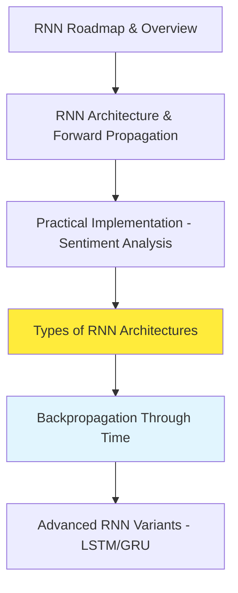
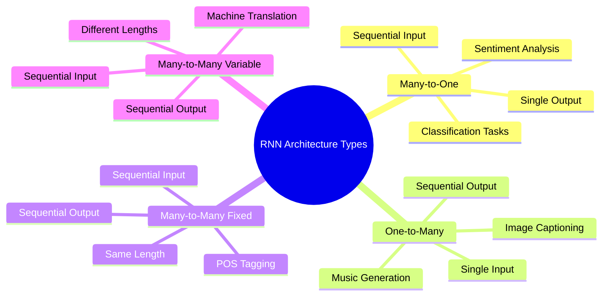
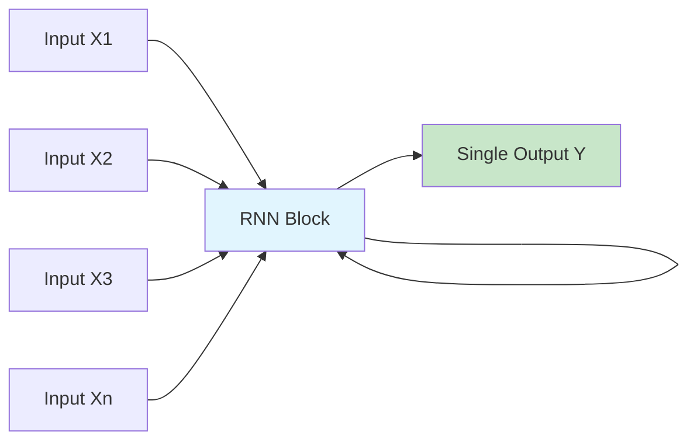
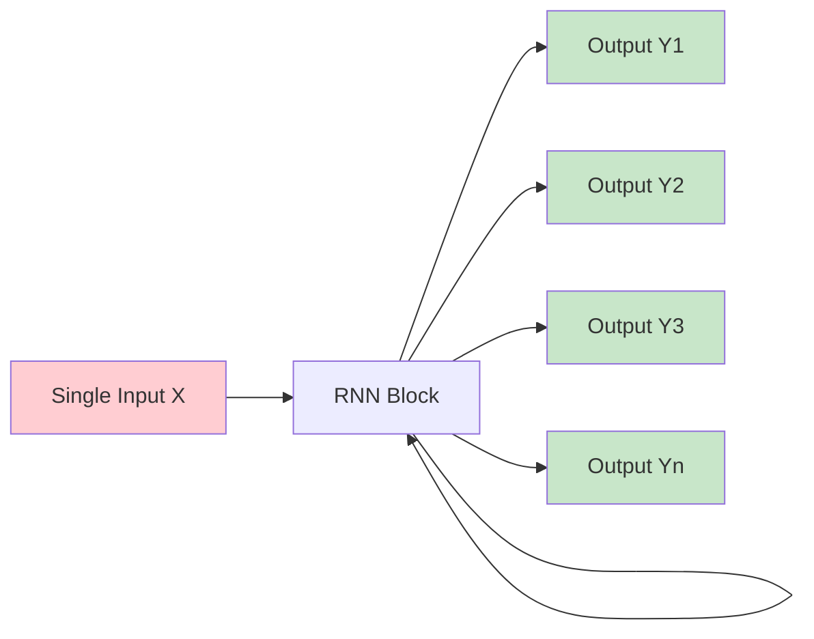
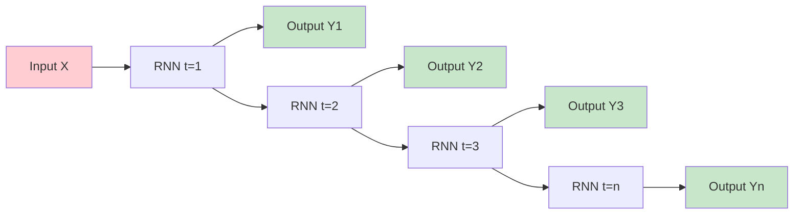
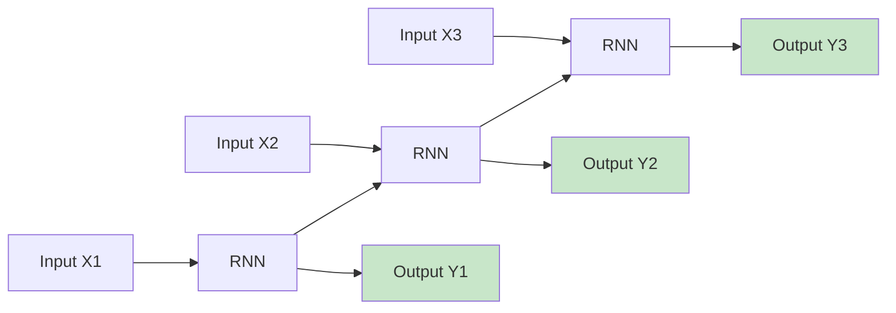
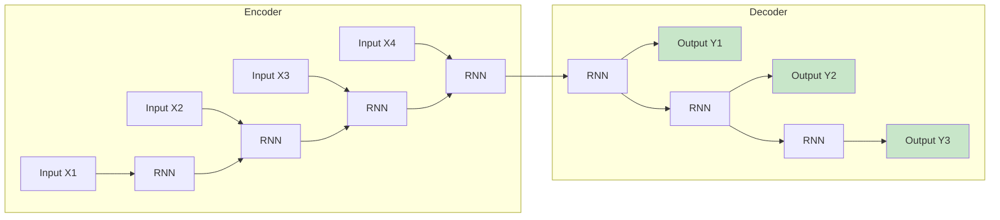
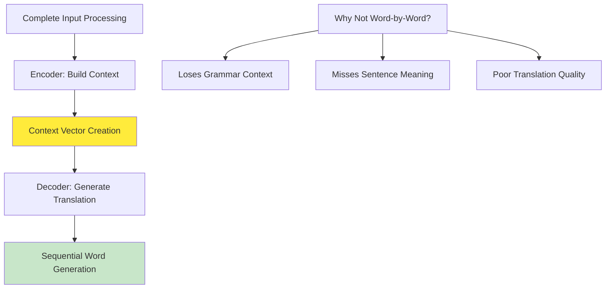
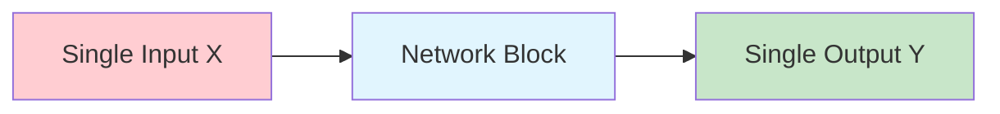
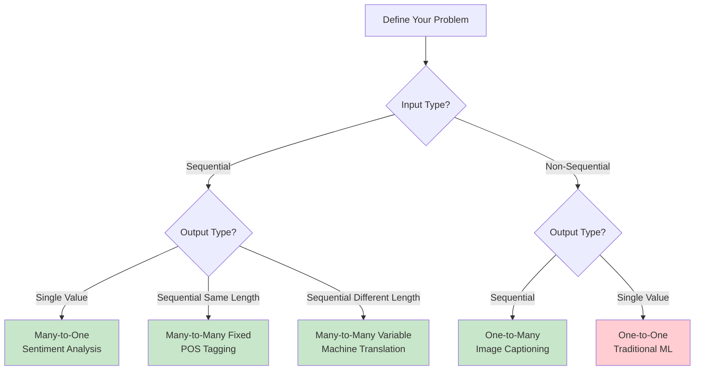

# Types of RNN Architectures | Many to Many | One to Many | Many to One RNNs

## Overview

**RNN Architecture Taxonomy** represents a fundamental classification system that determines how Recurrent Neural Networks process inputs and generate outputs across different temporal patterns. The material provides a comprehensive exploration of **four distinct RNN architectures**: Many-to-One, One-to-Many, Many-to-Many (with two variants), and One-to-One, each designed for specific types of sequential learning tasks. Understanding these architectural patterns is essential for selecting the appropriate RNN design for real-world applications, as the choice between architectures directly impacts how information flows through the network and determines the types of problems that can be effectively solved.


*Visual representation of different RNN architectures showing one-to-one, one-to-many, many-to-one, and many-to-many patterns*

## Building Upon Previous Knowledge

### Learning Progression Context

The material establishes a clear learning pathway for RNN mastery:



**Strategic Importance**: Understanding RNN architecture types is crucial before learning backpropagation because **different architectures require different gradient flow patterns** and training algorithms. This foundational knowledge enables more effective learning of advanced concepts.

## Architecture Classification Framework

### The Four Fundamental RNN Types

RNN architectures are classified based on their **input-output cardinality relationships**:



**Naming Convention Understanding**:
- **"Many"**: Sequential data (multiple time steps)
- **"One"**: Non-sequential data (single time step)
- **Input → Output**: Describes the transformation pattern

## Type 1: Many-to-One Architecture

### Conceptual Foundation

**Many-to-One RNNs** process **sequential input data** and produce a **single output value**, making them ideal for **classification and regression tasks** where the entire sequence must be analyzed to make a decision.


### Architecture Mechanics

**Information Flow Pattern**:


**Processing Sequence**:
1. **Sequential Input Processing**: Each time step receives one element of the sequence
2. **Hidden State Accumulation**: Information builds up across time steps
3. **Final Output Generation**: Only the last time step produces the final prediction
4. **Memory Integration**: Final output incorporates information from entire sequence

### Real-World Applications

**1. Sentiment Analysis**
```
Input Sequence: ["This", "movie", "was", "amazing"]
Processing: Word1 → Word2 → Word3 → Word4 → Hidden States
Output: Positive (1) or Negative (0)
```

**Application Details**:
- **Business Value**: Automated customer feedback analysis
- **Scale**: Process thousands of reviews simultaneously
- **Accuracy**: Captures context from entire review text

**2. Rating Prediction**
```
Input: Movie review text (sequence of words)
Output: Star rating (1-5 stars)
```

**Implementation Characteristics**:
- **Input**: Variable-length text sequences
- **Processing**: Accumulates semantic understanding across words
- **Output**: Discrete rating or continuous score

### Technical Implementation

**Architecture Configuration**:
```python
# Many-to-One RNN for sentiment analysis
model = Sequential([
    Embedding(vocab_size, embedding_dim, input_length=max_length),
    SimpleRNN(32, return_sequences=False),  # Key: return_sequences=False
    Dense(1, activation='sigmoid')
])

# Return sequences = False ensures only final output is used
```

**Hidden State Evolution**:
```
Time Step 1: h1 = f(X1, h0)     # Process first word
Time Step 2: h2 = f(X2, h1)     # Incorporate second word  
Time Step 3: h3 = f(X3, h2)     # Build understanding
Time Step n: hn = f(Xn, hn-1)   # Final comprehensive state
Output: Y = g(hn)               # Generate final prediction
```

## Type 2: One-to-Many Architecture

### Conceptual Foundation

**One-to-Many RNNs** receive a **single input** and generate a **sequence of outputs**, making them perfect for **generative tasks** where one piece of information must be expanded into a detailed sequence.

### Architecture Mechanics

**Information Flow Pattern**:


**Processing Characteristics**:
1. **Single Input Encoding**: Initial input provides context/seed information
2. **Iterative Generation**: Each time step produces an output
3. **State Propagation**: Previous outputs influence subsequent generations
4. **Variable Length**: Generation can continue for desired sequence length

### Real-World Applications

**1. Image Captioning**
```
Input: Single image (non-sequential)
Output: "A man is playing cricket in the stadium"
```

**Technical Process**:
- **Image Encoding**: CNN extracts image features into single vector
- **Caption Generation**: RNN generates words sequentially
- **Context Maintenance**: Each word considers previous words and image context

**2. Music Generation**
```
Input: Initial musical note or theme
Output: Sequence of musical notes forming a melody
```

**Creative Applications**:
- **Algorithmic Composition**: AI-generated melodies
- **Style Transfer**: Generate music in specific composer styles
- **Interactive Systems**: Real-time music generation based on user input

### Unfolded Architecture Visualization

**Time Step Breakdown**:


**Mathematical Representation**:
```
Time Step 1: h1 = f(X, h0),     Y1 = g(h1)
Time Step 2: h2 = f(0, h1),     Y2 = g(h2)  # No new input
Time Step 3: h3 = f(0, h2),     Y3 = g(h3)  # State-driven generation
Time Step n: hn = f(0, hn-1),   Yn = g(hn)
```

## Type 3: Many-to-Many Architecture

### Conceptual Foundation

**Many-to-Many RNNs** process **sequential inputs** and generate **sequential outputs**, making them the most versatile architecture for **sequence transformation tasks**. This type has **two important variants** based on input-output length relationships.

### Variant A: Fixed-Length Many-to-Many

**Characteristics**:
- **Input sequence length** = **Output sequence length**
- **Synchronous processing**: Each input time step produces corresponding output
- **Direct alignment**: Input-output pairs have temporal correspondence

**Architecture Pattern**:


**Real-World Applications**:

**1. Part-of-Speech (POS) Tagging**
```
Input:  ["I", "love", "machine", "learning"]
Output: ["PRONOUN", "VERB", "NOUN", "NOUN"]
```

**Technical Details**:
- **Linguistic Analysis**: Determines grammatical role of each word
- **Context Sensitivity**: Word meaning depends on surrounding words
- **Applications**: Grammar checkers, language parsing, NLP pipelines

**2. Named Entity Recognition (NER)**
```
Input:  ["Let's", "meet", "at", "7:00", "PM", "at", "the", "airport"]
Output: ["O", "O", "O", "TIME", "TIME", "O", "O", "LOCATION"]
```

**Business Applications**:
- **Information Extraction**: Extract entities from documents
- **Content Categorization**: Automated document classification
- **Chatbot Development**: Entity recognition for conversational AI

### Variant B: Variable-Length Many-to-Many

**Characteristics**:
- **Input sequence length** ≠ **Output sequence length**
- **Encoder-Decoder architecture**: Two-phase processing
- **Flexible transformation**: Adapt sequences to target language/format

**Architecture Pattern**:


**Processing Strategy**:
1. **Encoder Phase**: Process entire input sequence without generating outputs
2. **Context Encoding**: Final hidden state contains compressed sequence information
3. **Decoder Phase**: Generate output sequence using encoded context
4. **Sequential Generation**: Each output depends on previous outputs and encoded context

### Machine Translation: Premier Application

**Example Demonstration**:
```
Input (English):  "Hey my name is Nitish"     [5 words]
Output (Hindi):   "मेरा नाम नीतीश है"          [4 words]
```

**Why Encoder-Decoder Architecture?**

**Linguistic Reasoning**:
- **Holistic Understanding**: Translation requires understanding complete sentence meaning
- **Grammar Differences**: Languages have different grammatical structures
- **Context Dependencies**: Word choice depends on complete sentence context
- **Efficiency Variations**: Different languages express concepts with varying word counts

**Technical Implementation**:


**Industry Applications**:
- **Google Translate**: Real-time language translation
- **Content Localization**: Automated website/document translation
- **Multilingual Chatbots**: Cross-language communication systems

## Type 4: One-to-One Architecture

### Conceptual Foundation

**One-to-One RNNs** process **single inputs** and produce **single outputs**, representing the **simplest case** that technically resembles traditional neural networks more than recurrent networks.

### Architecture Characteristics

**Processing Pattern**:


**Technical Properties**:
- **No Recurrence**: No feedback connections or temporal dependencies
- **No Time Steps**: Single-shot processing
- **No Sequential Memory**: No hidden state propagation
- **Standard Neural Network**: Equivalent to feedforward networks

### Real-World Applications

**Image Classification Example**:
```
Input: Single image (non-sequential data)
Processing: Feature extraction and classification
Output: Class label (cat/dog, 0/1)
```

**Architecture Types That Fit**:
- **Artificial Neural Networks (ANNs)**: Traditional feedforward networks
- **Convolutional Neural Networks (CNNs)**: Image processing networks
- **Standard Deep Learning Models**: Non-temporal architectures

### Technical Clarification

**Important Note**: While included in RNN architecture taxonomy for completeness, One-to-One patterns don't actually require recurrent connections and are better handled by traditional neural network architectures.

**When to Use Each Architecture**:
- **CNN**: Image classification, computer vision tasks
- **ANN**: Tabular data, traditional machine learning problems
- **Not RNN**: No temporal dependencies or sequential processing required

## Architecture Selection Guidelines

### Decision Framework

**Choosing the Right Architecture**:



### Application-Architecture Mapping

**Industry Use Cases by Architecture Type**:

| Application Domain | Architecture Type | Specific Examples |
|-------------------|------------------|-------------------|
| **Text Analysis** | Many-to-One | Sentiment analysis, document classification |
| **Creative AI** | One-to-Many | Story generation, music composition |
| **Language Processing** | Many-to-Many Fixed | POS tagging, NER, syntax parsing |
| **Translation Services** | Many-to-Many Variable | Google Translate, document translation |
| **Computer Vision** | One-to-One | Image classification, object detection |

## Technical Implementation Considerations

### Key Configuration Parameters

**return_sequences Parameter**:
```python
# Many-to-One: Only final output
SimpleRNN(32, return_sequences=False)

# Many-to-Many: All time step outputs  
SimpleRNN(32, return_sequences=True)

# One-to-Many: Custom generation loop required
# (More complex implementation)
```

### Backpropagation Implications

**Architecture-Specific Training**:
- **Many-to-One**: Gradient flows backward from single loss
- **One-to-Many**: Multiple loss points, potential accumulation
- **Many-to-Many**: Loss at each time step or sequence-level loss
- **Variable Length**: Requires masking and padding strategies

**Preparation for Advanced Topics**: Understanding these patterns is essential for learning **Backpropagation Through Time (BPTT)**, as different architectures require different gradient computation strategies.

## Future Learning Pathway

### Next Steps in RNN Mastery

**Immediate Next Topic**: **Backpropagation Through Time (BPTT)**
- Architecture-specific gradient flow patterns
- Mathematical foundations of temporal learning
- Challenges and solutions in RNN training

**Advanced Topics Pipeline**:
1. **LSTM (Long Short-Term Memory)**: Advanced memory mechanisms
2. **GRU (Gated Recurrent Unit)**: Simplified but effective gating
3. **Sequence-to-Sequence Models**: Deep dive into encoder-decoder architectures
4. **Attention Mechanisms**: Beyond basic sequence processing

### Practical Implementation Focus

**Development Strategy**:
- **Start Simple**: Begin with Many-to-One for classification tasks
- **Progress Gradually**: Move to fixed-length Many-to-Many
- **Advanced Applications**: Tackle variable-length sequence transformation
- **Real Projects**: Implement complete end-to-end systems

## Key Insights and Takeaways

### Architectural Thinking for RNNs

**Core Principle**: **Architecture choice determines information flow patterns** and directly impacts what types of problems can be effectively solved. The relationship between input cardinality, output cardinality, and temporal dependencies shapes the entire learning process.

### Pattern Recognition in Real-World Problems

**Problem Analysis Framework**:
1. **Input Analysis**: Sequential vs. non-sequential data
2. **Output Requirements**: Single prediction vs. sequence generation
3. **Length Relationships**: Fixed vs. variable length mappings
4. **Context Dependencies**: Immediate vs. long-term temporal relationships

### Bridge to Advanced Concepts

**Foundation Building**: These architectural patterns provide the conceptual foundation for understanding more sophisticated RNN variants and attention mechanisms that power modern NLP systems.

## Thought-Provoking Questions

1. **Architecture Evolution and Limitations**: While Many-to-Many variable-length architectures (like encoder-decoder) solved sequence transformation problems, they still process input and output sequentially. How might parallel processing approaches (like Transformers) fundamentally change our thinking about sequence-to-sequence learning, and what are the trade-offs between sequential and parallel architectures?

2. **Context Compression in Encoder-Decoder Models**: In variable-length Many-to-Many architectures, the entire input sequence must be compressed into a fixed-size context vector. This creates a potential information bottleneck, especially for very long sequences. How might attention mechanisms address this limitation, and what does this suggest about the fundamental trade-offs between compression and information preservation in neural architectures?

[End of Notes]