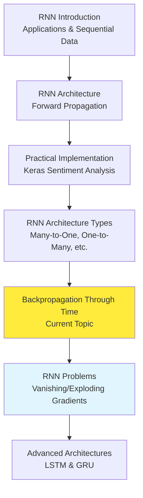
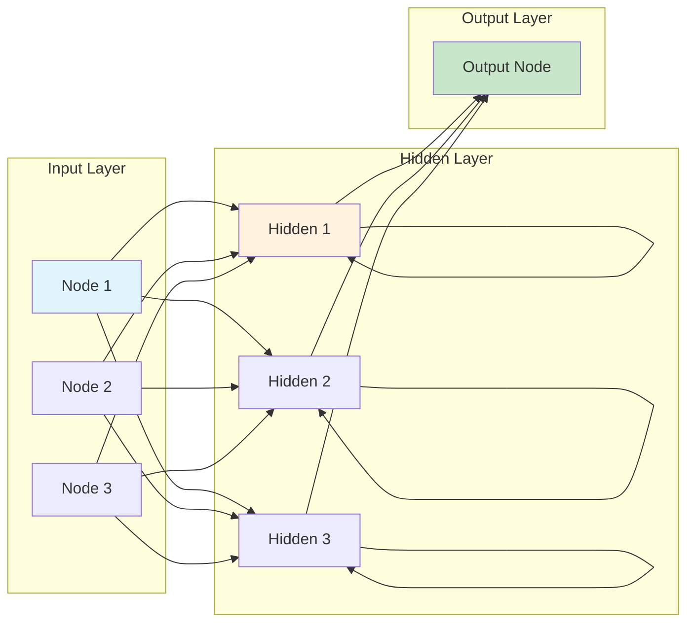
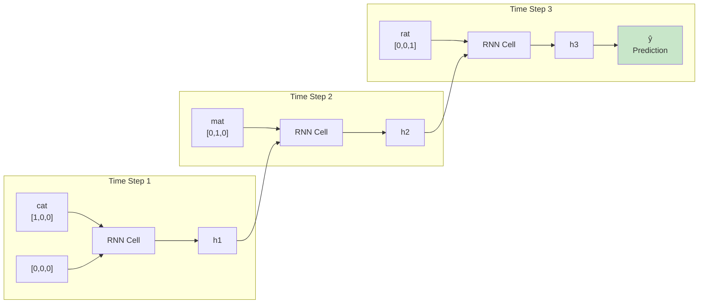
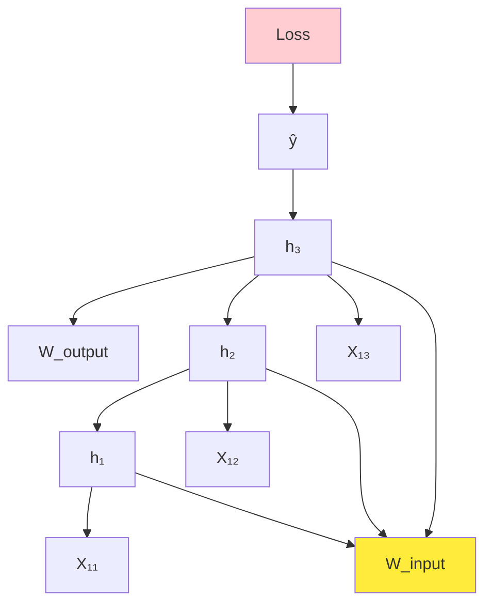
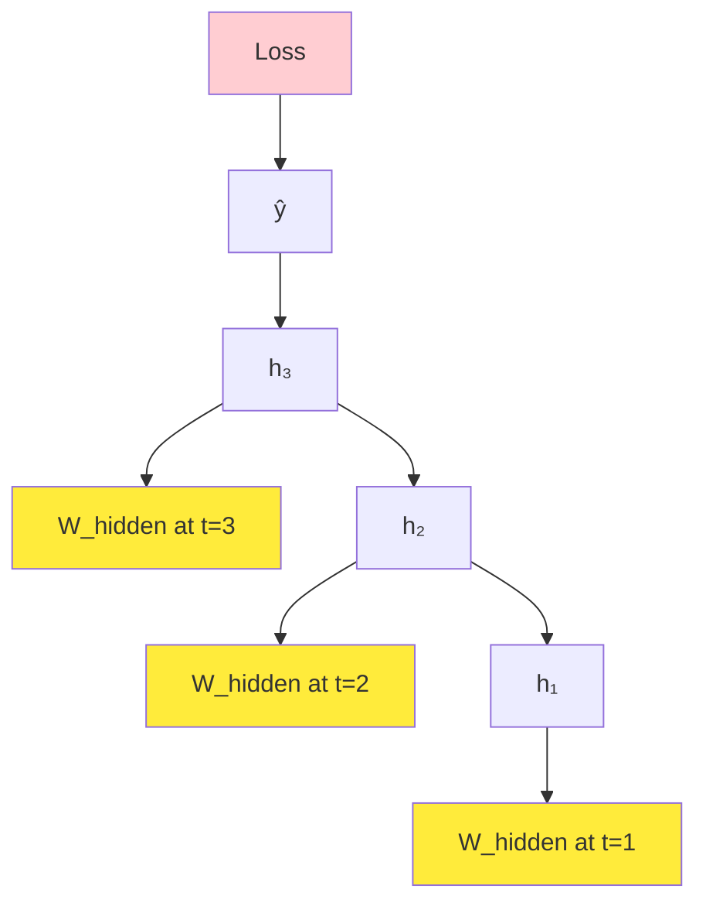
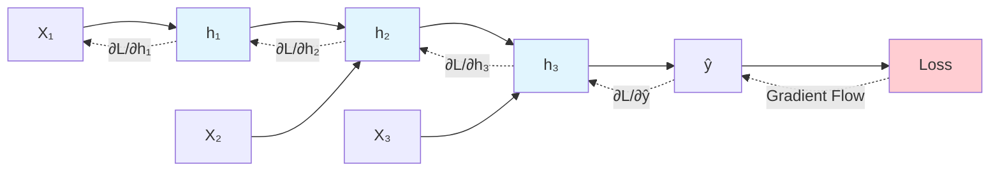

# How Backpropagation Works in RNN | Backpropagation Through Time (BPTT)

## Overview

**Backpropagation Through Time (BPTT)** represents the fundamental learning algorithm that enables Recurrent Neural Networks to learn from sequential data by propagating gradients backward through temporal dependencies. The material provides a comprehensive exploration of how standard backpropagation extends to handle the **temporal unfolding** of RNNs, revealing the mathematical machinery that allows networks to learn long-term dependencies and adjust weights based on information that flows across multiple time steps. This deep dive into BPTT demonstrates why it's both powerful and computationally challenging, setting the stage for understanding why advanced architectures like LSTMs and GRUs were developed.


*Computational graph showing dependencies for an RNN model with three time steps, illustrating how gradients flow backward through temporal dependencies during BPTT*

## Building Upon RNN Foundations

### Learning Progression Recap

The material establishes the learning context by reviewing the RNN journey so far:



**Critical Insight**: Understanding BPTT is essential because **learning in neural networks happens through backpropagation**, and RNNs require a special form that accounts for temporal dependencies.

## Problem Setup: Sentiment Analysis Example

### Toy Dataset Construction

The material uses a carefully crafted example to illustrate BPTT mechanics:

**Dataset Structure**:
```
Review 1: "cat mat rat" → Sentiment: 1 (Positive)
Review 2: "rat rat mat" → Sentiment: 0 (Negative)  
Review 3: "cat rat mat" → Sentiment: 1 (Positive)
```

**Vocabulary and Encoding**:
- Vocabulary size: 3 unique words
- One-hot encoding dimension: 3

```
cat → [1, 0, 0]
mat → [0, 1, 0]
rat → [0, 0, 1]
```

### Network Architecture Setup

**RNN Configuration**:


**Weight Matrices**:
- **W_input**: Input-to-hidden weights (3×3 matrix)
- **W_hidden**: Hidden-to-hidden recurrent weights (3×3 matrix)
- **W_output**: Hidden-to-output weights (3×1 matrix)

## Forward Propagation Through Time

### Temporal Unfolding Process

**Time Step Progression**:



### Mathematical Formulation

**Forward Propagation Equations**:

**Time Step 1**:
```
h₁ = f(X₁₁ · W_input + 0 · W_hidden)
```

**Time Step 2**:
```
h₂ = f(X₁₂ · W_input + h₁ · W_hidden)
```

**Time Step 3**:
```
h₃ = f(X₁₃ · W_input + h₂ · W_hidden)
```

**Final Output**:
```
ŷ = g(h₃ · W_output)
```

Where:
- **f**: Hidden layer activation function (typically tanh)
- **g**: Output activation function (sigmoid for binary classification)
- **h_t**: Hidden state at time t
- **X_ti**: Input at time t for sequence i

### Loss Calculation

**Binary Cross-Entropy Loss**:
```
L = -[y · log(ŷ) + (1 - y) · log(1 - ŷ)]
```

Where:
- **y**: True label (0 or 1)
- **ŷ**: Predicted probability

## The Gradient Descent Framework

### Weight Update Rules

**Objective**: Minimize loss by adjusting weights using gradient descent.

**Update Equations**:
```
W_output_new = W_output - α · ∂L/∂W_output
W_hidden_new = W_hidden - α · ∂L/∂W_hidden
W_input_new = W_input - α · ∂L/∂W_input
```

Where α is the learning rate.

**The Challenge**: Computing these three gradients in the context of temporal dependencies.

## Computing Gradients Through Time

### Gradient 1: Output Weight Gradient (∂L/∂W_output)

**Conceptual Understanding**: This gradient measures how changes in output weights affect the loss.

**Dependency Chain**:
```
Loss → ŷ → h₃ → W_output
```

**Chain Rule Application**:
```
∂L/∂W_output = ∂L/∂ŷ · ∂ŷ/∂W_output
```

**Key Insight**: This is the **simplest gradient** because it only involves the final time step, similar to standard feedforward networks.

### Gradient 2: Input Weight Gradient (∂L/∂W_input)

**Conceptual Challenge**: W_input affects the loss through **multiple paths** across all time steps.

**Dependency Visualization**:


**Multiple Paths Analysis**:

The material reveals that W_input affects the loss through **three separate paths**:

1. **Path 1 (Blue)**: L → ŷ → h₃ → W_input
2. **Path 2 (Pink)**: L → ŷ → h₃ → h₂ → W_input
3. **Path 3 (Purple)**: L → ŷ → h₃ → h₂ → h₁ → W_input

**Total Gradient Computation**:
```
∂L/∂W_input = Σ(t=1 to 3) [∂L/∂ŷ · ∂ŷ/∂h₃ · ∂h₃/∂h_t · ∂h_t/∂W_input]
```

**Generalized Form**:
```
∂L/∂W_input = Σ(t=1 to T) [∂L/∂ŷ · ∂ŷ/∂h_T · Π(k=t+1 to T)(∂h_k/∂h_{k-1}) · ∂h_t/∂W_input]
```

Where T is the total number of time steps.

### Gradient 3: Hidden Weight Gradient (∂L/∂W_hidden)

**Maximum Complexity**: W_hidden appears at **every time step**, creating the most complex gradient computation.

**Dependency Paths**:


**Total Gradient**:
```
∂L/∂W_hidden = Σ(t=1 to T) [∂L/∂ŷ · ∂ŷ/∂h_T · Π(k=t+1 to T)(∂h_k/∂h_{k-1}) · ∂h_t/∂W_hidden]
```

**Critical Observation**: The gradient accumulates contributions from **all time steps**, with each contribution weighted by how much it affects the final output.

## The Computational Graph Perspective

### Unfolded Network as Computation Graph

**Key Insight**: When unfolded through time, an RNN becomes a **deep feedforward network** with:
- **Shared weights** across layers (time steps)
- **Sequential dependencies** between layers
- **Gradient flow** that must traverse all time steps



## Implementation Algorithm: BPTT

### Step-by-Step BPTT Process

**Algorithm Overview**:

1. **Forward Pass**: 
   - Process sequence forward through time
   - Store all hidden states h₁, h₂, ..., h_T
   - Compute final prediction and loss

2. **Backward Pass**:
   - Initialize gradient accumulation variables
   - Starting from final time step, propagate gradients backward
   - Accumulate gradients for shared weights

3. **Weight Update**:
   - Apply accumulated gradients to update weights
   - Use single update for all time steps (weight sharing)

### Gradient Accumulation Pattern

**For W_input and W_hidden**:
```python
# Pseudocode for gradient accumulation
grad_W_input = 0
grad_W_hidden = 0

for t in reversed(range(T)):
    # Compute local gradients at time t
    local_grad_input = compute_input_gradient(t)
    local_grad_hidden = compute_hidden_gradient(t)
    
    # Accumulate across time steps
    grad_W_input += local_grad_input
    grad_W_hidden += local_grad_hidden
    
    # Propagate gradient to previous time step
    propagate_gradient_backward(t)
```

## Computational Challenges of BPTT

### Gradient Flow Across Time

**The Product Chain Problem**:

When computing gradients that flow through many time steps, we encounter products of derivatives:

```
∂h_T/∂h_1 = ∂h_T/∂h_{T-1} · ∂h_{T-1}/∂h_{T-2} · ... · ∂h_2/∂h_1
```

**Mathematical Reality**: Each term ∂h_{t+1}/∂h_t involves:
- The derivative of the activation function
- The recurrent weight matrix W_hidden

### Vanishing and Exploding Gradients Preview

**Vanishing Gradients**: If |∂h_{t+1}/∂h_t| < 1, the product approaches 0 exponentially
**Exploding Gradients**: If |∂h_{t+1}/∂h_t| > 1, the product grows exponentially

**Consequence**: Standard RNNs struggle to learn long-term dependencies (typically beyond 10-20 time steps).

## Practical Implementation Considerations

### Memory Requirements

**Storage Needs**:
- Must store all hidden states during forward pass
- Memory usage: O(T × H) where H is hidden layer size
- Can become prohibitive for very long sequences

### Computational Complexity

**Time Complexity**: O(T × H²) for each sequence
- Linear in sequence length T
- Quadratic in hidden layer size H
- Significantly more expensive than feedforward networks

### Truncated BPTT

**Practical Solution**: Limit gradient propagation to fixed number of steps
```
Max_BPTT_steps = 20  # Common choice
```

**Trade-off**: Reduces computational cost but limits long-term learning capability.

## Connection to Future Topics

### Why Advanced Architectures?

The material sets up the motivation for LSTMs and GRUs:

1. **Gradient Flow Control**: Need mechanisms to maintain stable gradients
2. **Selective Memory**: Not all past information is equally important
3. **Gating Mechanisms**: Intelligent control of information flow

### Learning Trajectory

**Next Steps**:
1. **Problems with Simple RNNs**: Deep dive into vanishing/exploding gradients
2. **LSTM Architecture**: How gates solve gradient problems
3. **GRU Architecture**: Simplified but effective alternative

## Key Insights and Takeaways

### The Essence of BPTT

**Core Understanding**: BPTT is essentially **backpropagation applied to an unfolded temporal graph**, where:
- The same weights are used at each time step (weight sharing)
- Gradients accumulate across all time steps
- Temporal dependencies create deep computational graphs

### Why BPTT is Both Powerful and Limited

**Power**: Enables learning of temporal patterns and sequential dependencies
**Limitation**: Gradient flow through many time steps leads to training difficulties

### The Fundamental Trade-off

**Sequence Length vs. Training Stability**: Longer sequences provide more context but make gradient flow increasingly unstable, motivating the development of gated architectures.

## Thought-Provoking Questions

1. **Biological Plausibility of BPTT**: While BPTT requires storing all hidden states and propagating gradients backward through exact time steps, biological neural networks must learn online without such perfect memory. How might the brain implement approximate versions of temporal credit assignment, and what can this teach us about developing more efficient sequential learning algorithms?

2. **Alternative Learning Paradigms**: BPTT treats time as just another dimension for backpropagation, but are there fundamentally different ways to think about learning in temporal domains? Could approaches inspired by dynamical systems theory or predictive coding offer advantages over gradient-based optimization through time?

[End of Notes]