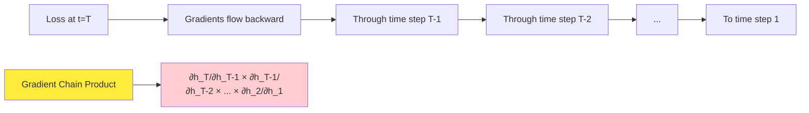
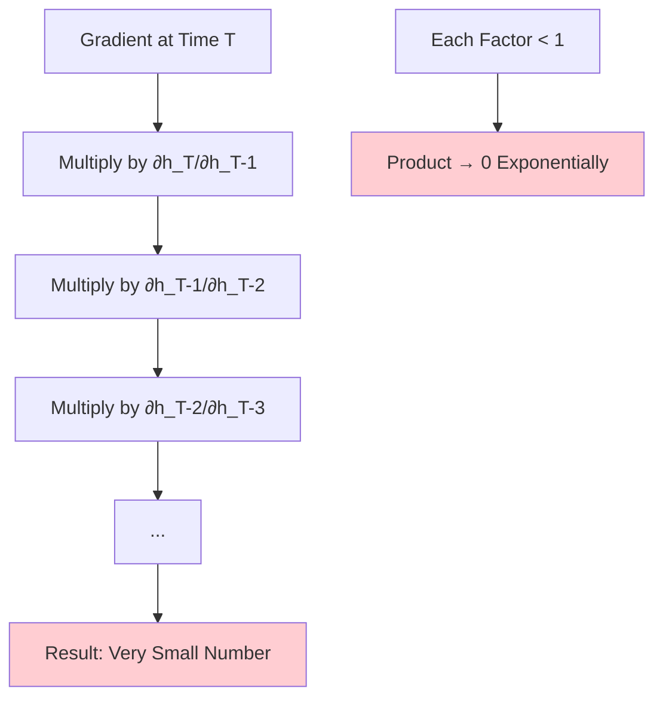
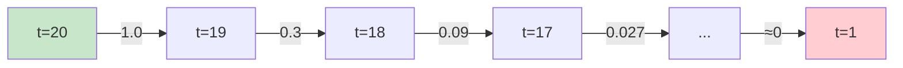
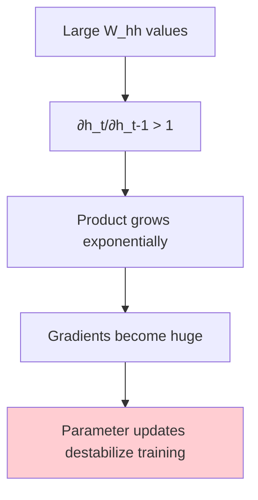
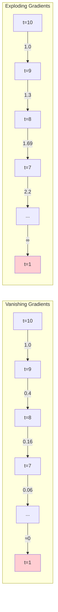
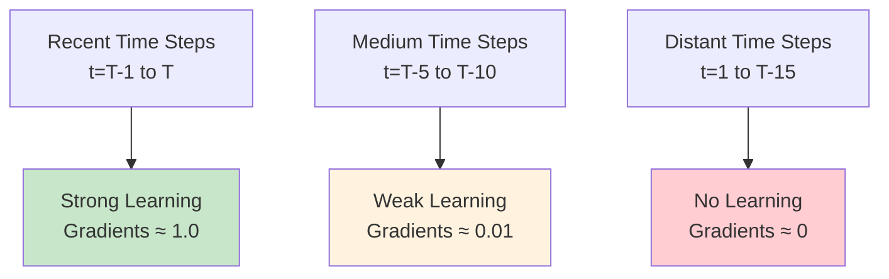
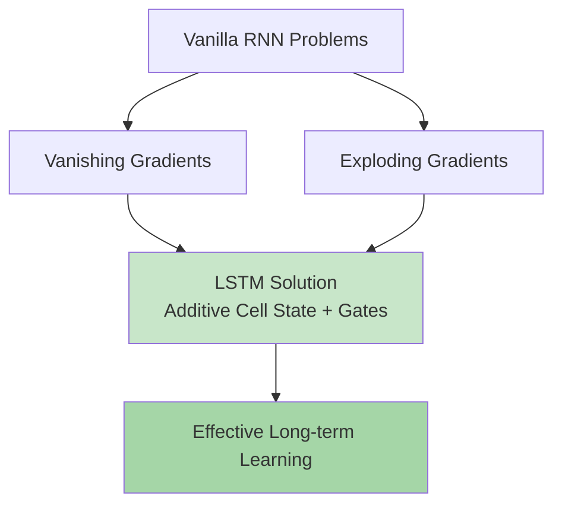
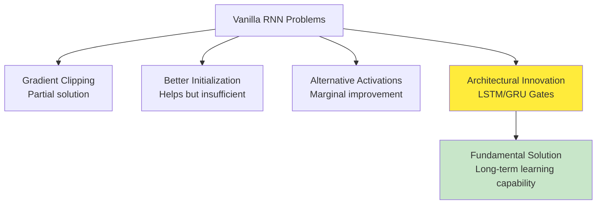

# Vanishing and Exploding Gradients | Problems with RNNs

## Overview

**Vanishing and Exploding Gradients** represent the fundamental limitations that prevent vanilla RNNs from learning long-term dependencies effectively. The material provides a comprehensive exploration of these **mathematical phenomena** that arise during Backpropagation Through Time (BPTT), revealing why simple RNNs struggle with sequences longer than 10-20 time steps. Understanding these problems is crucial for appreciating the revolutionary impact of advanced architectures like LSTMs and GRUs, which were specifically designed to overcome these limitations and enable learning across much longer temporal sequences.


*Gradient computation strategies in RNNs: showing how gradients flow and accumulate differently across time steps, illustrating the foundation of vanishing and exploding gradient problems*

## Building Upon BPTT Foundations

### The Mathematical Setup from BPTT

The material builds directly on the **Backpropagation Through Time** concepts, where gradients must flow backward through temporal dependencies:



**Critical Insight**: The gradient computation involves a **product of many terms**, and the behavior of this product determines whether the RNN can learn long-term dependencies effectively.

### Recalling the Hidden State Update

**RNN Hidden State Equation**:
```
h_t = tanh(W_ih × X_t + W_hh × h_{t-1} + b_h)
```

**Gradient Flow Equation**:
```
∂h_t/∂h_{t-1} = ∂tanh/∂z × W_hh
```

Where:
- **∂tanh/∂z**: Derivative of activation function
- **W_hh**: Hidden-to-hidden weight matrix (same across all time steps)

## The Vanishing Gradient Problem

### Mathematical Foundation

**Core Issue**: When gradients flow backward through many time steps, they become progressively smaller until they effectively disappear.

**Mathematical Analysis**:
```
∂L/∂h_1 = ∂L/∂h_T × ∂h_T/∂h_{T-1} × ∂h_{T-1}/∂h_{T-2} × ... × ∂h_2/∂h_1
```

**Product Chain Problem**:


### Activation Function Analysis: tanh Derivatives

**Hyperbolic Tangent Function**:
- **Range**: (-1, 1)
- **Derivative range**: (0, 1]
- **Maximum derivative**: 1 (at input = 0)
- **Typical derivatives**: Much less than 1

**Derivative Behavior**:
```python
import numpy as np
import matplotlib.pyplot as plt

def tanh_derivative(x):
    return 1 - np.tanh(x)**2

x = np.linspace(-3, 3, 1000)
dy_dx = tanh_derivative(x)

# Key observations:
# - Maximum derivative: 1.0 at x=0
# - At x=±1: derivative ≈ 0.42
# - At x=±2: derivative ≈ 0.07
# - At x=±3: derivative ≈ 0.01
```

**Critical Analysis**:
```
∂tanh/∂z typically ranges from 0.01 to 0.42
W_hh values are typically small (to maintain stability)
Therefore: ∂h_t/∂h_{t-1} = (∂tanh/∂z) × W_hh < 1
```

### The Exponential Decay Effect

**Mathematical Demonstration**:

If each gradient factor ∂h_t/∂h_{t-1} ≈ 0.3, then:

```
Time steps back: Gradient magnitude
1 step:         1.0
2 steps:        0.3
3 steps:        0.09
5 steps:        0.002
10 steps:       0.0000059
20 steps:       ≈ 0
```

**Visualization of Gradient Decay**:


### Practical Consequences of Vanishing Gradients

**Learning Limitations**:

1. **Short-term memory only**: RNN learns patterns within 5-10 time steps
2. **Long-term dependencies ignored**: Information from early time steps has no impact
3. **Gradient starvation**: Early layers receive virtually no learning signal
4. **Effective sequence length**: Limited to much shorter than actual sequence length

**Real-World Examples**:

**Language Modeling Problem**:
```
Input: "The cat, which had been missing for several days and was found by the neighbor yesterday, was sleeping."
Target: Predict that "was" should be followed by "sleeping"

Challenge: The subject "cat" is separated from the verb "was sleeping" by many words.
Vanilla RNN: Cannot learn this long-distance dependency effectively.
```

**Sentiment Analysis Problem**:
```
Review: "The movie started poorly with terrible acting, but the incredible plot twist in the final act and amazing cinematography made it absolutely worth watching."

Challenge: Early negative sentiment should be overridden by later positive sentiment.
Vanilla RNN: May be overly influenced by early negative words, missing the overall positive conclusion.
```

## The Exploding Gradient Problem

### Mathematical Foundation

**Core Issue**: When gradient factors are larger than 1, the product grows exponentially as it flows backward through time.

**Conditions for Explosion**:
```
If ∂h_t/∂h_{t-1} > 1, then:
∂L/∂h_1 = (factor > 1)^T → ∞ as T increases
```

**Mathematical Analysis**:


### Activation Function Analysis for Explosion

**Gradient Explosion Scenarios**:

1. **Large Weight Matrix**: If W_hh has large eigenvalues
2. **Activation Function Derivatives**: When tanh derivatives are close to maximum (≈1)
3. **Initialization Problems**: Poor weight initialization can cause instability

**Example Calculation**:
```
If ∂h_t/∂h_{t-1} ≈ 1.1 (slightly > 1), then:

Time steps back: Gradient magnitude
1 step:         1.0
2 steps:        1.1
5 steps:        1.61
10 steps:       2.59
20 steps:       6.73
50 steps:       117.4
100 steps:      13,780
```

### Practical Consequences of Exploding Gradients

**Training Instabilities**:

1. **Loss divergence**: Training loss becomes NaN or infinity
2. **Parameter overflow**: Weights become extremely large
3. **Learning breakdown**: Model performance degrades catastrophically
4. **Numerical instability**: Computations become unreliable

**Observable Symptoms**:

```python
# Signs of exploding gradients during training:
training_loss = [0.6, 0.5, 0.4, 0.3, 15.7, NaN, NaN, ...]
                                      ↑
                              Sudden spike indicates explosion
```

## Visualization of Gradient Flow Problems

### Gradient Magnitude Analysis

**Typical Gradient Behavior Through Time**:



### Impact on Learning Different Sequence Positions

**Learning Effectiveness by Position**:

| Time Step | Vanishing Gradient Impact | Learning Effectiveness |
|-----------|---------------------------|----------------------|
| t=T (last) | No degradation | Excellent |
| t=T-1 | Slight degradation | Good |
| t=T-5 | Moderate degradation | Fair |
| t=T-10 | Severe degradation | Poor |
| t=T-20 | Extreme degradation | None |



## Empirical Evidence and Research Findings

### Experimental Demonstrations

**Sequence Length Experiments**:

Research has shown that vanilla RNNs exhibit clear performance degradation as sequence length increases:

```
Sequence Length → RNN Performance
10 steps:        85% accuracy
20 steps:        72% accuracy
50 steps:        45% accuracy
100 steps:       ≈ random performance
```

**Gradient Norm Analysis**:

Studies measuring gradient norms during BPTT training show:

```python
# Gradient norms by time step (typical vanilla RNN)
gradient_norms = {
    'step_1': 1e-8,      # Vanished completely
    'step_5': 1e-5,      # Severely diminished
    'step_10': 1e-3,     # Weak but present
    'step_15': 1e-1,     # Moderate
    'step_20': 1.0       # Full strength (current time step)
}
```

### Theoretical Analysis

**Spectral Radius and Stability**:

The behavior depends on the spectral radius (largest eigenvalue) of the weight matrix:

```
λ_max = largest eigenvalue of W_hh

If λ_max < 1: Gradients vanish exponentially
If λ_max > 1: Gradients explode exponentially  
If λ_max ≈ 1: Gradients remain stable (difficult to achieve)
```

## Solutions and Mitigation Strategies

### Gradient Clipping for Exploding Gradients

**Implementation Strategy**:

```python
def clip_gradients(gradients, max_norm=1.0):
    """Clip gradients to prevent explosion"""
    total_norm = np.sqrt(sum(np.sum(grad**2) for grad in gradients))
    
    if total_norm > max_norm:
        clip_factor = max_norm / total_norm
        gradients = [grad * clip_factor for grad in gradients]
    
    return gradients

# PyTorch implementation
torch.nn.utils.clip_grad_norm_(model.parameters(), max_norm=1.0)

# TensorFlow implementation  
tf.clip_by_global_norm(gradients, clip_norm=1.0)
```

**Benefits of Gradient Clipping**:
- Prevents training instability
- Allows use of higher learning rates
- Simple and effective solution
- Widely adopted in practice

### Weight Initialization Strategies

**Careful Initialization**:

```python
# Xavier/Glorot initialization for RNN weights
def xavier_init(input_size, output_size):
    limit = np.sqrt(6.0 / (input_size + output_size))
    return np.random.uniform(-limit, limit, (input_size, output_size))

# He initialization (for ReLU activations)
def he_init(input_size, output_size):
    std = np.sqrt(2.0 / input_size)
    return np.random.normal(0, std, (input_size, output_size))

# Identity initialization for recurrent weights
def identity_init(size):
    return np.eye(size)
```

### Alternative Activation Functions

**ReLU and Variants**:

```python
# ReLU: f(x) = max(0, x)
# Advantage: Derivative is 0 or 1 (no vanishing in active region)
# Problem: Can still have exploding gradients

# Leaky ReLU: f(x) = max(0.01x, x)  
# Advantage: Non-zero gradient everywhere
```

**Limitations**: Even with better activations, fundamental architectural problems remain.

## Advanced Architectural Solutions

### Gating Mechanisms Preview

**The Fundamental Innovation**:

Advanced architectures (LSTM, GRU) solve gradient problems through **gating mechanisms** that provide:

1. **Controlled information flow**: Gates decide what to remember/forget
2. **Skip connections**: Information can bypass many time steps
3. **Additive updates**: Addition instead of multiplication preserves gradients
4. **Learnable forget**: Model learns what to retain vs. discard



### Residual Connections

**Skip Connection Concept**:

```
h_t = f(h_{t-1}, x_t) + h_{t-1}
```

The addition of h_{t-1} provides a direct gradient path, similar to ResNet architectures.

## Real-World Impact and Historical Context

### Before LSTM/GRU Era

**Historical Limitations** (1990s-2000s):
- RNNs limited to very short sequences
- Language modeling restricted to local context
- Machine translation used phrase-based statistical methods
- Speech recognition relied on HMMs and GMMs

### Post-LSTM Revolution

**Breakthrough Applications** (2010s onwards):
- Long-form text generation
- Neural machine translation
- Speech-to-text systems
- Time series forecasting over extended periods

## Experimental Demonstrations

### Synthetic Task: Copy Problem

**Task Definition**:
```
Input:  [1, 2, 3, 4, 0, 0, 0, 0, 0, 9]
Output: [0, 0, 0, 0, 0, 1, 2, 3, 4, 0]
```

**Challenge**: Copy first 4 digits after seeing delimiter (9)

**Vanilla RNN Performance**:
- Sequence length 10: 95% accuracy
- Sequence length 20: 60% accuracy  
- Sequence length 50: Random performance

### Natural Language Task: Subject-Verb Agreement

**Task Example**:
```
"The cat that [many words] was sleeping"
         ↑                    ↑
      subject              verb (must agree)
```

**Vanilla RNN Limitations**:
- Works for short distances (< 5 words)
- Fails for long distances (> 15 words)
- Cannot learn systematic grammatical rules

## Key Insights and Takeaways

### The Fundamental Trade-off

**Memory vs. Stability**:
- To remember long-term dependencies, gradients must flow backward many steps
- But long gradient paths inevitably lead to vanishing or exploding problems
- This creates an inherent tension in vanilla RNN architecture

### Why Gradient Problems are Fundamental

**Not Just Implementation Issues**:
1. **Mathematical inevitability**: Product of many terms < 1 or > 1
2. **Architectural limitation**: Basic recurrent structure is insufficient
3. **Universal problem**: Affects all vanilla RNN variants
4. **Requires architectural innovation**: Cannot be solved with better optimization alone

### The Path to Modern RNNs

**Evolution of Solutions**:



## Future Learning Pathways

### Next Topics in RNN Mastery

**Immediate Next Steps**:
1. **LSTM (Long Short-Term Memory)**: Detailed gating mechanisms
2. **GRU (Gated Recurrent Unit)**: Simplified but effective approach
3. **Bidirectional RNNs**: Processing sequences in both directions
4. **Deep RNNs**: Stacking multiple recurrent layers

**Advanced Architectures**:
- **Attention Mechanisms**: Selective focus without recurrence
- **Transformers**: Parallel processing with self-attention
- **Memory Networks**: External memory for long-term storage

### Practical Implementation Strategy

**Development Approach**:
1. **Understand the problems**: Recognize vanishing/exploding gradient symptoms
2. **Use proven solutions**: Start with LSTM/GRU instead of vanilla RNNs
3. **Monitor training**: Watch for gradient norm instabilities
4. **Apply best practices**: Gradient clipping, proper initialization
5. **Evaluate sequence length**: Test performance on long vs. short sequences

## Thought-Provoking Questions

1. **Alternative Learning Paradigms**: Given that gradient-based learning through many time steps is inherently problematic, how might we develop learning algorithms that don't rely on backpropagating gradients through long temporal sequences? Could techniques from reinforcement learning or meta-learning offer fundamentally different approaches to temporal credit assignment?

2. **Biological Plausibility**: Real neural networks in the brain appear to learn long-term dependencies without the mathematical constraints that limit artificial RNNs. What can we learn from biological neural networks about alternative mechanisms for temporal learning that might circumvent the vanishing gradient problem entirely?

3. **Information Compression vs. Memory**: The vanishing gradient problem essentially reflects a limitation in how much information can be compressed and transmitted through a fixed-size hidden state. How might we design architectures that automatically determine the optimal amount of information to retain at each time step, balancing memory capacity with computational efficiency?

[End of Notes]