# LSTM | Long Short Term Memory | Part 1 | The What?

## Overview

**Long Short-Term Memory (LSTM)** represents a revolutionary advancement in neural network architecture, specifically designed to overcome the fundamental limitations of vanilla RNNs in learning long-term dependencies. The material provides a comprehensive introduction to LSTM's core concept through an engaging storytelling approach, demonstrating how LSTMs solve the **vanishing gradient problem** by introducing separate **short-term and long-term memory pathways**. This foundational understanding reveals why LSTMs became the cornerstone for modern sequential learning applications, from language modeling to the foundational technologies behind ChatGPT and transformer architectures.


*LSTM cell architecture showing the three gates (forget, input, output) and dual memory pathways that enable effective long-term learning*

## Building Upon RNN Limitations

### Course Continuation and Context

The material establishes important context about the learning journey, emphasizing that this deep learning playlist resumes after a 7-month pause due to mentorship program commitments. The **overwhelming demand** from learners through emails, messages, and comments across platforms demonstrates the critical importance of this content for the AI/ML community.

**Learning Roadmap Preview**:


### Critical Context: RNN Limitations Recap

The material provides essential background by revisiting the fundamental problems that motivated LSTM development:

**Traditional ANN Limitations**:
- **Fixed input size requirement**: Cannot handle variable-length sequences
- **Simultaneous processing**: Loses sequential context and order dependency
- **No temporal awareness**: Cannot capture chronological relationships

**Example Problem**:
```
Sentence: "Hi my name is Nitish"
ANN Processing: Converts entire sentence to vectors simultaneously
Problem: Word order becomes meaningless
Result: Cannot understand sequential meaning
```

**RNN Attempted Solution**:
- **Sequential processing**: One word at a time
- **State mechanism**: Hidden state carries information forward
- **Memory through recurrence**: h_t depends on h_{t-1}


## The Fundamental Problem: Long-Term Dependencies

### Practical Demonstration Through Example

**Complex Sentence Analysis**:
```
"Maharashtra is a beautiful state. It has got 25 cities. It has got beautiful vegetation and forests and whatever Mumbai and... Language spoken there is ___"
```

**The Challenge**:
- **Target prediction**: The blank should be filled with "Marathi"
- **Dependency**: Answer depends on "Maharashtra" mentioned at the very beginning
- **Problem**: By the time RNN reaches the blank, it has forgotten "Maharashtra"
- **Root cause**: Vanishing gradient problem through long sequences

### Mathematical Foundation of the Problem

**Vanishing/Exploding Gradient Issue**:
The material references detailed mathematical analysis from previous videos showing that when sequences become long:

```
Gradient flow: ∂L/∂h_1 = ∂L/∂h_T × ∏(∂h_t/∂h_{t-1})
```

**Consequences**:
- **Vanishing gradients**: Information from early time steps disappears
- **Limited memory span**: RNNs effectively remember only 10-20 time steps
- **Early information loss**: Beginning of sequences cannot influence final predictions

## LSTM's Revolutionary Solution: The Core Concept

### The Storytelling Approach to Understanding

The material uses an engaging story about three generations of kings to illustrate LSTM's memory mechanism:

**Story Setup**: Text classification task to determine if a story is good or bad

**Character Introduction**:
- **Vikram**: Very powerful and kind king of Pratapgarh (1000 years ago)
- **Enemy X**: Neighboring country's king who attacks
- **Vikram Junior**: Son with 1.5x his father's qualities
- **Vikram Super Junior**: Grandson who is smart but not physically strong

### Human Cognitive Processing Simulation

**How Humans Process Sequential Stories**:

1. **Word-by-word processing**: Read sequentially, not all at once
2. **Context building**: Continuously update understanding
3. **Memory management**: Decide what's important for long-term retention
4. **Dynamic updating**: Add new important information, remove outdated context

**Example Memory Evolution**:


### The Dual Memory Architecture Insight

**Key Realization**: Human cognition maintains two types of memory:
- **Short-term memory**: Current context and immediate processing
- **Long-term memory**: Important information retained across time

**RNN's Limitation**:


**LSTM's Innovation**:


## LSTM Architecture: From Concept to Structure

### Architectural Comparison

**Traditional RNN**:
- **Single state pathway**: One hidden state line
- **Simple structure**: Minimal internal complexity
- **Limited capability**: Cannot maintain long-term dependencies


*Animated visualization of a vanilla RNN showing simple information flow through a single hidden state pathway*

**LSTM Architecture**:
- **Dual state pathways**: Separate short-term and long-term memory
- **Complex internal structure**: Sophisticated gate mechanisms
- **Enhanced capability**: Effective long-term dependency learning


*Animated visualization of LSTM showing complex gate mechanisms and dual memory pathways in action*

### The Three-Gate System

The material introduces LSTM's core innovation: **three specialized gates** that manage memory flow:


*Detailed LSTM cell architecture showing the three gates (forget, input, output) and how they control information flow through the cell*

**Dynamic LSTM Visualization**:


*Real-time animation showing how information flows through LSTM gates: the forget gate (removing outdated information), input gate (adding new information), and output gate (generating predictions)*


**Visual Architecture of LSTM Gates**:

```mermaid
graph TB
    subgraph "LSTM Cell at Time t"
        subgraph "Forget Gate"
            FG["σ"]
            FG_text["Decides what to<br/>forget from C_t-1"]
        end
        
        subgraph "Input Gate"
            IG["σ"]
            IG_text["Decides what to<br/>store in C_t"]
            CG["tanh"]
            CG_text["Creates candidate<br/>values"]
        end
        
        subgraph "Output Gate"
            OG["σ"]
            OG_text["Decides what to<br/>output based on C_t"]
        end
        
        X["X_t"] --> FG
        H1["h_t-1"] --> FG
        
        X --> IG
        H1 --> IG
        
        X --> CG
        H1 --> CG
        
        X --> OG
        H1 --> OG
        
        C1["C_t-1"] --> FG_out["×"]
        FG --> FG_out
        
        IG --> IG_out["×"]
        CG --> IG_out
        
        FG_out --> Plus["+"]
        IG_out --> Plus
        
        Plus --> C2["C_t"]
        C2 --> tanh2["tanh"]
        tanh2 --> OG_out["×"]
        OG --> OG_out
        
        OG_out --> H2["h_t"]
        
        style FG fill:#ffcdd2
        style IG fill:#c5e1a5
        style OG fill:#bbdefb
    end
```



**Gate Operations Flow**:

```mermaid
flowchart LR
    subgraph "Time t-1"
        C_prev["Long-term<br/>Memory C_t-1"]
        h_prev["Short-term<br/>Memory h_t-1"]
    end
    
    subgraph "Current Input"
        X_curr["Input X_t"]
    end
    
    subgraph "Gate Processing"
        F["Forget Gate<br/>f_t = σ(W_f·[h_t-1,X_t]+b_f)"]
        I["Input Gate<br/>i_t = σ(W_i·[h_t-1,X_t]+b_i)"]
        C_tilde["Candidate<br/>C̃_t = tanh(W_c·[h_t-1,X_t]+b_c)"]
        O["Output Gate<br/>o_t = σ(W_o·[h_t-1,X_t]+b_o)"]
    end
    
    subgraph "Memory Update"
        Update["C_t = f_t×C_t-1 + i_t×C̃_t"]
        Output["h_t = o_t×tanh(C_t)"]
    end
    
    C_prev --> F
    h_prev --> F
    X_curr --> F
    
    h_prev --> I
    X_curr --> I
    
    h_prev --> C_tilde
    X_curr --> C_tilde
    
    h_prev --> O
    X_curr --> O
    
    F --> Update
    I --> Update
    C_tilde --> Update
    C_prev --> Update
    
    Update --> Output
    O --> Output
    
    Update --> C_next["Long-term<br/>Memory C_t"]
    Output --> h_next["Short-term<br/>Memory h_t"]
    
    style F fill:#ffcdd2
    style I fill:#c5e1a5
    style O fill:#bbdefb
```



**Simplified Gate Interaction Diagram**:

```mermaid
graph TD
    subgraph "Inputs"
        X_t["Current Input<br/>X_t"]
        h_prev["Previous Short-term<br/>h_t-1"]
        C_prev["Previous Long-term<br/>C_t-1"]
    end
    
    subgraph "Three Gates Control Flow"
        FG["🚪 Forget Gate<br/>What to forget?"]
        IG["🚪 Input Gate<br/>What to add?"]
        OG["🚪 Output Gate<br/>What to output?"]
    end
    
    subgraph "Memory Operations"
        Forget["Forget old info<br/>C_t-1 × f_t"]
        Add["Add new info<br/>C̃_t × i_t"]
        Combine["C_t = Forget + Add"]
    end
    
    subgraph "Outputs"
        C_new["New Long-term<br/>C_t"]
        h_new["New Short-term<br/>h_t"]
    end
    
    X_t --> FG
    h_prev --> FG
    X_t --> IG
    h_prev --> IG
    X_t --> OG
    h_prev --> OG
    
    C_prev --> Forget
    FG --> Forget
    
    IG --> Add
    
    Forget --> Combine
    Add --> Combine
    
    Combine --> C_new
    Combine --> OG
    OG --> h_new
    
    style FG fill:#ffcdd2
    style IG fill:#c5e1a5
    style OG fill:#bbdefb
    style Combine fill:#fff3e0
```



### Gate Functionality Simplified

**Forget Gate**:
```
Function: Analyze current input + short-term memory → Decide what to remove from long-term memory
Example: When Vikram dies, remove him from long-term character list
```

**Input Gate**:
```
Function: Analyze current input → Decide what new information to add to long-term memory  
Example: When Vikram Junior appears, add him as new important character
```

**Output Gate**:
```
Function: Combine current input + long-term memory → Generate output and next short-term state
Example: At story end, use all retained information to judge story quality
```

## LSTM as a Computational System

### Computer Analogy

The material presents LSTM as a **sophisticated computational system**:

**Input-Process-Output Model**:


### Internal Processing Operations

**Core LSTM Operations**:
1. **Memory Update**: Modify long-term memory (add new, remove old)
2. **State Generation**: Create short-term memory for next time step

**Mathematical Representation**:
```
Inputs: C_{t-1} (long-term), h_{t-1} (short-term), X_t (current)
Processing: Gate operations + memory management
Outputs: C_t (updated long-term), h_t (new short-term)
```

## Key Insights and Architectural Innovation

### Why LSTM Architecture is Complex

**Complexity Source**: The sophisticated internal structure exists to enable **communication between memory types**:

- **Memory interaction**: Short-term and long-term memory must coordinate
- **Dynamic decisions**: Gates must decide what to retain, forget, and output
- **Context awareness**: Decisions based on current input and memory states
- **Temporal consistency**: Maintain coherent information flow across time

### The Gateway Mechanism

**Purpose of Gates**: Enable intelligent memory management through:
- **Selective attention**: Focus on relevant information
- **Dynamic filtering**: Remove outdated or irrelevant data  
- **Contextual updates**: Add information based on current context
- **Integrated output**: Combine all information sources effectively

## Comparison with Traditional Approaches

### RNN vs LSTM: Core Differences

| Aspect | RNN | LSTM |
|--------|-----|------|
| **Memory Types** | Single hidden state | Dual: short-term + long-term |
| **Architecture** | Simple, linear | Complex, gated structure |
| **Memory Span** | 10-20 time steps | 100+ time steps |
| **Gradient Flow** | Vanishing/exploding | Controlled through gates |
| **Information Management** | Passive retention | Active selection and filtering |

### Practical Implications

**RNN Limitations in Practice**:
- **Language modeling**: Cannot capture long-distance dependencies
- **Machine translation**: Loses context from beginning of sentences
- **Sentiment analysis**: Forgets important sentiment indicators

**LSTM Advantages**:
- **Long-term learning**: Maintains relevant information across extended sequences
- **Selective memory**: Intelligently manages what to remember and forget
- **Stable training**: Addresses vanishing gradient problem
- **Versatile applications**: Enables complex sequential learning tasks

## Historical Context and Impact

### LSTM's Role in AI Evolution

**Foundation for Modern AI**:
The material emphasizes that LSTMs provide the **foundational understanding** for:
- **Large Language Models**: ChatGPT and similar systems
- **Transformer architectures**: Attention mechanisms
- **Modern NLP**: Advanced text processing capabilities
- **Industry applications**: Real-world sequential learning systems

**Learning Importance**:
- **Industry relevance**: Widely used in production systems
- **Conceptual foundation**: Essential for understanding advanced architectures
- **Theoretical depth**: Bridges gap between basic and advanced neural networks

## Future Learning Pathway

### Upcoming Video Structure

**Planned Progression**:
1. **Video 61 (Current)**: What is LSTM? - Core concepts and intuition
2. **Video 62**: How does LSTM work? - Mathematical details and architecture
3. **Video 63**: Why does LSTM work? - Theoretical foundations and analysis  
4. **Video 64**: LSTM implementation - Practical coding project

### Next Steps in Understanding

**Mathematical Deep Dive Preview**:
- **Gate equations**: Detailed mathematical formulations
- **Activation functions**: Sigmoid and tanh operations
- **Weight matrices**: Parameter structure and learning
- **Backpropagation**: How gradients flow through gates

## Thought-Provoking Questions

1. **Memory Management Trade-offs**: While LSTMs solve long-term dependency problems through selective memory management, this introduces computational complexity and potential overfitting. How might we design architectures that achieve LSTM-like memory capabilities with reduced complexity, and what would be the fundamental trade-offs?

2. **Biological Plausibility of Gated Memory**: LSTMs use explicit gates to control information flow, but biological neural networks don't appear to have such discrete switching mechanisms. What can we learn from how biological systems manage short-term and long-term memory, and how might this inspire more naturalistic architectures for artificial systems?

[End of Notes]