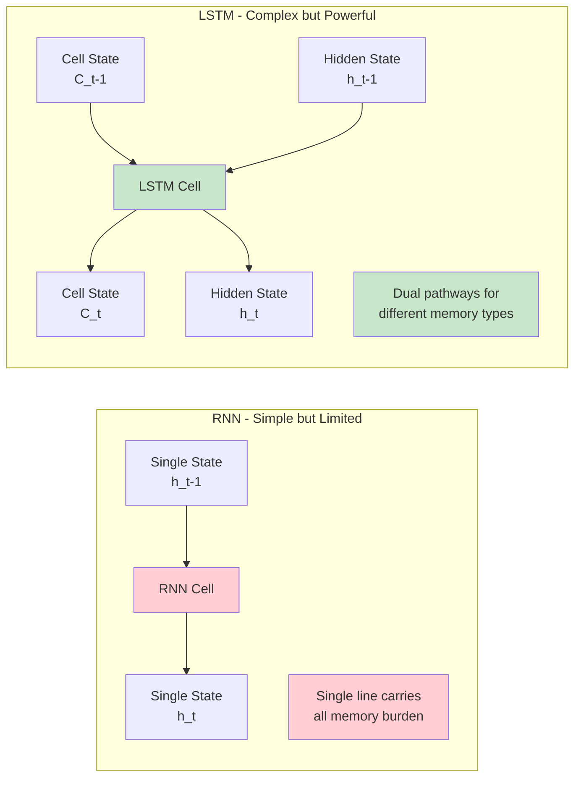
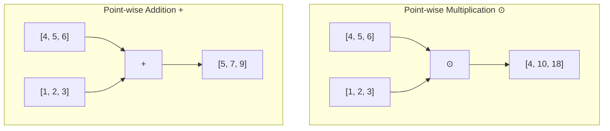
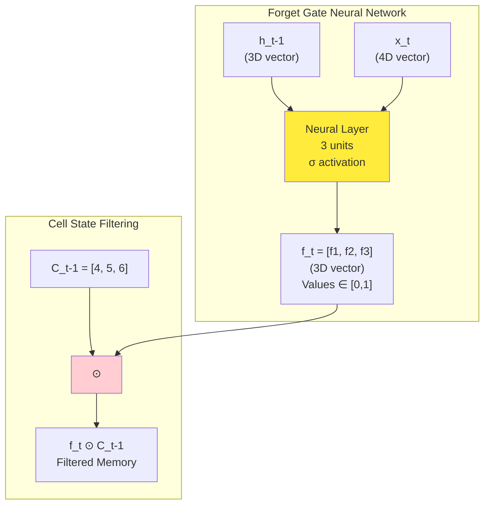
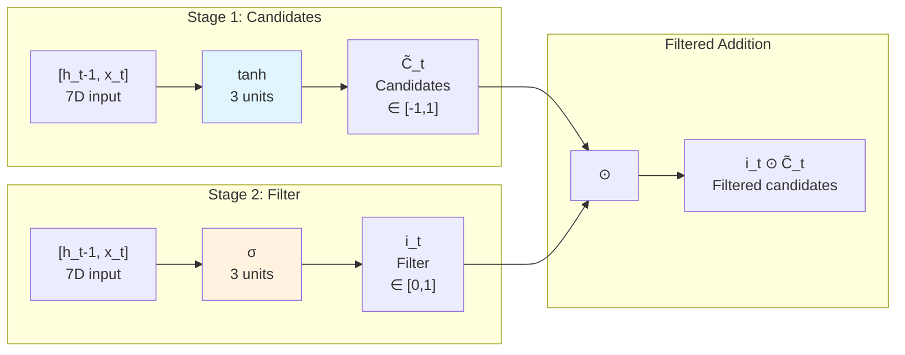
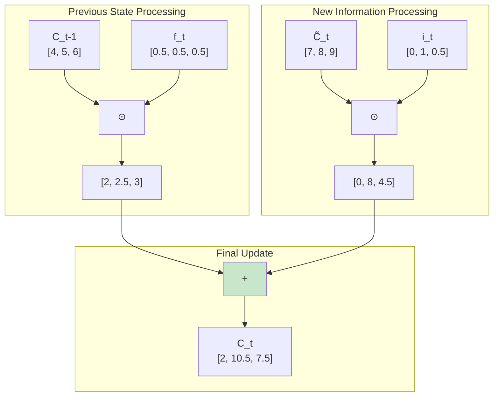
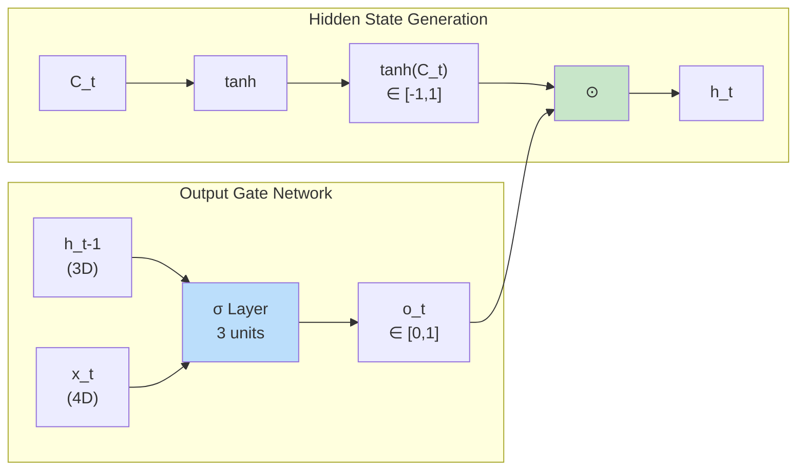
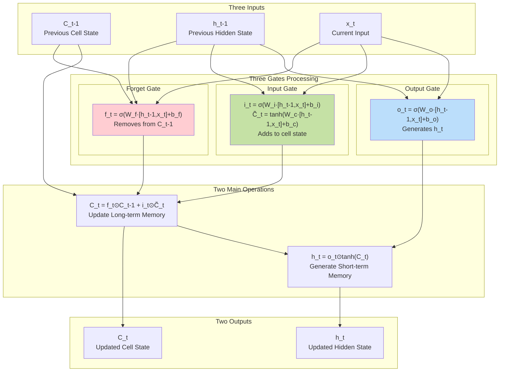
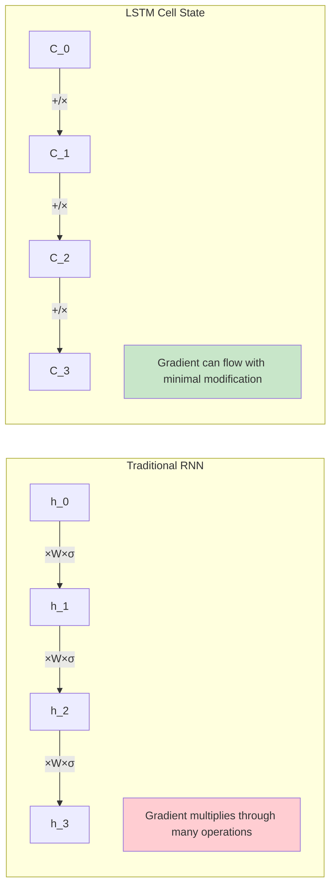
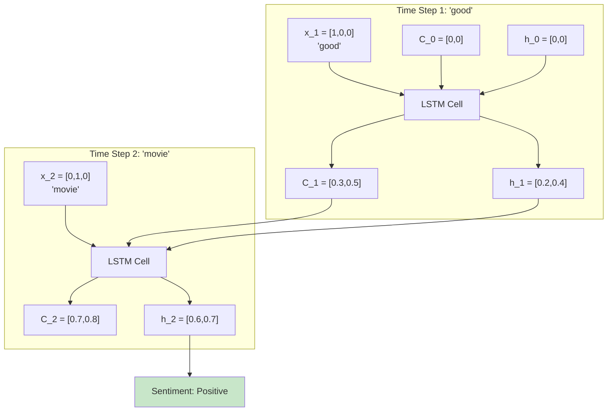

# LSTM Architecture | Part 2 | The How?

## Overview

**LSTM Architecture Deep Dive** represents a comprehensive exploration of how Long Short-Term Memory networks function at the mathematical and structural level. The material provides an in-depth examination of the **three-gate system** (forget, input, and output gates) and demonstrates how these components work together to maintain both **short-term and long-term memory**. Through detailed mathematical formulations and visual representations, this content reveals how LSTMs solve the vanishing gradient problem by creating **controlled information highways** that allow relevant information to flow across many time steps without degradation.


*Complete LSTM architecture showing the flow of information through the cell state (top horizontal line) and hidden state (bottom connections) with all three gates visible*

## Building Upon Previous Foundations

### Course Context and Importance

The material establishes critical context by acknowledging that LSTM architecture is **notoriously difficult to understand**, especially for beginners. The instructor emphasizes three key points:

1. **Complexity Warning**: The architecture is inherently complex, requiring patience and careful attention - "Don't be scared, this is my first suggestion"
2. **Time Investment**: The video is intentionally long (over an hour) to ensure comprehensive understanding - "You need to have patience and watch the complete video"
3. **Sequential Learning**: Viewing previous videos on RNNs and LSTM introduction is essential - "Don't directly jump to this video without watching the previous ones"

**Key Promise**: "तुम मुझे टाइम दो मैं तुम्हें कॉन्सेप्ट दूंगा" (You give me time, I'll give you the concept) - emphasizing that thorough understanding requires patient, detailed exploration.

**Teaching Philosophy**: The instructor uses a step-by-step approach, first showing the complete complex architecture, then breaking it down component by component to make it digestible.

### Quick Recap of Core Concepts

**Why LSTM Architecture is More Complex**:
The material begins by comparing RNN and LSTM architectures side by side. "Even a child can tell that this one (LSTM) looks more difficult," but this complexity exists for important reasons.

**LSTM vs RNN Key Differences**:



**Two Memory Types**:
- **Long-term memory**: Cell state (C_t) - technically called "cell state"
- **Short-term memory**: Hidden state (h_t) - technically called "hidden state"

**Key Innovation**: LSTM enables **interaction between these two memory types** - this communication setup is what makes the architecture complex.

## Mathematical Foundations: Understanding the Components

### Vectors as Building Blocks

**Fundamental Truth**: Everything in LSTM is a **vector** (collection of numbers)

The instructor emphasizes: "If I give you the answer in one word, both of these are actually vectors. Vector means collection of numbers."

**Example Vector Representation**:
```
Cell State C_t = [0.1, -0.3, 0.5]  (3-dimensional vector)
Hidden State h_t = [0.2, 0.4, -0.1] (3-dimensional vector)
```

**Critical Rule**: The dimensions of C_t and h_t are **always identical** - "This is the first thing you need to remember. This is like a rule. This rule never breaks in LSTM."

**Input-Output Consistency**: 
- Vector input from here → Vector output from here
- Both vectors have the same dimensions
- This dimension consistency is maintained throughout the entire LSTM architecture

### Input Vector (X_t)

**Text Vectorization Example**:
The instructor explains text-to-vector conversion: "Let's say we're using our LSTM to solve a sentiment analysis problem where we're given text and need to predict whether sentiment is 1 or 0."

For vocabulary: {cat, mat, rat}
```
"cat" → X_t = [1, 0, 0]
"mat" → X_t = [0, 1, 0]  
"rat" → X_t = [0, 0, 1]
```

**Key Point**: "We use text vectorization - there are multiple techniques we've studied. We'll use a simple technique."

**Dimension Consistency**: "You can think of it as three here, and this equals three. So basically, X_t is just one word converted to a vector."

**All Six Vectors**: The instructor identifies six key vectors in LSTM:
- f_t, i_t, C̃_t, o_t (gate outputs and candidates)
- All maintain the same dimension (e.g., all 3-dimensional vectors)
- "All six vectors we've studied so far - their shape or number of dimensions is exactly the same"

### Mathematical Operations in LSTM

**Point-wise Operations Explained**:

The instructor explains: "Let me quickly explain this - it's a very easy concept. First, let's understand how point-wise multiplication works."

**Point-wise Multiplication Example**:
```
C_{t-1} = [4, 5, 6] (vector)
f_t = [1, 2, 3] (vector)  
```

"Both have the same shape/dimension. When you apply this operation, you're doing element-wise multiplication:"
```
Result = [4×1, 5×2, 6×3] = [4, 10, 18]
```

**Point-wise Addition Example**:
```
Vector 1 = [4, 5, 6]
Vector 2 = [1, 2, 3]
Result = [4+1, 5+2, 6+3] = [5, 7, 9]
```

**Visual Representation**:


**Red Color Operations**: "All these red-colored operations are called point-wise operations."

## The Three-Gate System: Detailed Architecture

### Gate Overview and Identification

The instructor begins: "Now it's time to understand the most important concept of LSTM, which is the concept of gates. If you watch any video on LSTM on YouTube, they'll start teaching you gates."

**Gate Identification in Architecture**:
"I've highlighted parts of this complex architecture. This diagram I've taken from a very good blog (link will be in description)."

1. **Forget Gate**: "This highlighted part is called the forget gate"
2. **Input Gate**: "This entire part is called the input gate" (between two specific lines)
3. **Output Gate**: "This part is called the output gate"


*Notation guide for LSTM diagrams: Yellow boxes represent neural network layers, pink circles represent pointwise operations, and lines represent vectors*

**Gate Functions Summary**:
1. **Forget Gate (f_t)**: "Decides what to remove from cell state - removes something from the cell state line"
2. **Input Gate (i_t)**: "Adds some new important information to the cell state"
3. **Output Gate (o_t)**: "Calculates this thing (hidden state h_t)"

**Learning Strategy**: "We need to study these three gates individually and then connect them in your mind, and you'll understand how LSTM works."

### Forget Gate: Selective Memory Removal

**Architecture Setup and Neural Network Design**:

The instructor explains with detailed architecture decisions: "Before we understand the three gates, I want to simplify things further. Let me explain mathematically how all these components look in the LSTM cell."

**Key Architectural Decision**:
"First, we decide how many nodes or units will be in this neural network layer. Since our cell state and hidden state are 3-dimensional vectors, we'll have 3 units. This stays consistent."

**Neural Network Structure**:
"Let me draw the neural network and show you. This neural network layer will have 3 units, and all will have sigmoid activation function."


*The forget gate determines what information to discard from the previous cell state*

**Detailed Mathematical Formulation**:
```
f_t = σ(W_f · [h_{t-1}, x_t] + b_f)
```

**Input Sources**: 
- "This neural network layer gets input from two places: x_t and h_{t-1}"
- "x_t is a 4-dimensional vector, h_{t-1} is a 3-dimensional vector"

**Detailed Step-by-Step Process**:

**Weight Matrix Calculation**:
"This will be fully connected. We have 3 weights here... so basically 21 weights in total for our network."

**Input Processing**:
"When this entire input passes through these 3 nodes, these 3 nodes will give one output each: f1, f2, and f3. We can collectively put these in a vector."

**Mathematical Operation**:
"The equation becomes: f_t = σ(W_f · [h_{t-1}, x_t] + b_f)"



**Concatenation Process**:
"We concatenate both inputs: [h_{t-1}, x_t] becomes a 7-dimensional vector (3+4)"

**Weight Matrix Dimensions**:
- W_f: (3 × 7) matrix - "where 7 = concatenated dimension of [h_{t-1}, x_t]"
- b_f: (3 × 1) bias vector - "represented as b_f"

**Practical Example**:
"Let's say C_{t-1} = [4, 5, 6] and f_t = [0.5, 0.5, 0.5]"

**Point-wise Multiplication Result**:
```
f_t ⊙ C_{t-1} = [0.5×4, 0.5×5, 0.5×6] = [2, 2.5, 3]
```

**Gate Behavior Understanding**:
- **f_t = [0, 0, 0]**: "You've removed 100% of things from cell state - you've made everything zero"
- **f_t = [1, 1, 1]**: "Complete retention - everything passes through as it was"
- **f_t = [0.5, 0.5, 0.5]**: "50% information goes forward"

**Why Called a 'Gate'**:
"Now I guess you understand why we call it a gate. What does a gate do? It either allows or blocks. This f_t has the power to decide how much information from C_{t-1} will go forward."

### Input Gate: Selective Information Addition

**Function and Purpose**:
"Now we move to our second gate, which is the input gate. If I have to tell you in one line what the input gate function is: Add some new important information to the cell state."

**Analogy from Previous Video**:
"I told you in the story example - whenever a new king was coming in our story, we understood this is important information and we lifted it and added it to long-term context."

**Two-Stage Process Explanation**:
"The input gate works in two stages, which I'll tell you one by one."


*The input gate controls what new information gets stored in the cell state*

**Stage 1 - Candidate Cell State (C̃_t)**:
"Based on current input and previous hidden state, we find some new candidate values that are worth adding to cell state."
```
C̃_t = tanh(W_c · [h_{t-1}, x_t] + b_c)
```

**Stage 2 - Input Gate Filter (i_t)**:
"We calculate what should actually be added from these candidates."
```
i_t = σ(W_i · [h_{t-1}, x_t] + b_i)
```

**Why Two Stages?**:
"Stage 1 creates candidates, Stage 2 filters which candidates to actually add."

**Detailed Architecture Implementation**:

**Stage 1 Neural Network**:
"This neural network layer has 3 units (consistent with our architecture). All three have tanh activation function."

**Weight Matrix Naming**:
"The weight matrix is called W_c because this is for candidate cell state."

**Stage 2 Neural Network**:
"This is a separate neural network. It also has 3 units because that needs to be consistent, but all three have sigmoid activation function."

**Mathematical Equations**:
- **Stage 1**: "C̃_t = tanh(W_c · [h_{t-1}, x_t] + b_c)"
- **Stage 2**: "i_t = σ(W_i · [h_{t-1}, x_t] + b_i)"

**Combined Update Process**:


**Weight Matrix Dimensions**:
"Both W_c and W_i are 3×7 matrices (3 outputs, 7 inputs from concatenation)."

**Practical Example with Numbers**:

**Candidates Generation**:
"Let's say candidate cell state C̃_t = [7, 8, 9]"

**Input Gate Filtering**:
"And input gate i_t = [0, 1, 0.5]"

**Filtered Addition**:
```
i_t ⊙ C̃_t = [0×7, 1×8, 0.5×9] = [0, 8, 4.5]
```

**Interpretation**:
- "First candidate (7) is completely rejected (×0)"
- "Second candidate (8) is completely accepted (×1)" 
- "Third candidate (9) is partially accepted (×0.5 = 4.5)"

**Filter Concept**:
"This filter decides what information from candidate cell state will actually go to the cell state. Based on current input and previous hidden state, whatever we felt was worth adding, we filtered it."

### Cell State Update: The Core Memory Mechanism

**The Final Addition Operation**:
"Now what happens is a point-wise addition between these two quantities, and from this we get C_t."


*Combining forget gate output and input gate output to update the cell state*

**Complete Cell State Update Equation**:
```
C_t = f_t ⊙ C_{t-1} + i_t ⊙ C̃_t
```

**What We Had So Far**:
- From forget gate: "f_t ⊙ C_{t-1}" (filtered previous memory)
- From input gate: "i_t ⊙ C̃_t" (filtered new candidates)

**Final Operation**: "Point-wise addition between these two quantities gives us C_t"

**Visual Flow with Concrete Example**:

**Previous Memory (After Forgetting)**:
"From forget gate: f_t ⊙ C_{t-1} = [0.5, 0.5, 0.5] ⊙ [4, 5, 6] = [2, 2.5, 3]"

**New Information (After Filtering)**:
"From input gate: i_t ⊙ C̃_t = [0, 1, 0.5] ⊙ [7, 8, 9] = [0, 8, 4.5]"

**Final Addition**:
"C_t = [2, 2.5, 3] + [0, 8, 4.5] = [2, 10.5, 7.5]"



**The Beauty of This Design**:
"Now see the beauty! If you remember, the biggest problem in RNN was vanishing gradient problem on hidden state, due to which this quantity became very diminished over long distances."

**Key Insight**: "LSTM has the power that if it feels no new information is important and nothing needs to be removed, then important information from sentence can reach forward without any loss!"

### Output Gate: Generating the Hidden State

**Purpose and Function**:
"Now we've reached the last leg of our journey, and the last gate we need to read is the output gate."

**What Output Gate Does**:
"The job of this gate is to decide the output for the current time step, or decide the value of hidden state h_t."

**Location in Architecture**:
"Everything to the right of this line is our output gate."


*The output gate determines what parts of the cell state to expose as the hidden state*

**Two-Step Process Explained**:

**Step 1 - Output Gate Calculation**:
"First, we calculate o_t from C_t (cell state)."
```
o_t = σ(W_o · [h_{t-1}, x_t] + b_o)
```

**Step 2 - Hidden State Generation**:
"You filter this vector using this quantity (o_t), and this filtering gives you h_t."
```
h_t = o_t ⊙ tanh(C_t)
```

**Why Hidden State Comes from Cell State**:
"Your hidden state is derived from long-term context or cell state."

**Detailed Architecture Implementation**:

**Neural Network Configuration**:
"How many nodes will there be? 3, because that needs to be consistent. All activation functions will be sigmoid."

**Input Sources**:
"It gets input from two places: current time input and previous time step."

**Weight Matrix and Bias**:
"The weight matrix W_o is 3×7 (three outputs, seven inputs from concatenation)."

**Step-by-Step Calculation**:
1. "Take concatenation of h_{t-1} and x_t"
2. "Multiply with weight matrix W_o"
3. "Add bias b_o"
4. "Apply sigmoid activation"

**Architecture Visualization**:


**Point-wise Multiplication**:
"You do point-wise multiplication of o_t with this quantity (tanh(C_t))."

**Final Equation**:
"h_t = o_t ⊙ tanh(C_t) - this is how you calculate h_t."

## Complete LSTM Information Flow

### Summary of Complete Architecture

**Congratulations Message**:
"Congratulations! You have understood the LSTM architecture!"

**LSTM as a Computational System**:
The instructor provides a final summary: "This entire complex design you see has just two jobs: first, update long-term memory, and second, calculate short-term memory or hidden state that you send to the next time stamp."

**Three-Step Process Summary**:
1. **Step 1**: Remove unnecessary things from cell state (forget gate)
2. **Step 2**: Add necessary things to cell state (input gate)  
3. **Step 3**: Calculate hidden state for next time step (output gate)



## Dimension Consistency Throughout LSTM

### Critical Dimension Rules

**If hidden state dimension = n, then**:
- Cell state C_t: n-dimensional vector
- Hidden state h_t: n-dimensional vector
- All gate outputs (f_t, i_t, o_t): n-dimensional vectors
- Candidate values C̃_t: n-dimensional vector

**Weight Matrix Dimensions** (assuming input dimension = m):
- W_f, W_i, W_c, W_o: (n × (n+m)) matrices
- b_f, b_i, b_c, b_o: n-dimensional bias vectors

### Example with Concrete Dimensions

**Setup**: Hidden dimension = 3, Input dimension = 4

```
Concatenated input [h_{t-1}, x_t]: 7-dimensional (3+4)

Weight matrices:
W_f: (3 × 7) → 21 parameters
W_i: (3 × 7) → 21 parameters  
W_c: (3 × 7) → 21 parameters
W_o: (3 × 7) → 21 parameters

Bias vectors:
b_f, b_i, b_c, b_o: 3 parameters each

Total parameters per LSTM cell: 4×21 + 4×3 = 96 parameters
```

## Why LSTM Solves the Vanishing Gradient Problem

### The Highway Principle

**Key Innovation**: The cell state acts as a **gradient highway**



**Gradient Flow Analysis**:
1. **Additive updates**: C_t = f_t⊙C_{t-1} + new_info prevents multiplication chains
2. **Controllable gates**: Can maintain f_t ≈ 1 when needed for gradient flow
3. **Direct path**: Information can flow unchanged if gates allow it

### Practical Example: Long-term Dependency

**Sentence**: "The cat, which had been missing for several days and was found by the neighbor yesterday, was sleeping."

**LSTM Processing**:
```
Time steps 1-3: "The cat" → Store "cat" in cell state
Time steps 4-20: Process intervening clause → Maintain "cat" via f_t ≈ 1
Time step 21: "was sleeping" → Access stored "cat" for subject-verb agreement
```

## Complete Forward Pass Example

### Processing "good movie" for Sentiment Analysis

**Setup**:
- Vocabulary: {good, movie, bad}
- Hidden dimension: 2
- Task: Binary sentiment classification

**Step-by-Step Processing**:



## Implementation Insights

### Activation Function Choices

**Why Sigmoid for Gates?**
- Output range [0,1] perfect for gating (0 = close, 1 = open)
- Smooth gradients for learning gate behavior
- Natural interpretation as "percentage to keep/forget"

**Why Tanh for Candidates?**
- Output range [-1,1] allows both positive and negative updates
- Zero-centered helps with gradient flow
- Prevents bias toward only positive values

### Common Implementation Pattern

```python
# Pseudo-code for LSTM forward pass
def lstm_forward(x_t, h_prev, c_prev, W_f, W_i, W_c, W_o, b_f, b_i, b_c, b_o):
    # Concatenate inputs
    concat = concatenate([h_prev, x_t])
    
    # Gate computations
    f_t = sigmoid(W_f @ concat + b_f)
    i_t = sigmoid(W_i @ concat + b_i)
    c_tilde = tanh(W_c @ concat + b_c)
    o_t = sigmoid(W_o @ concat + b_o)
    
    # State updates
    c_t = f_t * c_prev + i_t * c_tilde
    h_t = o_t * tanh(c_t)
    
    return h_t, c_t
```

## Key Insights and Takeaways

### The Beauty of LSTM Design

**Elegant Solution**: LSTMs solve long-term dependency through:
1. **Dual memory systems**: Separation of concerns between long and short-term memory
2. **Gated architecture**: Intelligent, learnable control over information flow
3. **Additive updates**: Prevents gradient degradation over long sequences

### Why LSTM Architecture is Complex but Necessary

**Complexity Sources**:
- **Multiple interacting components**: Three gates + two state types
- **Non-linear interactions**: Gates control other gates' effects
- **High parameter count**: 4× parameters of simple RNN

**Necessity**:
- Simple approaches fail at long sequences
- Gradient problems require architectural solutions
- Real-world sequences demand sophisticated memory management

### From Theory to Practice

**LSTM Success Formula**:
```
Long-term Memory (Cell State) 
+ Short-term Context (Hidden State)
+ Intelligent Gating (Forget/Input/Output)
= Effective Sequential Learning
```

## LSTM Animation and Practical Demonstration

### Online Animation Resource

**Animation Discovery**:
"Just one last thing before ending the video - I found a very good animation online that shows how LSTM cell works. I'll share this animation in the description."

**Animation Disclaimer**:
The instructor notes some differences: "Before showing you this, I want to tell you one or two things that are slightly inconsistent with what we studied:"
- "Everywhere here there's one more dense layer - maybe this is a different architecture or I'm not sure"
- "The colors of sigmoid and tanh are slightly different which I can't understand on my laptop screen"
- "But let's see once how LSTM cell works"


*LSTM cell showing the flow of information through gates and state updates - animations help visualize the sequential processing nature*

**Key Animation Elements to Observe**:
1. "Here we calculated i_t (input gate)"
2. "We multiplied these two (point-wise multiplication)"
3. "We calculated h_t (hidden state)"
4. "You can watch the animation again if you want"

**Next Steps Promise**:
"Now we'll understand through a practical example how LSTM actually works in real scenarios."

**Video Conclusion**:
"If you liked the video, please like it. If you haven't subscribed to the channel, please subscribe. See you in the next video!"

## Key Architectural Insights from the Material

### Why This Complexity is Necessary

**The Highway Principle Explained**:
"See the beauty! The biggest problem in RNN was the vanishing gradient problem. Information from early time steps couldn't reach the end due to this mathematical issue."

**LSTM's Solution**:
"When you add this back to this quantity, C_{t-1} [4,5,6], LSTM has the power that if it feels nothing new is important and nothing needs to be removed, then the important information carrying in the sentence can reach forward."

**Long-term Memory Preservation**:
"If you're processing a very long sentence and at this time step you feel nothing needs to be removed and nothing needs to be added, then there will be no loss in short-term memory and no loss in long-term memory."

### Dimension Consistency Rules

**Critical Architecture Rule**:
"This is like a rule that never breaks in LSTM - the dimensions of cell state and hidden state are always identical."

**Parameter Count Example**:
For 3-dimensional hidden state:
- Each gate needs: 3×7 weight matrix + 3×1 bias = 24 parameters per gate
- Total parameters: 4 gates × 24 = 96 parameters per LSTM cell
- "This is why LSTM has 4× more parameters than simple RNN"

## Thought-Provoking Questions

1. **Biological Inspiration vs. Engineering Solution**: The instructor emphasizes that LSTMs solve mathematical problems through architectural innovation. How might biological neural networks achieve similar long-term memory without explicit gating mechanisms, and what can this teach us about alternative memory architectures?

2. **The Three-Gate Necessity**: The material shows three separate neural networks working in coordination. Could we achieve similar selective memory management with fewer computational units while maintaining the highway principle for gradient flow?

3. **Beyond Addition and Multiplication**: LSTM uses point-wise operations for information flow. What if gates could perform more complex transformations on the information passing through, rather than just filtering with multiplication and addition?

## Complete Architecture Mastery

### What You've Achieved

**Comprehensive Understanding**:
By following this detailed explanation, you now understand:
1. **Why LSTM architecture is complex** - dual memory systems require sophisticated coordination
2. **How each gate works mathematically** - with concrete examples and dimensions
3. **Why the design solves vanishing gradients** - through additive updates and controlled information highways
4. **How all components integrate** - three gates working together for intelligent memory management

**From Complexity to Clarity**:
The instructor's promise "तुम मुझे टाइम दो मैं तुम्हें कॉन्सेप्ट दूंगा" (Give me time, I'll give you the concept) has been fulfilled through this systematic breakdown of one of deep learning's most important architectures.

[End of Notes]