# The Epic History of Large Language Models (LLMs) | From LSTMs to ChatGPT

## Overview

**The journey from LSTMs to ChatGPT** represents one of the most transformative evolutions in artificial intelligence history. The material provides a comprehensive exploration of how **sequence-to-sequence models** evolved through **five critical stages** over nearly a decade, ultimately revolutionizing natural language processing and leading to the emergence of **Large Language Models (LLMs)** that have captivated the world today. This epic narrative traces the key innovations, fundamental problems solved, and breakthrough technologies that paved the path from basic recurrent networks to the sophisticated conversational AI systems we interact with daily.


*The complete evolution timeline showing the progression from basic sequence-to-sequence models to sophisticated conversational AI systems*

## Interactive Learning Resources

### Visual Learning Tools
- **3D Interactive LLM Visualization**: [Explore GPT Architecture in 3D](https://bbycroft.net/llm) - Interactive 3D walkthrough of GPT architecture with 85,000 parameters
- **Transformer Explainer**: [Live GPT-2 Visualization](https://poloclub.github.io/transformer-explainer/) - Interactive tool running live GPT-2 in browser
- **The Illustrated Transformer**: [Jay Alammar's Visual Guide](https://jalammar.github.io/illustrated-transformer/) - Comprehensive visual guide used at Stanford, Harvard, MIT
- **Hugging Face Attention Visualizer**: [Real-time Attention Maps](https://huggingface.co/spaces/Aranwer/Transformer_Visualization) - Interactive demo for BERT and GPT-2 attention visualization

## Complete Video Transcript Analysis

### Key Insights from Original Hindi-English Mixed Content

**Primary Learning Objectives from the Video:**
1. **Historical Context**: Understanding the evolution timeline from LSTMs to ChatGPT
2. **Technical Progression**: How each stage solved limitations of previous architectures
3. **Industry Impact**: Why this evolution matters for modern AI applications
4. **Future Implications**: What this progression means for upcoming AI developments

**Core Concepts Covered in Detail:**
- **Sequence-to-Sequence Problems**: The foundation that led to modern language models
- **Bottleneck Problem**: Why encoder-decoder architectures initially failed for long sequences
- **Attention Revolution**: How attention mechanisms solved the information bottleneck
- **Transformer Innovation**: The architectural breakthrough that enabled parallel processing
- **Scale and Training**: How massive datasets and computational resources created emergent capabilities
- **Human Alignment**: The critical role of RLHF in creating conversational AI systems

### Teaching Methodology from the Video

**Instructor's Approach:**
- **Progressive Complexity**: Started with simple concepts and built up to complex architectures
- **Practical Examples**: Used concrete examples like machine translation to illustrate abstract concepts
- **Historical Narrative**: Presented the evolution as a story of problem-solving and innovation
- **Industry Relevance**: Connected each stage to real-world applications and current technology

**Key Pedagogical Elements:**
- **Visual Learning**: Emphasis on diagrams and architectural illustrations
- **Conceptual Bridges**: Clear connections between different stages of evolution
- **Technical Depth**: Balanced accessibility with technical rigor
- **Future Orientation**: Preparation for understanding current and future AI developments

## The Deep Learning Curriculum Context

### Five-Module Educational Framework

The material establishes its position within a structured deep learning curriculum designed to build comprehensive understanding:


**Critical Prerequisites for Understanding:**
- **RNN Architecture**: Understanding of vanilla RNNs and their limitations
- **LSTM Knowledge**: Comprehension of gating mechanisms and memory cells
- **Sequential Data Processing**: Experience with time-series and language tasks
- **Gradient Problems**: Familiarity with vanishing/exploding gradient challenges

### The Sequence-to-Sequence Problem Domain

**Three Types of RNN Architectures Revisited:**

1. **Many-to-One**: Sequential input → Scalar output
   - Example: **Sentiment Analysis** (movie reviews → positive/negative classification)
   
2. **One-to-Many**: Scalar input → Sequential output  
   - Example: **Image Captioning** (image → "A man is riding a horse")
   
3. **Many-to-Many**: Sequential input → Sequential output
   - **Synchronous**: Equal input/output lengths (POS tagging, NER)
   - **Asynchronous**: Variable lengths (**Machine Translation** - 3 input words → 6 output words)

**Key Insight**: The material focuses specifically on **asynchronous many-to-many** problems where input and output sequences have different lengths, as these represent the most challenging and practically important scenarios.

## Diverse Applications of Sequence-to-Sequence Models

### Beyond Machine Translation

The material emphasizes the versatility of seq2seq models across multiple domains:

**Text Processing Applications:**
- **Text Summarization**: Large text chunks → concise summaries
- **Question Answering Systems**: Questions → relevant answers (trained on knowledge bases like Wikipedia)
- **Chatbots & Conversational AI**: User messages → contextual responses

**Cross-Modal Applications:**
- **Speech-to-Text Systems**: Audio sequences → text sequences
- **Text-to-Speech**: Written text → spoken audio sequences

**Value Proposition**: The ability to solve multiple difficult NLP tasks with a unified architecture makes sequence-to-sequence models extremely valuable in today's AI marketplace.

## Stage 1: Encoder-Decoder Architecture (2014)

### The Pioneering Innovation

**Key Figure**: **Ilya Sutskever** (currently co-founder of OpenAI and key architect behind ChatGPT)

**Groundbreaking Paper**: "Sequence to Sequence Learning with Neural Networks" (2014)

This became a **seminal paper** that established the foundation for modern sequence-to-sequence learning.

```mermaid
graph LR
    subgraph "Encoder (LSTM)"
        I1["Word 1<br/>Input"] --> E1[LSTM]
        I2["Word 2<br/>Input"] --> E1
        I3["Word 3<br/>Input"] --> E1
        E1 --> C["Context Vector<br/>(Fixed Size)<br/>🔒 BOTTLENECK"]
    end
    
    subgraph "Decoder (LSTM)"
        C --> D1[LSTM]
        D1 --> O1["Word 1<br/>Output"]
        D1 --> O2["Word 2<br/>Output"]
        D1 --> O3["Word 3<br/>Output"]
    end
    
    style C fill:#ffcdd2
    style E1 fill:#e1f5fe
    style D1 fill:#e1f5fe
```



*Basic encoder-decoder architecture showing information compression into a fixed-size context vector - the source of the bottleneck problem*

### Interactive Encoder-Decoder Learning
- **Visual Seq2Seq Guide**: [Neural Machine Translation Mechanics](https://jalammar.github.io/visualizing-neural-machine-translation-mechanics-of-seq2seq-models-with-attention/) - Animated visualizations of RNN processing and encoder-decoder evolution
- **Interactive RNN Visualization**: [Distill.pub Augmented RNNs](https://distill.pub/2016/augmented-rnns/) - Interactive attention mechanism demonstrations

### Architectural Components


**How the Architecture Works:**

1. **Encoder Processing**: Processes input sequence word-by-word, with LSTM internal states (cell state and hidden state) continuously updating and summarizing information
2. **Information Compression**: Creates a fixed-size context vector representing the entire input sequence
3. **Decoder Generation**: Uses the compressed representation to generate output sequence step-by-step

**Example Translation Process:**
```
Input: "I love India" → Encoder → Context Vector → Decoder → "मुझे भारत से प्यार है"
```

### The Critical Bottleneck Problem

**Memory Loss in Long Sequences:**
- Architecture worked well for **short sentences** (< 30 words)
- Performance degraded significantly for **longer sequences**
- **Recency bias**: Early words in long sentences get forgotten due to the context vector bottleneck

**Practical Example of the Problem:**
```
Long Input: "Sadly mistaken, he realized his offer was actually an incredible opportunity that led to significant personal and professional growth"

Problem: If "Sadly mistaken" gets lost, the sentence becomes:
"...he realized his offer was actually an incredible opportunity..."
(Completely different meaning!)
```

**Research Evidence**: Studies showed that translation quality (measured by **BLEU score**) degraded significantly once input sequences exceeded 30 words, essentially producing nonsensical output for longer paragraphs.

## Stage 2: Attention Mechanism (2015)

### The Breakthrough Innovation

**Key Researcher**: **Yoshua Bengio** and team

**Landmark Paper**: "Neural Machine Translation by Jointly Learning to Align and Translate" (2015)

This paper first introduced the **attention mechanism** to solve the bottleneck problem.

```mermaid
graph TB
    subgraph "Encoder Hidden States"
        H1["h₁<br/>Hidden State 1"]
        H2["h₂<br/>Hidden State 2"]
        H3["h₃<br/>Hidden State 3"]
        H4["h₄<br/>Hidden State 4"]
    end
    
    subgraph "Attention Mechanism"
        A["🎯 Attention Layer<br/>Calculates Similarity Scores<br/>α₁, α₂, α₃, α₄"]
        H1 --> A
        H2 --> A
        H3 --> A
        H4 --> A
    end
    
    subgraph "Dynamic Context"
        CV["Context Vector<br/>c₁ = α₁h₁ + α₂h₂ + α₃h₃ + α₄h₄<br/>✨ DYNAMIC FOR EACH OUTPUT"]
        A --> CV
    end
    
    subgraph "Decoder Output"
        D["Decoder<br/>Uses Dynamic Context"]
        CV --> D
    end
    
    style A fill:#ffeb3b
    style CV fill:#c8e6c9
    style D fill:#bbdefb
```



*Attention mechanism creates dynamic context vectors by focusing on different encoder hidden states for each decoder output step*

### Interactive Attention Learning
- **Attention Visualization Tool**: [BertViz Attention Patterns](https://huggingface.co/spaces/Aranwer/Transformer_Visualization) - Real-time attention weight visualization for multiple models
- **Attention Mechanisms Guide**: [Jay Alammar's Attention Explanation](https://jalammar.github.io/visualizing-neural-machine-translation-mechanics-of-seq2seq-models-with-attention/) - Step-by-step attention visualization with interactive examples

### Core Innovation: Dynamic Context Vectors

**Fundamental Difference from Traditional Encoder-Decoder:**

**Traditional Approach**: Single fixed context vector for entire decoding process
**Attention-Based Approach**: Dynamic context vector calculated for each output word


### How Attention Solves the Long-Sequence Problem

**Key Mechanism**: For each output word, the decoder can access **all encoder hidden states** and dynamically determine which input positions are most relevant.

**Example with Long Sentence:**
```
Input: "Sadly mistaken, he realized his offer was actually an incredible opportunity..."

When translating first word → Attention focuses on early hidden states
When translating middle words → Attention focuses on relevant middle positions  
When translating final words → Attention focuses on later hidden states
```

**Mathematical Process (High-Level)**:
1. Calculate similarity scores between current decoder state and all encoder hidden states
2. Use attention weights to create weighted combination of encoder states
3. Generate context vector specific to current decoding step

### Computational Complexity Challenge

**The Quadratic Problem**: For input length N and output length M, attention requires **N × M similarity calculations**

**Impact**: While attention solved the bottleneck problem, it introduced computational complexity that made training slower, especially for long sequences.

**Underlying Sequential Processing Limitation**: The fundamental issue remained that LSTMs process information sequentially (one word at a time), preventing parallel processing that could dramatically speed up training.

## Stage 3: Transformers - "Attention is All You Need" (2017)

### The Revolutionary Architecture

**Source**: Google Brain research team

**Groundbreaking Paper**: "Attention is All You Need" (2017)

This became one of the most influential papers in deep learning history, with countless videos and dedicated lectures in every modern deep learning course.


*Complete transformer architecture showing parallel processing through self-attention mechanisms instead of sequential RNN processing*

### Interactive Transformer Learning
- **3D Transformer Visualization**: [BByCroft 3D LLM](https://bbycroft.net/llm) - Interactive 3D animated walkthrough of GPT architecture showing tokenization, embeddings, attention, and generation
- **Transformer Explainer**: [Live GPT-2 Browser Demo](https://poloclub.github.io/transformer-explainer/) - Interactive tool running live GPT-2 with real-time visualization of internal components
- **The Illustrated Transformer**: [Jay Alammar's Complete Guide](https://jalammar.github.io/illustrated-transformer/) - Most comprehensive visual guide to transformer architecture used at Stanford, Harvard, MIT, Princeton, CMU
- **Attention Pattern Analysis**: [Dodrio Visualization](https://poloclub.github.io/dodrio/) - Interactive tool comparing attention weights with linguistic structures

### Radical Architectural Innovation

**The Bold Decision**: Researchers **completely eliminated LSTMs** from the architecture, declaring that "Attention is All You Need."

**Key Innovation**: **Self-Attention Mechanism** - a new type of attention that allows the model to process all words in a sequence simultaneously.

```mermaid
graph LR
    subgraph "Self-Attention Mechanism"
        subgraph "Input Sequence"
            W1["Word 1"]
            W2["Word 2"]
            W3["Word 3"]
            W4["Word 4"]
        end
        
        subgraph "Query, Key, Value Vectors"
            W1 --> Q1["Q₁"] & K1["K₁"] & V1["V₁"]
            W2 --> Q2["Q₂"] & K2["K₂"] & V2["V₂"]
            W3 --> Q3["Q₃"] & K3["K₃"] & V3["V₃"]
            W4 --> Q4["Q₄"] & K4["K₄"] & V4["V₄"]
        end
        
        subgraph "Attention Computation"
            AT["🔄 All words attend to<br/>ALL other words<br/>SIMULTANEOUSLY"]
            Q1 & Q2 & Q3 & Q4 --> AT
            K1 & K2 & K3 & K4 --> AT
            V1 & V2 & V3 & V4 --> AT
        end
        
        subgraph "Output"
            AT --> Z1["Z₁"] & Z2["Z₂"] & Z3["Z₃"] & Z4["Z₄"]
        end
    end
    
    style AT fill:#ffeb3b
    style W1 fill:#e1f5fe
    style W2 fill:#e1f5fe
    style W3 fill:#e1f5fe
    style W4 fill:#e1f5fe
```



*Self-attention allows every word to directly attend to every other word in the sequence, enabling parallel processing*


### The Game-Changing Advantage: Parallel Processing

**Transformer's Key Breakthrough**: The ability to process **all input words simultaneously** rather than sequentially.

**Training Speed Revolution**: This parallel processing capability made training dramatically faster compared to previous encoder-decoder models, enabling much larger models to be trained efficiently.


*Multi-head attention runs multiple attention mechanisms in parallel, each focusing on different types of relationships*

**Complex Architecture Components**:
- **Multi-Head Attention**: Multiple attention mechanisms running in parallel
- **Position Encoding**: Since there's no sequential processing, explicit position information must be added
- **Layer Normalization**: Stabilizes training of deep networks
- **Feed-Forward Networks**: Dense layers for additional processing power
- **Residual Connections**: Skip connections similar to ResNet architectures

## Stage 4: Transfer Learning in NLP (2018)

### The ULMFiT Revolution

**Key Researchers**: **Jeremy Howard** and **Sebastian Ruder**

**Landmark Paper**: "Universal Language Model Fine-tuning for Text Classification" (ULMFiT) (2018)

**Revolutionary Claim**: Transfer learning, previously successful only in computer vision, could be effectively applied to NLP tasks.

```mermaid
graph LR
    subgraph "Transfer Learning Process"
        subgraph "Stage 1: Pre-training"
            D1["Massive Dataset<br/>📚 Wikipedia<br/>📖 Books<br/>🌐 Web Pages<br/>📰 News Articles"]
            T1["Language Modeling Task<br/>Predict Next Word"]
            M1["Base Model<br/>Learn General<br/>Language Patterns"]
            D1 --> T1 --> M1
        end
        
        subgraph "Stage 2: Fine-tuning"
            D2["Task-Specific Dataset<br/>🎭 Sentiment Analysis<br/>🔍 Question Answering<br/>📝 Text Classification<br/>🌐 Translation"]
            T2["Downstream Task<br/>Specific Objective"]
            M2["Specialized Model<br/>Optimized for<br/>Target Task"]
            M1 --> T2
            D2 --> T2 --> M2
        end
    end
    
    style M1 fill:#e1f5fe
    style M2 fill:#c8e6c9
    style T1 fill:#fff3e0
    style T2 fill:#ffeb3b
```



*Transfer learning revolutionized NLP by enabling pre-training on massive unlabeled data followed by task-specific fine-tuning*

### Interactive Transfer Learning Resources
- **NLP Course Visualization**: [Lena Voita's Seq2Seq Guide](https://lena-voita.github.io/nlp_course/seq2seq_and_attention.html) - Comprehensive interactive examples and animations for transfer learning concepts
- **Deep Learning AI Course**: [How Transformer LLMs Work](https://learn.deeplearning.ai/courses/how-transformer-llms-work/) - Visual explanations taught by Jay Alammar and Maarten Grootendorst

### Why Transfer Learning was Previously Difficult in NLP

**Two Major Historical Barriers:**

1. **Task Specificity**: Perception that NLP tasks (sentiment analysis, NER, POS tagging, machine translation, question answering, text summarization) were too different from each other for a single model to handle effectively.

2. **Lack of Data**: Previous approaches like machine translation required massive parallel corpora (English sentences paired with their translations), which were difficult to obtain at scale.

### The Language Modeling Breakthrough

**The Key Innovation**: Using **Language Modeling** (next word prediction) as the pre-training task instead of machine translation.

**Language Modeling Definition**: Training a model to predict the next word in a sequence.
```
Example: "I live in India and the capital of India is ___" → Model predicts "New Delhi"
```

### Why Language Modeling was Revolutionary

**Two Critical Advantages:**

1. **Rich Feature Learning**: Though the task appears simple, next-word prediction teaches models:
   - **Grammatical structures**: Proper sentence construction
   - **Semantic relationships**: Meaning and context
   - **Common sense reasoning**: Implicit world knowledge

   **Example of Learned Patterns**:
   ```
   "The hotel was exceptionally clean, yet the service was ___"
   Model learns: After "yet" expect contrasting sentiment → "poor/terrible"
   ```

2. **Massive Data Availability**: Language modeling is **unsupervised** - any text corpus can be used without labeling:
   - Wikipedia articles
   - Books and literature  
   - Web pages and forums
   - No parallel translation pairs needed

### ULMFiT Implementation

**Architecture**: Used **AWD-LSTM** (state-of-the-art LSTM variant at the time)

**Training Process**:
1. **Pre-training**: Language modeling on Wikipedia text
2. **Fine-tuning**: Adapt to specific tasks (IMDB movie reviews, Yelp reviews, news classification)

**Remarkable Results**: Models fine-tuned with only 100 examples often outperformed models trained from scratch on 10,000 examples - a **100x data efficiency improvement**.

### The Perfect Convergence (Late 2018)

By late 2018, two powerful technologies existed in parallel:
- **Architecture Innovation**: Transformers (2017)
- **Training Innovation**: Transfer Learning (2018)

The stage was set for combining these approaches to create something unprecedented.

## Stage 5: The Era of Large Language Models (2018-Present)

### The Birth of Modern LLMs

**October 2018**: Two transformer-based pre-trained models were simultaneously released:

```mermaid
graph LR
    subgraph "2018: The Birth of Modern LLMs"
        subgraph "BERT (Google)"
            B_Arch["🔄 Encoder-Only<br/>Bidirectional"]
            B_Task["🎯 Masked LM<br/>Next Sentence Prediction"]
            B_Use["📋 Understanding Tasks<br/>Classification, QA, NER"]
        end
        
        subgraph "GPT-1 (OpenAI)"
            G_Arch["➡️ Decoder-Only<br/>Unidirectional"]
            G_Task["📝 Autoregressive LM<br/>Next Token Prediction"]
            G_Use["✍️ Generation Tasks<br/>Text Completion"]
        end
    end
    
    style B_Arch fill:#e1f5fe
    style B_Task fill:#c8e6c9
    style B_Use fill:#bbdefb
    style G_Arch fill:#fff3e0
    style G_Task fill:#ffeb3b
    style G_Use fill:#ffcdd2
```



*October 2018 marked the simultaneous release of BERT and GPT-1, establishing two complementary approaches to transformer-based language modeling*

**BERT (Google)**: 
- **Encoder-only** architecture
- Bidirectional context understanding
- Excelled at understanding and classification tasks

**GPT (OpenAI)**:
- **Decoder-only** architecture  
- Autoregressive text generation
- Excelled at text generation tasks

```mermaid
graph LR
    subgraph "BERT vs GPT Architecture Comparison"
        subgraph "BERT (Encoder-Only)"
            B1["📖 Bidirectional Context<br/>← Words → Words"]
            B2["🎯 Masked Language Modeling<br/>Predict [MASK] tokens"]
            B3["🔍 Understanding Tasks<br/>• Classification<br/>• Question Answering<br/>• Named Entity Recognition"]
            B1 --> B2 --> B3
        end
        
        subgraph "GPT (Decoder-Only)"
            G1["➡️ Unidirectional Context<br/>Words → Words →"]
            G2["📝 Autoregressive Generation<br/>Predict next token"]
            G3["✍️ Generation Tasks<br/>• Text Completion<br/>• Creative Writing<br/>• Code Generation"]
            G1 --> G2 --> G3
        end
    end
    
    style B1 fill:#e1f5fe
    style B2 fill:#c8e6c9
    style B3 fill:#bbdefb
    style G1 fill:#fff3e0
    style G2 fill:#ffeb3b
    style G3 fill:#ffcdd2
```



*BERT excels at understanding tasks through bidirectional context, while GPT excels at generation through autoregressive modeling*

### Interactive BERT vs GPT Learning
- **The Illustrated GPT-2**: [Jay Alammar's GPT Architecture Guide](https://jalammar.github.io/illustrated-gpt2/) - Detailed visualization of GPT decoder-only architecture
- **BERT Attention Visualization**: [BertViz Tool](https://huggingface.co/spaces/Aranwer/Transformer_Visualization) - Compare BERT bidirectional vs GPT unidirectional attention patterns
- **Model Comparison Tool**: [Hugging Face Model Hub](https://huggingface.co/models) - Interactive comparison of BERT and GPT family models

### The GPT Evolution Timeline

```mermaid
graph TD
    subgraph "GPT Model Evolution & Capabilities"
        GPT1["GPT-1 (2018)<br/>📊 117M Parameters<br/>🎯 Proof of Concept<br/>📝 Basic Text Generation"]
        
        GPT2["GPT-2 (2019)<br/>📊 1.5B Parameters<br/>🎯 Impressive Generation<br/>📝 Coherent Long Text<br/>⚠️ 'Too Dangerous to Release'"]
        
        GPT3["GPT-3 (2020)<br/>📊 175B Parameters<br/>🎯 Few-shot Learning<br/>📝 Human-like Text<br/>🧠 Emergent Reasoning<br/>💰 $10M+ Training Cost"]
        
        ChatGPT["ChatGPT (2022)<br/>📊 GPT-3.5 Based<br/>🎯 Conversational AI<br/>📝 RLHF Integration<br/>🌍 Mainstream Adoption<br/>👥 100M Users in 2 months"]
        
        GPT4["GPT-4 (2023)<br/>📊 Multimodal<br/>🎯 Advanced Reasoning<br/>📝 Code & Images<br/>🧠 Professional-level Tasks<br/>📈 Significant Performance Jump"]
    end
    
    GPT1 --> GPT2
    GPT2 --> GPT3
    GPT3 --> ChatGPT
    ChatGPT --> GPT4
    
    style GPT1 fill:#e3f2fd
    style GPT2 fill:#bbdefb
    style GPT3 fill:#90caf9
    style ChatGPT fill:#42a5f5
    style GPT4 fill:#1976d2
```



*GPT model evolution showing exponential growth in parameters, capabilities, and real-world impact*


### The "Large" in Large Language Models

**Five Critical Characteristics that Define LLMs:**

#### 1. **Massive Data Scale**
- **Billions of words** in training datasets
- **GPT-3 Example**: Trained on ~45 terabytes of text data
- **Diverse Sources**: E-books, websites, Reddit, Wikipedia, academic papers
- **Diversity Emphasis**: Multiple sources to reduce bias and increase generalization

#### 2. **Unprecedented Hardware Requirements**
- **GPU Clusters**: Thousands of high-end GPUs required
- **GPT-3 Example**: Trained using supercomputer with thousands of NVIDIA GPUs
- **Memory**: Massive RAM requirements for distributed computing
- **Connectivity**: High-speed interconnects for distributed training

#### 3. **Extended Training Time**
- **Duration**: Days to weeks of continuous training even with powerful hardware
- **Scale Dependency**: Larger models require proportionally more time
- **45TB Dataset**: Requires significant time to process even with optimal hardware

#### 4. **Enormous Financial Cost**
- **Hardware Investment**: Supercomputer-level infrastructure
- **Electricity**: Massive power consumption for training
- **Human Expertise**: Teams of specialized AI researchers and engineers
- **Total Cost**: **$10-20 million** (10-20 crores) for GPT-3 level models
- **Accessibility**: Only large corporations, governments, or major institutions can afford training

#### 5. **Massive Energy Consumption**
- **Environmental Impact**: Training a GPT-3 level model (175B parameters) consumes roughly the same energy as a **small city uses in a month**
- **Sustainability Concerns**: Significant environmental considerations for large-scale AI training
- **Ongoing Research**: Efforts to develop more energy-efficient training methods

## From GPT-3 to ChatGPT: The Application Revolution

### Understanding the Distinction

**Critical Clarification**: **GPT-3** is the model (like an Intel processor), while **ChatGPT** is an application (like an HP laptop using that processor).

**Analogy**: Just as Intel processors power Dell, ASUS, and HP laptops, GPT models power various applications:
- **ChatGPT** (OpenAI's flagship application)
- **Google Bard** (Google's implementation)
- **Jasper** (Content generation platform)

### Five Key Innovations in ChatGPT Development

#### 1. **Reinforcement Learning from Human Feedback (RLHF)**

### Interactive RLHF Learning Resources
- **RLHF Illustrated Guide**: [Hugging Face RLHF Blog](https://huggingface.co/blog/rlhf) - Comprehensive explanation with visual diagrams of the three-step RLHF process
- **ChatGPT Training Methodology**: [OpenAI RLHF Paper](https://arxiv.org/abs/2203.02155) - Technical details of how ChatGPT was trained using RLHF
- **Interactive RLHF Demo**: [Anthropic Constitutional AI](https://www.anthropic.com/research/constitutional-ai-harmlessness-from-ai-feedback) - Understanding how AI systems learn from human preferences

**Two-Stage Process:**


**Stage 1 - Supervised Fine-tuning**: 
- Collected large dataset of human conversations
- Trained model to predict appropriate responses to given inputs
- **Key Difference**: Used supervised learning rather than unsupervised language modeling

**Stage 2 - Human Feedback Loop**:
- Model generates multiple responses to same prompt
- Human evaluators rank response quality
- Model learns to prefer highly-ranked responses through reinforcement learning

**Industry Recognition**: OpenAI's team acknowledges RLHF as the critical innovation that made ChatGPT so successful.

#### 2. **Safety and Ethical Guidelines Implementation**

**Harmful Content Prevention**: 
- Model refuses to provide dangerous information (e.g., bomb-making instructions)
- Responses include ethical reasoning: "This is not appropriate because..."
- **Data Curation**: Careful sourcing from diverse, high-quality sources to minimize bias

#### 3. **Context Retention Capabilities**

**Conversational Memory**:
- **GPT-3 Limitation**: Single input → single response, then forgets
- **ChatGPT Enhancement**: Maintains conversation history across multiple exchanges
- **Practical Benefit**: Users can reference earlier parts of conversation: "In your previous answer, why did you say..."

**Importance for Dialog**: Essential for natural conversation flow and maintaining coherent discussions.

#### 4. **Dialog-Specific Training**

**Specialized Data Focus**:
- **Traditional GPT Training**: General language modeling (next word prediction)
- **ChatGPT Training**: Conversation-based datasets emphasizing dialog patterns
- **Human Interaction Patterns**: Better understanding of how humans naturally communicate
- **Turn-taking**: Appropriate conversation flow and response timing

#### 5. **Continuous Improvement Based on User Feedback**

**Real-time Learning System**:
- **Feedback Mechanisms**: Thumbs up/down buttons on responses
- **A/B Testing**: Multiple response options with user preference collection
- **Iterative Refinement**: Regular model updates based on user interaction data

**Observable Evolution**: Users noticed ChatGPT improving over time based on collective feedback from millions of interactions.

## The Broader Impact and Future Implications

### The LLM Ecosystem Today

**Democratization of AI**: Pre-trained models enable individuals and small companies to build sophisticated AI applications without massive infrastructure investments.

**Emergent Capabilities**: Large models demonstrate abilities not explicitly programmed:
- **Zero-shot Learning**: Performing tasks without specific training examples
- **Few-shot Learning**: Learning new tasks from just a few examples
- **Chain-of-thought Reasoning**: Breaking down complex problems step-by-step

### Industry Transformation

**Current Applications**:
- **Customer Service**: Automated support chatbots
- **Content Creation**: Article writing, code generation, creative writing
- **Education**: Personalized tutoring and explanation systems
- **Research**: Literature review and hypothesis generation

### Environmental and Resource Challenges

**Sustainability Concerns**:
- Massive energy consumption for training
- Carbon footprint equivalent to small cities
- **Need for Innovation**: More efficient architectures and training methods

**Resource Accessibility**:
- Training costs limit LLM development to large organizations
- **Potential Solutions**: Smaller, more efficient models and improved training techniques

## Key Insights and Future Directions

### The Evolution Pattern

Each stage solved critical limitations of its predecessors in a logical progression:


### The Fundamental Breakthrough

**Architecture + Scale + Method = Revolution**

The combination of:
- **Transformer architecture** (parallel processing)
- **Massive scale** (data, parameters, compute)
- **Transfer learning methodology** (pre-training + fine-tuning)
- **Human feedback alignment** (RLHF)

Created systems with unprecedented language understanding and generation capabilities.

### What Makes This Era Different

**Emergent Intelligence**: LLMs display capabilities that weren't explicitly programmed, suggesting we may be discovering fundamental principles of language and reasoning rather than just engineering better pattern matching systems.

**Conversational Interface**: ChatGPT proved that natural language could be the primary interface for AI systems, making advanced AI accessible to non-technical users.

## Advanced Technical Deep Dive

### Mathematical Foundations of the Evolution

#### Encoder-Decoder Mathematical Framework
**Core Equations:**
```
Encoder: h_t = f(W_e × x_t + U_e × h_{t-1} + b_e)
Context: c = g(h_1, h_2, ..., h_T)  // Fixed-size bottleneck
Decoder: s_t = f(W_d × c + U_d × s_{t-1} + b_d)
Output: y_t = softmax(V × s_t + c)
```

**Bottleneck Problem Analysis:**
- Information compression ratio: |c| / Σ|h_i| → 0 as T increases
- Context vector becomes increasingly lossy for long sequences
- Gradient flow ∂L/∂h_1 → 0 exponentially with sequence length

#### Attention Mechanism Mathematics
**Attention Score Computation:**
```
e_ij = a(s_{i-1}, h_j)  // Alignment model
α_ij = exp(e_ij) / Σ_k exp(e_ik)  // Attention weights
c_i = Σ_j α_ij × h_j  // Dynamic context vector
```

**Computational Complexity:**
- Memory: O(T_source × T_target) for attention matrix
- Time: O(T_source × T_target × d) for attention computation
- Enables O(1) path length between any two positions

#### Transformer Self-Attention Mathematics
**Multi-Head Attention:**
```
Attention(Q,K,V) = softmax(QK^T/√d_k)V
MultiHead(Q,K,V) = Concat(head_1,...,head_h)W^O
head_i = Attention(QW_i^Q, KW_i^K, VW_i^V)
```

**Positional Encoding:**
```
PE(pos,2i) = sin(pos/10000^(2i/d_model))
PE(pos,2i+1) = cos(pos/10000^(2i/d_model))
```

### Detailed Training Methodologies

#### Language Modeling Objective Function
**Next Token Prediction:**
```
L = -Σ_{t=1}^{T} log P(x_t | x_1, ..., x_{t-1})
P(x_t | context) = softmax(W_vocab × h_t + b_vocab)
```

**Perplexity Metric:**
```
Perplexity = exp(-1/T × Σ_{t=1}^{T} log P(x_t | context))
```

#### RLHF Mathematical Framework
**Reward Model Training:**
```
R(x,y) = reward_model(prompt, response)
Loss_RM = -E[log σ(R(x,y_w) - R(x,y_l))]  // Bradley-Terry model
```

**PPO Optimization:**
```
L_CLIP = E[min(r_t(θ)Â_t, clip(r_t(θ), 1-ε, 1+ε)Â_t)]
r_t(θ) = π_θ(a_t|s_t) / π_θ_old(a_t|s_t)  // Probability ratio
```

### Scaling Laws and Emergent Behaviors

#### Chinchilla Scaling Laws
**Optimal Compute Allocation:**
```
N_opt ≈ G^0.5  // Optimal parameters
D_opt ≈ G^0.5  // Optimal dataset size
Where G = total compute budget
```

**Performance Prediction:**
```
Loss(N,D) = A + B/N^α + C/D^β
α ≈ 0.34, β ≈ 0.28  // Empirically determined exponents
```

#### Emergent Capabilities Thresholds
**Capability Emergence Patterns:**
- **Few-shot learning**: Emerges around 1B parameters
- **Chain-of-thought reasoning**: Emerges around 60B parameters
- **Code generation**: Emerges around 15B parameters
- **Complex reasoning**: Emerges around 175B parameters

### Comprehensive Architecture Comparison

| Architecture | Year | Key Innovation | Computational Complexity | Memory Requirement | Max Context Length |
|--------------|------|----------------|-------------------------|-------------------|-------------------|
| **Encoder-Decoder** | 2014 | Sequential processing | O(T) | O(1) | ~30 tokens |
| **Attention** | 2015 | Dynamic context | O(T²) | O(T²) | ~200 tokens |
| **Transformer** | 2017 | Parallel processing | O(T²) | O(T²) | ~512 tokens |
| **GPT-3** | 2020 | Massive scale | O(T²) | O(T²) | 2048 tokens |
| **GPT-4** | 2023 | Multimodal + scale | O(T²) | O(T²) | 8192-32768 tokens |

### Industry Applications and Impact Analysis

#### Economic Impact Metrics
**Productivity Gains:**
- **Code Generation**: 30-50% productivity increase for developers
- **Content Creation**: 60-80% time reduction for marketing copy
- **Customer Service**: 40-60% reduction in response time
- **Translation**: 90%+ cost reduction vs. human translators

**Market Size Evolution:**
```
2018: $1.4B (AI Language Market)
2020: $3.6B (NLP Market Growth)
2022: $11.6B (LLM Application Market)
2024: $35.1B (Projected Market Size)
2030: $112.5B (Market Projection)
```

#### Technical Deployment Challenges
**Infrastructure Requirements:**
- **Training**: 1000+ A100 GPUs for GPT-3 scale models
- **Inference**: 8x A100 setup for real-time chat applications
- **Memory**: 175B model requires ~350GB GPU memory
- **Bandwidth**: 1.5TB/s memory bandwidth for efficient inference

### Future Research Directions

#### Post-Transformer Architectures
**Promising Directions:**
1. **Mamba/State Space Models**: O(T) complexity for long sequences
2. **Retrieval-Augmented Generation**: External memory integration
3. **Mixture of Experts**: Sparse activation for efficiency
4. **Neuromorphic Computing**: Event-driven processing paradigms

#### Alignment Research Frontiers
**Current Challenges:**
- **Constitutional AI**: Teaching models to follow principles rather than preferences
- **Interpretability**: Understanding internal model representations
- **Robustness**: Handling distribution shift and adversarial inputs
- **Value Learning**: Inferring human values from behavior

## Thought-Provoking Questions

1. **The Scaling Hypothesis**: Current LLM progress relies heavily on scaling (more data, parameters, compute). Is this sustainable long-term, or do we need fundamentally new architectural breakthroughs? What might post-transformer architectures look like?

2. **Human-AI Alignment**: ChatGPT's success stems largely from RLHF - aligning AI responses with human preferences. But whose preferences should AI optimize for? How do we handle conflicting values and cultural differences in global AI systems?

3. **Emergence vs. Engineering**: Large language models display emergent capabilities that weren't explicitly programmed. Are we witnessing genuine intelligence emergence, or sophisticated pattern matching at scale? What are the implications for AI safety and control?

4. **Information Compression vs. Understanding**: Transformers can be viewed as compression algorithms that learn efficient representations of their training data. Does this compression necessarily imply understanding, or could we achieve similar capabilities with fundamentally different approaches?

5. **The Attention Mechanism's Limitations**: While attention solved the bottleneck problem, it introduced quadratic computational complexity. As we push toward longer contexts (millions of tokens), what fundamental changes might be needed in how we model attention and memory?

6. **Data Quality vs. Quantity**: The progression from LSTMs to LLMs emphasizes massive datasets, but recent research suggests data quality might matter more than quantity. How might future training paradigms balance these factors, and what does this mean for democratizing AI development?

[End of Notes]