# 1. High-Level Synthesis

**The Core Essence**: The material presents the encoder-decoder architecture as the starting point of a journey toward modern LLMs. The presenter emphasizes that while these architectures aren't commonly used today in their original form, they form a crucial foundation for understanding attention mechanisms, transformers, and eventually ChatGPT. The architecture solves the fourth major challenge in neural networks: handling sequence-to-sequence data where both input and output have variable, uncorrelated lengths.

**Key Objectives & Outcomes**:
1. **Understand the evolution from fixed to variable sequence processing** - from ANNs (tabular) → CNNs (images) → RNNs (sequential) → Encoder-Decoder (seq2seq)
2. **Master the complete training process** with concrete examples including tokenization, one-hot encoding, teacher forcing, and loss calculation
3. **Learn three critical improvements** that made the architecture practical: embeddings, deep LSTMs, and input reversal

# 2. Detailed Analysis & Core Concepts

## The Journey Through Neural Network Evolution

The presenter traces a clear evolutionary path through "three important milestones" before arriving at sequence-to-sequence challenges:

**Stage 1 - Tabular Data (ANNs)**: The first challenge was simple tabular data in CSV files. The example given: student data with CGPA values, IQ values, predicting placement outcomes. This led to **Artificial Neural Networks (ANNs)** and their deeper variants.

**Stage 2 - Image-Based Data (CNNs)**: The second challenge involved image data, where the task might be identifying an animal in an image. The key realization: images are **2D grids of data** with meaningful structure that ANNs couldn't capture. This led to **Convolutional Neural Networks (CNNs)**.

**Stage 3 - Sequential Data (RNNs)**: The third challenge was sequential data where **sequence has meaning** - like textual data or time series. The order matters, and neither ANNs nor CNNs could decode this importance. This led to **Recurrent Neural Networks (RNNs)** and their variants: **LSTMs and GRUs**.

**Stage 4 - Sequence-to-Sequence Data**: Now we face the fourth challenge: data where **both input and output are sequences** of variable length. The canonical example: **machine translation**.

### Neural Network Evolution Visualization

```mermaid
flowchart TD
    A("Data Processing Challenges") --> B("Stage 1: Tabular Data")
    A --> C("Stage 2: Image Data")
    A --> D("Stage 3: Sequential Data")
    A --> E("Stage 4: Sequence-to-Sequence")
    
    B --> B1("Challenge: CSV files<br/>CGPA, IQ → Placement")
    B1 --> B2("Solution: ANNs<br/>Fixed input/output size")
    
    C --> C1("Challenge: 2D Image grids<br/>Animal identification")
    C1 --> C2("Solution: CNNs<br/>Spatial structure awareness")
    
    D --> D1("Challenge: Sequential order<br/>Text, time series")
    D1 --> D2("Solution: RNNs/LSTMs<br/>Temporal dependencies")
    
    E --> E1("Challenge: Variable length I/O<br/>Machine translation")
    E1 --> E2("Solution: Encoder-Decoder<br/>Seq2Seq architecture")
    
    style B2 fill:#e3f2fd
    style C2 fill:#f3e5f5
    style D2 fill:#e8f5e8
    style E2 fill:#fff3e0
```

## The Machine Translation Example

The presenter uses a concrete example throughout:
- **English Input**: "Nice to meet you" (4 words)
- **Hindi Output**: "आपसे मिलकर अच्छा लगा" (6 words)

This immediately demonstrates the core challenge: no fixed relationship between input and output lengths.

### Variable Length Challenge Visualization

```mermaid
graph LR
    subgraph "Variable Input Length"
        I1("Short: Hi - 1 word")
        I2("Medium: Nice to meet you - 4 words")
        I3("Long: How are you doing today - 6 words")
    end
    
    subgraph "Variable Output Length"
        O1("नमस्ते - 1 word")
        O2("आपसे मिलकर अच्छा लगा - 4 words")
        O3("आप आज कैसे हैं - 4 words")
    end
    
    I1 -.->|No fixed mapping| O1
    I2 -.->|No fixed mapping| O2
    I3 -.->|No fixed mapping| O3
    
    style I1 fill:#e3f2fd
    style I2 fill:#e3f2fd
    style I3 fill:#e3f2fd
    style O1 fill:#fff3e0
    style O2 fill:#fff3e0
    style O3 fill:#fff3e0
```

## The Three Fundamental Challenges

The material identifies why sequence-to-sequence problems are particularly difficult:

1. **Variable Input Length**: Sentences can be 2 words or 200 words
2. **Variable Output Length**: Output length is unpredictable and independent
3. **No Length Guarantee**: A 3-word English sentence might not translate to 3 Hindi words - it could be 6 words or even 600 words!

The presenter emphasizes: "Handling variable length is going to be the biggest challenge - not only in input but also in output."

### Three Fundamental Challenges Breakdown

```mermaid
flowchart TD
    A("Sequence-to-Sequence Challenges") --> B("Challenge 1: Variable Input Length")
    A --> C("Challenge 2: Variable Output Length")
    A --> D("Challenge 3: No Length Correlation")
    
    B --> B1("📝 Sentences: 2-200 words<br/>📊 Time series: Variable duration<br/>🎵 Audio: Different lengths")
    
    C --> C1("🎯 Output unpredictable<br/>🔄 Independent of input size<br/>⚡ Dynamic generation needed")
    
    D --> D1("❌ 3 English words ≠ 3 Hindi words<br/>❌ Could be 6 words or 600 words<br/>❌ No mathematical relationship")
    
    B1 --> E("Traditional ANNs/CNNs fail")
    C1 --> E
    D1 --> E
    
    E --> F("💡 Solution: Encoder-Decoder Architecture")
    
    style F fill:#4caf50,color:#fff
    style E fill:#f44336,color:#fff
```

## High-Level Encoder-Decoder Architecture

The presenter describes the architecture's beauty: "Its high-level overview is so simple that perhaps I could explain it even to a child."

Three main components:

**1. Encoder Block**:
- Receives input sequence word-by-word (token-by-token)
- "It will try to understand the entire sentence"
- "It will try to capture its essence"
- "It will try to summarize it"
- Outputs a fixed-size vector

**2. Context Vector**:
- "Set of numbers" - the summary of the input sentence
- Created by encoder's intelligence
- Contains the compressed representation

**3. Decoder Block**:
- Receives the context vector
- "It will try to understand this context vector"
- Generates output word-by-word
- Translates the summary into target language

```mermaid
graph LR
    subgraph "The Architecture"
        A("English Sentence<br/>Nice to meet you") --> B("Encoder<br/>Summarizes")
        B --> C("Context Vector<br/>Set of numbers")
        C --> D("Decoder<br/>Translates")
        D --> E("Hindi Sentence<br/>आपसे मिलकर अच्छा लगा")
    end
    
    style C fill:#ffeb3b
```

### Detailed Architecture Flow with Components

```mermaid
flowchart LR
    subgraph "Input Processing"
        I1("English: Nice") --> I2("English: to") --> I3("English: meet") --> I4("English: you")
    end
    
    subgraph "Encoder Block"
        E1("🧠 LSTM Cell 1") --> E2("🧠 LSTM Cell 2") --> E3("🧠 LSTM Cell 3") --> E4("🧠 LSTM Cell 4")
        I1 --> E1
        I2 --> E2
        I3 --> E3
        I4 --> E4
    end
    
    subgraph "Context Vector"
        CV("📊 Fixed-size vector<br/>Summary of entire sentence<br/>h₄, c₄")
    end
    
    subgraph "Decoder Block"
        D1("🎯 LSTM Cell 1") --> D2("🎯 LSTM Cell 2") --> D3("🎯 LSTM Cell 3") --> D4("🎯 LSTM Cell 4")
        START("START") --> D1
    end
    
    subgraph "Output Generation"
        O1("Hindi: आपसे") --> O2("Hindi: मिलकर") --> O3("Hindi: अच्छा") --> O4("Hindi: लगा")
    end
    
    E4 --> CV
    CV --> D1
    CV --> D2
    CV --> D3
    CV --> D4
    
    D1 --> O1
    D2 --> O2
    D3 --> O3
    D4 --> O4
    
    style CV fill:#ffeb3b
    style START fill:#e1f5fe
```

## Detailed LSTM Implementation

### Encoder Details

The encoder is "basically one LSTM cell" that unfolds over time:

```mermaid
graph LR
    subgraph "Encoder Unfolding"
        T1("Time Step 1<br/>Nice") --> L1("LSTM Cell")
        L1 --> H1("h₁, c₁")
        
        T2("Time Step 2<br/>to") --> L2("LSTM Cell")
        H1 --> L2
        L2 --> H2("h₂, c₂")
        
        T3("Time Step 3<br/>meet") --> L3("LSTM Cell")
        H2 --> L3
        L3 --> H3("h₃, c₃")
        
        T4("Time Step 4<br/>you") --> L4("LSTM Cell")
        H3 --> L4
        L4 --> CV("Context Vector<br/>h₄, c₄")
    end
    
    style CV fill:#ffeb3b
```

The final h_T and c_T become the context vector passed to the decoder.

### LSTM Hidden State Evolution

```mermaid
flowchart TD
    subgraph "Encoder State Evolution"
        S0("Initial State<br/>h₀ = [0, 0, ...]<br/>c₀ = [0, 0, ...]") --> L1("LSTM Cell 1<br/>Input: Nice")
        L1 --> S1("State 1<br/>h₁ = [0.2, -0.1, ...]<br/>c₁ = [0.3, 0.5, ...]")
        S1 --> L2("LSTM Cell 2<br/>Input: to")
        L2 --> S2("State 2<br/>h₂ = [0.7, 0.3, ...]<br/>c₂ = [0.1, -0.2, ...]")
        S2 --> L3("LSTM Cell 3<br/>Input: meet")
        L3 --> S3("State 3<br/>h₃ = [-0.4, 0.8, ...]<br/>c₃ = [0.6, 0.2, ...]")
        S3 --> L4("LSTM Cell 4<br/>Input: you")
        L4 --> S4("Final Context Vector<br/>h₄ = [0.5, -0.3, ...]<br/>c₄ = [0.4, 0.7, ...]")
    end
    
    style S0 fill:#e3f2fd
    style S4 fill:#ffeb3b
```

### Decoder Details

The decoder also uses an LSTM but with key differences:
- Initial state = encoder's final state (context vector)
- Must produce output at each time step
- Uses special `<START>` symbol to begin
- Stops when `<END>` symbol is generated

Important: "It must produce some output at every time step"

### Decoder Process Visualization

```mermaid
flowchart TD
    subgraph "Decoder Operation"
        CV("Context Vector<br/>h₄ c₄ from encoder") --> D1
        
        START("START Token") --> D1("Decoder LSTM<br/>Time Step 1")
        D1 --> SM1("Softmax Layer<br/>7 output nodes")
        SM1 --> O1("Output: सोच<br/>First Hindi word")
        
        O1 --> D2("Decoder LSTM<br/>Time Step 2")
        CV --> D2
        D2 --> SM2("Softmax Layer<br/>7 output nodes")
        SM2 --> O2("Output: लो<br/>Second Hindi word")
        
        O2 --> D3("Decoder LSTM<br/>Time Step 3")
        CV --> D3
        D3 --> SM3("Softmax Layer<br/>7 output nodes")
        SM3 --> O3("Output: END<br/>Stop generation")
    end
    
    style CV fill:#ffeb3b
    style START fill:#e1f5fe
    style O3 fill:#f44336,color:#fff
```

## Complete Training Example with 2-Row Dataset

The presenter uses a minimal dataset to explain training:

**Dataset**:
1. "Think about it" → "सोच लो"
2. "Come in" → "अंदर आ जाओ"

### Step 1: Tokenization

**English Tokens**:
- Sentence 1: ["Think", "about", "it"]
- Sentence 2: ["Come", "in"]

**Hindi Tokens**:
- Sentence 1: ["सोच", "लो"]
- Sentence 2: ["अंदर", "आ", "जाओ"]

### Step 2: Vocabulary Building and One-Hot Encoding

**English Vocabulary** (5 words total):
1. Think
2. about
3. it
4. Come
5. in

**Hindi Vocabulary** (7 words total - includes START and END):
1. `<START>`
2. सोच
3. लो
4. अंदर
5. आ
6. जाओ
7. `<END>`

The presenter emphasizes: "You have to add two additional words... START has to be given in input and END can come out in the output."

### Vocabulary and One-Hot Encoding Visualization

```mermaid
flowchart LR
    subgraph "English Vocabulary (5 words)"
        E1("1. Think")
        E2("2. about")
        E3("3. it")
        E4("4. Come")
        E5("5. in")
    end
    
    subgraph "Hindi Vocabulary (7 words)"
        H1("1. <START>")
        H2("2. सोच")
        H3("3. लो")
        H4("4. अंदर")
        H5("5. आ")
        H6("6. जाओ")
        H7("7. <END>")
    end
    
    subgraph "One-Hot Encoding Examples"
        O1("Think = [1,0,0,0,0]")
        O2("about = [0,1,0,0,0]")
        O3("<START> = [1,0,0,0,0,0,0]")
        O4("सोच = [0,1,0,0,0,0,0]")
    end
    
    E1 --> O1
    E2 --> O2
    H1 --> O3
    H2 --> O4
    
    style H1 fill:#e1f5fe
    style H7 fill:#f44336,color:#fff
```

**One-Hot Encoding Examples**:
- "Think" = [1, 0, 0, 0, 0]
- "about" = [0, 1, 0, 0, 0]
- `<START>` = [1, 0, 0, 0, 0, 0, 0]
- "सोच" = [0, 1, 0, 0, 0, 0, 0]

### Step 3: Training Process - First Example

Using "Think about it" → "सोच लो":

**Encoder Processing**:
1. Time Step 1: Input "Think" → LSTM processes with random initial weights
2. Time Step 2: Input "about" → LSTM updates hidden states
3. Time Step 3: Input "it" → Final states become context vector

**Decoder Processing with Teacher Forcing**:

**Time Step 1**:
- Input: `<START>` + context vector
- LSTM processes → Softmax layer (7 nodes for 7 vocabulary words)
- Output probabilities: [0.2, 0.1, 0.3, 0.15, 0.15, 0.3, 0.07, 0.02]
- Highest probability: 3rd term = "लो"
- **Correct answer should be**: "सोच"
- Model made a mistake!

The presenter explains: "Even though the output here is 'लो'... it's not that you can't send it... but doing so makes the training a bit slow."

This is **Teacher Forcing**: "During the training process, at every next time step, we will send the correct input."

**Time Step 2**:
- Input: "सोच" (correct answer, not model's prediction)
- Output probabilities show highest for "जाओ"
- **Correct answer should be**: "लो"
- Model wrong again!

**Time Step 3**:
- Input: "लो" (correct answer via teacher forcing)
- Output probabilities show highest for `<END>`
- **Correct answer is**: `<END>`
- Model finally correct!

### Loss Calculation

Using categorical cross-entropy:

```
L = -Σ(i=1 to V) y_true[i] × log(y_pred[i])
```

**Time Step 1**: 
- Loss = -1 × log(0.1) = 1.0 (high loss due to wrong prediction)

**Time Step 2**: 
- Loss = -1 × log(0.1) = 1.0 (high loss due to wrong prediction)

**Time Step 3**: 
- Loss = -1 × log(0.4) = 0.39 (lower loss due to correct prediction)

Total Loss = 2.39

The presenter notes: "When it gave the correct output, the loss is low; when it gave the wrong output, the loss is high."

### Teacher Forcing Training Process

```mermaid
flowchart TD
    subgraph "Training with Teacher Forcing"
        subgraph "Encoder Phase"
            E1("Input: Think") --> E2("Input: about") --> E3("Input: it")
            E3 --> CV("Context Vector")
        end
        
        subgraph "Decoder Phase"
            CV --> D1("Time Step 1")
            START("<START>") --> D1
            D1 --> P1("Prediction: लो ❌<br/>Ground Truth: सोच ✓<br/>Loss = 1.0")
            
            CV --> D2("Time Step 2")
            GT1("Teacher Force: सोच") --> D2
            D2 --> P2("Prediction: जाओ ❌<br/>Ground Truth: लो ✓<br/>Loss = 1.0")
            
            CV --> D3("Time Step 3")
            GT2("Teacher Force: लो") --> D3
            D3 --> P3("Prediction: <END> ✓<br/>Ground Truth: <END> ✓<br/>Loss = 0.39")
        end
        
        subgraph "Loss Calculation"
            L1("Total Loss = 1.0 + 1.0 + 0.39 = 2.39")
        end
    end
    
    style P1 fill:#ffcdd2
    style P2 fill:#ffcdd2
    style P3 fill:#c8e6c9
    style CV fill:#ffeb3b
    style START fill:#e1f5fe
```

### Backpropagation and Weight Updates

1. **Gradient Calculation**: "You calculate the derivative of loss with respect to every trainable parameter"
2. **Parameter Update**: Using optimizer (SGD, Adam, RMSprop)
3. **Learning Rate**: Controls update speed

"These gradients basically measure how much a particular parameter contributed to the loss function."

## Inference/Prediction Process

The presenter demonstrates prediction on "Think about it":

**Key Differences**:
- "We don't know the true values"
- "No teacher forcing"
- "No backpropagation (frozen weights)"

**Step-by-Step**:
1. Encoder processes: "Think" → "about" → "it" → context vector
2. Decoder starts with `<START>`
3. Output: "सोच" (correct!)
4. Feed "सोच" to next step (not ground truth)
5. Output: "जाओ" (wrong!)
6. Feed "जाओ" to next step
7. Output: "लो"
8. Feed "लो" to next step
9. Output: `<END>`

**Final incorrect translation**: "सोच जाओ लो"

The presenter notes: "I deliberately kept such an example so that you can understand it can also be wrong. It depends on the training."

### Training vs Inference Comparison

```mermaid
flowchart LR
    subgraph "Training Mode (Teacher Forcing)"
        T1(Input: <START>) --> T2(Model Output: लो ❌)
        T3(Ground Truth: सोच ✓) --> T4(Next Input: सोच)
        T4 --> T5(Model Output: जाओ ❌)
        T6(Ground Truth: लो ✓) --> T7(Next Input: लो)
        T7 --> T8(Model Output: <END> ✓)
        
        style T2 fill:#ffcdd2
        style T5 fill:#ffcdd2
        style T8 fill:#c8e6c9
        style T3 fill:#e8f5e8
        style T6 fill:#e8f5e8
    end
    
    subgraph "Inference Mode (No Teacher Forcing)"
        I1(Input: <START>) --> I2(Model Output: सोच ✓)
        I2 --> I3(Next Input: सोच)
        I3 --> I4(Model Output: जाओ ❌)
        I4 --> I5(Next Input: जाओ)
        I5 --> I6(Model Output: लो ❌)
        I6 --> I7(Next Input: लो)
        I7 --> I8(Model Output: <END>)
        
        style I2 fill:#c8e6c9
        style I4 fill:#ffcdd2
        style I6 fill:#ffcdd2
        style I8 fill:#fff3e0
    end
    
    TF("Result: Correct training signal") -.-> Training
    IF("Result: Error propagation<br/>Final: सोच जाओ लो (incorrect)") -.-> Inference
```

## Three Critical Improvements

### Improvement 1: Word Embeddings

**Problem**: "In real cases, you can have one hundred thousand words... it will become one hundred thousand dimensions."

**Solution**: Dense embeddings
- Instead of 100,000-dim one-hot vectors
- Use 300-1000 dimensional dense vectors
- "They are low-dimensional and dense"
- Can use pre-trained (Word2Vec, GloVe) or train with model

### Word Embeddings vs One-Hot Encoding


### Improvement 2: Deep LSTMs

**Motivation**: "Instead of using single layer LSTM, start using deep LSTM."

The presenter explains the original paper used **4 layers with 1000 units each**.

**Three Benefits**:

1. **Better Long-term Dependencies**: 
   - "For long sentences... performance on large paragraphs is not that good"
   - Multiple context vectors provide more capacity

2. **Hierarchical Learning**:
   - "Lower LSTMs... start understanding word-level things"
   - "Middle layers... start understanding at sentence level"
   - "Top level... starts understanding at paragraph level"

3. **Increased Model Capacity**:
   - "Whenever you increase parameters, the learning capability increases"
   - Can capture "minute variations" in data

### Deep LSTM Architecture Benefits

```mermaid
flowchart TD
    subgraph "Deep LSTM Stack (4 Layers)"
        subgraph "Layer 4 (Top)"
            L4("LSTM Layer 4<br/>1000 units<br/>📊 Paragraph-level understanding")
        end
        
        subgraph "Layer 3"
            L3("LSTM Layer 3<br/>1000 units<br/>📝 Sentence-level understanding")
        end
        
        subgraph "Layer 2"
            L2("LSTM Layer 2<br/>1000 units<br/>🔤 Phrase-level understanding")
        end
        
        subgraph "Layer 1 (Bottom)"
            L1("LSTM Layer 1<br/>1000 units<br/>📖 Word-level understanding")
        end
        
        INPUT("Input Words") --> L1
        L1 --> L2
        L2 --> L3
        L3 --> L4
        L4 --> OUTPUT("Context Vector")
    end
    
    subgraph "Three Benefits"
        B1("1. Better Long-term Dependencies<br/>📏 Handles longer sequences")
        B2("2. Hierarchical Learning<br/>🏗️ Multi-level representations")
        B3("3. Increased Model Capacity<br/>💪 More parameters = better learning")
    end
    
    style L4 fill:#ffeb3b
    style OUTPUT fill:#4caf50,color:#fff
```

### Improvement 3: Input Reversal

**Technique**: Reverse input sequence order
- Normal: "Think about it"
- Reversed: "it about Think"

**Why it works**:
- "Distance between 'Think' and 'सोच' is less"
- "Less effort will be required to propagate the gradient"
- Works for "certain language pairs where initial words contain more context"

The presenter cautions: "This doesn't always work... it works for certain language pairs."

### Input Reversal Technique Visualization

```mermaid
flowchart TD
    subgraph "Normal Input Order"
        N1(Think) --> N2(about) --> N3(it) --> NC(Context Vector)
        NC --> ND1(Decoder Step 1) --> NO1(सोच)
        NC --> ND2(Decoder Step 2) --> NO2(लो)
        
        style N1 fill:#ffcdd2
        style NO1 fill:#ffcdd2
        D1(Distance: 3 steps between Think→सोच)
    end
    
    subgraph "Reversed Input Order"
        R1(it) --> R2(about) --> R3(Think) --> RC(Context Vector)
        RC --> RD1(Decoder Step 1) --> RO1(सोच)
        RC --> RD2(Decoder Step 2) --> RO2(लो)
        
        style R3 fill:#c8e6c9
        style RO1 fill:#c8e6c9
        D2(Distance: 1 step between Think→सोच)
    end
    
    subgraph "Benefits of Input Reversal"
        B1(🎯 Shorter gradient paths)
        B2(⚡ Faster convergence)
        B3(🔗 Better source-target alignment)
        B4(⚠️ Language-pair dependent)
    end
    
    style RC fill:#ffeb3b
    style NC fill:#ffeb3b
```

## Sutskever et al. (2014) Paper Details

The presenter provides specific details about the original research:

**Dataset**:
- 12 million sentence pairs (English-French)
- 348 million French words
- 304 million English words
- "It was trained on a very large dataset"

**Vocabulary**:
- Input (English): 160,000 words
- Output (French): 80,000 words
- Out-of-vocabulary: Special `<UNK>` token

**Architecture**:
- 4-layer LSTM (not 3 as shown in diagrams)
- 1000 units per layer
- 1000-dimensional word embeddings
- Input reversal implemented
- Softmax output layer

**Performance**:
- BLEU score: 34.8
- "It crossed the baseline model"
- "It was higher than the baseline statistical model of that time"

### Sutskever et al. Paper Architecture Visualization

```mermaid
flowchart TD
    subgraph "Dataset Scale"
        DS1(📊 12 million sentence pairs)
        DS2(🇬🇧 304 million English words)
        DS3(🇫🇷 348 million French words)
    end
    
    subgraph "Vocabulary Size"
        V1(🇬🇧 Input: 160,000 English words)
        V2(🇫🇷 Output: 80,000 French words)
        V3(❓ Out-of-vocabulary: <UNK> token)
    end
    
    subgraph "Complete Architecture"
        A1(📥 Input Reversal Applied)
        A1 --> A2(🏗️ 4-Layer LSTM Encoder<br/>1000 units per layer)
        A2 --> A3(📊 1000-dim Word Embeddings)
        A3 --> A4(🔗 Context Vector)
        A4 --> A5(🏗️ 4-Layer LSTM Decoder<br/>1000 units per layer)
        A5 --> A6(🎯 Softmax Output Layer)
    end
    
    subgraph "Performance Results"
        P1(📈 BLEU Score: 34.8)
        P2(✅ Exceeded baseline statistical models)
        P3(🎯 State-of-the-art for 2014)
    end
    
    style A4 fill:#ffeb3b
    style P1 fill:#4caf50,color:#fff
```

# 3. Visual Enhancement

The following diagrams show the complete flow from variable-length input through fixed context vector to variable-length output generation.

### Complete Encoder-Decoder Architecture Summary

```mermaid
flowchart TD
    subgraph "Input Processing & Challenges"
        I1(🔤 Variable Length Input<br/>English: 'Nice to meet you' (4 words))
        I2(🔤 Variable Length Output<br/>Hindi: 'आपसे मिलकर अच्छा लगा' (4 words))
        I3(❌ No Fixed Length Relationship)
    end
    
    subgraph "Core Architecture"
        E1(🧠 LSTM Encoder<br/>Processes word by word<br/>Creates context vector)
        CV(📊 Context Vector<br/>Fixed-size representation<br/>Summary of entire input)
        D1(🎯 LSTM Decoder<br/>Generates word by word<br/>Uses context vector)
    end
    
    subgraph "Three Key Improvements"
        IMP1(💎 Word Embeddings<br/>Dense 300-1000 dim vectors<br/>vs sparse one-hot)
        IMP2(🏗️ Deep LSTMs<br/>4 layers, 1000 units each<br/>Hierarchical learning)
        IMP3(🔄 Input Reversal<br/>Shorter gradient paths<br/>Language-pair dependent)
    end
    
    subgraph "Training Process"
        T1(👨‍🏫 Teacher Forcing<br/>Use correct previous output<br/>Faster training)
        T2(📉 Loss Calculation<br/>Cross-entropy at each step<br/>Backpropagation)
        T3(🔄 Parameter Updates<br/>Gradient descent<br/>Weight optimization)
    end
    
    subgraph "Inference Process"
        INF1(🔮 No Teacher Forcing<br/>Use model's own predictions<br/>Error propagation possible)
        INF2(🛑 Stop Generation<br/>When <END> token produced<br/>Variable output length)
    end
    
    I1 --> E1
    E1 --> CV
    CV --> D1
    D1 --> I2
    
    IMP1 --> E1
    IMP2 --> E1
    IMP3 --> E1
    IMP1 --> D1
    IMP2 --> D1
    
    T1 --> T2
    T2 --> T3
    T3 --> T1
    
    style CV fill:#ffeb3b
    style I3 fill:#f44336,color:#fff
    style T1 fill:#4caf50,color:#fff
    style INF1 fill:#ff9800,color:#fff
```

### Training vs Inference Comparison Summary


# 4. Code Integration

The material describes the conceptual implementation:

```python
# Training with Teacher Forcing
for epoch in range(num_epochs):
    # First example: "Think about it" → "सोच लो"
    
    # Encoder processing
    encoder_states = random_initialize()
    for word in ["Think", "about", "it"]:
        word_vector = one_hot_encode(word)  # 5-dim vector
        _, encoder_states = encoder_lstm(word_vector, encoder_states)
    
    context_vector = encoder_states  # Final h_T, c_T
    
    # Decoder processing with teacher forcing
    decoder_states = context_vector
    total_loss = 0
    
    # Time step 1
    input_word = START_TOKEN  # [1,0,0,0,0,0,0]
    output, decoder_states = decoder_lstm(input_word, decoder_states)
    predictions = softmax(output)  # 7 probabilities
    # Model predicts: "लो" (wrong)
    # But we use correct: "सोच" for next step
    loss_1 = cross_entropy(predictions, "सोच")  # High loss
    
    # Time step 2  
    input_word = one_hot("सोच")  # Teacher forcing
    output, decoder_states = decoder_lstm(input_word, decoder_states)
    predictions = softmax(output)
    # Model predicts: "जाओ" (wrong)
    loss_2 = cross_entropy(predictions, "लो")  # High loss
    
    # Time step 3
    input_word = one_hot("लो")  # Teacher forcing
    output, decoder_states = decoder_lstm(input_word, decoder_states)
    predictions = softmax(output)
    # Model predicts: "END" (correct!)
    loss_3 = cross_entropy(predictions, "END")  # Low loss
    
    total_loss = loss_1 + loss_2 + loss_3  # 2.39
    
    # Backpropagation
    gradients = compute_gradients(total_loss)
    update_weights(gradients, learning_rate)
```

# 5. Insightful Conclusion & Reflection

**Key Limitations/Future Directions**:

The presenter emphasizes this is "going to be the starting point" for the journey to LLMs. The architecture established foundational concepts but has clear limitations:

- **Information Bottleneck**: "Carrying the summary of the entire sentence is a bit difficult" with single context vector
- **Sequential Nature**: Both encoding and decoding happen sequentially, limiting parallelization
- **Long Sequence Degradation**: Performance drops significantly for sequences > 30 words

**Stimulating Questions**:

1. The presenter asks us to consider: If variable-length handling was partially solved by LSTMs for input, how does the encoder-decoder extend this to handle variable output lengths while maintaining coherent translations?

2. Given that teacher forcing creates fundamentally different conditions during training vs. inference ("we knew what the correct output should have been"), how might this distribution mismatch affect real-world deployment where the model must rely entirely on its own predictions?

[End of Notes]