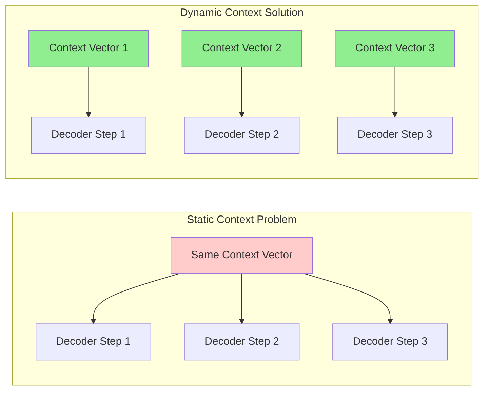
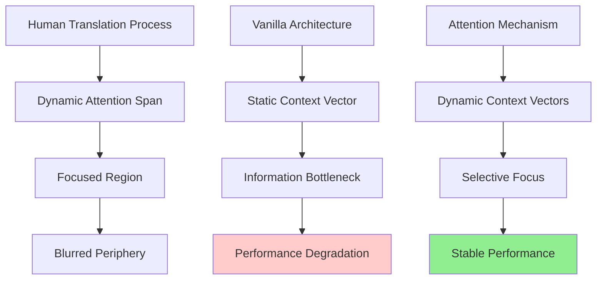
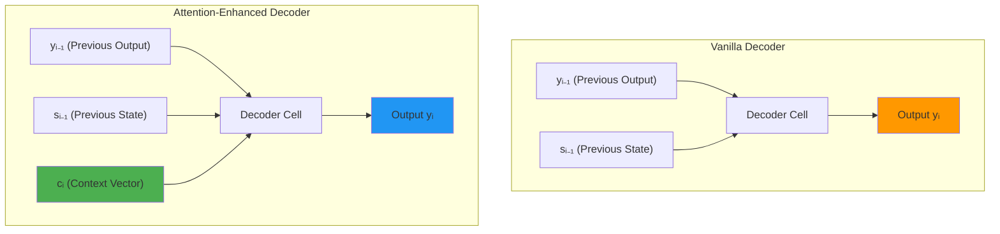
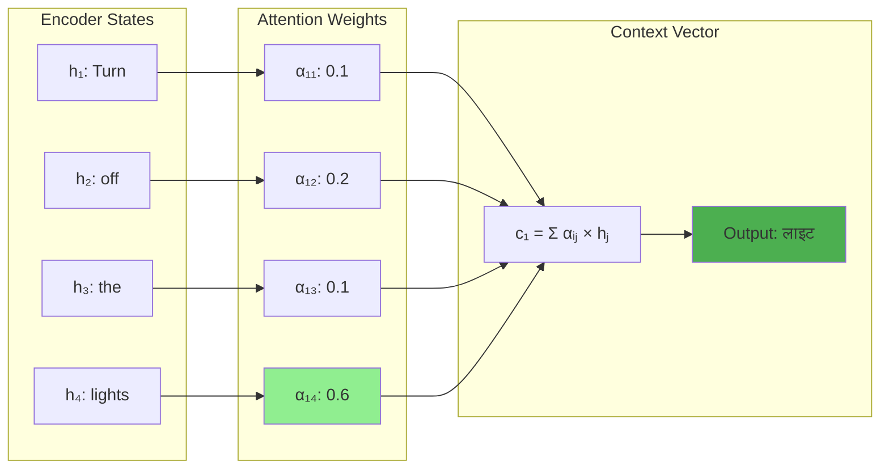
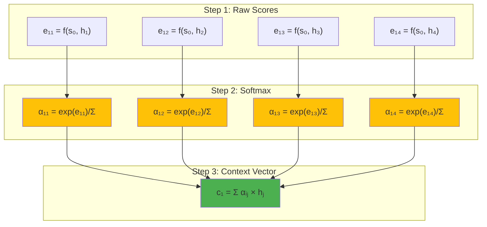
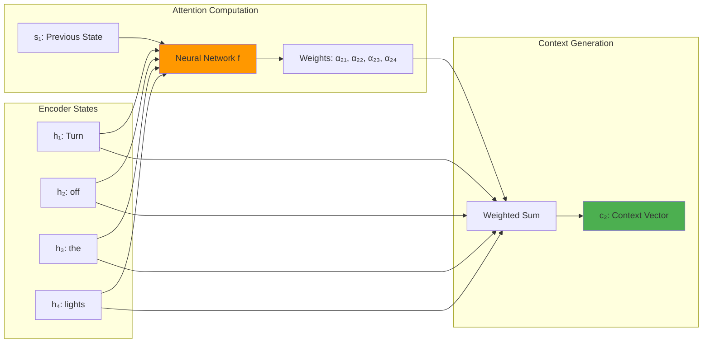
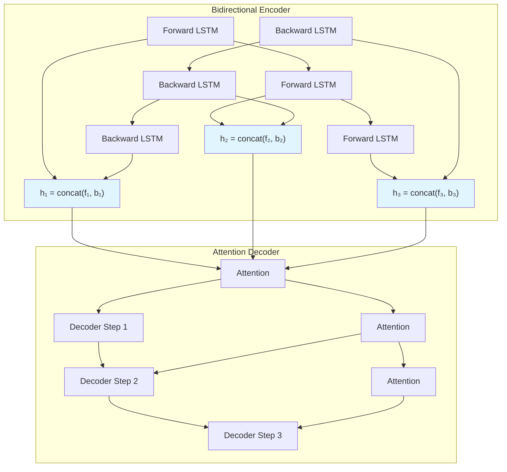
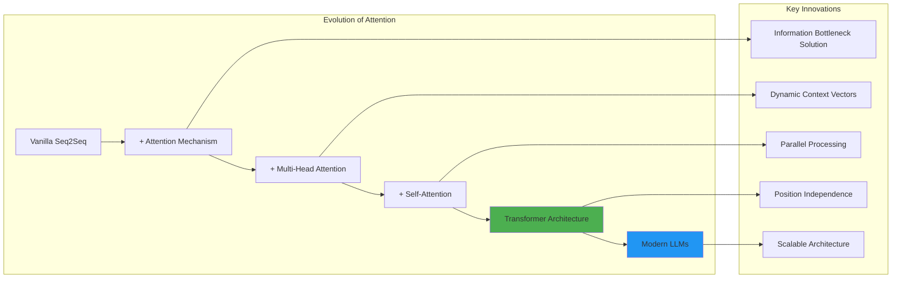

# Attention Mechanism in Deep Learning: Complete Guide

## High-Level Synthesis

### The Core Essence
Attention mechanism represents a revolutionary breakthrough that solves the fundamental **information bottleneck** problem in encoder-decoder architectures. This innovation transforms neural machine translation by introducing dynamic, context-aware focus that mirrors human cognitive translation processes.

### Key Learning Outcomes
1. **Information Bottleneck Resolution**: Understand how attention eliminates the crushing burden on fixed-size context vectors when processing sequences longer than 25-30 words
2. **Dynamic Context Generation**: Master the mathematical framework enabling neural networks to dynamically focus on relevant input parts during each decoding step

## The Integrated Explanatory Walkthrough

### The Critical Problem: Information Bottleneck

The fundamental issue becomes clear through a simple human experiment. Try reading a 50-word sentence once, closing your eyes, and translating it entirely from memory. Most people find this task बहुत डिफिकल्ट (very difficult) because holding an entire long sentence in memory while translating to another language exceeds human cognitive capacity.

This exact limitation plagues vanilla encoder-decoder architectures. The encoder compresses an entire input sequence into a single fixed-size summary vector, then expects the decoder to reconstruct the complete translation from this compressed representation. For sequences exceeding 25 words, this creates an **information bottleneck**—placing enormous responsibility on a small set of numbers to encode vast amounts of linguistic information.


*Traditional encoder-decoder showing the information bottleneck where entire sequences compress into a single context vector*


*Visual representation of the information bottleneck problem in vanilla sequence-to-sequence models*

### The Second Problem: Static Representation Inefficiency

Beyond the encoder bottleneck lies a deeper issue. When generating each output word, decoders don't actually need the entire input sequence. Consider translating "Turn off the lights" to "लाइट बंद करो":

- To generate "लाइट" (light) → Only "lights" from input is needed
- To generate "बंद" (off) → Only "turn off" from input is relevant  
- To generate "करो" (do) → Contextual understanding suffices

The core problem is that vanilla architectures provide the same static representation at every decoding step, forcing decoders to figure out which parts are relevant. This static approach ignores the dynamic nature of translation, where different output words require focus on different input segments.


*Comparison between static context (vanilla) and dynamic context (attention-based) approaches*



### Human-Inspired Solution: Dynamic Attention

The solution emerges from observing human translation behavior. Humans don't memorize entire sentences before translating; instead, they create dynamic **attention spans**—focused regions that shift as translation progresses. Areas outside this focused region become काइंड ऑफ ब्लरी (kind of blurry), demonstrating selective attention.

This biological insight led to a key realization: neural networks need dynamic information at every decoder step about which encoder positions are most relevant currently.


*Human visual attention demonstrating selective focus - the inspiration for neural attention mechanisms*



### The Attention Mechanism Architecture

**Attention mechanism** fundamentally transforms decoder input structure by adding a third input: the **context vector** $c_i$. This vector dynamically encodes which encoder hidden states are most relevant for the current decoding step.


*Complete encoder-decoder architecture with attention mechanism showing dynamic context vector generation*

#### Enhanced Decoder Input Structure

**Vanilla Encoder-Decoder** (2 inputs per time step):
1. $y_{i-1}$ (previous output through teacher forcing)
2. $s_{i-1}$ (previous decoder hidden state)

**Attention-Enhanced Decoder** (3 inputs per time step):
1. $y_{i-1}$ (previous output through teacher forcing)
2. $s_{i-1}$ (previous decoder hidden state)
3. **$c_i$ (dynamic attention context vector)**


*Visual comparison of vanilla decoder (2 inputs) vs attention-enhanced decoder (3 inputs)*



### Context Vector Computation

The **context vector** $c_i$ represents a weighted combination of all encoder hidden states, computed dynamically for each decoder time step. The key insight is using **weighted summation** to combine multiple encoder states based on their relevance.


*Animated demonstration of context vector computation showing weighted summation of encoder states*

For any decoder time step $i$:
$$c_i = \sum_{j=1}^{T_x} \alpha_{ij} h_j$$

Where:
- $\alpha_{ij}$ = attention weight between decoder step $i$ and encoder step $j$
- $h_j$ = encoder hidden state at position $j$  
- $T_x$ = input sequence length

The attention weights $\alpha_{ij}$ function as **alignment scores**—they quantify how much encoder position $j$ contributes to generating decoder output at position $i$. For a 4-word input/output translation, this requires computing 16 attention weights ($4 \times 4$ matrix).



### Neural Network-Based Alignment Scoring

The breakthrough insight was using **neural networks as universal function approximators** rather than manually designing alignment functions. Researchers recognized that neural networks can approximate any function given sufficient data, eliminating the need to hand-craft scoring mechanisms.


*Query-Key-Value transformation showing how attention mechanisms process token embeddings*


*Detailed attention computation showing masked self-attention calculation process*

#### Alignment Score Dependencies

Each alignment score $\alpha_{ij}$ depends on two critical components:
1. **$h_j$** (encoder hidden state at position $j$)
2. **$s_{i-1}$** (previous decoder hidden state)

This dependency makes intuitive sense: we need context-aware attention that considers both what we're trying to translate and what we've already translated.

#### Mathematical Framework

The alignment computation follows this process:

$$e_{ij} = f(s_{i-1}, h_j)$$

Where $f$ is a feedforward neural network. Raw scores are normalized using softmax:

$$\alpha_{ij} = \frac{\exp(e_{ij})}{\sum_{k=1}^{T_x} \exp(e_{ik})}$$


*Mathematical visualization of attention score computation and softmax normalization*



```python
import torch
import torch.nn as nn
import torch.nn.functional as F

class AttentionMechanism(nn.Module):
    """Neural network-based attention mechanism"""
    
    def __init__(self, encoder_dim, decoder_dim, attention_dim):
        super().__init__()
        
        # Universal function approximator for alignment scoring
        self.attention_network = nn.Sequential(
            nn.Linear(encoder_dim + decoder_dim, attention_dim),
            nn.Tanh(),
            nn.Linear(attention_dim, 1)
        )
        
    def forward(self, encoder_states, decoder_state):
        """
        Compute dynamic attention weights and context vector
        
        Args:
            encoder_states: [seq_len, hidden_dim] - all h_j
            decoder_state: [hidden_dim] - s_{i-1}
            
        Returns:
            context_vector: [hidden_dim] - c_i  
            attention_weights: [seq_len] - all α_{ij}
        """
        seq_len = encoder_states.size(0)
        
        # Expand decoder state to match encoder sequence
        expanded_decoder = decoder_state.unsqueeze(0).expand(seq_len, -1)
        
        # Concatenate for neural network input
        combined = torch.cat([encoder_states, expanded_decoder], dim=1)
        
        # Compute raw alignment scores: e_ij = f(s_{i-1}, h_j)
        raw_scores = self.attention_network(combined).squeeze(-1)
        
        # Normalize to attention weights: α_ij = softmax(e_ij)
        attention_weights = F.softmax(raw_scores, dim=0)
        
        # Compute context vector: c_i = Σ α_ij * h_j
        context_vector = torch.sum(
            attention_weights.unsqueeze(1) * encoder_states, dim=0
        )
        
        return context_vector, attention_weights

# Example usage with visualization
class AttentionVisualization:
    """Helper class for visualizing attention weights"""
    
    @staticmethod
    def plot_attention_heatmap(attention_weights, input_words, output_words):
        """Create attention heatmap for visualization"""
        import matplotlib.pyplot as plt
        import seaborn as sns
        
        plt.figure(figsize=(10, 8))
        sns.heatmap(attention_weights.detach().numpy(), 
                   xticklabels=input_words, 
                   yticklabels=output_words,
                   cmap='Blues', 
                   annot=True, 
                   fmt='.3f')
        plt.title('Attention Weight Heatmap')
        plt.xlabel('Input Words')
        plt.ylabel('Output Words')
        plt.show()
```


*Implementation visualization showing attention heatmap generation from raw attention weights*

### End-to-End Training Integration

The elegance of this architecture lies in seamless training integration. The attention neural network trains simultaneously with the encoder-decoder through backpropagation, ensuring all components learn optimal representations together. This unified training approach eliminates the need for separate attention mechanism training.


*Animated visualization of attention mechanism during decoding process*


*Step-by-step attention computation with output feedback*

### Complete Architecture Walkthrough

Consider generating "बंद" (off) at decoder time step 2:

1. **Compute alignment scores** using the neural network:
   - $\alpha_{21} = f(s_1, h_1)$ for "turn"
   - $\alpha_{22} = f(s_1, h_2)$ for "off"
   - $\alpha_{23} = f(s_1, h_3)$ for "the"  
   - $\alpha_{24} = f(s_1, h_4)$ for "lights"

2. **Generate context vector** through weighted summation:
   $$c_2 = \alpha_{21}h_1 + \alpha_{22}h_2 + \alpha_{23}h_3 + \alpha_{24}h_4$$

3. **Enhanced decoder processing** with three inputs:
   - Context vector: $c_2$ (dynamic attention information)
   - Previous state: $s_1$ (decoder memory)
   - Previous output: $y_1$ ("लाइट")



### Empirical Validation and Performance

Attention mechanism demonstrates remarkable translation quality improvements, particularly for longer sequences. While most models experience significant BLEU score degradation beyond 30 words, attention-based models maintain stable performance—the scores remain steady rather than dropping precipitously.


*BLEU score comparison showing attention mechanism's superior performance on longer sequences*

### Attention Weight Visualization

Attention provides interpretable insights through weight visualization. For English-French translation, attention matrices reveal intuitive alignment patterns:
- "European" → "européen" (high attention weight)
- "agreement" → "accord" (strong alignment)
- "area" → "zone" with partial attention to "la"


*Self-attention visualization showing how "it" attends to "The Animal" when processing the sentence*


*Multi-head attention showing different attention heads focusing on different linguistic relationships*


*Attention heatmap visualization showing word-level alignment scores during translation*

These visualizations confirm that attention mechanism actually works as intended, providing both performance improvements and model interpretability—a rare combination in deep learning.

### Implementation Enhancement: Bidirectional LSTM

The original research enhanced encoders with **bidirectional LSTMs**, providing both forward and backward context at each time step. This modification improves translation quality without changing the attention computation, demonstrating the modular nature of the attention enhancement.




## Insightful Conclusion

### Limitations & Future Directions

Attention mechanism, while revolutionary, introduced challenges that sparked further innovation:

1. **Computational Complexity**: O(source_length × target_length) attention computation becomes expensive for very long sequences
2. **Sequential Processing**: Decoders still process one token at a time, limiting parallelization
3. **RNN Dependency**: Still relies on sequential RNN-based architectures


*Evolution from RNN-based attention to Transformer architecture showing the progression of attention mechanisms*



These limitations directly motivated **Transformer architectures**, which eliminated RNNs entirely while extending attention into **self-attention** and **multi-head attention**. The attention mechanism proved so powerful that researchers began asking: if attention works this well as an enhancement, what happens when we make it the primary mechanism?

### Stimulating Questions

1. **Interpretability vs. Performance**: While attention weights provide intuitive visualizations of model focus, recent research suggests these weights may not truly explain model decisions. How should we balance the desire for interpretable AI with the pursuit of maximum performance?

2. **Cognitive Alignment**: Attention mechanism explicitly mimics human translation behavior through dynamic focus. As AI systems become more sophisticated, should we continue designing mechanisms that align with human cognitive processes, or should we allow AI to develop fundamentally different approaches that may be more effective?

3. **Architectural Evolution**: The rapid progression from attention-enhanced RNNs to attention-only Transformers reveals something profound about sequence modeling. What does this evolution suggest about the fundamental nature of language understanding, and what might be the next major architectural breakthrough?

[End of Notes]