# Attention Mechanism in Deep Learning: Complete Guide
## Based on Bahdanau et al. (2014): "Neural Machine Translation by Jointly Learning to Align and Translate"
[Original Paper](https://arxiv.org/pdf/1409.0473) | arXiv:1409.0473

## High-Level Synthesis

### The Core Essence
Attention mechanism represents a revolutionary breakthrough that solves the fundamental **information bottleneck** problem in encoder-decoder architectures. This innovation, **first introduced by Bahdanau, Cho, and Bengio in 2014**, transforms neural machine translation by introducing dynamic, context-aware focus that mirrors human cognitive translation processes. The mechanism is also known as **"Additive Attention"** due to its mathematical formulation using concatenation and feed-forward networks.

### Key Learning Outcomes
1. **Information Bottleneck Resolution**: Understand how Bahdanau attention eliminates the crushing burden on fixed-size context vectors when processing sequences longer than 25-30 words
2. **Dynamic Context Generation**: Master the mathematical framework enabling neural networks to dynamically focus on relevant input parts during each decoding step
3. **Additive Attention Formula**: Learn the original Bahdanau formulation: $f_{att}(\mathbf{h}_i, \mathbf{s}_j) = \mathbf{v}_a^T \tanh(\mathbf{W}_a[\mathbf{h}_i; \mathbf{s}_j])$

## The Bahdanau Innovation: Historical Context

### Revolutionary Paper Impact (2014)
The paper "Neural Machine Translation by Jointly Learning to Align and Translate" introduced the **first attention mechanism** for neural machine translation, fundamentally changing how we approach sequence-to-sequence learning:

- **Before Bahdanau**: Fixed context vectors, information bottleneck, poor long sequence performance
- **After Bahdanau**: Dynamic context vectors, learnable alignment, stable performance on long sequences
- **Legacy**: Foundation for all modern attention mechanisms, including Transformers and LLMs

### Key Innovations from the Original Paper
1. **Bidirectional Encoder**: $h_j = [\overrightarrow{h_j}; \overleftarrow{h_j}]$ - captures both forward and backward context
2. **Additive Attention Scoring**: Uses feed-forward networks instead of hand-crafted alignment functions  
3. **Alignment Matrix Visualization**: First paper to visualize attention weights as interpretable alignment matrices
4. **End-to-End Learning**: Attention parameters learned jointly with translation model

## The Integrated Explanatory Walkthrough

### 🎯 Learning Objective
By the end of this section, you'll understand:
1. **WHY** attention mechanism was needed (the problems it solves)
2. **HOW** it works mathematically (step-by-step derivation)
3. **WHAT** makes it so powerful (key innovations)
4. **WHERE** it's used today (practical applications)

### The Critical Problem: Information Bottleneck

> **Think of this analogy**: Imagine you're a tour guide explaining a 2-hour museum tour to someone over a 30-second phone call. You'd have to compress all that information into a few sentences - that's exactly the challenge faced by vanilla encoder-decoder models!

The fundamental issue becomes clear through a simple human experiment. Try reading a 50-word sentence once, closing your eyes, and translating it entirely from memory. Most people find this task बहुत डिफिकल्ट (very difficult) because holding an entire long sentence in memory while translating to another language exceeds human cognitive capacity.

This exact limitation plagues vanilla encoder-decoder architectures. The encoder compresses an entire input sequence into a single fixed-size summary vector, then expects the decoder to reconstruct the complete translation from this compressed representation. For sequences exceeding 25 words, this creates an **information bottleneck**—placing enormous responsibility on a small set of numbers to encode vast amounts of linguistic information.

<!-- Image not available: Traditional Encoder-Decoder Architecture -->
*Traditional encoder-decoder showing the information bottleneck where entire sequences compress into a single context vector*

<!-- Image not available: Information Bottleneck Problem -->
*Visual representation of the information bottleneck problem in vanilla sequence-to-sequence models*

### The Second Problem: Static Representation Inefficiency

Beyond the encoder bottleneck lies a deeper issue. When generating each output word, decoders don't actually need the entire input sequence. Consider translating "Turn off the lights" to "लाइट बंद करो":

- To generate "लाइट" (light) → Only "lights" from input is needed
- To generate "बंद" (off) → Only "turn off" from input is relevant  
- To generate "करो" (do) → Contextual understanding suffices

The core problem is that vanilla architectures provide the same static representation at every decoding step, forcing decoders to figure out which parts are relevant. This static approach ignores the dynamic nature of translation, where different output words require focus on different input segments.

<!-- Image not available: Static vs Dynamic Context -->
*Comparison between static context (vanilla) and dynamic context (attention-based) approaches*


### Human-Inspired Solution: Dynamic Attention

The solution emerges from observing human translation behavior. Humans don't memorize entire sentences before translating; instead, they create dynamic **attention spans**—focused regions that shift as translation progresses. Areas outside this focused region become काइंड ऑफ ब्लरी (kind of blurry), demonstrating selective attention.

This biological insight led to a key realization: neural networks need dynamic information at every decoder step about which encoder positions are most relevant currently.

<!-- Image not available: Human Visual Attention -->
*Human visual attention demonstrating selective focus - the inspiration for neural attention mechanisms*


### The Attention Mechanism Architecture

**Attention mechanism** fundamentally transforms decoder input structure by adding a third input: the **context vector** $c_i$. This vector dynamically encodes which encoder hidden states are most relevant for the current decoding step.

<!-- Image not available: Encoder-Decoder with Attention -->
*Complete encoder-decoder architecture with attention mechanism showing dynamic context vector generation*

#### Enhanced Decoder Input Structure

**Vanilla Encoder-Decoder** (2 inputs per time step):
1. $y_{i-1}$ (previous output through teacher forcing)
2. $s_{i-1}$ (previous decoder hidden state)

**Attention-Enhanced Decoder** (3 inputs per time step):
1. $y_{i-1}$ (previous output through teacher forcing)
2. $s_{i-1}$ (previous decoder hidden state)
3. **$c_i$ (dynamic attention context vector)**

<!-- Image not available: Decoder Input Enhancement -->
*Visual comparison of vanilla decoder (2 inputs) vs attention-enhanced decoder (3 inputs)*

```mermaid
flowchart TD
    subgraph "Vanilla Decoder"
        V1["yᵢ₋₁ (Previous Output)"]
        V2["sᵢ₋₁ (Previous State)"]
        VD["Decoder Cell"]
        VO["Output yᵢ"]
        
        V1 --> VD
        V2 --> VD
        VD --> VO
    end
    
    subgraph "Attention-Enhanced Decoder"
        A1["yᵢ₋₁ (Previous Output)"]
        A2["sᵢ₋₁ (Previous State)"]
        A3["cᵢ (Context Vector)"]
        AD["Decoder Cell"]
        AO["Output yᵢ"]
        
        A1 --> AD
        A2 --> AD
        A3 --> AD
        AD --> AO
    end
    
    style A3 fill:#4CAF50
    style AO fill:#2196F3
    style VO fill:#FF9800
```



### Context Vector Computation

The **context vector** $c_i$ represents a weighted combination of all encoder hidden states, computed dynamically for each decoder time step. The key insight is using **weighted summation** to combine multiple encoder states based on their relevance.

<!-- Image not available: Context Vector Animation -->
*Animated demonstration of context vector computation showing weighted summation of encoder states*

For any decoder time step $i$:
$$c_i = \sum_{j=1}^{T_x} \alpha_{ij} h_j$$

Where:
- $\alpha_{ij}$ = attention weight between decoder step $i$ and encoder step $j$
- $h_j$ = encoder hidden state at position $j$  
- $T_x$ = input sequence length

The attention weights $\alpha_{ij}$ function as **alignment scores**—they quantify how much encoder position $j$ contributes to generating decoder output at position $i$. For a 4-word input/output translation, this requires computing 16 attention weights ($4 \times 4$ matrix).

```mermaid
flowchart LR
    subgraph "Encoder States"
        H1[h₁: Turn] 
        H2[h₂: off]
        H3[h₃: the] 
        H4[h₄: lights]
    end
    
    subgraph "Attention Weights"
        A1[α₁₁: 0.1]
        A2[α₁₂: 0.2]
        A3[α₁₃: 0.1]
        A4[α₁₄: 0.6]
    end
    
    subgraph "Context Vector"
        C1[c₁ = Σ αᵢⱼ × hⱼ]
        OUT[Output: लाइट]
    end
    
    H1 --> A1
    H2 --> A2
    H3 --> A3
    H4 --> A4
    
    A1 --> C1
    A2 --> C1
    A3 --> C1
    A4 --> C1
    
    C1 --> OUT
    
    style A4 fill:#90ee90
    style OUT fill:#4CAF50
```



### Neural Network-Based Alignment Scoring (Bahdanau et al. 2014)

The breakthrough insight from **Bahdanau, Cho, and Bengio** was using **neural networks as universal function approximators** rather than manually designing alignment functions. They recognized that neural networks can approximate any function given sufficient data, eliminating the need to hand-craft scoring mechanisms.

#### The Original Bahdanau "Additive" Attention Formula

The core innovation is the **additive attention scoring function**:

$$f_{att}(\mathbf{h}_i, \mathbf{s}_j) = \mathbf{v}_a^T \tanh(\mathbf{W}_a[\mathbf{h}_i; \mathbf{s}_j])$$

Where:
- $\mathbf{h}_i$ = encoder hidden state at position $i$ (from bidirectional LSTM)
- $\mathbf{s}_j$ = decoder hidden state at position $j$ 
- $\mathbf{W}_a \in \mathbb{R}^{d_a \times (d_h + d_s)}$ = learned weight matrix
- $\mathbf{v}_a \in \mathbb{R}^{d_a}$ = learned attention vector
- $[\mathbf{h}_i; \mathbf{s}_j]$ = concatenation of encoder and decoder states
- $d_a$ = attention dimension hyperparameter


#### Why "Additive" Attention?

The mechanism is called **"additive"** because:
1. **Concatenation**: States are concatenated $[\mathbf{h}_i; \mathbf{s}_j]$ rather than multiplied
2. **Feed-forward Network**: Uses addition-based neural network layers
3. **Contrast with Multiplicative**: Later mechanisms like Luong attention use $\mathbf{s}_j^T \mathbf{W}_a \mathbf{h}_i$ (multiplication)

#### Alignment Score Dependencies (Bahdanau Framework)

Each alignment score $\alpha_{ij}$ depends on two critical components:
1. **$h_j$** (bidirectional encoder hidden state at position $j$)
2. **$s_{i-1}$** (previous decoder hidden state)

This dependency makes intuitive sense: we need context-aware attention that considers both what we're trying to translate and what we've already translated.

#### Complete Bahdanau Mathematical Framework

> **📚 CampusX Teaching Note**: Let's break this down step-by-step, just like solving a math problem in class!

#### Step 1: Raw Alignment Score Computation 🔢
$$e_{ij} = \mathbf{v}_a^T \tanh(\mathbf{W}_a[s_{i-1}; h_j])$$

**What's happening here?**
- We take the current decoder state $s_{i-1}$ (where we are in translation)
- We take each encoder hidden state $h_j$ (each word in the source sentence)
- We concatenate them: $[s_{i-1}; h_j]$ (like joining two vectors)
- We pass through a neural network: $\mathbf{W}_a \rightarrow \tanh \rightarrow \mathbf{v}_a^T$
- This gives us a **compatibility score** - how well does this source word match our current translation step?

#### Step 2: Softmax Normalization 📊
$$\alpha_{ij} = \frac{\exp(e_{ij})}{\sum_{k=1}^{T_x} \exp(e_{ik})}$$

**Why do we need this?**
- Raw scores can be any value (positive/negative, large/small)
- Softmax converts them to **probabilities** that sum to 1
- Think of it as: "Out of all source words, what percentage should I focus on each?"
- Higher scores → Higher attention weights

#### Step 3: Context Vector Generation 🎯
$$c_i = \sum_{j=1}^{T_x} \alpha_{ij} h_j$$

**The magic happens here!**
- We take a **weighted average** of all encoder hidden states
- Each weight $\alpha_{ij}$ tells us how much to focus on source word $j$
- Result: A single vector $c_i$ that contains relevant information from the entire source sentence
- This is our **dynamic context vector** - different for each decoding step!

### 🔍 Intuitive Understanding

Think of attention weights like a **spotlight** in a theater:
- The stage (source sentence) has multiple actors (words)
- At each moment, the spotlight (attention) focuses on different actors
- The brightness (attention weight) varies - some actors get more focus
- The audience (decoder) sees a combination of all actors, weighted by spotlight intensity

### 📝 Concrete Example: Let's See It In Action!

**Source Sentence (English)**: "The cat sat on the mat"
**Target Sentence (Hindi)**: "बिल्ली चटाई पर बैठी"

Let's trace through generating the first Hindi word "बिल्ली" (cat):

#### Encoder Hidden States:
```
h₁ = representation of "The"
h₂ = representation of "cat"  
h₃ = representation of "sat"
h₄ = representation of "on"
h₅ = representation of "the"
h₆ = representation of "mat"
```

#### Attention Computation:
```
Step 1: Compute compatibility scores
e₁₁ = neural_network([s₀; h₁])  # How much does "The" help generate "बिल्ली"?
e₁₂ = neural_network([s₀; h₂])  # How much does "cat" help generate "बिल्ली"?
...and so on for all words

Step 2: Convert to probabilities
α₁₁ = 0.05  # Focus 5% on "The"
α₁₂ = 0.80  # Focus 80% on "cat" ⭐ (highest!)
α₁₃ = 0.03  # Focus 3% on "sat"
α₁₄ = 0.02  # Focus 2% on "on"
α₁₅ = 0.05  # Focus 5% on "the"
α₁₆ = 0.05  # Focus 5% on "mat"

Step 3: Create context vector
c₁ = 0.05×h₁ + 0.80×h₂ + 0.03×h₃ + 0.02×h₄ + 0.05×h₅ + 0.05×h₆
```

**Result**: The context vector c₁ is **80% focused on "cat"** - exactly what we need to generate "बिल्ली"!

### 🤔 Why This Works So Well

**Traditional Approach Problems**:
```
❌ Fixed context vector for all outputs
❌ Information bottleneck for long sentences  
❌ Poor alignment between source and target
❌ Can't handle different word orders
```

**Attention Mechanism Solutions**:
```
✅ Dynamic context vector for each output
✅ Direct access to all source information
✅ Learnable alignment patterns
✅ Handles any language pair effectively
```

<!-- Image not available: Attention Score Computation -->
*Mathematical visualization of attention score computation and softmax normalization*

```mermaid
flowchart TD
    subgraph "Step 1: Raw Scores"
        A["e₁₁ = f(s₀, h₁)"]
        B["e₁₂ = f(s₀, h₂)"]
        C["e₁₃ = f(s₀, h₃)"]
        D["e₁₄ = f(s₀, h₄)"]
    end
    
    subgraph "Step 2: Softmax"
        E["α₁₁ = exp(e₁₁)/Σ"]
        F["α₁₂ = exp(e₁₂)/Σ"]
        G["α₁₃ = exp(e₁₃)/Σ"]
        H["α₁₄ = exp(e₁₄)/Σ"]
    end
    
    subgraph "Step 3: Context Vector"
        I["c₁ = Σ αᵢⱼ × hⱼ"]
    end
    
    A --> E
    B --> F
    C --> G
    D --> H
    
    E --> I
    F --> I
    G --> I
    H --> I
    
    style I fill:#4CAF50
    style E fill:#FFC107
    style F fill:#FFC107
    style G fill:#FFC107
    style H fill:#FFC107
```



### 💻 Implementation Guide: From Theory to Code

> **🎓 CampusX Implementation Philosophy**: Always understand the math first, then code becomes easy!

#### Key Implementation Considerations

**1. Tensor Dimensions** 📏
```
encoder_states: [seq_len, hidden_dim]  # All source word representations
decoder_state:  [hidden_dim]           # Current decoder position
attention_weights: [seq_len]           # How much to focus on each source word
context_vector: [hidden_dim]           # Weighted combination of encoder states
```

**2. Common Pitfalls to Avoid** ⚠️
- **Broadcasting Issues**: Make sure decoder state is properly expanded
- **Dimension Mismatches**: Check concatenation dimensions carefully  
- **Gradient Flow**: Ensure attention weights are differentiable
- **Memory Usage**: Attention scales quadratically with sequence length

**3. Hyperparameter Choices** 🎛️
- **attention_dim**: Usually 128-512 (controls expressiveness vs efficiency)
- **encoder_dim**: Depends on your LSTM/GRU hidden size
- **decoder_dim**: Should match encoder_dim for balanced representations

```python
import torch
import torch.nn as nn
import torch.nn.functional as F

class BahdanauAttention(nn.Module):
    """Bahdanau Additive Attention Mechanism (2014)
    
    Implementation of the original attention mechanism from:
    "Neural Machine Translation by Jointly Learning to Align and Translate"
    Bahdanau, Cho, and Bengio (2014) - arXiv:1409.0473
    """
    
    def __init__(self, encoder_dim, decoder_dim, attention_dim):
        super().__init__()
        
        # Bahdanau's additive attention parameters
        # W_a maps concatenated states to attention dimension
        self.W_a = nn.Linear(encoder_dim + decoder_dim, attention_dim, bias=False)
        # v_a maps attention dimension to scalar score
        self.v_a = nn.Linear(attention_dim, 1, bias=False)
        
    def forward(self, encoder_states, decoder_state):
        """
        Bahdanau Additive Attention Computation
        
        Implements: e_ij = v_a^T * tanh(W_a * [s_{i-1}; h_j])
        
        Args:
            encoder_states: [seq_len, encoder_dim] - bidirectional encoder hidden states h_j
            decoder_state: [decoder_dim] - previous decoder state s_{i-1}
            
        Returns:
            context_vector: [encoder_dim] - c_i weighted combination
            attention_weights: [seq_len] - α_{ij} alignment probabilities
        """
        seq_len = encoder_states.size(0)
        
        # Step 1: Expand decoder state to match encoder sequence length
        # Shape: [seq_len, decoder_dim]
        expanded_decoder = decoder_state.unsqueeze(0).expand(seq_len, -1)
        
        # Step 2: Concatenate encoder and decoder states [h_j; s_{i-1}]
        # This is the key innovation - concatenation for additive attention
        # Shape: [seq_len, encoder_dim + decoder_dim]
        concatenated = torch.cat([encoder_states, expanded_decoder], dim=1)
        
        # Step 3: Apply Bahdanau's additive attention formula
        # e_ij = v_a^T * tanh(W_a * [h_j; s_{i-1}])
        energy = self.W_a(concatenated)  # Linear transformation: W_a * [h_j; s_{i-1}]
        energy = torch.tanh(energy)      # Tanh activation (key component)
        energy = self.v_a(energy).squeeze(-1)  # Final linear layer: v_a^T
        
        # Step 4: Apply softmax to get attention weights (normalized alignment)
        # α_ij = softmax(e_ij)
        attention_weights = F.softmax(energy, dim=0)
        
        # Step 5: Compute context vector as weighted sum of encoder states
        # c_i = Σ α_ij * h_j
        context_vector = torch.sum(
            attention_weights.unsqueeze(1) * encoder_states, dim=0
        )
        
        return context_vector, attention_weights
        
    def get_alignment_matrix(self, encoder_states, decoder_states):
        """Generate alignment matrix for visualization (Bahdanau et al. Figure 3)
        
        This recreates the famous alignment matrix visualization from the original paper
        showing how French words align with English words during translation.
        
        Args:
            encoder_states: [source_len, encoder_dim] - source sentence representations
            decoder_states: List of [decoder_dim] - decoder states for each target word
            
        Returns:
            alignment_matrix: [target_len, source_len] - attention weights matrix
        """
        target_len = len(decoder_states)
        source_len = encoder_states.size(0)
        
        alignment_matrix = torch.zeros(target_len, source_len)
        
        for t, decoder_state in enumerate(decoder_states):
            _, attention_weights = self.forward(encoder_states, decoder_state)
            alignment_matrix[t] = attention_weights
            
        return alignment_matrix

# Bahdanau Attention Visualization (Recreating Original Paper's Figure 3)
class BahdanauVisualization:
    """Visualization tools for Bahdanau attention alignment matrix"""
    
    @staticmethod
    def plot_alignment_matrix(alignment_matrix, source_words, target_words):
        """Recreate Bahdanau et al. Figure 3 - Alignment Matrix Visualization
        
        Creates the iconic white-square visualization from the original paper
        where white squares indicate high alignment weights between input and output words.
        
        Args:
            alignment_matrix: [target_len, source_len] - attention weights
            source_words: List[str] - source language words
            target_words: List[str] - target language words
        """
        import matplotlib.pyplot as plt
        import seaborn as sns
        
        plt.figure(figsize=(14, 10))
        
        # Use grayscale colormap to match original paper visualization
        # White squares for high weights (like in the original Figure 3)
        sns.heatmap(alignment_matrix.detach().numpy(), 
                   xticklabels=source_words, 
                   yticklabels=target_words,
                   cmap='Greys',  # White squares for high attention weights
                   annot=True, 
                   fmt='.2f',
                   cbar_kws={'label': 'Attention Weight α_ij'},
                   linewidths=0.5)
        
        plt.title('Bahdanau Attention Alignment Matrix\\n(Recreating Figure 3 from arXiv:1409.0473)', 
                 fontsize=14, fontweight='bold')
        plt.xlabel('Source Sentence', fontsize=12)
        plt.ylabel('Target Sentence', fontsize=12)
        plt.xticks(rotation=45, ha='right')
        plt.yticks(rotation=0)
        plt.tight_layout()
        plt.show()
        
    @staticmethod
    def demonstrate_french_english_example():
        """Example from Bahdanau paper Figure 3: French-to-English translation alignment
        
        This recreates the famous example from the original paper showing
        how the attention mechanism learns to align French and English words.
        """
        # From the original paper's Figure 3 example
        source_sentence = [
            "L'accord", "sur", "l'Espace", "économique", "européen", 
            "a", "été", "signé", "en", "août", "1992", "."
        ]
        
        target_sentence = [
            "The", "agreement", "on", "the", "European", "Economic", 
            "Area", "was", "signed", "in", "August", "1992", "."
        ]
        
        print("=== Example from Bahdanau et al. (2014) Figure 3 ===")
        print(f"Source (French):  {' '.join(source_sentence)}")
        print(f"Target (English): {' '.join(target_sentence)}")
        print()
        print("Key Alignment Patterns Observed in Original Paper:")
        print("┌─────────────────────────────────────────────────────┐")
        print("│ • 'European' ↔ 'européen' (strong alignment)       │")
        print("│ • 'Economic' ↔ 'économique' (clear correspondence) │")  
        print("│ • 'agreement' ↔ 'L'accord' (semantic alignment)    │")
        print("│ • 'August 1992' ↔ 'août 1992' (temporal match)     │")
        print("│ • 'Area' ↔ 'l'Espace' (conceptual alignment)       │")
        print("└─────────────────────────────────────────────────────┘")
        print()
        print("This demonstrates how Bahdanau attention learns intuitive")
        print("word-level alignments without explicit supervision!")
        
        return source_sentence, target_sentence
    
    @staticmethod
    def create_sample_alignment_matrix():
        """Create a sample alignment matrix mimicking the Bahdanau paper patterns"""
        # Simulated attention weights based on the patterns from Figure 3
        # Values are illustrative of the alignment patterns observed
        alignment_data = [
            [0.8, 0.1, 0.0, 0.0, 0.0, 0.0, 0.0, 0.0, 0.0, 0.0, 0.0, 0.1],  # The
            [0.1, 0.0, 0.0, 0.0, 0.0, 0.0, 0.0, 0.0, 0.0, 0.0, 0.0, 0.9],  # agreement  
            [0.0, 0.9, 0.0, 0.0, 0.0, 0.0, 0.0, 0.0, 0.0, 0.0, 0.0, 0.1],  # on
            [0.0, 0.1, 0.8, 0.0, 0.0, 0.0, 0.0, 0.0, 0.0, 0.0, 0.0, 0.1],  # the
            [0.0, 0.0, 0.0, 0.0, 0.9, 0.0, 0.0, 0.0, 0.0, 0.0, 0.0, 0.1],  # European
            [0.0, 0.0, 0.0, 0.8, 0.1, 0.0, 0.0, 0.0, 0.0, 0.0, 0.0, 0.1],  # Economic
            [0.0, 0.0, 0.7, 0.0, 0.0, 0.0, 0.0, 0.0, 0.0, 0.0, 0.0, 0.3],  # Area
            [0.0, 0.0, 0.0, 0.0, 0.0, 0.2, 0.8, 0.0, 0.0, 0.0, 0.0, 0.0],  # was
            [0.0, 0.0, 0.0, 0.0, 0.0, 0.0, 0.0, 0.9, 0.0, 0.0, 0.0, 0.1],  # signed
            [0.0, 0.0, 0.0, 0.0, 0.0, 0.0, 0.0, 0.0, 0.9, 0.0, 0.0, 0.1],  # in
            [0.0, 0.0, 0.0, 0.0, 0.0, 0.0, 0.0, 0.0, 0.0, 0.9, 0.0, 0.1],  # August
            [0.0, 0.0, 0.0, 0.0, 0.0, 0.0, 0.0, 0.0, 0.0, 0.0, 0.9, 0.1],  # 1992
            [0.0, 0.0, 0.0, 0.0, 0.0, 0.0, 0.0, 0.0, 0.0, 0.0, 0.0, 1.0],  # .
        ]
        
        return torch.tensor(alignment_data)
```


*Implementation visualization showing attention heatmap generation from raw attention weights*

### End-to-End Training Integration

The elegance of this architecture lies in seamless training integration. The attention neural network trains simultaneously with the encoder-decoder through backpropagation, ensuring all components learn optimal representations together. This unified training approach eliminates the need for separate attention mechanism training.


*Animated visualization of attention mechanism during decoding process*


*Step-by-step attention computation with output feedback*

### Complete Architecture Walkthrough

Consider generating "बंद" (off) at decoder time step 2:

1. **Compute alignment scores** using the neural network:
   - $\alpha_{21} = f(s_1, h_1)$ for "turn"
   - $\alpha_{22} = f(s_1, h_2)$ for "off"
   - $\alpha_{23} = f(s_1, h_3)$ for "the"  
   - $\alpha_{24} = f(s_1, h_4)$ for "lights"

2. **Generate context vector** through weighted summation:
   $$c_2 = \alpha_{21}h_1 + \alpha_{22}h_2 + \alpha_{23}h_3 + \alpha_{24}h_4$$

3. **Enhanced decoder processing** with three inputs:
   - Context vector: $c_2$ (dynamic attention information)
   - Previous state: $s_1$ (decoder memory)
   - Previous output: $y_1$ ("लाइट")

```mermaid
flowchart LR
    subgraph "Encoder States"
        H1["h₁: Turn"] 
        H2["h₂: off"]
        H3["h₃: the"] 
        H4["h₄: lights"]
    end
    
    subgraph "Attention Computation"
        S1["s₁: Previous State"]
        NN["Neural Network f"]
        W["Weights: α₂₁, α₂₂, α₂₃, α₂₄"]
    end
    
    subgraph "Context Generation"
        WS["Weighted Sum"]
        C2["c₂: Context Vector"]
    end
    
    H1 --> NN
    H2 --> NN  
    H3 --> NN
    H4 --> NN
    S1 --> NN
    
    NN --> W
    W --> WS
    H1 --> WS
    H2 --> WS
    H3 --> WS
    H4 --> WS
    
    WS --> C2
    
    style C2 fill:#4CAF50
    style NN fill:#FF9800
```



### Empirical Validation and Performance (Bahdanau et al. Results)

Bahdanau et al. demonstrated remarkable translation quality improvements in their 2014 paper, particularly for longer sequences. Their key empirical findings:

#### Original Paper Results:
- **WMT'14 English-French Translation**: Achieved competitive BLEU scores with phrase-based statistical systems
- **Long Sequence Performance**: While vanilla encoder-decoder models experience significant BLEU score degradation beyond 30 words, **Bahdanau attention maintains stable performance**
- **Alignment Quality**: Learned attention weights correlate strongly with human intuition about word correspondences
- **Interpretability Breakthrough**: First mechanism to provide interpretable insights into neural translation decisions

#### Key Performance Improvements:
1. **Information Bottleneck Resolution**: Eliminated fixed context vector limitations
2. **Scalable Architecture**: Performance doesn't degrade with sequence length  
3. **Learnable Alignment**: No need for pre-defined word alignment models
4. **End-to-End Training**: All components optimized jointly through backpropagation


<!-- Image not available: Performance Comparison Graph -->
*BLEU score comparison showing Bahdanau attention's superior performance on longer sequences*

### Attention Weight Visualization (Figure 3 from Original Paper)

The most famous contribution of the Bahdanau paper was demonstrating that attention weights provide interpretable insights into neural translation decisions. Their Figure 3 alignment matrix visualization became iconic in the field.

#### Original Paper Examples (French-to-English):
From the famous example: "L'accord sur l'Espace économique européen a été signé en août 1992"
- **"European" ↔ "européen"** (strong diagonal alignment)
- **"Economic" ↔ "économique"** (clear semantic correspondence)  
- **"agreement" ↔ "L'accord"** (conceptual alignment despite word order differences)
- **"August 1992" ↔ "août 1992"** (perfect temporal alignment)
- **"Area" ↔ "l'Espace"** (semantic translation alignment)

#### Key Insights from Alignment Matrix:
1. **Intuitive Correspondences**: Attention learns human-like word alignments without supervision
2. **Word Order Flexibility**: Can handle different syntactic structures between languages
3. **Semantic Alignment**: Goes beyond surface-level string matching to conceptual correspondence
4. **Interpretable Decisions**: Provides transparency into model decision-making process


*Self-attention visualization showing how "it" attends to "The Animal" when processing the sentence*


*Multi-head attention showing different attention heads focusing on different linguistic relationships*


*Attention heatmap visualization showing word-level alignment scores during translation*

These visualizations confirm that attention mechanism actually works as intended, providing both performance improvements and model interpretability—a rare combination in deep learning.

### Implementation Enhancement: Bidirectional LSTM

The original research enhanced encoders with **bidirectional LSTMs**, providing both forward and backward context at each time step. This modification improves translation quality without changing the attention computation, demonstrating the modular nature of the attention enhancement.

```mermaid
flowchart TD
    subgraph "Bidirectional Encoder"
        F1[Forward LSTM] --> F2[Forward LSTM] --> F3[Forward LSTM]
        B3[Backward LSTM] --> B2[Backward LSTM] --> B1[Backward LSTM]
        
        H1["h₁ = concat(f₁, b₁)"]
        H2["h₂ = concat(f₂, b₂)"]
        H3["h₃ = concat(f₃, b₃)"]
    end
    
    subgraph "Attention Decoder"
        D1[Decoder Step 1] --> D2[Decoder Step 2] --> D3[Decoder Step 3]
        A1[Attention] --> A2[Attention] --> A3[Attention]
    end
    
    F1 --> H1
    B1 --> H1
    F2 --> H2
    B2 --> H2
    F3 --> H3
    B3 --> H3
    
    H1 --> A1
    H2 --> A1
    H3 --> A1
    
    A1 --> D1
    A2 --> D2
    A3 --> D3
    
    style H1 fill:#e1f5fe
    style H2 fill:#e1f5fe
    style H3 fill:#e1f5fe
```

<!-- Image not available: Bidirectional LSTM Architecture -->



## Insightful Conclusion

### Limitations & Future Directions

Attention mechanism, while revolutionary, introduced challenges that sparked further innovation:

1. **Computational Complexity**: O(source_length × target_length) attention computation becomes expensive for very long sequences
2. **Sequential Processing**: Decoders still process one token at a time, limiting parallelization
3. **RNN Dependency**: Still relies on sequential RNN-based architectures


*Evolution from RNN-based attention to Transformer architecture showing the progression of attention mechanisms*


These limitations directly motivated **Transformer architectures**, which eliminated RNNs entirely while extending attention into **self-attention** and **multi-head attention**. The attention mechanism proved so powerful that researchers began asking: if attention works this well as an enhancement, what happens when we make it the primary mechanism?

### Stimulating Questions

1. **Interpretability vs. Performance**: While attention weights provide intuitive visualizations of model focus, recent research suggests these weights may not truly explain model decisions. How should we balance the desire for interpretable AI with the pursuit of maximum performance?

2. **Cognitive Alignment**: Attention mechanism explicitly mimics human translation behavior through dynamic focus. As AI systems become more sophisticated, should we continue designing mechanisms that align with human cognitive processes, or should we allow AI to develop fundamentally different approaches that may be more effective?

3. **Architectural Evolution**: The rapid progression from attention-enhanced RNNs to attention-only Transformers reveals something profound about sequence modeling. What does this evolution suggest about the fundamental nature of language understanding, and what might be the next major architectural breakthrough?

## 📚 CampusX Chapter Summary

### 🎯 What We Learned Today

#### The Problem We Solved
- **Information Bottleneck**: Fixed context vectors couldn't handle long sequences
- **Static Representation**: Same context used for all decoding steps
- **Poor Alignment**: No learnable way to align source and target words

#### The Solution: Bahdanau Attention
- **Dynamic Context Vectors**: Different context for each decoding step
- **Learnable Alignment**: Neural network learns source-target correspondences  
- **Additive Scoring**: Uses concatenation + feed-forward network
- **End-to-End Training**: All components optimized together

#### Key Mathematical Formula
$$\text{Attention}(s_{i-1}, \{h_j\}) = \sum_{j=1}^{T_x} \alpha_{ij} h_j$$

Where: $\alpha_{ij} = \text{softmax}(\mathbf{v}_a^T \tanh(\mathbf{W}_a[s_{i-1}; h_j]))$

### 🔧 Practical Takeaways

#### For Implementation:
1. **Start Simple**: Implement basic additive attention first
2. **Check Dimensions**: Most bugs come from tensor dimension mismatches
3. **Visualize Attention**: Always plot attention weights to verify behavior
4. **Handle Long Sequences**: Consider computational complexity for production

#### For Understanding:
1. **Attention ≠ Explanation**: High attention doesn't always mean causal importance
2. **Context Matters**: Same word can have different attention based on context
3. **Trade-offs Exist**: Interpretability vs performance is an ongoing challenge

### 🚀 What's Next?

1. **Luong Attention (2015)**: Multiplicative attention - more efficient computation
2. **Self-Attention (2017)**: Apply attention within same sequence
3. **Multi-Head Attention**: Multiple attention mechanisms in parallel
4. **Transformers**: Attention-only architecture that revolutionized NLP
5. **Modern LLMs**: GPT, BERT, T5 - all built on attention foundations

### 💡 Key Insights

> **"Attention is a mechanism that allows neural networks to focus on relevant parts of input sequences dynamically. It solved the information bottleneck problem and became the foundation for modern NLP."**

#### Why Attention Worked So Well:
1. **Biological Inspiration**: Mimics human selective attention
2. **Mathematical Elegance**: Simple yet powerful weighted averaging
3. **Interpretability**: Provides insights into model decisions
4. **Scalability**: Can handle variable-length sequences efficiently

### 🎓 Study Tips for Revision

1. **Understand the Problem First**: Why was attention needed?
2. **Master the Math**: Practice the 3-step computation process
3. **Code It Yourself**: Implement from scratch to solidify understanding
4. **Visualize Examples**: Draw attention matrices for simple sentences
5. **Connect to Modern Models**: See how Transformers evolved from this

### 📖 Recommended Next Steps

1. **Practice Problems**: Implement attention for simple translation tasks
2. **Read Original Paper**: Bahdanau et al. (2014) - the foundational work
3. **Explore Variants**: Luong attention, self-attention, multi-head attention
4. **Build Projects**: Create your own sequence-to-sequence model with attention
5. **Stay Updated**: Follow recent attention mechanism research

---

**🎉 Congratulations!** You've mastered one of the most important innovations in deep learning. Attention mechanisms transformed not just NLP, but computer vision, speech processing, and many other domains. This foundation will serve you well as you explore modern architectures like Transformers and beyond!

[End of Notes]