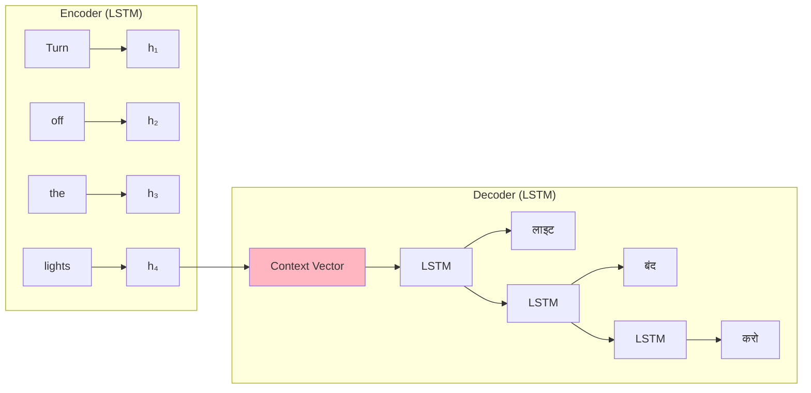
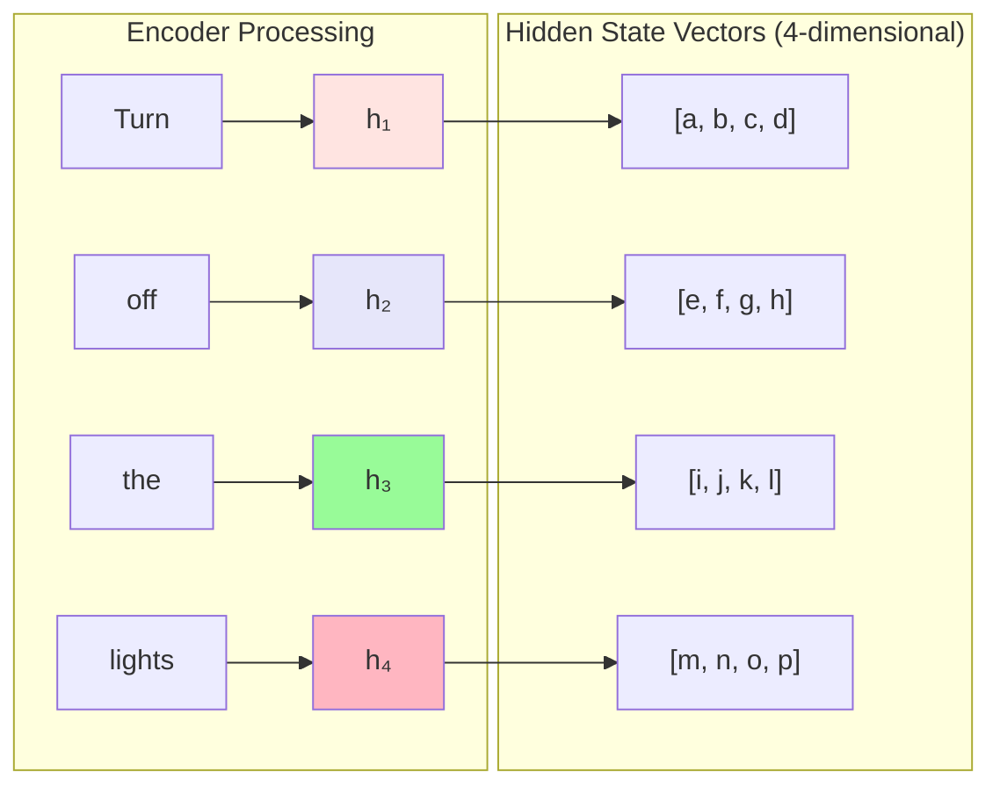
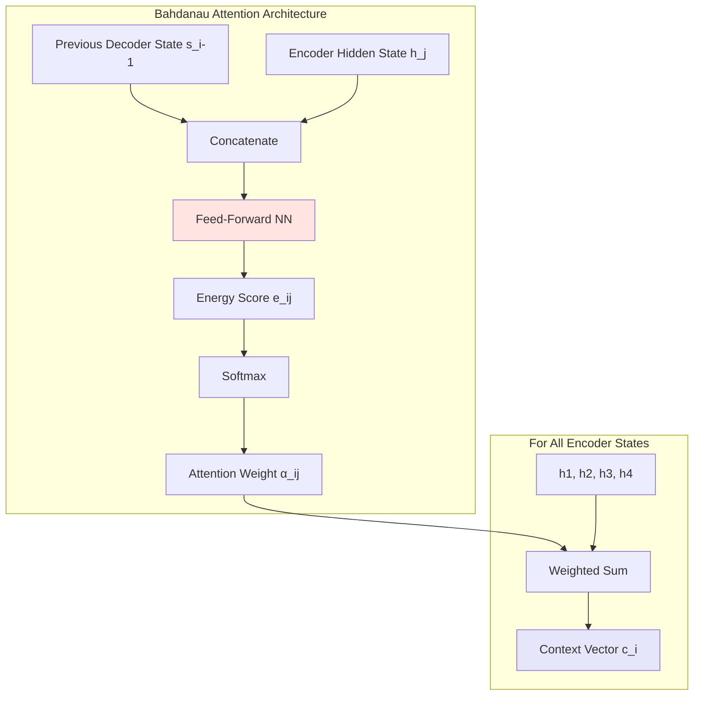
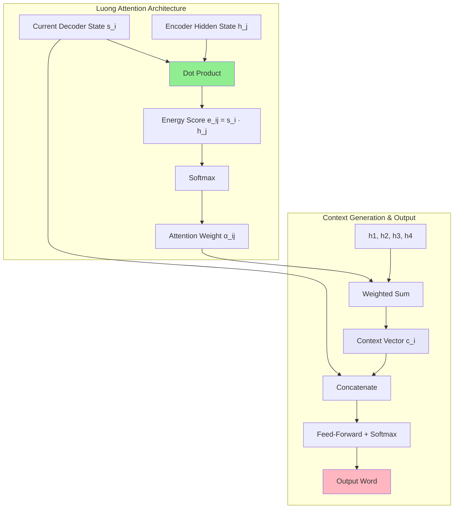
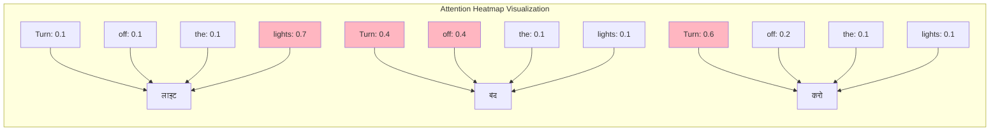

# Bahdanau Attention vs Luong Attention: Complete Guide

> **Paper References:**
> - **Bahdanau et al. (2014)**: ["Neural Machine Translation by Jointly Learning to Align and Translate"](https://arxiv.org/abs/1409.0473)
> - **Luong et al. (2015)**: ["Effective Approaches to Attention-based Neural Machine Translation"](https://arxiv.org/abs/1508.04025)

## Introduction: Why Study These Two Attention Mechanisms?

Hello everyone! Today we're going to learn about **Bahdanau Attention** and **Luong Attention**. You might wonder why we need to study these two specific variations of attention mechanisms. The reason is very important: when we move forward to study **Transformers**, the **self-attention** mechanism that we'll encounter there draws its inspiration from these two types of attention.

Initially, I was planning to skip this video, but while creating content on Transformers, I realized it would be much better if I first teach you Bahdanau and Luong attention. This will make understanding Transformers significantly easier for you when we get there.

**Key Learning Goals:**
1. Understand how attention mechanisms solve the encoder-decoder bottleneck problem
2. Learn two fundamental approaches to calculating attention scores (alignment scores)
3. Build foundation for understanding self-attention in Transformers

## Quick Recap: The Problem We're Trying to Solve

Before we start, let me give you a quick recap of what exactly we were trying to do. We have a problem statement where we have a sentence in one language, let's say English: **"Turn off the lights"**, and we need to translate it into another language, let's say Hindi: **"लाइट बंद करो"**.

We were trying to solve this problem using deep learning neural networks. This problem statement is called **Machine Translation** in general, and when solved using deep learning, it's called **Neural Machine Translation (NMT)**.

### The Encoder-Decoder Architecture

The first architecture that was tried for this problem was an **Encoder-Decoder architecture** that we've discussed in previous videos.



**How it Works:**
- **Two separate blocks**: One encoder and one decoder
- **Both contain LSTM**: You can use single LSTM, bi-LSTM, or stacked LSTM
- **Step-by-step processing**: In the encoder, you send each word one by one - first "Turn", then "off", then "the", then "lights"

**Encoder's Job**: The encoder's job is very simple - to prepare a summary of the input sentence you gave it. In deep learning language, this is called a **representation**.

**Goal**: As soon as the encoder gets this input sentence, it generates a **context vector**. A context vector is basically a set of numbers that will be a representation of this English sentence.

**Decoder's Job**: The decoder tries to print output step by step - first "लाइट", then "बंद", then "करो", and finally an end token.


**Understanding the Bottleneck Problem:**
This diagram illustrates the fundamental limitation of traditional encoder-decoder architectures. The encoder processes the entire input sequence "A B C" and compresses all information into a single fixed-size context vector (the orange box). This context vector must contain enough information to generate the entire output sequence "W X Y Z". As input sequences grow longer, this single vector becomes a severe bottleneck.

### The Fundamental Problem

**High-level overview**: The encoder encodes your given input sentence, summarizes it, and sends that summary to the decoder. The decoder looks at that summary and tries to print your output sentence step by step.

**But what's the problem?** As soon as you start using slightly larger sentences - sentences with more than 30 words, paragraphs, or entire documents - the encoder faces great difficulty in converting this entire paragraph into one context vector.

**Why?** Because after all, it's just a set of numbers. How much representation or summary can you store in that set of numbers? Since the context vector wasn't being formed properly, the decoder also couldn't generate words correctly. 

**Empirical observation**: If you have a slightly larger sentence with more than 30 words, it was observed that the translation quality was not very good. This became a major **bottleneck** in our system.

## The Attention Mechanism Solution

To eliminate this bottleneck, a new architecture came - a new mechanism called the **Attention Mechanism**. Let's quickly discuss what the attention mechanism is.

### Core Concept of Attention

The attention concept says a very simple thing. According to attention, if you are at any particular timestep of the decoder - let's say you're at the first timestep of the decoder and you need to print "लाइट" - the attention mechanism says that **you don't need the entire English sentence to print "लाइट"**.

You either need some specific words or a subset of words. For example, to print "लाइट", if you're given "lights", you can print it. Similarly, when you're at "बंद", you don't need the entire sentence again - you just need maybe "Turn" and "off", and with their help, you can do this translation.


**Dynamic Context Generation Explained:**
This diagram shows the revolutionary change that attention brings. Instead of a single context vector, we now have **dynamic context vectors** (c₁, c₂, c₃) computed at each decoder timestep. Notice how each decoder state (s₁, s₂, s₃) receives a different context vector that's specifically tailored for generating that particular output word. The red arrows represent attention weights - showing which encoder states are most relevant for each decoding step.

### The Key Innovation

The attention mechanism directly ditched this concept: instead of taking the context vector from here (final h₄) and sending it there, the attention mechanism said **you don't need to send this last h₄ as a context vector**.

**Instead, what we can do**: At every timestep of the decoder, we can have h₁, h₂, h₃, and h₄ all available. We can **dynamically** select any of these at any timestep of the decoder.

**Examples**:
- If I need to print "लाइट", I will automatically select h₄
- If I need to print "बंद", I will dynamically select h₁ and h₂

**Basic concept**: In attention mechanism, you don't send a context vector from the encoder to the decoder. Instead, what you do is send a context vector to the decoder at every timestep of the decoder.

- This is called c₁ (for timestep 1)
- This is called c₂ (for timestep 2)  
- This is called c₃ (for timestep 3)
- This is called c₄ (for timestep 4)

All of these are context vectors.

### The Central Question: How to Calculate Context Vectors?

**The question now is**: How will these context vectors c₁, c₂, c₃, and c₄ be formed? How can we make sure that if I need to print "बंद", I get the output of h₁ and h₂? If I need to print "लाइट", I get the output of h₄?

**The answer is very simple**: You use something called a **weighted sum**.

If we denote decoder timesteps with i and encoder timesteps with j, then if we want any particular cᵢ (whether c₁, c₂, c₃, or c₄), we get it using this formula:

$$c_i = \sum_{j=1}^{4} \alpha_{ij} h_j$$

**For example, for c₁**:
$$c_1 = \alpha_{11} h_1 + \alpha_{12} h_2 + \alpha_{13} h_3 + \alpha_{14} h_4$$

Basically, what we're doing is taking all these h's and applying a weighted sum on them, and that weighted sum itself is our c₁. The weights here are our alphas: α₁₁, α₁₂, α₁₃, α₁₄.

**For the second step** (to print "बंद"), we need c₂:
$$c_2 = \alpha_{21} h_1 + \alpha_{22} h_2 + \alpha_{23} h_3 + \alpha_{24} h_4$$

Again, we're taking all four, doing a weighted sum, and that's our c₂. Here we have different weights: α₂₁, α₂₂, α₂₃, α₂₄.

**Total number of alphas**: Number of words in input sentence × Number of words in output sentence.

### The Main Fundamental Difference

**The main fundamental difference** between the previous architecture versus attention mechanism is:

**Previous**: After complete processing, you send one context vector to the decoder at the end.

**Attention**: You say that h₁, h₂, h₃, h₄ - these intermediate hidden states of the encoder - all of these will always be available at any timestep of the decoder. The decoder has the capability to dynamically figure out which hidden state is useful for printing out the current word.

**The formula for figuring this out** is basically a weighted sum of your encoder hidden states, and the weights are called **alphas**. In literature, these are called **alignment scores**.

## The Challenge: How to Find Alphas?

Now the main challenge remaining is: **How will we find out these alphas?**

Finding out alpha means: How will we determine, for example, if you want to calculate α₁₁, you're actually trying to find out how strong the relationship between c₁ and h₁ is. This means: How much importance does the "Turn" word have for printing "लाइट"?

When you calculate α₂₂, you're trying to find out how much importance the "off" word has for printing "बंद".

**The challenge**: How do we find out these alphas? These alphas are basically **word-to-word similarity scores**. How will we generate these similarity scores? This is the biggest challenge, and today's video is dedicated to this: **How do we find out these alignment scores?**

A lot of work has been done on this. We will see two different types of architectures, or you can say two different methods to calculate alpha:

1. **Bahdanau Architecture** (also called Bahdanau Attention)
2. **Luong Attention**

If you understand both of these, then you will exactly understand at an architectural level how alpha is calculated.

## Bahdanau Attention: The Neural Network Approach

Before understanding this attention mechanism, you need to understand one very important thing. Let me give you an overview of what we set out to do:

**Our goal**: We need to somehow find the values of these alphas. If we get the values of these alphas, we can calculate cᵢ, and with the help of cᵢ, you can print the output.

**What is alpha?** This alpha αᵢⱼ - these are alignment scores that tell us how much input or weightage any hidden state of the encoder will have at any particular timestep of the decoder.

**For example**: If you're talking about α₁₁, this tells us how much contribution "Turn" will have in printing "लाइट". Similarly, if you're talking about α₂₂, this tells us how much contribution "off" will have in printing "बंद".

### Understanding Alpha Dependencies

If we think for a moment about what could be the function that can calculate the values of alpha, we first need to think about what alpha depends on.

**Clear understanding**: If you want to calculate α₁₁ (contribution of "Turn" for printing "लाइट"), obviously your alpha will depend on h₁. But what else will it depend on?

**Answer**: Decoder's previous hidden state. Your alpha αᵢⱼ will depend on two things:
1. **Encoder hidden state** (hⱼ)
2. **Decoder's previous hidden state** (sᵢ₋₁)

**Why previous decoder state?** Alpha doesn't just tell you how much the current decoder timestep's output depends on a particular input hidden state. Alpha tells you: **given what has been printed so far**, how much will the current decoder timestep's output depend on a particular input hidden state.

For example, where will the translation of "बंद" come from among these four? It also depends on what translation has happened so far. That context also matters, and that context is stored in the previous decoder hidden state, which is s₀ or s₁.

**General form**: In general form, you can write αᵢⱼ as:
$$\alpha_{ij} = f(h_j, s_{i-1})$$

**Important insight**: If you want to calculate alignment scores, the alignment score will be a mathematical function of two things:
1. **First**: The encoder hidden state
2. **Second**: The decoder's previous step's hidden state

### Bahdanau's Solution: Universal Function Approximation

**The next question**: What mathematical function should we choose? There could be many mathematical functions - softmax, exponential, sine, cosine - thousands of mathematical functions exist. Which mathematical function should we use here?

**Bahdanau attention's main point**: Why should you struggle to find this mathematical function? Instead, what you can do is **approximate this function with the help of a feed-forward neural network**.

**Reasoning**: You've read that essentially, neural networks or feed-forward neural networks are **universal function approximators**. They can approximate any complex function if you provide them with infinite data.


**Bahdanau Attention Architecture Breakdown:**
This diagram reveals the inner workings of Bahdanau attention with four key components:

1. **Encoder RNN** (left): Processes input sequence "ABC" sequentially, generating hidden states h₁, h₂, h₃
2. **Alignment Model** (center): The neural network that computes attention scores by taking previous decoder state s_{i-1} and each encoder state h_j, then learning their compatibility through feed-forward layers
3. **Context Vector Generation** (α boxes): Softmax-normalized attention weights create a weighted sum of all encoder states
4. **Decoder RNN** (right): Uses the dynamic context vector c_i as input along with previous output to generate next word

### Bahdanau's Architecture

**What we'll do**: We'll use a very simple structure. We'll build a neural network. In that neural network, we'll give input of two things:
- From here we'll give sᵢ₋₁ 
- From here we'll give hⱼ

This neural network will calculate and give me eᵢⱼ. On these eᵢⱼ, I'll apply softmax, and this will give me my αᵢⱼ.

**To summarize**: We'll have a feed-forward neural network where I'll send the previous decoder state and current encoder state. This will give me some scores. I'll take those scores and normalize them using softmax, and as soon as they're normalized, they become my αᵢⱼ. Taking these αᵢⱼ, I'll calculate cᵢ, and from calculating cᵢ, I'll get my y.

**This is the flow diagram of Bahdanau attention.**

## Detailed Architecture and Implementation

Now let's go a bit deeper into the architecture and understand how this entire neural network is implemented.

### Architecture Details

**Encoder remains the same**: The encoder remains exactly the same as you've seen before - nothing different. But in your decoder, you actually make one change: **you add a neural network** - a feed-forward neural network.

**Neural Network Structure**: Let's say we have a feed-forward neural network with just one layer - one hidden layer with three units/nodes, and then one output layer. Obviously, there will be an input layer here. This neural network is part of the decoder.

### Step-by-Step Data Flow

**First, let's define some things**:
- **Encoder hidden states**: All hidden states in the encoder - h₁, h₂, h₃, h₄ - let's assume these are 4-dimensional vectors
- **h₁ might look like**: [a, b, c, d] - a 4-dimensional vector  
- **h₂, h₃, h₄**: All of these are 4-dimensional vectors
- **Decoder hidden states**: s₀, s₁, s₂, s₃, s₄ - all of these are also 4-dimensional vectors
- **Neural network**: One hidden layer with three units and one output layer with one unit

### Data Flow Process

**Step 1: Encoder Processing**
You input the sentence into the encoder:
- First you send "Turn" → get h₁
- Then you send "off" → get h₂  
- Then you send "the" → get h₃
- Then "lights" → get h₄ 

Basically, in this step, you've sent the sentence to the encoder and received all your hidden states: h₁, h₂, h₃, h₄ are all ready.

**Step 2: Decoder Ready**
Now your decoder is ready sitting there to decode/translate, and you're currently at timestep 1 (i=1).

**Step 3: Context Vector Calculation**
You need to pass a context vector from here, which is c₁. How do you calculate c₁?

To calculate c₁, you need to find: α₁₁h₁ + α₁₂h₂ + α₁₃h₃ + α₁₄h₄

You have h₁, h₂, h₃, h₄. You need to find these alphas. To find these alphas, we'll use this neural network.

### Matrix Operations in Detail

**Step 1: Matrix Formation**
As I told you, alpha depends on two things - all these alphas depend on s₀ (previous decoder timestep) and hⱼ (current encoder hidden state).

You need to take s₀ from here and put it in this neural network. Since you need to calculate these alphas, and to calculate alphas you need the previous decoder hidden state, you bring s₀ here.

**s₀ looks like**: [e, f, g, h] - a 4-dimensional vector

**Concatenation Process**: You need to concatenate this s₀ with h₁, with h₂, with h₃, and with h₄. Basically, you need to form a matrix.

**The matrix will look like**:
```
Row 1: [e, f, g, h, a, b, c, d]  # s₀ + h₁
Row 2: [e, f, g, h, e, f, g, h]  # s₀ + h₂  
Row 3: [e, f, g, h, i, j, k, l]  # s₀ + h₃
Row 4: [e, f, g, h, m, n, o, p]  # s₀ + h₄
```

**This is the matrix** - it has four rows and eight columns.

**Step 2: Neural Network Processing**
You need to take each row of this matrix one by one and put it in this neural network. Basically, in this neural network's input layer, you'll put an 8-dimensional vector.

Since it's a fully connected neural network, you'll have weights here. How many weights? 8×3 weights (and these weights will be 3×1).

**Batch Processing**: You can either send one by one, or you can send this entire matrix together as a batch operation. Let's say we're sending a batch of 4.

**Forward Propagation**: 
- Matrix sent from here: 4×8
- Dot product with weights: 8×3  
- Result: 4×3 matrix
- Add bias and apply activation (like tanh): still 4×3
- Dot product with second weights (3×1): gives 4×1

**Final Result**: Four numbers - these numbers I'll call e₁₁, e₁₂, e₁₃, e₁₄

### Softmax and Final Calculation

**Step 3: Normalization**
These are kind of our alignment scores, but they're not normalized. Now I'll apply softmax on these four numbers:

$$\alpha_{11} = \frac{e^{e_{11}}}{e^{e_{11}} + e^{e_{12}} + e^{e_{13}} + e^{e_{14}}}$$

**Softmax benefits**: Everything becomes positive, and when you add them all, they sum to 1. These become our alphas as soon as we apply softmax.

**Step 4: Context Vector Generation**
This gives me α₁₁, α₁₂, α₁₃, α₁₄. As soon as I get these four, I put them in the equation, and I get c₁.

**Step 5: Word Generation**
Now c₁ is ready. Here yₜ₋₁ is where I'm sending "start", and I have s₀. So I input s₀, yₜ₋₁, and c₁ into the LSTM, and I can calculate my y₁, which is "लाइट". My first sentence/output is printed, and in this process, I've also generated s₁ - basically updated my decoder's hidden state.

### Detailed Example Walkthrough: Timestep 1

Let's work through the exact example step by step:

**Input**: "Turn off the lights"  
**Target**: Generate "लाइट" (first word)



**Step 1: Initialize Decoder**
- Previous decoder state: s₀ = [e, f, g, h] (initialized randomly or from encoder)
- Target: Generate first word "लाइट"

**Step 2: Attention Score Calculation**
For generating "लाइट", the model should primarily attend to h₄ (lights).

```python
# Input matrix formation (4×8 matrix)
input_matrix = [
    [e, f, g, h, a, b, c, d],  # s₀ + h₁ (Turn)
    [e, f, g, h, e, f, g, h],  # s₀ + h₂ (off) 
    [e, f, g, h, i, j, k, l],  # s₀ + h₃ (the)
    [e, f, g, h, m, n, o, p]   # s₀ + h₄ (lights)
]

# Neural network processing
hidden_layer = tanh(input_matrix @ W₁ + b₁)  # 4×8 @ 8×3 = 4×3
energy_scores = hidden_layer @ W₂            # 4×3 @ 3×1 = 4×1
# Result: [e₁₁, e₁₂, e₁₃, e₁₄]

# Softmax normalization - Expected result for "लाइट": 
# α₁₄ >> α₁₁, α₁₂, α₁₃
# Example: [0.1, 0.1, 0.1, 0.7] - mostly focusing on "lights"

# Context vector generation
c₁ = 0.1×h₁ + 0.1×h₂ + 0.1×h₃ + 0.7×h₄
# c₁ primarily contains information from "lights"
```

## Moving to Timestep 2

Now let's move forward to timestep 2 of the decoder.

**Current task**: Calculate c₂ 
**Formula**: c₂ = α₂₁h₁ + α₂₂h₂ + α₂₃h₃ + α₂₄h₄

We have h₁, h₂, h₃, h₄. We need to find these alphas, and to find alphas, we again go to this neural network.

**Key difference**: This time we take s₁ and concatenate it with h₁, h₂, h₃, h₄ to get our 4×8 matrix again.

**Notice the difference**: This time we have s₁, s₁, s₁, s₁ (current decoder state). Last time we had s₀, s₀, s₀, s₀ (previous decoder state). The encoder part remains exactly the same.

**Processing**: This 4×8 input goes to the neural network. Dot product with weights gives 4×3 matrix. Then 3×1 weights give 4×1. This time we get e₂₁, e₂₂, e₂₃, e₂₄.

**For "बंद"**: According to our example, for generating "बंद" (off), the model should focus on h₁ (Turn) and h₂ (off).

```python
# Expected attention pattern for "बंद":
# α₂₁ = 0.4, α₂₂ = 0.4, α₂₃ = 0.1, α₂₄ = 0.1
c₂ = 0.4×h₁ + 0.4×h₂ + 0.1×h₃ + 0.1×h₄
```

**Word Generation**: You get c₂, you have s₁, and you have y₁ (basically "लाइट"). You send all three to the LSTM. The LSTM gives you two things: first, it outputs y₂, which in our case is "बंद", and simultaneously your state gets updated to s₂.

### Time-Distributed Neural Network

**Important concept**: The weights that were here in timestep 1 and the weights that are here in timestep 2 - these are actually **the same**.

**When do weights change?** When backpropagation is applied. And when is backpropagation applied? When your decoder prints the last word.

**Process**: You'll compare all four outputs with true labels using categorical cross-entropy. Loss will flow through this entire network and will also update these weights.

**Next sentence**: As soon as the next sentence comes, these hidden states are generated, and then with these updated weights, we'll calculate c₁, c₂.

**Why this dependency?** You can see in this matrix that actually, only one thing is updating - that's your decoder's hidden state. This updates repeatedly. The h₁, h₂, h₃, h₄ remain the same at every timestep. What changes is the s₁ input, and due to both of these changing, you get different alphas every time.

**Terminology**: Since this entire neural network uses the same weights for every timestep of the decoder - first timestep has same weights, second timestep has same weights, third and fourth also have same weights - this is called a **Time-Distributed Fully Connected Neural Network**. You're sharing parameters across the time axis - same parameters at different times.

These parameters update when backpropagation kicks in.

### Mathematical Formulation

Let me quickly give this entire architecture a mathematical form:

**Context Vector Formula**:
$$c_i = \sum_{j} \alpha_{ij} h_j$$

**Attention Weights**:
$$\alpha_{ij} = \frac{\exp(e_{ij})}{\sum_{k=1}^{4} \exp(e_{ik})}$$

**Energy Scores**:
$$e_{ij} = v^T \tanh(W[s_{i-1}; h_j] + b)$$

Where W and v are learned parameters of the **alignment model** (feed-forward network).



**Bahdanau Attention Flow Explanation:**
1. **Input Concatenation**: Previous decoder state s_{i-1} and each encoder state h_j are concatenated
2. **Neural Network Processing**: The concatenated vector passes through a feed-forward neural network that learns complex similarity patterns
3. **Energy Score Generation**: The network outputs a scalar energy score e_ij representing compatibility
4. **Normalization**: Softmax ensures all attention weights sum to 1 across all encoder positions
5. **Weighted Combination**: Final context vector is the weighted sum of all encoder states

**Additional terminology**: Bahdanau attention is also called **Additive Attention**, and the neural network used here is called the **Alignment Model**.

### Historical Context and Research Impact

Now, before we dive deeper into the implementation, let me give you some important context about this research. **Bahdanau et al. (2014)** introduced this approach in their groundbreaking paper *"Neural Machine Translation by Jointly Learning to Align and Translate"*. This was revolutionary because:

1. **First successful application** of attention to neural machine translation
2. **Introduced dynamic context vectors** eliminating the fixed bottleneck
3. **Proved attention could solve** the information compression problem
4. **Enabled interpretable alignments** between source and target words

The paper showed that attention mechanisms could handle sentences much longer than the previous 30-word limitation, fundamentally changing how we approach sequence-to-sequence learning. This is why understanding this architecture is so crucial for our learning journey.

### Performance Characteristics

| Aspect | Traditional Encoder-Decoder | Bahdanau Attention |
|--------|---------------------------|-------------------|
| **Context Vector** | Single, fixed | Dynamic, multiple |
| **Sequence Length** | Limited (~30 words) | Much longer sequences |
| **Information Bottleneck** | Severe | Eliminated |
| **Interpretability** | Black box | Attention alignments |
| **Translation Quality** | Degrades with length | Maintains quality |

## Luong Attention: The Improvement

Now let's talk about Luong attention. Luong attention came after Bahdanau attention and has some improvements that I want to discuss with you.

**Same main purpose**: Here also, our main purpose is the same - we need to calculate attention scores. For every timestep of the decoder, I need to find out which timestep of the encoder will be most important. This same task is here too, but Luong attention does this work slightly differently.

### Key Differences from Bahdanau

**Summary**: Here also I need to calculate cᵢ, and to calculate cᵢ, I need to find αᵢⱼ. I already have hⱼ, but here the alpha is calculated slightly differently.

**First Point of Difference**: If you remember, I said that in Bahdanau attention, it was a function of two things: first sᵢ₋₁, second hⱼ. Here it's not like that.

In Luong attention, if you want to calculate αᵢⱼ, it's a function of two things: first **sᵢ** (current state), second hⱼ. Here you depend on the **current** decoder hidden state instead of the **previous** one.

**Second Point of Difference**: If you remember, this function in Bahdanau attention was a feed-forward neural network. Luong attention says: take sᵢ and hⱼ and find their **dot product**.

**Assumption**: sᵢ and hⱼ are both vectors with the same dimension.

**Example**: 
- sᵢ = [a, b, c, d]
- hⱼ = [e, f, g, h]  
- Dot product = a×e + b×f + c×g + d×h

This entire thing is a scalar, and this is your attention value - this is your eᵢⱼ.

### Luong's Philosophy

**Basic idea**: What's happening by adding this neural network? Unnecessary parameters are being added, which makes the training process slow, especially if your input data has large sentences.

**Why not instead use a simpler function to calculate similarity?** And what's better than dot product? Because the concept of dot product is: if two vectors are very similar, their dot product will be high. If two vectors are completely dissimilar, their dot product will be very low.

**The basic concept here**: It's not about how well you approximate this function. That work is also being done by dot product, so that's why we see two improvements:

1. **First**: Using the most recent decoder hidden state improves performance
2. **Rather than using a neural network to calculate alignment scores**: Using dot product makes it faster

### Why Current State Works Better

**Logic**: If you use the current state, you'll have more updated information compared to if you use the previous state. You can more dynamically adjust your output, and hence it was proven experimentally that Luong attention was giving better results than Bahdanau attention.

**Two improvements in Luong**:
1. Using the most recent decoder hidden state improved performance
2. Using dot product instead of neural network made it faster

### Luong Attention Architecture

Let's discuss the architecture of Luong attention.

**Encoder remains the same**: Everything remains the same. We'll provide our input sentence step by step, and due to that, we'll get encoder hidden states h₁, h₂, h₃, h₄.

**Decoder starts**: We'll start with s₀ (which could be h₄ or random initialization).

**Key difference**: s₀ and this input, based on this, the LSTM will calculate s₁ **first**. You'll get s₁ here and also here.

**Step 1**: You take this s₁ and bring it here. From here, you take all your encoder hidden states and do dot products between all of them:
- s₁ · h₁ → e₁₁
- s₁ · h₂ → e₁₂  
- s₁ · h₃ → e₁₃
- s₁ · h₄ → e₁₄

**Step 2**: You take these four values and put them in softmax. This gives you α₁₁, α₁₂, α₁₃, α₁₄ - all your alphas are ready.

**Step 3**: Calculate c₁ with the help of this.


**Luong Attention Architecture Comparison:**
**Left Panel - Global Attention:**
- Uses **current decoder state s_t** (not previous s_{t-1} like Bahdanau)
- **Simplified scoring:** Three options shown - dot product, general (parameterized), and concat (similar to Bahdanau)
- **Output integration:** Context vector concatenated with decoder state, then passed through feed-forward layer

**Right Panel - Local Attention:**
- **Windowed attention:** Only considers a subset of encoder positions around a predicted alignment point p_t
- **Computational efficiency:** Reduces attention computation for very long sequences
- **Gaussian weighting:** Applies Gaussian distribution centered on p_t to create smooth attention focus

### Key Architectural Difference

**Important difference**: As soon as you get c₁, in Bahdanau attention, you would put c₁ as input here. **You don't need to put input here now**. This LSTM has done its job - it has calculated s₁.

**What you do**: You take this c₁ and give it in the output. You concatenate this s₁ with c₁. This gives you a different state, on which you apply feed-forward neural network and then softmax to finally print this word.

**Main difference**: The context vector goes to the output, not the input. It concatenates at the output level.

### Complete Flow

**Second timestep**: s₁ and this input together give you s₂. Then you take s₂, dot product with all four, get e₂₁, e₂₂, e₂₃, e₂₄. Apply softmax to get α₂₁, α₂₂, α₂₃, α₂₄. This gives you c₂.

**Output**: You take c₂ here and concatenate with s₂. Apply feed-forward and softmax to print "बंद". Using s₂, you get s₃, and this process repeats.

**Architecture differences**:
1. **First difference**: We eliminated the neural network entirely and used a simpler alignment score - dot product
2. **Second**: We made a big design change - rather than working with previous decoder hidden state, we're working with current decoder hidden state. Due to this, we're giving context vector in output instead of input.

**Benefit**: We have more updated values. When we're calculating attention scores, we have the most recent translation and most recent context. Due to this recent context, your translation becomes slightly more dynamic.

**Empirically**: It was seen that this performed better than Bahdanau attention and is faster too because there are fewer parameters.

### Mathematical Simplicity

**Luong scoring function**:
$$e_{ij} = s_i^T h_j$$

**Complete architecture flow**:



**Luong Attention Flow Explanation:**
1. **Direct Dot Product**: Current decoder state s_i directly computes similarity with encoder state h_j using dot product (green) - no neural network needed!
2. **Immediate Scoring**: The dot product result is directly the energy score e_ij
3. **Standard Normalization**: Softmax creates attention weights as before
4. **Context Vector Creation**: Weighted sum of encoder states using attention weights (purple)
5. **Output-Level Integration**: Key difference - context vector concatenated with current decoder state (not used as input like Bahdanau)
6. **Final Processing**: Concatenated vector passes through feed-forward network to generate output word (pink)

**Performance Advantage**: The dot product replaces the entire neural network from Bahdanau attention, making computation much faster while often achieving better results.

### Detailed RNN Encoder-Decoder with Attention Architecture


**Complete Attention-Based Seq2Seq Architecture:**
This comprehensive diagram shows every component of an attention-enabled sequence-to-sequence model:

**Encoder Path (Bottom):**
- Input sequence (x₁, x₂, x₃, x₄) flows through bidirectional RNN
- Forward states (h₁→, h₂→, h₃→, h₄→) and backward states (h₁←, h₂←, h₃←, h₄←) are concatenated
- Results in contextual hidden states that capture both past and future information

**Attention Mechanism (Middle):**
- Attention weights (α) computed between decoder state and all encoder states
- Context vector c_t created as weighted sum of encoder states
- Different c_t for each decoder timestep enables dynamic focus

**Decoder Path (Top):**
- Previous output y_{t-1} combined with context vector c_t
- Decoder RNN generates current hidden state s_t
- Output layer produces probability distribution over vocabulary
- Process repeats until end-of-sequence token

This architecture became the foundation for all modern attention mechanisms, including those used in Transformers.

### Attention Weight Visualization

Here's how the attention weights look across timesteps for our example:

| **Decoder Output** | **Turn** | **off** | **the** | **lights** |
|-------------------|----------|---------|---------|------------|
| **लाइट (t=1)**    | 0.1      | 0.1     | 0.1     | **0.7**    |
| **बंद (t=2)**     | **0.4**  | **0.4** | 0.1     | 0.1        |
| **करो (t=3)**     | **0.6**  | 0.2     | 0.1     | 0.1        |



**Interpretation:**
- **लाइट (Light):** Strong attention to "lights" (0.7) - direct translation
- **बंद (Off):** Balanced attention to "Turn" (0.4) and "off" (0.4) - understanding the action
- **करो (Do):** Primary attention to "Turn" (0.6) - capturing the imperative nature

### Computational Complexity Comparison

#### **Bahdanau Complexity:**
```python
# Per timestep computational cost
concatenation: O(d)           # Concatenate states
neural_network: O(d² + d×h)   # Feed-forward layers
softmax: O(T)                 # Normalize over encoder length
weighted_sum: O(d×T)          # Context vector creation
# Total: O(d² + d×h + d×T)
```

#### **Luong Simplicity:**
```python
# Per timestep computational cost  
dot_products: O(d×T)          # Direct similarity computation
softmax: O(T)                 # Normalize over encoder length
weighted_sum: O(d×T)          # Context vector creation
concatenation: O(d)           # Combine with decoder state
# Total: O(d×T)
```

**Speed Advantage:** Luong is significantly faster, especially for large hidden dimensions (d), because it eliminates the neural network computation.

### Practical Applications and Impact

#### **Neural Machine Translation Improvements**

**Before Attention:**
- Maximum effective sentence length: ~30 words
- Translation quality degraded significantly with length
- Fixed context vector bottleneck

**After Attention:**
- Effective translation of sentences 100+ words
- Quality maintained across varying lengths  
- Dynamic context adaptation

#### **Visualization and Interpretability**

Attention mechanisms provided the first **interpretable neural translation** models:

```python
# Attention matrix visualization
attention_matrix[i][j] = α_ij  # How much decoder step i attends to encoder step j

# High values indicate strong alignment
# Creates interpretable word-to-word mappings
```

This interpretability was crucial for debugging and improving translation systems.


**Reading Neural Attention Patterns:**
This attention matrix heatmap reveals how neural networks learn to parse and understand hierarchical text structure:

**Sentence Structure Analysis:**
- **Diagonal patterns**: Sequential word-by-word attention (traditional reading)
- **Vertical lines**: Words that consistently attend to important anchors (like "The" attending to multiple following words)
- **Horizontal lines**: Key words that receive attention from many positions (important semantic anchors)
- **Block patterns**: Phrase-level attention showing the model groups related words together

**Grammatical Insights:**
- Articles and prepositions often show diffuse attention patterns
- Nouns and verbs create strong focal points that attract attention from related words
- Long-distance dependencies are visible as off-diagonal bright spots
- The model learns syntactic relationships without explicit grammatical rules

This interpretability was revolutionary - for the first time, researchers could visualize what neural networks were "thinking" during language processing, leading to better model design and debugging capabilities.

## Terminology and Alternative Names

**Bahdanau Attention** is also called **Additive Attention** because it uses addition operations in the neural network.

**Luong Attention** is also called **Multiplicative Attention** because it uses multiplication (dot product) to calculate alignment scores.

## Conclusion: Why These Matter for Transformers

I hope both these attention mechanisms are clear to you now. The reason for discussing both in such detail is that whatever you've learned now, at least from an architectural point of view, this clarity will help you when you read the concept of **self-attention** in Transformers.

**Self-attention is like the core of Transformer**. If you want to understand everything properly in self-attention, you should have a very good understanding about these two types of attention.

The concepts you've learned here - dynamic context generation, alignment scores, attention weights, and weighted combinations - form the foundation for understanding modern Transformer architectures and large language models.

I really hope I was able to explain and motivate you about how attention mechanism works exactly in depth. The "Turn off the lights" → "लाइट बंद करो" example demonstrates these fundamental principles that form the backbone of modern AI systems.

### Evolution to Modern Architectures

The concepts learned here directly transfer to understanding modern AI:

**Evolution Path:**
1. **Bahdanau (2014):** Encoder-decoder attention with neural network scoring
2. **Luong (2015):** Simplified attention with dot-product scoring  
3. **Transformer (2017):** Self-attention using Query-Key-Value mechanism (inspired by Luong's dot-product)
4. **Modern LLMs:** Multi-head attention, scaled dot-product attention

**Key Concepts That Transfer:**
- **Dynamic Context Generation:** Each position gets different attention weights
- **Dot Product Similarity:** Direct geometric similarity measurement (used in Transformers)
- **Softmax Normalization:** Converting scores to probability distributions
- **Weighted Combinations:** Context vectors as weighted sums of representations

### Comparative Analysis: Bahdanau vs Luong


**Attention Flow in Image Captioning:**
This visualization demonstrates attention mechanisms applied to image captioning, showing how the model focuses on different regions of an image while generating each word of the caption:

**Attention Heatmaps Analysis:**
- **"A"**: Attention broadly distributed across the image (starting token)
- **"man"**: Strong focus on the person in the image (red/yellow regions)
- **"riding"**: Attention shifts to the action area between person and bicycle
- **"a"**: Reduced attention intensity (article word)
- **"bike"**: Clear focus on the bicycle area
- **"down"**: Attention on the path/ground area
- **"a"**: Again reduced attention for article
- **"dirt"**: Focus on the ground/path surface
- **"road"**: Attention spans the visible road/path

This example proves that attention mechanisms learn semantically meaningful focus patterns - they don't just randomly weight different inputs, but intelligently direct their "gaze" to relevant parts of the input when generating each output word. The same principle applies to neural machine translation, where attention focuses on relevant source words for each target word.

### Performance Characteristics Summary

| Aspect | Bahdanau Attention | Luong Attention |
|--------|-------------------|-----------------|
| **Complexity** | Higher (learnable parameters) | Lower (dot product) |
| **Speed** | Slower (neural network computation) | Faster (simple arithmetic) |
| **Context Integration** | Input-level | Output-level |
| **State Usage** | Previous ($s_{i-1}$) | Current ($s_i$) |
| **Parameter Count** | More (W, v, b matrices) | Fewer (no scoring parameters) |
| **Scoring Function** | Neural network | Dot product |
| **First Introduced** | 2014 | 2015 |
| **Alternative Name** | Additive Attention | Multiplicative Attention |

### Implementation Considerations

#### **Time-Distributed Architecture**

Both attention mechanisms use **time-distributed parameters** - the same scoring function (neural network or dot product) is applied at every decoder timestep:

```python
# Pseudocode for parameter sharing
for timestep in decoder_sequence:
    if bahdanau:
        scores = neural_network(s_prev, encoder_states)  # Same NN weights
    else:  # luong
        scores = dot_product(s_current, encoder_states)  # Same operation
    
    attention_weights = softmax(scores)
    context = weighted_sum(attention_weights, encoder_states)
```

**Backpropagation** updates these shared parameters after processing the complete sequence, ensuring consistent attention behavior across timesteps.

## References and Further Reading

### Original Papers
1. **Bahdanau, D., Cho, K., & Bengio, Y. (2014)**. "Neural Machine Translation by Jointly Learning to Align and Translate". *arXiv preprint arXiv:1409.0473*. [Link](https://arxiv.org/abs/1409.0473)

2. **Luong, M. T., Pham, H., & Manning, C. D. (2015)**. "Effective Approaches to Attention-based Neural Machine Translation". *arXiv preprint arXiv:1508.04025*. [Link](https://arxiv.org/abs/1508.04025)

### Impact and Legacy
These foundational papers revolutionized sequence modeling by introducing dynamic attention, enabled longer sequence processing in neural networks, laid groundwork for Transformers and the attention-is-all-you-need paradigm, and sparked the modern NLP revolution leading to BERT, GPT, and beyond.

[End of Notes]