# Transformers Overview: Architecture and Revolutionary Impact

## Paper References and Video Context

**Primary Research Paper:** ["Attention Is All You Need"](https://arxiv.org/abs/1706.03762) - Vaswani et al., 2017  
**Supporting Research:** ["A Comprehensive Survey of Transformers"](https://arxiv.org/abs/2306.07303) - Qiu et al., 2023

**Video Context:** This comprehensive overview introduces Transformers as a groundbreaking neural network architecture that revolutionized not just machine translation, but the entire AI landscape. Presenter guides us through what Transformers are, why they were created, their profound impact on society and technology, and what the future holds.

**Learning Journey:** Following the video's narrative flow, we'll understand Transformers from simple definitions to complex impacts, exploring their origin story through three pivotal research papers, witnessing their transformative effect across multiple domains, and envisioning their future potential.

**Connection to Broader Concepts:** This introduction sets the foundation for deep-dive videos on self-attention mechanisms, positional encoding, and implementation details that follow in the series.

---

## What Are Transformers? The Simple Definition
  Let's start with the simplest explanation Presenter provides: Transformers are essentially a neural network architecture, just like ANNs, CNNs, and RNNs that we've studied before.

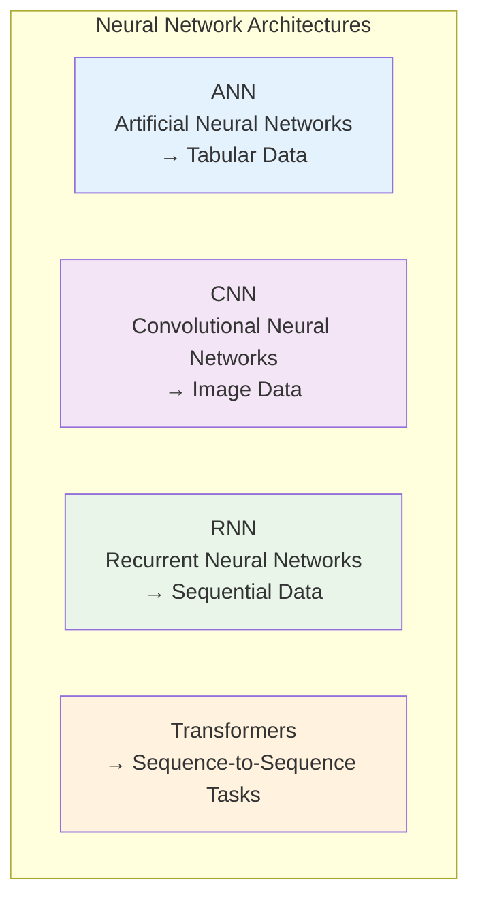

As Presenter explains, each architecture serves different data types. **Transformers are specifically built for sequence-to-sequence tasks** - where both input and output are sequential data.

**Sequence-to-Sequence Examples:**
- **Machine Translation:** English sentence → Hindi sentence  
- **Question Answering:** Question → Answer
- **Text Summarization:** Long text → Short summary

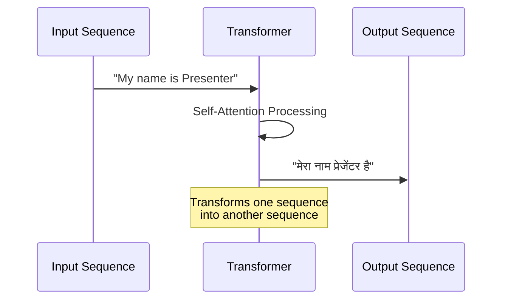

The name "Transformer" comes from this fundamental capability: **transforming one sequence into another sequence**.

## The Transformer Architecture: High-Level Overview

Following Presenter's explanation, when we look at the original Transformer paper architecture, it can seem intimidating at first with so many components. But at a high level, it follows the familiar encoder-decoder pattern.

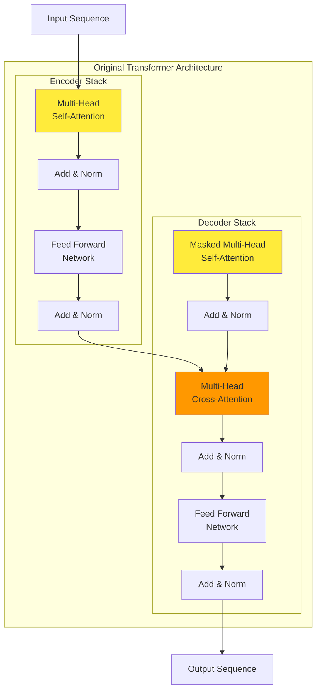

**Key Architectural Differences from Previous Models:**
1. **No LSTM/RNN components** - everything is attention-based
2. **Self-attention mechanism** instead of sequential processing  
3. **Parallel processing** of all words simultaneously
4. **Highly scalable** architecture for massive datasets

As Presenter emphasizes, this parallel processing capability makes Transformers incredibly fast and scalable, allowing training on much larger datasets than previous architectures.

## The Transformer Revolution: Understanding the Profound Impact

Before diving into technical details, Presenter provides crucial motivation by explaining Transformers' massive impact. This isn't just a small architectural improvement - it sparked an AI revolution.

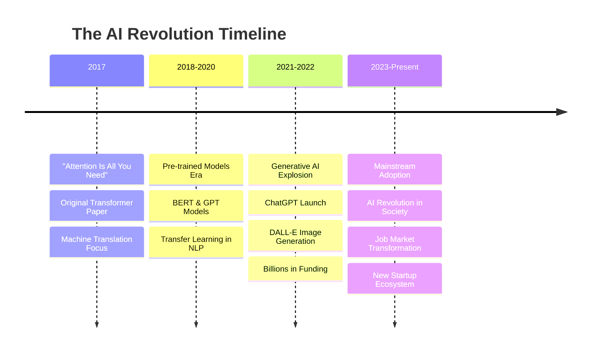

**The Scale of Impact:** As Presenter notes, ChatGPT became the world's most popular software, built essentially on Transformer technology. This led to:
- Billions in startup funding
- Thousands of new jobs created
- Complete transformation of how we interact with technology
- An AI revolution that we're all experiencing

## Origin Story: The Three Pivotal Papers

Presenter brilliantly explains the Transformer origin story through three research papers that created the foundation. This narrative approach helps us understand not just what Transformers are, but why they were necessary.

### Chapter 1: Sequence-to-Sequence Learning (2014-2015)

**Paper:** "Sequence to Sequence Learning with Neural Networks" by Sutskever et al.

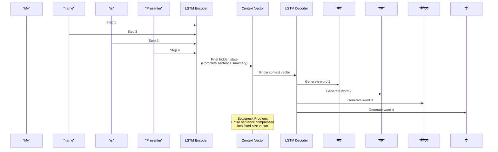

**The Architecture:**
- **Encoder:** LSTM processes input sentence step-by-step
- **Context Vector:** Single vector summarizing entire input
- **Decoder:** LSTM generates output step-by-step

**Critical Problem Identified:** As Presenter explains, this architecture worked fine for short sentences, but failed for sentences longer than 30 words. The root cause was the context vector bottleneck - trying to compress an entire long sentence into a fixed set of numbers simply couldn't retain all necessary information.

### Chapter 2: The Attention Mechanism Solution (2015)

**Paper:** "Neural Machine Translation by Jointly Learning to Align and Translate" by Bahdanau et al.

Building on the previous limitation, this paper introduced attention to solve the context vector bottleneck problem.

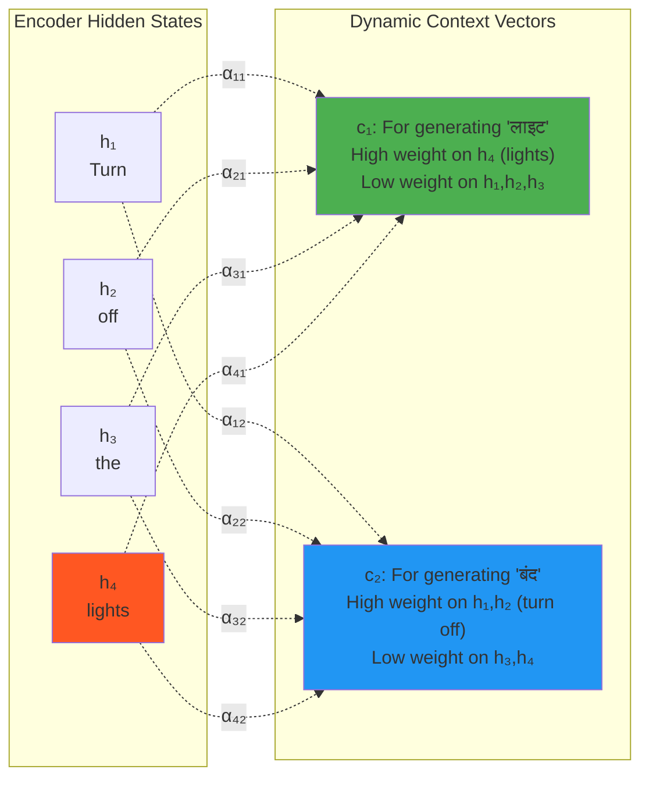

**Attention Mechanism Innovation:**

As Presenter explains with the example "Turn off the lights" → "लाइट बंद करो":

- **For generating "लाइट":** The attention mechanism focuses primarily on "lights" in the input
- **For generating "बंद":** The attention mechanism focuses on "turn" and "off"

**Mathematical Foundation:**
$$c_t = \sum_{i=1}^{T} \alpha_{ti} h_i$$

Where:
- $c_t$ = Context vector at decoder timestep t
- $\alpha_{ti}$ = Attention weights (how much to focus on encoder state i)
- $h_i$ = Encoder hidden state i

**Key Insight:** Instead of one static context vector, we now have **dynamic context vectors** computed for each decoder step, allowing the model to focus on relevant parts of the input.

**Improvement Achieved:** Translation quality improved significantly for sentences longer than 30 words.

**Remaining Fundamental Problem:** Sequential training due to LSTM dependency still prevented scaling to massive datasets.

### Chapter 3: The Transformer Breakthrough (2017)

**Paper:** "Attention Is All You Need" - The revolutionary paper that changed everything.

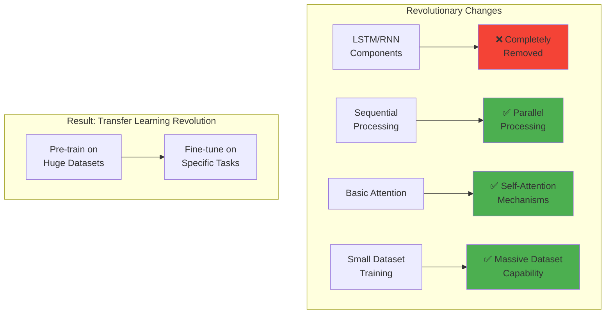

**Three Revolutionary Aspects Presenter Highlights:**

1. **Complete LSTM Elimination:** Using only self-attention enabled parallel training
2. **Architectural Stability:** Multiple small components working together created a very stable architecture  
3. **Hyperparameter Robustness:** The hyperparameters from the original paper remain effective even today

**The "Time Travel" Phenomenon:** As Presenter colorfully describes, reading this paper feels like time travel - it's completely different from previous architectures, as if someone from the future came back to 2017 and shared this revolutionary design.

**Components Introduced:**
- Self-attention mechanisms
- Residual connections scattered throughout
- Layer normalization
- Feed-forward networks integrated with attention
- Cross-attention between encoder and decoder
- Multiple novel components working in harmony

## The Five Profound Impacts of Transformers

Following Presenter's structured analysis, let's explore how Transformers transformed technology and society across five major dimensions.

### Impact 1: NLP Revolution - 50 Years of Progress in 5 Years

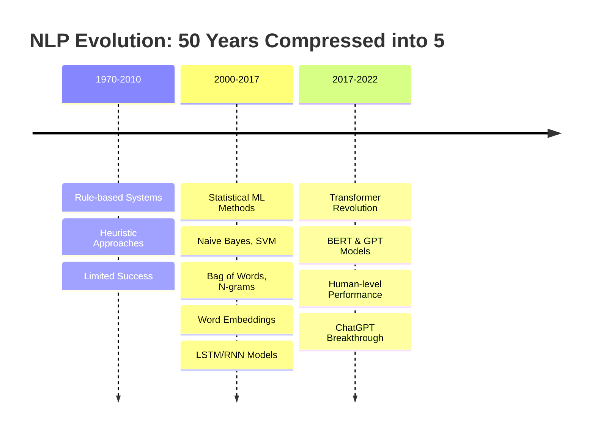

**Revolutionary Applications Today:**
- **ChatGPT replacing Google Search:** Presenter shares his personal experience of using ChatGPT more than Google for daily queries
- **Indistinguishable Chatbots:** Customer service bots so advanced you can't tell if you're talking to a human or AI
- **AI Companions:** AI boyfriend/girlfriend services launched by companies

The progress that would have taken 50 years happened in just 5-6 years, all because of Transformers.

### Impact 2: Democratization of AI Through Transfer Learning

```mermaid
graph TD
    subgraph "Before Transformers: The Hard Way"
        BUILD1[Build from Scratch] --> DATA1[Massive Data Required]
        DATA1 --> TIME1[Months of Training]
        TIME1 --> MONEY1[High Costs]
        MONEY1 --> POOR1[Poor Results]
    end
    
    subgraph "After Transformers: The Easy Way"  
        PRETRAINED[Pre-trained Models<br/>BERT, GPT] --> DOWNLOAD[Public Download]
        DOWNLOAD --> FINETUNE[Fine-tune with<br/>Small Data]
        FINETUNE --> SOTA[State-of-the-art<br/>Results]
    end
    
    subgraph "Transfer Learning Magic"
        HUGE[Huge Dataset<br/>Training] --> KNOWLEDGE[Rich Knowledge<br/>Acquired]
        KNOWLEDGE --> TRANSFER[Transfer to<br/>Specific Task]
        TRANSFER --> SUCCESS[Easy Success]
    end
    
    style POOR1 fill:#f44336
    style SOTA fill:#4caf50
    style SUCCESS fill:#4caf50
```

**The Game-Changer:** As Presenter explains, Transformers' scalability enabled training on massive datasets, creating models like BERT and GPT that can be fine-tuned for specific tasks.

**Hugging Face Revolution:**
```python
# Before: Complex implementation needed
# Now: 3-4 lines for state-of-the-art results

from transformers import pipeline
classifier = pipeline("sentiment-analysis")
result = classifier("I love transformers!")
# Output: [{'label': 'POSITIVE', 'score': 0.9998}]
```

**Impact:** Small companies, startups, and individual researchers can now create state-of-the-art NLP applications that were previously impossible.

### Impact 3: Multimodal Capabilities - Beyond Text

The flexible architecture of Transformers enables processing different data types through appropriate representations.

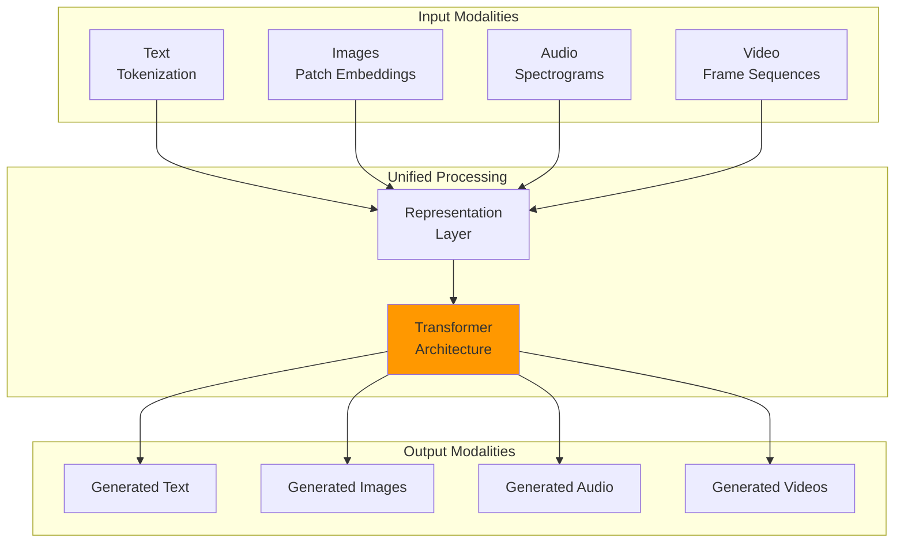

**Revolutionary Applications:**
- **ChatGPT:** Visual search, image analysis, audio conversations
- **DALL-E:** Text prompt → Photorealistic images
- **Runway ML:** Text prompt → Complete videos
- **Adobe Integration:** Advanced photo editing with AI

**Technical Innovation:** Researchers created similar representations for images and speech as used for text, enabling the same Transformer architecture to work across modalities.

### Impact 4: Generative AI Acceleration

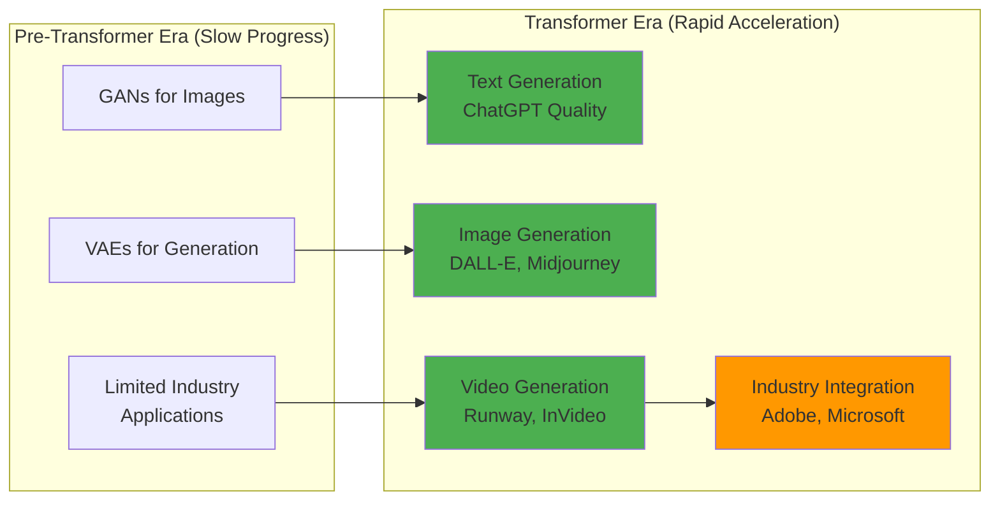

**Breakthrough Moment:** Transformers first revolutionized text generation with human-like quality, then extended to images and videos through multimodal capabilities.

**Industry Impact:** Generative AI became a critical buzzword and essential skill for data science positions, as Presenter mentions.

### Impact 5: Unification of Deep Learning

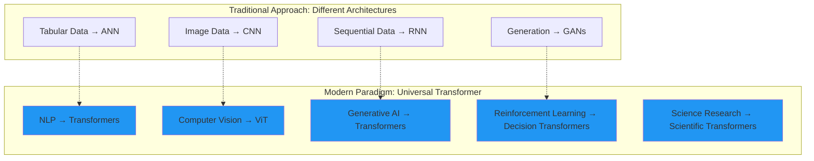

**Historical Significance:** As Presenter emphasizes, we're witnessing a unique point in history where deep learning is being unified around a single architecture - Transformers.

**Domain Examples:**
- **Computer Vision:** Vision Transformers (ViT) replacing CNNs
- **Reinforcement Learning:** Decision Transformers for strategy development
- **Scientific Research:** Transformers for domain-specific problems

## Major Transformer Applications: Real-World Impact

### 1. ChatGPT: The Conversational Revolution

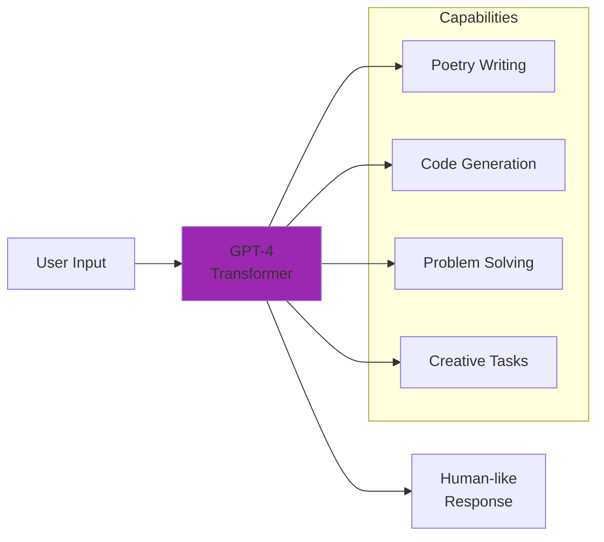

**Technical Foundation:** ChatGPT is built on GPT-4, which is essentially a Generative Pre-trained Transformer that can be used for any purpose.

### 2. DALL-E 2: Text-to-Image Generation

**Example Process:**
```
Input Prompt: "An astronaut riding a horse in photorealistic style"
↓
DALL-E 2 Processing
↓  
Output: Multiple high-quality generated images
```

**Revolutionary Aspect:** The ability to generate any type of image from text descriptions, with users able to select from multiple options.

### 3. AlphaFold 2: Scientific Breakthrough

While less famous publicly, Presenter considers this potentially more impactful than ChatGPT.

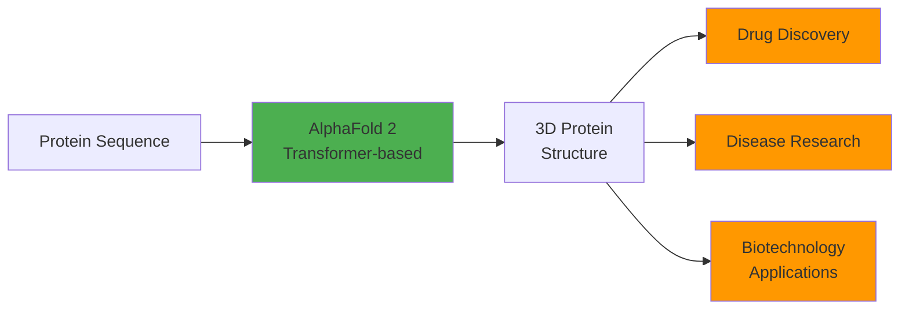

**Impact:** Solved the 50-year-old protein folding problem, representing a massive scientific breakthrough with implications for medicine and biology.

### 4. OpenAI Codex: Natural Language to Code

**Application:** Powers GitHub Copilot for real-time code suggestions and generation.

```python
# Natural Language Input: "Create a function to calculate factorial"
# Codex Output:
def factorial(n):
    if n == 0 or n == 1:
        return 1
    else:
        return n * factorial(n - 1)
```

## Key Advantages of Transformers

### 1. Scalability Through Parallel Processing

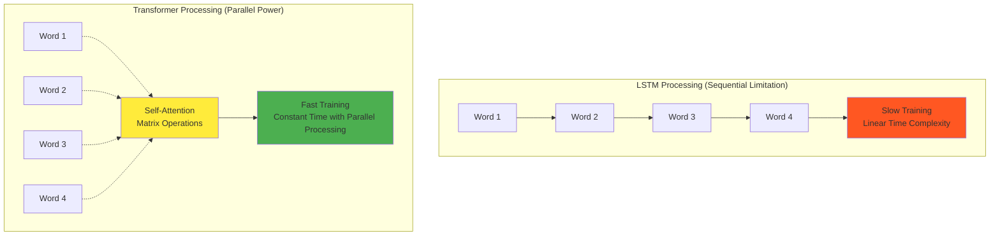

**Result:** Training speed improvement enables massive dataset usage and transfer learning possibilities.

### 2. Transfer Learning Revolution

**The Process:**
1. **Pre-train** on huge datasets using unsupervised learning
2. **Fine-tune** on specific tasks with minimal labeled data  
3. **Achieve** state-of-the-art results without starting from scratch

### 3. Multimodal Input/Output Flexibility

**Supported Combinations:**
- Text → Text (translation, summarization)
- Text → Image (DALL-E style generation)
- Image → Text (visual question answering)
- Audio → Text (speech recognition)
- Any modality → Any modality (with proper representation)

### 4. Flexible Architecture Variants

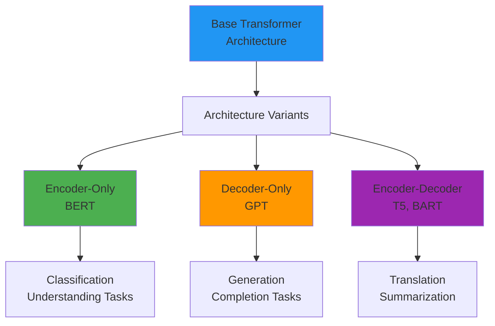

### 5. Vibrant Ecosystem and Community

**Developer Support:**
- **Hugging Face:** Comprehensive library for quick implementation
- **Rich Documentation:** Abundant tutorials and guides
- **Active Research:** Continuous improvements and innovations  
- **Community:** Large developer community sharing knowledge

### 6. Integration with Other AI Techniques

**Hybrid Approaches:**
- **Transformers + GANs:** High-quality image generation (DALL-E approach)
- **Transformers + Reinforcement Learning:** Game-playing agents
- **Transformers + CNNs:** Vision applications
- **Transformers + Graph Networks:** Structured data processing

## Current Limitations and Challenges

### 1. High Computational Requirements

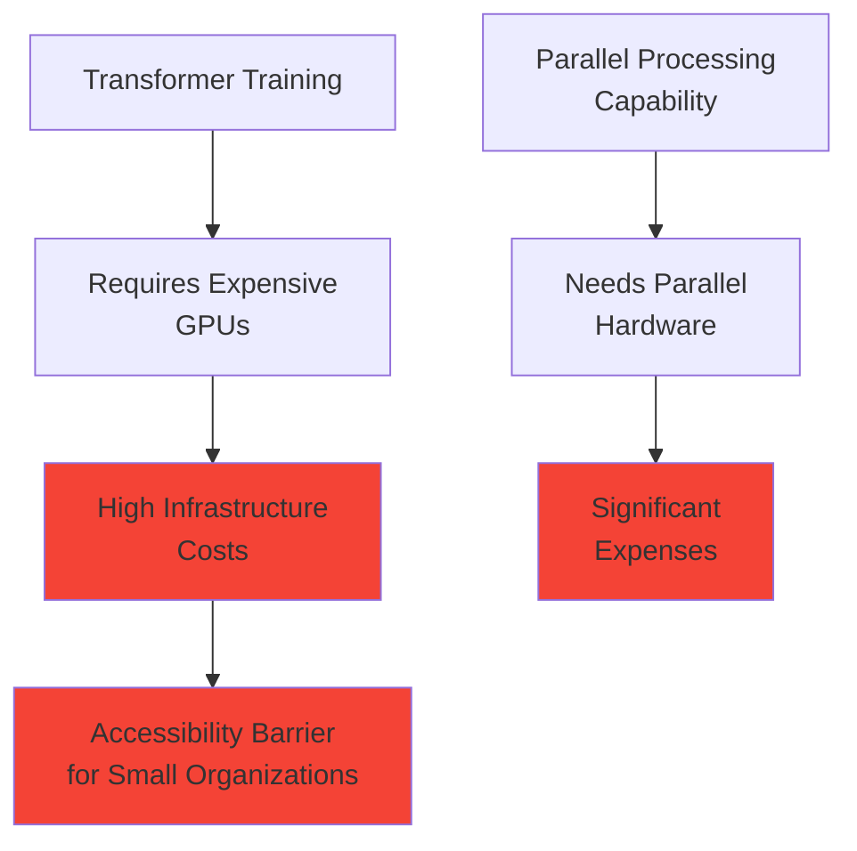

**Reality Check:** While Transformers can process information in parallel, you need GPUs to achieve that parallelization, and GPUs are expensive.

### 2. Data Hunger

**Requirements:**
- **Large Datasets:** Effective training requires massive amounts of data
- **Quality Data:** Good data collection and labeling costs money
- **Overfitting Risk:** High parameter count increases overfitting chance with limited data

**Positive Aspect:** For Large Language Models, unsupervised pre-training on text data (without labels) works well, reducing labeling costs.

### 3. Energy Consumption and Environmental Impact

**Concerns:**
- **Massive Power Usage:** Training large models requires significant electricity
- **Environmental Impact:** Carbon footprint of model training and inference
- **Sustainability Questions:** Long-term viability of scaling current approaches

### 4. Interpretability: The Black Box Problem

```mermaid
graph LR
    INPUT[Input] --> TRANSFORMER[Transformer<br/>Black Box] --> OUTPUT[Amazing Results]
    
    TRANSFORMER --> QUESTION[Why this output?<br/>How does it work?<br/>What's happening inside?]
    
    QUESTION --> CRITICAL[Problem for Critical<br/>Domains:]
    CRITICAL --> BANKING[Banking Sector]
    CRITICAL --> HEALTHCARE[Healthcare Sector]  
    CRITICAL --> LEGAL[Legal Applications]
    
    style TRANSFORMER fill:#424242
    style QUESTION fill:#ff9800
    style CRITICAL fill:#f44336
```

**Challenge:** Results are impressive, but explaining why specific outputs are generated remains difficult, limiting adoption in critical sectors requiring explainable decisions.

### 5. Bias and Ethical Concerns

**Issues:**
- **Training Data Bias:** Models inherit biases from internet-scale datasets
- **Ethical Usage:** Unauthorized use of copyrighted content for training
- **Legal Challenges:** Ongoing lawsuits regarding data usage rights

## Future Directions: The Next 4-5 Years

### 1. Efficiency Improvements

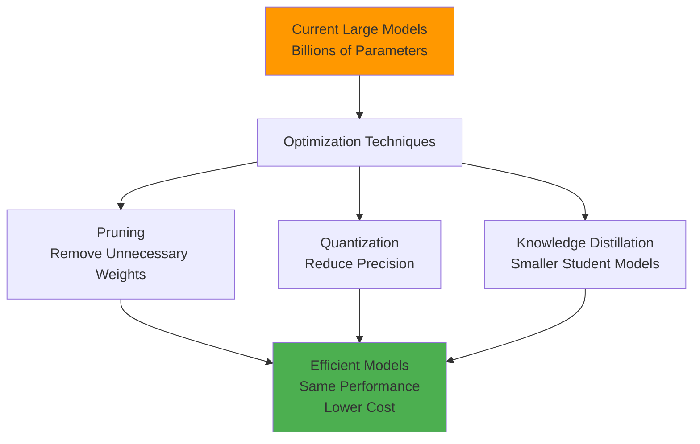

**Goal:** Maintain performance while significantly reducing model size and computational requirements.

### 2. Enhanced Multimodal Capabilities

**Expanding Modalities:**
- **Biometric Feedback:** Fingerprints, retinal scans
- **Time-series Data:** Sensor data, IoT applications
- **3D Spatial Data:** Virtual and augmented reality
- **Cross-modal Understanding:** Better integration across different data types

### 3. Domain-Specific Specialization

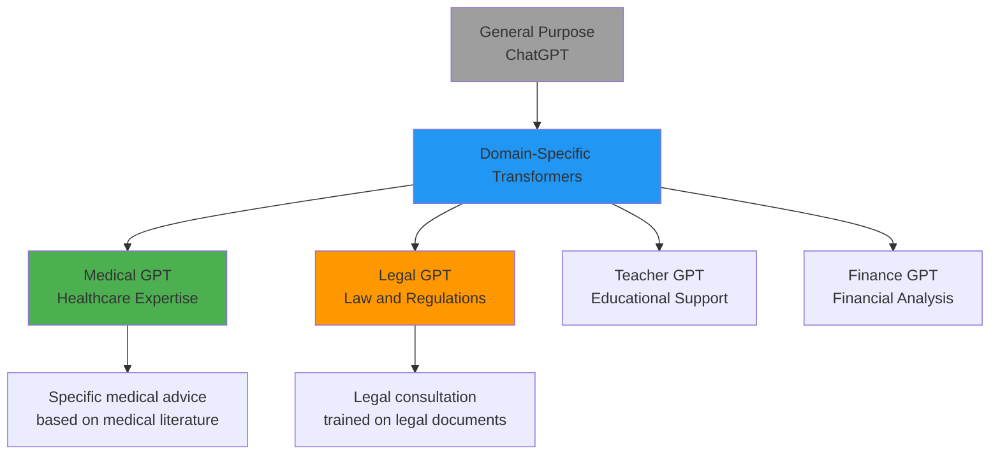

**Vision:** Instead of using general ChatGPT for everything, we'll have specialized experts trained on domain-specific data.

### 4. Multilingual and Regional Language Support

**Current Development:**
- **Indian Market:** Startups working on Hindi-based models
- **Krutrim AI:** Ola founder's company training Transformers from scratch in Hindi
- **Regional Languages:** Different languages getting their own specialized models

**Impact:** More inclusive AI that serves diverse global populations in their native languages.

### 5. Interpretability and Explainability

```mermaid
graph LR
    BLACKBOX[Current:<br/>Black Box Models] --> RESEARCH[Intensive Research]
    RESEARCH --> WHITEBOX[Goal:<br/>White Box Understanding]
    
    WHITEBOX --> CRITICAL[Critical Domain<br/>Applications:]
    CRITICAL --> BANKING2[Banking Decisions<br/>with Explanations]
    CRITICAL --> MEDICAL2[Medical Diagnosis<br/>with Reasoning]
    
    style BLACKBOX fill:#424242
    style WHITEBOX fill:#fff
    style CRITICAL fill:#4caf50
```

**Research Focus:** Understanding what happens inside Transformers, why they generate specific outputs, and making their decision-making process transparent.

## Historical Timeline: Transformer Evolution

```mermaid
timeline
    title Complete Transformer Timeline
    
    2000-2014 : RNN/LSTM Dominance
             : Sequential processing
             : Limited scalability
    
    2014-2015 : Encoder-Decoder + Attention
             : Sequence-to-sequence learning
             : Attention mechanism introduction
             : Still sequential limitations
    
    2017      : Transformer Revolution
             : "Attention Is All You Need"
             : Parallel processing breakthrough
             : Self-attention mechanisms
    
    2018      : Pre-trained Model Era
             : BERT & GPT-1
             : Transfer learning begins
             : NLP transformation starts
    
    2018-2020 : Cross-Domain Expansion
             : Vision Transformers
             : AlphaFold 2
             : Scientific applications
    
    2021      : Generative AI Emergence
             : GPT-3 capabilities
             : DALL-E image generation
             : Codex code generation
    
    2022-Present : AI Revolution
                : ChatGPT mainstream adoption
                : Stable Diffusion open source
                : Industry transformation
```

## Comprehensive Advantages Summary

As Presenter concludes, here are the 5-6 main advantages you should know:

1. **Scalability:** Parallel processing enables massive dataset training
2. **Transfer Learning:** Pre-train once, fine-tune for multiple tasks
3. **Multimodal Capability:** Handle different input/output types
4. **Flexible Architecture:** Encoder-only, decoder-only, or both variants
5. **Vibrant Ecosystem:** Extensive community support and resources
6. **Integration Potential:** Combines well with other AI techniques

## Major Applications Across Domains

### Most Famous Applications:

1. **ChatGPT:** Conversational AI for any purpose
2. **DALL-E 2:** Text-to-image generation  
3. **AlphaFold 2:** Protein structure prediction
4. **OpenAI Codex:** Natural language to code (GitHub Copilot)

### Research Reference

For comprehensive coverage of all Transformer applications, Presenter recommends the 58-page survey paper that categorizes all available Transformer architectures and applications across different domains.

## Current Disadvantages and Limitations

1. **High Computational Requirements:** Expensive GPU infrastructure needed
2. **Data Requirements:** Need large datasets for effective training  
3. **Energy Consumption:** Environmental concerns due to massive power usage
4. **Interpretability:** Black box nature limits critical applications
5. **Bias and Ethics:** Inherit biases from training data, ethical concerns about data usage

## Key Takeaways

**Revolutionary Impact:** Transformers represent a fundamental paradigm shift that enabled:
- Unprecedented progress in NLP (50 years in 5 years)
- Democratization of AI through transfer learning
- Multimodal AI applications
- Unification of deep learning architectures

**Future Outlook:** Research continues on efficiency, multimodality, domain specialization, multilingual support, and interpretability.

**Next Steps:** The video series will dive deep into Transformer architecture details, with the next video focusing on **self-attention** - the core mechanism that makes Transformers work.

As Presenter emphasizes, understanding this overview provides crucial motivation and context for the detailed technical dive that follows. Transformers aren't just another architecture - they're the foundation of the AI revolution we're all experiencing today.

**Looking Ahead:** The next video will cover **self-attention**, which Presenter calls the most important topic in the entire series - the central mechanism behind how Transformers actually work.

[End of Notes]