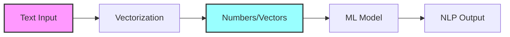
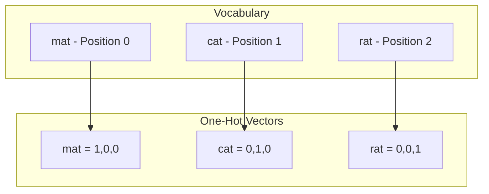
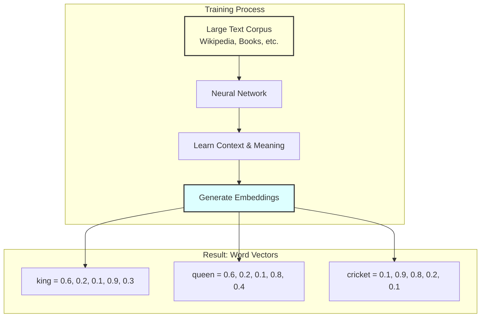
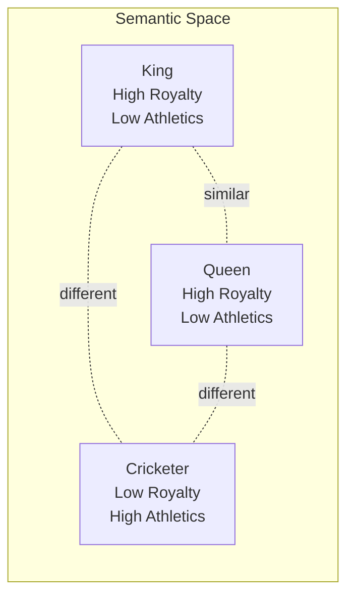
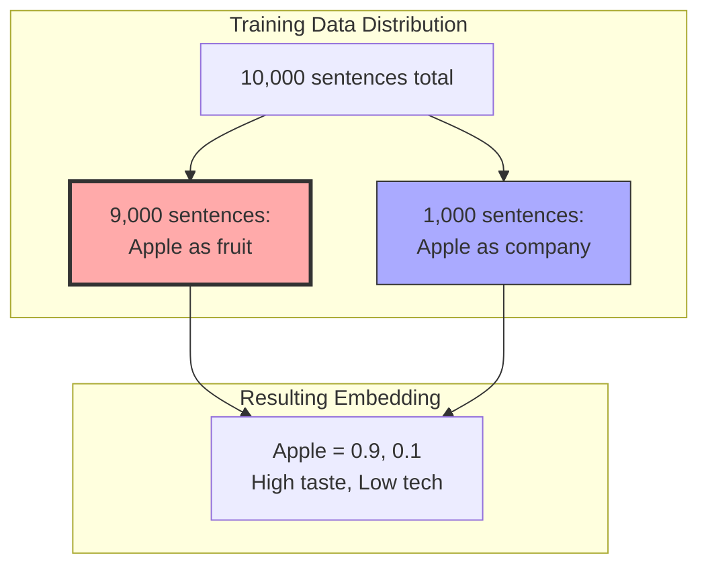
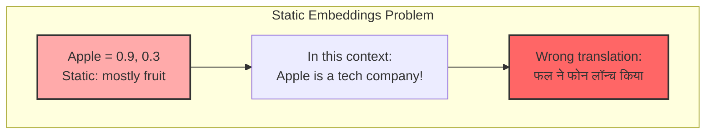
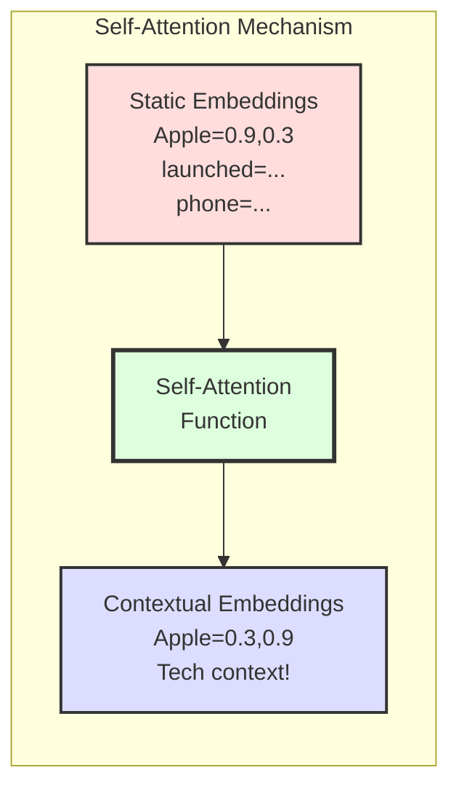
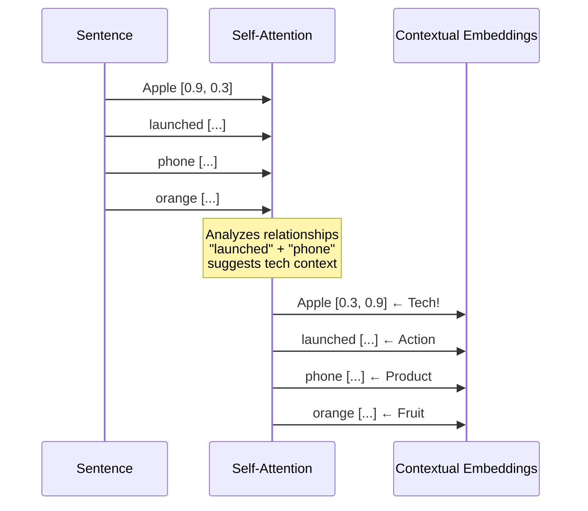
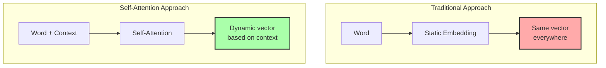

# What is Self Attention - Transformers Part 2

## Introduction

**Paper References:**
- [Attention is All You Need](https://arxiv.org/abs/1706.03762) - The original Transformer paper by Vaswani et al.
- [The Illustrated Transformer](http://jalammar.github.io/illustrated-transformer/) - Jay Alammar's visual guide

**Video Context:** This video is the first part of a three-part series on self-attention mechanism, which is the foundational building block of Transformers. Understanding self-attention deeply is crucial for mastering Transformers and modern LLMs.

**Learning Journey:** By the end of this video, you'll understand what self-attention is and why it's needed. The subsequent parts will cover how it works and the detailed geometry behind it.

**Connection to Broader Concepts:** Self-attention is the key innovation that powers Transformers, which in turn are the foundation of all modern language models including GPT, BERT, and other LLMs.

---

## The Fundamental NLP Challenge: Converting Words to Numbers

Before diving into self-attention, let's understand the core requirement of any NLP application. Whether you're building sentiment analysis, named entity recognition, or machine translation systems, the first and most critical step is **converting words to numbers** (vectorization).



Computers only understand numbers, not words. So the evolution of NLP has been largely about finding better ways to represent text as numbers.

## Evolution of Text Representation Techniques

### 1. One-Hot Encoding (The Beginning)

Let's say we have two sentences:
- "mat cat mat"
- "cat rat rat"

First, we identify unique words: mat, cat, rat



So "mat cat mat" becomes: [1,0,0] [0,1,0] [1,0,0]

**Problem:** This representation is inefficient and doesn't capture any semantic meaning.

### 2. Bag of Words (Slight Improvement)

Bag of Words counts the frequency of each word:

```python
# For "mat cat mat"
vector = [2, 1, 0]  # mat appears 2x, cat 1x, rat 0x

# For "cat rat rat"
vector = [0, 1, 2]  # mat 0x, cat 1x, rat 2x
```

### 3. TF-IDF (Further Refinement)

TF-IDF adds importance weighting to word frequencies, but still lacks semantic understanding.

### 4. Word Embeddings (The Game Changer)

Word embeddings revolutionized NLP by capturing **semantic meaning**. They convert words into dense vectors where similar words have similar vectors.



## The Power and Limitation of Word Embeddings

### Power: Semantic Similarity

Word embeddings capture semantic relationships. In a 5-dimensional embedding space (simplified for illustration):



Each dimension captures some aspect:
- Dimension 1: Royalty (high for king/queen, low for cricketer)
- Dimension 2: Athleticism (low for king/queen, high for cricketer)
- Dimension 3: Human-ness (high for all three)

### Limitation: Static Nature

Word embeddings capture **average meaning** across the training data, not context-specific meaning.



## The Problem: Context Matters!

Consider this translation task:
**English:** "Apple launched a new phone while I was eating an orange"
**Task:** Translate to Hindi



The static embedding assumes "Apple" is mostly used as a fruit, but in this sentence, it's clearly the technology company!

## The Solution: Self-Attention

Self-attention solves this by creating **contextual embeddings** - embeddings that change based on the surrounding words.



### How Self-Attention Creates Contextual Understanding



The self-attention mechanism looks at all words in the sentence and adjusts each word's embedding based on its context. It's smart enough to:
- Recognize "launched" and "phone" indicate a technology context
- Adjust Apple's embedding to reflect company meaning
- Keep "orange" as a fruit despite "Apple" being in the same sentence

## Visual Summary: Static vs Contextual Embeddings



## Key Takeaways

- **Word embeddings** are powerful but static - they represent average meaning
- **Context matters** - the same word can have different meanings in different sentences
- **Self-attention** is a mechanism that converts static embeddings to contextual embeddings
- **Contextual embeddings** understand word meaning based on surrounding words
- This is the foundation that makes Transformers so powerful for NLP tasks

## What's Next?

In the next video, we'll dive into **how** self-attention actually works:
- Query, Key, and Value vectors
- The attention calculation process
- How context influences the final embeddings

## References

1. Vaswani, A., Shazeer, N., Parmar, N., Uszkoreit, J., Jones, L., Gomez, A. N., ... & Polosukhin, I. (2017). **Attention is all you need**. In Advances in neural information processing systems (pp. 5998-6008).

2. Devlin, J., Chang, M. W., Lee, K., & Toutanova, K. (2018). **BERT: Pre-training of deep bidirectional transformers for language understanding**. arXiv preprint arXiv:1810.04805.

[End of Notes]