# How Self-Attention Works in Transformers - The Complete Guide

## Introduction

**Paper References:**
- [Attention is All You Need](https://arxiv.org/abs/1706.03762) - Vaswani et al., 2017 (Original Transformer Paper)
- [The Illustrated Transformer](http://jalammar.github.io/illustrated-transformer/) - Jay Alammar (Visual Guide)
- [BERT: Pre-training of Deep Bidirectional Transformers](https://arxiv.org/abs/1810.04805) - Devlin et al., 2018
- [Deep Dive into Self-Attention by Hand](https://towardsdatascience.com/deep-dive-into-self-attention-by-hand-︎-f02876e49857/) - Mathematical Walkthrough
- [Understanding and Coding the Self-Attention Mechanism](https://sebastianraschka.com/blog/2023/self-attention-from-scratch.html) - Sebastian Raschka

**Interactive Visualizations:**
- [BertViz: Visualize Attention in NLP Models](https://github.com/jessevig/bertviz) - Interactive attention visualization tool
- [BertViz Interactive Colab Tutorial](https://colab.research.google.com/drive/1hXIQ77A4TYS4y3UthWF-Ci7V7vVUoxmQ?usp=sharing) - Try it live in Colab
- [AttentionViz: Global Attention Pattern Analysis](http://attentionviz.com) - Interactive demo for global pattern analysis
- [The Animated Transformer](https://prvnsmpth.github.io/animated-transformer/) - Step-by-step animations of self-attention
- [Transformer Explainer](https://poloclub.github.io/transformer-explainer/) - Visual LLM Transformer Model explanations
- [Transformer Visualization](https://uvadlc-notebooks.readthedocs.io/en/latest/tutorial_notebooks/tutorial6/Transformers_and_MHAttention.html) - UvA Deep Learning Notebooks

**Video Context:** This is the most important video for understanding generative AI. Self-attention is at the center of Transformer architecture, which is at the center of all generative AI technology. This video took 14 days to create, building self-attention from first principles to make it feel like you invented it yourself.

**Learning Journey:** By the end, you'll understand exactly how self-attention works mechanically, why Query-Key-Value vectors are needed, how they're created through learnable parameters, and how the entire process can be parallelized using matrix operations.

**Connection to Broader Concepts:** Self-attention is the heart of Transformers. If you understand self-attention, you'll understand Transformers. If you understand Transformers, you'll have mastery over modern LLMs and generative AI.

---

## The Foundation: Why We Need Self-Attention

First, let's understand the fundamental challenge. For any NLP application - sentiment analysis, named entity recognition, machine translation - the most important requirement is converting words to numbers that machines can understand.

The evolution of text representation has gone through several stages:


### The Static Embedding Problem

Word embeddings are powerful because they capture semantic meaning. When we train embeddings on large datasets, each word gets represented as an n-dimensional vector where similar words have similar vectors.


But here's the critical limitation: word embeddings capture **average meaning** across all training data, not context-specific meaning.

### The Context Problem Illustrated

Consider two sentences:
1. "money bank grows" 
2. "river bank flows"

```mermaid
flowchart TD
    subgraph "Training Data<br/>Distribution"
        A["10,000 sentences<br/>with 'bank'"]
        B["9,000 sentences:<br/>bank as financial<br/>institution"]
        C["1,000 sentences:<br/>bank as river edge"]
    end
    
    subgraph "Resulting Static<br/>Embedding"
        D["bank = [high_finance,<br/>low_geography]<br/>Biased toward<br/>financial meaning"]
    end
    
    subgraph "The Problem"
        E["Both contexts get<br/>same embedding!"]
        F["'money bank'<br/>← same vector"]
        G["'river bank'<br/>← same vector"]
    end
    
    A --> B
    A --> C
    B --> D
    C --> D
    D --> E
    E --> F
    E --> G
    
    style B fill:#ffecb3,stroke:#f57f17,stroke-width:3px
    style C fill:#e8f5e8,stroke:#2e7d32,stroke-width:1px
    style E fill:#ffebee,stroke:#c62828,stroke-width:2px
```

## Building Self-Attention from First Principles

"Let's approach this like we're inventors creating self-attention for the first time. The goal is to make this so intuitive that by the end, you'll feel like you could have invented self-attention yourself."

We start with a challenge: making the word "bank" have different representations in different contexts.

Sentences to work with:
1. "money bank grows"
2. "river bank flows"

### The Breakthrough Idea: Words as Context-Weighted Combinations

"What if instead of representing 'bank' just as 'bank', we represent it as a mixture of all words in the sentence?"

```mermaid
flowchart TD
    subgraph "Traditional Approach"
        A["bank = bank<br/>(always same)"]
    end
    
    subgraph "New Contextual<br/>Approach"
        B["In 'money bank grows':<br/>bank = 0.2×money +<br/>0.7×bank + 0.1×grows"]
        C["In 'river bank flows':<br/>bank = 0.1×river +<br/>0.8×bank + 0.1×flows"]
    end
    
    subgraph "The Magic"
        D["Different contexts →<br/>Different<br/>representations!"]
    end
    
    A --> B
    A --> C
    B --> D
    C --> D
    
    style A fill:#ffcdd2,stroke:#d32f2f,stroke-width:2px
    style B fill:#c8e6c9,stroke:#388e3c,stroke-width:2px
    style C fill:#bbdefb,stroke:#1976d2,stroke-width:2px
    style D fill:#fff3e0,stroke:#f57c00,stroke-width:3px
```

This simple idea changes everything! Now "bank" gets different numerical representations based on its surrounding words.

### Mathematical Foundation

"Let's write this mathematically. For the sentence 'money bank grows', each word gets a new representation:"

For each word, we create a new contextual embedding as a weighted sum:

$$E_{money}^{contextual} = w_{11} \cdot E_{money} + w_{12} \cdot E_{bank} + w_{13} \cdot E_{grows}$$

$$E_{bank}^{contextual} = w_{21} \cdot E_{money} + w_{22} \cdot E_{bank} + w_{23} \cdot E_{grows}$$

$$E_{grows}^{contextual} = w_{31} \cdot E_{money} + w_{32} \cdot E_{bank} + w_{33} \cdot E_{grows}$$

Where:
- $E$ = original static word embeddings
- $w$ = similarity weights (how much each word contributes)
- Superscript "contextual" = new dynamic representations

The key insight: **the weights $w_{ij}$ represent how similar or relevant word $j$ is to word $i$ in this specific context.**

## Computing Similarity: The Dot Product Magic

"But how do we decide these weights? We need to calculate similarity between word embeddings, and the simplest way is dot product."

```mermaid
flowchart LR
    subgraph "Why Dot Product Works"
        A["Vector 1: [6, 1]"]
        B["Vector 2: [4, 2]"]
        C["Dot Product:<br/>6×4 + 1×2 = 26"]
        D["High similarity!"]
    end
    
    subgraph "Contrast"
        E["Vector 1: [6, 1]"]
        F["Vector 3: [1, 5]"]
        G["Dot Product:<br/>6×1 + 1×5 = 11"]
        H["Lower similarity"]
    end
    
    A --> C
    B --> C
    C --> D
    
    E --> G
    F --> G
    G --> H
    
    style C fill:#c8e6c9,stroke:#388e3c,stroke-width:2px
    style D fill:#a5d6a7,stroke:#388e3c,stroke-width:2px
    style G fill:#ffcdd2,stroke:#d32f2f,stroke-width:2px
    style H fill:#ef9a9a,stroke:#d32f2f,stroke-width:2px
```

### The Similarity Computation Process

"Here's exactly how we calculate similarity between every pair of words:"

```mermaid
flowchart TD
    subgraph "For word 'bank' in 'money bank grows'"
        A["E_bank<br/>(our focus word)"]
        B["Calculate similarity<br/>with:"]
        C["E_money → s₂₁"]
        D["E_bank → s₂₂"]
        E["E_grows → s₂₃"]
    end
    
    subgraph "Dot Product Details"
        F["s₂₁ = E_bank ·<br/>E_money"]
        G["s₂₂ = E_bank ·<br/>E_bank"]
        H["s₂₃ = E_bank ·<br/>E_grows"]
    end
    
    A --> B
    B --> C
    B --> D
    B --> E
    C --> F
    D --> G
    E --> H
    
    style A fill:#e1f5fe,stroke:#0277bd,stroke-width:2px
    style F fill:#f3e5f5,stroke:#7b1fa2,stroke-width:2px
    style G fill:#f3e5f5,stroke:#7b1fa2,stroke-width:2px
    style H fill:#f3e5f5,stroke:#7b1fa2,stroke-width:2px
```

### The Complete Self-Attention Process Flow

"Let me show you the complete process step by step. This is the heart of self-attention:"

```mermaid
sequenceDiagram
    participant I as Input Embeddings
    participant S as Similarity Calculation
    participant N as Normalization
    participant W as Weighted Combination
    participant O as Output
    
    Note over I: For 'bank' in 'money bank grows'
    
    I->>S: E_bank · E_money = s₂₁
    I->>S: E_bank · E_bank = s₂₂ 
    I->>S: E_bank · E_grows = s₂₃
    
    Note over S: Raw similarity scores
    
    S->>N: Apply Softmax
    Note over N: s₂₁, s₂₂, s₂₃ → w₂₁, w₂₂, w₂₃<br/>Converts to probabilities<br/>(sum = 1)
    
    N->>W: Weight × Embedding
    W->>O: w₂₁×E_money +<br/>w₂₂×E_bank +<br/>w₂₃×E_grows
    
    Note over O: Y_bank (contextual embedding)
```

### Step-by-Step Visualization

```mermaid
flowchart TD
    subgraph "Step 1: Similarity Scores"
        A["bank · money = 0.25"]
        B["bank · bank = 1.0"]
        C["bank · grows = 0.05"]
    end
    
    subgraph "Step 2: Softmax Normalization"
        D["Softmax([0.25,<br/>1.0, 0.05])"]
        E["→ [0.2, 0.7, 0.1]"]
    end
    
    subgraph "Step 3: Weighted Sum"
        F["0.2 × E_money<br/>+ 0.7 × E_bank<br/>+ 0.1 × E_grows"]
    end
    
    subgraph "Step 4: Result"
        G["Y_bank (contextual)"]
    end
    
    A --> D
    B --> D
    C --> D
    D --> E
    E --> F
    F --> G
    
    style D fill:#fff3e0,stroke:#f57c00,stroke-width:2px
    style E fill:#e8f5e8,stroke:#2e7d32,stroke-width:2px
    style G fill:#e3f2fd,stroke:#1565c0,stroke-width:3px
```

### Why Softmax Normalization is Critical

"Raw dot products can be any value - positive, negative, large, small. We need to convert them to meaningful weights."

**The Softmax Transform:**
$$w_{ij} = \frac{e^{s_{ij}}}{\sum_k e^{s_{ik}}}$$

```mermaid
flowchart LR
    subgraph "Before Softmax"
        A["Raw scores:<br/>[36, -1, 32]"]
        B["Problems:<br/>• Negative values<br/>• Don't sum to 1<br/>• Hard to interpret"]
    end
    
    subgraph "Softmax Magic"
        C["Apply exponential<br/>then normalize"]
    end
    
    subgraph "After Softmax"
        D["Weights:<br/>[0.7, 0.2, 0.1]"]
        E["Benefits:<br/>• All positive<br/>• Sum to 1<br/>• Probability-like"]
    end
    
    A --> C
    B --> C
    C --> D
    C --> E
    
    style A fill:#ffcdd2,stroke:#d32f2f,stroke-width:2px
    style C fill:#fff3e0,stroke:#f57c00,stroke-width:2px
    style D fill:#c8e6c9,stroke:#388e3c,stroke-width:2px
```

**Intuitive Understanding:**
- High similarity → High weight (more contribution)
- Low similarity → Low weight (less contribution)  
- All weights sum to 1 (like probability distribution)
- "Bank" is 70% itself, 20% influenced by "money", 10% by "grows"

### Detailed Mathematical Example: "money bank grows"

Let's work through the complete calculation for the word "bank" step by step:

**Step 1: Similarity Calculation (Dot Products)**
```
Raw similarity scores for 'bank':
- s₂₁ = bank · money = 0.25
- s₂₂ = bank · bank = 1.0  
- s₂₃ = bank · grows = 0.05
```

**Step 2: Softmax Normalization**
```
Apply exponential:
- exp(0.25) = 1.284
- exp(1.0) = 2.718
- exp(0.05) = 1.051
- Sum = 1.284 + 2.718 + 1.051 = 5.053

Calculate weights:
- w₂₁ = 1.284/5.053 = 0.254 ≈ 0.2 (20%)
- w₂₂ = 2.718/5.053 = 0.538 ≈ 0.7 (70%)
- w₂₃ = 1.051/5.053 = 0.208 ≈ 0.1 (10%)

Final weights: [0.2, 0.7, 0.1] ✓ (sum = 1.0)
```

**Step 3: Contextual Embedding Calculation**
```
Y_bank = w₂₁ × V_money + w₂₂ × V_bank + w₂₃ × V_grows
Y_bank = 0.2 × V_money + 0.7 × V_bank + 0.1 × V_grows

Interpretation:
- 70% of original 'bank' meaning (self-attention)
- 20% influenced by 'money' (financial context)
- 10% influenced by 'grows' (business context)
```

### Contrasting Example: "river bank flows"

For the same word "bank" in a different context:

**Expected Similarity Pattern:**
```
Raw similarity scores for 'bank':
- s₂₁ = bank · river = 0.4 (geographical context)
- s₂₂ = bank · bank = 1.0
- s₂₃ = bank · flows = 0.3 (water movement context)
```

**After Softmax:**
```
Expected weights: [0.3, 0.6, 0.1]
- 30% influenced by 'river' (geographical context)
- 60% self-attention 
- 10% influenced by 'flows'

Result: Y_bank now has geographical meaning instead of financial!
```

### Complete Attention Matrix Example

For the sentence "money bank grows", the full attention matrix would be:

```python
# Similarity Matrix S (3×3)
S = [
    [1.0,  0.25, 0.1 ],  # money's similarities
    [0.25, 1.0,  0.05],  # bank's similarities  
    [0.1,  0.05, 1.0 ]   # grows' similarities
]

# After Softmax - Attention Weights W (3×3)
W = [
    [0.65, 0.25, 0.1 ],  # money attends to...
    [0.2,  0.7,  0.1 ],  # bank attends to...
    [0.15, 0.15, 0.7 ]   # grows attends to...
]

# Final Contextual Embeddings
Y_money = 0.65×V_money + 0.25×V_bank + 0.1×V_grows
Y_bank  = 0.2×V_money + 0.7×V_bank + 0.1×V_grows  
Y_grows = 0.15×V_money + 0.15×V_bank + 0.7×V_grows
```

**Key Insight:** Each word gets a different contextual representation based on how much attention it pays to every other word in the sentence!


## The GPU Parallelization Breakthrough

"Here's where the magic happens. Instead of computing each word one by one, we can do ALL words simultaneously using matrix operations!"

```mermaid
flowchart TD
    subgraph "Sequential Processing<br/>(Slow)"
        A1["Process 'money'<br/>⏱️ Time: t"]
        A2["Process 'bank'<br/>⏱️ Time: t"]
        A3["Process 'grows'<br/>⏱️ Time: t"]
        A4["Total: 3t"]
        
        A1 --> A2
        A2 --> A3
        A3 --> A4
    end
    
    subgraph "Matrix Parallelization<br/>(Fast)"
        B1["All Embeddings<br/>at once"]
        B2["Matrix Operations<br/>⏱️ Time: t"]
        B3["All Results<br/>simultaneously"]
        B4["Total: t"]
        
        B1 --> B2
        B2 --> B3
        B3 --> B4
    end
    
    subgraph "The Advantage"
        C["3× faster for 3 words<br/>1000× faster<br/>for 1000 words!"]
    end
    
    A4 -.-> C
    B4 -.-> C
    
    style A4 fill:#ffcdd2,stroke:#d32f2f,stroke-width:2px
    style B4 fill:#c8e6c9,stroke:#388e3c,stroke-width:2px
    style C fill:#e1f5fe,stroke:#0277bd,stroke-width:3px
```

### Matrix Operations Visualization

"Let's see how we stack everything into matrices for parallel processing:"

```mermaid
flowchart LR
    subgraph "Input: Stacked<br/>Embeddings"
        A["E = [E_money<br/>     E_bank<br/>     E_grows]<br/>3×n matrix"]
    end
    
    subgraph "Similarity Matrix"
        B["S = E × E^T<br/>3×3 matrix"]
        C["[s₁₁ s₁₂ s₁₃<br/> s₂₁ s₂₂ s₂₃<br/> s₃₁ s₃₂ s₃₃]"]
    end
    
    subgraph "Weight Matrix"
        D["W = softmax(S)<br/>3×3 matrix"]
    end
    
    subgraph "Output: Contextual<br/>Embeddings"
        E["Y = W × E<br/>3×n matrix"]
        F["[Y_money<br/> Y_bank<br/> Y_grows]"]
    end
    
    A --> B
    B --> C
    C --> D
    D --> E
    E --> F
    
    style A fill:#e3f2fd,stroke:#1565c0,stroke-width:2px
    style D fill:#fff3e0,stroke:#f57c00,stroke-width:2px
    style F fill:#c8e6c9,stroke:#388e3c,stroke-width:2px
```

### Complete Matrix Implementation

```python
# The Four-Step Matrix Dance
import numpy as np

# Step 1: Stack all word embeddings into one matrix
E = np.array([
    [E_money],   # Row 1: money's embedding
    [E_bank],    # Row 2: bank's embedding  
    [E_grows]    # Row 3: grows' embedding
])  # Shape: [3, embedding_dim]

print(f"Input embeddings shape: {E.shape}")

# Step 2: Compute ALL pairwise similarities at once
S = E @ E.T  # Matrix multiplication magic!
# S[i,j] = similarity between word i and word j
print(f"Similarity matrix shape: {S.shape}")  # [3, 3]
print(f"S = \n{S}")

# Step 3: Convert similarities to probability weights
W = softmax(S, axis=1)  # Each row sums to 1
print(f"Weight matrix shape: {W.shape}")  # [3, 3] 
print(f"Each row sums to: {W.sum(axis=1)}")  # [1, 1, 1]

# Step 4: Create contextual embeddings
Y = W @ E  # Weighted combination of all embeddings
print(f"Contextual embeddings shape: {Y.shape}")  # [3, embedding_dim]

# Result: Y[0] = contextual embedding for 'money'
#         Y[1] = contextual embedding for 'bank'
#         Y[2] = contextual embedding for 'grows'
```

**The Beauty:** Whether you have 3 words or 3000 words, it's still just 4 matrix operations!

## The Critical Limitation: Why This Isn't Enough

"Our approach works, but it has a fundamental problem. Let me explain why we need to go deeper."

Our first-principles self-attention has two major issues:


**The Learning Problem is Critical:**
- No weights to train = no adaptation to specific tasks
- Machine translation needs different attention than sentiment analysis
- We need **task-specific contextual embeddings**, not just general ones

### The Three Operations Without Learning Parameters

"If you carefully look at our first-principles self-attention, we're only performing three operations:"

```mermaid
flowchart LR
    subgraph "Our Current Operations"
        A["📊 Operation 1<br/>Dot Product<br/>(Similarity)"]
        B["📈 Operation 2<br/>Softmax<br/>(Normalization)"]
        C["📊 Operation 3<br/>Dot Product<br/>(Weighted Sum)"]
    end
    
    subgraph "The Problem"
        D["❌ No learnable<br/>parameters<br/>in any operation"]
        E["❌ No weights<br/>to optimize"]
        F["❌ No adaptation<br/>to training data"]
    end
    
    A --> D
    B --> E
    C --> F
    
    style D fill:#ffcdd2,stroke:#d32f2f,stroke-width:2px
    style E fill:#ffcdd2,stroke:#d32f2f,stroke-width:2px
    style F fill:#ffcdd2,stroke:#d32f2f,stroke-width:2px
```

**What this means:**
- Same input embeddings → Same output every time
- No learning from training examples
- General contextual embeddings only (not task-specific)

### Why Task-Specific Learning is Essential

"Let me show you why general contextual embeddings aren't enough with a real example."

**Translation Example:** "Apple launched a new phone while I was eating an orange"

### Detailed Attention Analysis for "Apple" Word

Let's see how self-attention determines that "Apple" refers to the technology company:

**Step 1: Key Similarity Calculations**
```
Apple's attention to context words:
- Apple · launched = 0.6 (high tech correlation)
- Apple · new = 0.3 (moderate correlation)
- Apple · phone = 0.8 (very high tech correlation)
- Apple · while = 0.1 (low correlation)
- Apple · eating = 0.2 (food context)
- Apple · orange = 0.3 (fruit context)
- Apple · Apple = 1.0 (self-attention)
```

**Step 2: Context Competition**
```
Technology context signals:
- launched (0.6) + phone (0.8) = 1.4 total strength

Food context signals:  
- eating (0.2) + orange (0.3) = 0.5 total strength

Tech context wins! 1.4 > 0.5
```

**Step 3: After Softmax Normalization**
```
Apple's attention weights (simplified):
- Tech context influence: ~40% (launched + phone)
- Food context influence: ~18% (eating + orange)  
- Self-attention: ~42%

Result: Y_Apple = 0.42×V_Apple + 0.24×V_launched + 
                  0.16×V_phone + 0.18×V_food_context
```

**Contextual Embedding Result:**
Apple's representation now contains 40% technology context, making it refer to the company rather than the fruit!

```mermaid
flowchart TD
    subgraph "With General Context (Wrong)"
        A["Apple embedding<br/>(mostly fruit from training data)"]
        B["General self-attention<br/>(no learning)"]
        C["'launched' + 'phone' ignored"]
        D["Hindi: 'सेब ने फोन लॉन्च किया'<br/>(An apple launched a phone)"]
    end
    
    subgraph "With Task-Specific Learning (Right)"
        E["Same Apple embedding"]
        F["Learned self-attention<br/>(trained on translation data)"]
        G["'launched' + 'phone' → tech context<br/>Attention weights: [0.6, 0.8]<br/>Total tech influence: 40%"]
        H["Hindi: 'एप्पल ने नया फोन लॉन्च किया'<br/>(Apple [company] launched new phone)"]
    end
    
    A --> B
    B --> C  
    C --> D
    
    E --> F
    F --> G
    G --> H
    
    style D fill:#ffcdd2,stroke:#d32f2f,stroke-width:2px
    style H fill:#c8e6c9,stroke:#388e3c,stroke-width:2px
```

### More Real-World Translation Examples

**Example 1: "Piece of cake" → Hindi**
```
General contextual embedding approach:
- Input: "This task is a piece of cake"
- General attention: "piece" + "cake" → food context
- Hindi translation: "केक का टुकड़ा" (literally: cake slice)
- ❌ WRONG! Misses the idiomatic meaning

Task-specific approach (after training):
- Learned attention: "task" + "piece of cake" → easy/simple context  
- Hindi translation: "बहुत आसान काम" (very easy task)
- ✅ CORRECT! Captures idiomatic meaning
```

**Example 2: "Break a leg" → Hindi**
```
General contextual embedding:
- Hindi: "टांग तोड़ दो" (literally break a leg)
- ❌ WRONG! Literal translation

Task-specific contextual embedding:
- Hindi: "शुभकामनाएं" (good luck - idiomatic meaning) 
- ✅ CORRECT! Contextual understanding
```

**Example 3: Machine Translation Training Data**
```
Training Examples:
Input:  "How are you?"     → Output: "कैसे हो?"
Input:  "I am good"        → Output: "मैं बढ़िया हूं"
Input:  "This is easy"     → Output: "यह आसान है"

Problem with our approach:
- No learning from this training data
- Same general embeddings regardless of task
- Cannot adapt to translation patterns
```

### The Core Problem Visualized

```mermaid
flowchart TD
    subgraph "Current Approach<br/>(General)"
        A["Word Embedding<br/>(Static)"]
        B["General Self-Attention<br/>(No learning)"]
        C["General Contextual<br/>Embedding"]
        D["❌ Works for any task<br/>but not optimized<br/>for specific task"]
    end
    
    subgraph "What We Need<br/>(Task-Specific)"
        E["Same Word Embedding"]
        F["Learnable Self-Attention<br/>(Trainable parameters)"]
        G["Task-Specific<br/>Contextual Embedding"]
        H["✅ Optimized for<br/>specific task<br/>(translation, sentiment, etc.)"]
    end
    
    A --> B --> C --> D
    E --> F --> G --> H
    
    style D fill:#ffcdd2,stroke:#d32f2f,stroke-width:2px
    style H fill:#c8e6c9,stroke:#388e3c,stroke-width:2px
```

**The Solution:** We need learnable parameters that adapt during training!

## Progress Recap: Our Self-Attention Journey So Far

"Let's summarize our progress before moving to the breakthrough solution:"

```mermaid
flowchart TD
    subgraph "🎯 The Original Problem"
        A["Words need to be<br/>understandable to machines"]
        B["Convert text to numbers<br/>that capture meaning"]
    end
    
    subgraph "💡 First Solution: Word Embeddings"
        C["Word embeddings capture<br/>semantic meaning"]
        D["Similar words →<br/>Similar vectors"]
        E["✅ Great for meaning<br/>❌ No context awareness"]
    end
    
    subgraph "🔍 The Context Problem"
        F["'river bank' vs 'money bank'<br/>Same vector for both!"]
        G["Need: Dynamic embeddings<br/>based on context"]
    end
    
    subgraph "⚡ Our First Solution:<br/>Simple Self-Attention"
        H["Contextual embeddings<br/>based on surrounding words"]
        I["✅ Captures context<br/>✅ Parallel processing<br/>❌ No learning parameters"]
    end
    
    subgraph "🎯 Current Challenge"
        J["General contextual embeddings<br/>vs<br/>Task-specific embeddings"]
        K["Need: Learnable parameters<br/>for task adaptation"]
    end
    
    A --> B
    B --> C
    C --> D
    D --> E
    E --> F
    F --> G
    G --> H
    H --> I
    I --> J
    J --> K
    
    style E fill:#fff3e0,stroke:#f57c00,stroke-width:2px
    style I fill:#e8f5e8,stroke:#2e7d32,stroke-width:2px
    style K fill:#e3f2fd,stroke:#1565c0,stroke-width:3px
```

### Key Insights Discovered

**✅ What Works:**
1. **Contextual embeddings** solve the static embedding problem
2. **Parallel processing** makes computation extremely fast
3. **Self-attention mechanism** captures word relationships effectively

**❌ What's Missing:**
1. **Learning parameters** for task adaptation
2. **Task-specific optimization** (translation ≠ sentiment analysis)
3. **Trainable weights** that improve with data

**🎯 Next Goal:**
Introduce learnable parameters into our self-attention mechanism to enable task-specific contextual embeddings!


## Finding Where to Add Learnable Parameters

"Now that we know we need learnable parameters, the question is: WHERE should we add them?"

### Analyzing Our Three-Step Process

"Let's think from first principles. Our current process has exactly three steps:"

```mermaid
flowchart LR
    subgraph "Step Analysis"
        A["📊 Step 1:<br/>Dot Product<br/>(Similarity)"]
        B["📈 Step 2:<br/>Softmax<br/>(Normalization)"]
        C["📊 Step 3:<br/>Dot Product<br/>(Weighted Sum)"]
    end
    
    subgraph "Where Can We<br/>Add Parameters?"
        D["✅ Possible<br/>Add weights here"]
        E["❌ Not possible<br/>Just mathematical<br/>operation"]
        F["✅ Possible<br/>Add weights here"]
    end
    
    A --> D
    B --> E
    C --> F
    
    style D fill:#c8e6c9,stroke:#388e3c,stroke-width:2px
    style E fill:#ffcdd2,stroke:#d32f2f,stroke-width:2px
    style F fill:#c8e6c9,stroke:#388e3c,stroke-width:2px
```

**Key Insight:**
- **Step 2 (Softmax)** is just a mathematical operation - no parameters possible
- **Steps 1 & 3** involve matrix operations - perfect places for learnable weights!

**🎯 Interactive Visualization:**
- **[The Animated Transformer](https://prvnsmpth.github.io/animated-transformer/)** - Watch the three-step process in action
- **[Transformer Explainer](https://poloclub.github.io/transformer-explainer/)** - See where learnable parameters are introduced

**🎬 Embedded Animation - Self-Attention Process:**

<iframe src="https://prvnsmpth.github.io/animated-transformer/" width="1250" height="600" frameborder="0"></iframe>

*Interactive animation showing the complete self-attention mechanism step by step*

**🎥 Query-Key-Value Visualization:**

<iframe src="https://poloclub.github.io/transformer-explainer/" width="1250" height="700" frameborder="0"></iframe>

*Interactive visualization showing Q, K, V matrix transformations in real-time*

### The Critical Discovery: Three Roles, Same Vector

"After carefully analyzing our process, I realized something crucial about how embeddings are being used."

### Detailed Analysis: The Color-Coded Roles

"Let's examine exactly how each word embedding is used in three different ways - I'll use color coding to make this clear:"
  
```mermaid
flowchart TD
    subgraph "🎯 Focus: Money Word Contextual Embedding"
        A["💰 E_money embedding<br/>used in THREE ways"]
        B["🟢 GREEN Role: Query<br/>'E_money asks: How similar<br/>are you all to me?'"]
        C["🔴 PINK Role: Key<br/>'E_money replies: Here's<br/>my similarity to others'"]
        D["🔵 BLUE Role: Value<br/>'E_money contributes:<br/>Here's my content'"]
    end
    
    subgraph "Same Pattern for ALL Words"
        E["🏦 E_bank: Green + Pink + Blue"]
        F["📈 E_grows: Green + Pink + Blue"]
        G["Every embedding plays<br/>ALL THREE roles!"]
    end
    
    A --> B
    A --> C
    A --> D
    B --> G
    C --> G
    D --> G
    E --> G
    F --> G
    
    style A fill:#fff3e0,stroke:#f57c00,stroke-width:3px
    style G fill:#ffcdd2,stroke:#d32f2f,stroke-width:2px
```

**🎯 Color-Coded Role Analysis:**
- **🟢 GREEN (Query Role)**: "Tell me how similar you are to me"
- **🔴 PINK (Key Role)**: "Here's my similarity response" 
- **🔵 BLUE (Value Role)**: "Here's my actual contribution"

"This is exactly like Python dictionary operations - Query asks, Keys respond, Values provide content!"

**🎬 Role Visualization Animation:**

<iframe src="https://huggingface.co/spaces/nielsr/attention-viz" width="800" height="600" frameborder="0"></iframe>

*Interactive demo showing Query, Key, Value roles in attention computation*

```mermaid
flowchart TD
    subgraph "Money Word<br/>Embedding Usage"
        A["💰 E_money<br/>(Same vector)"]
        B["🔍 Green Role:<br/>Queries others<br/>'How similar are you to me?'"]
        C["🔑 Pink Role:<br/>Gets queried<br/>'Here's my similarity to you'"]
        D["💎 Blue Role:<br/>Contributes value<br/>'Here's my contribution'"]
    end
    
    subgraph "Bank Word<br/>Embedding Usage"
        E["🏦 E_bank<br/>(Same vector)"]
        F["🔍 Green Role:<br/>Queries others"]
        G["🔑 Pink Role:<br/>Gets queried"]
        H["💎 Blue Role:<br/>Contributes value"]
    end
    
    A --> B
    A --> C
    A --> D
    E --> F
    E --> G
    E --> H
    
    style A fill:#fff3e0,stroke:#f57c00,stroke-width:2px
    style E fill:#fff3e0,stroke:#f57c00,stroke-width:2px
```

**🎬 See This Process in Action:**
- **[Jay Alammar's Illustrated Transformer](http://jalammar.github.io/illustrated-transformer/)** - Color-coded visual breakdown of Q, K, V roles
- **[AttentionViz Interactive Demo](http://attentionviz.com)** - Global attention pattern visualization

**The Database Analogy:**
"This is exactly like database operations in computer science!"

```python
# Python Dictionary Example
my_dict = {
    'A': 2,
    'B': 3, 
    'C': 4
}

# When you write: my_dict['A']
# 'A' is the QUERY (what you're asking for)
# 'A', 'B', 'C' are the KEYS (what you can search by)
# 2, 3, 4 are the VALUES (what you get back)
```

**🎥 Interactive Visualizations:**
- **[The Animated Transformer](https://prvnsmpth.github.io/animated-transformer/)** - See animated Query-Key-Value computations
- **[Transformer Explainer](https://poloclub.github.io/transformer-explainer/)** - Visual step-by-step QKV matrix creation
- **[BertViz Interactive Demo](https://colab.research.google.com/drive/1hXIQ77A4TYS4y3UthWF-Ci7V7vVUoxmQ?usp=sharing)** - Live attention visualization in Colab

**🎬 Embedded BertViz Demo:**

<iframe src="https://tensorflow.github.io/tensor2tensor/visualization.html" width="800" height="650" frameborder="0"></iframe>

*Live attention pattern visualization for different transformer models*

### The Fundamental Problem

"Every word embedding is playing three roles with the SAME vector:"


## The Query-Key-Value Breakthrough

"Here's the most important insight: we need to transform each word embedding into THREE specialized vectors!"

### The Solution: Separation of Concerns

"Instead of one vector doing three jobs, let's create three specialized vectors from each embedding:"

```mermaid
flowchart TD
    subgraph "❌ Current Approach"
        A["📊 Word Embedding<br/>(Jack of all trades)"]
        B["Query Role"]
        C["Key Role"] 
        D["Value Role"]
        E["❌ Suboptimal performance<br/>in all three roles"]
        
        A --> B
        A --> C
        A --> D
        B --> E
        C --> E
        D --> E
    end
    
    subgraph "✅ Proposed Solution"
        F["📊 Original Embedding"]
        G["🔍 Query Vector<br/>(Specialized for asking)"]
        H["🔑 Key Vector<br/>(Specialized for matching)"]
        I["💎 Value Vector<br/>(Specialized for contributing)"]
        J["✅ Each vector optimized<br/>for specific role"]
        
        F --> G
        F --> H
        F --> I
        G --> J
        H --> J
        I --> J
    end
    
    style E fill:#ffcdd2,stroke:#d32f2f,stroke-width:2px
    style J fill:#c8e6c9,stroke:#388e3c,stroke-width:2px
```

**Why Separation of Concerns Works:**
- **Query Vector**: Optimized for asking "What should I attend to?"
- **Key Vector**: Optimized for being searchable "Am I relevant?"  
- **Value Vector**: Optimized for contributing meaningful information

"Just like in software engineering, when you separate concerns, each component can excel at its specific job!"

### The Transformation Process

"How do we create these three specialized vectors? Through linear transformations using learnable weight matrices!"

```mermaid
flowchart LR
    subgraph "Linear Transformation<br/>Magic"
        A["📊 Original Embedding<br/>E_word"]
        B["⚙️ Weight Matrix W_Q"]
        C["⚙️ Weight Matrix W_K"] 
        D["⚙️ Weight Matrix W_V"]
        E["🔍 Query Vector<br/>Q = E × W_Q"]
        F["🔑 Key Vector<br/>K = E × W_K"]
        G["💎 Value Vector<br/>V = E × W_V"]
    end
    
    A --> B
    A --> C
    A --> D
    B --> E
    C --> F
    D --> G
    
    style A fill:#e3f2fd,stroke:#1565c0,stroke-width:2px
    style B fill:#fff3e0,stroke:#f57c00,stroke-width:2px
    style C fill:#fff3e0,stroke:#f57c00,stroke-width:2px
    style D fill:#fff3e0,stroke:#f57c00,stroke-width:2px
    style E fill:#e8f5e8,stroke:#2e7d32,stroke-width:2px
    style F fill:#f3e5f5,stroke:#7b1fa2,stroke-width:2px
    style G fill:#fce4ec,stroke:#ad1457,stroke-width:2px
```

**Key Innovation:** The weight matrices W_Q, W_K, W_V are **learnable parameters** that get optimized during training!

**🎬 Watch Linear Transformations in Action:**
- **[The Animated Transformer](https://prvnsmpth.github.io/animated-transformer/)** - See W_Q, W_K, W_V matrix multiplications
- **[Transformer Explainer](https://poloclub.github.io/transformer-explainer/)** - Interactive linear transformation visualization
- **[BertViz Neuron View](https://colab.research.google.com/drive/1hXIQ77A4TYS4y3UthWF-Ci7V7vVUoxmQ?usp=sharing)** - Visualize individual Q, K, V neurons

**🎥 Linear Transformation Visualization:**

<iframe src="https://distill.pub/2021/understanding-gnns/" width="800" height="600" frameborder="0"></iframe>

*Interactive demonstration of linear transformations and matrix multiplications*

### The Three Roles Every Embedding Plays

```mermaid
flowchart TD
    subgraph "The Problem: One Vector, Three Jobs"
        A["Word Embedding<br/>(Same vector used<br/>everywhere)"]
        
        B["Role 1: Query<br/>'What am I<br/>asking about?'"]
        C["Role 2: Key<br/>'What do I<br/>contain?'"]
        D["Role 3: Value<br/>'What do I<br/>contribute?'"]
        
        A -.-> B
        A -.-> C  
        A -.-> D
    end
    
    subgraph "Why This is Suboptimal"
        E["Jack of all trades<br/>Master of none"]
        F["No specialization<br/>per role"]
    end
    
    B --> E
    C --> E
    D --> E
    E --> F
    
    style A fill:#ffcdd2,stroke:#d32f2f,stroke-width:2px
    style E fill:#fff3e0,stroke:#f57c00,stroke-width:2px
    style F fill:#ffebee,stroke:#c62828,stroke-width:2px
```

### Understanding the Roles with Examples

**In the attention calculation for 'bank':**

```mermaid
flowchart LR
    subgraph "Role Analysis"
        A["🔍 Query Role<br/>'I am bank, what should<br/>I attend to?'"]
        B["🔑 Key Role<br/>'I am money/bank/grows,<br/>am I relevant?'"]
        C["💎 Value Role<br/>'I am money/bank/grows,<br/>here's my contribution'"]
    end
    
    subgraph "Current Problem"
        D["Same embedding vector<br/>used for all<br/>three roles!"]
    end
    
    A --> D
    B --> D
    C --> D
    
    style D fill:#ffcdd2,stroke:#d32f2f,stroke-width:2px
```

### The Perfect Analogy: Marriage Website Optimization

"Let me explain why we need separate Q, K, V vectors with a perfect real-world analogy."

Imagine you're a successful author looking for marriage on a matrimonial website. You have a 300-page autobiography with everything about your life.

```mermaid
flowchart TD
    subgraph "Your Complete Information"
        A["📖 Autobiography<br/>300 pages<br/>• Career details<br/>• Personal habits<br/>• Past relationships<br/>• Financial info<br/>• Dreams & fears<br/>• Everything!"]
    end
    
    subgraph "Three Specialized Uses"
        B["👤 Profile<br/>Best highlights only<br/>• Education<br/>• Career success<br/>• Hobbies<br/>• Attractive qualities"]
        
        C["🔍 Search Criteria<br/>What you want<br/>• Age range<br/>• Education level<br/>• Working/non-working<br/>• Location preference"]
        
        D["💬 Conversation<br/>Personality for chat<br/>• Humor level<br/>• Communication style<br/>• Values to share<br/>• First impression traits"]
    end
    
    subgraph "The Disaster Scenario"
        E["😱 Using Full Autobiography<br/>for Everything"]
        F["• Profile: 300 pages (no one reads)<br/>• Search: Autobiography text (no results)<br/>• Chat: Everything at once (scares away)"]
    end
    
    A --> B
    A --> C
    A --> D
    A -.-> E
    E --> F
    
    style A fill:#e3f2fd,stroke:#1565c0,stroke-width:2px
    style B fill:#f3e5f5,stroke:#7b1fa2,stroke-width:2px
    style C fill:#e8f5e8,stroke:#2e7d32,stroke-width:2px
    style D fill:#fff3e0,stroke:#f57c00,stroke-width:2px
    style F fill:#ffebee,stroke:#c62828,stroke-width:2px
```

### The Parallel to Self-Attention

```mermaid
flowchart LR
    subgraph "Marriage Website"
        A["📖 Autobiography"]
        B["👤 Profile"]
        C["🔍 Search"]
        D["💬 Chat"]
    end
    
    subgraph "Self-Attention"
        E["📊 Word Embedding"]
        F["🔑 Key Vector"]
        G["🔍 Query Vector"]
        H["💎 Value Vector"]
    end
    
    A -.-> E
    B -.-> F
    C -.-> G
    D -.-> H
    
    style A fill:#e3f2fd,stroke:#1565c0,stroke-width:2px
    style E fill:#e3f2fd,stroke:#1565c0,stroke-width:2px
    style B fill:#f3e5f5,stroke:#7b1fa2,stroke-width:2px
    style F fill:#f3e5f5,stroke:#7b1fa2,stroke-width:2px
    style C fill:#e8f5e8,stroke:#2e7d32,stroke-width:2px
    style G fill:#e8f5e8,stroke:#2e7d32,stroke-width:2px
    style D fill:#fff3e0,stroke:#f57c00,stroke-width:2px
    style H fill:#fff3e0,stroke:#f57c00,stroke-width:2px
```

"Just like you optimize different versions of your information for different purposes, we need to optimize our word embeddings for different roles in attention!"

**🎬 Marriage Analogy Animation:**

<iframe src="https://www.youtube.com/embed/kJHaBb7Y_6Y" width="800" height="450" frameborder="0" allowfullscreen></iframe>

*Visual explanation of Query-Key-Value concept using real-world analogies*

### Creating Specialized Q, K, V Vectors

"How do we create these specialized vectors? Through linear transformations using learnable weight matrices!"

```mermaid
flowchart TD
    subgraph "The Transformation Process"
        A["📊 Original Embedding<br/>E_bank = [0.2, 0.8, 0.1, 0.9, ...]<br/>Contains all information"]
        
        B["🔍 Query Transformation<br/>Q_bank = E_bank × W_Q"]
        C["🔑 Key Transformation<br/>K_bank = E_bank × W_K"]
        D["💎 Value Transformation<br/>V_bank = E_bank × W_V"]
        
        E["📏 Weight Matrices<br/>W_Q, W_K, W_V<br/>(Learned during training)"]
    end
    
    subgraph "Result: Specialized Vectors"
        F["🔍 Q_bank: 'I want info about financial context'"]
        G["🔑 K_bank: 'I contain financial institution info'"]
        H["💎 V_bank: 'I contribute financial meaning'"]
    end
    
    A --> B
    A --> C
    A --> D
    E -.-> B
    E -.-> C
    E -.-> D
    
    B --> F
    C --> G
    D --> H
    
    style A fill:#e3f2fd,stroke:#1565c0,stroke-width:2px
    style E fill:#fff3e0,stroke:#f57c00,stroke-width:3px
    style F fill:#e8f5e8,stroke:#2e7d32,stroke-width:2px
    style G fill:#f3e5f5,stroke:#7b1fa2,stroke-width:2px
    style H fill:#fce4ec,stroke:#ad1457,stroke-width:2px
```

### The Mathematical Beauty

**Linear Transformations:**
- $Q_i = E_i \times W_Q$ → Specialized for asking questions
- $K_i = E_i \times W_K$ → Specialized for being searched  
- $V_i = E_i \times W_V$ → Specialized for contributing information

**Key Insight:** The weight matrices $W_Q$, $W_K$, $W_V$ are learned from data!

**🎬 Mathematical Visualization:**

<iframe src="https://calculator.net/matrix-calculator.html" width="800" height="500" frameborder="0"></iframe>

*Interactive matrix calculator to experiment with Q, K, V transformations*

```python
# Example dimensions
embedding_dim = 512  # Size of original word embedding
attention_dim = 64   # Size of Q, K, V vectors (often smaller)

# Learnable weight matrices (initialized randomly, then trained)
W_Q = torch.randn(embedding_dim, attention_dim)  # [512, 64]
W_K = torch.randn(embedding_dim, attention_dim)  # [512, 64] 
W_V = torch.randn(embedding_dim, attention_dim)  # [512, 64]

# Transform word embedding to specialized vectors
Q_bank = E_bank @ W_Q  # [64] - Query vector for 'bank'
K_bank = E_bank @ W_K  # [64] - Key vector for 'bank'
V_bank = E_bank @ W_V  # [64] - Value vector for 'bank'
```

## The Complete Self-Attention Mechanism with Q, K, V

"Now let's see the full self-attention mechanism using our specialized Query, Key, and Value vectors!"

```mermaid
flowchart LR
    subgraph "🔄 Step 1: Transform Embeddings"
        A["📊 E_money<br/>E_bank<br/>E_grows"]
        B["🔍 Q_money<br/>Q_bank<br/>Q_grows"]
        C["🔑 K_money<br/>K_bank<br/>K_grows"]
        D["💎 V_money<br/>V_bank<br/>V_grows"]
        
        A --> B
        A --> C
        A --> D
    end
    
    subgraph "⚡ Step 2: Compute Attention"
        E["Q × K^T<br/>Similarity Matrix"]
        F["Softmax<br/>Attention Weights"]
        
        B --> E
        C --> E
        E --> F
    end
    
    subgraph "🎯 Step 3: Apply Attention"
        G["Weights × Values<br/>Contextual Output"]
        
        F --> G
        D --> G
    end
    
    style A fill:#e3f2fd,stroke:#1565c0,stroke-width:2px
    style G fill:#c8e6c9,stroke:#388e3c,stroke-width:3px
```

### Detailed Process for Computing 'bank' Contextual Embedding

```mermaid
flowchart TD
    subgraph "🎯 Focus: Computing Y_bank"
        A["🔍 Q_bank asks:<br/>'What should I attend to?'"]
        
        B["🔑 Compare with all Keys:"]
        C["Q_bank · K_money = s₂₁"]
        D["Q_bank · K_bank = s₂₂"]
        E["Q_bank · K_grows = s₂₃"]
        
        F["📊 Softmax Normalization"]
        G["w₂₁, w₂₂, w₂₃<br/>(probabilities)"]
        
        H["💎 Weighted Value Combination"]
        I["Y_bank = w₂₁×V_money + w₂₂×V_bank + w₂₃×V_grows"]
    end
    
    A --> B
    B --> C
    B --> D
    B --> E
    
    C --> F
    D --> F
    E --> F
    
    F --> G
    G --> H
    H --> I
    
    style A fill:#e8f5e8,stroke:#2e7d32,stroke-width:2px
    style G fill:#fff3e0,stroke:#f57c00,stroke-width:2px
    style I fill:#c8e6c9,stroke:#388e3c,stroke-width:3px
```

### The Database Analogy for Q, K, V

"Think of this like a database query:"

```mermaid
flowchart LR
    subgraph "🗃️ Database Analogy"
        A["🔍 Query:<br/>'Find relevant info for bank'"]
        B["🔑 Keys:<br/>'money', 'bank', 'grows'<br/>(what each word represents)"]
        C["💎 Values:<br/>Actual content/meaning<br/>to retrieve"]
        D["📋 Result:<br/>Weighted combination<br/>of relevant information"]
    end
    
    A --> B
    B --> C
    C --> D
    
    style A fill:#e8f5e8,stroke:#2e7d32,stroke-width:2px
    style B fill:#f3e5f5,stroke:#7b1fa2,stroke-width:2px
    style C fill:#fce4ec,stroke:#ad1457,stroke-width:2px
    style D fill:#c8e6c9,stroke:#388e3c,stroke-width:2px
```

**🎯 Database Query Animation:**

<iframe src="https://sqlzoo.net/wiki/SELECT_basics" width="800" height="550" frameborder="0"></iframe>

*Interactive SQL tutorial showing how Query-Key-Value operations work in databases*

### How the Learning Happens: From Random to Expert

"Here's the magic - these weight matrices start random but learn to become experts through training!"

```mermaid
sequenceDiagram
    participant T as Training Data
    participant M as Model
    participant Q as Q,K,V Creation
    participant A as Attention Calculation
    participant O as Output
    participant L as Loss Function
    participant B as Backpropagation
    participant U as Weight Updates
    
    Note over T: Example: "Apple launched phone"<br/>Target: Apple = tech company
    
    T->>M: Input sentence
    M->>Q: Random W_Q, W_K, W_V matrices
    Q->>A: Generate Q, K, V vectors
    A->>O: Compute attention & output
    
    Note over O: Initially wrong:<br/>Apple attends to food context
    
    O->>L: Compare with target
    L->>B: Calculate gradients
    B->>U: Update W_Q, W_K, W_V
    
    Note over U: Matrices learn:<br/>"launched" + "phone" → tech context
    
    U->>Q: Better Q,K,V generation
    
    Note over Q: After training:<br/>Apple correctly attends to tech words
```

### Learning Evolution Visualization

```mermaid
flowchart TD
    subgraph "🎲 Initial State (Random)"
        A["W_Q, W_K, W_V<br/>Random numbers"]
        B["Apple attends to:<br/>• apple: 0.8<br/>• launched: 0.1<br/>• phone: 0.1"]
        C["❌ Wrong! Thinks Apple = fruit"]
    end
    
    subgraph "📚 During Training"
        D["Sees 1000s of examples<br/>with Apple + tech words"]
        E["Backpropagation adjusts<br/>W_Q, W_K, W_V"]
        F["Gradual improvement"]
    end
    
    subgraph "🎯 After Training"
        G["W_Q, W_K, W_V<br/>Learned optimal values"]
        H["Apple attends to:<br/>• apple: 0.1<br/>• launched: 0.4<br/>• phone: 0.5"]
        I["✅ Correct! Apple = tech company"]
    end
    
    A --> D
    B --> D
    C --> D
    D --> E
    E --> F
    F --> G
    G --> H
    H --> I
    
    style C fill:#ffcdd2,stroke:#d32f2f,stroke-width:2px
    style F fill:#fff3e0,stroke:#f57c00,stroke-width:2px
    style I fill:#c8e6c9,stroke:#388e3c,stroke-width:2px
```

## Complete Mathematical Formulation

"Let's put it all together - the complete self-attention mechanism in mathematical form:"

### The Self-Attention Formula

$$\text{Self-Attention}(Q, K, V) = \text{softmax}\left(\frac{QK^T}{\sqrt{d_k}}\right)V$$

Where:
- $Q = EW_Q$ (Query matrix)
- $K = EW_K$ (Key matrix) 
- $V = EW_V$ (Value matrix)
- $d_k$ = dimension of key vectors (for numerical stability)

### Complete Implementation with Detailed Comments

```python
import torch
import torch.nn.functional as F
import math

def self_attention_complete(embeddings, W_Q, W_K, W_V):
    """
    Complete Self-Attention Implementation
    
    Args:
        embeddings: [batch_size, seq_len, embed_dim] 
        W_Q: [embed_dim, attention_dim] - Query weight matrix
        W_K: [embed_dim, attention_dim] - Key weight matrix  
        W_V: [embed_dim, attention_dim] - Value weight matrix
    
    Returns:
        contextual_embeddings: [batch_size, seq_len, attention_dim]
    """
    
    # Step 1: Transform embeddings to Q, K, V
    Q = embeddings @ W_Q  # [batch, seq_len, attention_dim]
    K = embeddings @ W_K  # [batch, seq_len, attention_dim] 
    V = embeddings @ W_V  # [batch, seq_len, attention_dim]
    
    print(f"Q shape: {Q.shape}")
    print(f"K shape: {K.shape}")
    print(f"V shape: {V.shape}")
    
    # Step 2: Compute attention scores (Q × K^T)
    attention_dim = Q.size(-1)
    scores = Q @ K.transpose(-2, -1)  # [batch, seq_len, seq_len]
    
    # Step 3: Scale by sqrt(d_k) for numerical stability
    scores = scores / math.sqrt(attention_dim)
    print(f"Scaled scores shape: {scores.shape}")
    
    # Step 4: Apply softmax to get attention weights
    attention_weights = F.softmax(scores, dim=-1)  # [batch, seq_len, seq_len]
    print(f"Attention weights shape: {attention_weights.shape}")
    print(f"Each row sums to 1: {attention_weights.sum(dim=-1)}")
    
    # Step 5: Apply attention weights to values
    contextual_embeddings = attention_weights @ V  # [batch, seq_len, attention_dim]
    
    print(f"Output shape: {contextual_embeddings.shape}")
    
    return contextual_embeddings, attention_weights

# Example usage
batch_size, seq_len, embed_dim, attention_dim = 1, 3, 512, 64

# Input embeddings for "money bank grows"
embeddings = torch.randn(batch_size, seq_len, embed_dim)

# Learnable weight matrices (these get optimized during training)
W_Q = torch.randn(embed_dim, attention_dim, requires_grad=True)
W_K = torch.randn(embed_dim, attention_dim, requires_grad=True)
W_V = torch.randn(embed_dim, attention_dim, requires_grad=True)

# Compute self-attention
output, weights = self_attention_complete(embeddings, W_Q, W_K, W_V)

# Visualize attention pattern
print("\nAttention weights matrix:")
print("Row i = how much word i attends to each word")
print(weights[0].detach().numpy())  # Remove batch dimension
```

**🎬 See This Implementation Live:**
- **[BertViz Interactive Colab](https://colab.research.google.com/drive/1hXIQ77A4TYS4y3UthWF-Ci7V7vVUoxmQ?usp=sharing)** - Run and visualize this exact process
- **[The Animated Transformer](https://prvnsmpth.github.io/animated-transformer/)** - Step-by-step animation of each operation
- **[Transformer Explainer](https://poloclub.github.io/transformer-explainer/)** - Interactive exploration of complete implementation

**🎬 Interactive Code Implementation:**

<iframe src="https://colab.research.google.com/drive/1hXIQ77A4TYS4y3UthWF-Ci7V7vVUoxmQ" width="800" height="600" frameborder="0"></iframe>

*Live Google Colab notebook where you can run the complete self-attention implementation*

**📊 Matrix Visualization Tool:**

<iframe src="https://www.geogebra.org/classic" width="800" height="550" frameborder="0"></iframe>

*Interactive tool to visualize matrix operations and linear transformations*

### Complete Process Flow Visualization

```mermaid
flowchart TD
    subgraph "📥 Input Layer"
        A["📊 Word Embeddings<br/>E = [E_money, E_bank, E_grows]<br/>Shape: [3, 512]"]
    end
    
    subgraph "🔧 Linear Transformations"
        B["🔍 Query Creation<br/>Q = E × W_Q<br/>Shape: [3, 64]"]
        C["🔑 Key Creation<br/>K = E × W_K<br/>Shape: [3, 64]"]
        D["💎 Value Creation<br/>V = E × W_V<br/>Shape: [3, 64]"]
        
        E["⚙️ Learnable Matrices<br/>W_Q, W_K, W_V<br/>Shape: [512, 64]"]
    end
    
    subgraph "⚡ Attention Mechanism"
        F["📊 Attention Scores<br/>S = Q × K^T<br/>Shape: [3, 3]"]
        G["🔄 Scaling<br/>S = S / √64"]
        H["📈 Softmax<br/>W = softmax(S)<br/>Shape: [3, 3]"]
    end
    
    subgraph "🎯 Output Generation"
        I["💫 Contextual Embeddings<br/>Y = W × V<br/>Shape: [3, 64]"]
        J["✨ Final Output<br/>[Y_money, Y_bank, Y_grows]"]
    end
    
    A --> B
    A --> C
    A --> D
    E -.-> B
    E -.-> C
    E -.-> D
    
    B --> F
    C --> F
    F --> G
    G --> H
    
    H --> I
    D --> I
    I --> J
    
    style A fill:#e3f2fd,stroke:#1565c0,stroke-width:2px
    style E fill:#fff3e0,stroke:#f57c00,stroke-width:3px
    style H fill:#f3e5f5,stroke:#7b1fa2,stroke-width:2px
    style J fill:#c8e6c9,stroke:#388e3c,stroke-width:3px
```

### Matrix Dimensions Flow

```mermaid
flowchart LR
    A["[3, 512]<br/>Embeddings"] --> B["[3, 64]<br/>Q, K, V"]
    B --> C["[3, 3]<br/>Attention"]
    C --> D["[3, 64]<br/>Output"]
    
    style A fill:#e3f2fd,stroke:#1565c0,stroke-width:2px
    style B fill:#fff3e0,stroke:#f57c00,stroke-width:2px
    style C fill:#f3e5f5,stroke:#7b1fa2,stroke-width:2px
    style D fill:#c8e6c9,stroke:#388e3c,stroke-width:2px
```

## Why This Design is Revolutionary

"This self-attention mechanism with Q, K, V vectors is truly revolutionary. Here's why:"

### The Four Superpowers

```mermaid
flowchart TD
    subgraph "💪 Superpower 1: Parallelization"
        A["⚡ GPU Acceleration<br/>All words processed simultaneously<br/>3000x faster than sequential"]
    end
    
    subgraph "🧠 Superpower 2: Adaptive Learning"
        B["📚 Task-Specific Intelligence<br/>Translation ≠ Sentiment Analysis<br/>Learns different attention patterns"]
    end
    
    subgraph "🎯 Superpower 3: Role Specialization"
        C["🔧 Separation of Concerns<br/>Q: Asking questions<br/>K: Being searchable<br/>V: Contributing meaning"]
    end
    
    subgraph "📏 Superpower 4: Universal Scalability"
        D["♾️ Any Sequence Length<br/>3 words or 3000 words<br/>Same algorithm, same efficiency"]
    end
    
    style A fill:#e8f5e8,stroke:#2e7d32,stroke-width:3px
    style B fill:#e3f2fd,stroke:#1565c0,stroke-width:3px
    style C fill:#fff3e0,stroke:#f57c00,stroke-width:3px
    style D fill:#f3e5f5,stroke:#7b1fa2,stroke-width:3px
```

### Performance Comparison

```mermaid
flowchart LR
    subgraph "🐌 Before Self-Attention (RNNs)"
        A["Sequential Processing<br/>word1 → word2 → word3"]
        B["No parallelization<br/>Slow training"]
        C["Fixed context window<br/>Limited memory"]
    end
    
    subgraph "🚀 With Self-Attention"
        D["Parallel Processing<br/>All words at once"]
        E["Full GPU utilization<br/>Fast training"]
        F["Global context<br/>Unlimited memory"]
    end
    
    A -.->|"Revolution"| D
    B -.->|"Breakthrough"| E
    C -.->|"Game-changer"| F
    
    style A fill:#ffcdd2,stroke:#d32f2f,stroke-width:2px
    style B fill:#ffcdd2,stroke:#d32f2f,stroke-width:2px
    style C fill:#ffcdd2,stroke:#d32f2f,stroke-width:2px
    style D fill:#c8e6c9,stroke:#388e3c,stroke-width:2px
    style E fill:#c8e6c9,stroke:#388e3c,stroke-width:2px
    style F fill:#c8e6c9,stroke:#388e3c,stroke-width:2px
```

## Real-World Implementation with Visualization

"Let's implement self-attention from scratch with detailed visualization of what's happening:"

```python
import numpy as np
import matplotlib.pyplot as plt
import seaborn as sns

class SelfAttentionVisualizer:
    def __init__(self, embed_dim=512, attention_dim=64):
        self.embed_dim = embed_dim
        self.attention_dim = attention_dim
        
        # Initialize learnable weight matrices
        self.W_Q = np.random.randn(embed_dim, attention_dim) * 0.1
        self.W_K = np.random.randn(embed_dim, attention_dim) * 0.1
        self.W_V = np.random.randn(embed_dim, attention_dim) * 0.1
    
    def self_attention_with_visualization(self, embeddings, word_names):
        """
        Complete self-attention with step-by-step visualization
        
        Args:
            embeddings: [seq_len, embed_dim] - word embeddings
            word_names: list of strings - word names for visualization
        
        Returns:
            contextual_embeddings: [seq_len, attention_dim]
            attention_weights: [seq_len, seq_len]
        """
        seq_len = embeddings.shape[0]
        
        print(f"📊 Processing {seq_len} words: {word_names}")
        print(f"Input embeddings shape: {embeddings.shape}")
        
        # Step 1: Create Q, K, V matrices
        Q = embeddings @ self.W_Q  # [seq_len, attention_dim]
        K = embeddings @ self.W_K  # [seq_len, attention_dim]
        V = embeddings @ self.W_V  # [seq_len, attention_dim]
        
        print(f"\n🔧 After linear transformations:")
        print(f"Q (Query) shape: {Q.shape}")
        print(f"K (Key) shape: {K.shape}")
        print(f"V (Value) shape: {V.shape}")
        
        # Step 2: Compute attention scores
        scores = Q @ K.T  # [seq_len, seq_len]
        print(f"\n⚡ Attention scores shape: {scores.shape}")
        
        # Step 3: Scale scores (for numerical stability)
        scaled_scores = scores / np.sqrt(self.attention_dim)
        
        # Step 4: Apply softmax
        exp_scores = np.exp(scaled_scores)
        attention_weights = exp_scores / exp_scores.sum(axis=-1, keepdims=True)
        
        print(f"\n📈 Attention weights shape: {attention_weights.shape}")
        print(f"Each row sums to 1: {attention_weights.sum(axis=1)}")
        
        # Step 5: Apply attention to values
        contextual_embeddings = attention_weights @ V
        
        print(f"\n✨ Final contextual embeddings shape: {contextual_embeddings.shape}")
        
        # Visualize attention weights
        self.visualize_attention(attention_weights, word_names)
        
        return contextual_embeddings, attention_weights
    
    def visualize_attention(self, attention_weights, word_names):
        """Create a heatmap of attention weights"""
        plt.figure(figsize=(10, 8))
        sns.heatmap(attention_weights, 
                   annot=True, 
                   fmt='.3f',
                   xticklabels=word_names,
                   yticklabels=word_names,
                   cmap='Blues')
        plt.title('Self-Attention Weights Heatmap')
        plt.xlabel('Attending TO (Keys)')
        plt.ylabel('Attending FROM (Queries)')
        plt.show()
        
        # Print interpretation
        print("\n🔍 Attention Interpretation:")
        for i, word in enumerate(word_names):
            top_attention = np.argmax(attention_weights[i])
            max_weight = attention_weights[i, top_attention]
            print(f"'{word}' attends most to '{word_names[top_attention]}' (weight: {max_weight:.3f})")

# Example usage with "money bank grows"
np.random.seed(42)  # For reproducible results

# Create sample embeddings (in real use, these come from word2vec, BERT, etc.)
words = ["money", "bank", "grows"]
embeddings = np.random.randn(3, 512)  # 3 words, 512-dim embeddings

# Create self-attention visualizer
attention = SelfAttentionVisualizer(embed_dim=512, attention_dim=64)

# Compute self-attention with visualization
contextual_embeddings, weights = attention.self_attention_with_visualization(
    embeddings, words
)

# Show how representations changed
print("\n🔄 Transformation Summary:")
print(f"Original embeddings: {embeddings.shape} → Contextual: {contextual_embeddings.shape}")
print(f"Each word now has context-aware representation!")

# Example: Show how 'bank' representation changed
bank_original = embeddings[1]  # Original bank embedding
bank_contextual = contextual_embeddings[1]  # Contextual bank embedding

print(f"\n🏦 'Bank' representation:")
print(f"Original (first 5 dims): {bank_original[:5]}")
print(f"Contextual (first 5 dims): {bank_contextual[:5]}")
print(f"Changed by attention mechanism!")
```

### Interactive Attention Analysis

**🎬 Interactive Attention Heatmap:**

<iframe src="https://huggingface.co/spaces/exbert-project/exbert" width="800" height="650" frameborder="0"></iframe>

*Interactive tool to explore attention patterns in real transformer models*

**📊 Attention Pattern Analyzer:**

<iframe src="https://github.com/jessevig/bertviz" width="800" height="500" frameborder="0"></iframe>

*GitHub repository with interactive attention visualization tools*

```python
def analyze_attention_pattern(attention_weights, word_names):
    """Analyze and explain attention patterns"""
    print("\n🎯 Detailed Attention Analysis:")
    print("=" * 50)
    
    for i, query_word in enumerate(word_names):
        print(f"\n🔍 When '{query_word}' is asking 'what should I attend to?':")
        
        # Get attention distribution for this word
        weights = attention_weights[i]
        
        # Sort by attention weight
        sorted_indices = np.argsort(weights)[::-1]
        
        for j, idx in enumerate(sorted_indices):
            key_word = word_names[idx]
            weight = weights[idx]
            percentage = weight * 100
            
            if j == 0:
                print(f"  🥇 Attends MOST to '{key_word}': {percentage:.1f}%")
            elif j == len(sorted_indices) - 1:
                print(f"  🥉 Attends LEAST to '{key_word}': {percentage:.1f}%")
            else:
                print(f"  🥈 Attends to '{key_word}': {percentage:.1f}%")

# Run the analysis
analyze_attention_pattern(weights, words)
```

## The Revolutionary Impact: Key Takeaways

"After this deep dive, you should feel like you could have invented self-attention yourself. Here are the key insights:"

### 🎯 Core Understanding

```mermaid
flowchart TD
    subgraph "🧠 The Big Picture"
        A["Self-attention solves<br/>the fundamental problem:<br/>How to create context-aware<br/>word representations"]
    end
    
    subgraph "🔧 The Mechanism"
        B["Each word attends to<br/>ALL other words<br/>based on learned similarity"]
        C["Query-Key matching<br/>determines attention<br/>Value vectors provide<br/>the content"]
        D["Everything is parallelizable<br/>Perfect for modern GPUs"]
    end
    
    subgraph "🚀 The Impact"
        E["Foundation of ALL<br/>modern LLMs<br/>GPT, BERT, ChatGPT, etc."]
        F["Enabled the generative<br/>AI revolution<br/>From translation to<br/>code generation"]
    end
    
    A --> B
    A --> C
    A --> D
    B --> E
    C --> E
    D --> F
    
    style A fill:#e3f2fd,stroke:#1565c0,stroke-width:3px
    style E fill:#c8e6c9,stroke:#388e3c,stroke-width:3px
    style F fill:#fff3e0,stroke:#f57c00,stroke-width:3px
```

### 💡 Essential Insights

1. **🎭 The Role-Playing Insight**: Each word embedding plays three roles (Q, K, V) and needs specialization for each

2. **🔄 The Context Revolution**: Static embeddings → Dynamic contextual embeddings through attention

3. **⚡ The Parallelization Breakthrough**: Unlike RNNs, all words can be processed simultaneously

4. **📚 The Learning Power**: W_Q, W_K, W_V matrices learn task-specific attention patterns

5. **🌐 The Scalability Magic**: Same algorithm works for 3 words or 3000 words

### 🔗 Connection to Modern AI

"This self-attention mechanism you just learned IS the heart of:"
- ChatGPT and GPT models
- BERT and language understanding
- Machine translation systems
- Code generation tools
- Image captioning models
- And virtually every modern AI system!

**You now understand the core technology driving the AI revolution!**

**🎬 AI Applications Showcase:**

<iframe src="https://openai.com/chatgpt" width="800" height="600" frameborder="0"></iframe>

*See how the self-attention mechanism you just learned powers ChatGPT's understanding*

**💻 Transformer-Based Tools Demo:**

<iframe src="https://huggingface.co/spaces" width="800" height="650" frameborder="0"></iframe>

*Explore dozens of transformer-based AI applications using the same self-attention principles*

## What's Coming Next: The Complete Transformer

"Now that you understand the heart of self-attention, we're ready to build the complete Transformer architecture!"

### 🛣️ The Learning Journey Ahead

```mermaid
flowchart LR
    subgraph "✅ What You've Mastered"
        A["🎯 Self-Attention<br/>Q, K, V Mechanism"]
        B["⚡ Parallelization<br/>Matrix Operations"]
        C["📚 Learning Process<br/>Trainable Parameters"]
    end
    
    subgraph "🔜 Coming Next"
        D["🧠 Multi-Head Attention<br/>Multiple attention<br/>in parallel"]
        E["📍 Positional Encoding<br/>Adding sequence<br/>information"]
        F["🏗️ Complete Transformer<br/>Encoder-Decoder<br/>architecture"]
        G["🌟 Modern Applications<br/>BERT, GPT, ChatGPT"]
    end
    
    A --> D
    B --> E
    C --> F
    F --> G
    
    style A fill:#c8e6c9,stroke:#388e3c,stroke-width:2px
    style B fill:#c8e6c9,stroke:#388e3c,stroke-width:2px
    style C fill:#c8e6c9,stroke:#388e3c,stroke-width:2px
    style G fill:#fff3e0,stroke:#f57c00,stroke-width:3px
```

### 🎯 Next Video Preview

**Part 3 will cover:**
- **Multi-Head Attention**: Why run 8 attention mechanisms in parallel?
- **Positional Encodings**: How to add word order back into the model
- **Layer Normalization**: Stabilizing deep networks
- **Feed-Forward Networks**: Adding non-linearity
- **Complete Transformer Block**: Putting it all together

### 💪 Your Current Superpower

You now understand the **core innovation** that:
- Enabled ChatGPT to understand context
- Made Google Translate dramatically better
- Powers modern code generation tools
- Drives the entire generative AI revolution

**You've mastered the most important mechanism in modern AI!**

## References and Further Exploration

### 📚 Essential Papers

1. **Vaswani, A., Shazeer, N., Parmar, N., et al. (2017).** [Attention is All You Need](https://arxiv.org/abs/1706.03762). *The original Transformer paper that introduced self-attention*

2. **Bahdanau, D., Cho, K., & Bengio, Y. (2014).** [Neural Machine Translation by Jointly Learning to Align and Translate](https://arxiv.org/abs/1409.0473). *Early attention mechanism*

3. **Devlin, J., Chang, M. W., Lee, K., & Toutanova, K. (2018).** [BERT: Pre-training of Deep Bidirectional Transformers](https://arxiv.org/abs/1810.04805). *BERT model using self-attention*

### 🎥 Interactive Visualizations

1. **[The Illustrated Transformer](http://jalammar.github.io/illustrated-transformer/)** - Jay Alammar's visual guide
2. **[BertViz](https://github.com/jessevig/bertviz)** - Interactive attention visualization tool
3. **[Transformer Explainer](https://poloclub.github.io/transformer-explainer/)** - Interactive Transformer visualization
4. **[Attention Visualizer](https://bbycroft.net/llm)** - 3D visualization of attention mechanisms

**🎬 Embedded Resources Collection:**

<iframe src="http://jalammar.github.io/illustrated-transformer/" width="800" height="700" frameborder="0"></iframe>

*Jay Alammar's complete illustrated guide to Transformers*

**🔍 3D Attention Visualization:**

<iframe src="https://bbycroft.net/llm" width="800" height="650" frameborder="0"></iframe>

*3D interactive visualization of how attention mechanisms work in LLMs*

### 🛠️ Hands-On Resources

1. **[The Annotated Transformer](https://nlp.seas.harvard.edu/2018/04/03/attention.html)** - Line-by-line implementation
2. **[Sebastian Raschka's Guide](https://sebastianraschka.com/blog/2023/self-attention-from-scratch.html)** - Self-attention from scratch
3. **[Hugging Face Transformers](https://huggingface.co/docs/transformers/)** - Production-ready implementations

### 📖 Advanced Reading

1. **[D2L.ai Chapter 11](https://d2l.ai/chapter_attention-mechanisms-and-transformers/)** - Attention mechanisms deep dive
2. **[Lilian Weng's Blog](https://lilianweng.github.io/posts/2018-06-24-attention/)** - Comprehensive attention survey
3. **[Distill.pub Attention](https://distill.pub/2016/augmented-rnns/#attentional-interfaces)** - Visual explanations

### 🧪 Practical Applications

- **Machine Translation**: Google Translate, DeepL
- **Language Models**: GPT-3/4, ChatGPT, Claude
- **Code Generation**: GitHub Copilot, CodeT5
- **Text Summarization**: BART, Pegasus
- **Question Answering**: BERT, RoBERTa

---

**🎓 Congratulations!** You've just mastered the core technology behind the AI revolution. The self-attention mechanism you learned is powering virtually every breakthrough in modern artificial intelligence.

**🎬 Final Summary Animation:**

<iframe src="https://www.youtube.com/embed/iDulhoQ2pro" width="800" height="450" frameborder="0" allowfullscreen></iframe>

*Complete summary animation of self-attention mechanism and its impact on AI*

**📝 Self-Assessment Tool:**

<iframe src="https://kahoot.it/" width="800" height="600" frameborder="0"></iframe>

*Interactive quiz platform to test your self-attention understanding*

[End of Notes]