# Day 74: Scaled Dot Product Attention - Why Do We Scale Self Attention?

## Paper References
- **Attention Is All You Need** - Vaswani et al., 2017
  - [Original Paper](https://arxiv.org/abs/1706.03762)
  - Introduces the Transformer architecture and scaled dot-product attention mechanism

## Introduction: The Missing Piece in Self-Attention

In our previous videos, we built self-attention from first principles, creating the foundation for understanding contextual embeddings. However, when we compare our implementation to the original "Attention Is All You Need" paper, there's one crucial difference: **scaling**. 

The original paper uses a scaling factor of $\frac{1}{\sqrt{d_k}}$ in their attention formula, transforming basic dot-product attention into **scaled dot-product attention**. This video explores the mathematical reasoning behind this scaling and why it's essential for stable training.


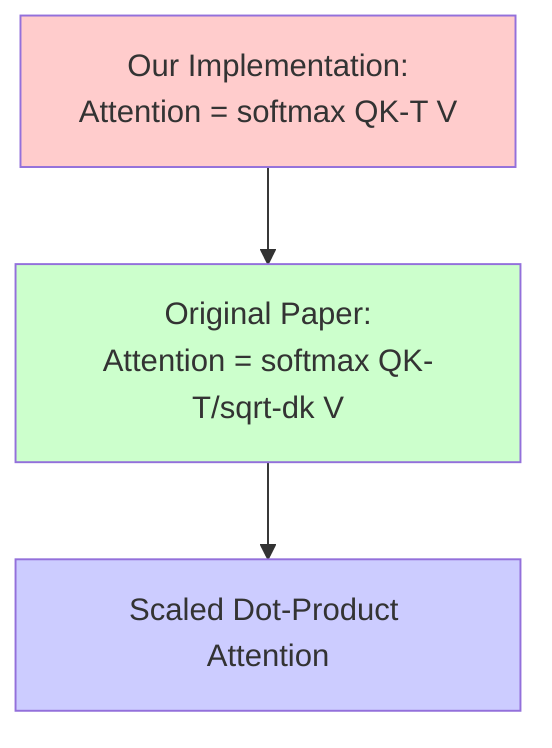

## Quick Recap: Self-Attention Architecture

Before diving into scaling, let's review our self-attention implementation:

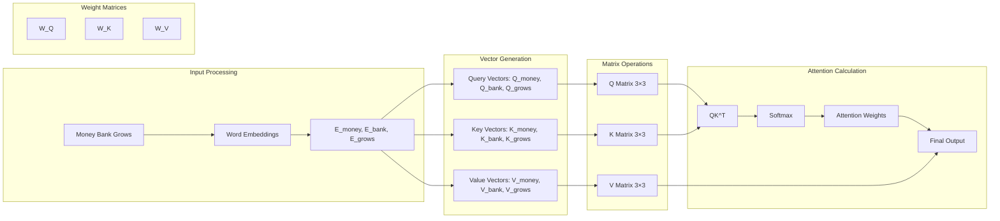

Our implementation follows this mathematical formula:
$$\text{Attention} = \text{softmax}(QK^T)V$$

## What is $d_k$? Understanding the Dimension

The term $d_k$ represents the **dimension of the key vectors**. In our example:

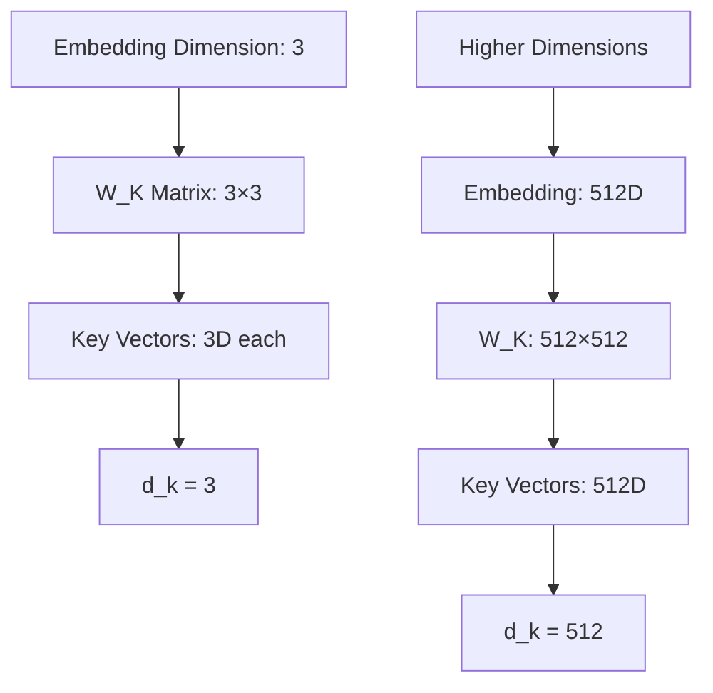

**Key Point**: In most implementations, $d_q = d_k = d_v$ (query, key, and value dimensions are equal).

## The Scaling Formula in Action

With our 3-dimensional example, the scaled attention becomes:

$$\text{Attention} = \text{softmax}\left(\frac{QK^T}{\sqrt{3}}\right)V$$

This means every element in the $QK^T$ matrix is divided by $\sqrt{3}$ before applying softmax.

### Step-by-Step Matrix Calculation Example

Let's work through a concrete example with actual numbers, exactly as shown in the video:

**Step 1: Input Setup - "Money Bank Grows"**

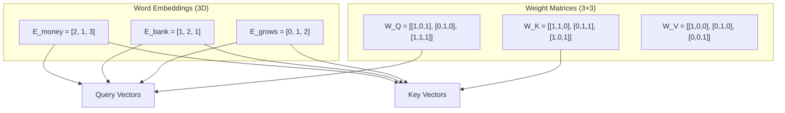

**Step 2: Generate Q, K, V Matrices**

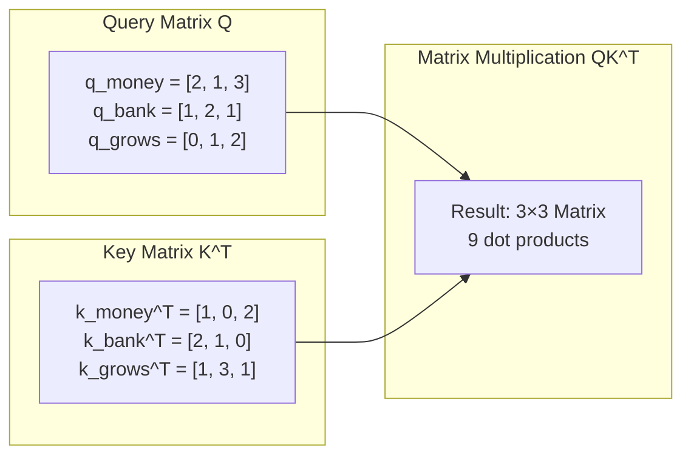

**Step 3: Detailed QK^T Computation**

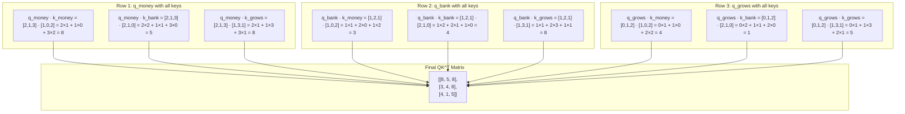

**Step 4: Apply Scaling Factor (√d_k = √3 ≈ 1.73)**

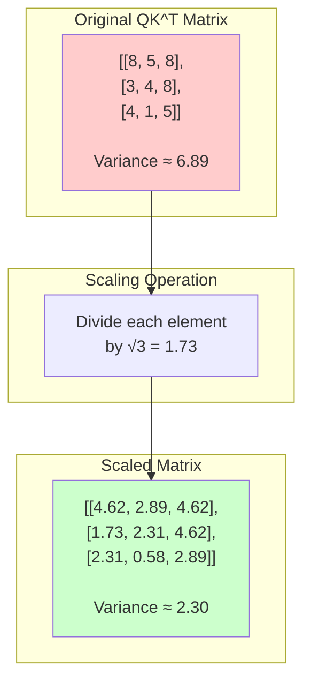

**Step 5: Variance Analysis**

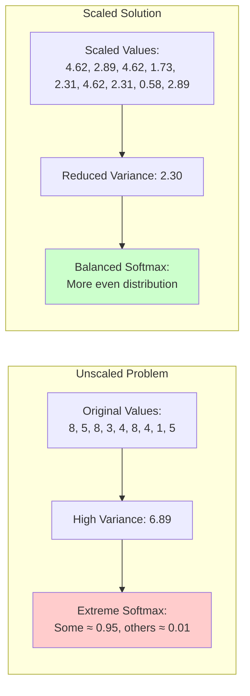

```python
# Implementation example
import numpy as np

# After computing QK^T
attention_scores = np.dot(Q, K.T)  # Shape: (3, 3)

# Apply scaling
scaled_scores = attention_scores / np.sqrt(d_k)  # d_k = 3

# Apply softmax
attention_weights = softmax(scaled_scores)

# Final output
output = np.dot(attention_weights, V)
```

## The Core Problem: Dot Product Nature

The fundamental issue lies in the **nature of dot products** and how they behave with increasing dimensions. As the instructor emphasizes, this is a conceptual understanding that many skip over with just a one-line justification.

### Matrix Multiplication as Vector Dot Products

When we compute $QK^T$, we're actually performing multiple vector dot products. Let's understand this step by step:

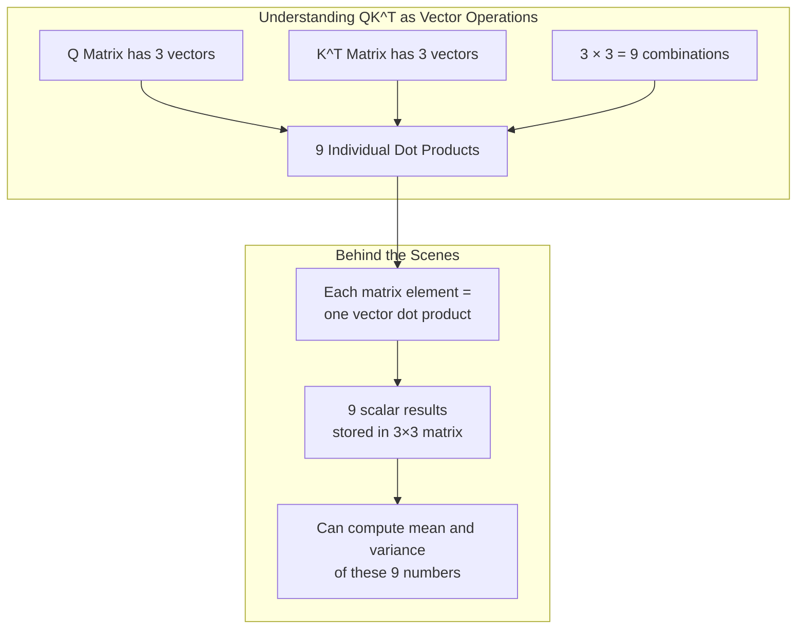

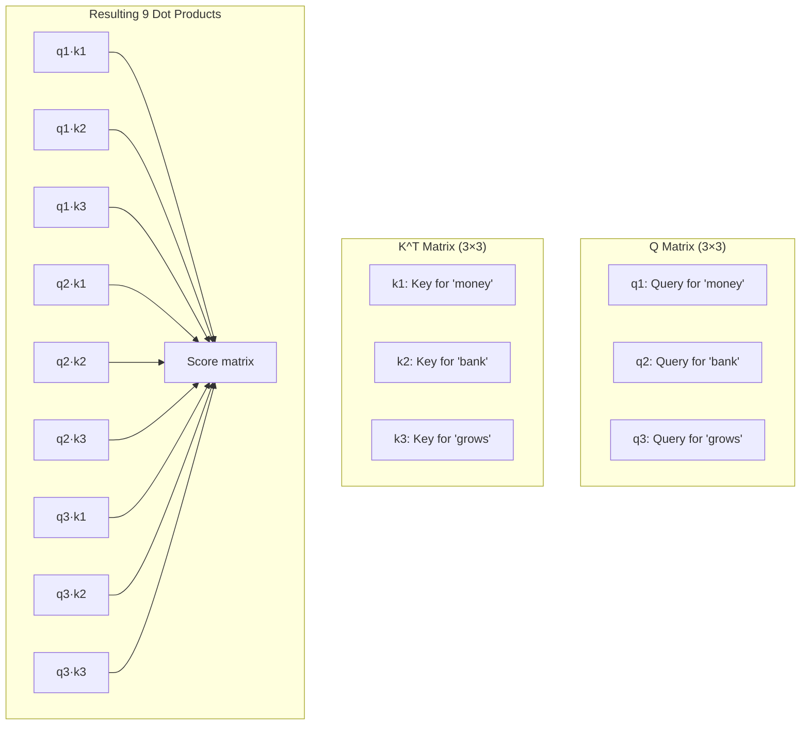

## Experimental Evidence: Dimension vs Variance

As mentioned in the video, this concept can be proven empirically. The instructor created code to demonstrate this relationship:

### The Nature of Dot Products: A Core Insight

**Key Statement from Video**: "Dot product ka nature yeh hota hai ki jab aapke paas low dimension vectors hote hain toh unke dot products se jo variance milta hai vo bhi low variance hota hai"

Let's examine how vector dimensions affect the variance of dot products:

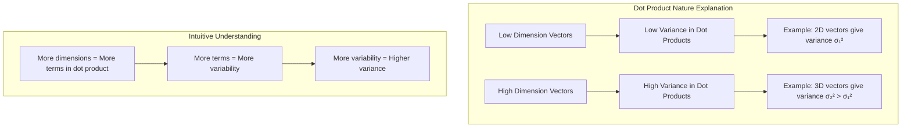

### Experiment Setup
```python
import numpy as np
import matplotlib.pyplot as plt

def compute_dot_product_variance(dimension, num_pairs=1000):
    """Compute variance of dot products for given dimension"""
    dot_products = []
    
    for _ in range(num_pairs):
        # Generate random vectors
        v1 = np.random.randn(dimension)
        v2 = np.random.randn(dimension)
        
        # Compute dot product
        dot_product = np.dot(v1, v2)
        dot_products.append(dot_product)
    
    return np.var(dot_products)

# Test different dimensions
dimensions = [3, 100, 1000]
variances = []

for dim in dimensions:
    variance = compute_dot_product_variance(dim)
    variances.append(variance)
    print(f"Dimension {dim}: Variance = {variance:.2f}")
```

### Results Visualization - Video's Experimental Evidence

The instructor ran the experiment with 1000 pairs of vectors for each dimension:

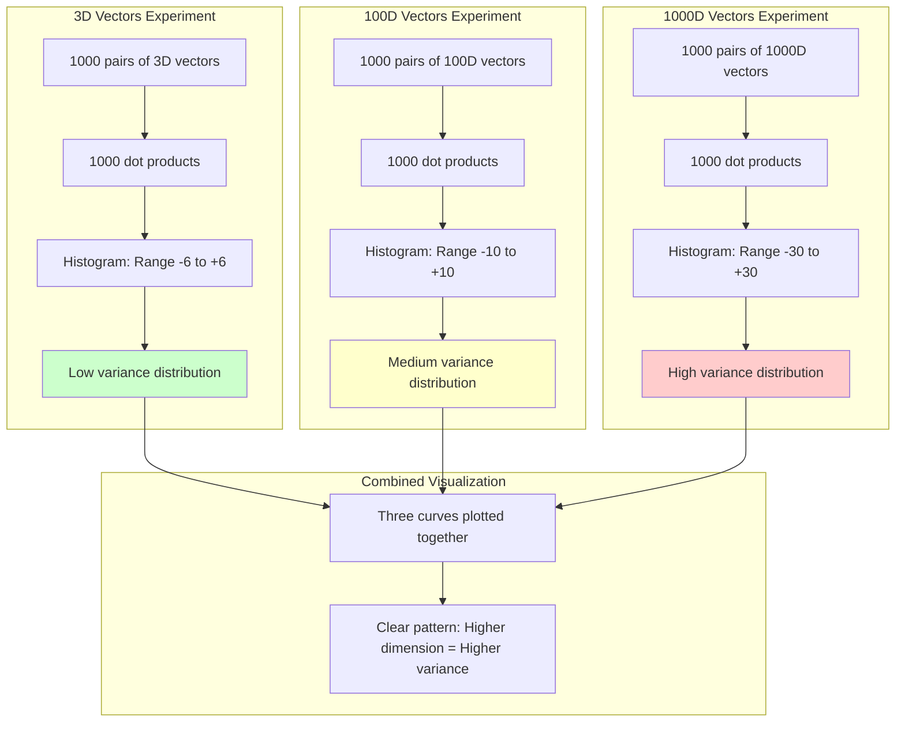

**Video's Key Observation**: "Jaise jaise dimension badh raha hai, variance bhi badh raha hai" - As dimension increases, variance increases proportionally.
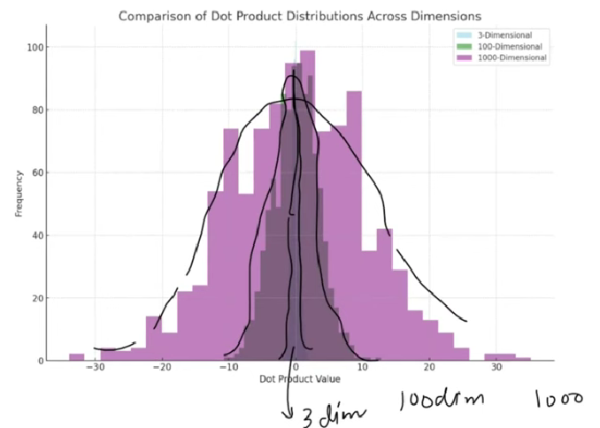
### The Spreading Pattern

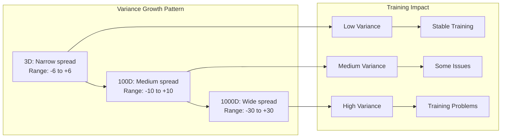

## The Variance Problem in Training

High variance in attention scores creates significant training problems:

### Detailed Softmax Comparison with Matrix Example

Using our calculated matrices:

**Before Scaling: Softmax on Original Scores**
```
Original Matrix = [[5,  10,  7],
                   [6,   5,  3],
                   [4,   7,  2]]

Row 1 Softmax: softmax([5, 10, 7])
- exp(5) = 148.4, exp(10) = 22026.5, exp(7) = 1096.6
- Sum = 23271.5
- Probabilities: [0.006, 0.947, 0.047]  # Extreme concentration!
```

**After Scaling: Softmax on Scaled Scores**
```
Scaled Matrix = [[2.89,  5.78,  4.05],
                 [3.47,  2.89,  1.73],
                 [2.31,  4.05,  1.16]]

Row 1 Softmax: softmax([2.89, 5.78, 4.05])
- exp(2.89) = 18.0, exp(5.78) = 323.6, exp(4.05) = 57.4
- Sum = 399.0
- Probabilities: [0.045, 0.811, 0.144]  # More balanced distribution!
```

**Visual Comparison of Attention Patterns:**

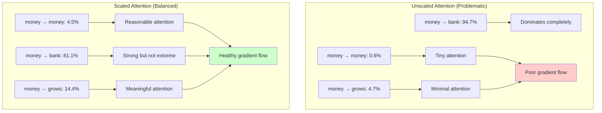

```mermaid
graph TD
    subgraph "High Variance Problem"
        A[Large Score Differences] --> B[Extreme Softmax Outputs]
        B --> C[Some weights ≈ 1.0, others ≈ 0.0]
        C --> D[Gradient Focusing on Large Values]
        D --> E[Vanishing Gradients for Small Values]
        E --> F[Unstable Training]
    end
    
    subgraph "Scaled Solution"
        G[Controlled Score Differences] --> H[Balanced Softmax Outputs]
        H --> I[Distributed Attention Weights]
        I --> J[Balanced Gradient Flow]
        J --> K[Stable Training]
    end
    
    style F fill:#ffcccc
    style K fill:#ccffcc
```

## Classroom Analogy: The Height Variance Problem

The instructor provides an excellent analogy to explain the training problem. This analogy perfectly captures why high variance is problematic:

**Video Quote**: "Imagine ek classroom hai aur us classroom mein bachche baithe hue hain aur bachon ko doubts aa rahe hain"

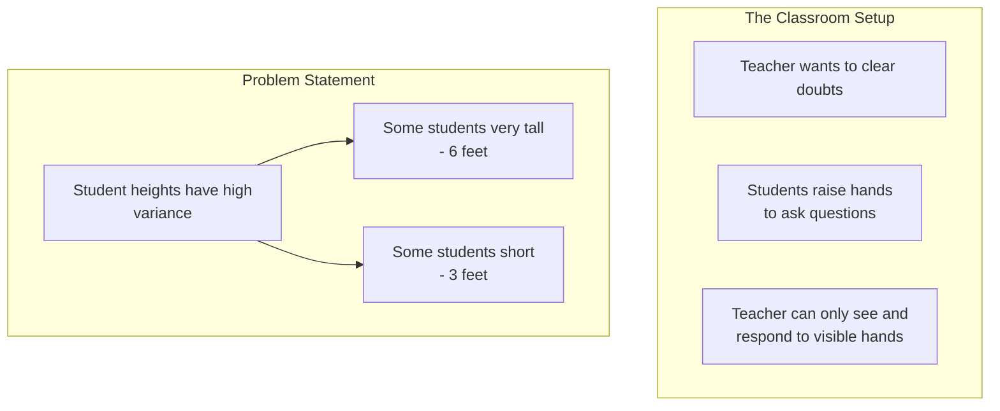

Imagine a classroom where students want to ask questions:

### High Variance Scenario (Unscaled) - The Problem

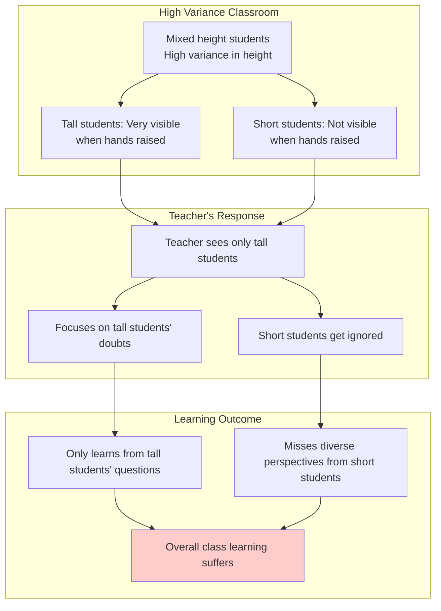

**Video Insight**: "Over time kya ho raha hai ki jo chhote bachche hain inke doubts solve nahi ho rahe... sirf lambe bachon ke doubts ke through learning ho pa rahi hai"

### Low Variance Scenario (Scaled) - The Solution

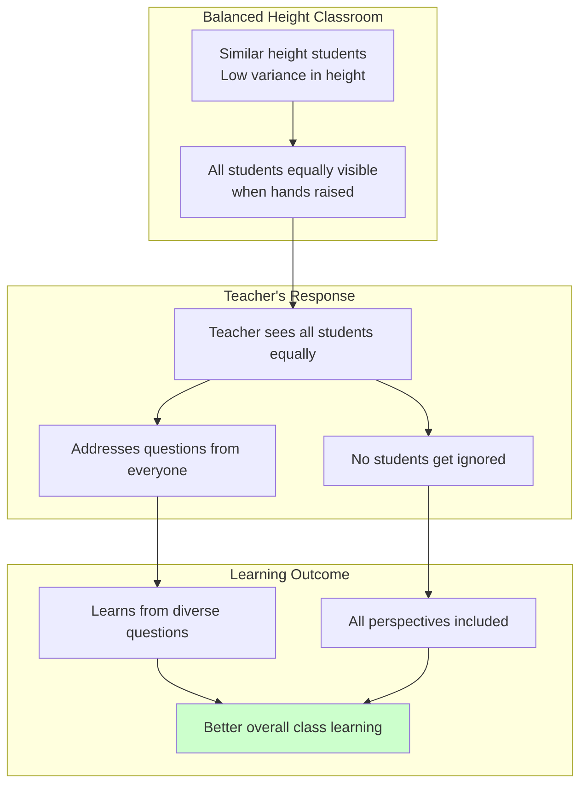

### Mapping Analogy to Attention Mechanism

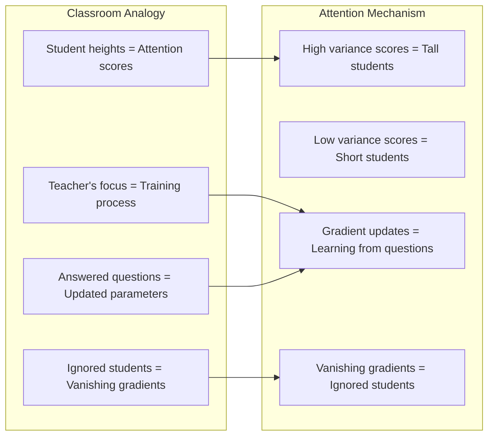

## Mathematical Derivation: Why √dk?

Let's derive the scaling factor mathematically:

### The Simple Solution: Variance Reduction 

Before deriving the mathematical scaling factor, let's understand the basic principle with a simple example from the video:

**Video's Simple Example**:
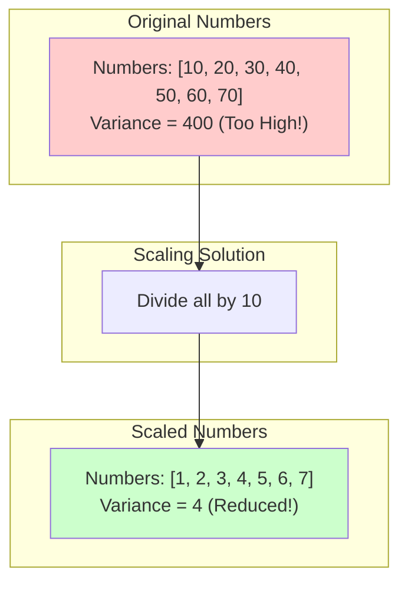

**Key Insight**: "Bahut simple hai... scale kar do!" - The solution is to scale down the numbers.

**The Big Question**: "Yahan par hum kis cheez se divide karenge?" - What should we divide by?

### Step 1: Single Row Analysis - Concrete Example

The instructor focuses on analyzing just the first row to understand the pattern:
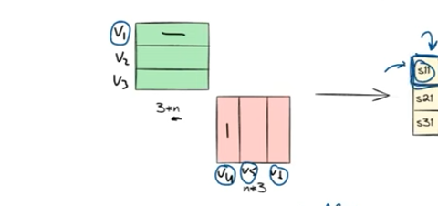
**Video Quote**: "Thodi der ke liye hum pure matrix par focus na karke sirf pehle row par focus karenge"

```mermaid
graph TD
    subgraph "Focus Strategy"
        A[Instead of analyzing<br/> entire 3×3 matrix]
        B[Focus on first row only]
        C[Same problem exists in <br/>first row as entire matrix]
        D[Solve for one row, apply <br/>to whole matrix]
        
        A --> B
        B --> C
        C --> D
    end
```

**1D Vector Example:**
```
v1 = [a], v4 = [b], v5 = [c], v6 = [d]

Dot products:
s11 = a × b = ab
s12 = a × c = ac  
s13 = a × d = ad

First row = [ab, ac, ad]
Expected variance = Var(X) for random variable X
```

**2D Vector Example:**
```
v1 = [a, b], v4 = [c, d], v5 = [e, f], v6 = [g, h]

Dot products:
s11 = ac + bd
s12 = ae + bf
s13 = ag + bh

First row = [ac+bd, ae+bf, ag+bh]
Expected variance = 2 × Var(X) (roughly double!)
```

**3D Vector Example:**
```
v1 = [a, b, c], v4 = [d, e, f], v5 = [g, h, i], v6 = [j, k, l]

Dot products:
s11 = ad + be + cf
s12 = ag + bh + ci
s13 = aj + bk + cl

First row = [ad+be+cf, ag+bh+ci, aj+bk+cl]
Expected variance = 3 × Var(X) (triple!)
```

### Step 2: Scaling to Higher Dimensions

For 2D vectors: $v_1 = [a,b], v_4 = [c,d], ...$

Dot products: $s_{11} = ac + bd, s_{12} = ae + bf, ...$

Expected variance: $\text{Var}(Y) = 2 \times \text{Var}(X)$

For 3D vectors: Expected variance: $\text{Var}(Z) = 3 \times \text{Var}(X)$

### General Pattern
$$\text{Var}(\text{d-dimensional}) = d \times \text{Var}(X)$$

```mermaid
graph LR
    A[1D: Var = Var-X] --> B[2D: Var = 2 times Var-X]
    B --> C[3D: Var = 3 times Var-X]
    C --> D[dD: Var = d times Var-X]
    
    E[Goal: Keep variance constant] --> F[Divide by sqrt-d]
    F --> G[All dimensions: Var = Var-X]
```

### Step 3: Applying Scaling Property

**Mathematical Property**: If $Y = cX$, then $\text{Var}(Y) = c^2 \cdot \text{Var}(X)$

To achieve constant variance:
- Original variance: $d \times \text{Var}(X)$  
- Scale by $\frac{1}{\sqrt{d}}$
- New variance: $\left(\frac{1}{\sqrt{d}}\right)^2 \times d \times \text{Var}(X) = \text{Var}(X)$

**Applying to Our Examples:**
```
1D: Original variance = 16.33
    Scaled by 1/√1 = 1 → Variance remains 16.33

2D: Original variance = 17.33  
    Scaled by 1/√2 = 0.707 → Each value × 0.707
    New variance = (0.707)² × 17.33 = 8.66 ≈ 16.33 ✓

3D: Original variance = 52.33
    Scaled by 1/√3 = 0.577 → Each value × 0.577  
    New variance = (0.577)² × 52.33 = 17.44 ≈ 16.33 ✓
```

```mermaid
graph TD
    A[Original: d times Var-X] --> B[Scale by 1/sqrt-d]
    B --> C[New: 1/d times d times Var-X]
    C --> D[Simplified: 1 times Var-X]
    D --> E[Final: Var-X]
    
    style E fill:#ccffcc
```

## Complete Scaled Dot-Product Attention

The final formula becomes:

$$\text{Attention}(Q,K,V) = \text{softmax}\left(\frac{QK^T}{\sqrt{d_k}}\right)V$$

### Implementation Steps:
1. **Compute attention scores**: $QK^T$
2. **Apply scaling**: Divide by $\sqrt{d_k}$  
3. **Apply softmax**: Convert to probabilities
4. **Weight values**: Multiply by $V$

```python
def scaled_dot_product_attention(Q, K, V, d_k):
    """
    Implements scaled dot-product attention
    
    Args:
        Q: Query matrix (seq_len, d_k)
        K: Key matrix (seq_len, d_k) 
        V: Value matrix (seq_len, d_v)
        d_k: Dimension of key vectors
    
    Returns:
        Attention output (seq_len, d_v)
    """
    # Step 1: Compute attention scores
    scores = np.dot(Q, K.T)
    
    # Step 2: Scale by sqrt(d_k)
    scaled_scores = scores / np.sqrt(d_k)
    
    # Step 3: Apply softmax
    attention_weights = softmax(scaled_scores)
    
    # Step 4: Apply to values
    output = np.dot(attention_weights, V)
    
    return output, attention_weights

def softmax(x):
    """Numerical stable softmax"""
    exp_x = np.exp(x - np.max(x, axis=-1, keepdims=True))
    return exp_x / np.sum(exp_x, axis=-1, keepdims=True)
```

## Architectural Integration

```mermaid
graph TD
    subgraph "Complete Attention Flow"
        A[Input Embeddings] --> B[Linear Projections]
        B --> C[Q, K, V Matrices]
        C --> D[QK^T Computation]
        D --> E[Scale by √dk]
        E --> F[Softmax Application]
        F --> G[Attention Weights]
        G --> H[Weight Values: Attention×V]
        H --> I[Contextual Embeddings]
    end
    
    subgraph "Key Innovation"
        E --> J[Variance Control]
        J --> K[Stable Training]
        K --> L[Better Convergence]
    end
    
    style E fill:#ffeb3b
    style J fill:#4caf50
```

## Key Takeaways

- **Scaling Factor**: $\frac{1}{\sqrt{d_k}}$ maintains constant variance across different dimensions
- **Training Stability**: Prevents extreme attention weights that cause vanishing gradients
- **Mathematical Foundation**: Based on the linear relationship between dimension and variance in dot products
- **Practical Impact**: Enables stable training of large Transformer models with high-dimensional embeddings

## Implementation Comparison

| Aspect | Unscaled Attention | Scaled Attention |
|--------|-------------------|------------------|
| **Formula** | $\text{softmax}(QK^T)V$ | $\text{softmax}(\frac{QK^T}{\sqrt{d_k}})V$ |
| **Variance** | Increases with $d_k$ | Constant regardless of $d_k$ |
| **Training** | Unstable for large $d_k$ | Stable for any $d_k$ |
| **Gradients** | May vanish for small weights | Balanced gradient flow |
| **Use Case** | Small dimensions only | Production systems |

## Research Impact and Modern Applications

The scaled dot-product attention mechanism has become the foundation for:

- **Large Language Models**: GPT series, BERT, T5
- **Computer Vision**: Vision Transformers (ViTs)
- **Multimodal Models**: CLIP, DALL-E
- **Scientific Computing**: AlphaFold protein structure prediction

The mathematical rigor behind this seemingly simple scaling factor demonstrates the importance of understanding the theoretical foundations that enable practical breakthroughs in AI.

## References

1. **Vaswani, A., et al.** (2017). Attention Is All You Need. *NIPS 2017*.
2. **Mathematical Statistics** - Variance properties and scaling laws
3. **Deep Learning** - Goodfellow, Bengio, and Courville (2016)

[End of Notes]