# Day 76: Why is Self-Attention Called "Self"? - Self-Attention vs Luong Attention

## Paper References
- **Attention Is All You Need** - Vaswani et al., 2017
  - [Original Paper](https://arxiv.org/abs/1706.03762)
  - Introduces the self-attention mechanism in Transformers
- **Effective Approaches to Attention-based Neural Machine Translation** - Luong et al., 2015
  - [Original Paper](https://arxiv.org/abs/1508.04025)
  - Describes Luong attention mechanism
- **Neural Machine Translation by Jointly Learning to Align and Translate** - Bahdanau et al., 2014
  - [Original Paper](https://arxiv.org/abs/1409.0473)
  - Introduces attention mechanism in NMT

## Introduction: The Essential Question

Today's video addresses a fundamental yet often overlooked question: Why is self-attention called "self"? This isn't just academic curiosity - it's a crucial interview question and a gateway to deeply understanding the attention mechanism family. The instructor emphasizes that before diving into transformer architecture, we must sharpen our understanding of self-attention, just as one would sharpen an axe for four hours before spending two hours cutting a tree.

**Learning Journey**: We'll first understand why self-attention qualifies as an attention mechanism despite looking quite different from Bahdanau or Luong attention, then explore what makes it "self" attention specifically.

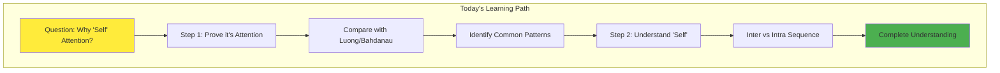

## The Attention Mechanism Recap: Setting the Foundation

Before comparing self-attention with traditional attention, let's refresh our understanding of how attention mechanisms emerged and why they were needed.

**Video Context**: "Thoda sa hum log peeche jaate hain aur ek recap lete hain attention mechanism ka"

### The Original Problem: Sequence-to-Sequence Translation

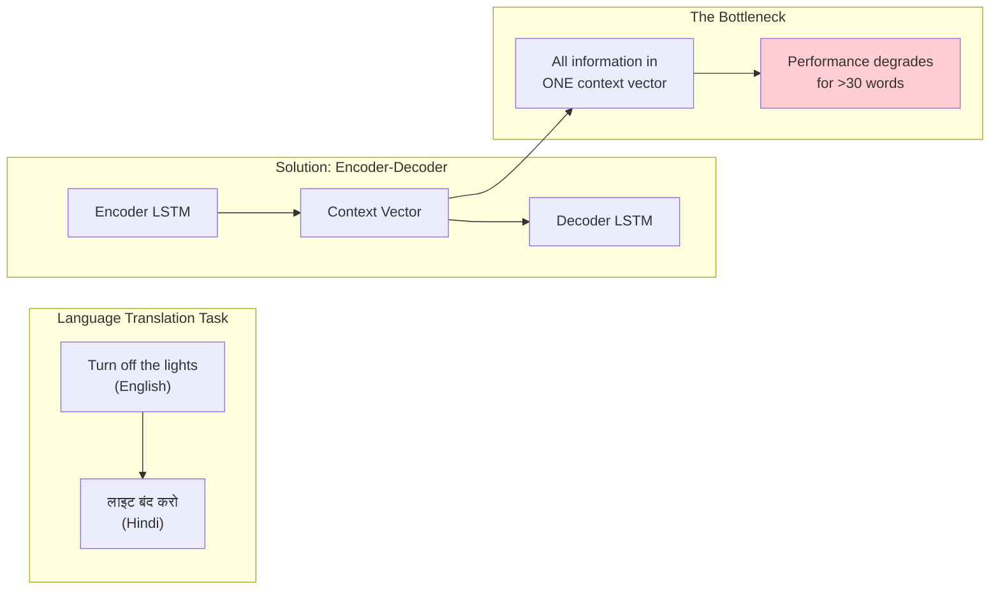

### Traditional Encoder-Decoder Architecture

The original encoder-decoder architecture processes input sequences word by word, maintaining hidden states at each timestep:

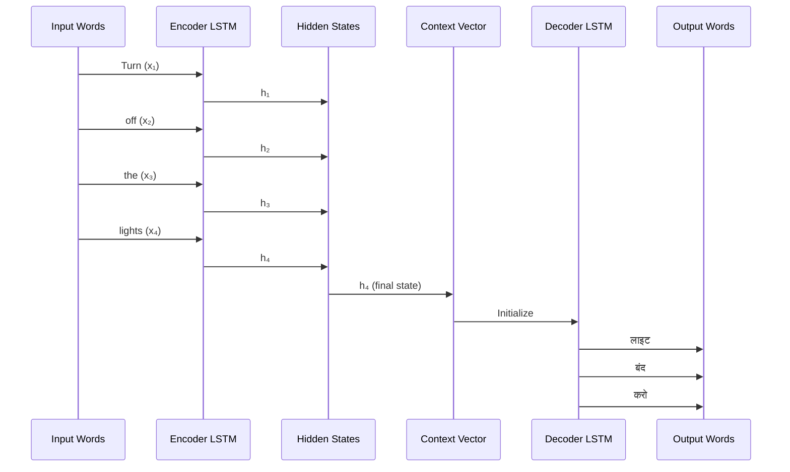

**The Critical Limitation**: The entire input sentence must be compressed into a single context vector (h₄), creating an information bottleneck.

## The Attention Solution: Multiple Context Vectors

Attention mechanism revolutionized this by introducing a key insight: instead of one context vector for all decoder timesteps, create a unique context vector for each output word.

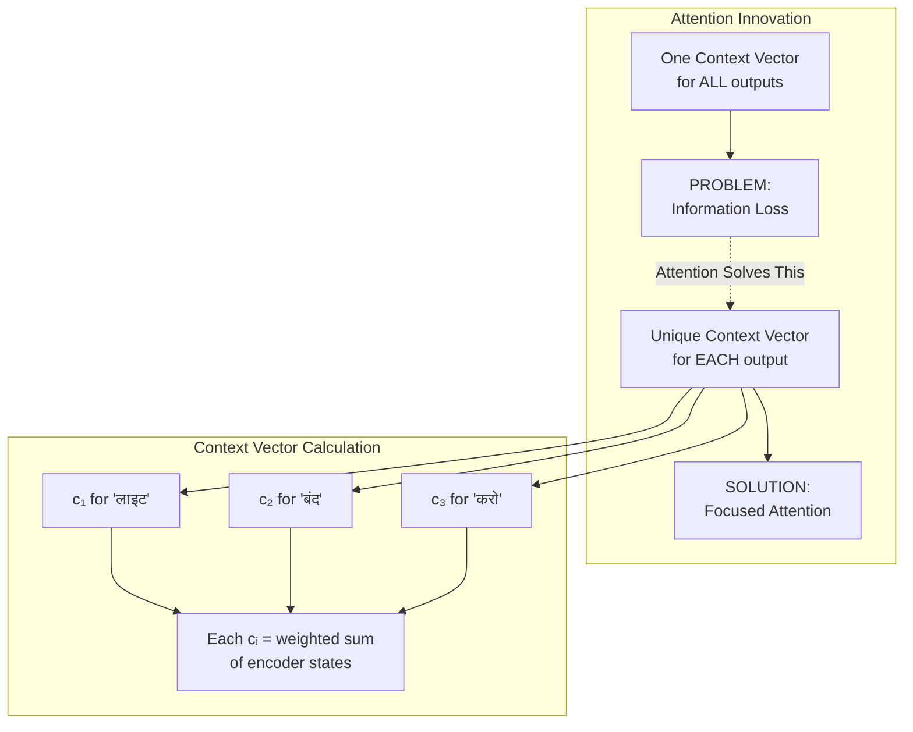

### The Attention Formula: Three Key Equations

**Video Explanation**: "Teen equations se milkar ke hamara Luong bana hai"

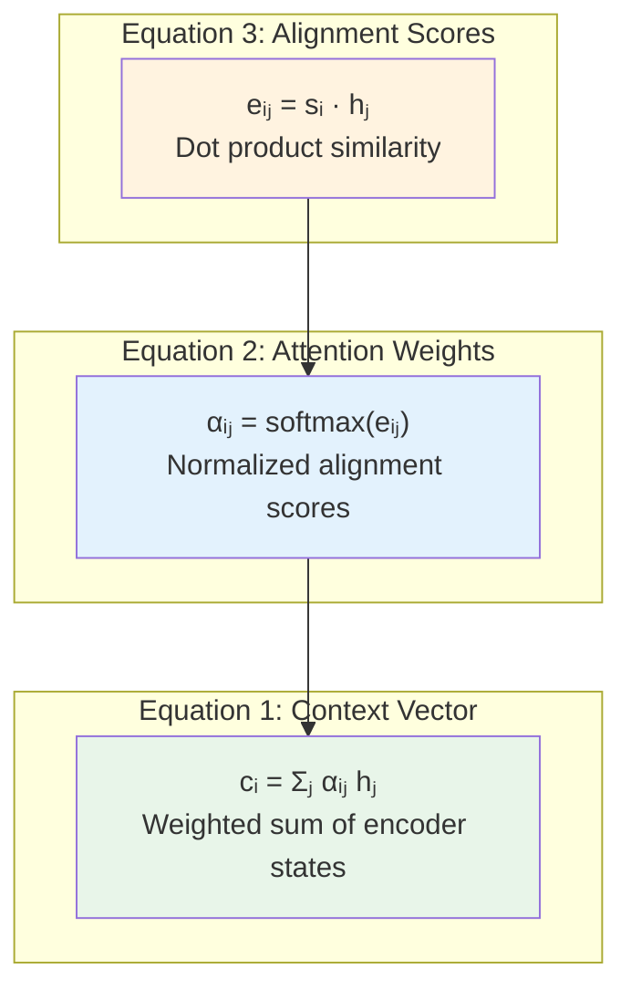

Let's break down each equation with concrete examples:

**1. Alignment Score Calculation (eᵢⱼ)**:
```
e₁₁ = s₁ · h₁  (How relevant is 'Turn' for generating 'लाइट'?)
e₁₂ = s₁ · h₂  (How relevant is 'off' for generating 'लाइट'?)
e₁₃ = s₁ · h₃  (How relevant is 'the' for generating 'लाइट'?)
e₁₄ = s₁ · h₄  (How relevant is 'lights' for generating 'लाइट'?)
```

**2. Attention Weights (αᵢⱼ)**:
```
[α₁₁, α₁₂, α₁₃, α₁₄] = softmax([e₁₁, e₁₂, e₁₃, e₁₄])
Example: [0.1, 0.1, 0.1, 0.7] - 'lights' gets 70% attention
```

**3. Context Vector (c₁)**:
```
c₁ = 0.1×h₁ + 0.1×h₂ + 0.1×h₃ + 0.7×h₄
```

## Bridging to Self-Attention: The Conceptual Parallel

Now comes the crucial insight - let's see how self-attention follows the exact same mathematical pattern, just in a different setting.

**Video Quote**: "Main is poore process ko side by side compare karke dikhaunga... aap notice karoge ki dono bahut similar hai"

### Self-Attention Setup: No Encoder-Decoder Split

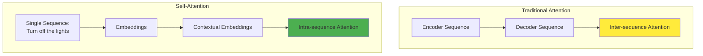

### The Three Vectors: Q, K, V

In self-attention, we transform each word embedding into three vectors:

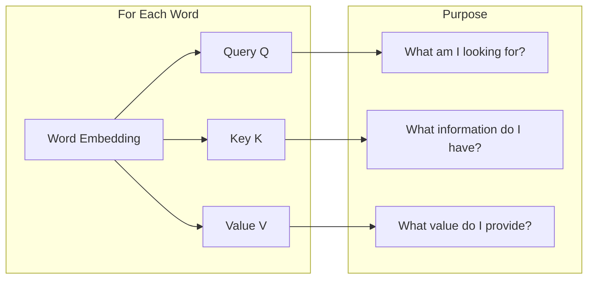

## The Mathematical Parallel: Side-by-Side Comparison

Let's align the mathematical operations of Luong attention and self-attention to see their fundamental similarity.

**Video Setup**: "Main ek tarike se is poori cheez ko likhta hoon jisse everything will make sense"

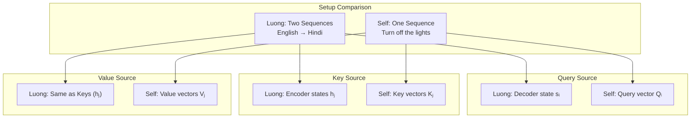

### Generating Contextual Embedding for "Turn"

Let's trace through the self-attention process for the first word "Turn":

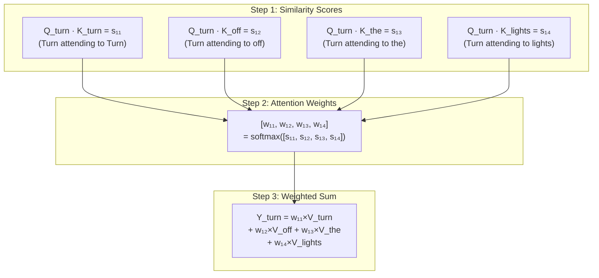

**The Parallel Formula**:
```
Luong:         cᵢ = Σⱼ αᵢⱼ × hⱼ
Self-Attention: Yᵢ = Σⱼ wᵢⱼ × Vⱼ
```

### Visual Alignment of Operations

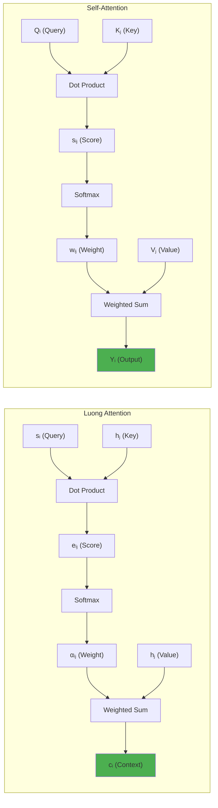

**Key Insight**: The mathematical operations are identical - only the source and purpose of the vectors differ!

## Why "Self"? The Core Distinction

Now we arrive at the heart of the matter - what makes self-attention "self"?

**Video Revelation**: "Aapka idhar jo sentence hai aur idhar jo sentence hai, yeh dono same hi toh hai!"

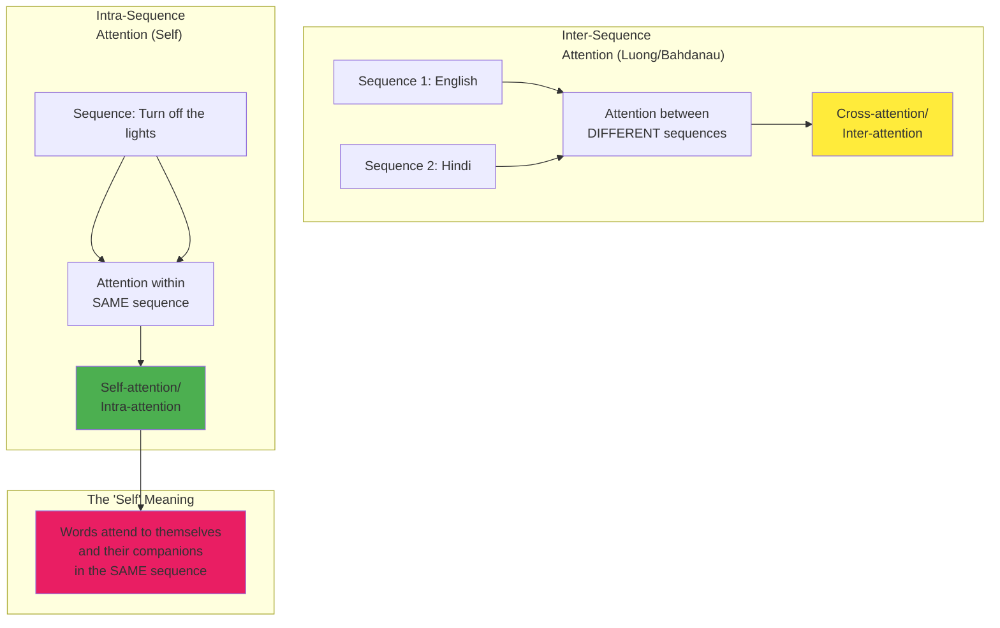

### Concrete Example: Word Relationships

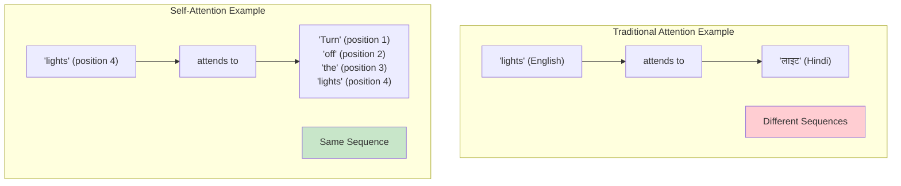

## Implementation: Demonstrating the Mathematical Equivalence

Let's implement both mechanisms to show their mathematical similarity:

```python
import numpy as np

def luong_attention(decoder_state, encoder_states):
    """
    Luong attention mechanism
    decoder_state: Current decoder hidden state (query)
    encoder_states: All encoder hidden states (keys & values)
    """
    # Step 1: Calculate alignment scores (dot product)
    scores = np.dot(encoder_states, decoder_state)
    
    # Step 2: Apply softmax to get attention weights
    weights = np.exp(scores) / np.sum(np.exp(scores))
    
    # Step 3: Calculate context vector (weighted sum)
    context = np.sum(weights[:, np.newaxis] * encoder_states, axis=0)
    
    return context, weights

def self_attention(query, keys, values):
    """
    Self-attention mechanism
    query: Query vector for current position
    keys: Key vectors for all positions
    values: Value vectors for all positions
    """
    # Step 1: Calculate similarity scores (dot product)
    scores = np.dot(keys, query)
    
    # Step 2: Apply softmax to get attention weights
    weights = np.exp(scores) / np.sum(np.exp(scores))
    
    # Step 3: Calculate output (weighted sum)
    output = np.sum(weights[:, np.newaxis] * values, axis=0)
    
    return output, weights

# Example usage showing mathematical equivalence
hidden_dim = 4
seq_len = 4

# Luong attention setup
decoder_state = np.random.randn(hidden_dim)  # s₁
encoder_states = np.random.randn(seq_len, hidden_dim)  # [h₁, h₂, h₃, h₄]

# Self-attention setup (for one position)
Q = np.random.randn(hidden_dim)  # Q_turn
K = np.random.randn(seq_len, hidden_dim)  # [K_turn, K_off, K_the, K_lights]
V = np.random.randn(seq_len, hidden_dim)  # [V_turn, V_off, V_the, V_lights]

# Compare outputs
luong_output, luong_weights = luong_attention(decoder_state, encoder_states)
self_output, self_weights = self_attention(Q, K, V)

print("Luong attention weights shape:", luong_weights.shape)
print("Self-attention weights shape:", self_weights.shape)
print("\nBoth use the same mathematical operations!")
```

## The Complete Picture: Attention Family Tree

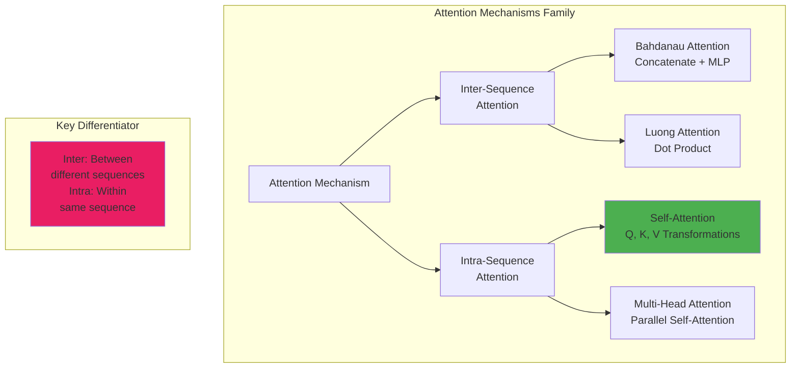

## Visual Summary: The Three Operations

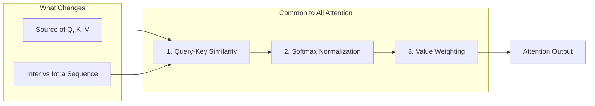

## Key Takeaways

- **Self-Attention IS Attention**: It uses the exact same mathematical operations (dot product, softmax, weighted sum) as traditional attention mechanisms

- **The "Self" Distinction**: While Luong/Bahdanau attention operates between two different sequences (encoder-decoder), self-attention operates within a single sequence

- **Mathematical Equivalence**:
  - Luong: `cᵢ = Σⱼ softmax(sᵢ·hⱼ) × hⱼ`
  - Self: `Yᵢ = Σⱼ softmax(Qᵢ·Kⱼ) × Vⱼ`

- **Conceptual Mapping**:
  - Decoder states (s) → Query vectors (Q)
  - Encoder states (h) → Key vectors (K) and Value vectors (V)
  - Context vector (c) → Contextual embedding (Y)

- **Interview Insight**: When asked "Why is it called self-attention?", the answer is: "Because unlike traditional attention that aligns between two different sequences, self-attention computes alignment scores within the same sequence - words attend to themselves and other words in their own sentence."

## Research Impact

The introduction of self-attention revolutionized NLP by:

1. **Removing Sequential Dependencies**: Unlike RNNs, all positions can be processed in parallel
2. **Capturing Long-Range Dependencies**: Direct connections between any two positions
3. **Computational Efficiency**: Parallel processing enables faster training
4. **Foundation for Transformers**: Self-attention became the building block for the transformer revolution

## References

1. **Vaswani, A., et al.** (2017). Attention Is All You Need. *NIPS 2017*.
2. **Luong, M., et al.** (2015). Effective Approaches to Attention-based Neural Machine Translation. *EMNLP 2015*.
3. **Bahdanau, D., et al.** (2014). Neural Machine Translation by Jointly Learning to Align and Translate. *ICLR 2015*.

[End of Notes]