# Multi-head Attention in Transformers: Capturing Multiple Perspectives

## Paper References and Context

**Original Research Papers:**
- "Attention Is All You Need" (Vaswani et al., 2017) - [arXiv:1706.03762](https://arxiv.org/abs/1706.03762)

**Video Context:** This video builds upon the foundation of self-attention mechanism to introduce multi-head attention, a crucial component that enables Transformers to capture multiple perspectives and relationships within text simultaneously.

**Learning Journey:** By the end of this comprehensive walkthrough, you will understand why single self-attention heads are limited, how multi-head attention overcomes these limitations, and how the mechanism works both conceptually and mathematically in the original Transformer architecture.

**Connection to Broader Concepts:** Multi-head attention forms the backbone of modern transformer architectures including BERT, GPT, and other state-of-the-art language models, making it essential for understanding contemporary NLP systems.

---

## Self-Attention Recap: From Static to Contextual Embeddings

Before diving into multi-head attention, let's establish the foundation with self-attention. **Self-attention is a technique for generating contextual embeddings** that can capture the meaning of words based on their surrounding context.

### The Evolution from Static to Contextual Representations

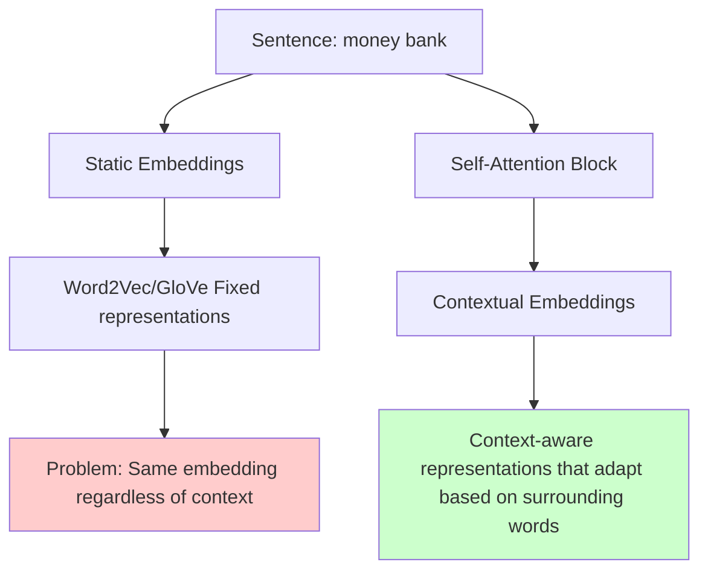

**The Core Problem with Static Embeddings:**
Consider the word "bank" in these contexts:
- "money bank" (financial institution)
- "river bank" (riverbank)

Traditional embeddings assign the same numerical representation to "bank" regardless of context, missing crucial semantic differences.

### Self-Attention Architecture Deep Dive

Self-attention solves this by generating three types of vectors for each word:

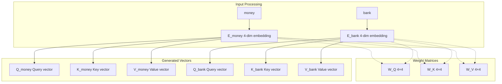

**Step-by-Step Self-Attention Process:**

1. **Linear Projections:** Each word embedding is multiplied with three learned weight matrices (W_Q, W_K, W_V)
2. **Attention Score Calculation:** 
   ```
   Score = Q_money · K_bank (dot product)
   Scaled_Score = Score / √(d_k)
   ```
3. **Normalization:** Apply softmax to get attention weights
4. **Weighted Combination:** Multiply attention weights with value vectors

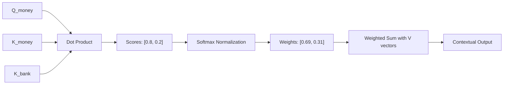

## The Core Problem with Single Self-Attention: Limited Perspective Capture

### Ambiguous Sentence Analysis

Consider this deliberately ambiguous sentence:
**"The man saw the astronomer with a telescope"**

This sentence has two distinct interpretations:

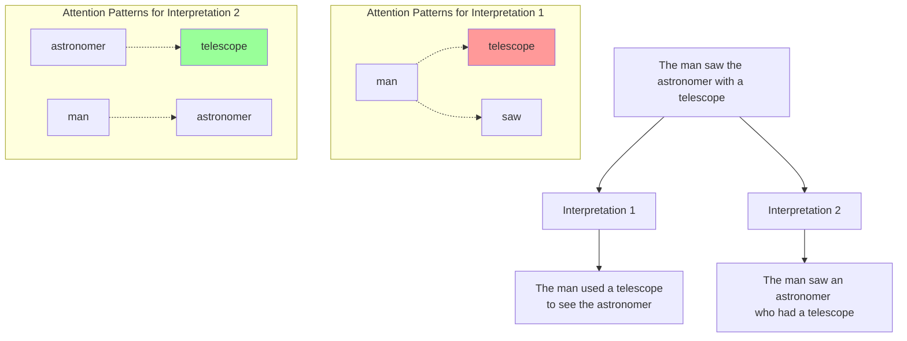

**The Single Self-Attention Limitation:**

Self-attention generates only **one similarity table** for the entire sentence. It can capture either:
- Strong similarity between "man" and "telescope" (Interpretation 1), OR
- Strong similarity between "astronomer" and "telescope" (Interpretation 2)

But it **cannot capture both perspectives simultaneously**.

### Real-World Impact: Document Summarization Example

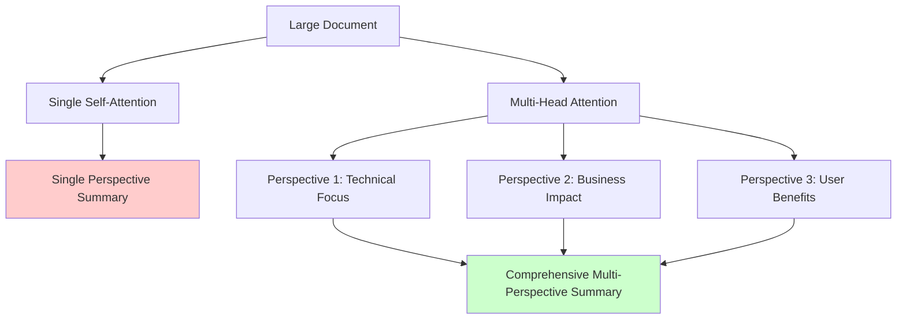

**Why This Matters:**
- **Document Summarization:** Different readers need different perspectives
- **Question Answering:** Complex queries may require multiple reasoning paths  
- **Machine Translation:** Ambiguous phrases need multiple interpretation strategies
- **Sentiment Analysis:** Mixed sentiments require nuanced understanding

## Multi-Head Attention: The Elegant Solution

Multi-head attention provides a deceptively simple solution: **"What if we use multiple self-attention modules in parallel?"**

Since we're using more than one self-attention head, we call it **multi-head attention**, where each individual self-attention block is called a "head."

### Conceptual Architecture Comparison

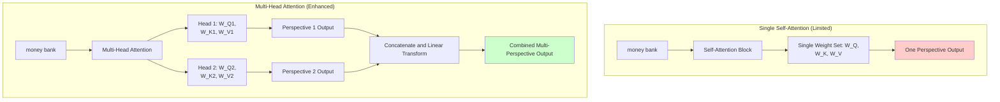

### Detailed Multi-Head Processing Flow

**Step 1: Multiple Weight Matrix Sets**

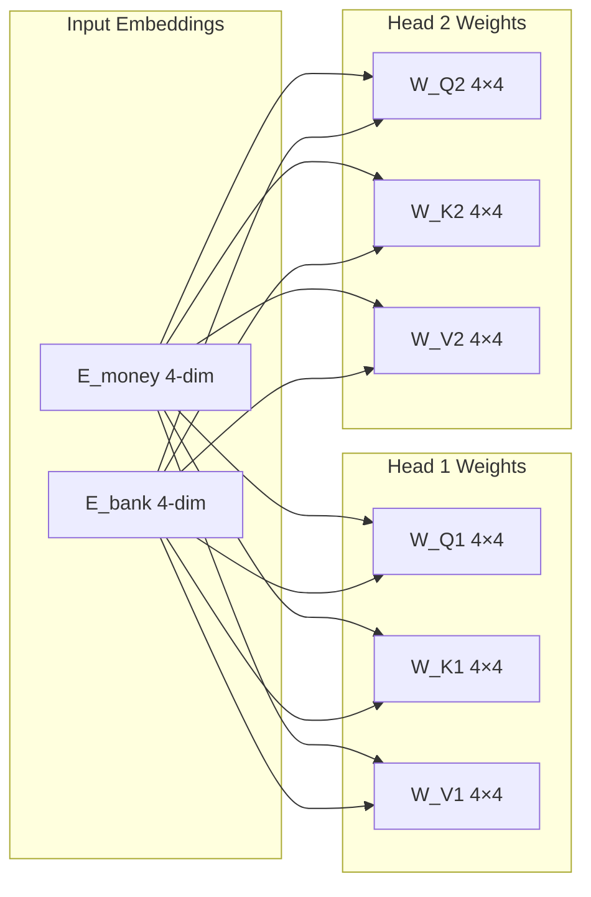

**Step 2: Parallel Vector Generation**

Each word now generates **multiple sets** of query, key, and value vectors:

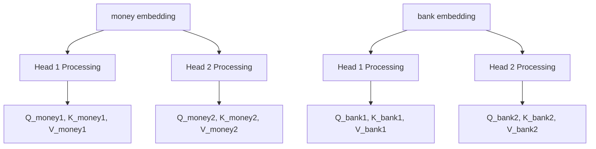

**Step 3: Parallel Self-Attention Computation**

Each head performs complete self-attention independently:

| Head 1 Computation | Head 2 Computation |
|-------------------|-------------------|
| Q_money1 · K_money1 = score₁₁ | Q_money2 · K_money2 = score₂₁ |
| Q_money1 · K_bank1 = score₁₂ | Q_money2 · K_bank2 = score₂₂ |
| Softmax([score₁₁, score₁₂]) = weights₁ | Softmax([score₂₁, score₂₂]) = weights₂ |
| weights₁ · [V_money1, V_bank1] = output₁ | weights₂ · [V_money2, V_bank2] = output₂ |

## Complete Matrix-Form Multi-Head Attention Breakdown

Let's walk through the complete mathematical implementation using our "money bank" example with 2 attention heads:

### Initial Setup: Input Processing

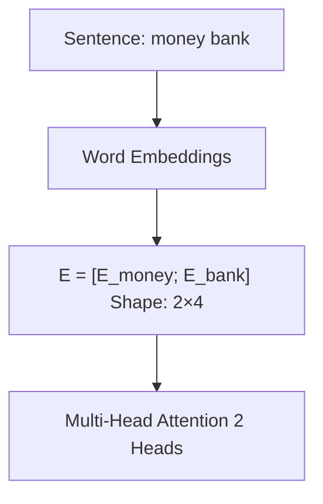

**Input Matrix:**
```
E = [money_embedding]  = [e₁, e₂, e₃, e₄]  (2×4 matrix)
    [bank_embedding ]    [e₅, e₆, e₇, e₈]
```
### Head 1 and Head 2: Weight Matrices
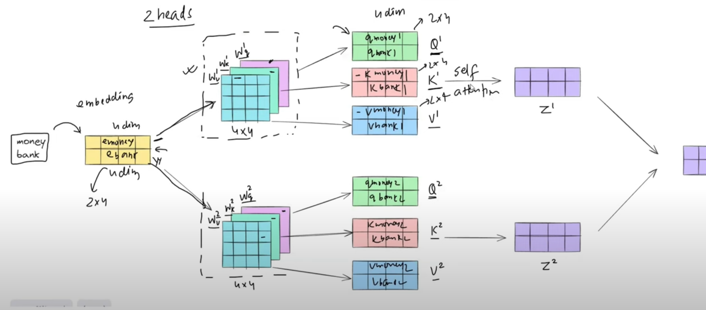
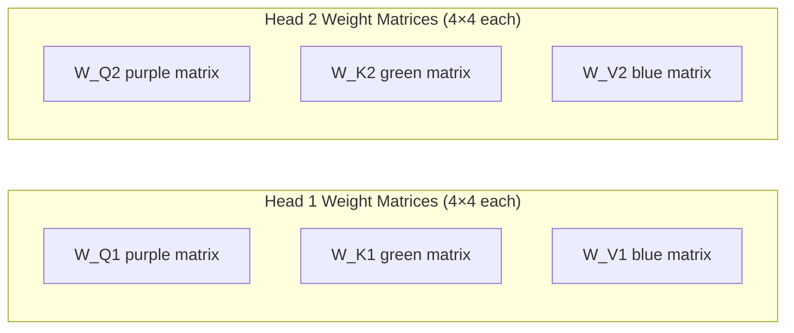

### Step-by-Step Matrix Operations

**Step 1: Generate Query, Key, Value Matrices for Both Heads**

```python
# Head 1 computations
Q1 = E @ W_Q1  # (2×4) @ (4×4) = (2×4)
K1 = E @ W_K1  # (2×4) @ (4×4) = (2×4) 
V1 = E @ W_V1  # (2×4) @ (4×4) = (2×4)

# Head 2 computations  
Q2 = E @ W_Q2  # (2×4) @ (4×4) = (2×4)
K2 = E @ W_K2  # (2×4) @ (4×4) = (2×4)
V2 = E @ W_V2  # (2×4) @ (4×4) = (2×4)
```

**Resulting Matrices:**
```
Q1 = [Q_money1]  Q2 = [Q_money2]
     [Q_bank1 ]       [Q_bank2 ]

K1 = [K_money1]  K2 = [K_money2] 
     [K_bank1 ]       [K_bank2 ]

V1 = [V_money1]  V2 = [V_money2]
     [V_bank1 ]       [V_bank2 ]
```

**Step 2: Self-Attention Computation for Each Head**

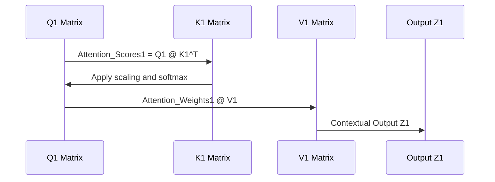

```python
# Head 1 Self-Attention
Attention_Scores1 = Q1 @ K1.T / sqrt(d_k)  # (2×4) @ (4×2) = (2×2)
Attention_Weights1 = softmax(Attention_Scores1)  # (2×2)
Z1 = Attention_Weights1 @ V1  # (2×2) @ (2×4) = (2×4)

# Head 2 Self-Attention (parallel computation)
Attention_Scores2 = Q2 @ K2.T / sqrt(d_k)  # (2×2)
Attention_Weights2 = softmax(Attention_Scores2)  # (2×2) 
Z2 = Attention_Weights2 @ V2  # (2×4)
```
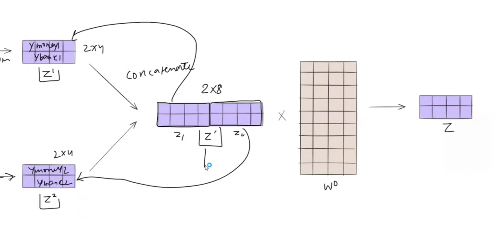

**Step 3: Concatenation and Linear Transformation**
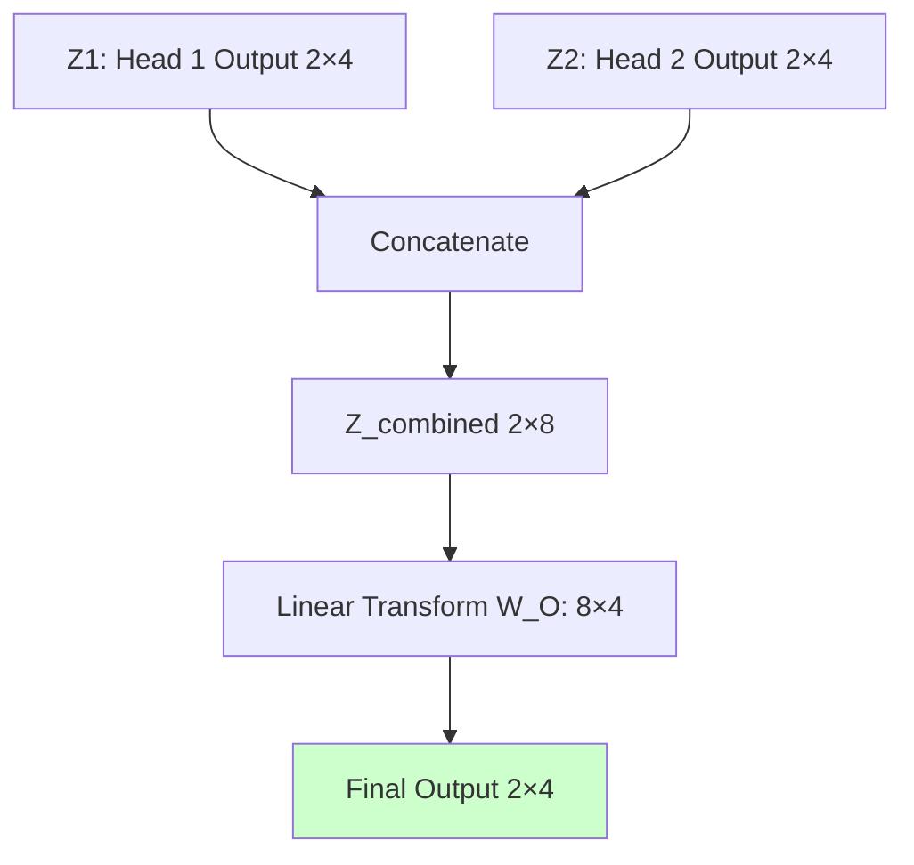

```python
# Concatenation along feature dimension
Z_combined = concatenate([Z1, Z2], axis=1)  # (2×8)

# Linear transformation to restore original dimensions
W_O = learned_weight_matrix  # (8×4) 
final_output = Z_combined @ W_O  # (2×8) @ (8×4) = (2×4)
```

**Mathematical Summary:**
```latex
\text{MultiHead}(Q,K,V) = \text{Concat}(\text{head}_1, \text{head}_2)W^O
```
where:
```latex
\text{head}_i = \text{Attention}(QW_i^Q, KW_i^K, VW_i^V)
```

## Original Transformer Paper Implementation: 8-Head Architecture with Dimension Reduction

The original "Attention Is All You Need" paper implements a more sophisticated version with **8 attention heads** and **strategic dimension reduction** for computational efficiency.

### Key Architectural Changes from Our Simple Example

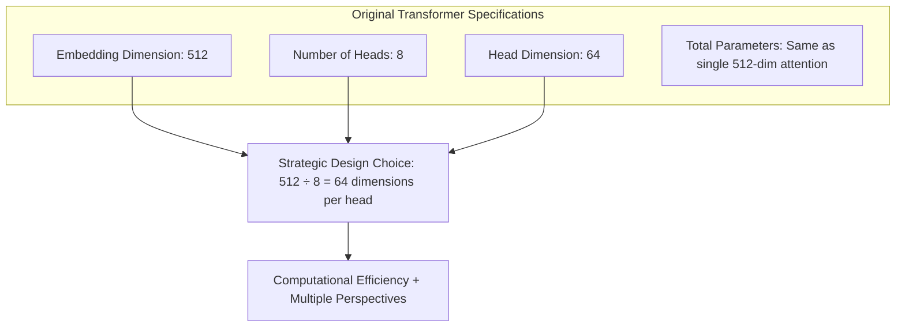

### Detailed Implementation Architecture

**Step 1: Enhanced Input Processing**

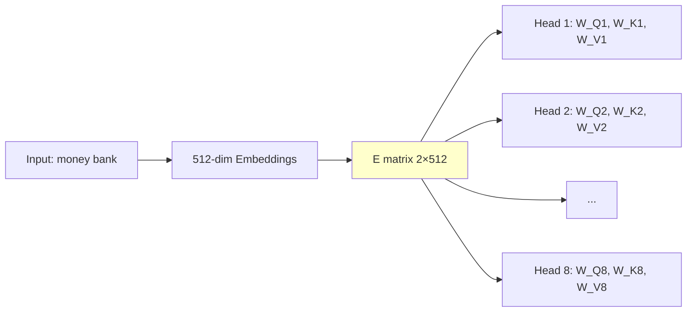

**Step 2: Dimension Reduction Through Weight Matrices**

Instead of maintaining 512 dimensions throughout, each head reduces to 64 dimensions:

```python
# Each weight matrix is 512×64 (not 512×512)
W_Q1, W_K1, W_V1 = (512, 64)  # Head 1 weights
W_Q2, W_K2, W_V2 = (512, 64)  # Head 2 weights
# ... continuing for all 8 heads
W_Q8, W_K8, W_V8 = (512, 64)  # Head 8 weights

# Resulting Q,K,V matrices for each head
Q1 = E @ W_Q1  # (2×512) @ (512×64) = (2×64)
K1 = E @ W_K1  # (2×512) @ (512×64) = (2×64)  
V1 = E @ W_V1  # (2×512) @ (512×64) = (2×64)
```

**Step 3: Parallel Self-Attention on Reduced Dimensions**

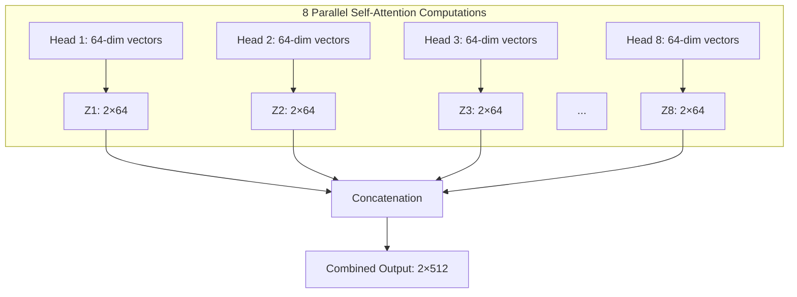

**Step 4: Final Linear Transformation**

```python
# Concatenation restores full dimensionality
Z_concat = concatenate([Z1, Z2, Z3, ..., Z8], axis=1)  # (2×512)

# Final linear transformation  
W_O = learned_matrix  # (512×512)
final_output = Z_concat @ W_O  # (2×512) @ (512×512) = (2×512)
```

### Complete Mathematical Flow

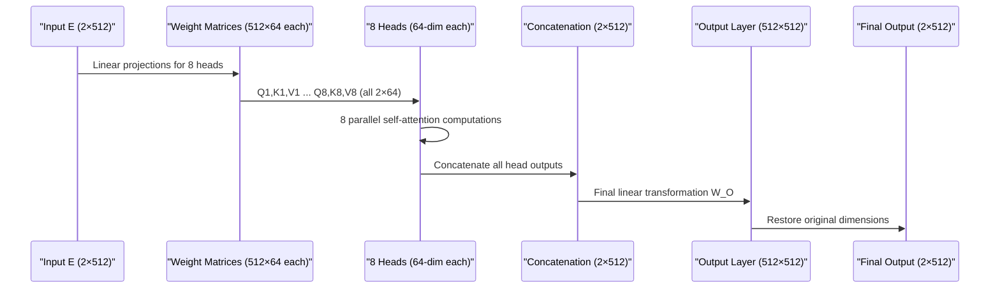

**Dimension Tracking Table:**

| Stage | Matrix Dimensions | Description |
|-------|------------------|-------------|
| Input Embeddings | 2×512 | Original word embeddings |
| Weight Matrices | 512×64 (×24 total) | 8 heads × 3 matrices each |
| Q,K,V per Head | 2×64 each | Reduced dimension vectors |
| Head Outputs | 2×64 each | Self-attention results |
| Concatenated | 2×512 | All heads combined |
| Final Output | 2×512 | After W_O transformation |

## Computational Efficiency: The Genius of Dimension Reduction

The dimension reduction strategy (512 → 64 per head) provides **the best of both worlds**: multiple perspectives without computational overhead.

### Computational Analysis

**Scenario A: Single 512-Dimension Self-Attention**
```python
# Computational complexity for single head
Q = E @ W_Q  # (2×512) @ (512×512) = O(512²) operations per attention computation
K = E @ W_K  # (2×512) @ (512×512) = O(512²) operations  
V = E @ W_V  # (2×512) @ (512×512) = O(512²) operations
# Total: ~3 × 512² operations for projections + attention computation
```

**Scenario B: 8-Head Multi-Head Attention with Dimension Reduction**
```python
# Computational complexity for 8 heads
# Each head: (2×512) @ (512×64) = O(512×64) operations
# 8 heads × 3 matrices = 24 × O(512×64) = O(8 × 3 × 512×64)
# Total: 24 × 32,768 = ~786k operations vs ~786k operations (same!)
```

### Efficiency Comparison Visualization

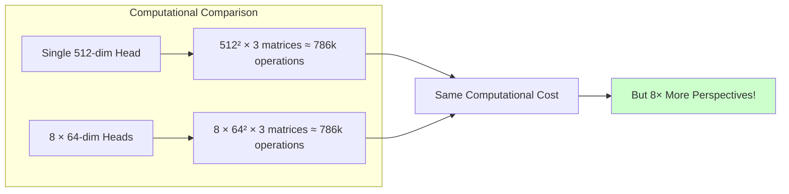

**The Strategic Advantage:**
- **Computational Cost:** Identical to single-head attention
- **Representational Power:** 8× more perspectives captured
- **Memory Efficiency:** Parallel processing of smaller matrices
- **Training Stability:** Smaller attention matrices are easier to optimize

## 🎮 Interactive Visualization: Live Multi-Head Perspective Analysis

> "यहां पर मैं आपको एक बहुत बढ़िया विजुलाइजेशन दिखाता हूं जिसके थ्रू जो भी आपने अभी पढ़ा है वो और क्लियर हो जाएगा"

The video demonstrates powerful interactive visualization that shows how different attention heads capture distinct perspectives from the same ambiguous sentence in real-time.

### 🔍 Live Demonstration: Layer-by-Layer Analysis

**🎯 Test Sentence:** *"The man saw the astronomer with a telescope"*

**📊 Layer 0, Head 0 Analysis (Tool Usage Perspective):**

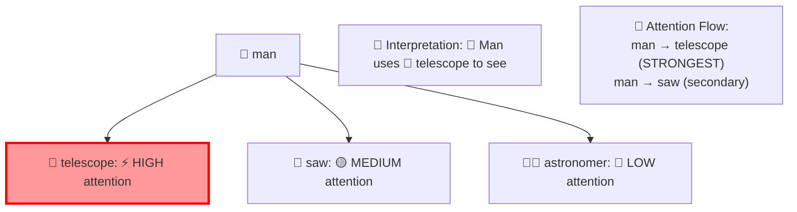

**🎮 Interactive Behavior (Head 0):**
- 🔴 **Strongest similarity:** man ↔ telescope (red highlighting)
- 🟡 **Secondary focus:** man ↔ saw  
- 📖 **Captured meaning:** The man is using the telescope as a tool

**📊 Layer 0, Head 1 Analysis (Possession Perspective):**

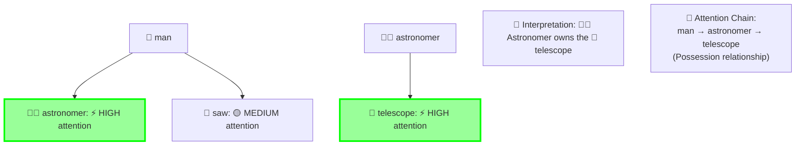

**🎮 Interactive Behavior (Head 1):**
- 🟢 **Primary connection:** man ↔ astronomer
- 🟢 **Secondary connection:** astronomer ↔ telescope
- 📖 **Captured meaning:** The astronomer possesses the telescope

### 📈 Real-Time Attention Pattern Comparison

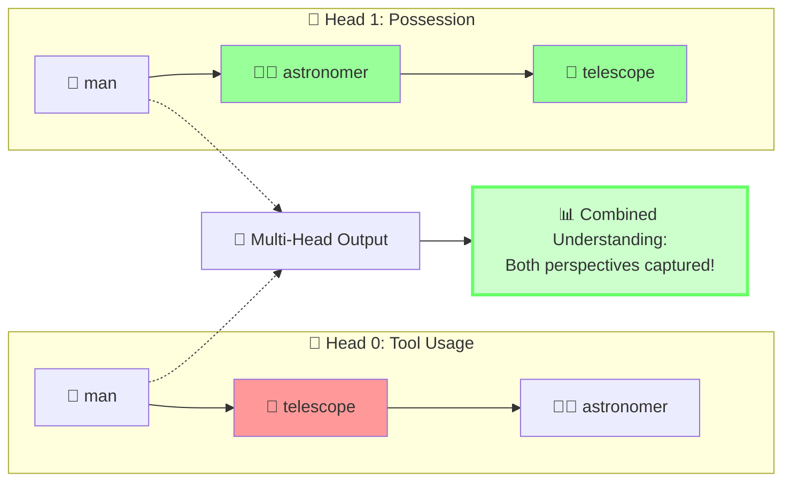

### 🎮 Interactive Exploration Dashboard

| 🎯 Head | 🔍 Primary Focus | 📖 Captured Meaning | 🌈 Visual Highlight |
|---------|------------------|---------------------|-------------------|
| **Head 0** | 👨 man → 🔭 telescope | 🔧 Tool usage perspective | 🔴 Red intensity |
| **Head 1** | 👨 man → 👨‍🚀 astronomer<br/>👨‍🚀 astronomer → 🔭 telescope | 🏠 Possession perspective | 🟢 Green intensity |

### 🎬 Live Interactive Features

**🎮 Real-Time Exploration Capabilities:**
- **🖱️ Hover Effects:** Attention weights change dynamically as you hover over words
- **📊 Multi-Layer View:** Switch between layers to see attention evolution
- **🔄 Sentence Experimentation:** Input your own ambiguous sentences for analysis
- **🎯 Head Specialization:** Observe how different heads focus on different relationship types
- **📈 Intensity Visualization:** Color intensity reflects attention strength

**🧪 Try These Live Experiments:**

```python
# 🎮 Interactive Attention Exploration
sentences_to_try = [
    "The man saw the astronomer with a telescope",      # Original example
    "The bank by the river is closed",                  # Financial vs geographical
    "Time flies like an arrow",                         # Multiple syntactic interpretations
    "The chicken is ready to eat",                      # Subject vs object ambiguity
    "I saw the girl with the binoculars"               # Tool vs possession
]

# 🔍 Watch how different heads specialize:
# - Syntactic heads: Focus on grammatical relationships
# - Semantic heads: Capture meaning-based connections
# - Positional heads: Track word order and distance
```

### 🌟 Visualization Insights and Discovery

**🔬 Key Observations from Interactive Analysis:**
- **🎯 Head Specialization:** Each head develops unique attention patterns
- **⚖️ Complementary Perspectives:** Multiple interpretations coexist
- **📊 Dynamic Attention:** Patterns adapt based on context
- **🔄 Layer Evolution:** Attention becomes more sophisticated in deeper layers

**💡 This interactive visualization proves that multi-head attention successfully captures multiple semantic interpretations simultaneously, directly addressing the core limitation of single-head self-attention!**

---

## 🎬 Create Your Own Attention Animations

### 🎞️ Attention-to-GIF Generator Tool

Want to create your own attention visualizations? Use the attention-to-gif library to generate animated GIFs showing how attention patterns evolve across transformer layers.

**🚀 Quick Setup:**
```bash
# Install the attention-to-gif library
pip install git+https://github.com/valayDave/attention_to_gif

# Required dependencies
pip install transformers torch matplotlib
```

**🎯 Generate Multi-Head Attention Animations:**
```python
from attention_to_gif import AttentionVisualizer
from transformers import AutoTokenizer, AutoModel
import torch

# Load model and tokenizer
model_name = 'bert-base-uncased'
model = AutoModel.from_pretrained(model_name, output_attentions=True)
tokenizer = AutoTokenizer.from_pretrained(model_name)

# Create visualizer
visualizer = AttentionVisualizer(model, tokenizer)

# Generate attention animation for our example sentence
sentence = "The man saw the astronomer with a telescope"
attention_data = visualizer.get_attention_data(sentence)

# Create animated GIF showing attention across all layers
visualizer.save_visualization(
    viz_name='Multi_Head_Attention_Animation.gif',
    fps=2,  # Frames per second
    head_to_viz=0,  # Visualize head 0
    figsize=(12, 8)
)

# Create comparison animation of different heads
for head in range(8):  # BERT has 8 attention heads
    visualizer.save_visualization(
        viz_name=f'Head_{head}_Attention.gif',
        fps=3,
        head_to_viz=head,
        figsize=(10, 6)
    )
```

**🎨 Customization Options:**
```python
# Advanced animation settings
visualizer.save_visualization(
    viz_name='Custom_Attention_Animation.gif',
    fps=2.5,
    head_to_viz=0,
    figsize=(14, 10),
    layer_range=(0, 12),  # Show layers 0-12
    colormap='viridis',   # Custom color scheme
    show_token_labels=True,
    animation_duration=5  # Seconds
)
```

### 🎭 Animation Types You Can Create

**1. 🔄 Layer-by-Layer Attention Evolution**
- Shows how attention patterns change from shallow to deep layers
- Reveals progression from syntactic to semantic understanding

**2. 🎯 Multi-Head Comparison Animations**
- Side-by-side visualization of different attention heads
- Demonstrates head specialization (syntax vs semantics vs position)

**3. 📊 Attention Score Heatmaps**
- Animated heatmaps showing attention weight intensity
- Token-to-token attention transitions over time

**4. 🔍 Interactive Sentence Analysis**
- Upload custom sentences and generate attention visualizations
- Perfect for testing ambiguous sentences like from the video

### 🌐 Online Animation Resources

**🎬 Ready-to-Use Animated Demos:**
- **[The Animated Transformer](https://prvnsmpth.github.io/animated-transformer/)** - Step-by-step animated walkthrough
- **[3D LLM Visualization](https://bbycroft.net/llm)** - Interactive 3D animated transformer
- **[Jay Alammar's Animations](https://jalammar.github.io/illustrated-transformer/)** - Industry-standard visual explanations with embedded animations

**🎮 Interactive Features:**
```python
# Create interactive HTML visualization  
visualizer.create_interactive_html(
    sentence="The man saw the astronomer with a telescope",
    output_file="attention_interactive.html",
    include_controls=True  # Add play/pause/speed controls
)
```

---

## Key Takeaways

- **Multi-head attention solves single-perspective limitation** of self-attention by running multiple attention computations in parallel
- **Each head captures different semantic relationships** within the same input sequence  
- **Dimension reduction strategy** (512→64 per head) maintains computational efficiency while enabling multiple perspectives
- **Linear transformation** at the end balances and combines insights from all attention heads
- **Interactive visualizations** confirm that different heads specialize in different types of relationships

## Implementation Comparison

| Aspect | Single Self-Attention | Multi-Head Attention |
|--------|----------------------|---------------------|
| Perspectives | 1 | 8 (in original paper) |
| Computational Cost | O(d²) | O(d²) (same!) |
| Weight Matrices | 3 | 24 (8×3) |
| Ambiguity Handling | Limited | Enhanced |

## Research Impact

Multi-head attention has become the foundation for:
- **BERT:** Bidirectional understanding through multiple attention perspectives
- **GPT series:** Autoregressive generation with rich contextual modeling  
- **T5, BART:** Sequence-to-sequence tasks requiring complex relationship modeling
- **Vision Transformers:** Extending multi-head attention to computer vision

The elegant simplicity of parallel self-attention heads has revolutionized how we model complex relationships in sequential data, making it one of the most influential architectural innovations in modern deep learning.

## 🎮 Interactive Learning Tools and Demonstrations

### Available Interactive Visualizations

**🎬 Animated Transformer Visualizations**
- **The Animated Transformer**: [Interactive 3D Visualization](https://prvnsmpth.github.io/animated-transformer/) - Step-by-step animated explanation
- **LLM 3D Visualization**: [3D Animated LLM](https://bbycroft.net/llm) - Interactive 3D walkthrough of transformer architecture
- **Jay Alammar's Illustrated Transformer**: [Visual Guide with Animations](https://jalammar.github.io/illustrated-transformer/) - Industry-standard visual explanations

**🔧 BertViz - Professional Attention Visualization Tool**
- **Head View Tutorial**: [Interactive Colab Demo](https://colab.research.google.com/github/jessevig/bertviz/blob/master/head_view_tutorial.ipynb)
- **Model View Tutorial**: [Multi-Layer Visualization](https://colab.research.google.com/github/jessevig/bertviz/blob/master/model_view_tutorial.ipynb)
- **GitHub Repository**: [BertViz Source Code](https://github.com/jessevig/bertviz)

**🎞️ Create Your Own Attention Animations**
- **Attention-to-GIF Generator**: [GitHub Tool](https://github.com/valayDave/attention_to_gif) - Create GIFs from attention weights
- **Custom Animation Tutorial**: Generate attention transition videos across transformer layers

**🌐 AttentionViz - Global Attention Patterns**
- **Live Demo**: [AttentionViz Tool](http://attentionviz.com/)
- **Research Paper**: [AttentionViz: A Global View of Transformer Attention](https://arxiv.org/abs/2305.03210)

**⚡ Try This Interactive Example**
```python
# Install and run BertViz in your own environment
!pip install bertviz
from bertviz import head_view
from transformers import AutoTokenizer, AutoModel

# Load model
model_name = 'bert-base-uncased'
model = AutoModel.from_pretrained(model_name, output_attentions=True)
tokenizer = AutoTokenizer.from_pretrained(model_name)

# Test the ambiguous sentence from the video
sentence = "The man saw the astronomer with a telescope"
inputs = tokenizer(sentence, return_tensors='pt')
outputs = model(**inputs)

# Visualize multi-head attention
head_view(outputs.attentions, tokenizer.convert_ids_to_tokens(inputs['input_ids'][0]))
```

### Hands-On Exploration Exercises

**🧪 Experiment 1: Attention Pattern Analysis**
- Use BertViz to analyze: "The bank by the river flows money"
- Compare how different heads interpret "bank" and "flows"
- Observe which heads focus on financial vs geographical relationships

**🧪 Experiment 2: Multi-Head Specialization**
- Input: "The guitar player plays the piano player's song"
- Track how different heads handle the ambiguous "player" relationships
- Document which heads specialize in subject vs object relationships

**🧪 Experiment 3: Layer-wise Attention Evolution**
- Use Model View to see how attention patterns change across layers
- Notice how early layers focus on syntax, later layers on semantics
- Track the evolution from local to global attention patterns

## 📚 References and Further Learning

### Academic Papers
- **Original Transformer**: Vaswani, A., et al. (2017). "Attention Is All You Need." *Neural Information Processing Systems*. [arXiv:1706.03762](https://arxiv.org/abs/1706.03762)
- **Attention Visualization**: Vig, J. (2019). "A Multiscale Visualization of Attention in the Transformer Model." [arXiv:1906.05714](https://arxiv.org/abs/1906.05714)
- **BertViz Paper**: Vig, J. (2019). "Visualizing Attention in Transformer-Based Language Representation Models." [arXiv:1904.02679](https://arxiv.org/abs/1904.02679)

### Video Resources
- **Current Video**: [Multi-head Attention in Transformers (Video 77)](https://www.youtube.com/watch?v=bX2QwpjsmuA&list=PLKnIA16_RmvYuZauWaPlRTC54KxSNLtNn&index=77)
- **Previous Context**: Videos 72-76 covering self-attention foundations
- **Next Topics**: Complete Transformer architecture implementation

### Code Implementations
- **Hugging Face Transformers**: [Official Documentation](https://huggingface.co/docs/transformers/)
- **PyTorch Implementation**: [Official Tutorial](https://pytorch.org/tutorials/beginner/transformer_tutorial.html)
- **TensorFlow/Keras**: [Transformer Tutorial](https://www.tensorflow.org/text/tutorials/transformer)

### Additional Learning Resources
- **The Illustrated Transformer**: [Jay Alammar's Visual Guide](https://jalammar.github.io/illustrated-transformer/)
- **Transformer Architecture Deep Dive**: [Lilian Weng's Blog](https://lilianweng.github.io/posts/2020-04-07-the-transformer-family/)
- **Attention Mechanisms Survey**: [Comprehensive Review](https://arxiv.org/abs/2106.05962)

[End of Notes]